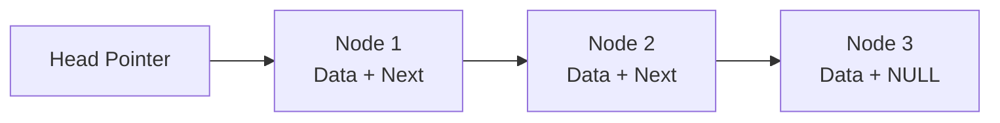
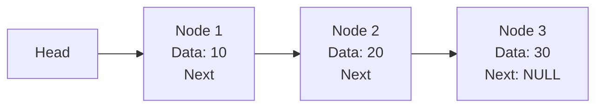
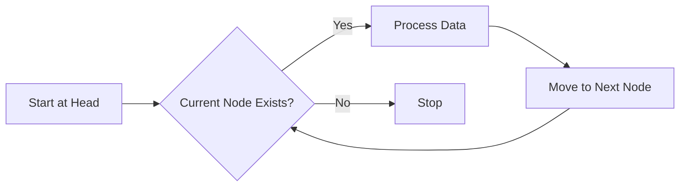
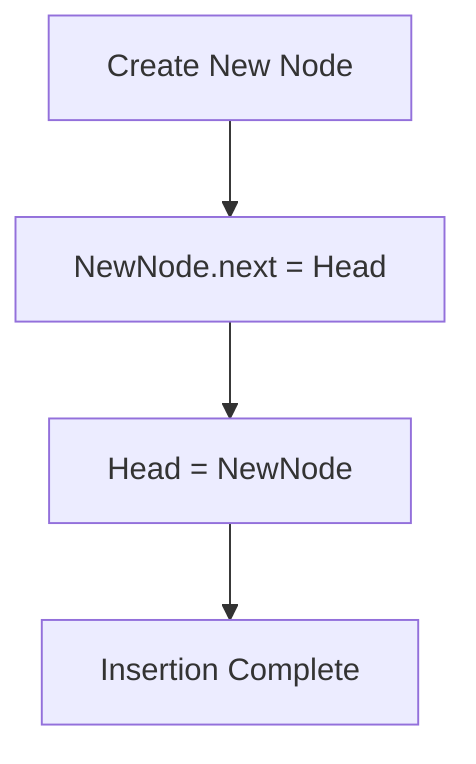
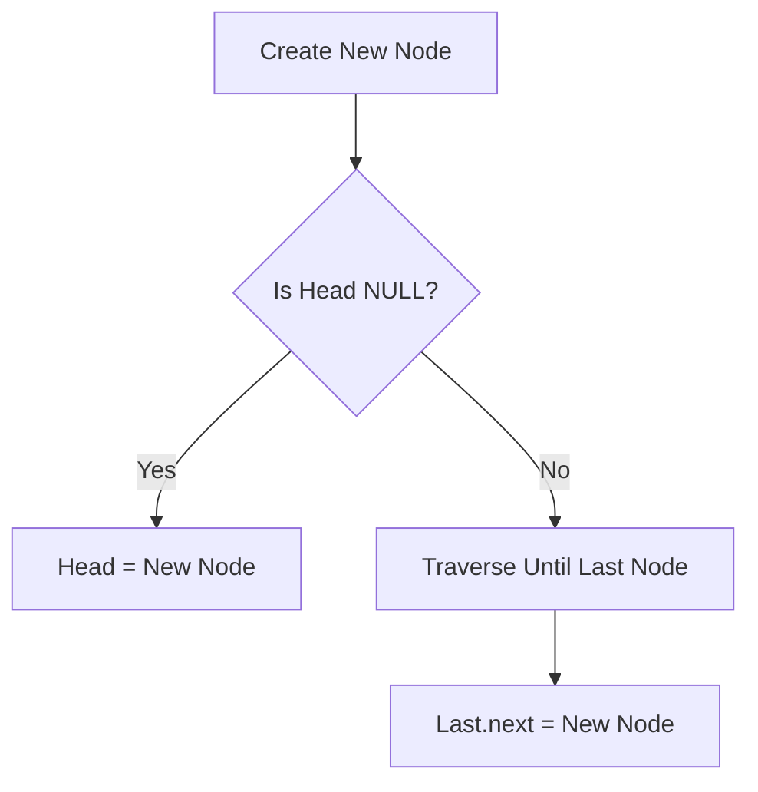
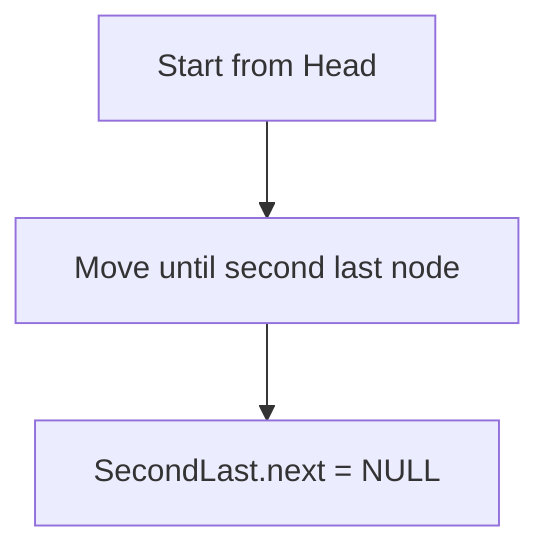
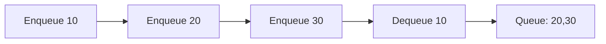

# 🧠 Linked List Data Structure (DSA)

---

### What is a Linked List?

- A **linked list** is a way to store data in a series of connected nodes.
- Each **node** contains:
  - **Data**: The value or information it holds.
  - A **pointer** (or link) to the **next node** in the list.
- Unlike arrays, linked lists do **not** store data in continuous memory locations.

### Types of Linked Lists

1. **Singly Linked List**

  - Each node points to the **next** node only.
  - The last node points to **null** (no next node).
  - You can only move forward through the list.

2. **Doubly Linked List**

  - Each node has **two pointers**:
    - One to the **next** node.
    - One to the **previous** node.
  - You can move both forward and backward.

3. **Circular Linked List**

  - The last node points back to the **first** node.
  - Can be singly or doubly linked.  

### Why Use Linked Lists?

- **Dynamic size**: You don't need to know the number of items before creating the list.
- **Easy insertion and deletion**: Adding or removing nodes doesn’t require shifting other elements (like in arrays).
- Useful when you want to frequently add or remove data.

### How Does a Linked List Work?

- Start with a **head** pointer that points to the first node in the list.
- Each node stores data and the address of the next node.
- To access any node, you start from the head and follow the pointers one by one.

---

**Structure of a Node**

Each node has two parts:

1. **Data** – Stores the actual value.
2. **Next Pointer/Reference** – Stores the address of the next node.



---

**🔗 Linked List Representation**



---

### 📌 Why Linked List?

Arrays have some limitations:

| Array | Linked List |
|---|---|
| Fixed size | Dynamic size |
| Continuous memory required | Non-continuous memory |
| Fast random access | Sequential access |
| Insertion/deletion costly | Easy insertion/deletion |
| Wastes memory when size is unknown | Grows as needed |

---

### Types of Linked Lists

#### 1. Singly Linked List

Each node points only to the next node.

```text
10 → 20 → 30 → NULL
```

---

#### 2. Doubly Linked List

Each node has two references:

- Previous node
- Next node

```text
NULL ← 10 ⇄ 20 ⇄ 30 → NULL
```

---

#### 3. Circular Linked List

The last node points back to the first node.

```text
       +----------------+
       |                |
       v                |
10 → 20 → 30 → 40 ------+
```

---

##### Node Implementation in Java

```java
class Node {

    int data;
    Node next;

    Node(int data) {
        this.data = data;
        this.next = null;
    }
}
```

---

### Singly Linked List Operations

#### 1. Traversal

Visit every node from head until `NULL`.



```java
public void display() {

    Node temp = head;

    while(temp != null) {
        System.out.print(temp.data + " -> ");
        temp = temp.next;
    }

    System.out.println("NULL");
}
```

---

#### 2. Insert at Beginning

Before:

```text
10 → 20 → 30 → NULL
```

Insert `5`

After:

```text
5 → 10 → 20 → 30 → NULL
```

**Algorithm**

1. Create a new node.
2. Make new node point to current head.
3. Update head to new node.





```java
public void insertFirst(int data) {

    Node node = new Node(data);

    node.next = head;

    head = node;
}
```

---

#### 3. Insert at End




```java
public void insertLast(int data) {

    Node node = new Node(data);

    if(head == null) {
        head = node;
        return;
    }

    Node temp = head;

    while(temp.next != null) {
        temp = temp.next;
    }

    temp.next = node;
}
```

---

#### 4. Delete First Node

Logic : Simply move the head to the next node.

```text
Before:
10 → 20 → 30

Head = head.next

After:
20 → 30
```

```java
public void deleteFirst() {

    if(head == null)
        return;

    head = head.next;
}
```

---

#### 5. Delete Last Node





```java
public void deleteLast() {

    if(head == null || head.next == null) {
        head = null;
        return;
    }

    Node temp = head;

    while(temp.next.next != null) {
        temp = temp.next;
    }

    temp.next = null;
}
```

---

#### 6. Searching

**Linear Search :** Linked List does not support binary search because random access is not possible.

```java
public boolean search(int value) {

    Node temp = head;

    while(temp != null) {

        if(temp.data == value) {
            return true;
        }

        temp = temp.next;
    }

    return false;
}
```

---

#### 7. Find Size of Linked List

```java
public int size() {

    int count = 0;

    Node temp = head;

    while(temp != null) {

        count++;
        temp = temp.next;
    }

    return count;
}
```

---

---

### Time Complexity Table

| Operation | Complexity |
|---|---|
| Access nth element | O(n) |
| Search | O(n) |
| Insert at beginning | O(1) |
| Insert at end | O(n) |
| Delete beginning | O(1) |
| Delete end | O(n) |
| Reverse | O(n) |
| Find middle | O(n) |
| Detect cycle | O(n) |

---

### Array vs Linked List

| Feature | Array | Linked List |
|---|---|---|
| Memory | Continuous | Non-continuous |
| Size | Fixed | Dynamic |
| Access | O(1) | O(n) |
| Insert/Delete at beginning | O(n) | O(1) |
| Cache Performance | Better | Lower |
| Extra Memory | No | Pointer required |

---

# Stack Data Structure in Java

A **Stack** is a simple linear data structure that works on the **LIFO (Last In, First Out)** principle. This means the last item you add is the first one you get out. Imagine a stack of plates: you place new plates on top and take plates from the top.

---

### 1. Core Stack Operations & Performance

All stack implementations support a set of basic operations that usually run very fast, in constant time — that is, **O(1)** time complexity.


| Operation      | What it Does                                                | Time Complexity | Space Complexity |
| -------------- | ----------------------------------------------------------- | --------------- | ---------------- |
| `push(E item)` | Adds an item to the top of the stack                        | O(1)            | O(1)             |
| `pop()`        | Removes and returns the top item. Throws exception if empty | O(1)            | O(1)             |
| `peek()`       | Shows the top item without removing it                      | O(1)            | O(1)             |
| `isEmpty()`    | Checks if the stack is empty                                | O(1)            | O(1)             |
| `size()`       | Returns the number of items in the stack                    | O(1)            | O(1)             |


**Key points:**

- These operations are very fast and don’t depend on how big the stack is.
- `pop()` throws an error if you try to remove an item from an empty stack.  
- `peek()` lets you see the top element without changing the stack.

---

### 2. Java Stack Implementations: Modern vs Legacy

Java provides different classes to use stacks. It’s important to pick the right one:

##### Legacy: `java.util.Stack`

- Extends the `Vector` class.
- **Synchronized**: This means it is thread-safe but slower because of performance overhead.
- Not recommended for new code, especially if your program is single-threaded.
- It’s considered **legacy code** and best avoided in modern applications.

##### Modern: Using `Deque` with `ArrayDeque`

- `Deque` stands for Double-Ended Queue.
- `ArrayDeque` implements `Deque` with a resizable array.
- It is **not synchronized** and much faster than `Stack`.
- Recommended for use as a stack in modern Java code.

##### Example: Modern vs Legacy Stack Usage

```java
import java.util.ArrayDeque;
import java.util.Deque;
import java.util.Stack;

public class JavaStackDemo {
    public static void main(String[] args) {
        // Modern recommended stack using ArrayDeque
        Deque<Integer> modernStack = new ArrayDeque<>();
        modernStack.push(10);
        modernStack.push(20);
        System.out.println("Modern Top: " + modernStack.peek()); // Prints 20
        System.out.println("Modern Pop: " + modernStack.pop());  // Removes and prints 20

        // Legacy stack (not recommended)
        Stack<Integer> legacyStack = new Stack<>();
        legacyStack.push(100);
        legacyStack.push(200);
        System.out.println("Legacy Top: " + legacyStack.peek()); // Prints 200
    }
}
```

**Summary:**

- Use `ArrayDeque` when you want a fast and simple stack.
- Avoid `Stack` unless working with legacy code or synchronization is needed.

---

#### 3. Custom Stack Implementation (Good for Interviews)

Many interviews ask you to build your own stack to show understanding of data structures and memory.

##### Option A: Fixed-Size Array Stack

This implementation uses a simple array and a variable (`top`) that keeps track of the stack’s top index.

##### Important Points:

- `top` starts at -1 to show the stack is empty.
- `push` adds an element on top and increments `top`.
- `pop` removes the element at `top` and decrements `top`.
- You must handle:
  - **Stack Overflow:** Trying to push when the stack is full.
  - **Stack Underflow:** Trying to pop when the stack is empty.

##### Partial Example Code:

```java
class ArrayStack {
    private int maxSize;
    private int[] stackArray;
    private int top;

    public ArrayStack(int size) {
        this.maxSize = size;
        this.stackArray = new int[maxSize];
        this.top = -1; // Stack is empty initially
    }

    public void push(int value) {
        if (top == maxSize - 1) {
            System.out.println("Stack Overflow! Cannot push " + value);
            return;
        }
        stackArray[++top] = value; // Add item and increase top
    }

    public int pop() {
        if (top == -1) {
            System.out.println("Stack Underflow! Cannot pop.");
            return -1; // or throw exception
        }
        return stackArray[top--]; // Return item and decrease top
    }

    public int peek() {
        if (top == -1) {
            System.out.println("Stack is empty.");
            return -1;
        }
        return stackArray[top]; // Show top item without removing
    }

    public boolean isEmpty() {
        return (top == -1);
    }

    public int size() {
        return top + 1;
    }
}
```

##### Why This Matters:

- Shows clear understanding of pointer/index management.
- Demonstrates handling edge cases like overflow and underflow.
- Builds foundational knowledge for linked list-based stacks or dynamic stacks.

---

## Summary of Key Learnings

- **Stack is LIFO:** last in, first out.
- All common stack operations (`push/pop/peek`) work in **O(1)** time.
- Use `**ArrayDeque**` with `Deque` interface for stacks in modern Java code — faster and not synchronized.
- Avoid old `Stack` class unless working with legacy or need synchronization.
- Practice building your own stack using arrays for interview success — understand boundaries and errors.
- Stack concepts apply widely in algorithms and applications like undo mechanisms, parsing, backtracking, and more.

---

# Queue Data Structure in Java

## 📌 What is a Queue?

A **Queue** is a linear data structure that follows the **FIFO (First In First Out)** principle.

This means:
- The element inserted first will be removed first.
- New elements are added from the **Rear (Back)**.
- Elements are removed from the **Front (Head)**.

### 🧠 Real Life Example

A queue is similar to a line of people waiting at a ticket counter.

Front → 👤 👤 👤 👤 ← Rear

First person enters the queue and gets served first.

```
---

# FIFO Principle
```

Enqueue(10)
Queue: [10]

Enqueue(20)
Queue: [10, 20]

Enqueue(30)
Queue: [10, 20, 30]

Dequeue()
Removed: 10

Queue: [20, 30]

---

# Queue Terminologies

## 1. Front

- The first element of the queue.
- Deletion always happens from the front.

Example:

Front
↓
[10] [20] [30] [40]

---

## 2. Rear

- The last element of the queue.
- Insertion always happens at the rear.

Example:

Rear
↓
[10] [20] [30] [40]

---

## 3. Size

- The total number of elements present in the queue.

Example:

Queue: [10, 20, 30, 40]

Size = 4

---

# Basic Operations of Queue

| Operation | Description | Time Complexity |
|---|---|---|
| Enqueue | Insert an element at the rear | O(1) |
| Dequeue | Remove an element from the front | O(1) |
| Peek/Front | Get the first element without removing it | O(1) |
| Rear | Get the last element | O(1) |
| isEmpty | Check if queue is empty | O(1) |
| isFull | Check if queue is full (array queue) | O(1) |

---

# Queue Representation

## Before Insertion

Front Rear
↓ ↓
[10] [20] [30]

```
## After Enqueue(40)
```

Front Rear
↓ ↓
[10] [20] [30] [40]

```
## After Dequeue()
```

Removed: 10

Front Rear
↓ ↓
[20] [30] [40]

---

# Queue Overflow and Underflow

## Queue Overflow

### Definition

Queue Overflow occurs when we try to insert an element into a **full queue**.

Example:

Queue capacity = 3

[10] [20] [30]

```
Trying:
```

Enqueue(40)

```
Result:
```

Queue Overflow

---

## Queue Underflow

### Definition

Queue Underflow occurs when we try to remove an element from an **empty queue**.

Example:

Queue: []

```
Trying:
```

Dequeue()

```
Result:
```

Queue Underflow

---

# Types of Queue

There are different types of queues depending on their implementation and behavior.

## 1. Simple Queue (Linear Queue)

### Definition

A simple queue follows the FIFO rule.

Insertion:

Rear → Add element

```
Deletion:
```

Remove element ← Front

### Limitation

In an array implementation, after removing elements from the front, empty spaces cannot be reused efficiently.

Example:

Initial Queue:

Front Rear
↓ ↓
[10][20][30][40][50]

After removing 10, 20:

```
  Front  Rear
    ↓      ↓
```

[ ] [ ] [30][40][50]

Although there are empty spaces at the beginning, new elements cannot be inserted when the rear reaches the end.

This problem is solved using a Circular Queue.

---

# 2. Circular Queue

## Definition

A Circular Queue connects the last position of the array back to the first position, forming a circle.

### Representation
   [0]
  /   \
[4]   [1]
 |     |
[3]---[2]
### Formula

```java
rear = (rear + 1) % size;
front = (front + 1) % size;
```

### Advantages

- Better memory utilization.
- Reuses empty spaces.
- Insertion and deletion are efficient.

------

# 3. Double Ended Queue (Deque)

## Definition

A Deque (Double Ended Queue) allows insertion and deletion from both front and rear.

```
       Front
         ↓
 [10] [20] [30] [40]
                    ↑
                   Rear
```

### Operations

- Insert Front
- Insert Rear
- Delete Front
- Delete Rear

------

# 4. Priority Queue

## Definition

In a Priority Queue, elements are removed based on their priority rather than insertion order.

### Example

Insert:

```
50, 10, 30, 20
```

Removal order:

```
10 → 20 → 30 → 50
```

### Note

Java's PriorityQueue uses a **Min Heap** by default.

------

# Implementation of Queue

Queue can be implemented using:

1. Array
2. Circular Array
3. Linked List
4. Stack (using two stacks)
5. Java Collection Framework

------

# Queue Using Array

## Structure

```
Array Index

0    1    2    3    4
|----|----|----|----|
|10  |20  |30  |    |
|----|----|----|----|
 ↑              ↑
Front          Rear
```

### Advantages

- Easy to implement.
- Direct access through indexes.

### Disadvantages

- Fixed size.
- Wastes memory after deletion in linear implementation.

------

# Queue Using Linked List

## Structure

```
Front                  Rear
 ↓                       ↓
[10|*] → [20|*] → [30|null]
```

### Advantages

- Dynamic size.
- No memory wastage.
- Enqueue and Dequeue are efficient.

------

# Queue Using Stack

Queue can also be implemented using two stacks.

## Logic

### Enqueue

- Push element into Stack 1.

### Dequeue

- If Stack 2 is empty:
  - Move all elements from Stack 1 to Stack 2.
  - Pop from Stack 2.

Example:

```
Stack1: [10,20,30]

Transfer

Stack2: [30,20,10]

Pop from Stack2

Result: 10
```

------

# Time Complexity Comparison

| Implementation | Enqueue | Dequeue | Peek |
|---|---|---|
| Simple Array | O(1) | O(n) | O(1) |
| Circular Queue | O(1) | O(1) | O(1) |
| Linked List | O(1) | O(1) | O(1) |
| Two Stacks | O(1) Amortized | O(1) Amortized | O(1) |

------

# Java Queue Interface

Java provides a Queue interface in the `java.util` package.

Common implementations:

- LinkedList
- ArrayDeque
- PriorityQueue

Example:

```java
Queue<Integer> queue = new LinkedList<>();

queue.add(10);
queue.add(20);
queue.add(30);

System.out.println(queue.peek()); // 10

queue.remove();

System.out.println(queue.peek()); // 20
```

------

# Important Queue Methods in Java

| Method    | Description                                      |
| --------- | ------------------------------------------------ |
| add(e)    | Inserts an element, throws exception if failed   |
| offer(e)  | Inserts an element, returns false if failed      |
| remove()  | Removes front element, throws exception if empty |
| poll()    | Removes front element, returns null if empty     |
| element() | Returns front element, throws exception if empty |
| peek()    | Returns front element, returns null if empty     |

------

# Queue vs Stack

| Feature   | Queue                        | Stack                       |
| --------- | ---------------------------- | --------------------------- |
| Principle | FIFO                         | LIFO                        |
| Insertion | Rear                         | Top                         |
| Deletion  | Front                        | Top                         |
| Access    | First inserted element first | Last inserted element first |
| Example   | Ticket line                  | Stack of plates             |

------

# Advantages of Queue

## ✅ Efficient Processing

Allows tasks to be processed in the order they arrive.

## ✅ Fair Resource Sharing

Every element gets a chance based on arrival order.

## ✅ Useful in Asynchronous Systems

Multiple tasks can wait until they are processed.

------

# Disadvantages of Queue

## ❌ No Random Access

Elements cannot be directly accessed like an array.

## ❌ Fixed Size in Array Implementation

A simple array queue has limited capacity.

## ❌ Searching Takes Time

Finding an element requires traversal.

------

# Applications of Queue

## Operating System

- CPU Scheduling
- Process Management
- Disk Scheduling

------

## Computer Networks

- Packet Scheduling
- Data Buffering
- Router Management

------

## Algorithms

- Breadth First Search (BFS)
- Tree Level Order Traversal
- Shortest Path Algorithms

------

## Software Systems

- Message Queues
- Task Scheduling
- Request Handling

------

# Mermaid Diagram – Queue Workflow



------

# 🧠 Important Interview Questions

## Basic

1. What is a queue?
2. Explain FIFO with an example.
3. What is the difference between a stack and a queue?
4. What are queue overflow and underflow?

------

## Intermediate

1. Why is a circular queue better than a linear queue?
2. Explain queue implementation using linked list.
3. How do you implement a queue using two stacks?
4. What is the difference between `add()` and `offer()`?

------

## Advanced

1. Why is `ArrayDeque` generally preferred over `LinkedList` for queues in Java?
2. How does a PriorityQueue work internally?
3. Explain the time complexity of different queue implementations.
4. Where is a queue used in real-world systems?

------


