# DSA


1. **Basics of DSA & Complexity Analysis**
   - Time & Space Complexity
   - Big-O, Big-Theta, Big-Omega
2. **Arrays**
   - Operations (insert, delete, search)
   - Sorting (Insertion, Bubble, Selection, Merge, Quick)
   - Searching (Linear, Binary)
3. **Strings**
   - Manipulation, Palindrome, Anagrams
   - Pattern Matching
4. **Linked Lists**
   - Singly, Doubly, Circular
   - Operations (insert, delete, reverse)
5. **Stacks & Queues**
   - Implementation using arrays & linked lists
   - Variants: Circular Queue, Priority Queue, Deque
6. **Recursion**
   - Factorial, Fibonacci, Tower of Hanoi
7. **Trees**
   - Binary Trees, Binary Search Trees
   - Traversals (Inorder, Preorder, Postorder)
   - Advanced: AVL Trees, Heaps
8. **Graphs**
   - Representation (Adjacency Matrix/List)
   - BFS, DFS
   - Shortest Path (Dijkstra, Bellman-Ford)
9. **Hashing**
   - Hash Tables, Collision Handling
10. **Advanced Algorithms**
    - Dynamic Programming (Knapsack, LCS)
    - Greedy Algorithms (Activity Selection, Huffman Coding)

---


## Basics of DSA & Complexity Analysis

### 📌 What is DSA?

- **DSA** stands for **Data Structures and Algorithms**.
- It is a way to organize data and write step-by-step instructions (algorithms) to solve problems efficiently.
- Learning DSA helps you write faster and better computer programs.

##### Common Data Structures

| Data Structure | Use Case               |
| -------------- | ---------------------- |
| Array          | Store sequential data  |
| Linked List    | Frequent insert/delete |
| Stack          | Undo, recursion        |
| Queue          | Scheduling             |
| HashMap        | Fast lookup            |
| Tree           | Hierarchical data      |
| Heap           | Priority Queue         |
| Graph          | Networks               |

------

### 📌 What is an Algorithm?

An algorithm is a finite sequence of steps to solve a problem.

**Example**

Find maximum number in an array.

```java
int max = arr[0];

for(int num : arr){
    if(num > max)
        max = num;
}

System.out.println(max);
```

------

#####  Characteristics of a Good Algorithm

- Correct
- Efficient
- Finite
- Clear
- Reusable

---

### 📌  Time & Space Complexity

##### Understanding Time & Space Complexity

- When we write an algorithm, we want to know how much time it takes and how much memory it uses.
- **Time Complexity** tells us **how long** an algorithm takes to run based on the input size.
- **Space Complexity** tells us **how much memory** an algorithm needs based on the input size.
- Input size is often shown by **n** (like number of items to sort).

##### Why do we care about complexity?

- It helps us know if the algorithm is fast enough.
- It shows if the algorithm uses too much memory.
- It helps us compare different solutions to pick the best one.

---

### 📌  These are ways to describe the complexity of algorithms.

##### Big-O Notation (O)

- **Big-O** shows the **worst-case** time or space an algorithm needs.
- It gives an upper limit on the running time.
- For example, if an algorithm is O(n), its running time grows linearly with the input size.
- Big-O helps us understand the slowest the algorithm can be.

##### Big-Theta Notation (Θ)

- **Big-Theta** gives a **tight bound**, meaning it shows both the upper and lower limits.
- It tells us the exact growth rate of the algorithm’s time or space.
- If an algorithm is Θ(n), then it grows linearly no matter what.

##### Big-Omega Notation (Ω)

- **Big-Omega** shows the **best-case** time or space required by an algorithm.
- It gives a lower bound on the running time.
- For example, Ω(1) means the algorithm takes at least constant time regardless of input size.

##### Examples to Understand

- Searching an item in a list:
  - Worst case: O(n) — you might have to check every item.
  - Best case: Ω(1) — the item might be the first one.
  - Average case: Θ(n) — generally, about half the items checked.

##### Summary

- **Time complexity** and **space complexity** measure how efficient algorithms are.
- **Big-O** tells us the worst-case scenario.
- **Big-Theta** tells us the exact behavior.
- **Big-Omega** tells us the best-case scenario.
- Using these concepts helps programmers choose the fastest and most efficient solutions.


------

### 📌 Complexity Analysis

Complexity analysis measures how efficient an algorithm is.

There are two types:

1. Time Complexity
2. Space Complexity

------

#### ⏱ Time Complexity

Measures how execution time grows as input size increases.

Input Size = **N**

------

**Common Time Complexities**

| Complexity | Name        | Example                          |
| ---------- | ----------- | -------------------------------- |
| O(1)       | Constant    | Array index access               |
| O(log n)   | Logarithmic | Binary Search                    |
| O(n)       | Linear      | Linear Search                    |
| O(n log n) | Linear Log  | Merge Sort                       |
| O(n²)      | Quadratic   | Bubble Sort                      |
| O(2ⁿ)      | Exponential | Recursive Fibonacci              |
| O(n!)      | Factorial   | Traveling Salesman (Brute Force) |

------

##### 📌 O(1) Constant Time

Execution never changes.

```java
int first = arr[0];
N=10 → 1 operation
N=1000 → 1 operation
```

------

##### 📌 O(n) Linear Time

Runs once for every element.

```java
for(int num : arr){
    System.out.println(num);
}
N=5 → 5 operations

N=1000 → 1000 operations
```

------

##### 📌 O(n²) Quadratic

Nested loops.

```java
for(int i=0;i<n;i++){
    for(int j=0;j<n;j++){
        System.out.println(i+" "+j);
    }
}
N=5

5 × 5 = 25 operations
```

------

##### 📌 O(log n)

Input size halves every iteration.

**Example:**

```java
while(low <= high){
    int mid = (low + high)/2;

    if(arr[mid] == target)
        return mid;
    else if(arr[mid] < target)
        low = mid + 1;
    else
        high = mid - 1;
}
```

**Example:**

```
1000
↓
500
↓
250
↓
125
↓
62
↓
31
...
```

------

##### 📌 O(n log n)

Combination of linear traversal and logarithmic division.

Examples

- Merge Sort
- Heap Sort
- Quick Sort (Average)

------

### 📌 Space Complexity

Measures extra memory used by an algorithm.

------

**Example 1**

```java
int sum = 0;
```

Extra memory = constant

```
O(1)
```

------

**Example 2**

```java
int[] temp = new int[n];
```

Extra memory depends on input size.

```
O(n)
```

##### 📌 Complexity Comparison

| Notation | Meaning       |
| -------- | ------------- |
| O()      | Worst Case    |
| Θ()      | Average/Exact |
| Ω()      | Best Case     |

------

### 📌 Rules for Calculating Time Complexity

##### Rule 1: Ignore Constants

```java
for(int i=0;i<n;i++)
100n

↓

O(n)
```

------

##### Rule 2: Drop Smaller Terms

```
n² + n + 100

↓

O(n²)
```

------

##### Rule 3: Sequential Loops Add

```java
for(...)
for(...)
O(n) + O(n)

↓

O(n)
```

------

##### Rule 4: Nested Loops Multiply

```java
for(...)
   for(...)
O(n × n)

↓

O(n²)
```

------

##### Time Complexity Examples

**Example 1**

```java
for(int i=0;i<n;i++)
    System.out.println(i);
O(n)
```

------

**Example 2**

```java
for(int i=0;i<n;i++)
    for(int j=0;j<n;j++)
        System.out.println(i+j);
O(n²)
```

------

**Example 3**

```java
for(int i=1;i<n;i*=2)
    System.out.println(i);
O(log n)
```

------

**Example 4**

```java
for(int i=0;i<n;i++){
    for(int j=1;j<n;j*=2){
        System.out.println(i+j);
    }
}
O(n log n)
```

------

#### Time Complexity Cheat Sheet

| Code Pattern                 | Complexity |
| ---------------------------- | ---------- |
| Single statement             | O(1)       |
| Single loop                  | O(n)       |
| Nested loops                 | O(n²)      |
| Triple nested loops          | O(n³)      |
| Loop dividing by 2           | O(log n)   |
| Loop doubling each iteration | O(log n)   |
| Divide & Conquer             | O(n log n) |
| Two independent loops        | O(n)       |
| Recursion (depends)          | Varies     |

---

## 1. Arrays

Arrays are one of the most important data structures in Java and programming in general. They help us store multiple values of the same type in a single variable. An array is a collection of items of the same variable type that are stored at contiguous memory locations. 

---

### What is an Array?

- An **array** is a collection of items stored at **contiguous memory locations**.
- All items in an array are of the **same data type** (for example, all integers or all strings).
- Arrays help store **multiple elements** using a single variable name.
- Each element in the array can be accessed by its **index**.
- Indexes start from **0** in Java. That means the first element is at position 0, the second at 1, and so on.

---

##### Declaring and Initializing Arrays

To use an array, you first need to declare it, then create or initialize it. Here's how you do that in Java:

##### Declaring an Array

```java
int[] numbers;  // declaring an array of integers
String[] names; // declaring an array of strings
```

##### Initializing an Array

- You create the array with a fixed size using the `new` keyword:

```java
numbers = new int[5]; // an array to hold 5 integers
```

- You can also declare and initialize the array at the same time:

```java
int[] numbers = new int[5];
```

- To add values immediately, you can use this:

```java
int[] numbers = {10, 20, 30, 40, 50};
```

---

##### Accessing and Modifying Array Elements

- Use the **index** to get or change values:

```java
int firstNumber = numbers[0]; // gets the first element (10)
numbers[2] = 100;             // changes the third element to 100
```

- Remember, trying to access an index outside the array size causes an **ArrayIndexOutOfBoundsException**.

---

##### Important Properties of Arrays

- **Fixed size:** The size of an array cannot be changed after creation.
- **Same data type:** Arrays store elements of the same type.
- **Indexes start at 0:** The first element is always at index 0.
- **Access speed:** Accessing elements by index is very fast (constant time, O(1)).

---

##### Example: Working with Arrays in Java

```java
public class ArrayExample {
    public static void main(String[] args) {
        // Declare and initialize an array
        int[] ages = {12, 15, 20, 30, 25};

        // Print all elements using a loop
        for (int i = 0; i < ages.length; i++) {
            System.out.println("Age at index " + i + ": " + ages[i]);
        }

        // Change the second element
        ages[1] = 16;
        System.out.println("Updated age at index 1: " + ages[1]);
    }
}
```

---

##### Using Arrays in Data Structures and Algorithms

- Arrays are basic building blocks for many algorithms.
- Used in sorting algorithms like Bubble Sort, Selection Sort, etc.
- Help store data for searching algorithms like Linear Search and Binary Search.
- Important when implementing other data structures like stacks, queues, and matrices.

---

##### Key Points to Remember

- Arrays are simple and very useful for storing multiple values.
- Size of an array is fixed and must be decided when the array is created.
- Use **loops** to work with arrays efficiently.
- Always check array boundaries to avoid errors.
- Arrays provide fast access to their elements using indexes.

---

## String Data Structure

##### 📌 Definition

A String in Java is an immutable sequence of characters. It is implemented using the java.lang.String class.

Internally (Java 9+), String stores characters in a byte[] array along with an encoding flag (LATIN1 or UTF16).

##### 🧠 Key Characteristics

| Feature               | Description                      |
| --------------------- | -------------------------------- |
| Immutable             | Cannot be changed after creation |
| Thread-safe           | Safe to share between threads    |
| Stored in String Pool | Reuses common literals           |
| Indexed               | Characters accessed by index     |
| Length fixed          | Size cannot grow or shrink       |

##### 💡 Creating Strings

##### 🧠 String Pool

Java maintains a special memory area called the String Constant Pool.

Why? Both references point to the same pooled object.

##### ⚠️ Immutability

The original string is not modified.

Correct:

##### 🔑 Important Methods

| Method             | Purpose                     |
| ------------------ | --------------------------- |
| length()           | Returns size                |
| charAt(i)          | Character at index          |
| substring()        | Extract part                |
| equals()           | Content comparison          |
| equalsIgnoreCase() | Case-insensitive comparison |
| contains()         | Checks substring            |
| startsWith()       | Prefix check                |
| endsWith()         | Suffix check                |
| replace()          | Replace characters/text     |
| split()            | Convert to array            |
| trim()             | Remove spaces               |
| toUpperCase()      | Uppercase                   |
| toLowerCase()      | Lowercase                   |

**🧪 Example**

##### 📊 Time Complexity

| Operation   | Complexity |
| ----------- | ---------- |
| charAt()    | O(1)       |
| length()    | O(1)       |
| equals()    | O(n)       |
| substring() | O(n)       |
| concat()    | O(n)       |
| replace()   | O(n)       |
| split()     | O(n)       |

##### 🔄 String vs StringBuilder vs StringBuffer

| Feature     | String           | StringBuilder           | StringBuffer           |
| ----------- | ---------------- | ----------------------- | ---------------------- |
| Mutable     | ❌                | ✅                       | ✅                      |
| Thread-safe | ✅                | ❌                       | ✅                      |
| Performance | Slow for changes | Fast                    | Medium                 |
| Use case    | Read-only text   | Single-threaded updates | Multi-threaded updates |

##### ⚠️ Common Interview Questions

1. ##### Why is String immutable?

Security, thread safety, caching, and String Pool optimization.

2. ##### Difference between == and equals()?

| Operator | Checks             |
| -------- | ------------------ |
| ==       | Reference equality |
| equals() | Content equality   |

3. ##### What is String interning?

Moving/reusing strings in the String Pool.

4. ##### Why use StringBuilder in loops?

Repeated concatenation creates many temporary String objects.

---

# 🧠 Linked List Data Structure (DSA)

### What is a Linked List?

- A **linked list** is a way to store data in a series of connected nodes.
- Each **node** contains:
  - **Data**: The value or information it holds.
  - A **pointer** (or link) to the **next node** in the list.
- Unlike arrays, linked lists do **not** store data in continuous memory locations.

### Types of Linked Lists

1. **Singly Linked List**

  - Each node points to the **next** node only.
  - The last node points to **null** (no next node).
  - You can only move forward through the list.

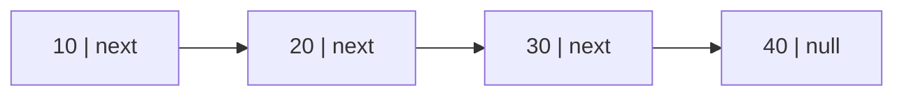


2. **Doubly Linked List**

  - Each node has **two pointers**:
    - One to the **next** node.
    - One to the **previous** node.
  - You can move both forward and backward.

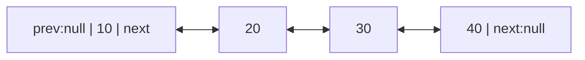


3. **Circular Linked List**

  - The last node points back to the **first** node.
  - Can be singly or doubly linked.  

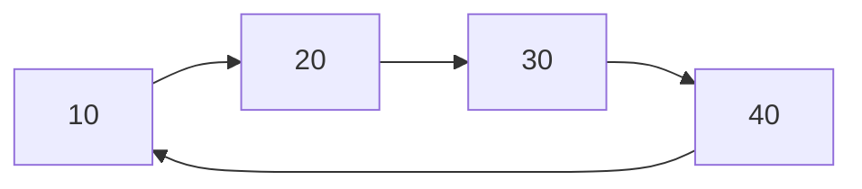


### Why Use Linked Lists?

- **Dynamic size**: You don't need to know the number of items before creating the list.
- **Easy insertion and deletion**: Adding or removing nodes doesn’t require shifting other elements (like in arrays).
- Useful when you want to frequently add or remove data.

### How Does a Linked List Work?

- Start with a **head** pointer that points to the first node in the list.
- Each node stores data and the address of the next node.
- To access any node, you start from the head and follow the pointers one by one.

---

#### **Structure of a Node**

Each node has two parts:

1. **Data** – Stores the actual value.
2. **Next Pointer/Reference** – Stores the address of the next node.

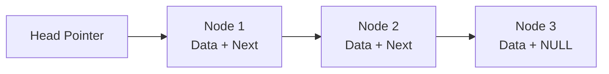

---

**🔗 Linked List Representation**

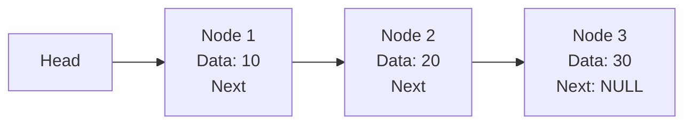

---

### 📌 Why Linked List?

Arrays have some limitations:

| Array | Linked List |
|---|---|
| Fixed size | Dynamic size |
| Continuous memory required | Non-continuous memory |
| Fast random access | Sequential access |
| Insertion/deletion costly | Easy insertion/deletion |
| Wastes memory when size is unknown | Grows as needed |

---

### Singly Linked List Operations

#### 1. Traversal

Visit every node from head until `NULL`.

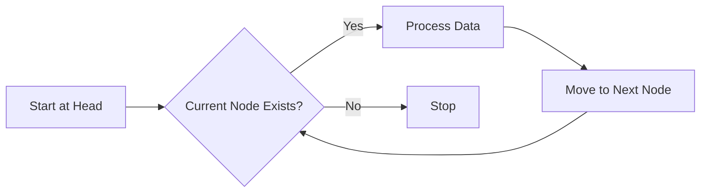

```java
public void display() {

    Node temp = head;

    while(temp != null) {
        System.out.print(temp.data + " -> ");
        temp = temp.next;
    }

    System.out.println("NULL");
}
```

---

#### 2. Insert at Beginning

Before:

```text
10 → 20 → 30 → NULL
```

Insert `5`

After:

```text
5 → 10 → 20 → 30 → NULL
```

**Algorithm**

1. Create a new node.
2. Make new node point to current head.
3. Update head to new node.


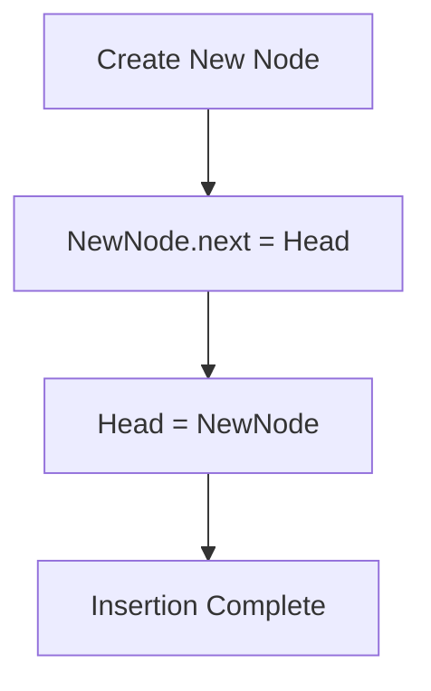


```java
public void insertFirst(int data) {

    Node node = new Node(data);

    node.next = head;

    head = node;
}
```

---

#### 3. Insert at End

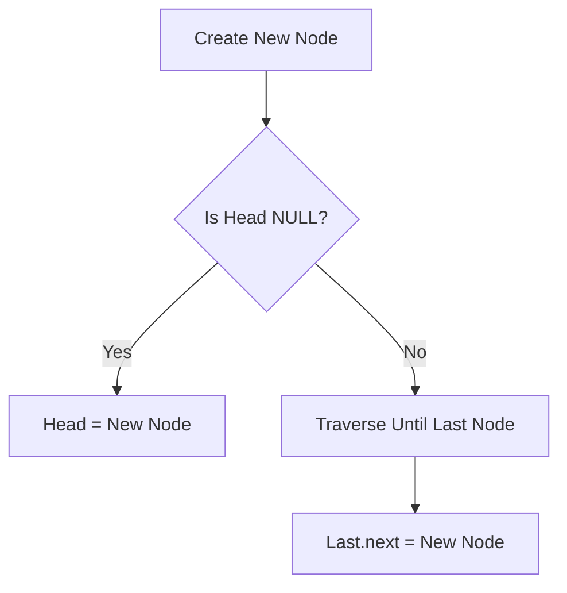


```java
public void insertLast(int data) {

    Node node = new Node(data);

    if(head == null) {
        head = node;
        return;
    }

    Node temp = head;

    while(temp.next != null) {
        temp = temp.next;
    }

    temp.next = node;
}
```

---

#### 4. Delete First Node

Logic : Simply move the head to the next node.

```text
Before:
10 → 20 → 30

Head = head.next

After:
20 → 30
```

```java
public void deleteFirst() {

    if(head == null)
        return;

    head = head.next;
}
```

---

#### 5. Delete Last Node


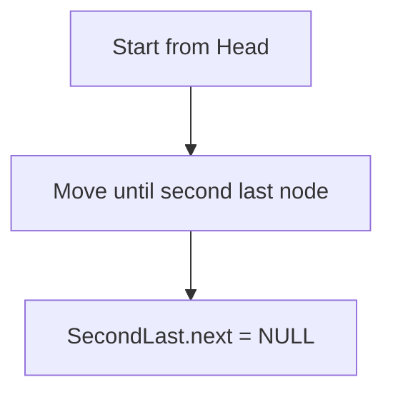


```java
public void deleteLast() {

    if(head == null || head.next == null) {
        head = null;
        return;
    }

    Node temp = head;

    while(temp.next.next != null) {
        temp = temp.next;
    }

    temp.next = null;
}
```

---

#### 6. Searching

**Linear Search :** Linked List does not support binary search because random access is not possible.

```java
public boolean search(int value) {

    Node temp = head;

    while(temp != null) {

        if(temp.data == value) {
            return true;
        }

        temp = temp.next;
    }

    return false;
}
```

---

#### 7. Find Size of Linked List

```java
public int size() {

    int count = 0;

    Node temp = head;

    while(temp != null) {

        count++;
        temp = temp.next;
    }

    return count;
}
```

---

---

### Time Complexity Table

| Operation | Complexity |
|---|---|
| Access nth element | O(n) |
| Search | O(n) |
| Insert at beginning | O(1) |
| Insert at end | O(n) |
| Delete beginning | O(1) |
| Delete end | O(n) |
| Reverse | O(n) |
| Find middle | O(n) |
| Detect cycle | O(n) |

---

---

# Stack Data Structure in Java

A **Stack** is a simple linear data structure that works on the **LIFO (Last In, First Out)** principle. This means the last item you add is the first one you get out. Imagine a stack of plates: you place new plates on top and take plates from the top.

---

### 1. Core Stack Operations & Performance

All stack implementations support a set of basic operations that usually run very fast, in constant time — that is, **O(1)** time complexity.


| Operation      | What it Does                                                | Time Complexity | Space Complexity |
| -------------- | ----------------------------------------------------------- | --------------- | ---------------- |
| `push(E item)` | Adds an item to the top of the stack                        | O(1)            | O(1)             |
| `pop()`        | Removes and returns the top item. Throws exception if empty | O(1)            | O(1)             |
| `peek()`       | Shows the top item without removing it                      | O(1)            | O(1)             |
| `isEmpty()`    | Checks if the stack is empty                                | O(1)            | O(1)             |
| `size()`       | Returns the number of items in the stack                    | O(1)            | O(1)             |

**Key points:**

- These operations are very fast and don’t depend on how big the stack is.
- `pop()` throws an error if you try to remove an item from an empty stack.  
- `peek()` lets you see the top element without changing the stack.

---

### 2. Java Stack Implementations: Modern vs Legacy

Java provides different classes to use stacks. It’s important to pick the right one:

##### Legacy: `java.util.Stack`

- Extends the `Vector` class.
- **Synchronized**: This means it is thread-safe but slower because of performance overhead.
- Not recommended for new code, especially if your program is single-threaded.
- It’s considered **legacy code** and best avoided in modern applications.

##### Modern: Using `Deque` with `ArrayDeque`

- `Deque` stands for Double-Ended Queue.
- `ArrayDeque` implements `Deque` with a resizable array.
- It is **not synchronized** and much faster than `Stack`.
- Recommended for use as a stack in modern Java code.

##### Example: Modern vs Legacy Stack Usage

```java
import java.util.ArrayDeque;
import java.util.Deque;
import java.util.Stack;

public class JavaStackDemo {
    public static void main(String[] args) {
        // Modern recommended stack using ArrayDeque
        Deque<Integer> modernStack = new ArrayDeque<>();
        modernStack.push(10);
        modernStack.push(20);
        System.out.println("Modern Top: " + modernStack.peek()); // Prints 20
        System.out.println("Modern Pop: " + modernStack.pop());  // Removes and prints 20

        // Legacy stack (not recommended)
        Stack<Integer> legacyStack = new Stack<>();
        legacyStack.push(100);
        legacyStack.push(200);
        System.out.println("Legacy Top: " + legacyStack.peek()); // Prints 200
    }
}
```

**Summary:**

- Use `ArrayDeque` when you want a fast and simple stack.
- Avoid `Stack` unless working with legacy code or synchronization is needed.

---

#### 3. Custom Stack Implementation (Good for Interviews)

Many interviews ask you to build your own stack to show understanding of data structures and memory.

##### Option A: Fixed-Size Array Stack

This implementation uses a simple array and a variable (`top`) that keeps track of the stack’s top index.

##### Important Points:

- `top` starts at -1 to show the stack is empty.
- `push` adds an element on top and increments `top`.
- `pop` removes the element at `top` and decrements `top`.
- You must handle:
  - **Stack Overflow:** Trying to push when the stack is full.
  - **Stack Underflow:** Trying to pop when the stack is empty.

##### Partial Example Code:

```java
class ArrayStack {
    private int maxSize;
    private int[] stackArray;
    private int top;

    public ArrayStack(int size) {
        this.maxSize = size;
        this.stackArray = new int[maxSize];
        this.top = -1; // Stack is empty initially
    }

    public void push(int value) {
        if (top == maxSize - 1) {
            System.out.println("Stack Overflow! Cannot push " + value);
            return;
        }
        stackArray[++top] = value; // Add item and increase top
    }

    public int pop() {
        if (top == -1) {
            System.out.println("Stack Underflow! Cannot pop.");
            return -1; // or throw exception
        }
        return stackArray[top--]; // Return item and decrease top
    }

    public int peek() {
        if (top == -1) {
            System.out.println("Stack is empty.");
            return -1;
        }
        return stackArray[top]; // Show top item without removing
    }

    public boolean isEmpty() {
        return (top == -1);
    }

    public int size() {
        return top + 1;
    }
}
```

##### Why This Matters:

- Shows clear understanding of pointer/index management.
- Demonstrates handling edge cases like overflow and underflow.
- Builds foundational knowledge for linked list-based stacks or dynamic stacks.

---

##### Summary of Key Learnings

- **Stack is LIFO:** last in, first out.
- All common stack operations (`push/pop/peek`) work in **O(1)** time.
- Use `**ArrayDeque**` with `Deque` interface for stacks in modern Java code — faster and not synchronized.
- Avoid old `Stack` class unless working with legacy or need synchronization.
- Practice building your own stack using arrays for interview success — understand boundaries and errors.
- Stack concepts apply widely in algorithms and applications like undo mechanisms, parsing, backtracking, and more.

---


## Queue Data Structure in Java

### 📌 What is a Queue?

A **Queue** is a linear data structure that follows the **FIFO (First In First Out)** principle.

This means:
- The element inserted first will be removed first.
- New elements are added from the **Rear (Back)**.
- Elements are removed from the **Front (Head)**.

##### 🧠 Real Life Example

A queue is similar to a line of people waiting at a ticket counter.

Front → 👤 👤 👤 👤 ← Rear

First person enters the queue and gets served first.

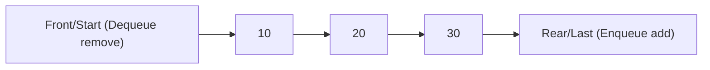


---

#### Queue Terminologies

##### 1. Front

- The first element of the queue.
- Deletion always happens from the front.

**Example:**

Front
↓
[10] [20] [30] [40]

---

##### 2. Rear

- The last element of the queue.
- Insertion always happens at the rear.

**Example:**

Rear
↓
[10] [20] [30] [40]

---

##### 3. Size

- The total number of elements present in the queue.

**Example:**

Queue: [10, 20, 30, 40]

Size = 4

---

#### Basic Operations of Queue

| Operation | Description | Time Complexity |
|---|---|---|
| Enqueue | Insert an element at the rear (last)(back) | O(1) |
| Dequeue | Remove an element from the front(starting) | O(1) |
| Peek/Front | Get the first element without removing it | O(1) |
| Rear | Get the last element | O(1) |
| isEmpty | Check if queue is empty | O(1) |
| isFull | Check if queue is full (array queue) | O(1) |

---

### Queue Overflow and Underflow

---

##### Queue Overflow

Queue Overflow occurs when we try to insert an element into a **full queue**.

**Example:**

Queue capacity = 3

[10] [20] [30]

```
Trying:
```

Enqueue(40)

```
Result:
```

Queue Overflow

---

##### Queue Underflow

Queue Underflow occurs when we try to remove an element from an **empty queue**.

**Example:**

Queue: []

```
Trying:
```

Dequeue()

```
Result:
```

Queue Underflow

---

### Types of Queue

There are different types of queues depending on their implementation and behavior.

#### 1. Simple Queue (Linear Queue)

A simple queue follows the FIFO rule.

Insertion:

Rear → Add element

```
Deletion:
```

Remove element ← Front

**Limitation**

In an array implementation, after removing elements from the front, empty spaces cannot be reused efficiently.

Example:

Initial Queue:

Front Rear
↓ ↓
[10][20][30][40][50]

After removing 10, 20:

```
  Front  Rear
    ↓      ↓
```

[ ] [ ] [30][40][50]

Although there are empty spaces at the beginning, new elements cannot be inserted when the rear reaches the end.

This problem is solved using a Circular Queue.

---

#### 2. Circular Queue

## Definition

A Circular Queue connects the last position of the array back to the first position, forming a circle.

### Representation
   [0]
  /   \
[4]   [1]
 |     |
[3]---[2]
### Formula

```java
rear = (rear + 1) % size;
front = (front + 1) % size;
```

### Advantages

- Better memory utilization.
- Reuses empty spaces.
- Insertion and deletion are efficient.

------

#### 3. Double Ended Queue (Deque)

## Definition

A Deque (Double Ended Queue) allows insertion and deletion from both front and rear.

```
       Front
         ↓
 [10] [20] [30] [40]
                    ↑
                   Rear
```

### Operations

- Insert Front
- Insert Rear
- Delete Front
- Delete Rear

------

#### 4. Priority Queue

## Definition

In a Priority Queue, elements are removed based on their priority rather than insertion order.

### Example

Insert:

```
50, 10, 30, 20
```

Removal order:

```
10 → 20 → 30 → 50
```

### Note

Java's PriorityQueue uses a **Min Heap** by default.

------

# Implementation of Queue

Queue can be implemented using:

1. Array
2. Circular Array
3. Linked List
4. Stack (using two stacks)
5. Java Collection Framework

------

# Queue Using Array

## Structure

```
Array Index

0    1    2    3    4
|----|----|----|----|
|10  |20  |30  |    |
|----|----|----|----|
 ↑              ↑
Front          Rear
```

### Advantages

- Easy to implement.
- Direct access through indexes.

### Disadvantages

- Fixed size.
- Wastes memory after deletion in linear implementation.

------

# Queue Using Linked List

## Structure

```
Front                  Rear
 ↓                       ↓
[10|*] → [20|*] → [30|null]
```

### Advantages

- Dynamic size.
- No memory wastage.
- Enqueue and Dequeue are efficient.

------

# Queue Using Stack

Queue can also be implemented using two stacks.

## Logic

### Enqueue

- Push element into Stack 1.

### Dequeue

- If Stack 2 is empty:
  - Move all elements from Stack 1 to Stack 2.
  - Pop from Stack 2.

Example:

```
Stack1: [10,20,30]

Transfer

Stack2: [30,20,10]

Pop from Stack2

Result: 10
```

------

# Time Complexity Comparison

| Implementation | Enqueue | Dequeue | Peek |
|---|---|---|
| Simple Array | O(1) | O(n) | O(1) |
| Circular Queue | O(1) | O(1) | O(1) |
| Linked List | O(1) | O(1) | O(1) |
| Two Stacks | O(1) Amortized | O(1) Amortized | O(1) |

------

# Java Queue Interface

Java provides a Queue interface in the `java.util` package.

Common implementations:

- LinkedList
- ArrayDeque
- PriorityQueue

Example:

```java
Queue<Integer> queue = new LinkedList<>();

queue.add(10);
queue.add(20);
queue.add(30);

System.out.println(queue.peek()); // 10

queue.remove();

System.out.println(queue.peek()); // 20
```

------

# Important Queue Methods in Java

| Method    | Description                                      |
| --------- | ------------------------------------------------ |
| add(e)    | Inserts an element, throws exception if failed   |
| offer(e)  | Inserts an element, returns false if failed      |
| remove()  | Removes front element, throws exception if empty |
| poll()    | Removes front element, returns null if empty     |
| element() | Returns front element, throws exception if empty |
| peek()    | Returns front element, returns null if empty     |

------

# Queue vs Stack

| Feature   | Queue                        | Stack                       |
| --------- | ---------------------------- | --------------------------- |
| Principle | FIFO                         | LIFO                        |
| Insertion | Rear                         | Top                         |
| Deletion  | Front                        | Top                         |
| Access    | First inserted element first | Last inserted element first |
| Example   | Ticket line                  | Stack of plates             |

------

# Advantages of Queue

## ✅ Efficient Processing

Allows tasks to be processed in the order they arrive.

## ✅ Fair Resource Sharing

Every element gets a chance based on arrival order.

## ✅ Useful in Asynchronous Systems

Multiple tasks can wait until they are processed.

------

# Disadvantages of Queue

## ❌ No Random Access

Elements cannot be directly accessed like an array.

## ❌ Fixed Size in Array Implementation

A simple array queue has limited capacity.

## ❌ Searching Takes Time

Finding an element requires traversal.

------

# Applications of Queue

## Operating System

- CPU Scheduling
- Process Management
- Disk Scheduling

------

## Computer Networks

- Packet Scheduling
- Data Buffering
- Router Management

------

## Algorithms

- Breadth First Search (BFS)
- Tree Level Order Traversal
- Shortest Path Algorithms

------

## Software Systems

- Message Queues
- Task Scheduling
- Request Handling

------

# Mermaid Diagram – Queue Workflow

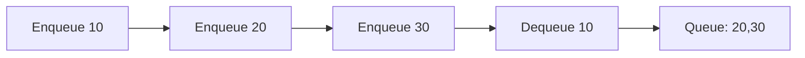

------

# 🧠 Important Interview Questions

## Basic

1. What is a queue?
2. Explain FIFO with an example.
3. What is the difference between a stack and a queue?
4. What are queue overflow and underflow?

------

## Intermediate

1. Why is a circular queue better than a linear queue?
2. Explain queue implementation using linked list.
3. How do you implement a queue using two stacks?
4. What is the difference between `add()` and `offer()`?

------

## Advanced

1. Why is `ArrayDeque` generally preferred over `LinkedList` for queues in Java?
2. How does a PriorityQueue work internally?
3. Explain the time complexity of different queue implementations.
4. Where is a queue used in real-world systems?

------


