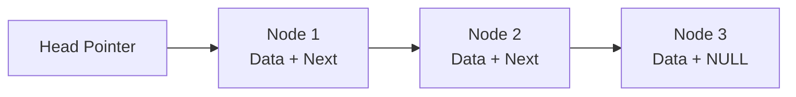
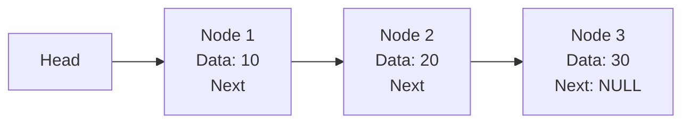
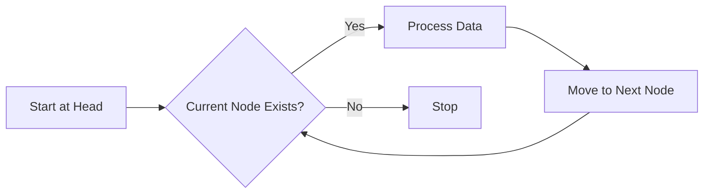
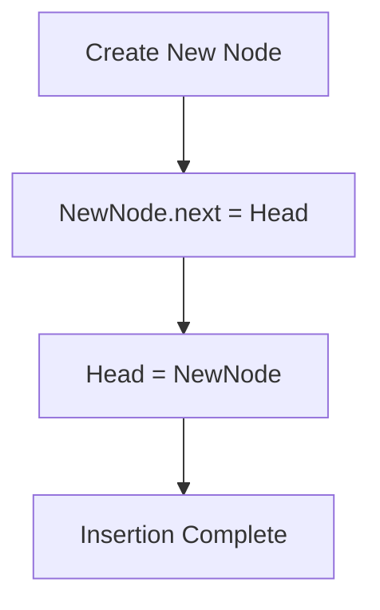
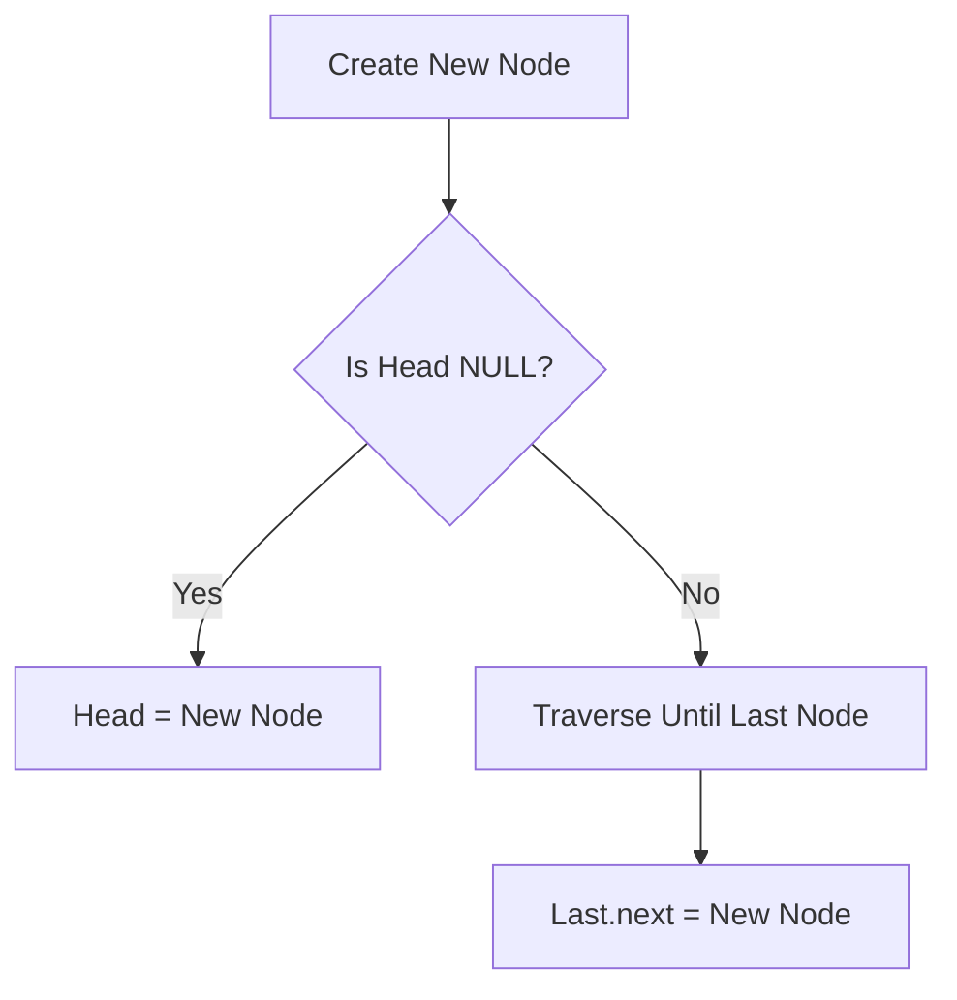
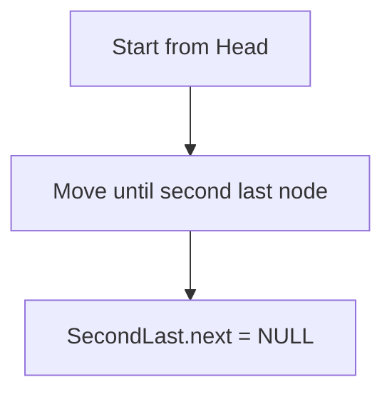
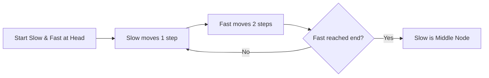

# 🧠 Linked List Data Structure (DSA)

---

### What is a Linked List?

- A **linked list** is a way to store data in a series of connected nodes.
- Each **node** contains:
  - **Data**: The value or information it holds.
  - A **pointer** (or link) to the **next node** in the list.
- Unlike arrays, linked lists do **not** store data in continuous memory locations.

### Types of Linked Lists

1. **Singly Linked List**

  - Each node points to the **next** node only.
  - The last node points to **null** (no next node).
  - You can only move forward through the list.

2. **Doubly Linked List**

  - Each node has **two pointers**:
    - One to the **next** node.
    - One to the **previous** node.
  - You can move both forward and backward.

3. **Circular Linked List**

  - The last node points back to the **first** node.
  - Can be singly or doubly linked.  

### Why Use Linked Lists?

- **Dynamic size**: You don't need to know the number of items before creating the list.
- **Easy insertion and deletion**: Adding or removing nodes doesn’t require shifting other elements (like in arrays).
- Useful when you want to frequently add or remove data.

### How Does a Linked List Work?

- Start with a **head** pointer that points to the first node in the list.
- Each node stores data and the address of the next node.
- To access any node, you start from the head and follow the pointers one by one.

---

**Structure of a Node**

Each node has two parts:

1. **Data** – Stores the actual value.
2. **Next Pointer/Reference** – Stores the address of the next node.



---

**🔗 Linked List Representation**



---

### 📌 Why Linked List?

Arrays have some limitations:

| Array | Linked List |
|---|---|
| Fixed size | Dynamic size |
| Continuous memory required | Non-continuous memory |
| Fast random access | Sequential access |
| Insertion/deletion costly | Easy insertion/deletion |
| Wastes memory when size is unknown | Grows as needed |

---

### Types of Linked Lists

#### 1. Singly Linked List

Each node points only to the next node.

```text
10 → 20 → 30 → NULL
```

---

#### 2. Doubly Linked List

Each node has two references:

- Previous node
- Next node

```text
NULL ← 10 ⇄ 20 ⇄ 30 → NULL
```

---

#### 3. Circular Linked List

The last node points back to the first node.

```text
       +----------------+
       |                |
       v                |
10 → 20 → 30 → 40 ------+
```

---

##### Node Implementation in Java

```java
class Node {

    int data;
    Node next;

    Node(int data) {
        this.data = data;
        this.next = null;
    }
}
```

---

### Singly Linked List Operations

#### 1. Traversal

Visit every node from head until `NULL`.



```java
public void display() {

    Node temp = head;

    while(temp != null) {
        System.out.print(temp.data + " -> ");
        temp = temp.next;
    }

    System.out.println("NULL");
}
```

---

#### 2. Insert at Beginning

Before:

```text
10 → 20 → 30 → NULL
```

Insert `5`

After:

```text
5 → 10 → 20 → 30 → NULL
```

**Algorithm**

1. Create a new node.
2. Make new node point to current head.
3. Update head to new node.





```java
public void insertFirst(int data) {

    Node node = new Node(data);

    node.next = head;

    head = node;
}
```

---

#### 3. Insert at End




```java
public void insertLast(int data) {

    Node node = new Node(data);

    if(head == null) {
        head = node;
        return;
    }

    Node temp = head;

    while(temp.next != null) {
        temp = temp.next;
    }

    temp.next = node;
}
```

---

#### 4. Delete First Node

Logic : Simply move the head to the next node.

```text
Before:
10 → 20 → 30

Head = head.next

After:
20 → 30
```

```java
public void deleteFirst() {

    if(head == null)
        return;

    head = head.next;
}
```

---

#### 5. Delete Last Node





```java
public void deleteLast() {

    if(head == null || head.next == null) {
        head = null;
        return;
    }

    Node temp = head;

    while(temp.next.next != null) {
        temp = temp.next;
    }

    temp.next = null;
}
```

---

#### 6. Searching

**Linear Search :** Linked List does not support binary search because random access is not possible.

```java
public boolean search(int value) {

    Node temp = head;

    while(temp != null) {

        if(temp.data == value) {
            return true;
        }

        temp = temp.next;
    }

    return false;
}
```

---

#### 7. Find Size of Linked List

```java
public int size() {

    int count = 0;

    Node temp = head;

    while(temp != null) {

        count++;
        temp = temp.next;
    }

    return count;
}
```

---

### ⭐ Most Important Interview Question

#### Reverse a Linked List

### Before

```text
Head
 |
 v
1 → 2 → 3 → 4 → NULL
```

#### After

```text
Head
 |
 v
4 → 3 → 2 → 1 → NULL
```

---

### Three Pointer Technique

We use:

1. `prev`
2. `current`
3. `next`

```text
prev      current       next

NULL        1            2
```

---

### Reverse Flow


---

## Java Implementation

```java
public void reverse() {

    Node prev = null;
    Node current = head;

    while(current != null) {

        Node next = current.next;

        current.next = prev;

        prev = current;

        current = next;
    }

    head = prev;
}
```

---

# 🐢 Floyd Cycle Detection Algorithm

## Problem

Find whether a Linked List contains a cycle.

---

## Approach

Use two pointers:

- Slow Pointer → Moves 1 step
- Fast Pointer → Moves 2 steps

If both pointers meet, a cycle exists.

---

### Visualization

```text
Slow:  1 → 2 → 3 → 4

Fast:  1 → 3 → 1 → 3
```

---

### Code

```java
public boolean hasCycle(Node head) {

    Node slow = head;
    Node fast = head;

    while(fast != null && fast.next != null) {

        slow = slow.next;
        fast = fast.next.next;

        if(slow == fast)
            return true;
    }

    return false;
}
```

---

# Find Middle of Linked List

## Two Pointer Approach

- Slow moves one step.
- Fast moves two steps.

When fast reaches the end, slow reaches the middle.

---

### Flow



---

### Java Code

```java
public Node middleNode(Node head) {

    Node slow = head;
    Node fast = head;

    while(fast != null && fast.next != null) {

        slow = slow.next;
        fast = fast.next.next;
    }

    return slow;
}
```

---

# Time Complexity Table

| Operation | Complexity |
|---|---|
| Access nth element | O(n) |
| Search | O(n) |
| Insert at beginning | O(1) |
| Insert at end | O(n) |
| Delete beginning | O(1) |
| Delete end | O(n) |
| Reverse | O(n) |
| Find middle | O(n) |
| Detect cycle | O(n) |

---

# Array vs Linked List

| Feature | Array | Linked List |
|---|---|---|
| Memory | Continuous | Non-continuous |
| Size | Fixed | Dynamic |
| Access | O(1) | O(n) |
| Insert/Delete at beginning | O(n) | O(1) |
| Cache Performance | Better | Lower |
| Extra Memory | No | Pointer required |

---

# 🔥 Important Interview Patterns

### Two Pointer Pattern

Used in:

- Finding middle node
- Detecting cycle
- Removing nth node from end
- Checking palindrome

---

### Dummy Node Pattern

Used to handle edge cases easily.

Example:

```text
Dummy → 10 → 20 → 30
          ^
         Head
```

---

### In-place Reversal Pattern

Used in:

- Reverse Linked List
- Reverse nodes in K groups
- Check palindrome

---

# Interview Questions

## Easy

1. Reverse a Linked List.
2. Find length of Linked List.
3. Search an element.
4. Find middle node.
5. Remove duplicates from sorted list.

---

## Medium

1. Detect a cycle.
2. Merge two sorted Linked Lists.
3. Remove Nth node from end.
4. Check palindrome Linked List.
5. Rotate Linked List.
6. Add two numbers represented by Linked List.

---

## Hard

1. Reverse nodes in K groups.
2. Flatten a multi-level Linked List.
3. Copy Linked List with random pointers.
4. Merge K sorted Linked Lists.
5. Design LRU Cache using HashMap + Doubly Linked List.

---

## 🚀 Summary

- Linked List stores data inside nodes connected using references.
- It provides dynamic memory allocation.
- Insertion and deletion are efficient compared to arrays.
- The most important interview techniques are:
  - Two pointers
  - Three pointer reversal
  - Dummy nodes
  - Fast and slow pointers
  - Cycle detection

Mastering these concepts covers most Linked List interview problems.