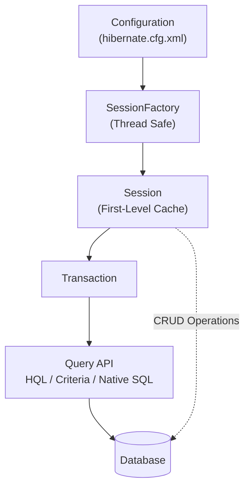
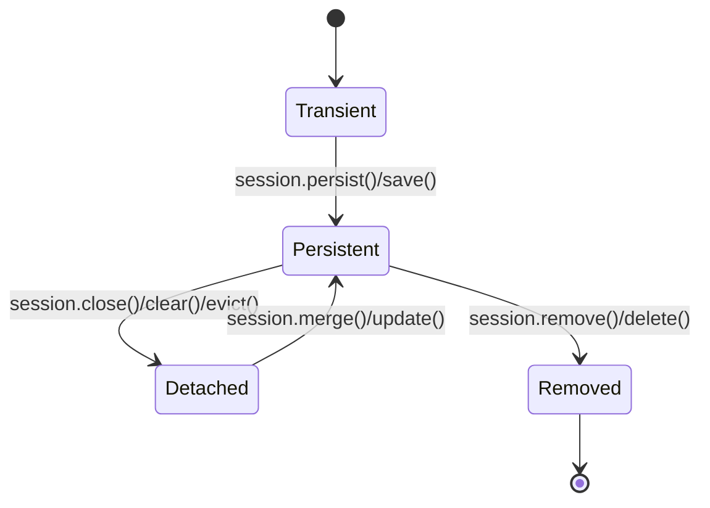
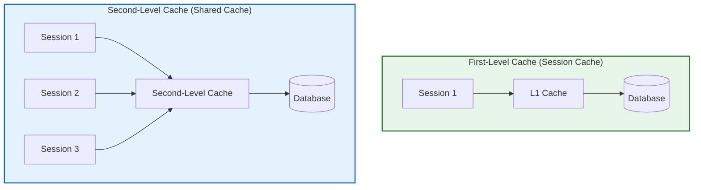
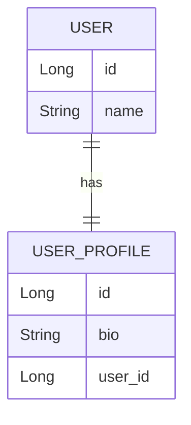
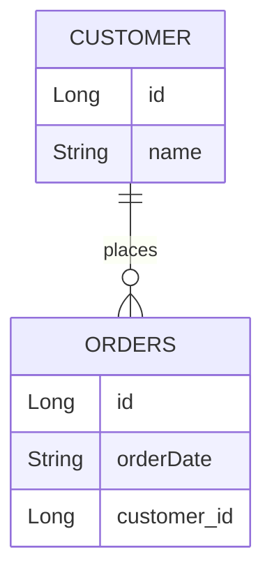
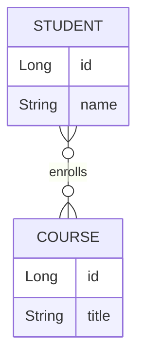
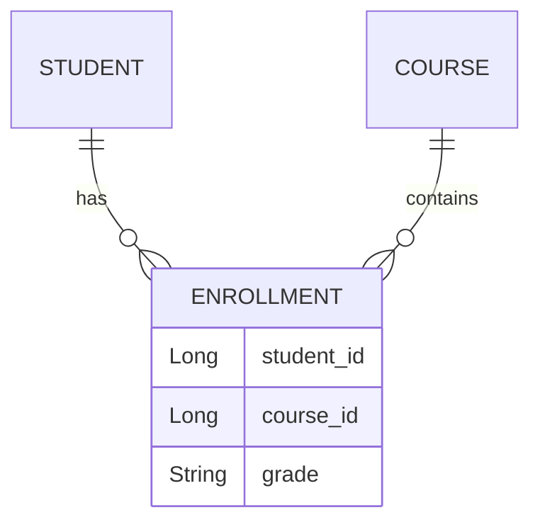

# Hibernate

###  📌What is Hibernate? Why is it used?

**Answer:**  Hibernate is a object relational mapping framework which maps the java classes to the database tables and java data types to SQL data types automatically and generates the queries automatically.

#####  Advantages of Hibernate over JDBC:

- Reduces boilerplate code

- Manages database connections and transactions

- Provided primary key auto increment feature

- Reduces developers' effort , time and cost

- Supports caching for better performance

- Provides HQL (Hibernate Query Language) for database operations

#####  Disadvantages of Hibernate over JDBC:

- Can't perform multiple insertion at a time

- Debugging is difficult as compare to JDBC

- Contains lots of boiler plate code

- Can't be used for small type of applications.

#####  Hibernate Mapping (XML and Annotations):

1.   XML Mapping: Define mappings in .hbm.xml files.

2.   Annotations: Use Java annotations for mapping.

---

### 📌 What is ORM?

**ORM (Object-Relational Mapping)** is a technique that maps **Java objects (classes)** to **database tables**. It allows developers to interact with the database using Java objects instead of writing SQL for every operation.

In simple terms:

- **Java Class** ⟶ **Database Table**
- **Java Object** ⟶ **Row (Record)**
- **Object Fields** ⟶ **Table Columns**

Hibernate is one of the most popular ORM frameworks for Java.

---

### 📌 What are the advantages of Hibernate over JDBC?

-------------------------------------------------------------------------
Feature          |   JDBC              |  Hibernate
-------------------| ------------------- |---------------------------------
Query Writing    |   Requires SQL      |  Uses HQL (Hibernate Query queries Language)
Object Mapping  |     Manual mapping   |    Automatic ORM mapping
Caching        |      No built-in caching |  Supports first-level and second-level caching
Database       |      Database-specific  |  Works with multiple databases
-------------------------------------------------------------------------

**Hibernate Example :**

1.   **First create new maven project and use quick-start arch type.**

2.   **Then Add required dependencies in pom.xml**

```xml
<!-- MS SQL -->

<dependency>

<groupId>com.microsoft.sqlserver</groupId>

<artifactId>mssql-jdbc</artifactId>

<version>12.9.0.jre11-preview</version>

</dependency>

<!-- Hibernate Core -->

<dependency>

<groupId>org.hibernate</groupId>

<artifactId>hibernate-core</artifactId>

<version>6.3.1.Final</version>

</dependency>

<!-- JPA API -->

<dependency>

<groupId>jakarta.persistence</groupId>

<artifactId>jakarta.persistence-api</artifactId>

<version>3.1.0</version>

</dependency>
```

3. **Create the hibernate configuration file in resource folder i.e `hibernate.cfg.xml`**

```xml
<?xml version='1.0' encoding='UTF-8'?>

<!DOCTYPE hibernate-configuration PUBLIC

"-//Hibernate/Hibernate Configuration DTD 3.0//EN"

"http://www.hibernate.org/dtd/hibernate-configuration-3.0.dtd">

<hibernate-configuration>

    <session-factory>

        <!-- Hibernate DDL Auto (Update DB Schema) -->

        <property name="hibernate.hbm2ddl.auto">update</property>

        <!-- SQL Server Dialect -->

        <property
                  name="hibernate.dialect">org.hibernate.dialect.SQLServer2012Dialect</property>

        <!-- Database Connection Settings -->

        <property
                  name="hibernate.connection.driver_class">com.microsoft.sqlserver.jdbc.SQLServerDriver</property>

        <property
                  name="hibernate.connection.url">jdbc:sqlserver://DESKTOP-G774017:1433;databaseName=testdb;encrypt=false</property>

        <property
                  name="hibernate.connection.username">user</property>

        <property name="hibernate.connection.password">root</property>

        <!-- Show SQL Queries in Console -->

        <property name="hibernate.show_sql">true</property>

        <property name="hibernate.format_sql">true</property>

    </session-factory>

</hibernate-configuration>
```

4.   **Create class for table mapping**

```java
@Entity

@Table(name = "Emp")

public   class  Employee {

    @Id

    @GeneratedValue(strategy =
                    GenerationType.IDENTITY)

    private   int  id;

    private  String name;

    private   int  age;

    private  String address;

}
```

5.   **Now write a code to connect database and perform operation**

```java
public   static   void  main(String args) {

    try  {

        // 1. Load Hibernate Configuration

        Configuration cfg =  new  Configuration();

        cfg.configure("hibernate.cfg.xml");

        cfg.addAnnotatedClass(Employee. class );

        System.out.println("Loaded Hibernate configuration");

        // 2. Build SessionFactory

        SessionFactory sessionFactory = cfg.buildSessionFactory();

        // 3. Open Session

        Session session = sessionFactory.openSession();

        // 4. Start Transaction

        Transaction txn = session.beginTransaction();

        // 5. Create Employee Object

        Employee emp =  new  Employee();

        emp.setName("nikita");

        emp.setAddress("kolnoor");

        emp.setAge(24);

        // 6. Save Employee Object

        session.save(emp);

        // 7. Commit Transaction

        txn.commit();

        System.  out .println("Employee created successfully: " + emp);

        // 8. Close Session & SessionFactory

        session.close();

        sessionFactory.close();

    }  catch  (Exception e) {

        e.printStackTrace(); // Print the actual error

    }

}
```

----

### 📌 Steps to Create a SessionFactory Object in Hibernate and Perform an Operation

##### Step 1: Load Hibernate Configuration

- The **Configuration** class is used to  load and   configure  Hibernate settings from `hibernate.cfg.xml`.

- This takes hibernate-configuration file name and location as input value . also take hibernate maping files names.

- Use:

```java
Configuration cfg =  new  Configuration();

cfg.configure("hibernate.cfg.xml");
```

-  Explanation :

-  `new  Configuration()` initializes the Hibernate
configuration.

- `cfg.configure("hibernate.cfg.xml")` loads database connection
details and Hibernate properties.'

##### Step 2: Add Annotated Entity Class (Optional)

- If you're using  annotations  instead of hbm.xml mapping files, register the entity class:

- `cfg.addAnnotatedClass(Employee. class );`

-  Explanation :

- This tells Hibernate to recognize the @Entity annotated
Employee class.

##### Step 3: Build the SessionFactory Object

- The SessionFactory is the main Hibernate factory for   creating sessions:

- It is the interface used to create session factory object and which   turn configure hibernate for the application using configuration file   and allows for a session object to be intiate.

> `SessionFactory sessionFactory = cfg.buildSessionFactory();`

-  Explanation :
- buildSessionFactory reads the configuration and creates a  single instance  of SessionFactory.
- This object  must be created once  (Singleton Pattern).

##### Step 4: Open a Session

- A Session represents a  database connection .

>` Session session = sessionFactory.openSession();`

-  Explanation :

- openSession() creates a  new session  for database operations.

- Sessions are  not thread-safe ; use a new one for each transaction.

##### Step 5: Begin a Transaction

- Transactions ensure  ACID compliance :

> `Transaction txn = session.beginTransaction();`

-  Explanation :

- beginTransaction() starts a database transaction.

- All DB changes must be committed or rolled back within a transaction.

##### Step 6: Perform a Database Operation

-  Example: Saving an Employee object

> `session.save(emp);`

-  Explanation :

- save(emp) inserts a new row if the primary key does not exist;  other wise, it updates.

##### Step 7: Commit the Transaction

- Save the changes to the database:

> `txn.commit();`

-  Explanation :

- commit() makes the changes permanent.

##### Step 8: Close the Session and SessionFactory

- Always  release resources  after use:

```java
session.close();

sessionFactory.close();
```

-  Explanation :

- session.close(); closes the current session.

- sessionFactory.close(); shuts down Hibernate completely.

**✅ Summary of Steps**

----------------------------------------------------------------------
| Step | Operation                   | Method Used                               |
| ---- | --------------------------- | ----------------------------------------- |
| 1️    | Load Hibernate Config       | `cfg.configure("hibernate.cfg.xml")`      |
| 2️    | Add Entity Class (Optional) | `cfg.addAnnotatedClass(Employee.class)`   |
| 3️    | BuildSessionFactory         | `cfg.buildSessionFactory()`               |
| 4️    | Open a Session              | `sessionFactory.openSession()`            |
| 5️    | Begin Transaction           | `session.beginTransaction()`              |
| 6️    | Perform Operation           | `session.saveOrUpdate(emp)`               |
| 7️    | Commit Transaction          | `txn.commit()`                            |
| 8️    | Close Resources             | `session.close();sessionFactory.close();` |

---

### 📌 Hibernate Architecture

Hibernate consists of several core components:

1. **Configuration (`hibernate.cfg.xml`)**
   - Stores database connection details.
   - Contains Hibernate properties and entity mappings.

2. **SessionFactory**
   - Created once per application/database.
   - Heavy-weight, thread-safe object.
   - Creates `Session` objects.

3. **Session**
   - Represents a single unit of work.
   - Provides CRUD operations.
   - Maintains the **First-Level Cache**.

4. **Transaction**
   - Ensures database operations are committed or rolled back atomically.

5. **Query API**
   - Used to retrieve and manipulate data.
   - Supports HQL, Criteria API, and Native SQL.

**Hibernate Architecture Flow**



---

## 📌States of Objects in Hibernate

In Hibernate, an object (entity) goes through different **lifecycle states** from creation to deletion. Hibernate tracks these states to decide when to insert, update, or delete data in the database.

There are mainly **four states**:

1. **Transient State**
2. **Persistent State**
3. **Detached State**
4. **Removed State**

**Example Entity**

```java
import jakarta.persistence.*;

@Entity
@Table(name = "employees")
public class Employee {

    @Id
    @GeneratedValue(strategy = GenerationType.IDENTITY)
    private Long id;

    private String name;

    private double salary;

    public Employee() {}

    public Employee(String name, double salary) {
        this.name = name;
        this.salary = salary;
    }

    // Getters and Setters
}
```

------

**Object Lifecycle in Hibernate**



------

##### 1. Transient State

A newly created Java object is called **Transient**.

- Object is created using the `new` keyword.
- Hibernate does not know about this object.
- No database record exists.
- It is not associated with any Hibernate session.

```java
Employee emp = new Employee("John", 50000);

System.out.println(emp.getId()); // null
new Employee()
      |
      v
+----------------+
|  Transient     |
+----------------+
```

------

##### 2. Persistent State

When an object is connected with a Hibernate **Session**, it becomes Persistent.

- Hibernate starts tracking the object.
- Any changes are automatically reflected in the database.
- Object has a corresponding database row.

```java
Session session = sessionFactory.openSession();
Transaction tx = session.beginTransaction();

Employee emp = new Employee("John", 50000);

session.persist(emp);   // Persistent

tx.commit();
session.close();
```

Now Hibernate:

- Tracks changes automatically.
- Synchronizes changes with the database during flush/commit.

```
Session
   |
   +------ Employee
              |
           Database
```

------

##### 3. Detached State

When an object was persistent but the Hibernate session is closed, it becomes **Detached**.

- Object still exists in Java memory.
- Database record exists.
- Hibernate no longer tracks changes.

```java
Session session = sessionFactory.openSession();

Employee emp = session.get(Employee.class, 1L);

session.close();      // emp becomes Detached

emp.setSalary(80000); // Hibernate won't save this change automatically
Database
    ^
    |
 Detached Object
```

To manage it again:

```java
Session session2 = sessionFactory.openSession();
Transaction tx = session2.beginTransaction();

session2.merge(emp);

tx.commit();
session2.close();
```

------

##### 4. Removed (Deleted) State

When an object is marked for deletion, it enters the Removed state.

- Object is still associated with the session.
- Hibernate deletes the database record after transaction commit.

```java
Session session = sessionFactory.openSession();
Transaction tx = session.beginTransaction();

Employee emp = session.get(Employee.class, 1L);

session.remove(emp);

tx.commit();
session.close();
```

**Hibernate executes:**

```sql
DELETE FROM employees WHERE id = 1;
Persistent
     |
 remove()
     |
     v
 Removed
     |
 Commit
     |
 Database Row Deleted
```

------

**Complete Example**

```java
Session session = sessionFactory.openSession();
Transaction tx = session.beginTransaction();

// Transient
Employee emp = new Employee("Alice", 60000);

// Persistent
session.persist(emp);

emp.setSalary(70000);   // Automatically tracked

tx.commit();
session.close();

// Detached
emp.setSalary(80000);

// Reattach
Session session2 = sessionFactory.openSession();
Transaction tx2 = session2.beginTransaction();

session2.merge(emp);

tx2.commit();
session2.close();
```

------

**Summary**

| State          | Managed by Hibernate? | Exists in Database?        | Typical Operations                       |
| -------------- | --------------------- | -------------------------- | ---------------------------------------- |
| **Transient**  | ❌ No                  | ❌ No                       | `new Employee()`                         |
| **Persistent** | ✅ Yes                 | ✅ Yes (after flush/commit) | `persist()`, `save()`, `get()`, `find()` |
| **Detached**   | ❌ No                  | ✅ Yes                      | `close()`, `clear()`, `evict()`          |
| **Removed**    | ✅ Until commit        | ❌ After commit             | `remove()`, `delete()`                   |

---

### 📌JDBC vs Hibernate vs JPA vs Spring Data JPA Comparison

| Technology          | One-Line Explanation                                         |
| ------------------- | ------------------------------------------------------------ |
| **JDBC**            | Direct way to communicate with a database using SQL.         |
| **Hibernate**       | ORM framework that maps Java objects to database tables automatically. |
| **JPA**             | Java specification that defines how ORM should work.         |
| **Spring Data JPA** | Spring abstraction that reduces JPA boilerplate using repositories. |

---

### 📌What is SessionFactory in Hibernate?

SessionFactory is a heavyweight object that creates and manages Session objects. It is created  once per database  and is thread-safe.

---

### 📌What is Session in Hibernate?

A Session is a lightweight, non-thread-safe object that acts as a bridge between Java code and the database. It is used to perform CRUD operations.

---

###  📌What is HQL (Hibernate Query Language)? How is it different from SQL?

**Answer:**  HQL is an object-oriented query language that uses entity names instead of table names. It is database-independent.
**Example:**

```java
String hql = "FROM Student WHERE name = :name";
Query query = session.createQuery(hql);
query.setParameter("name", "Nirav");
List<Student> students = query.list();
```

---

### 📌What are Fetch Types in Hibernate?

-  Lazy Loading (`FetchType.LAZY`)  -- Data is loaded only when   requested.

-  Eager Loading (`FetchType.EAGER`)  -- Data is loaded immediately.

Example:

```java
@OneToMany(fetch = FetchType.LAZY)
private  List<Course> courses;
```

---

###  📌What is the difference between save(), persist(), and saveOrUpdate()?

-------------------------------------------------------------------------
Method           |When to Use                         |Returns
---------------- |----------------------------------- |--------------------
save()           |Inserts new record                  |Generated primary key
persist()        |Inserts new record, but doesn't return ID     |void
saveOrUpdate()   |Inserts if new, updates if existing |void


----

## 📌First-Level Cache and Second-Level Cache

Caching in **Hibernate** improves application performance by reducing database access. Hibernate provides two types of cache:

- **First-Level Cache (L1 Cache)** – Enabled by default.
- **Second-Level Cache (L2 Cache)** – Optional and shared across sessions.

------

#### 1. First-Level Cache (L1 Cache)

The **First-Level Cache** is associated with a **Session** object. Every Hibernate session has its own cache.

**Features**

- Enabled **by default**.
- Stores objects within the current session.
- Cannot be disabled.
- Cache is cleared when the session is closed.
- Not shared with other sessions.

**Example**

```java
Session session = sessionFactory.openSession();

Student s1 = session.get(Student.class, 1);
Student s2 = session.get(Student.class, 1);
```

**Result:**

- First query → Fetches data from the database.
- Second query → Retrieves data from the first-level cache (no SQL query).

------

#### 2. Second-Level Cache (L2 Cache)

**Definition**

The **Second-Level Cache** is associated with the **SessionFactory** and is shared among multiple sessions.

**Features**

- **Disabled by default.**
- Must be configured manually.
- Shared across all sessions.
- Data remains available until it expires or is evicted.
- Uses cache providers such as **Ehcache, Infinispan, Hazelcast, or Caffeine (through supported integrations)**.

**Example**

```java
Session session1 = sessionFactory.openSession();
Student s1 = session1.get(Student.class, 1);
session1.close();

Session session2 = sessionFactory.openSession();
Student s2 = session2.get(Student.class, 1);
```

**Result (if L2 cache is enabled):**

- First session → Reads from the database and stores the object in L2 cache.
- Second session → Reads the object from the second-level cache (no database query).



------

**Key Differences**

| First-Level Cache                             | Second-Level Cache                                   |
| --------------------------------------------- | ---------------------------------------------------- |
| Session-specific                              | Shared across sessions                               |
| Enabled automatically                         | Must be enabled manually                             |
| Faster for repeated access within one session | Faster for repeated access across different sessions |
| Cleared when session ends                     | Remains until expiration or eviction                 |
| No extra configuration                        | Requires cache provider and configuration            |

------

### 📌What is the difference between First-Level and Second-Level Cache?

Cache Type            |          Scope              |      Default?
----------------------|--------- -------------------|----- --------------
First-Level Cache     |          Per Session        |      Yes
Second-Level Cache    |          Across Sessions    |      No

---

### 📌What is the difference between HQL and Criteria API?

| Feature         | HQL                           | Criteria API                 |
| --------------- | ----------------------------- | ---------------------------- |
| Query Type      | String-based                  | Java object-based            |
| Syntax          | Similar to SQL                | Java API                     |
| Type Safety     | Limited                       | Better (with metamodel)      |
| Dynamic Queries | Less convenient               | Excellent                    |
| Readability     | Easier for simple queries     | More verbose                 |
| Runtime Errors  | Possible due to string syntax | Fewer syntax-related issues  |
| Best For        | Simple, fixed queries         | Dynamic, user-driven queries |

**Example of Criteria API:**

```java
CriteriaBuilder cb = session.getCriteriaBuilder();
CriteriaQuery<Student> cq =cb.createQuery(Student. class );
Root<Student> root = cq.from(Student.class );
cq.select(root).where(cb.equal(root.get("name"), "Nirav"));
Query<Student> query =session.createQuery(cq);
List<Student> students = query.getResultList();
```
---

### 📌What are the different caching strategies in Hibernate?

1.   Read-Only:  Best for static data.

2.   Non-Strict Read-Write:  Allows reads, but updates are not guaranteed.

3.   Read-Write:  Uses timestamps to maintain consistency.

4.   Transactional:  Works with JTA transactions.

---

### 📌How does Hibernate handle transactions?

Transactions in Hibernate are managed using `beginTransaction()` and `commit()`.

**Example:**

```java
SessionFactory sf= HibernateUtil.getSessionFactory() ;

Session session=sf.openSession();

Transaction txn= null ;

try  {

    txn=session.beginTransaction();

    Question q=session.~~load~~(Question. class , 2);

    System.out.println(q.toString());

    txn.commit();

    session.close();

    HibernateUtil.shutdown();

}  catch  (Exception e) {

    if (txn!= null ) {

        txn.rollback();

    }

    e.printStackTrace();

}
```

---

### 📌How would you optimize performance in Hibernate?

**Hibernate performance can be optimized by:**

1. Using first-level and second-level caching.
2. Using lazy loading instead of unnecessary eager fetching.
3. Avoiding N+1 query problems using fetch joins.
4. Enabling JDBC batch processing.
5. Using pagination for large data.
6. Selecting only required columns.
7. Proper transaction management.
8. Adding database indexes.
9. Optimizing entity relationships and fetch strategies.

---

### 📌What will happen if you don't close a Hibernate Session?

 Memory leaks can occur because the session holds database connections and cached objects.

---

### 📌How do you integrate Hibernate with Spring Boot?

By using spring-boot-starter-data-jpa:

```properties
spring.datasource.url=jdbc:mysql://localhost:3306/hibernate_db

spring.jpa.hibernate.ddl-auto=update
```

### 📌What is Dialect?

A **Hibernate Dialect** is a class that tells Hibernate how to generate SQL statements according to a specific database.

Different databases have different SQL syntax and features. Hibernate uses Dialect to generate database-specific SQL.

---

## Entity Mapping 

### 1. One-to-One (1:1)

One record in Table A relates to exactly one record in Table B.

Example:

- One user has one profile.
- One person has one passport.

------

##### Database Idea

```text
User
-----
id (PK)
name

UserProfile
-----------
id (PK)
user_id (FK, UNIQUE)
bio
```

`user_id` must be UNIQUE to enforce 1:1.

------

##### Mermaid Diagram




------

##### Java JPA Example

##### User Entity

```java
import jakarta.persistence.*;

@Entity
public class User {

    @Id
    @GeneratedValue(strategy = GenerationType.IDENTITY)
    private Long id;

    private String name;

    @OneToOne(mappedBy = "user", cascade = CascadeType.ALL)
    private UserProfile profile;

    // getters and setters
}
```

------

##### UserProfile Entity

```java
import jakarta.persistence.*;

@Entity
public class UserProfile {

    @Id
    @GeneratedValue(strategy = GenerationType.IDENTITY)
    private Long id;

    private String bio;

    @OneToOne
    @JoinColumn(name = "user_id", unique = true)
    private User user;

    // getters and setters
}
```

------

##### Explanation

- `@OneToOne` defines the relationship.
- `@JoinColumn` creates the foreign key.
- `unique = true` enforces one-to-one.
- `mappedBy` means `UserProfile` owns the relationship.
- Cascade allows saving profile when user is saved.

------

### 2. One-to-Many (1:N)

One record in Table A relates to many records in Table B.

**Example:**

- One customer has many orders.
- One author writes many books.

------

##### Database Idea

```text
Customer
--------
id (PK)
name

Orders
------
id (PK)
customer_id (FK)
order_date
```

Foreign key is on the many side.

------

##### Mermaid Diagram



 

------

##### Java JPA Example

##### Customer Entity

```java
import jakarta.persistence.*;
import java.util.List;

@Entity
public class Customer {

    @Id
    @GeneratedValue(strategy = GenerationType.IDENTITY)
    private Long id;

    private String name;

    @OneToMany(mappedBy = "customer", cascade = CascadeType.ALL)
    private List<Order> orders;

    // getters and setters
}
```

------

##### Order Entity

```java
import jakarta.persistence.*;

@Entity
@Table(name = "orders")
public class Order {

    @Id
    @GeneratedValue(strategy = GenerationType.IDENTITY)
    private Long id;

    private String orderDate;

    @ManyToOne
    @JoinColumn(name = "customer_id")
    private Customer customer;

    // getters and setters
}
```

------

##### Explanation

- `@ManyToOne` is placed on the many side.
- `@JoinColumn` creates foreign key.
- Many orders can reference one customer.
- Each order belongs to only one customer.
- `mappedBy` connects both sides.

------

##### Important Rule

Foreign key always goes on the **many side**.

------

### 3. Many-to-Many (M:N)

Many records in Table A relate to many records in Table B.

**Example:**

- Students enroll in many courses.
- Courses have many students.

------

##### Database Idea

```text
Student
-------
id (PK)
name

Course
------
id (PK)
title

Student_Course
--------------
student_id (FK)
course_id (FK)
PRIMARY KEY (student_id, course_id)
```

Requires a junction table.

------

##### Mermaid Diagram



`}o--o{` means many-to-many.

------

##### Java JPA Example

##### Student Entity

```java
import jakarta.persistence.*;
import java.util.Set;

@Entity
public class Student {

    @Id
    @GeneratedValue(strategy = GenerationType.IDENTITY)
    private Long id;

    private String name;

    @ManyToMany
    @JoinTable(
        name = "student_course",
        joinColumns = @JoinColumn(name = "student_id"),
        inverseJoinColumns = @JoinColumn(name = "course_id")
    )
    private Set<Course> courses;

    // getters and setters
}
```

------

##### Course Entity

```java
import jakarta.persistence.*;
import java.util.Set;

@Entity
public class Course {

    @Id
    @GeneratedValue(strategy = GenerationType.IDENTITY)
    private Long id;

    private String title;

    @ManyToMany(mappedBy = "courses")
    private Set<Student> students;

    // getters and setters
}
```

------

##### Explanation

- `@ManyToMany` defines the relationship.
- `@JoinTable` creates the junction table.
- `joinColumns` → current entity key.
- `inverseJoinColumns` → other entity key.
- `mappedBy` defines inverse side.
- JPA generates junction table automatically.

------

### 4. Better Many-to-Many (With Extra Fields)

If you need extra columns like:

- enrollmentDate
- grade
- status

Create a separate entity:

------

##### Mermaid Diagram (With Junction Entity)



------

##### Java Example (Simplified)

```java
@Entity
public class Enrollment {

    @EmbeddedId
    private EnrollmentId id;

    private String grade;

    @ManyToOne
    @MapsId("studentId")
    private Student student;

    @ManyToOne
    @MapsId("courseId")
    private Course course;
}
```

This is the preferred real-world approach.

------

##### 5. Quick Comparison

| Relationship | Annotation  | Foreign Key Location | Extra Table |
| ------------ | ----------- | -------------------- | ----------- |
| One-to-One   | @OneToOne   | Owning side          | No          |
| One-to-Many  | @ManyToOne  | Many side            | No          |
| Many-to-Many | @ManyToMany | Junction table       | Yes         |

------

##### 6. Short Revision Summary

- 1:1 → `@OneToOne`
- 1:N → `@ManyToOne` on many side
- M:N → `@ManyToMany` + `@JoinTable`
- Foreign key always on many side
- Use explicit entity if junction needs extra fields
- `mappedBy` means non-owning side

> [!TIP]
>
> One side must be the **owning side**.
>
> The owning side:
>
> - Contains `@JoinColumn`
> - Controls database updates
>
> The inverse side:
>
> - Uses `mappedBy`
> - Does not control database

------

> [!IMPORTANT]
>
> **Rule to Remember**
>
> Many side is usually the owning side.

##### Hibernate Mapping Annotations Summary Table

---------------------------------------------------------------------------------
Annotation                |    Description   |  Example Usage
-------------------------|------ -----------|------ -------------------------------
`@Entity`                 |       Marks a class as   a JPA entity (mapped to a  table) | `@Entity public class Student` 
`@Table(name = "table_name")` | Specifies the  table name in the  database  | `@Table(name = "students")` 
`@Id`                        |    Marks a field as  the primary key  | `@Id private Long id;` 
`@GeneratedValue(strategy =  GenerationType.IDENTITY)`    |     Specifies how the primary key is  generated| `@GeneratedValue(strategy=GenerationType.IDENTITY)` 
`@Column(name ="column_name")` | Maps a field to a specific database column | `@Column(name = "student_name") private String name;` 
`@Transient`                   |  Excludes a field from persistence (not stored in the database) | `@Transient private int age;` 
`@Basic(fetch = FetchType.LAZY)` |Marks a field for lazy loading       |`@Basic(fetch = FetchType.LAZY) private String description;`
`@Temporal(TemporalType.DATE)`  | Specifies how Date/Time fields should be stored | `@Temporal(TemporalType.DATE)   private Date dob;` 
`@Lob`                           |Maps a field to  a large object (BLOB or CLOB)| `@Lob private byte[] image;` 

##### Primary Key and ID Generation

---

| Annotation                                            | Description                                                  | Example Usage                                                |
| ----------------------------------------------------- | ------------------------------------------------------------ | ------------------------------------------------------------ |
| `@GeneratedValue(strategy = GenerationType.IDENTITY)` | Uses auto-increment (database-generated value). Common in MySQL. | `@GeneratedValue(strategy = GenerationType.IDENTITY)`        |
| `@GeneratedValue(strategy = GenerationType.SEQUENCE)` | Uses a database sequence to generate IDs. Preferred in PostgreSQL/Oracle. | `@GeneratedValue(strategy = GenerationType.SEQUENCE, generator = "seq")` |
| `@SequenceGenerator`                                  | Defines a sequence generator used with `SEQUENCE` strategy.  | `@SequenceGenerator(name = "seq", sequenceName = "student_seq", allocationSize = 1)` |
| `@GeneratedValue(strategy = GenerationType.TABLE)`    | Uses a table to simulate sequence behavior (least preferred). | `@GeneratedValue(strategy = GenerationType.TABLE)`           |

---

##### Example: SEQUENCE Strategy (PostgreSQL / Oracle)

```java
@Entity
public class Student {

    @Id
    @SequenceGenerator(
        name = "seq",
        sequenceName = "student_seq",
        allocationSize = 1
    )
    @GeneratedValue(
        strategy = GenerationType.SEQUENCE,
        generator = "seq"
    )
    private Long id;
}
```


--------------------------------------------------------------------------------

##### One-to-One Mapping

-----------------------------------------------------------------------
Annotation        |  Description                         |   Example Usage
------------------|--- ---------------------------- -----|---------------
@OneToOne         |   Defines a one-to-one relationship  |      @OneToOne private Profile profile;
@JoinColumn(name ="profile_id")|   Specifies the foreign key column   | @JoinColumn(name ="profile_id")
@MapsId           |   Uses the primary key of the parent entity as the foreignkey  | @MapsId private Long id; 
-----------------------------------------------------------------------

##### One-to-Many and Many-to-One Mapping

---

| Annotation                            | Description                                                  | Example Usage                                                |
| ------------------------------------- | ------------------------------------------------------------ | ------------------------------------------------------------ |
| `@OneToMany(mappedBy = "department")` | Defines **one-to-many** bidirectional mapping (parent side). | `@OneToMany(mappedBy = "department") private List<Employee> employees;` |
| `@ManyToOne`                          | Defines **many-to-one** relationship (child → parent).       | `@ManyToOne`                                                 |
| `@JoinColumn(name = "department_id")` | Specifies the foreign key column in child table.             | `@JoinColumn(name = "department_id")`                        |
| `@Cascade(CascadeType.ALL)`           | Defines cascading operations (save, delete, update).         | `@Cascade(CascadeType.ALL)`                                  |

---

### Example: Bidirectional One-to-Many Mapping

##### Parent Entity (Department)

```java
@Entity
public class Department {

    @Id
    @GeneratedValue(strategy = GenerationType.IDENTITY)
    private Long id;

    private String name;

    @OneToMany(mappedBy = "department", cascade = CascadeType.ALL)
    private List<Employee> employees;
}
```


##### Many-to-Many Mapping

---

| Annotation    | Description                                               | Example Usage                                                |
| ------------- | --------------------------------------------------------- | ------------------------------------------------------------ |
| `@ManyToMany` | Defines a many-to-many relationship between two entities. | `@ManyToMany private List<Course> courses;`                  |
| `@JoinTable`  | Defines the join table used to map the relationship.      | `@JoinTable(name = "student_course")`                        |
| `@JoinColumn` | Specifies foreign key columns in the join table.          | `@JoinColumn(name = "student_id")`, `@JoinColumn(name = "course_id")` |

---

##### Example: Many-to-Many Mapping

##### Student Entity (Owning Side)

```java
@Entity
public class Student {

    @Id
    @GeneratedValue(strategy = GenerationType.IDENTITY)
    private Long id;

    private String name;

    @ManyToMany
    @JoinTable(
        name = "student_course",
        joinColumns = @JoinColumn(name = "student_id"),
        inverseJoinColumns = @JoinColumn(name = "course_id")
    )
    private List<Course> courses;
}
```

##### Cascade and Fetch Strategies

---

| Annotation                      | Description                                                  | Example Usage                   |
| ------------------------------- | ------------------------------------------------------------ | ------------------------------- |
| `@Cascade(CascadeType.ALL)`     | Propagates **all operations** (PERSIST, MERGE, REMOVE, REFRESH, DETACH) from parent to child. | `@Cascade(CascadeType.ALL)`     |
| `@Cascade(CascadeType.MERGE)`   | Propagates **merge/update** operation only.                  | `@Cascade(CascadeType.MERGE)`   |
| `@Cascade(CascadeType.REMOVE)`  | Propagates **delete** operation to child entities.           | `@Cascade(CascadeType.REMOVE)`  |
| `@Cascade(CascadeType.REFRESH)` | Refreshes child entity state from DB when parent is refreshed. | `@Cascade(CascadeType.REFRESH)` |
| `@Fetch(FetchMode.JOIN)`        | Fetches related entities using **SQL JOIN**.                 | `@Fetch(FetchMode.JOIN)`        |
| `@Fetch(FetchMode.SELECT)`      | Fetches related entities using **separate SQL queries**.     | `@Fetch(FetchMode.SELECT)`      |

---

##### Example: Cascade and Fetch Usage

```java
@Entity
public class Department {

    @Id
    @GeneratedValue(strategy = GenerationType.IDENTITY)
    private Long id;

    @OneToMany(mappedBy = "department")
    @Cascade(CascadeType.ALL)
    @Fetch(FetchMode.SELECT)
    private List<Employee> employees;
}
```

##### Named Queries (JPQL and Native SQL)

---

| Annotation                                                   | Description                                             | Example Usage                                                |
| ------------------------------------------------------------ | ------------------------------------------------------- | ------------------------------------------------------------ |
| `@Query("SELECT s FROM Student s WHERE s.name = ?1")`        | Defines a **JPQL** query using entity names and fields. | `@Query("SELECT s FROM Student s WHERE s.name = ?1")`        |
| `@Query(value = "SELECT * FROM students WHERE email = ?1", nativeQuery = true)` | Defines a **native SQL** query.                         | `@Query(value = "SELECT * FROM students WHERE email = ?1", nativeQuery = true)` |
| `@NamedQuery`                                                | Defines a **named JPQL** query at entity level.         | `@NamedQuery(name = "Student.findByName", query = "SELECT s FROM Student s WHERE s.name = :name")` |

---

##### Example: Repository Usage

```java
public interface StudentRepository extends JpaRepository<Student, Long> {

    @Query("SELECT s FROM Student s WHERE s.name = ?1")
    List<Student> findByName(String name);

    @Query(value = "SELECT * FROM students WHERE email = ?1", nativeQuery = true)
    Student findByEmail(String email);
}
```

#### Transactional and Locking Annotations

---

| Annotation       | Description                                                  | Example Usage                                                |
| ---------------- | ------------------------------------------------------------ | ------------------------------------------------------------ |
| `@Transactional` | Marks a method or class as **transactional** (commit/rollback handled by Spring). | `@Transactional public void saveStudent(Student s) {}`       |
| `@Modifying`     | Used with `@Query` for **UPDATE / DELETE** operations.       | `@Modifying @Query("UPDATE Student s SET s.name = ?1 WHERE s.id = ?2")` |
| `@Version`       | Enables **optimistic locking** to prevent concurrent updates. | `@Version private int version;`                              |

---

##### Example: Update Query with Transaction

```java
@Transactional
@Modifying
@Query("UPDATE Student s SET s.name = ?1 WHERE s.id = ?2")
int updateStudentName(String name, Long id);
```

### Logging and Debugging

---

| Annotation / Property                             | Description                                  | Example Usage                                      |
| ------------------------------------------------- | -------------------------------------------- | -------------------------------------------------- |
| `@EnableJpaRepositories`                          | Enables JPA repository scanning.             | `@EnableJpaRepositories("com.example.repository")` |
| `spring.jpa.show-sql=true`                        | Logs generated SQL queries.                  | `application.properties`                           |
| `spring.jpa.properties.hibernate.format_sql=true` | Formats SQL queries in logs for readability. | `application.properties`                           |

---

### Example: application.properties

```properties
spring.jpa.show-sql=true
spring.jpa.properties.hibernate.format_sql=true
```

### Special Field Annotations

---

| Annotation                     | Description                                                | Example Usage                                         |
| ------------------------------ | ---------------------------------------------------------- | ----------------------------------------------------- |
| `@CreationTimestamp`           | Automatically sets timestamp when a record is created.     | `@CreationTimestamp private LocalDateTime createdAt;` |
| `@UpdateTimestamp`             | Automatically updates timestamp when a record is modified. | `@UpdateTimestamp private LocalDateTime updatedAt;`   |
| `@Enumerated(EnumType.STRING)` | Stores enum value as a **string** in the database.         | `@Enumerated(EnumType.STRING) private Status status;` |
| `@Lob`                         | Maps large objects (BLOB / CLOB).                          | `@Lob private byte[] image;`                          |

---

### Example: Entity Using Special Annotations

```java
@Entity
public class Document {

    @Id
    @GeneratedValue(strategy = GenerationType.IDENTITY)
    private Long id;

    @CreationTimestamp
    private LocalDateTime createdAt;

    @UpdateTimestamp
    private LocalDateTime updatedAt;

    @Enumerated(EnumType.STRING)
    private Status status;

    @Lob
    private byte[] fileData;
}
```

---------------------------------------------------------------------------------

##### Difference between get( ) & load( )

----------------------------------------------------
get ( )             |     load ( )
------------------------| ---------------------------
Eager Loading        |    Lazy Loading
If value is absent in database then it returns null. |  If value is absent in database then hibernate exception (ObjectNotFoundException)occurs.
It always hit database. | It may or may not be hit to database.
----------------------------------------------------

##### Difference between save( ) & persist(  )

---------------------------------------------------
Save ( )             |     Persist ( )
-------------------------|-------------------------
Its return type is Serializable object. | Its return type is void.
It can save object within transaction boundaries and outside boundaries. | It can only save object within the transaction boundaries.
It is only supported by  Hibernate.(Java Persistence API). | It is supported by Hibernate and also by JPA
It will create a new row in the table for detached object. | It will throw persistence exception for detached object.
---------------------------------------------------

### What is Cache?

Cache is a **temporary memory** that stores frequently accessed data to reduce database hits and improve application performance.

---

### What is First Level Cache (L1 Cache)?

- First-level cache is **associated with Hibernate Session**
- It is **enabled by default**
- When a query is executed for the first time:
  - Data is fetched from the database
  - Stored in the Session cache
- On subsequent requests for the same entity:
  - Hibernate returns data from Session cache
  - **No database hit**

✔ Scope: **Single Session**

---

### What is Second Level Cache (L2 Cache)?

- Second-level cache is associated with **SessionFactory**
- It must be **explicitly enabled**
- It is **shared across all sessions**
- Flow:
  1. Hibernate checks **L1 cache**
  2. If not found → checks **L2 cache**
  3. If not found → hits **database**
  4. Result stored in both caches

✔ Scope: **Application-wide**

---

### How to Remove a Particular Object from Cache?

```java
session.evict(entity);
```

### How to Clean Cache?

**Answer:**
Hibernate `Session` provides the `clear()` method to remove **all entities** from the first-level (Session) cache.

```java
session.clear();
```

### Which Version of Hibernate, Spring, and Spring Boot Have You Used?

**Answer:**

- Hibernate: **4.x**
- Spring Framework: **4.x**
- Spring Boot: **2.x**

### In One-to-Many & Many-to-One Mapping,How Many Tables Are Created by Default and When `mappedBy` Is Used?

**Answer:**

##### Without `mappedBy`

- **3 tables** are created:
  - Parent table
  - Child table
  - Join table

##### With `mappedBy`

- **2 tables** are created:
  - Parent table
  - Child table (contains foreign key)

✔ `mappedBy` removes the unnecessary join table.

------

### In Many-to-Many Mapping,How Many Tables Are Created by Default and When `mappedBy` Is Used?

**Answer:**

##### Without `mappedBy`

- **3 tables** are created:
  - First entity table
  - Second entity table
  - Join table

##### With `mappedBy`

- **Still 3 tables** are created

⚠️ `mappedBy` changes **ownership**, not the number of tables.

------

### 📌What Is Dirty Checking?

**Answer:**
 Dirty checking is a Hibernate mechanism where changes made to a **persistent entity** are automatically detected and synchronized with the database at transaction commit—**without calling the `update()` method**.

```
student.setName("New Name"); // automatically updated
```

- This behavior can be avoided using:

```
@Immutable
```

### 📌What is process for Automatic ID generation from any random number?

```java
@SequenceGenerator(name = "mySeqGen", sequenceName = "mySeq",
initialValue = 500, allocationSize=1)

@GeneratedValue(generator = "mySeqGen")
```

### How to show SQL queries at run time?

Answer :  While specifying hibernate properties, add Show_SQL property as a true,

`e.g. <property name="show_sql">true</property>`

### What does hbm2ddl does?

Answer :  It validates number of column.

### How to disable 1st level cache?

Answer :  We can't disable cache but we can clear all cache using clear( ) method of session, then it works as disabled.

### How to enable 2nd level cache?

- Add 3 rd party jar files. (ehcache)

- Add Annotation below to Entity class.

`@Cache(usage=CacheConcurrencyStrategy.READ_WRITE)`

- Include two extra lines in settings in '`HibernateUtil.class`'

```java
settings.put(Environment.USE_SECOND_LEVEL_CACHE, "true");
settings.put(Environment.CACHE_REGION_FACTORY,"org.hibernate.cache.ehcache.EhCach-eRegionFactory");
```

### How you have used Hibernate (XML, Annotations, Java Based)?

(Always Answer as) Annotation Based.

### Native Queries-Definition, syntax, advantages?

- It allows developers to write  pure SQL queries  and execute them within Hibernate.

- Your application will create a native SQL query from the session with the createSQLQuery() method.

- You need to pass a string containing the SQL query to the createSQLQuery() method.

- `List<Object]> results =session.createNativeQuery("SELECT id, name, age FROM Employee").list();`

### What is Spring Data JPA?

Answer :

- It is a part of spring framework that reduces the boiler plate code of database connection and transection management and take care of everything. We have to implement only repository interface and it will handle every thing

- It has inbuild methods to perform database operations like findbyId, findall() etc.

- It is built on top of JPA and provide the repository interface that handles all the database operations.

### What are the advantages of Spring Data JPA?

Answer:

- Reduces boiler plate code

- Provide built in CRUD operations.

- Support pagination and sorting

- Support Native Query, Criteria API,JPQL

### What is the purpose of the @Entity annotation in JPA?

Answer :  The @Entity annotation marks a Java class as a  JPA entity , meaning it maps to a table in the database.

### What is the @Repository annotation?

It is used in Spring Data JPA to indicate that a class is a  DAO (Data Access Object) . It also enables  exception translation  for database-related exceptions.

### What is the difference between JpaRepository, CrudRepository, and PagingAndSortingRepository?

Interface                   | Description
----------------------------| -------------------------------------------------
CrudRepository              | Provides basic CRUD operations (save(), findById(), delete()).      |
PagingAndSortingRepository  | Extends CrudRepository with pagination and sorting features.           |
JpaRepository               | Extends PagingAndSortingRepository and provides flush, batch processing, and custom queries .

### What are Derived Queries in Spring Data JPA?

Spring Data JPA generates queries  automatically  based on method
names.

Example:

List<Employee> findByDepartment(String department);

### How do you write a custom query using @Query annotation?

```java
@Query( value="SELECT count(task_id) FROM tasks
",nativeQuery= true )

public  Integer getcount();

@Query(value="SELECT count(task_id) FROM tasks where
status=",nativeQuery= true )

public  Integer getCompletedtasks();

@Query(value="SELECT count(task_id) FROM tasks where deadline<?1",
nativeQuery= true )

public  Integer getOverduetasks( String date);
```

### How Do You Enable Pagination in Spring Data JPA?

**Answer:**

Pagination is used to fetch a **limited number of records per request**
instead of loading all data at once from the database.

##### Benefits
- Improves **performance**
- Reduces **memory usage**
- Suitable for **large datasets**

---

#### Key Interfaces and Classes

#### Pageable

- Used to pass pagination information to repository methods
- Includes page number, page size, and sorting details

```java
Page<Tasks> findAll(Pageable pageable);-
```

#### Page

- Represents a **single page** of data
- Provides:
  - Current page content
  - Total number of elements
  - Total pages
  - Whether next/previous pages exist

```
Page<Tasks> page = taskRepository.findAll(pageable);
```

------

#### PageRequest

- Implementation of `Pageable`
- Used to specify **page number** and **page size**

```
Pageable pageable = PageRequest.of(page, size);
```

> Page index starts from **0**

#### Pagination in Repository

```java
public interface TaskRepository extends JpaRepository<Tasks, Long> {
    Page<Tasks> findAll(Pageable pageable);
}
```

------

#### Example: Pagination in Service

```java
Pageable pageable = PageRequest.of(0, 10);
Page<Tasks> tasksPage = taskRepository.findAll(pageable);
```


**Example:**

Service Method :

    Page<Tasks> alltasks(Pageable pageable);

Service Implementation :

```java
public  Page<Tasks> alltasks(Pageable pageable) {

return  taskRepository.findAll(pageable);

}
```

Controller code :

```java
@GetMapping("/tasks-list")

public  String listTasks(@RequestParam(name = "page", defaultValue= "0")  int  page,

@RequestParam(name = "size", defaultValue = "6")  int  size, Model model) {

Page<Tasks> tasksPage = taskserviceImpl.alltasks(PageRequest.of(page, size));

model.addAttribute("tasks", tasksPage.getContent());

model.addAttribute("currentPage", page);

model.addAttribute("totalPages", tasksPage.getTotalPages());

return  "task-list"; // Return the JSP page

}
```


Jsp page code :

<!-- Pagination -->

```html
<div class="d-flex justify-content-between">

<c:if test="${currentPage > 0}">

<a href="tasks-list?page=${currentPage - 1}&size=6" class="btn
btn-secondary btn-sm">Previous</a>

</c:if>

<span>Page ${currentPage + 1} of ${totalPages}</span>

<c:if test="${currentPage + 1 < totalPages}">

<a href="tasks-list?page=${currentPage + 1}&size=6" class="btn
btn-secondary btn-sm">Next</a>

</c:if>

</div>
```

### What is Lazy and Eager loading?

-------------------------------------------------------------
| Type      | Description                                     
-----------|--------------------------------------------------
|  Lazy Loading   | Loads data  only when needed  (default for @OneToMany, @ManyToOne)  Ex : @OneToMany(fetch = FetchType.LAZY)             
|  Eager Loading   | Loads data  immediately  along with parent entity.  ex : @OneToMany(fetch = FetchType.EAGER)  

### What is the purpose of @Modifying in Spring Data JPA?

Used for  update or delete queries  in native SQL.

```java
@Modifying

@Query("UPDATE Employee e SET e.salary = :salary WHERE e.id = :id")

void updateSalary(@Param("salary") Double salary, @Param("id") Long  id);
```

### How do you handle transactions in Spring Data JPA?

Use @Transactional.

```java
@Transactional

public void updateEmployee(Long id, String name) {

Employee emp = repository.findById(id).orElseThrow();

emp.setName(name);

repository.save(emp);

}
```

### What is the difference between @Transactional at method vs class level?

-  At Method Level : Affects only that method.

-  At Class Level : Affects all methods inside the class.

@Service

```java
@Transactional // Applied to all methods

public class EmployeeService {

public void updateEmployee() { } // Runs inside a transaction

}
```

### How does Spring Data JPA handle caching?

Spring Data JPA integrates with  Hibernate's First-Level and
Second-Level cache .

-  First-Level Cache:  Default and enabled per session.

-  Second-Level Cache:  Enabled using  EhCache, Hazelcast, Redis .

### What happens if you don't annotate a JPA entity with @Id?

Hibernate  throws an exception  because every entity requires a
primary key.

How to roll back a transaction in Spring Data JPA?

`@Transactional(rollbackFor = Exception.class)`

---


## Pagination in Spring Data JPA

### What is Pagination?

Pagination allows you to  fetch data in smaller chunks (pages) instead of retrieving all records at once, improving performance.

####  Steps for Pagination in Spring Data JPA

1.  Use  Spring's Pageable interface  to request specific pages.

2.  Use  Spring's Page or Slice interface  to receive paginated
results.

3.  Call a repository method that  returns Page<T> .

#### Example: Implementing Pagination

####  Entity Class (Product)

```java
public   class  Product {

@Id

@GeneratedValue(strategy = GenerationType.IDENTITY)

private  Long id;

private  String title;

private  Double price;}
```

#### Repository Interface (ProductRepository )
```java

public   interface  ProductRepository  extends JpaRepository<Product, Integer>
```

#### Service Layer: Using Pagination

```java
public  Page<Product> getAllProducts( int  pageNo,  int
pageSize) {

Pageable pageable = PageRequest.of(pageNo, pageSize);

Page<Product> pageList = productRepository.findAll(pageable);

return  pageList;

}
```

Explanation of `PageRequest.of(page, size):`

----------------------------------------
Parameter  | Description
----------- |----------------------------
page      |  Zero-based index of the page to retrieve.
size       | Number of records per page.
----------------------------------------

#### Controller Layer: Handling Pagination Requests

```java
@GetMapping("/products")

public  Page<Product> getMethodName(@RequestParam(defaultValue ="0")  int  pageNo,

@RequestParam(defaultValue = "3")  int  pageSize) {

return  productService.getAllProducts(pageNo, pageSize);

}
```

#### Example Request and Response

Request URL:

http://localhost:8485/products?pageNo=2&pageSize=2

```json
Response (PageNumber-2 , 2 products per page):

{

    "content": 

        {

            "id": 5,

            "title": "Chanel Coco Noir Eau De",

            "price": 129.99

        },

        {

            "id": 6,

            "title": "Dior J'adore",

            "price": 89.99

        }

    ],

    "pageable": {

        "pageNumber": 2,

        "pageSize": 2,

        "sort": {

            "empty":  true ,

            "sorted":  false ,

            "unsorted":  true

        },

        "offset": 4,

        "paged":  true ,

        "unpaged":  false

    },

    "last":  false ,

    "totalPages": 50,

    "totalElements": 100,

    "size": 2,

    "number": 2,

    "sort": {

        "empty":  true ,

        "sorted":  false ,

        "unsorted":  true

    },

    "first":  false ,

    "numberOfElements": 2,

    "empty":  false

}
```

####  Pagination Methods in Page Interface

------------------------------------------------------
Method            |   Description
-------------------- |---------------------------------
getContent()     |    Retrieves the current page content as a List<T>.
getTotalPages()   |   Returns the total number of pages available.
getTotalElements()  | Returns the total number of records.
getSize()       |     Returns the number of elements per page.
getNumber()     |     Returns the  current  page index.
hasNext()        |    Returns true if the next page exists.
hasPrevious()   |     Returns true if a previous page exists.


## Sorting in Spring Data JPA

### What is Sorting?

Sorting allows us to  order database records based on specific fields .

#### Sorting Methods in Spring Data JPA

There are  three ways  to perform sorting:

1.   Using Sort Parameter in Repository Method

2.   Using PageRequest for Sorting & Pagination

3.   Using @Query Annotation for Custom Sorting

#### Sorting using Sort Parameter

**Service Method**

```java
// sort product using sort method

public  List<Product> sortedProducts(){

return  productRepository.findAll(Sort.by("price").descending());

}
```

**Controller Method**

```java
// sort by sort method

@GetMapping("sortbyprice")

public  ResponseEntity<List<Product>> getsortedProductByPrice(){

List<Product>listsorted=productService.sortedProducts();

return  ResponseEntity.ok(listsorted);

}
```

**Example Request:**

http://localhost:8483/sortbyprice

## Sorting with Pagination (PageRequest)

Controller Method:

```java
@GetMapping("productedsortedandpagination")

public  ResponseEntity<Page<Product>> getPaginatedAndSortedProducts(@RequestParam(defaultValue = "0") int  pageNumber,

@RequestParam(defaultValue = "3")  int  pageSize,
@RequestParam(defaultValue = "price") String sortBy,

@RequestParam(defaultValue = "asc") String sortDirection) {

// Validate Page Number and Size

if  (pageNumber < 0) {

return  ResponseEntity.badRequest().body( null );

}

if  (pageSize <= 0) {

return  ResponseEntity.badRequest().body( null );

}

Page<Product> productPage =
productService.pageAndSortProducts(pageNumber, pageSize, sortBy,
sortDirection);

logger.info("Returning {} products for page {} with sorting by {}
({})", productPage.getNumberOfElements(),

pageNumber, sortBy, sortDirection);

return  ResponseEntity.ok(productPage);

}

Service Method :

public  Page<Product> pageAndSortProducts( int  pageNumber, int  pageSize, String sortBy, String sortDirection) {
Sort sort = sortDirection.equalsIgnoreCase("asc") ?
Sort.by(sortBy).ascending() : Sort.by(sortBy).descending();

Pageable pageable = PageRequest.of(pageNumber, pageSize, sort);

return  productRepository.findAll(pageable);

}

```
Here,  sorting and pagination are combined .

url :
http://localhost:8483/productedsortedandpagination?pageNumber=0&pageSize=10&sortBy=title&sortDirection=asc

## Custom Sorting with @Query Annotation
```java

@Query("SELECT e FROM Employee e WHERE e.department = :department ORDER BY e.name DESC")

List<Employee> findEmployeesSorted(@Param("department") String department);
```

## 🔹 Sorting Methods in Sort Interface

------------------------------------------------------------
Method                           |  Description
---------------------------------|- -------------------------
`Sort.by("name").ascending() `     |Sorts by name in ascending  order.
`Sort.by("salary").descending()`   |Sorts by salary in descending  order.
`Sort.by("name", "salary") `       |Sorts by name first, then salary.
------------------------------------------------------------

## Combining Pagination & Sorting

You can combine both as shown below:

#### 📌 Example Service Method

```java
public Page<Employee> getEmployees(String department, int page, int
size, String sortBy, String sortDir) {

Sort sort = sortDir.equalsIgnoreCase("asc") ?
Sort.by(sortBy).ascending() : Sort.by(sortBy).descending();

Pageable pageable = PageRequest.of(page, size, sort);

return employeeRepository.findByDepartment(department, pageable);

}
```

#### 📌 Example Controller

```java
@GetMapping("/employees")

public Page<Employee> getEmployees(

@RequestParam String department,

@RequestParam(defaultValue = "0") int page,

@RequestParam(defaultValue = "5") int size,

@RequestParam(defaultValue = "name") String sortBy,

@RequestParam(defaultValue = "asc") String sortDir) {

return employeeService.getEmployees(department, page, size, sortBy,
sortDir);

}
```

#### 📌 Example Request

GET
http://localhost:8080/employees?department=IT&page=0&size=3&sortBy=name&sortDir=desc

##### 🔹 Summary

------------------------------------------------------------------------
Feature        | Pagination            | Sorting
---------------| ----------------------| ---------------------------------
Purpose        | Fetch limited recordsper page  |  Order records in ascending/descending order
Interface      | Pageable, Page<T>    |Sort
Repository     | Page<T>              |List<T> findAll(Sort s)
Support        | findAll(Pageable p)  |
Methods Used   | PageRequest.of(page,   size)         |  Sort.by("column").ascending()
Query Type     | JPQL, Native, Derived|  JPQL, Native, Derived

---

----

> 
