<div align="center">
  <h3 style="font-size:50px;">☕JAVA</h3>
</div>

##### **📌 Is Java Platform Independent? If yes, how?**

Yes! When we execute Java code, the **compiler** converts it into **bytecode**. This bytecode is **platform independent**, meaning it can run on any system that has a **JVM (Java Virtual Machine)** installed.

🔹 **Key Point:** Bytecode runs on JVM, not directly on the OS — that’s what makes Java platform independent.

| Feature                  | Description                                                          |
| :----------------------- | :------------------------------------------------------------------- |
| **Simple**               | Easy to learn and use                                                |
| **Platform Independent** | Same code can run on any machine having JVM                          |
| **Object-Oriented**      | Supports OOPs concepts like Class, Object, Inheritance, Polymorphism |
| **Secure**               | Provides runtime security and bytecode verification                  |
| **Robust**               | Strong memory management and exception handling                      |
| **Garbage Collection**   | Automatic memory cleanup                                             |
| **Multithreading**       | Allows concurrent execution of multiple threads                      |
| **High Performance**     | Uses JIT (Just-In-Time) compiler for optimized execution             |

---
##### 📌 What is JVM?

- **JVM** stands for **Java Virtual Machine**.  
- It is responsible for converting **bytecode** into **machine code**.  
- When a Java program is compiled, the **compiler** creates a `.class` file containing bytecode.  
- The **JVM** interprets this bytecode and executes it on the underlying machine.

> 🧩 JVM = Bridge between Java bytecode and your computer hardware.

---

##### 📌  What is JIT?

- **JIT** stands for **Just-In-Time Compiler**.  
- It is a part of **JVM** that improves performance by compiling bytecode into **native machine code** at runtime.  
- This reduces interpretation overhead and makes Java programs run faster.

---

##### 📌  What is a Class Loader?

- It is a part of **JRE** which **loads classes and interfaces dynamically** into the **JVM** at runtime.  
- It helps in loading bytecode when required, ensuring memory efficiency.

---

##### 📌  Difference Between JVM, JRE, and JDK

| Component | Description |
|------------|--------------|
| **JDK (Java Development Kit)** | A complete software development kit used to **develop, compile, and run** Java applications. It includes JRE + development tools (compiler, debugger, etc.). |
| **JRE (Java Runtime Environment)** | Provides the **libraries, class files, and JVM** necessary to **run** Java applications. |
| **JVM (Java Virtual Machine)** | Converts **bytecode** into **machine code** and executes it. It is platform dependent but provides platform independence to Java code. |

---

##### 📌  Differences Between Java and C++

| **Basis** | **C++** | **Java** |
|------------|----------|-----------|
| **Platform** | Platform Dependent | Platform Independent |
| **Application Type** | Mainly used for **System Programming** | Mainly used for **Application Programming** |
| **Hardware Interaction** | Closer to hardware | Less interactive with hardware |
| **Global Scope** | Supports **global and namespace scope** | Does **not support** global scope |
| **Feature Support** | Supports **goto, pointers, call by reference** (not in Java) | Supports **threads, documentation comments** (not in C++) |

---

##### 📌  What will happen if we declare don't declare the main as static?

- We can declare the main method without using static and without getting any errors. But, the main method will not be treated as the entry point to the application or the program.

---

### 📘 Java Data Types

Java Data Types define the **type of data a variable can store** and the **operations that can be performed** on it.

------

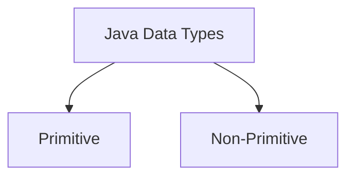

------

#### 🔹 Primitive Data Types

- Store **actual values**
- Predefined by Java
- Fixed memory size
- Stored in **stack memory**

------

**📊 Primitive Types Table**

| Type      | Size          | Range                    | Default  | Example             |
| --------- | ------------- | ------------------------ | -------- | ------------------- |
| `byte`    | 1 byte        | -128 to 127              | 0        | `byte b = 10;`      |
| `short`   | 2 bytes       | -32,768 to 32,767        | 0        | `short s = 100;`    |
| `int`     | 4 bytes       | -2³¹ to 2³¹-1            | 0        | `int i = 1000;`     |
| `long`    | 8 bytes       | Large integers           | 0L       | `long l = 10000L;`  |
| `float`   | 4 bytes       | Decimal                  | 0.0f     | `float f = 10.5f;`  |
| `double`  | 8 bytes       | Decimal (high precision) | 0.0d     | `double d = 20.5;`  |
| `char`    | 2 bytes       | Unicode characters       | '\u0000' | `char c = 'A';`     |
| `boolean` | JVM dependent | true/false               | false    | `boolean b = true;` |

------

#### 🔹 Non-Primitive Data Types

- Store **reference (memory address)**
- Created by user or Java
- Stored in **heap memory**
- Can call methods

------

**📊 Types**

- `String`
- Arrays
- Classes
- Interfaces
- Objects

```java
String name = "Narsing";
int[] arr = {1, 2, 3};

class Student {
    int id;
    String name;
}
```

------

##### 🔁 Primitive vs Non-Primitive

| Feature | Primitive        | Non-Primitive     |
| ------- | ---------------- | ----------------- |
| Storage | Value            | Reference         |
| Memory  | Stack            | Heap              |
| Size    | Fixed            | Dynamic           |
| Methods | Not available    | Available         |
| Example | `int`, `boolean` | `String`, `Array` |

------

### Type Casting

**Type Casting**: Converting a variable from one data type to another.

##### 1. **Implicit Casting (Widening)**

- Automatically converts a smaller data type to a larger one.
- Example: **int** to **double** (no data loss).
- **Note**: Safe and does not require explicit instructions.

##### 2. **Explicit Casting (Narrowing)**

- Manually converts a larger data type to a smaller one.
- Example: **double** to **int** (possible data loss).
- **Syntax**: Use parentheses to specify the target type.
- Example: `int myInt = (int) myDouble;`

---

##### 📌  What is Autoboxing and Unboxing ?

Autoboxing is the automatic conversion of a primitive type into its corresponding wrapper class object, for example converting int to Integer. Unboxing is the reverse process where a wrapper object is converted back to its primitive type. This feature was introduced in Java 5 to simplify working with collections.

**Autoboxing** : Autoboxing is the **automatic conversion of a primitive type into its corresponding wrapper class object**.

```
Primitive → Object
```

##### Example

```java
int a = 10;
Integer obj = a;   // Autoboxing
```

```java
Integer obj = Integer.valueOf(a);
```

------

**Why Autoboxing is Needed  ?**

Collections in Java (like `List`, `Set`, `Map`) store **objects, not primitives**.

```java
List<Integer> list = new ArrayList<>();
list.add(10);   // Autoboxing
```

```text
int → Integer
```

------

2. **Unboxing** : Unboxing is the **automatic conversion of a wrapper object into a primitive type**.
   `Integer` → `int`

   **Example**

```java
public class Test {
    public static void main(String[] args) {

        int a = 5;

        Integer obj = a;   // Autoboxing

        int b = obj;       // Unboxing

        System.out.println(a + " " + obj + " " + b);
    }
}
```

Output

```
5 5 5
```

------

##### 📌  What is the Wrapper class in Java ?

Primitive types have corresponding **wrapper classes**.

| Primitive | Wrapper   |
| --------- | --------- |
| int       | Integer   |
| double    | Double    |
| char      | Character |
| boolean   | Boolean   |
| long      | Long      |
| float     | Float     |

- Wrapper, in general, is referred to a larger entity that encapsulates a smaller entity. Here in Java, the wrapper class is an object class that encapsulates the primitive data types.

- The primitive data types are the ones from which further data types could be created. For example, integers can further lead to the construction of long, byte, short, etc. On the other hand, the string cannot, hence it is not primitive.

- Getting back to the wrapper class, Java contains 8 wrapper classes. They are Boolean, Byte, Short, Integer, Character, Long, Float, and Double. Further, custom wrapper classes can also be created in Java which is similar to the concept of Structure in the C programming language. We create our own wrapper class with the required data types.

---

##### 📌  Why do we need wrapper classes?

The wrapper class is an object class that encapsulates the primitive data types, and we need them for the following reasons:

1. Wrapper classes are final and immutable
2. Provides methods like `valueOf(), parseInt()`, etc.
3. It provides the feature of autoboxing and unboxing.

_________________

<div align="center">
    <h4>Class & Object </h4>
</div>

##### 📌  What is a class?

- A class is a blueprint/template for creating objects. It defines attributes (fields/variables) and behavior's (methods).

**Example:**

```java
public class Home{
	public static void main(String args[]){
		System.out.println("hello");
	}
}
```

---

##### 📌  What is an object?

- An object is an instance of a class. It has state (values of fields) and behavior (methods it can perform).

**Example:**

```java
public class Main {
    public static void main (String [] args) {
        my Car = new Car(); //Creating an object
        myCar.brand = "Tesla";
        myCar.speed = 100;
        myCar.display();
    }
}
```

---

##### 📌  How do you create an object ?

- **Using new keyword**

```java
Car myCar = new Car();
```

- **Using Reflection (`newInstance()`)**

```java
class Student {

 void show() {
     System.out.println("Object created using reflection");
 }
}

public class Test {

 public static void main(String[] args) throws Exception {

     Student s = Student.class.newInstance();
     s.show();
 }
}
```

- **Using clone method (clone()):**

```java
class Student implements Cloneable {

 int id = 10;

 public Object clone() throws CloneNotSupportedException {
     return super.clone();
 }
}
```

- **Using deserialization (ObjectInputStream):**

```java
ObjectInputStream in = new ObjectInputStream(new FileInputStream("object.ser"));

Student s = (Student) in.readObject();
```

---

##### 📌  **What is the difference between a class and an object?**

| Feature    | Class                | Object                |
| ---------- | -------------------- | --------------------- |
| Definition | Blueprint for object | Instance of class     |
| Memory     | No Memory            | Memory is allocated   |
| Example    | Car class            | Car carObj=new Car(); |

<hr>
<div align="center">
    <h4>✦✦ Constructors ✦✦</h4>
</div>

#####  📌 What is a constructor?

- A constructor is a special method used to initialize objects.

**Example:**

```java
class Car {

    String brand;

    Car(String b) { // Constructor

        brand = b;

    }

}
```


##### 📌  What are the types of constructors ?

- **Default Constructor (No parameters)**

```java
class Car {
    Car( { System.out.println("Car created!");
      }
   }
```

- **Parameterized Constructor (Takes parameters)**

```java
Car(String brand) { this.brand = brand; }
```

- **Copy Constructor (Copies values from another object)**

```java
Car(Car c) { this.brand = c.brand; }
```

---

##### 📌  What happens if a class doesn't have a constructor?

- JVM provides a default constructor automatically.

##### 📌  Can a constructor be private?

- Yes, it is used in the Singleton pattern:

**Example :**

```java
public class Singleton {
    private static Singleton instance;
    private Singleton() {
    }
    public static Singleton getInstance() {
        if (instance == null) {
            instance = new Singleton();
        }
        return instance; 
    }
    public static void main(String[] args) {
        Singleton sig=new Singleton();
        getInstance();
    }

}
```

---

##### 📌  How do you design an immutable class in Java? What rules should you follow?

An **immutable class** is a class whose objects cannot be modified once created.

To design an immutable class in Java, follow these rules :

1.  **Declare the class as final** → So it cannot be subclassed.

2.  **Make all fields private and final** → So fields cannot be changed after initialization.
    
3.  **Don't provide setters** → No method should modify fields.

4.  **Initialize all fields in the constructor** → Assign values only once.
    
5.  **Perform deep copy for mutable objects** → Prevent external modification.
    
6.  **Return copies instead of references** in getter methods if fields are mutable.

##### 📌  **Classic Immutable Class**

```java
public final class Immutable {
    private final String name;
    private final int id;
    private final int[] scores;            // mutable array
    private final List<String> tags;      // list of immutable strings

    public Immutable(String name, int id, int[] scores, List<String> tags) {
        this.name = name;
        this.id = id;
        this.scores = (scores == null) ? null : Arrays.copyOf(scores, scores.length);
        this.tags = (tags == null) ? List.of() : List.copyOf(tags); // defensive copy + unmodifiable
    }

    public String getName() { return name; }

    public int getId() { return id; }

    // return a copy so caller cannot mutate internal array
    public int[] getScores() {
        return (scores == null) ? null : Arrays.copyOf(scores, scores.length);
    }

    // safe to return directly because tags is an unmodifiable copy
    public List<String> getTags() { return tags; }

    @Override
    public boolean equals(Object o) {
        if (this == o) return true;
        if (!(o instanceof Immutable)) return false;
        Immutable that = (Immutable) o;
        return id == that.id &&
               Objects.equals(name, that.name) &&
               Arrays.equals(scores, that.scores) &&
               Objects.equals(tags, that.tags);
    }

    @Override
    public int hashCode() {
        int result = Objects.hash(name, id, tags);
        result = 31 * result + Arrays.hashCode(scores);
        return result;
    }
}

```

✅ No setters
✅ Fields are private final
✅ Class is final
➡️ Hence, **Immutable**

📌 **Modern Approach (Using record in Java 16+)**

```java
public record Immutable (int id,String name) {

}
```

📘 record automatically makes the class:

- final

- Fields are private final

- No setters generated ➡️ **Immutable by default**

**✅ Key Benefits**

- Thread-safe by default (no synchronization needed)
- Easy to debug and test
- Ideal for DTOs and response objects in microservices

---

<div align="center">
    <h3>✦✦ Methods & Object ✦✦</h3>
</div>
##### 📌  What is the difference between a method and a constructor?

| **Feature**     | **Constructor**                                | **Method**                        |
| --------------- | ---------------------------------------------- | --------------------------------- |
| **Purpose**     | Initializes an object                          | Defines the behavior of an object |
| **Name**        | Same as class name                             | Any valid method name             |
| **Return Type** | No return type (not even `void`)               | Can have a return type            |
| **Call**        | Called automatically when an object is created | Called explicitly                 |

##### 📌  **What are Access modifiers ?**

Access modifiers in Java control the visibility of classes, methods, and variables. 

There are four types: 

- **Public**: Accessible from any class, anywhere.

- **Protected**: Accessible within the same package and by subclasses in other packages.
  
- **Default (package-private)**: Accessible only within the same package.
  
- **Private**: Accessible only within the same class.

> [!TIP]
>
> private   → 🏠 My Room (only me)
> default   → 🏢 My Building (same package)
> protected → 🏫 My Family + Building (subclass + package)
> public    → 🌍 World (anywhere)

------

##### 📌  Access Modifier Visibility Table

| Modifier  | Same Class🏠 | Same Package🏢 | Subclass | Other Package |
| --------- | ----------- | ------------- | -------- | ------------- |
| private   | ✔           | ✖             | ✖        | ✖             |
| default   | ✔           | ✔             | ✖        | ✖             |
| protected | ✔           | ✔             | ✔        | ✖             |
| public    | ✔           | ✔             | ✔        | ✔             |

---

##### 📌  What is the difference between an instance variable and a local variable?

| Feature | Instance Variable             | Local Variable               |
| ------- | ----------------------------- | ---------------------------- |
| Scope   | Exists throughout object life | Exists within a method/block |
| Storage | Stored in heap memory         | Stored in stack memory       |
| Default | Gets default value            | No default value             |
| Value   | null                          | 0                            |

##### 📌What is Copy by Value vs Copy by Reference (Java)

 **Copy by Value (Primitive Types)**

- when a method is called & a variable is passed as an argument, the value of that variable is actually copied into a new variable inside the method. This means that any changes made to the variable inside the method do not affect the original variable outside the method. This is known as pass by value.
- Used with **primitive data types** (`int`, `float`, `boolean`, etc.)
- Changes made to copied variable **do NOT affect original**

**Example**

```java
public class PassByValueExample {
    public static void main(String[] args) {
        int num = 10;
        System.out.println("Before method call: " + num); // Output: 10
        
        changeValue(num);
        System.out.println("After method call: " + num); // Output: 10
    }
    
    public static void changeValue(int x) {
        x = 20;
    }
}

/*In this example, we have a variable `num` with an initial value of 10. We pass `num` to the `changeValue` method, which attempts to change its value to 20. However, when we print the value of `num` after the method call, we see that it remains unchanged at 10. This is because a copy of the value was passed to the method, & any changes made inside the method affected only the copy, not the original variable.*/
```

------

**Copy by Reference (Object Behavior)**

- In some programming languages, like C++, there is a concept called pass by reference. When a variable is passed by reference, the method receives a direct reference to the original variable, not just a copy of its value. This means that any changes made to the variable inside the method will affect the original variable outside the method.

  However, Java does not support pass by reference for variables. In Java, only pass by value is used. This means that when an object reference is passed to a method, the method receives a copy of the reference, not a direct reference to the original object. 

  It's important to note that while Java doesn't support pass by reference for variables, it does allow you to achieve a similar effect when working with objects.

- Both variables point to **same object in heap**

**Example**

```java
import java.util.ArrayList;

public class Test {
    public static void main(String[] args) {
        ArrayList<String> list1 = new ArrayList<>();
        list1.add("Hello");

        ArrayList<String> list2 = list1; // reference copy
        list2.add("World");

        System.out.println(list1); // [Hello, World]
    }
}
```

```java
public class PassByReferenceExample {
    public static void main(String[] args) {
        Person person = new Person("Rahul", 25);
        System.out.println("Before method call: " + person.getName()); // Output: Rahul
        
        changePersonName(person);
        System.out.println("After method call: " + person.getName()); // Output: Harsh
    }
    
    public static void changePersonName(Person p) {
        p.setName("Harsh");
    }
}

class Person {
    private String name;
    private int age;
    
    public Person(String name, int age) {
        this.name = name;
        this.age = age;
    }
    
    public String getName() {
        return name;
    }
    
    public void setName(String name) {
        this.name = name;
    }
    
    public int getAge() {
        return age;
    }
    
    public void setAge(int age) {
        this.age = age;
    }
}
/*
In this example, we have a `Person` class with a `name` & `age` property. We create an instance of `Person` called `person` with the name "Rahul" & age 25. We pass the `person` object to the `changePersonName` method, which changes the name property to "Harsh".

When we print the name of the `person` object after the method call, we see that it has indeed changed to "Harsh". This is because the `changePersonName` method received a copy of the reference to the `person` object, & any changes made to the object inside the method affected the original object.

So, while Java doesn't support pass by reference directly, it allows you to modify the state of an object passed to a method, giving you a similar effect.
*/
```

------

##### 📌 Shallow Copy vs Deep Copy (Java)

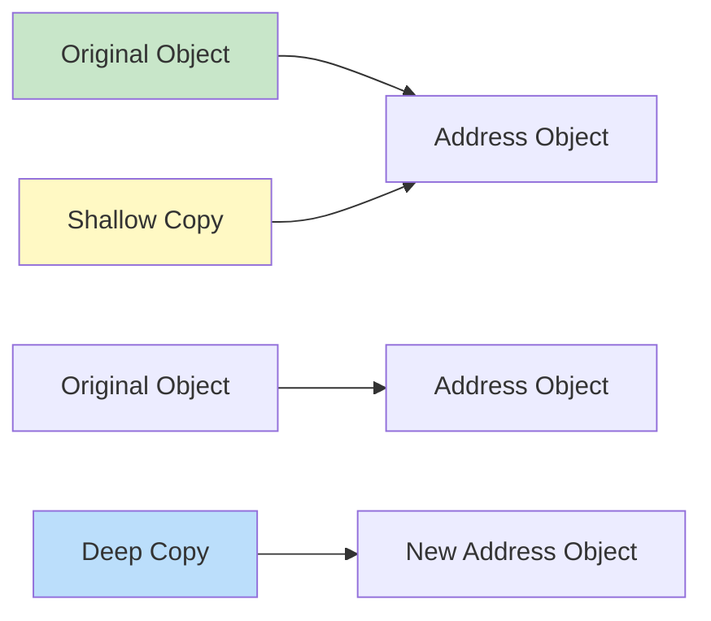

| Feature           | Shallow Copy                                                 | Deep Copy                                                    |
| ----------------- | ------------------------------------------------------------ | ------------------------------------------------------------ |
| Object Creation   | New object                                                   | New object                                                   |
| Nested Objects    | Shared                                                       | Fully copied                                                 |
| Independence      | ❌ No                                                         | ✅ Yes                                                        |
| Performance       | Faster                                                       | Slower                                                       |
| Memory Usage      | Less                                                         | More                                                         |
| Safe for Mutable? | ❌ No                                                         | ✅ Yes                                                        |
| Use case          | You want to create a copy but do not need independent copies of nested objects. | You need full independence between the original and the copy, especially in mutable objects. |

------

##### 📌 What is Shallow Copy 

A **shallow copy** creates a new instance of the object but copies the field values exactly as they are. 

- **Behavior**: Primitive fields are copied by value, but **reference fields** (like objects or arrays) still point to the same memory locations as the original. 

- **Side Effects**: Modifying a nested object in the copy will also change it in the original. 

- **Implementation**: This is the default behavior of the  method. 

- **Example**: 

  ```java
  class Address {
      String city;
  }
  
  class Student implements Cloneable {
      String name;
      Address address;
  
      protected Object clone() throws CloneNotSupportedException {
          return super.clone(); // shallow copy
      }
  }
  
  public class Test {
      public static void main(String[] args) throws Exception {
          Address addr = new Address();
          addr.city = "Pune";
  
          Student s1 = new Student();
          s1.name = "Narsing";
          s1.address = addr;
  
          Student s2 = (Student) s1.clone();
  
          s2.address.city = "Mumbai";
  
          System.out.println(s1.address.city); // Mumbai ❗
      }
  }
  ```

  

##### 📌 What is Deep Copy 

A **deep copy** creates a new instance of the object and **recursively clones** all nested objects within it. 

- **Behavior**: Every nested object is duplicated into a new memory location, making the copy entirely independent of the original. 
- **Side Effects**: Changes made to the nested objects in the copy do **not** affect the original. 
- **Implementation**: There is no built-in "deep copy" method in Java; it must be implemented manually by overriding  or using a **Copy Constructor**. 
- **Example**: 

```java
class Address {
    String city;
}

class Student implements Cloneable {
    String name;
    Address address;

    protected Object clone() throws CloneNotSupportedException {
        Student s = (Student) super.clone();
        s.address = new Address(); // new object
        s.address.city = this.address.city;
        return s;
    }
}

public class Test {
    public static void main(String[] args) throws Exception {
        Address addr = new Address();
        addr.city = "Pune";

        Student s1 = new Student();
        s1.name = "Narsing";
        s1.address = addr;

        Student s2 = (Student) s1.clone();

        s2.address.city = "Mumbai";

        System.out.println(s1.address.city); // Pune ✅
    }
}
```

---

**Alternative Methods** 

- **Copy Constructor**: A constructor that takes an instance of the same class and manually copies all fields. 

- **Serialization**: Converting an object to a byte stream and back creates a deep copy automatically, though it is slower. 

- **Libraries**: For complex objects, libraries like  Apache Commons Lang (SerializationUtils)  or  Gson can be used to perform deep copies without manual recursive logic. 

##### 📌 What is the difference between Copy by Value and Copy by Reference?

| Feature          | Copy by Value | Copy by Reference (Behavior) |
| ---------------- | ------------- | ---------------------------- |
| Data Passed      | Actual value  | Reference (address value)    |
| Memory           | Separate      | Shared object                |
| Change Reflected | ❌ No          | ✅ Yes                        |
| Java Support     | ✅ Yes         | ❌ Not true (only behavior)   |
| Used With        | Primitives    | Objects & Arrays             |

#####  📌 What is the difference between shallow copy and deep copy?

| **Feature**    | **Shallow Copy**                      | **Deep Copy**                       |
| -------------- | ------------------------------------- | ----------------------------------- |
| **Definition** | Copies reference, not the actual data | Copies the entire object            |
| **Example**    | `clone()` method (default behavior)   | Custom implementation (manual copy) |

**Example:** 

```java
Car car1 = new Car(); 
Car car2 = car1; // Shallow Copy – both references point to the same object
Car car2 = new Car(car1); // Deep Copy – creates a new object with copied data
```

---

##### 📌  Java Memory Model (JVM Memory)

Java memory is divided into different areas used by the **JVM (Java Virtual Machine)**. JVM memory is divided into Heap, Stack, Method Area, PC Register, and Native Method Stack. Heap stores objects and is managed by garbage collection, Stack stores method calls and local variables for each thread, and Method Area stores class metadata and static variables.

Main memory areas:

1. **Heap** 
2. **Stack**
3. **Method Area**
4. **PC Register**
5. **Native Method Stack**

------

##### 📌  JVM Memory Architecture

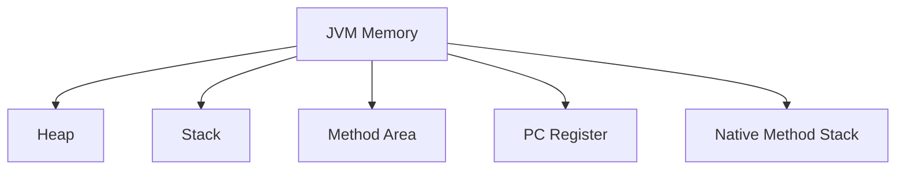

------

**1. Heap Memory (Objects)**

**Role:** Stores **objects and instance variables**.

Example

```java
Student s = new Student();
```

Explanationc

- Object `Student` → stored in **Heap**
- Reference `s` → stored in **Stack**

------

**2. Stack Memory(methods)**

**Role:** Stores **method calls and local variables**.

Example

```java
int a = 10;
```

`a` is stored in **Stack**.

Each thread has **its own stack**.

------

**3. Method Area(class data)**

**Role:** Stores **class level information**.

Contains

- class structure
- static variables
- method bytecode

Example

```java
static int count = 10;
```

------

**4. PC Register**

PC = **Program Counter**

Stores the **address of current executing instruction**.

Each thread has its own PC register.

```text
Thread → PC Register → current instruction
```

------

##### 5. Native Method Stack

Used when Java calls **native methods written in C/C++**.

Example

```java
System.currentTimeMillis();
```

Native methods interact with OS libraries.

------

**Example**

```java
class Test {
    static int x = 10;
    public static void main(String[] args) {
        int a = 5;
        Student s = new Student();
    }
}
```

**Memory allocation**

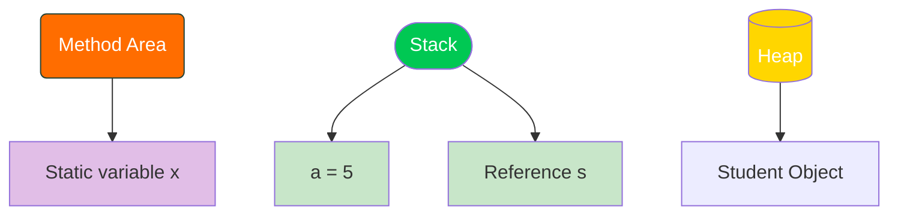

------

<div align="center">
    <h3>✦🧵 String in Java ✦</h3>
</div>


##### 📌  What is a String in Java?

- String is the sequence of the characters.

- It is an object of String class.n 

----

##### 📌  What is Java String Pool?

A Java String Pool is a place in heap memory where all the strings defined in the program are stored. JVM checks for the presence of the object in the String pool, If String is available in the pool, the same object reference is shared with the variable, else a new object is created.

---

##### 📌  Why is String immutable ?

- Strings are immutable  for security, performance, and thread safety reasons. It prevents unwanted changes and helps optimize memory usage.
  
- Immutable means we **cannot make changes once declared.**

- **Security** : all the credentials and confidential data like username, passwords are stored in String if its is mutable then these parameters can be easily changed by attackers.
  
- JVM reuses the strings that help to **save memory**.

- **Thread safe** -- as String is immutable multiple threads can access it at a time.

##### 📌  Difference between String vs StringBuilder vs StringBuffer

- String Buffer and StringBuilder are the classes of java used to create Mutable strings.
  
  | Feature      | String | StringBuilder | StringBuffer              |
  | ------------ | ------ | ------------- | ------------------------- |
  | Mutable?     | No ❌   | Yes ✅         | Yes ✅                     |
  | Thread-safe? | Yes ✅  | No ❌          | Yes (Synchronized) ✅      |
  | Performance  | slow   | Fast          | Slower than StringBuilder |

---

##### 📌  What is String interning?

- `String.intern()` moves a string to the String Pool if it isn\'t already there.

- **Example:**

```java
String s1 = new String("Java"); // Creates a new String object in the heap memory

String s2 = s1.intern(); // Moves "Java" to the String Pool (orreturns the reference if already present)

String s3 = "Java"; // Already exists in the String Pool

System.out.println(s2 == s3); // true (both refer to the same object in the String Pool)
```
---

##### 📌  What is String pool and how does it work and its advantages ?

The Java String Pool (also called the String Intern Pool) is a special memory area inside the heap that stores string literals. When the JVM encounters a string literal:

1. It first checks whether an identical string already exists in the pool.
2. If found, it reuses the existing reference.
3. If not, it creates a new string object in the pool.
4. This mechanism **reduces memory consumption** by reusing immutable string objects.
5. Using the **new keyword** forces the JVM to **create new objects in the heap** outside the **String Constant Pool**, even if an identical value already exists there. Hence, s1 and s2 refer to different heap objects.

**Example:**
`String str1 = "Hello";` Here, the variable str1 is stored in the stack, while "Hello" is stored in the String Constant Pool inside the heap.

```java
public class Example2 {
    public static void main(String[] args) {
        String s1 = new String("abc");
        String s2 = new String("abc");
        String s3 = "abc";
        String s4 = "abc";

        if (s1 == s2) {
            System.out.println("both are not in same memory location because its created using new keyword which create object in heap memory for string ");
        }
        if (s3 == s4) {
            System.out.println("both are in same memory location becsuse one single string is created in string pool and refered by both veriables");
        }
    }
}
```
**Adantages :**

1.  The main advantages of a string pool are memory efficiency and performance improvement. By reusing existing string objects, it reduces the overall memory footprint and speeds up operations like string comparison
2. Performance Improvement
3.  Thread Safety
4. Security

---

##### 📌 What is the difference between == and .equals() ⚖️ in objects?

##### 📌 ✅ `==`

- Compares **memory reference (address)**
- Checks: *Are both variables pointing to the same object?*

##### 📌 ✅ `.equals()` 

- Compares **actual content (value inside string)**
- Checks: *Do both strings have the same characters?*

```java
String s1 = new String("Narsing");
String s2 = new String("Narsing");

System.out.println(s1 == s2);       // false → compares memory addresses
System.out.println(s1.equals(s2));  // true  → compares con
```

---

In Java, comparing strings can be confusing because **`==`** and **`.equals()`** behave very differently. Let’s break it down clearly with **all important scenarios**, especially when using `+` (concatenation).n 

##### Case A: String literals (stored in String Pool)

```java
String s1 = "hello";
String s2 = "hello";
```

- `s1 == s2` → ✅ true (same pool reference)
- `s1.equals(s2)` → ✅ true

------

##### Case B: Using `new` keyword (Heap memory)

```java
String s1 = new String("hello");
String s2 = new String("hello");
```

- `s1 == s2` → ❌ false (different objects)
- `s1.equals(s2)` → ✅ true

##### Case C: Compile-time concatenation

```java
String s1 = "hello" + "world";
String s2 = "helloworld";
```

- Happens at compile time → stored in pool
- `s1 == s2` → ✅ true
- `s1.equals(s2)` → ✅ true

------

##### Case D: Runtime concatenation (using variables)

```java
String a = "hello";
String b = "world";
String s1 = a + b;
String s2 = "helloworld";
```

- Happens at runtime → new object created in heap
- `s1 == s2` → ❌ false
- `s1.equals(s2)` → ✅ true

------

##### Case E: Mixed (literal + variable)

```java
String a = "world";
String s1 = "hello" + a;
String s2 = "helloworld";
```

- Runtime concatenation
- `s1 == s2` → ❌ false
- `s1.equals(s2)` → ✅ true

---

##### 📌 **String Methods :**

1.  **Length() --** Return length of String

2.  **charAt(index)-** Return char for given index

3.  **substring() --** Extract some part of String

4.  **equals() --** Compare two string content

5.  **equalsIgnoreCase() --** Compare two string with ignoring case of String
    
6.  **contains ()** -- check the string contains given char sequence

7.  **toUpperCase() , toLowerCase()** - convert String case

8.  **replace() , replaceAll() --** replace part of String

9.  **split() --** split string into array

10. **indexOf() , lastIndexOf()** -- return index of char in string

11. **startWith() , endWith()** -- check beginning of ending of string

12. **trim()** -- remove whitespaces from string

13. **isEmpty() , isBlank()** -- check blank or empty string

14. **valueOf()** -- convert other data type into string

15. **matches()** -- check if string matched the given regex

---

<div align="center"><h3>◆◆◆ This & Static Keyword ◆◆◆</h3></div>

------

#### 📌 `this` Keyword

The `this` keyword refers to the **current instance of a class**.

##### 📌 🔑 Key Uses

- Differentiate **instance variables vs local variables**
- Call **constructors**
- Return the **current object**
- Pass the **current object as a parameter**

------

##### 📌 1️⃣ Referring to Instance Variables

When local and instance variables have the same name:

```java
public class Car {

    public String name = "Maruti";

    public void startEngine(String name) {
        System.out.println("Car engine started - " + this.name);
    }

    public static void main(String[] args) {
        Car car = new Car();
        car.startEngine("Honda"); 
        // Output: Car engine started - Maruti
    }
}
```

> ✅ `this.name` refers to the instance variable, not the method parameter

------

##### 📌 2️⃣ Calling Another Constructor (`this()`)

Used to invoke another constructor in the same class.

```java
public class Car {

    private String model;
    private int year;

    public Car() {
        this("Unknown", 0); // Calls parameterized constructor
    }

    public Car(String model, int year) {
        this.model = model;
        this.year = year;
    }
}
```

> ⚠️ Must be the **first statement** inside constructor

------

##### 📌 3️⃣ Returning Current Object (Method Chaining)

```java
public class Builder {
    private String name;

    public Builder setName(String name) {
        this.name = name;
        return this;
    }

    public Builder build() {
        return this;
    }
}
```

> ✅ Enables **fluent API / method chaining**

------

##### 📌 4️⃣ Passing Current Object

```java
public class Example {

    public void display() {
        show(this);
    }

    public void show(Example obj) {
        System.out.println("Object reference: " + obj);
    }
}
```

------

#### 📌 `Static` Keyword

The `static` keyword defines **class-level members**.

- Shared across all objects
- Memory allocated **once**
- Accessible **without object creation**
- Cannot use `this` inside static context

------

**📌 Static Members**

#####  1️⃣ Static Variable

- Shared among all instances

#####  2️⃣ Static Method

- Belongs to class

#####  3️⃣ Static Block

- Executes **when class loads**

```java
public class Example {
    static {
        System.out.println("Static block executed");
    }

    public static void main(String[] args) {
        System.out.println("Main method executed");
    }
}
```

------

##### 📌 ❓ Static Method in Constructor

✅ **Yes, allowed**

```java
class Test {
    static void display() {}

    Test() {
        display(); // valid
    }
}
```

> ✔ Static methods belong to class → accessible anywhere

------

##### 📌 ❌ Can We Override Static Methods?

No → only **method hiding**

```java
class Parent {
    static void display() {
        System.out.println("Parent");
    }
}

class Child extends Parent {
    static void display() {
        System.out.println("Child");
    }
}

public class Test {
    public static void main(String[] args) {
        Parent p = new Child();
        p.display(); // Output: Parent
    }
}
```

> ⚠️ Static methods are resolved at **compile-time**

------

##### 📌  this vs static

| Feature         | `this`                   | `static`                            |
| --------------- | ------------------------ | ----------------------------------- |
| Meaning         | Current object reference | Belongs to class                    |
| Usage           | Instance methods         | Variables, methods, blocks, classes |
| Object Required | ✅ Yes                    | ❌ No                                |
| Access Instance | ✅ Yes                    | ❌ No                                |
| Access Static   | ✅ Yes                    | ✅ Yes                               |

------

#### `final` Keyword

👉 `final` is used to **restrict modification**

##### 📌 🔑 3 Main Uses

##### 1️⃣ Final Variable (Constant)

```java
final int x = 10;
x = 20; // ❌ Error
```

✔ Value cannot change
✔ Used for constants

------

##### 2️⃣ Final Method (No Overriding)

```java
class A {
    final void show() {}
}

class B extends A {
    void show() {} // ❌ Error
}
```

✔ Protects logic

------

##### 3️⃣ Final Class (No Inheritance)

```java
final class A {}

class B extends A {} // ❌ Error
```

✔ Used for security (e.g., `String`)

------

##### 📌 🎯 Why Use `final`?

- Prevent accidental changes
- Improve security
- Make code predictable
- Support immutability

---

<div align="center">
    <h3>◆◆◆ Garbage Collection ◆◆◆</h3>
</div>
##### 📌 1. Overview
- Garbage collection in Java is an automatic memory management process that helps Java programs run efficiently.
- it is an automatic process that removes unused objects from heap.
- Garbage Collection (GC) in Java is an automatic memory management process that removes unused objects from the heap, so you don’t have to manually free memory like in C/C++.

##### Key Benefits
* **Automatic Management:** Developers don't need to manually allocate/deallocate memory (unlike C/C++).
* **Safety:** Reduces common bugs like memory leaks and dangling pointers.
* **Efficiency:** Optimizes memory usage by compacting live objects to reduce fragmentation.

---

##### 📌 ⚙️ How Garbage Collection Works

##### 1. Object Creation

```java
Student s = new Student();
```

Object is created in heap, and reference `s` points to it.

------

##### 2. Object Becomes Unreachable

```java
s = null;
```

Now the object has no reference → eligible for GC.

------

##### 3. GC Process (Simplified)

🔹 **Step 1: Mark**

- JVM identifies all **reachable objects** (still in use).

🔹 **Step 2: Sweep**

- Removes **unreachable objects** from memory.

🔹 **Step 3: Compact**

- Rearranges memory to avoid fragmentation.

------

### 📌 📊 Generational Garbage Collection

Java divides heap into generations:


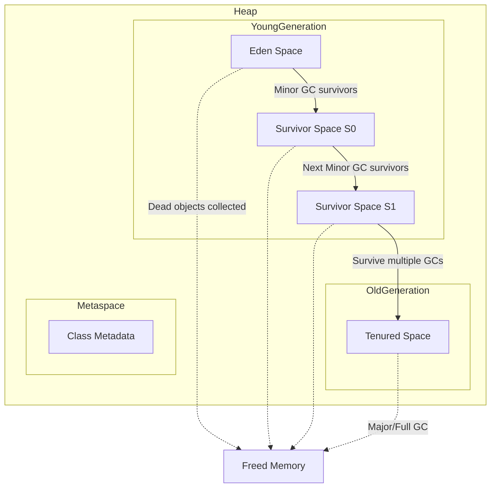


##### 🗂 Heap Structure in Java

The JVM heap is divided into **generations**:

1. **Young Generation** → short‑lived objects (most local variables, temporary objects).
2. **Old Generation (Tenured)** → long‑lived objects (cached data, sessions).
3. **Metaspace** → class metadata (since Java 8).

##### 🌱 Inside the Young Generation

The Young Generation itself is split into:

- **Eden Space**
  - Where **new objects are first allocated**.
  - Most objects die quickly here.
  - When Eden fills up, a **Minor GC** occurs.
- **Survivor Spaces (S0 and S1)**
  - Two equal‑sized areas: **Survivor 0 (S0)** and **Survivor 1 (S1)**.
  - After a Minor GC, objects that survive are copied from Eden into one of the survivor spaces.
  - On subsequent GCs, surviving objects are copied back and forth between S0 and S1.
  - If an object survives multiple GCs (reaches a certain **age threshold**), it is promoted to the **Old Generation**.

**🔄 Example Flow**

1. New object → goes into **Eden**.
2. Minor GC runs → dead objects cleared, survivors moved to **S0**.
3. Next Minor GC → survivors copied to **S1**.
4. After enough cycles → survivors promoted to **Old Generation**.

#### ⚡ Why this design?

- **Efficiency**: Most objects die young, so frequent small collections in Eden are cheap.
- **Promotion policy**: Only objects that prove to be long‑lived move to Old Generation, reducing overhead.
- **Copying GC**: Survivor spaces allow fast copying collection instead of complex mark‑sweep.

---

##### 1. Young Generation

- Where new objects are created.
- Divided into:
  - Eden Space
  - Survivor Spaces (S0, S1)

  👉 Most objects die here quickly.

------

##### 2. Old (Tenured) Generation

- Objects that survive multiple GC cycles are moved here.

------

##### 3. Metaspace (Java 8+)

- Stores class metadata (replaced PermGen).


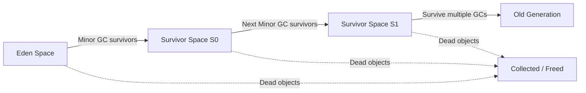

------

##### 📌 📂 Types of Garbage Collection in Java

##### 1. Minor GC (Young GC)

- Happens in **Young Generation**
- Fast and frequent
- Cleans the **Young Generation** (short‑lived objects).
- Fast, frequent collections.
- Example: temporary variables, method-local objects.

------

##### 2. Major GC (Old GC)

- Happens in **Old Generation**
- Slower than Minor GC
- Cleans the **Old Generation** (long‑lived objects).
- Slower, less frequent.
- Example: cached data, session objects

------

##### 3. Full GC

- Cleans entire heap (Young + Old + Metaspace)
- **Very slow** ❗

------

### 📌 🧩 Types of Garbage Collectors (JVM Algorithms/engines)

A **Garbage Collector** is the specific implementation or algorithm used by the JVM to perform the collection process. 

##### 1. Serial GC

- Single-threaded
- Suitable for small applications

```bash
-XX:+UseSerialGC
```

------

##### 2. Parallel GC (Throughput GC)

- Uses multiple threads
- Focus: **High throughput**

```bash
-XX:+UseParallelGC
```

------

##### 3. CMS (Concurrent Mark-Sweep) ❌ (Deprecated)

- Minimizes pause time
- Runs concurrently with application

```bash
-XX:+UseConcMarkSweepGC
```

------

##### 4. G1 GC (Garbage First) ✅ (Default in modern Java)

- Divides heap into regions
- Prioritizes areas with most garbage

```bash
-XX:+UseG1GC
```

👉 Best for large applications

------

##### 5. ZGC (Z Garbage Collector)

- Very low latency (pause time < 10ms)
- Scalable for large heaps

```bash
-XX:+UseZGC
```

------

##### 6. Shenandoah GC

- Low pause time GC (like ZGC)
- Concurrent compaction

```bash
-XX:+UseShenandoahGC
```

------

##### 📌 🧪 When Object Becomes Eligible for GC

✔ Reference set to null
✔ Object reassigned
✔ Method finished (local variables destroyed)
✔ Anonymous objects
✔ Cyclic references (handled by GC)

------

##### ⚠️ Important Points

##### 1. `System.gc()`

- Suggests JVM to run GC (not guaranteed)

------

##### 2. `finalize()` (Deprecated ❌)

- Used before object destruction (avoid using)

------

##### 3. Memory Leak in Java 🌚?

Yes, possible if:

- Objects are referenced but not used
- Static collections holding objects

---

### 🧩 What is a Memory Leak?

A **memory leak** occurs when objects are no longer needed but **still referenced**, preventing the Garbage Collector (GC) from reclaiming their memory. Over time, this can cause the heap to fill up, leading to `OutOfMemoryError`.

##### ⚠️ Common Reasons for Memory Leaks

1. **Unreleased references in collections**
   - Adding objects to a `List`/`Map` but never removing them.
2. **Static fields holding objects**
   - Static references live for the entire JVM lifecycle.
3. **Listeners / callbacks not deregistered**
   - Event listeners keep references alive.
4. **Improper use of caches**
   - Caches that grow indefinitely.
5. **Inner classes holding outer references**
   - Anonymous inner classes can unintentionally keep outer objects alive.
6. **ThreadLocal misuse**
   - Forgetting to `remove()` values from `ThreadLocal`.

##### ✅ How to Avoid Memory Leaks

- **Remove unused references** from collections.
- **Use weak references** (`WeakHashMap`, `WeakReference`) for caches or listeners.
- **Unregister listeners** when no longer needed.
- **Be careful with static fields** — avoid storing large objects.
- **Use try-with-resources** to close streams, sockets, DB connections.
- **Profile with tools** like VisualVM, JProfiler, or Eclipse MAT to detect leaks.

---

#### 🛠 Tools to Detect Leaks

- **VisualVM** (bundled with JDK) → monitor heap usage.
- **Eclipse MAT** → analyze heap dumps.
- **JProfiler / YourKit** → advanced profiling.

---

##### 📌 How does Java handle garbage collection, and what are some strategies for optimizing garbage collection performance?

In Java, garbage collection is the process of automatically freeing memory that is no longer being used by an application. Java uses a mark-and-sweep algorithm for garbage collection, which works by marking all objects that are still being used and then sweeping away any objects that are not marked. To optimize garbage collection performance, you can use strategies such as minimizing object creation, minimizing object retention, and tuning the garbage collector settings. Minimizing object creation involves reusing objects rather than creating new ones, while minimizing object retention involves releasing objects as soon as they are no longer needed

<div align="center">
    <h3>✦✦ Exception ✦✦</h3>
</div>


------

##### 📌 What is an Exception in Java?

An **exception** is an event that **disrupts normal program flow** during execution.

Example:

```java
int a = 10 / 0; // ArithmeticException
```

------

##### 📌 Types of Exceptions

##### 1. Checked Exceptions (Compile-time)

- Checked at compile time
- Must handle using `try-catch` or `throws`

Examples:

- `IOException`
- `SQLException`

------

##### 2. Unchecked Exceptions (Runtime)

- Occur during runtime
- Not mandatory to handle

Examples:

- `NullPointerException`
- `ArithmeticException`
- `ArrayIndexOutOfBoundsException`

------

##### 3. Errors

- Serious problems (not handled)
- Related to JVM/system

Examples:

- `OutOfMemoryError`
- `StackOverflowError`

***

##### 📌 Difference Between Checked vs Unchecked Exception

| Feature              | Checked Exception              | Unchecked Exception            |
|---------------------|--------------------------------|-------------------------------|
| Checked Time        | Compile-time                   | Runtime                       |
| Handling Required   | Yes                            | No                            |
| Cause               | External issues                | Programming mistakes          |
| Example             | IOException                    | NullPointerException          |

---

##### 📌  What is try-catch-finally?

Used to handle exceptions and avoid program crash.
**Structure**

```java
try {
// risky code
} catch(Exception e) {
// handling
} finally {
// always executes
}
```
finally block always runs used for closing resources (DB, files)

---

##### 📌  Can we use try without catch?

✅ Yes, but only with finally

**Example**

```java
try {
System.out.println("Hello");
} finally {
System.out.println("Cleanup code");
}
```

❌ **Not allowed**

    try {
    }

Must have catch or finally


---

##### 📌  throw vs throws

| Feature  |  throw |  throws |
| ------------ | ------------ | ------------ |
|  Used for | explicitly throw exception  |  declare exception |
| Used inside  |  method |  method signature |
|Keyword type| statement|  declaration |

**Example**

**throw**

```java
if(age < 18){
throw new IllegalArgumentException("Not eligible");
}
```

**throws**

```java
public void readFile() throws IOException {
FileReader f = new FileReader("test.txt");
}
```


---

##### 📌 Use Cases of User Defined Exceptions

We create custom exceptions for business rules.

**Examples**

- Invalid bank transaction
- Insufficient balance
- Invalid order
- Age restriction

Example

```java
if(balance < amount){
throw new InsufficientBalanceException("Low balance");
}
```
---

##### 📌 How to Create User Defined Exception

**Step 1: Create class**

```java
class InsufficientBalanceException extends Exception {

public InsufficientBalanceException(String message){
super(message);
}
}
```

**Step 2: Use it**

```java
public void withdraw(int amount) throws InsufficientBalanceException {

if(amount > balance){
throw new InsufficientBalanceException("Balance is low");
}
}
```

**Step 3: Handle it**

```java
try {
account.withdraw(1000);
} catch (InsufficientBalanceException e) {
System.out.println(e.getMessage());
}

```


---

##### 📌 **Error vs Exception**

Feature|Exception|Error
--------|-----------|-------
Type|Recoverable|Not recoverable
Handled|Yes|Usually no
Example|IOException|OutOfMemoryError

**Example**

```java
// Exception
int a = 10/0;

// Error
int[] arr = new int[999999999];
```
---


<div align="center"><h3>🔴🟠🟢 OOPs (Object-Oriented Programming) 🔴🟠🟢 </h3></div>

- **OOP (Object-Oriented Programming)** is a programming approach where programs are designed using **objects and classes** that contain **data (variables) and behavior (methods)**.
- An **object** represents a real-world entity and contains **data (variables)** and **behavior (methods)**.
- OOP helps to make programs **modular, reusable, and easy to maintain**.

##### 📌 Core Principles of OOP

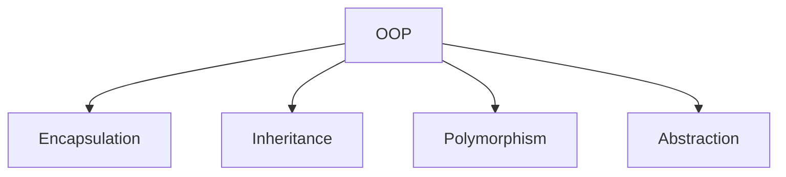

##### 📌 What are the four main principles of OOP?

The four pillars of Object-Oriented Programming (OOP) in are:

- **Encapsulation** → Data hiding (using private fields & getters/setters).
  
- **Inheritance** → One class acquires properties of another.

- **Polymorphism** → Many forms (method overloading & overriding).

- **Abstraction** → Hiding implementation details from users.

------

#### 📌 What is Encapsulation?

**Encapsulation** is an **OOP principle** that means **wrapping data (variables) and code (methods) together into a single unit (class)** and restricting direct access to the data.

Encapsulation is the process of **wrapping data and methods into a single unit (class) and restricting direct access to data using private variables and public getter/setter methods.**

Real-world example: **ATM Machine**
A user can withdraw money or check balance without knowing the internal implementation.

------

**How Encapsulation is Achieved**

1. Declare variables as **private**
2. Provide **public getter and setter methods** to access and update data.

------

##### Example

```java
class BankAccount {

    private double balance;   // private variable

    public void setBalance(double balance) {
        this.balance = balance;   // setter
    }

    public double getBalance() {
        return balance;   // getter
    }
}

public class Main {
    public static void main(String[] args) {

        BankAccount account = new BankAccount();

        account.setBalance(1000);
        System.out.println("Balance: " + account.getBalance());
    }
}
```

Output

```
Balance: 1000
```

------

##### How It Works

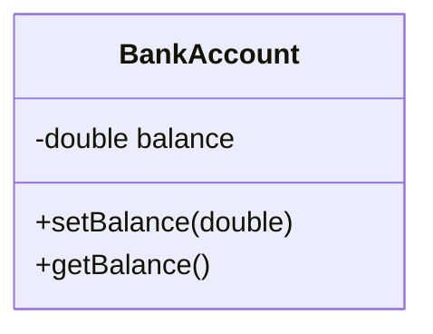

- `balance` is **private** → cannot be accessed directly
- Access is allowed through **getter/setter methods**

------

##### Benefits of Encapsulation

1. **Data Security** – prevents direct access to variables
2. **Controlled Access** – data can be validated before updating
3. **Maintainability** – easier to modify internal implementation
4. **Flexibility** – logic can be added inside getters/setters

---

#### 📌  What is Inheritance in Java?

**Inheritance** is an **Object-Oriented Programming (OOP)** concept where one class **acquires the properties and behaviors (fields and methods)** of another class.

It helps in **code reusability**, **method overriding**, and creating a **parent–child relationship** between classes.

**Example**

```java
class Animal {

    void eat() {
        System.out.println("Animal is eating");
    }
}

class Dog extends Animal {

    void bark() {
        System.out.println("Dog is barking");
    }
}

public class Test {
    public static void main(String[] args) {

        Dog d = new Dog();

        d.eat();   // inherited method
        d.bark();  // own method
    }
}
```

Output

```
Animal is eating
Dog is barking
```

##### Benefits of Inheritance

1. **Code Reusability** – reuse existing code
2. **Method Overriding** – modify parent behavior
3. **Extensibility** – easy to add new features
4. **Maintainability** – organized code structure

------

##### 📌 What are the Types of Inheritance?

Java supports different types of inheritance except **multiple inheritance with classes** to avoid ambiguity (Diamond Problem).

------

| Type                         | Description                                                 |
| ---------------------------- | ----------------------------------------------------------- |
| **Single**                   | One class inherits from another class                       |
| **Multilevel**               | A class inherits from a class that already inherits another |
| **Hierarchical**             | Multiple child classes inherit from one parent              |
| **Multiple (Not Supported)** | Java does not allow multiple inheritance with classes       |

------

##### 1️⃣ Single Inheritance

One child class inherits one parent class.

```java
class A {
    void display() {
        System.out.println("Class A");
    }
}

class B extends A {
}
```

Diagram


------

##### 2️⃣ Multilevel Inheritance

Inheritance chain.

```java
class A { }

class B extends A { }

class C extends B { }
```

Diagram

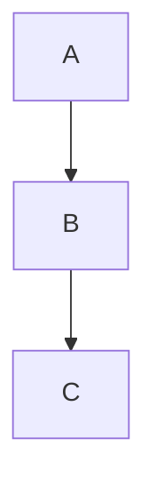

------

##### 3️⃣ Hierarchical Inheritance

One parent with multiple child classes.

```java
class A { }

class B extends A { }

class C extends A { }
```

Diagram

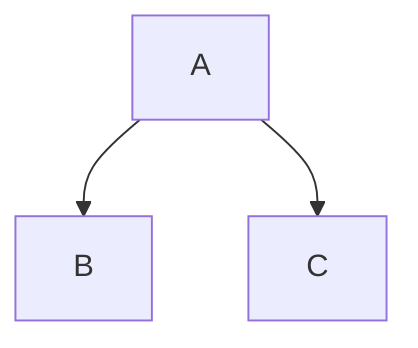

------

##### 4️⃣ Multiple Inheritance (Not Supported)

Java **does not allow**:

```java
class A { }

class B { }

class C extends A, B { }   // ❌ Not allowed
```

Reason: **Diamond Problem** (to avoids confusion.)


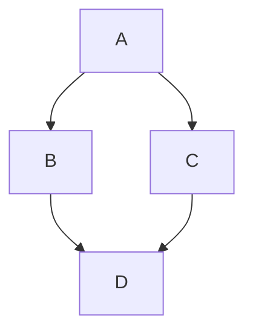


------

##### How Java Achieves Multiple Inheritance

Using **interfaces**.

```java
interface A {
    void show();
}

interface B {
    void display();
}

class C implements A, B {

    public void show() {
        System.out.println("A method");
    }

    public void display() {
        System.out.println("B method");
    }
}
```

------

##### 📌 Why Java does not support multiple inheritance with classes?

**Answer:** To avoid the **Diamond Problem**, where a child class may inherit the same method from multiple parent classes causing ambiguity.

----

#### 💎 Diamond Problem in Java – Complete Notes

------

**🧠 Definition**

The **Diamond Problem** occurs in **multiple inheritance** when a class inherits from two classes that have a **common parent**, causing ambiguity about **which method to use**.

------

**🔷 Problem Visualization**

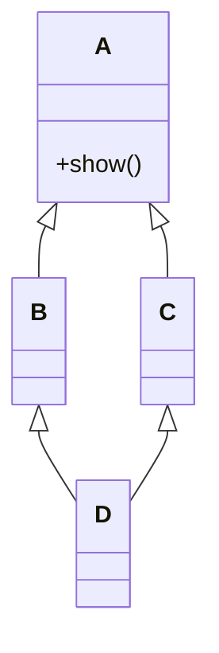

------

**❗ Problem Explanation**

- Class **A** has method `show()`
- Class **B** and **C** extend **A**
- Class **D** extends both **B** and **C**
- Now, if `D.show()` is called → ❓ **Which implementation?**

👉 This creates **ambiguity (confusion)**

------

**⚠️ Why Java Avoids It**

- Java **does NOT support multiple inheritance with classes**
- This is to **avoid Diamond Problem at compile time**

```java
// ❌ Not allowed in Java
class D extends B, C { }
```

------

##### ✅ How Java Solves Diamond Problem

**🔹 Using Interfaces (Java 8+)**

Java allows multiple inheritance via **interfaces**, but provides rules to resolve ambiguity.

```java
interface A {
    default void show() {
        System.out.println("A show");
    }
}

interface B {
    default void show() {
        System.out.println("B show");
    }
}

class C implements A, B {

    @Override
    public void show() {
        A.super.show(); // explicitly choosing
    }
}
```

------

##### 📌 Rules to Resolve Diamond Problem

**1️⃣ Class has higher priority than Interface**

- If a class provides method → it is used

------

**2️⃣ Child must override conflicting methods**

```java
class C implements A, B {
    public void show() {
        System.out.println("Resolved in C");
    }
}
```

------

**3️⃣ Use `InterfaceName.super.method()`**

```java
A.super.show();
B.super.show();
```

------

**🔁 Real-Life Analogy**

- Imagine:
  - 👨 Father gives advice
  - 👩 Mother gives advice
  - 👦 Child gets confused → **which one to follow?**

👉 That confusion = **Diamond Problem**

----

#### 📌 What is Polymorphism?

- **Polymorphism** means "many forms".  
- It allows the **same method, variable, or object** to perform different operations under different conditions.

##### 📌 🔹 Types of Polymorphism

- **Compile-time Polymorphism (Method Overloading)**
- **Runtime Polymorphism (Method Overriding)**

---

##### 📌 What is Method Overloading?

- When multiple methods have the **same name** but **different parameters** (type or number of arguments).  
- It is an example of **compile-time polymorphism**.

##### 🧠 Example

```java
class MathOperations {

    int add(int a, int b) {
        return a + b;
    }

    double add(double a, double b) { // Overloaded method
        return a + b;
    }
}

public class Main {
    public static void main(String[] args) {
        MathOperations obj = new MathOperations();

        System.out.println(obj.add(5, 10));      // Calls int version
        System.out.println(obj.add(5.5, 10.5));  // Calls double version
    }
}
```


##### 📌 What is Method Overriding?

When the same method (same name, parameters, and return type) is present in both parent and child classes, and the method in the child class overrides the one in the parent class.

It is an example of **runtime polymorphism**.

---

##### 🧠 Example

```java
class Parent {
    void display() {
        System.out.println("Parent class");
    }
}

class Child extends Parent {
    @Override
    void display() {
        System.out.println("Child class");
    }
}

public class Main {
    public static void main(String[] args) {
        Parent obj = new Child();
        obj.display(); // Calls overridden method in Child class
    }
}
```

---

#### 📌 What is Abstraction?

Abstraction is the process of **hiding implementation details** and showing only the **essential features** of an object.  It helps reduce complexity by focusing on what an object does rather than how it does it.

In Java, abstraction is mainly achieved using:
- **Abstract classes**
- **Interfaces**

It allows developers to define a common structure for related objects and enforce a contract that subclasses or implementing classes must follow.

---

##### 📌 What is an Abstract Class?

An **abstract class** in Java is declared using the `abstract` keyword.  It is a special kind of class that cannot be instantiated directly — meaning you **cannot create an object** of an abstract class.

An abstract class may contain:

- **Abstract methods:** Methods without implementation (no method body).  
- **Concrete methods:** Regular methods with a complete implementation.

Abstract classes are useful when you want to provide **partial implementation** and let subclasses complete the rest.

---

##### 🧠 Example: Abstract Class

```java
abstract class Animal {
    abstract void makeSound(); // Abstract method

    void sleep() { // Concrete method
        System.out.println("Sleeping...");
    }
}

class Dog extends Animal {
    void makeSound() {
        System.out.println("Bark");
    }
}

public class Main {
    public static void main(String[] args) {
        Animal obj = new Dog();
        obj.makeSound(); // Calls Dog's implementation
        obj.sleep();     // Inherited method from Animal
    }
}
```

##### 📌 What is an Interface in Java?

An **interface** in Java is a special type of class that contains only **abstract methods** (methods without a body)..It is used to achieve **100% abstraction** and **multiple inheritance** in Java.

Interfaces define a **contract** that implementing classes must follow. A class that implements an interface must provide implementations for all of its abstract methods.

---

##### 🧠 Key Features of an Interface

- All methods in an interface are **public** and **abstract** by default.  
- All variables are **public**, **static**, and **final** (constants).  
- A class can **implement multiple interfaces** (supports multiple inheritance).  
- Interfaces cannot have constructors because they cannot be instantiated.  
- From **Java 8**, interfaces can have:
  - **Default methods** (with body)
  - **Static methods**
- From **Java 9**, interfaces can also have **private methods**.

---

##### 🧩 Example: Interface in Java

```java
interface Animal {
    void makeSound(); // Abstract method (no body)
}

class Dog implements Animal {
    public void makeSound() {
        System.out.println("Bark");
    }
}public class Main {
    public static void main(String[] args) {
        Animal obj = new Dog();
        obj.makeSound();
    }
}
```

##### 📌 What is the Difference Between Abstract Class and Interface?

Both **Abstract Classes** and **Interfaces** are used to achieve **abstraction** in Java,but they differ in structure, purpose, and how they are implemented.

| **Feature**                   | **Abstract Class**                                           | **Interface**                                                |
| ----------------------------- | ------------------------------------------------------------ | ------------------------------------------------------------ |
| **Definition**                | Can have both abstract and concrete methods.                 | Contains only abstract methods (until Java 8).               |
| **Keyword Used**              | `abstract`                                                   | `interface`                                                  |
| **Object Creation**           | Cannot be instantiated directly.                             | Cannot be instantiated directly.                             |
| **Methods**                   | Can contain abstract and concrete methods.                   | Contains only abstract methods (before Java 8); from Java 8 onward, can have default and static methods. |
| **Variables**                 | Can have instance variables.                                 | Only `public static final` variables (constants).            |
| **Access Modifiers**          | Can have `public`, `protected`, or `private` methods.        | All methods are `public` by default.                         |
| **Constructors**              | Can have constructors.                                       | Cannot have constructors.                                    |
| **Multiple Inheritance**      | Not supported (a class can extend only one abstract class).  | Supported (a class can implement multiple interfaces).       |
| **Implementation Keyword**    | A class extends an abstract class.                           | A class implements an interface.                             |
| **Usage**                     | Used when classes share common behavior but differ in implementation. | Used to define a common contract for unrelated classes.      |
| **Java Version Enhancements** | No major changes.                                            | Since Java 8 – default and static methods added; since Java 9 – private methods allowed. |

> [!TIP]
>
> - **Abstract Classes** are best used when you want to provide a **base class** with partial implementation that subclasses can extend.
> - **Interfaces** are ideal for defining a **contract** or **capability** that multiple unrelated classes can implement.
> - Java supports **multiple interfaces** for a single class, enabling **multiple inheritance** of behavior.
>


---

<div align="center"><h1>🧱 Collection Framework</h1></div>

##### 📌 💡 What is the Collection Framework?

The **Collection Framework** in Java is a **unified architecture** that provides **ready-made data structures** and **algorithms** to store, retrieve, and manipulate groups of objects efficiently. It is part of the **`java.util` package** and helps developers avoid writing custom data structures like arrays, linked lists, or hash tables from scratch.

##### 🧠 Definition :

The **Collection Framework** is a set of **classes and interfaces** that implement commonly reusable collection data structures such as **List**, **Set**, **Queue**, and **Map**.

---

##### ⚙️ Key Features

- Provides **predefined data structures** for storing objects.
- Supports **searching, sorting, insertion, deletion, and iteration**.
- Ensures **type safety** using **Generics**.
- Improves **performance** and **code reusability**.
- Introduces **interfaces** and **concrete classes** for flexible use.  

---

##### 🧩 Key Interfaces in the Collection Framework

| **Interface** | **Description**                                              |
| ------------- | ------------------------------------------------------------ |
| **List**      | Ordered collection that allows duplicate elements. Example: `ArrayList`, `LinkedList`. |
| **Set**       | Unordered collection that does **not allow duplicates**. Example: `HashSet`, `LinkedHashSet`, `TreeSet`. |
| **Queue**     | Follows **FIFO (First-In-First-Out)** order. Example: `PriorityQueue`, `LinkedList`. |
| **Map**       | Stores elements in **key–value pairs** where keys are unique. Example: `HashMap`, `LinkedHashMap`, `TreeMap`. |

---

##### 📌 What is the difference between Collection and Collections in Java?

- **Collection**: It is the root interface of all collections in Java. It provides methods for adding, removing, and checking the size of a collection.
  
- **Collections**: It is a utility class that provides static methods to manipulate and process collections.

| Feature        | Collection (Interface)                           | Collections (Class)                                          |
| -------------- | ------------------------------------------------ | ------------------------------------------------------------ |
| **Definition** | Root interface of the Collection framework       | Utility class with static methods                            |
| **Usage**      | Represents data structures like List, Set, Queue | Provides methods like `sort()`, `reverse()`, `shuffle()`     |
| **Example**    | `List<String> list = new ArrayList<>();`         | `Collections.sort(list);`                                    |
| **Methods**    | `add()`, `remove()`, `size()`, `contains()`      | `sort()`, `reverse()`, `shuffle()`, `min()`, `max()`, `synchronizedList()` |

##### 📌 What is the difference between List, Set, and Map?

---

| Feature             | List                      | Set                                                  | Map                                      |
| ------------------- | ------------------------- | ---------------------------------------------------- | ---------------------------------------- |
| **Order**           | Maintains insertion order | No order guaranteed (except some like LinkedHashSet) | Keys are unique, values can be duplicate |
| **Duplicates**      | Allows duplicates         | Does not allow duplicates                            | Keys are unique, values can repeat       |
| **Implementations** | ArrayList, LinkedList     | HashSet, LinkedHashSet, TreeSet                      | HashMap, LinkedHashMap  , TreeMap        |

---

✅ **Example of List, Set, and Map:**

```java
import java.util.*;

public class CollectionExample {
    public static void main(String[] args) {
        List<String> list = new ArrayList<>(Arrays.asList("A", "B", "A"));
        Set<String> set = new HashSet<>(Arrays.asList("A", "B", "A"));
        Map<Integer, String> map = new HashMap<>();        
        map.put(1, "Java");
        map.put(2, "Python");        
        System.out.println(list); // Output: [A, B, A]
        System.out.println(set);  // Output: [A, B]
        System.out.println(map);  // Output: {1=Java, 2=Python}
    }
}
```

##### 📌 What are the differences between ArrayList and LinkedList

| Feature            | ArrayList                                   | LinkedList                    |
| ------------------ | ------------------------------------------- | ----------------------------- |
| **Data Structure** | Dynamic Array                               | Doubly Linked List            |
| **Access Speed**   | Fast (O(1))                                 | Slow (O(n))                   |
| **Insert/Delete**  | Slow (O(n))                                 | Fast (O(1))                   |
| **Memory Usage**   | Less (stores elements in contiguous memory) | More (extra memory for links) |

---

✅ **When to Use?**

- Use **ArrayList** when **frequent access** is needed.  
- Use **LinkedList** when **frequent insertions/deletions** are needed.

---

##### 📌 What is the difference between HashSet, LinkedHashSet, and TreeSet?

| Feature         | HashSet         | LinkedHashSet             | TreeSet                  |
| --------------- | --------------- | ------------------------- | ------------------------ |
| **Order**       | Unordered       | Maintains insertion order | Sorted (Ascending order) |
| **Performance** | Fastest (O(1))  | Slightly slower           | Slowest (O(log n))       |
| **Null Values** | Allows one null | Allows one null           | Does not allow null      |

---

##### 📌 🧠 Example

```java
import java.util.*;

public class SetExamples {
    public static void main(String[] args) {

        // HashSet: stores unordered and unique elements
        Set<String> hashSet = new HashSet<>(Arrays.asList("P", "A", "C", "D", "E", "E"));
        System.out.println(hashSet); // Output: [P, A, C, D, E] (No order)

        // LinkedHashSet: maintains insertion order and unique elements
        Set<String> linkedHashSet = new LinkedHashSet<>(Arrays.asList("P", "A", "C", "D", "E", "E"));
        System.out.println(linkedHashSet); // Output: [P, A, C, D, E] (Insertion order)

        // TreeSet: stores sorted and unique elements
        Set<String> treeSet = new TreeSet<>(Arrays.asList("P", "A", "C", "D", "E", "E"));
        System.out.println(treeSet); // Output: [A, C, D, E, P] (Sorted)
    }
}
```

##### 📌 What is the difference between Vector and ArrayList?

| Feature             | ArrayList                      | Vector                     |
| ------------------- | ------------------------------ | -------------------------- |
| **Synchronization** | Not synchronized               | Synchronized (Thread-safe) |
| **Performance**     | Faster                         | Slower                     |
| **Legacy?**         | Modern (introduced in JDK 1.2) | Legacy (Before JDK 1.2)    |

---

✅ **Key Point:**  
Use **ArrayList** unless **thread safety** is specifically required.

---

##### 📌 How do you sort a List in Java?

- **Using Collections.sort()**

```java
List<Integer> numbers = Arrays.asList(4, 2, 8, 5);

Collections.sort(numbers);

System.out.println(numbers); // Output: [2, 4, 5, 8]
```

- **Using Comparator for custom sorting**

```java
List<Integer> numbers = Arrays.asList(4, 2, 8, 5);

Collections.sort(numbers, (a, b) -> a - b);

System.out.println(numbers); // Output: [2, 4, 5, 8]

Collections.sort(numbers, (a, b) -> b - a); // Sort in descending order

System.out.println(numbers); // Output: [8, 5, 4, 2]
```

----

### Map

- **Definition**: A **Map** is a collection that maps keys to values. It cannot contain duplicate keys, and each key can map to at most one value.

**Key Interfaces in Map**

- **Map**: The main interface.
- **SortedMap**: A Map that maintains its entries in ascending key order.
- **NavigableMap**: A SortedMap that provides navigation methods for the keys.

**Common Implementations**

1. **HashMap**
   
   - Stores elements in a hash table.
   - Offers **O(1)** time complexity for basic operations like add, remove, and contains.
   - Allows one null key and multiple null values.
   
   ```java
   HashMap<Integer, String> map = new HashMap<>();
   map.put(1, "Apple");
   map.put(2, "Banana");
   ```
   
2. **TreeMap**
   - Implements the **SortedMap** interface.
   - Stores elements in sorted order (based on the natural ordering of keys).
   - Offers **O(log n)** time complexity for most operations.

   ```java
   TreeMap<Integer, String> treeMap = new TreeMap<>();
   treeMap.put(3, "Cherry");
   treeMap.put(1, "Apple");
   ```

3. **LinkedHashMap**
   - Maintains a linked list of entries to keep the order of insertion.
   - Provides predictable iteration order.

   ```java
   LinkedHashMap<Integer, String> linkedHashMap = new LinkedHashMap<>();
   linkedHashMap.put(1, "Apple");
   linkedHashMap.put(2, "Banana");
   ```

**Important Methods**

- **put(key, value)**: Adds a key-value pair to the map.
- **get(key)**: Retrieves the value associated with the specified key.
- **remove(key)**: Removes the key and its corresponding value.
- **containsKey(key)**: Checks if the map contains the specified key.
- **size()**: Returns the number of key-value pairs in the map.
- **keySet()**: Returns a Set view of the keys contained in the map.
- **values()**: Returns a Collection view of the values contained in the map.
- **entrySet()**: Returns a Set view of the mappings contained in the map.

```java
import java.util.HashMap;

public class MapExample {
    public static void main(String[] args) {
        HashMap<Integer, String> students = new HashMap<>();
        
        // Adding elements
        students.put(101, "Alice");
        students.put(102, "Bob");
        
        // Accessing elements
        System.out.println("Student 101: " + students.get(101));
        
        // Removing an element
        students.remove(102);
        
        // Checking size
        System.out.println("Total students: " + students.size());
        
        // Checking if a key exists
        if (students.containsKey(101)) {
            System.out.println("Student 101 is present.");
        }
        
        // Iterating over keys
        for (Integer key : students.keySet()) {
            System.out.println("Key: " + key + ", Value: " + students.get(key));
        }
    }
}
```

##### 📌 Iterating Over Maps

- **Using for-each loop**:
  ```java
  for (Map.Entry<Integer, String> entry : map.entrySet()) {
      System.out.println("Key: " + entry.getKey() + ", Value: " + entry.getValue());
  }
  ```

- **Using Iterator**:
  ```java
  Iterator<Map.Entry<Integer, String>> iterator = map.entrySet().iterator();
  while (iterator.hasNext()) {
      Map.Entry<Integer, String> entry = iterator.next();
      System.out.println("Key: " + entry.getKey() + ", Value: " + entry.getValue());
  }
  ```

**Advantages of Using Maps**

- **Fast Access**: Quick retrieval of values based on keys.
- **Flexible Data Structure**: Can store complex data types as keys or values.
- **No Duplicates**: Automatically handles duplicates through the key.

**Use Cases**

- **Counting Frequencies**: Useful for counting occurrences of items.
- **Storing Configuration Values**: Can hold settings or options for applications.
- **Database Representation**: Maps can represent rows in a database with column names as keys.

---

##### 📌 What is the difference between HashMap, LinkedHashMap, and TreeMap?

| Feature         | HashMap             | LinkedHashMap             | TreeMap                  |
| --------------- | ------------------- | ------------------------- | ------------------------ |
| **Order**       | Unordered           | Maintains insertion order | Sorted by keys           |
| **Performance** | Fastest (O(1))      | Slightly slower           | Slowest (O(log n))       |
| **Null Keys**   | Allows one null key | Allows one null key       | Does not allow null keys |

---

##### 🧠 Example

```java
import java.util.*;

public class MapExample {
    public static void main(String[] args) {

        // HashMap - Unordered
        Map<Integer, String> hashMap = new HashMap<>();
        hashMap.put(2, "B");
        hashMap.put(1, "A");
        hashMap.put(3, "C");

        // LinkedHashMap - Maintains insertion order
        Map<Integer, String> linkedHashMap = new LinkedHashMap<>(hashMap);

        // TreeMap - Sorted by keys
        Map<Integer, String> treeMap = new TreeMap<>(hashMap);

        System.out.println(hashMap);         // Output: {1=A, 2=B, 3=C} (Unordered)
        System.out.println(linkedHashMap);   // Output: {2=B, 1=A, 3=C} (Insertion order)
        System.out.println(treeMap);         // Output: {1=A, 2=B, 3=C} (Sorted order)
    }
}
```

##### 

##### 📌 What is ConcurrentHashMap and how is it different from HashMap?

| Feature           | HashMap                | ConcurrentHashMap                   |
| ----------------- | ---------------------- | ----------------------------------- |
| **Thread Safety** | Not thread-safe        | Thread-safe (better than Hashtable) |
| **Performance**   | Fast (Single-threaded) | Fast (Multi-threaded)               |
| **Allows null?**  | Yes (keys & values)    | No null keys or values              |

✅ **Use `ConcurrentHashMap`** for **multi-threaded applications** to avoid synchronization issues that occur with `HashMap`.

| Feature     | HashMap | Hashtable | ConcurrentHashMap |
| ----------- | ------- | --------- | ----------------- |
| Thread-safe | ❌       | ✅ (slow)  | ✅ (fast)          |
| Locking     | None    | Full map  | Bucket-level      |
| Performance | High    | Low       | High              |

##### 📌 Difference between Iterator and ListIterator

Feature|	Iterator	|ListIterator
----------|--------------|----------------
Direction|	Forward only	|Forward + Backward
Collection support	|All collections|	Only List
Add operation|	Not allowed|	Allowed
Replace|	Not allowed|	Allowed

**Iterator Example**

```java
List<String> list = new ArrayList<>();
list.add("Java");
list.add("Spring");
Iterator<String> it = list.iterator();
while(it.hasNext()) {
   System.out.println(it.next());
}
```


---

**ListIterator Example**

```java
List<String> list = new ArrayList<>();
ListIterator<String> it = list.listIterator();
while(it.hasNext()) {
 System.out.println(it.next());
}
while(it.hasPrevious()) {
  System.out.println(it.previous());
}
```

✔ ListIterator can move both directions.

---


##### 📌 What is the difference between Fail-Fast and Fail-Safe Iterators?

| Feature      | Fail-Fast                                                    | Fail-Safe                                                   |
| ------------ | ------------------------------------------------------------ | ----------------------------------------------------------- |
| **Behavior** | Throws `ConcurrentModificationException` if modified while iterating | Does **not** throw exception when modified during iteration |
| **Example**  | `ArrayList`, `HashMap`                                       | `ConcurrentHashMap`, `CopyOnWriteArrayList`                 |

---

✅ **Fail-Fast** iterators work directly on the collection and fail immediately on structural modification.  
✅ **Fail-Safe** iterators operate on a **clone** of the collection, allowing modification without exceptions.

---

##### 📌 Difference Between List, Set, Map, and Queue in Java

| Feature                    | List                           | Set                                  | Map                              | Queue                                          |
| -------------------------- | ------------------------------ | ------------------------------------ | -------------------------------- | ---------------------------------------------- |
| **Definition**             | Ordered collection of elements | Unordered collection (No duplicates) | Key-value pair collection        | Follows FIFO (First-In-First-Out) principle    |
| **Duplicates Allowed?**    | ✅ Yes                          | ❌ No                                 | ✅ Keys: No, Values: Yes          | ✅ Yes                                          |
| **Order Maintained?**      | ✅ Yes (insertion order)        | ❌ No (except LinkedHashSet)          | ❌ No (except LinkedHashMap)      | ✅ Depends (PriorityQueue sorts elements)       |
| **Key Methods**            | add(), get(), remove(), set()  | add(), remove(), contains()          | put(), get(), remove(), keySet() | offer() – insert, poll(), peek() – return head |
| **Implementation Classes** | ArrayList, LinkedList          | HashSet, TreeSet, LinkedHashSet      | HashMap, TreeMap, LinkedHashMap  | PriorityQueue, ArrayDeque, LinkedList          |

---

##### 📌 Queue (FIFO - First In, First Out)

- Elements are processed in the order they arrive.
- Supports **PriorityQueue** (elements sorted by priority).
- A **Queue** in Java is a **FIFO (First In, First Out)** data structure,  where elements are **inserted at the end** and **removed from the front**.

---

| Queue Type        | Behavior                                          |
| ----------------- | ------------------------------------------------- |
| **LinkedList**    | Standard FIFO queue                               |
| **PriorityQueue** | Sorted queue (natural order or custom comparator) |
| **ArrayDeque**    | Double-ended queue (faster than LinkedList)       |

**Example  (FIFO using LinkedList):**

```java
Queue<Integer> numLine = new LinkedList<>(Arrays.asList(1, 5, 7, 3, 10)); // [1, 5, 7, 3, 10]
Queue<Integer> numPriority = new PriorityQueue<>(Arrays.asList(1, 5, 7, 3, 10)); // [1, 3, 7, 5, 10] 
Queue<Integer> dequeNum = new ArrayDeque<>(Arrays.asList(1, 5, 7, 3, 10)); // [1, 5, 7, 3, 10]

System.out.println(numLine); // [1, 5, 7, 3, 10]

numLine.add(8);
System.out.println(numLine); // Add at the end [1, 5, 7, 3, 10, 8]

numLine.remove();
System.out.println(numLine); // Remove from first [5, 7, 3, 10, 8]
```

##### 📌 When to Use What?

| Use Case                           | Best Choice                           |
| ---------------------------------- | ------------------------------------- |
| Ordered collection with duplicates | **List (ArrayList)**                  |
| Unique elements, no duplicates     | **Set (HashSet, TreeSet)**            |
| Key-value mappings                 | **Map (HashMap, TreeMap)**            |
| Processing in FIFO order           | **Queue (LinkedList, PriorityQueue)** |

---

##### 📌 Why HashMap allows one null key?

**Answer**

HashMap allows only one null key because internally it stores the null key in bucket index 0. Normally HashMap calculates bucket index using: hash(key) % capacity But if the key is null, there is no hashCode(), so Java directly stores it in bucket 0.

**Example**

```java
Map<String, String> map = new HashMap<>();

map.put(null, "Java");
map.put(null, "Spring");   // replaces previous value

System.out.println(map);
```

```bash
Output
{null=Spring}
```

✔ Only one null key allowed because keys must be unique.

---

##### 📌 Why TreeSet does not allow null?
TreeSet does not allow null because it uses sorting (Comparable / Comparator) internally. It compares elements using: `compareTo()` If null is inserted, Java cannot compare: `null.compareTo()` This causes NullPointerException.

**Example**

```java
Set<Integer> set = new TreeSet<>();
set.add(10);
set.add(null);   // throws exception
//Output :NullPointerException
```
✔ Because TreeSet uses Red-Black Tree for sorting.

---

##### 📌 How HashMap works internally?

HashMap uses: Hashing + Bucket + LinkedList / Red Black Tree

Step-by-step

1️⃣ **When put(key,value) is called** `hashCode()` → calculate hash

2️⃣ **Java converts hash into bucket index** index = hash & (capacity - 1)

3️⃣ **Data stored in bucket**

Structure: Bucket → Node(key,value,hash,next)

4️⃣ **If collision occurs**

Java 7 → `LinkedList`

Java 8 → `LinkedList` → Red Black Tree (if >8 elements)

Here’s a simple **Markdown Mermaid diagram** that shows how a **HashMap stores entries in buckets with chaining** (linked nodes for collisions).

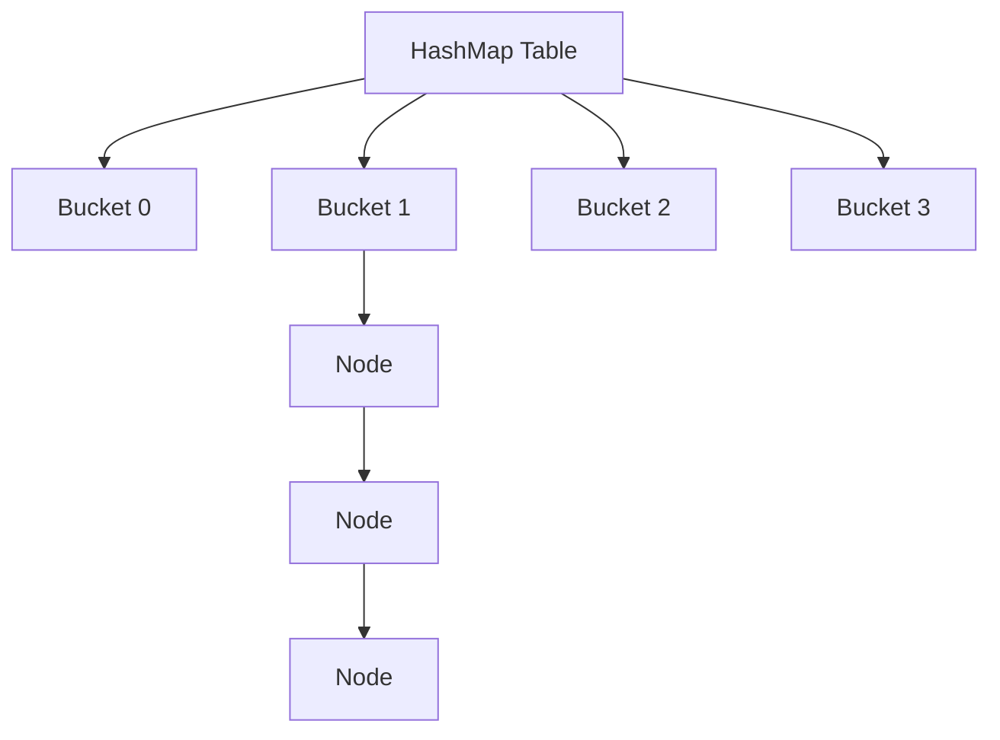

---

<div align="center"><h1>Java 8 Features</h1></div>

#### 📌 **1) Lambda Expressions**

- Introduced in **Java 8** for functional programming.
- Acts as an **anonymous function** — no method name, return type, or access modifiers.
- Represents a block of code that takes parameters and returns a value.

**🧠 Problem Before Java 8:**

Before Java 8, Java was **not truly functional**, which caused:

- ❌ Too much **boilerplate code**
- ❌ Need to create **anonymous classes** for simple logic
- ❌ Hard to pass behavior (functions) as arguments
- ❌ Poor readability in **Collections & Threads**

------

**Example (Before Java 8)**

```java
Runnable r = new Runnable() {
    @Override
    public void run() {
        System.out.println("Running...");
    }
};
```

**👉 Problems:**

- Verbose
- Hard to read
- Repetitive for small tasks

------

**✅ Solution with Lambda**

```
Runnable r = () -> System.out.println("Running...");
```

**👉 Benefits:**

- ✔ Less code
- ✔ More readable
- ✔ Functional style

---

##### 📌 **Syntax**

```java
(parameter) -> expression
(parameter) -> { statement(s) }
```

🧠 **Example**

```java
public class LambdaExample {
    public static void main(String[] args) {
        MathOperation addition = (a, b) -> a + b;
        System.out.println(addition.operation(5, 10)); // Output: 15
    }
}

interface MathOperation {
    int operation(int a, int b);
}

List<String> names = Arrays.asList("John", "Paul", "George", "Ringo");
names.forEach(name -> System.out.println(name));
```

------

#### 📌 **2) Functional Interfaces**

- An interface with only **one abstract method**.
- Annotated with **@FunctionalInterface** to indicate it's a functional interface.
- Can have **default** and **static** methods in addition to the single abstract one.
- Functional Interface = **Exactly ONE abstract method** (SAM → Single Abstract Method)

------

##### 📌 **Common Functional Interfaces**

| Interface          | Description                      | Method Signature    |
| ------------------ | -------------------------------- | ------------------- |
| **Predicate**      | Returns a Boolean value          | `boolean test(T t)` |
| **Function<T, R>** | Converts input `T` to output `R` | `R apply(T t)`      |
| **Consumer**       | Accepts input, returns nothing   | `void accept(T t)`  |
| **Supplier**       | Returns a result, no input       | `T get()`           |

------

##### **Do We Need `@FunctionalInterface` Annotation?**

❌ **No, it is NOT mandatory**

Java will still treat an interface with **one abstract method** as a functional interface **without annotation**

------

**✅ Why Use It Then?**

- ✔ Provides **compile-time safety**
- ✔ Prevents adding more than one abstract method accidentally
- ✔ Improves **code readability & intent**

**Example**

```java
@FunctionalInterface
interface MathOperation {
    int operation(int a, int b);
}
```

------

##### 📌 **3) Streams API**

- Introduced in **Java 8** for **functional-style operations** on collections.
- Used to **process collections of objects** efficiently and concisely.
- Supports operations like **filtering**, **mapping**, **sorting**, **reducing**, and **collecting**.

------

##### **Common Stream Methods**

| Method        | Description                             |
| ------------- | --------------------------------------- |
| **filter()**  | Filters elements based on a condition.  |
| **map()**     | Transforms each element.                |
| **forEach()** | Iterates through each element.          |
| **reduce()**  | Combines elements into a single result. |
| **collect()** | Converts stream back to a collection.   |

------

##### **Example**

```java
List<String> names = Arrays.asList("John", "Jane", "Mike", "Alice");

List<String> filteredNames = names.stream()
                                  .filter(n -> n.contains("M"))
                                  .collect(Collectors.toList());

System.out.println(filteredNames); // [Mike]
```

------

#### **📌  Parallel Streams (Faster Processing)**

- Use **`.parallelStream()`** to process elements in parallel.
- Ideal for **large datasets** that benefit from multi-threading.
- Avoid overuse — may cause **performance overhead** for small collections.

------

##### **Example**

```java
List<String> names = Arrays.asList("John", "Jane", "Mike", "Alice", "Mark");

long count = names.parallelStream()
                  .filter(n -> n.startsWith("M"))
                  .count();

System.out.println(count); // Output: 2
```

------

#### 📌 **Sequential Stream vs Parallel Stream**

| Sequential Stream                | Parallel Stream             |
| -------------------------------- | --------------------------- |
| Uses single thread               | Uses multiple threads       |
| Runs on single core              | Uses multiple cores         |
| Order maintained                 | Order may not be maintained |
| Processing slower for large data | Faster for large datasets   |

------

#### 📌 **map() vs flatMap()**

| map()                     | flatMap()                       |
| ------------------------- | ------------------------------- |
| Performs mapping          | Performs mapping and flattening |
| One-to-one mapping        | One-to-many mapping             |
| Produces stream of values | Produces flattened stream       |

------

##### 📌 **Example**

```java
List<List<Integer>> list = Arrays.asList(
        Arrays.asList(1,2),
        Arrays.asList(3,4)
);

list.stream()
    .flatMap(x -> x.stream())
    .forEach(System.out::println);
```

------

### 📌 **Stream Operations**

------

#### 📌 **Intermediate Operations (Return Stream)**

- Intermediate operations are **lazy** and return a new stream.
- Return another stream
- Lazy in nature
- we can chain multiple intermediate operations
- Processing doesn't start immediately

------

##### **1. `filter(Predicate<T> predicate)`**

**Definition:** Filters elements based on a condition.

```java
List<String> names = Arrays.asList("John", "Jane", "Mike", "Alice");

List<String> filteredNames = names.stream()
    .filter(n -> n.contains("M"))
    .collect(Collectors.toList());
```

------

##### **2. `map(Function<T, R> mapper)`**

**Definition:** Transforms each element into another form.

```java
List<String> words = Arrays.asList("java", "stream", "api");

List<Integer> lengths = words.stream()
    .map(w -> w.length())
    .collect(Collectors.toList());
```

------

##### **3. `sorted()`**

**Definition:** Sorts elements in natural or custom order.

```java
List<Integer> numbers = Arrays.asList(5, 3, 1, 4, 2);

List<Integer> sortedNumbers = numbers.stream()
    .sorted()
    .collect(Collectors.toList());
```

------

##### **4. `distinct()`**

**Definition:** Removes duplicate elements.

```java
List<Integer> numbers = Arrays.asList(5, 4, 5, 3, 1, 4, 2);

List<Integer> distinctList = numbers.stream()
    .distinct()
    .collect(Collectors.toList());
```

------

##### **5. `limit(long maxSize)`**

**Definition:** Limits the number of elements.

```java
List<String> names = Arrays.asList("Alice", "Bob", "Charlie", "David");

List<String> limitedNames = names.stream()
    .limit(2)
    .collect(Collectors.toList());
```

------

##### **6. `skip(long n)`**

**Definition:** Skips first `n` elements.

```java
List<String> words = Arrays.asList("java", "stream", "api");

List<String> skippedList = words.stream()
    .skip(1)
    .collect(Collectors.toList());
```

------

##### **7. `flatMap(Function<T, Stream<R>> mapper)`**

**Definition:** Flattens nested structures into a single stream.

```java
List<List<Integer>> listOfLists = Arrays.asList(
    Arrays.asList(1, 2),
    Arrays.asList(3, 4)
);

List<Integer> flattenedList = listOfLists.stream()
    .flatMap(List::stream)
    .collect(Collectors.toList());
```

------

#### 📌 **Terminal Operations (End Stream)**

- Terminal operations **produce a result** and close the stream.
- Produce final result/value
- Trigger stream processing
- Close the stream
- Only one terminal operation can performed after terminal operation stream is closed.

------

##### **1. `forEach(Consumer<T> action)`**

```java
names.stream().forEach(n -> System.out.print(n + " "));
```

------

##### **2. `collect()`**

```java
List<String> list = names.stream()
    .collect(Collectors.toList());
```

------

##### **3. `reduce()`**

```java
int sum = nums.stream().reduce((a, b) -> a + b).orElse(0);
```

------

##### **4. `count()`**

```java
long count = numbers.stream().count();
```

------

##### **5. `findFirst()` / `findAny()`**

```java
int first = numbers.stream().findFirst().orElse(0);
```

------

##### **6. `min()` / `max()`**

```java
int min = numbers.stream().min(Integer::compareTo).orElse(0);
```

------

##### **7. `allMatch()` / `anyMatch()`**

```java
boolean allEven = nums.stream().allMatch(n -> n % 2 == 0);
```

------

#### 📌 **5) Default & Static Methods in Interfaces**

Java 8 introduced **default** and **static** methods in interfaces, allowing **concrete method implementations** inside interfaces without breaking existing code.

------

##### Default Methods

- Defined with the **`default` keyword**
- Have a **full method body**
- **Inherited** by implementing classes
- **Can be overridden** by implementing classes
- Used to add new behavior to interfaces **without forcing all implementors to change**

```java
interface Greeting {
    String name();

    default void greet() {
        System.out.println("Hello, " + name() + "!");
    }
}

class Person implements Greeting {
    
    private String personName;
    
    Person(String name) { 
        this.personName = name;
    }

    @Override
    public String name() {
        return personName; 
    }
}

Person p = new Person("Alice");
p.greet(); // Hello, Alice!
```

------

##### Static Methods

- Defined with the **`static` keyword**
- Belong to the **interface itself**, not instances
- **Cannot be inherited or overridden**
- Called using the interface name: **`InterfaceName.method()`**
- Used for **utility/helper logic** tied to the interface

```java
interface MathUtils {
    static int square(int x) {
        return x * x;
    }
}

int result = MathUtils.square(5); // 25
```

------

##### Comparison Table

| Feature                  | Default Method    | Static Method       |
| ------------------------ | ----------------- | ------------------- |
| Has a body               | ✅                 | ✅                   |
| Inherited by class       | ✅                 | ❌                   |
| Can be overridden        | ✅                 | ❌                   |
| Called on                | instance or class | interface name only |
| `this` keyword available | ✅                 | ❌                   |

------

##### Diamond Problem

If two interfaces have the **same default method**, the implementing class **must override** it to resolve the conflict.

```java
interface A {
    default void hello() { System.out.println("Hello from A"); }
}

interface B {
    default void hello() { System.out.println("Hello from B"); }
}

class C implements A, B {
    @Override
    public void hello() {
        A.super.hello(); // explicitly pick one, or write custom logic
    }
}
```

------

##### When to Use

| Method Type   | Use When                                                     |
| ------------- | ------------------------------------------------------------ |
| **`default`** | Adding new methods to an existing interface without breaking implementors |
| **`static`**  | Writing utility/helper methods logically tied to the interface |

------

##### Real-World JDK Examples

```java
// Static method — Comparator.comparing()
 
names.sort(Comparator.comparing(String::length));
// Result: [Bob, Alice, Charlie]

// Default method — Iterable.forEach()
names.forEach(System.out::println);
```

------

##### Key Takeaways

- Default methods solve the **backward compatibility** problem when evolving interfaces
- Static methods keep **utility logic** encapsulated within the interface
- If two interfaces conflict on a default method → **must override** in the implementing class
- Use **`InterfaceName.super.method()`** to explicitly call a specific interface's default method

------

##### 📌 **6) Optional Class**

`Optional` is a container object used to represent **nullable values safely**.

**Why Use?**

- Avoids `NullPointerException`
- Improves readability
- Forces handling of missing values

------

**Creation Methods**

```java
Optional<String> opt1 = Optional.of("Java");
Optional<String> opt2 = Optional.ofNullable(null);
Optional<String> opt3 = Optional.empty();
```

------

 **Common Methods**

| Method        | Description                    |
| ------------- | ------------------------------ |
| `isPresent()` | Checks value exists            |
| `get()`       | Returns value (avoid directly) |
| `orElse()`    | Default value if empty         |
| `ifPresent()` | Executes if value exists       |

------

 **Example**

```java
Optional<String> name = Optional.ofNullable(null);

String result = name.orElse("Default Name");
System.out.println(result);
```

------

##### 📌 **7) StringJoiner**

- Used to **join multiple strings** with delimiter, prefix, suffix.

------

##### 📌 **Example**

```java
StringJoiner sj = new StringJoiner(",");
sj.add("Java").add("Spring").add("Kafka");
System.out.println(sj);
```

------

##### 📌 **8) New Date & Time API**

- Introduced in Java 8 (`LocalDate`, `LocalTime`, `LocalDateTime`)
- Immutable and thread-safe
- Simplifies date-time handling
- Problems before java 8 : **mutable , leading unexpected behaviour in multithreaded app and time zone handling complex.**

------

**Key Improvements**

- Avoids mutable issues (old Date API)
- Better timezone handling
- Cleaner API

```java
LocalDate date = LocalDate.now();

LocalTime time = LocalTime.now();

LocalDateTime dateTime = LocalDateTime.now();

System.out.println(date); // 2025-03-04

System.out.println(time); //19:49:18.331792800

System.out.println(dateTime); //2025-03-04T19:49:18.331792800
```

---

<div align="center"><h3>✦✦ Multithreading ✦✦</h3></div>

####  📌**What is Threads ?**

- Thread in java is a path or direction followed for its execution. Every program has one main thread.

- Thread allows us to perform multiple tasks at a time

- When multiple threads are executed at a time this process is called Multithreading

- Multithreading enables you to perform multiple tasks at a time

####  📌**What is Multithreading in Java?**

- Multithreading is the ability to execute multiple **threads** (lightweight subprocesses) **concurrently** in Java to improve performance.

- Thread is a separate path of execution of program

- When various multiple threads are executed at a time this process is called multi-threadeding.

**Benefits:**

1.  Better resource utilization

2.  Improved application responsiveness

3.  Simplified modelling of asynchronous or parallel tasks

#### 📌 Thread Life Cycle and States

Based on the documentation provided, here are the high-level states a thread resides in during its execution:

- **New:** This is the state when a thread is created (e.g., `Thread t = new Thread()`) but the `start()` method hasn't been called yet.
- **Runnable:** Once `start()` is invoked, the thread becomes ready to run. It doesn't necessarily start executing immediately; it waits for the thread scheduler to give it CPU time.
- **Running:** The processor is actively executing the thread's code.
- **Waiting:** The thread is in a blocked state, waiting for some external processing or another thread to perform a specific action (like calling `notify()`).
- **Sleeping:** The thread is forced to pause for a specified period using `Thread.sleep()`.
- **Blocked:** This occurs during I/O operations or when a thread is waiting to acquire a lock (Synchronization) to enter a protected section of code.
- **Dead (Terminated):** The thread has finished its execution or was stopped prematurely due to an unhandled exception.

---

#### 📌 What is the difference between processes and threads ? 

A process is an execution of a program, while a Thread is a single execution sequence within a process. A process can contain multiple threads. A Thread is sometimes called a lightweight process

---

####  📌What are the Different Ways to Create a Thread?

In Java, there are three primary ways to create and manage threads. Choosing the right one depends on whether you need a simple task execution or a robust architecture for a large-scale application.

##### 1. Implementing the `Runnable` Interface

This is the **most common and preferred method**. By implementing `Runnable`, you define the task in a `run()` method. This approach is flexible because your class can still extend other classes (since Java doesn't support multiple inheritance).

- **How it works:** Create a class that implements `Runnable`, then pass an instance of it to a `Thread` object.

- **Example:**

  ```java
  public class Threading implements Runnable{
  
      public void run() {
  
          System.out.println("run method used to run thread :"+Thread.currentThread().getName());
  
      }
  
      public static void main(String[] args) {
  
          Threading thd=new Threading();
  
          Thread th=new Thread(thd);
  
          th.start();
  
      }
  
  }
  ```

##### 2. Extending the `Thread` Class

This is the simplest way to create a thread, but it's less flexible. Because your class must extend the `Thread` class, it cannot inherit from any other class.

- **How it works:** Inherit from `Thread` and override the `run()` method.

- **Example:**

  ```java
  class MyThread extends Thread {
      public void run() {
          System.out.println("Thread is running by extending Thread class");
      }
  }
  // Execution
  MyThread t1 = new MyThread();
  t1.start();
  ```

##### 3. Using the `Executor` Framework (Thread Pools)

For professional applications (like those using Spring Boot), manual thread management is often discouraged. Instead, you use a **Thread Pool** via the `Executor` framework. This is much more efficient because it reuses existing threads instead of creating and destroying them constantly.

- **How it works:** You submit tasks to an `ExecutorService`, which manages a pool of worker threads.
- **Why use it:** It prevents the system from being overwhelmed by too many threads and provides better control over execution.

------

#### **Which one should you choose?**

| **Method**       | **Recommendation** | **Why?**                                                     |
| ---------------- | ------------------ | ------------------------------------------------------------ |
| **Runnable**     | **High**           | Better object-oriented design; separates the task from the thread runner. |
| **Thread Class** | **Low**            | Restrictive; you "waste" your one chance at inheritance.     |
| **Executor**     | **Best for Apps**  | Essential for performance and resource management in complex systems. |

----

####  📌Why Prefer Runnable Over Thread?

- Java supports **single inheritance**, so Runnable allows flexibility.

- Separation of **task (Runnable) and thread execution (Thread)**.

---

####  📌What is the Difference Between start() and run()?

| Method      | Description                                         |
| ----------- | --------------------------------------------------- |
| **start()** | Starts a new thread and calls run() internally      |
| **run()**   | Executes in the current thread like a normal method |

------

#### **Java Thread Methods and Their Uses**

---------------------------------------------------------------------------

| **Method**                  | **Use Case / Purpose**                                       |
| --------------------------- | ------------------------------------------------------------ |
| `  start()  `           `   | Starts a new thread and calls the run() method in a separate execution thread. |
| `run()                `     | Contains the code to be executed when the thread is started. |
| `sleep(milliseconds)  `     | Pauses execution of the current thread for aspecified time (in milliseconds). |
| `join()               `     | Makes the calling thread wait until the specified thread finishes execution. |
| `getName()            `     | Retrieves the name of the thread.                            |
| `setName(String name) `     | Sets the name of the thread. Useful for debugging and logging. |
| `getId()              `     | Returns the unique ID of the thread.                         |
| `getPriority()        `     | Gets the priority of the thread (default: 5, range: 1   to 10). |
| `setPriority(int priority)` | Sets the thread's priority (higher value means higher priority). |
| `isAlive()            `     | Checks whether a thread is currently running.                |
| `isDaemon()           `     | Checks if the thread is a daemon thread (background service thread). |
| `setDaemon(boolean)   `     | Marks a thread as a daemon thread. Daemon threads run  in the background and terminate when all user threads exit. |
| `interrupt()          `     | Interrupts a sleeping or waiting thread, causing it to throw an InterruptedException. |
| `isInterrupted()      `     | Checks if the thread has been interrupted.                   |
| `yield()              `     | Temporarily pauses the execution of the current  thread to allow other threads to execute. |
| `wait()               `     | Causes the current thread to wait until another thread calls notify() or notifyAll(). Used in synchronization. |
| `notify()             `     | Wakes up a single thread that is waiting on an  object's monitor. |
| `notifyAll()          `     | Wakes up all threads waiting on an object's monitor.         |
| `stop() (Deprecated)  `     | Forcefully stops a thread (unsafe and not recommended for use). |

---

#### 📌 When would you use the wait and notify methods in your Java application ?

The "wait" and "notify" methods in Java are used to coordinate the execution of multiple threads. The "wait" method causes the current thread to wait until another thread calls the "notify" method, which signals that the waiting thread can continue its execution.

---

## **Runnable** & **Callable** 

------

#### 📌 1. Runnable Interface

The **Runnable** interface is the traditional way to execute a task in a separate thread. It is best for "fire-and-forget" tasks where you don't need a result back from the execution. 

- **How it works**: You implement the `run()` method with your logic.
- **Limitation**: It cannot return a value or propagate checked exceptions. Any exceptions must be handled within the `run()` method using a try-catch block.
- **Example**: Simple background logging or UI updates. 

#### 📌 2. Callable Interface

The **Callable** interface was introduced to overcome the limitations of Runnable. It is designed for tasks that perform a calculation or fetch data and need to return that result to the main thread. 

- **How it works**: You implement the `call()` method, which returns a value (e.g., `Callable<String>` returns a `String`).
- **Returning Results**: When you submit a `Callable` to an `ExecutorService`, it returns a **Future** object. You can use `future.get()` to retrieve the actual result once the task finishes.
- **Error Handling**: It allows you to throw checked exceptions (like `IOException`), which can then be handled by the caller who retrieves the result. 

##### When to Use Which?

- **Use Runnable** for simple background tasks that don't need to report anything back to your main application.
- **Use Callable** when you need a result from your parallel task (e.g., fetching data from a database or calculating a sum) or when you need robust error propagation. 

#### 📌 **Difference Between Callable and Runnable**

| Feature           | Runnable    | Callable   |
| ----------------- | ----------- | ---------- |
| Return value      | ❌ No        | ✅ Yes      |
| Checked exception | ❌ No        | ✅ Yes      |
| Method            | `run()`     | `call()`   |
| Executor support  | `execute()` | `submit()` |
| Result handling   | ❌           | `Future`   |

---

####  📌What is volatile Keyword?

The `volatile` keyword ensures that a **variable's value is always read from main memory**, avoiding **caching issues**. The "`volatile`" keyword in Java is used to indicate that a variable's value may be modified by multiple threads. It ensures that the value of the variable is always read from and written to the main memory instead of a local cache, which may result in stale values.

**Example: Using volatile**

```java
class VolatileExample {

    private static volatile boolean running = true;

    public static void main(String[] args) throws InterruptedException {
        Thread t1 = new Thread(() -> {
            while (running) {} // Busy wait
            System.out.println("Thread Stopped"); });
        t1.start();
        Thread.sleep(1000);
        running = false; // Stops the thread
    }
```

---

#### **📌What is Deadlock ?**

- **Deadlock** in Java multithreading refers to a situation where two or more threads are blocked forever, waiting for each other to release resources.

- **Conditions for Deadlock**:
  - **Mutual Exclusion**: At least one resource must be held in a non-shareable mode.
  - **Hold and Wait**: A thread holding at least one resource is waiting to acquire additional resources.
  - **No Preemption**: Resources cannot be forcibly taken from threads holding them.
  - **Circular Wait**: There exists a set of threads {T1, T2, …, Tn} such that T1 is waiting for a resource held by T2, T2 is waiting for a resource held by T3, and so on, with Tn waiting for a resource held by T1.

- **Example of Deadlock**:
  - Consider two threads, **Thread A** and **Thread B**.
    - **Thread A** holds **Resource 1** and waits for **Resource 2**.
    - **Thread B** holds **Resource 2** and waits for **Resource 1**.
  - This creates a deadlock since neither thread can proceed.

- **Code Example**:
  ```java
  class Resource {
      public synchronized void method1(Resource resource) {
          System.out.println(Thread.currentThread().getName() + " acquired " + this);
          try { Thread.sleep(100); } catch (InterruptedException e) {}
          resource.method2(this);
      }
  
      public synchronized void method2(Resource resource) {
          System.out.println(Thread.currentThread().getName() + " acquired " + this);
      }
  }
  
  public class DeadlockExample {
      public static void main(String[] args) {
          final Resource resource1 = new Resource();
          final Resource resource2 = new Resource();
  
          Thread thread1 = new Thread(() -> resource1.method1(resource2), "Thread A");
          Thread thread2 = new Thread(() -> resource2.method1(resource1), "Thread B");
  
          thread1.start();
          thread2.start();
      }
  }
  ```

- **Prevention Strategies**:
  - **Avoid Circular Wait**: Impose an order on resource acquisition.
  - **Use a Timeout**: Allow threads to abort after a certain time.
  - **Resource Allocation Graph**: Analyze resource allocation and detect cycles.

- **Detection and Recovery**:
  - Implement algorithms to detect deadlocks and recover by terminating or rolling back threads. 

- **Best Practices**:
  - Design algorithms to minimize resource contention.
  - Keep synchronized blocks as short as possible.
  - Use higher-level concurrency utilities from the **java.util.concurrent** package to avoid explicit lock management.

---

####  📌What is Thread Synchronization?

Thread synchronization ensures that **only one thread** accesses a critical section (shared resource) at a time. In Java, the "**synchronized**" keyword is used to control access to critical sections of code, i.e., sections that should not be accessed by multiple threads simultaneously. This is because if multiple threads access the same piece of code concurrently, it can lead to race conditions and inconsistent behaviour.

**Example:**

**Using synchronized Keyword**

```java
public class Counter {

	private int count = 0;

	public int getCount() {
		return count;
	}

	public synchronized void increment() {
		count++;
		System.out.println(Thread.currentThread().getName() + " :" + count);
	}
}


```

```java
public static void main(String[] args) throws InterruptedException {
		Counter counter = new Counter();

		Thread t1 = new Thread(() -> {
			for (int i = 0; i < 10; i++) {
				counter.increment();
			}
		});
		t1.setName("main");
		Thread t2 = new Thread(() -> {
			for (int i = 0; i < 10; i++) {
				counter.increment();
			}
		});
		t2.setName("other");
		t1.start();
		t2.start();

		t1.join();
		t2.join();

		System.out.println("Final Count: " + counter.getCount());
	}
```


> output :  main :1
>
> main :2
>
> main :3
>
> main :4
>
> main :5
>
> other :6
>
> other :7
>
> other :8
>
> other :9
>
> other :10
>
> Final Count: 10
>
> Without Synchronized :
>
> main :2
>
> main :3
>
> other :2
>
> other :5
>
> other :6
>
> other :7
>
> other :8
>
> main :4
>
> main :9
>
> main :10
>
> Final Count: 10

**Key Points:**

 - synchronized **locks the method** so only **one thread** can execute   it at a time.

- Prevents **race conditions** and **inconsistent results**.

----

###  📌 What is a Thread Pool?

A **thread pool** is a collection of **pre-created, reusable threads** that sit idle and wait for tasks. Instead of creating a new thread per task, you **submit the task to the pool** — an idle thread picks it up.

👉 A **thread pool** = **group of worker threads** ready to perform tasks. it assign the task to the worker threads

Instead of: ❌ Creating a new thread for every task (expensive)

We use: ✅ A fixed set of threads that **reuse and execute tasks**

------

#### ⚙️ How It Works

1. Thread pool is created with a fixed number of threads
2. Tasks are submitted to a **queue**
3. Available thread picks a task
4. Executes it
5. Goes back to pool for next task

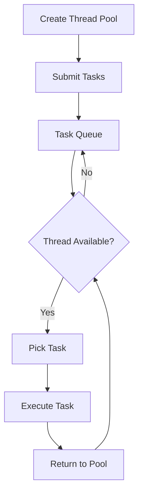


------

###  📌 Why Thread Pool is Important

##### ❌ Without Thread Pool

- Too many threads → memory issue
- Slow (thread creation is costly)
- CPU overhead

##### ✅ With Thread Pool

- Reuse threads → faster
- Better performance
- Controlled concurrency
- Avoid system crash

```java
import java.util.concurrent.*;

public class ThreadPoolExample {
    public static void main(String[] args) {
        ExecutorService executor = Executors.newFixedThreadPool(3);

        for (int i = 0; i < 5; i++) {
            executor.submit(() -> {
                System.out.println(Thread.currentThread().getName() + " is working");
            });
        }

        executor.shutdown();
    }
}
```

------

##### Creating Thread Pools — `Executors` Factory

```java
import java.util.concurrent.ExecutorService;
import java.util.concurrent.Executors;
```

------

**1. Fixed Thread Pool — most common**

```java
// always exactly 4 threads running
ExecutorService pool = Executors.newFixedThreadPool(4);

for (int i = 1; i <= 10; i++) {
    int taskId = i;
    pool.submit(() -> {
        System.out.println("Task " + taskId + " by " + Thread.currentThread().getName());
    });
}

pool.shutdown();
Task 1  by pool-1-thread-1
Task 2  by pool-1-thread-2
Task 3  by pool-1-thread-3
Task 4  by pool-1-thread-4
Task 5  by pool-1-thread-1   ← thread-1 reused!
Task 6  by pool-1-thread-2   ← thread-2 reused!
```

------

**2. Cached Thread Pool — grows as needed**

```java
// creates threads on demand, reuses idle ones
ExecutorService pool = Executors.newCachedThreadPool();

// good for many short-lived tasks
pool.submit(() -> System.out.println("Quick task"));
pool.shutdown();
```

------

**3. Single Thread Pool — one thread, sequential**

```java
// guarantees tasks run one after another in order
ExecutorService pool = Executors.newSingleThreadExecutor();

pool.submit(() -> System.out.println("Task 1"));
pool.submit(() -> System.out.println("Task 2")); // always after Task 1
pool.shutdown();
```

------

**4. Scheduled Thread Pool — run after delay / repeat**

```java
import java.util.concurrent.ScheduledExecutorService;
import java.util.concurrent.TimeUnit;

ScheduledExecutorService pool = Executors.newScheduledThreadPool(2);

// run once after 3 seconds
pool.schedule(() -> System.out.println("Delayed task"), 3, TimeUnit.SECONDS);

// run every 2 seconds
pool.scheduleAtFixedRate(() -> System.out.println("Repeated task"),
        0, 2, TimeUnit.SECONDS);
```

------

##### `submit()` vs `execute()`

```java
// execute — fire and forget, no return value
pool.execute(() -> System.out.println("task"));

// submit — returns Future to track result
Future<Integer> future = pool.submit(() -> {
    return 42;
});

int result = future.get(); // blocks until done → 42
```

------

##### Shutdown — Always Required

```java
pool.shutdown();          // graceful — waits for running tasks to finish
pool.shutdownNow();       // forceful — tries to stop all running tasks

// wait max 10 seconds for termination
pool.awaitTermination(10, TimeUnit.SECONDS);
```

------

##### Comparison Table

| Pool Type                   | Threads       | Best For                         |
| --------------------------- | ------------- | -------------------------------- |
| `newFixedThreadPool(n)`     | Fixed n       | CPU-bound tasks, controlled load |
| `newCachedThreadPool()`     | Grows/shrinks | Many short-lived tasks           |
| `newSingleThreadExecutor()` | Always 1      | Sequential ordered tasks         |
| `newScheduledThreadPool(n)` | Fixed n       | Delayed or repeated tasks        |

------

##### Thread Pool vs Manual Threads

|                 | **Manual Threads**    | **Thread Pool** |
| --------------- | --------------------- | --------------- |
| Thread creation | Every task            | Once at startup |
| Memory usage    | High                  | Controlled      |
| Performance     | Slow (create/destroy) | Fast (reuse)    |
| Control         | None                  | Full            |
| Risk            | 1000s of threads      | Capped          |

------


| Feature            | Future | CompletableFuture |
| ------------------ | ------ | ----------------- |
| Blocking           | Yes    | No                |
| Callbacks          | ❌      | ✅                 |
| Chaining           | ❌      | ✅                 |
| Combine tasks      | ❌      | ✅                 |
| Exception handling | Poor   | Excellent         |
| Java version       | Java 5 | Java 8            |

------

##### 📌 ExecutorService vs Future vs CompletableFuture

------

#####  📌 1. ExecutorService

`ExecutorService` is a **thread pool manager** introduced in Java 5 that helps execute tasks asynchronously without manually creating threads.

------

##### 🔹 Key Responsibilities

- Manage **thread pool**
- Execute tasks asynchronously
- Control lifecycle (start, shutdown)

------

##### 🔹 Why Use It?

❌ Without ExecutorService

- Manual thread creation → inefficient

✅ With ExecutorService

- Reuse threads
- Better performance
- Controlled execution

------

##### 🔹 Common Factory Methods

```java
ExecutorService fixed = Executors.newFixedThreadPool(5);
ExecutorService cached = Executors.newCachedThreadPool();
ExecutorService single = Executors.newSingleThreadExecutor();
```

------

##### 🔹 Example

```java
import java.util.concurrent.*;

public class ExecutorExample {
    public static void main(String[] args) {
        ExecutorService executor = Executors.newFixedThreadPool(3);

        for (int i = 0; i < 5; i++) {
            executor.submit(() -> {
                System.out.println(Thread.currentThread().getName());
            });
        }

        executor.shutdown();
    }
}
```

------

##### 🔹 Important Methods

| Method          | Description          |
| --------------- | -------------------- |
| `submit()`      | Submit task          |
| `execute()`     | Run task (no return) |
| `shutdown()`    | Graceful shutdown    |
| `shutdownNow()` | Force stop           |

------

#####  📌 2. Future

##### 🔹 What is Future?

`Future` represents the **result of an asynchronous computation**.

👉 Returned by `ExecutorService.submit()`

------

##### 🔹 Problem It Solves

- Get result later (async)
- Check if task is complete

------

##### 🔹 Example

```java
import java.util.concurrent.*;

public class FutureExample {
    public static void main(String[] args) throws Exception {
        ExecutorService executor = Executors.newSingleThreadExecutor();

        Future<Integer> future = executor.submit(() -> {
            return 10 + 20;
        });

        System.out.println("Doing other work...");

        Integer result = future.get(); // BLOCKING
        System.out.println("Result: " + result);

        executor.shutdown();
    }
}
```

------

##### 🔹 Important Methods

| Method     | Description                  |
| ---------- | ---------------------------- |
| `get()`    | Wait & get result (blocking) |
| `isDone()` | Check completion             |
| `cancel()` | Cancel task                  |

------

##### 🔴 Limitations of Future

❌ Blocking (`get()`)
❌ No chaining
❌ No proper error handling
❌ Cannot combine multiple tasks

------

#####  📌 3. CompletableFuture (Java 8+)

##### 🔹 What is CompletableFuture?

`CompletableFuture` is an advanced version of Future that supports. `CompletableFuture` **does not require** an `ExecutorService`. By default it uses the **`ForkJoinPool.commonPool()`** under the hood.

✅ Non-blocking
✅ Chaining
✅ Combining tasks
✅ Exception handling

------

##### 🔹 Creating CompletableFuture

```java
CompletableFuture<String> future =
    CompletableFuture.supplyAsync(() -> "Hello");
```

------

🔹 **Example**

```java
import java.util.concurrent.*;

public class CompletableFutureExample {
    public static void main(String[] args) {
        CompletableFuture<String> future =
            CompletableFuture.supplyAsync(() -> "Hello World");

        future.thenAccept(System.out::println);
    }
}
```

------

##### 📌 🔗 4. Chaining Tasks

```java
CompletableFuture.supplyAsync(() -> "Task1")
    .thenApply(res -> res + " -> Task2")
    .thenApply(res -> res + " -> Task3")
    .thenAccept(System.out::println);
```

👉 Output:
`Task1 -> Task2 -> Task3`

------

##### 📌 🔀 5. Combining Multiple Futures

```java
CompletableFuture<Integer> f1 = CompletableFuture.supplyAsync(() -> 10);
CompletableFuture<Integer> f2 = CompletableFuture.supplyAsync(() -> 20);

f1.thenCombine(f2, (a, b) -> a + b)
  .thenAccept(System.out::println);
```

------

##### 📌 ⚠️ 6. Error Handling

```java
CompletableFuture.supplyAsync(() -> {
    if (true) throw new RuntimeException("Error!");
    return "Success";
})
.exceptionally(ex -> "Fallback")
.thenAccept(System.out::println);
```

------

##### 📌 🔹 Methods for Error Handling

| Method            | Use                |
| ----------------- | ------------------ |
| `exceptionally()` | Handle error       |
| `handle()`        | Result + exception |
| `whenComplete()`  | Final callback     |

------

##### 📌 ⏱️ 7. Timeout Handling

```java
CompletableFuture.supplyAsync(() -> {
    try { Thread.sleep(5000); } catch (Exception e) {}
    return "Done";
})
.orTimeout(2, TimeUnit.SECONDS)
.exceptionally(ex -> "Timeout!")
.thenAccept(System.out::println);
```

------

##### 📌 🔄 8. ExecutorService vs Future vs CompletableFuture

| Feature           | ExecutorService | Future      | CompletableFuture |
| ----------------- | --------------- | ----------- | ----------------- |
| Thread Management | ✅ Yes           | ❌ No        | ❌ No              |
| Async Execution   | ✅ Yes           | ✅ Yes       | ✅ Yes             |
| Return Result     | ❌               | ✅           | ✅                 |
| Blocking          | ❌               | ✅ (`get()`) | ❌                 |
| Chaining          | ❌               | ❌           | ✅                 |
| Combine Tasks     | ❌               | ❌           | ✅                 |
| Error Handling    | ❌               | ❌           | ✅                 |
| Timeout           | ❌               | Limited     | ✅                 |

------

##### 📌 🎯 When to Use What?

##### ✅ Use ExecutorService

- When you need **thread pool control**
- Running multiple independent tasks

------

##### ✅ Use Future

- When you only need **simple async result**

------

##### ✅ Use CompletableFuture

- When you need:
  - Non-blocking
  - Task chaining
  - Combining results
  - Error handling

  👉 **Best choice for modern Java apps**

------


#####  📌 **Locks in Java (`synchronized` vs `ReentrantLock`)**

Java provides **two main ways to handle thread synchronization** — the built-in **`synchronized`** keyword and the more flexible **`ReentrantLock`** class from `java.util.concurrent.locks`, both used to prevent **race conditions** in multithreaded code.

------

#####  🔹 **1. `synchronized` (Basic Locking)**

##### ✅ **Advantages**

- ✔ **No need to manually release lock**
- ✔ **Automatic lock management**
- ✔ **Less chance of mistakes**
- ✔ Simple and easy to use

------

##### ❌ **Disadvantages**

- ❌ **No flexibility**
- ❌ Cannot try lock without blocking
- ❌ No timeout support
- ❌ No fairness control

------

#####  🔹 **2. `ReentrantLock` (Advanced Locking)**

##### 📦 **Package**

```java
import java.util.concurrent.locks.ReentrantLock;
```

------

##### 🔸 **Example**

```java
import java.util.concurrent.locks.ReentrantLock;

class Counter {

    private int count = 0;
    private ReentrantLock lock = new ReentrantLock();

    public void increment() {

        lock.lock(); // acquire lock

        try {
            count++;
        } finally {
            lock.unlock(); // MUST release lock
        }
    }
}
```

------

#####  🔹 **How It Works**

- Lock is **manually acquired and released**
- Provides **more control than `synchronized`**

------

#####  ⭐ **Key Features of `ReentrantLock`**

------

##### 🔸 1. ✔ **More Control**

- Manual lock/unlock
- Can lock/unlock in different methods

```java
lock.lock();
// critical section
lock.unlock();
```

------

##### 🔸 2. ✔ **`tryLock()` (Non-blocking Lock)**

- Attempts to acquire lock **without waiting**

```java
if (lock.tryLock()) {
    try {
        // critical section
    } finally {
        lock.unlock();
    }
} else {
    System.out.println("Could not acquire lock");
}
```

###### 💡 **Use Cases**

- Avoiding deadlocks
- Improving performance
- Conditional execution

------

##### 🔸 3. ✔ **Fairness**

```java
ReentrantLock lock = new ReentrantLock(true);
```

###### 🔹 **What is Fairness?**

- Threads get lock in **FIFO order (First Come First Serve)**

###### 🔹 **Behavior**

- ❌ Without fairness → Thread starvation possible
- ✅ With fairness → Equal chance for all threads

------

##### 🔸 4. ✔ **Timeout Support**

```java
if (lock.tryLock(2, java.util.concurrent.TimeUnit.SECONDS)) {
    try {
        // critical section
    } finally {
        lock.unlock();
    }
}
```

###### 🔹 **Behavior**

- Thread waits only for a **limited time**
- Prevents infinite blocking

------

##### 🔸 5. ✔ **Interruptible Lock**

```java
lock.lockInterruptibly();
```

###### 🔹 **Behavior**

- Thread can be **interrupted while waiting for lock**

------

##### 📌 🔥 **Difference: `synchronized` vs `ReentrantLock`**

| Feature           | `synchronized` | `ReentrantLock`        |
| ----------------- | -------------- | ---------------------- |
| **Type**          | Keyword        | Class                  |
| **Lock Handling** | Automatic      | Manual                 |
| **Flexibility**   | Low            | High                   |
| **tryLock()**     | ❌ No           | ✔ Yes                  |
| **Timeout**       | ❌ No           | ✔ Yes                  |
| **Fairness**      | ❌ No           | ✔ Yes                  |
| **Interruptible** | ❌ No           | ✔ Yes                  |
| **Performance**   | Good           | Better (complex cases) |

------

##### 📌 🎯 **When to Use What?**

------

##### 👉 **Use `synchronized` when:**

- Simple locking is required
- Code is less complex
- No advanced features needed

------

##### 👉 **Use `ReentrantLock` when:**

- Need **advanced control**
- Require **tryLock / timeout**
- Want **fairness**
- Need to **avoid deadlocks**

------

##### 📌 🧠 **Quick Summary**

- `synchronized` → **Simple & automatic**
- `ReentrantLock` → **Flexible & powerful**

**Tip:**
Use `synchronized` by default, switch to `ReentrantLock` only when advanced features are required.

------

##  📌 Atomic Classes

**Atomic Classes** are classes in Java that allow **thread-safe operations on single variables without using locks**.

- Located in package: `java.util.concurrent.atomic`
- Designed for **high-performance concurrent programming**

> **Key Idea:**
> Operations happen in a **single atomic (indivisible) step**, preventing race conditions.

------

##### 📌 🔹 Why Use Atomic Classes?

##### ❌ Problem (Without Atomic Classes)

- Multiple threads updating same variable
- Leads to **race conditions**
- Requires heavy synchronization (`synchronized`)

##### ✅ Solution

- Atomic classes provide:
  - Lock-free thread safety
  - Better performance
  - Simpler code

------

##### 🔹 Key Features

- ✔ Lock-free thread safety
- ✔ High performance
- ✔ Atomic operations (no partial updates)
- ✔ Avoids race conditions

------

##### 📌 🔹 Common Atomic Classes

##### 🔸 1. AtomicBoolean

- Used for atomic boolean values

**Important Methods:**

- `get()`
- `set(boolean value)`
- `compareAndSet(expected, newValue)`

------

##### 🔸 2. AtomicInteger

- Used for atomic integer operations

**Important Methods:**

- `get()`
- `set(int value)`
- `incrementAndGet()`
- `decrementAndGet()`
- `addAndGet(int delta)`

------

##### 🔸 3. AtomicLong

- Same as `AtomicInteger` but for `long`

------

##### 🔸 4. AtomicReference

- Works with **objects instead of primitives**

**Important Methods:**

- `get()`
- `set(T value)`
- `compareAndSet(expected, newValue)`

##### ✅ AtomicInteger Example

```java
import java.util.concurrent.atomic.AtomicInteger;

public class AtomicIntegerExample {
    public static void main(String[] args) {

        AtomicInteger counter = new AtomicInteger(0);

        int newValue = counter.incrementAndGet();

        System.out.println("New Value: " + newValue);
    }
}
```

------

##### ✅ AtomicBoolean Example

```java
import java.util.concurrent.atomic.AtomicBoolean;

public class AtomicBooleanExample {
    public static void main(String[] args) {

        AtomicBoolean flag = new AtomicBoolean(true);

        boolean updated = flag.compareAndSet(true, false);

        System.out.println("Updated: " + updated);
        System.out.println("Current Value: " + flag.get());
    }
}
```

------

##### 🔹 Advantages

- ✔ No locks → better performance
- ✔ Simple to use
- ✔ Ideal for counters & flags

------

##### ⚠️ Limitations

⚠️ Works only on **single variables**

⚠️ Not suitable for **multiple variable operations**

------

#####  📌Concurrent Collections

##### 🔹 Definition

**Concurrent Collections** are thread-safe data structures that allow **multiple threads to read/write simultaneously**.

------

##### 🔹 Why Use Them?

##### ❌ Problem

- Normal collections (`HashMap`, `ArrayList`) are **not thread-safe**

##### ✅ Solution

- Concurrent collections:
  - Handle synchronization internally
  - Provide better performance

------

##### 🔹 Key Characteristics

- ✔ Thread-safe
- ✔ High performance
- ✔ Reduced locking
- ✔ Scalable

------

##### 📌 🔹 Common Concurrent Collections

##### 📌 🔸 1. ConcurrentHashMap

- Thread-safe version of `HashMap`
- Allows **concurrent reads & writes**

```java
ConcurrentHashMap<String, String> map = new ConcurrentHashMap<>();

map.put("user1", "active");
String status = map.get("user1");
map.remove("user1");
```

> **Tip:**
> Does not lock entire map → better performance

------

##### 📌 🔸 2. CopyOnWriteArrayList

- Creates a **new copy on every write**
- Best for **read-heavy applications**

------

##### 📌 🔸 3. BlockingQueue

- Used for producer-consumer problems
- Blocks when:
  - Queue is full (producer)
  - Queue is empty (consumer)

------

##### 📌 🔸 4. ConcurrentSkipListMap

- Thread-safe **sorted map**

------

##### 🔹 Advantages

- ✔ No manual synchronization
- ✔ Better performance than synchronized collections
- ✔ Scalable for multi-threading

------

##### ⚠️ Considerations

> ⚠️ Choose based on **read/write pattern**

> ⚠️ CopyOnWrite is expensive for frequent writes

------

##### 🔹 Use Cases

- Web applications
- Real-time systems
- Multi-threaded data processing


------

#####  📌 ForkJoinPool

**ForkJoinPool** is a special thread pool for **parallel processing**.

- Part of `ExecutorService`
- Introduced in Java 7
- Based on **divide and conquer**

------

##### 🔹 Key Concept

##### 🔸 Fork & Join

1. **Fork** → Split task into smaller tasks
2. **Join** → Combine results

------

##### 🔸 Work-Stealing

- Idle threads **steal tasks** from busy threads
- Improves CPU utilization

------

##### 🔹 Important Classes

- `RecursiveTask<T>` → returns result
- `RecursiveAction` → no return

------

##### 🔹 Example

##### ✅ Task Implementation

```java
import java.util.concurrent.RecursiveTask;

class SumTask extends RecursiveTask<Integer> {

    private int[] arr;
    private int start, end;

    public SumTask(int[] arr, int start, int end) {
        this.arr = arr;
        this.start = start;
        this.end = end;
    }

    @Override
    protected Integer compute() {

        if (end - start <= 5) {
            int sum = 0;
            for (int i = start; i < end; i++) {
                sum += arr[i];
            }
            return sum;
        }

        int mid = (start + end) / 2;

        SumTask left = new SumTask(arr, start, mid);
        SumTask right = new SumTask(arr, mid, end);

        left.fork();

        int rightResult = right.compute();
        int leftResult = left.join();

        return leftResult + rightResult;
    }
}
```

------

##### ✅ Execution

```java
import java.util.concurrent.ForkJoinPool;

public class Main {
    public static void main(String[] args) {

        int[] arr = {1,2,3,4,5,6,7,8};

        ForkJoinPool pool = new ForkJoinPool();

        int result = pool.invoke(new SumTask(arr, 0, arr.length));

        System.out.println("Sum: " + result);
    }
}
```

------

##### 🔹 Advantages

- ✔ Uses multiple CPU cores
- ✔ Efficient parallel processing
- ✔ Automatic load balancing

------

##### ⚠️ Considerations

> ⚠️ Not suitable for small tasks

> ⚠️ Overhead of splitting tasks

------

##### 🔹 Use Cases

- Large data processing
- Parallel algorithms
- CPU-intensive tasks

------

####  📌 **Virtual Threads**

**Virtual Threads** are lightweight threads introduced in **Java 21 (Project Loom)**.

**Key Idea:** Many virtual threads run on **a small number of OS (platform) threads**

------

##### 📌 🔹 **Problems with Platform Threads**

##### ❌ **Limitations**

- **Heavyweight**
  - Each thread is managed by OS
  - High memory consumption (~1MB per thread)
- **Limited Scalability**
  - Cannot create large number of threads
  - Leads to resource exhaustion
- **Blocking Issues**
  - Threads remain blocked during I/O
  - Wastes system resources

------

##### 📌 🔹 **Benefits of Virtual Threads**

##### ✅ **Advantages**

- **Lightweight**
  - Requires very less memory
- **Massive Scalability**
  - Supports **millions of threads**
- **Efficient Blocking**
  - Blocking does **not block OS thread**
- **Simplified Code**
  - No need for complex async programming

------

##### 📌 🔹 **How Virtual Threads Work**

##### 🧠 **Internal Flow**

```
Virtual Threads 
      ↓
JVM Scheduler 
      ↓
Few OS (Carrier) Threads 
      ↓
CPU Execution
```

##### 🔍 **Explanation**

- Virtual threads are managed by **JVM**
- JVM schedules them on **carrier threads (OS threads)**
- When a virtual thread blocks → it is **suspended**
- OS thread is reused for another task

------

##### 📌 🔹 **Creating Virtual Threads**

##### ✅ **Using Thread API**

```
Thread.startVirtualThread(() -> {
    System.out.println("Hello Virtual Thread");
});
```

------

##### ✅ **Using Executor Service (Recommended)**

```
try (var executor = java.util.concurrent.Executors.newVirtualThreadPerTaskExecutor()) {

    executor.submit(() -> {
        System.out.println("Task running in: " + Thread.currentThread());
    });
}
```

------

##### 📌 🔹 **When to Use Virtual Threads**

##### ✅ **Best Use Cases**

- **I/O operations**
  - File handling
  - Network calls
- **Web Servers**
  - Handling multiple requests
- **Database Calls**
  - Blocking DB queries

------

##### ❌ **Avoid Using For**

- **CPU-intensive tasks**
  - Heavy calculations
- **Tight loops**
  - Continuous processing without blocking

------

##### 📌 🔹 **Virtual Threads vs Platform Threads**

| Feature         | Virtual Threads | Platform Threads |
| --------------- | --------------- | ---------------- |
| **Weight**      | Lightweight     | Heavyweight      |
| **Managed By**  | JVM             | OS               |
| **Scalability** | Very High       | Limited          |
| **Blocking**    | Cheap           | Expensive        |
| **Use Case**    | I/O Tasks       | CPU Tasks        |

<div align="center"><h3>✦✦ Serialization ✦✦ </h3></div>

#####  📌 What is Serialization & Deserialization?

- Serialization is the process of converting java object into byte stream.
  
- Deserialization is the process of converting byte stream into object.

- Serialized object can be saved into database , file or can be shared over a network.

> [!NOTE]
>
> 1.  If a parent class has implemented Serializable interface then child class doesn't need to implement it but vice-versa is not true.
>
> 2.  Only non-static data members are saved via Serialization process.
>     
> 3.  Static data members and transient data members are not saved via Serialization process.
>
> 4.  If you mark a field **transient**, it won't be serialized.
>     
> `private transient int age; // age won't be saved`

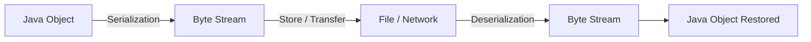

Methods for Serializing and Deserializing an Object:

- **ObjectOutputStream** class object is used for serialization of object.
  
- **ObjectInputStream** class object is used for deserialization of object.
  
- **Ob.writeObject() :** methods used to write object stream into file.

- **Ob.readObject() :** method used to read object stream from file.

```java
public class SerializeDemo {

public static void main(String[] args) throws
ClassNotFoundException, IOException {

File file = new File("Student.txt");

serializeObeject(file);

deserializeObject(file).stream().forEach(s ->
System.out.println(s.getName()));

}
```

```java

```

##### 📌 1. Core Concepts & Definitions

- **Serialization:** Converting an object to a byte stream using `ObjectOutputStream`.
- **Deserialization:** Reconstituting an object from a byte stream using `ObjectInputStream`.
- **Marker Interface:** `java.io.Serializable` is a marker interface (no methods) that "marks" a class as eligible for serialization.
- **serialVersionUID:** A unique ID used during deserialization to verify that the sender and receiver have compatible class definitions.

------

##### 📌 2. Process Workflow

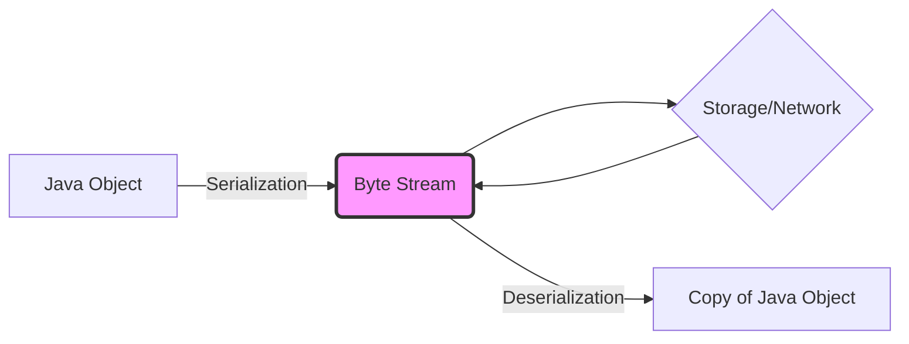

------

##### 📌 3. Implementation Essentials

##### Primary Classes

1. **`ObjectOutputStream`**: Uses `writeObject(Object obj)` to serialize.
2. **`ObjectInputStream`**: Uses `readObject()` to deserialize.

```java
public class SerializeDemo {
	public static void main(String[] args) throws ClassNotFoundException, IOException {
		File file = new File("Student.txt");
		serializeObeject(file);
		deserializeObject(file).stream().forEach(s -> System.out.println(s.getName()));
	}

public static List<Student> deserializeObject(File f)
	    throws IOException, ClassNotFoundException {
 	    FileInputStream fileInput = new FileInputStream(f);
 	    ObjectInputStream [objectInput] = new
	        ObjectInputStream(fileInput);
 	    List<Student> savedStudent = [(List<Student>)
	                                  objectInput.readObject()];
 	    // System.out.println(savedStudent);
 	    return savedStudent;
 	}

	public static void serializeObeject(File f) {
		try {
			if (f.exists()) {
				System.out.println("File created " + f.getAbsolutePath());
				FileOutputStream fout = new FileOutputStream(f);
				ObjectOutputStream objectoutput = new ObjectOutputStream(fout);
				List<Student> stds = Arrays.asList(new Student("Ram", "Delhi", LocalDate.of(1077, 15, 34), 18),
						new Student("Rupa", "Pune", LocalDate.of(1992, 07, 14), 25),
						new Student("Menar", "Jaipur", LocalDate.of(2034, 5, 9), 1));
				objectoutput.writeObject(stds);
				System.out.println("Student object Serialized !");
			}
		} catch (IOException e) {
			e.printStackTrace();
		}
	}
}
```

**Note:** If a parent class implements `Serializable`, all child classes are automatically serializable. However, if only the child implements it, the parent must have a no-argument constructor for the child to deserialize correctly.

------

##### 📌 4. Key Keywords & Visibility

- **`transient`**: Variables marked as `transient` are skipped during serialization. They return to default values (e.g., `null` or `0`) upon deserialization.
- **`static`**: These belong to the class, not the object instance, and are **never serialized**.
- **`final`**: Final variables are serialized by their values. Marking a `final` variable as `transient` is generally ineffective as the compiler replaces them with literal values in bytecode.

------

##### 📌 5. Advanced Customization

##### Callback Methods

You can define private methods in your class to customize the serialization logic (e.g., for encryption):

- `private void writeObject(ObjectOutputStream oos)`
- `private void readObject(ObjectInputStream ois)`

##### Serialization Proxy Pattern

**Tip:** As suggested in *Effective Java*, use the **Serialization Proxy Pattern** to avoid security risks and maintenance costs associated with native serialization. You serialize a private static nested "proxy" class instead of the actual object.

------

##### 📌 6. Comparison: Serializable vs. Externalizable

| Feature            | `Serializable`                    | `Externalizable`                              |
| ------------------ | --------------------------------- | --------------------------------------------- |
| **Implementation** | Marker Interface (no methods)     | Requires `writeExternal()` & `readExternal()` |
| **Control**        | Handled by JVM (Default)          | Full control by programmer                    |
| **Performance**    | Slower (saves total object graph) | Faster (saves only required parts)            |
| **Constructor**    | No-arg constructor NOT required   | **Public no-arg constructor mandatory**       |

------

##### 📌 7. Security & Vulnerabilities

**Warning:** Deserializing untrusted data is **inherently dangerous**. The incoming stream determines which objects are created, allowing attackers to execute malicious code.

- **Gadget Chain:** A sequence of method calls across serializable objects that leads to an exploit like **Remote Code Execution (RCE)**.
- **Prevention Strategies:**
  - **Serialization Filters:** Use `ObjectInputFilter` (Java 9+) to allow/reject specific classes.
  - **Avoid Native Serialization:** Use JSON or XML for transferring data when possible.
  - **Validate:** Check field invariants in the `readObject` method before assignment.

------

##### 📌 8. Interview Tips & Pitfalls

- **Is the constructor called during deserialization?**
  - For `Serializable`: **No**.
  - For `Externalizable`: **Yes** (the public no-arg constructor).
- **What is `InvalidClassException`?** It occurs if the `serialVersionUID` in the byte stream doesn't match the local class version.
- **Can you serialize a `static` variable?** No, because it belongs to the class, not the instance.
- **What happens if a non-serializable object is a member of a serializable class?** It throws a `NotSerializableException` at runtime unless the field is marked `transient`.

**Tip:** Always explicitly declare `serialVersionUID` to avoid compatibility issues across different compilers or minor class changes.

---

<div align="center"><h3>✦✦ Java File Handling ✦✦</h3></div>

#### ✦ What is File Handling?

File handling in Java is the process of **creating, reading, writing, updating, and deleting files** using classes from `java.io` and `java.nio` packages.

 ➤ Why It is Required?

- 🧠 Store data permanently
- 🔄 Read/write data between program executions
- 📂 Manage files and directories
- 🚀 Handle large datasets efficiently

---

#### ✦ File Handling Classes & Their Uses

| Class            | Purpose                                          |
| ---------------- | ------------------------------------------------ |
| File             | Represents file/directory path                   |
| FileReader       | Reads character data from a file                 |
| FileWriter       | Writes character data to a file                  |
| BufferedReader   | Efficiently reads text from a file               |
| BufferedWriter   | Efficiently writes text to a file                |
| FileInputStream  | Reads binary data from a file                    |
| FileOutputStream | Writes binary data to a file                     |
| RandomAccessFile | Reads and writes at specific positions in a file |

---

#### ✦ Common File Handling Operations

##### 📌 ➤ Create a File

```java
public void createFile() throws IOException {
    if (file.exists()) {
        System.out.println("File already exists!");
    } else {
        file.createNewFile();
        System.out.println("File created at path: " + file.getAbsolutePath());
    }
}
```

------

##### 📌 ➤ Write to a File Using FileWriter

```java
public void updateFile() throws IOException {
    FileWriter fw = new FileWriter(file);
    fw.write("This is test file using java!\nMy name is Narsing!");
    fw.close();
    System.out.println("Data written!");
}
```

------

##### 📌 ➤ Write Using BufferedWriter (Efficient Way)

```java
FileWriter fw = new FileWriter(file);
BufferedWriter bw = new BufferedWriter(fw);
bw.write("This is test file using java!\nMy name is Narsing!");
bw.close();
System.out.println("Data written!");
```

> 💡 Tip: BufferedWriter improves performance by reducing disk I/O operations.

------

##### 📌 ➤ Read Using FileReader

```java
FileReader frd = new FileReader(file);
int i;
while ((i = frd.read()) != -1) {
    System.out.print((char) i);
}
frd.close();
```

------

##### 📌 ➤ Read Using BufferedReader (Efficient Way)

```java
BufferedReader reader = new BufferedReader(new FileReader(file));
String line;
while ((line = reader.readLine()) != null) {
    System.out.println(line);
}
reader.close();
```

------

##### 📌 ➤ Read Using Scanner

```java
public void readFile() throws IOException {
    Scanner fi = new Scanner(file);
    while (fi.hasNext()) {
        System.out.println(fi.nextLine());
    }
}
```

------

##### 📌 ➤ Delete a File

```java
if (file.exists() && file.delete()) {
    System.out.println("File deleted successfully!");
}
```

------

##### 📌 ➤ File Properties

```java
if (file.exists()) {
    System.out.println("Name: " + file.getName());
    System.out.println("Path: " + file.getAbsolutePath());
    System.out.println("Writable: " + file.canWrite());
    System.out.println("Readable: " + file.canRead());
    System.out.println("Size: " + file.length() + " bytes");
}
```

------

#### ✦ Working with Binary Files

##### 📌 ➤ Read Binary Data

```java
FileInputStream fis = new FileInputStream("image.jpg");
int i;
while ((i = fis.read()) != -1) {
    System.out.print(i + " ");
}
fis.close();
```

------

##### 📌 ➤ Write Binary Data

```java
FileOutputStream fos = new FileOutputStream("output.txt");
fos.write("Binary File Writing".getBytes());
fos.close();
```

------

## ✦ Important Concepts

##### 📌 ➤ FileReader vs FileInputStream

| Feature    | FileReader     | FileInputStream      |
| ---------- | -------------- | -------------------- |
| Reads Data | Character data | Binary data          |
| Use Case   | Text files     | Images, videos, etc. |

------

##### 📌 ➤ FileWriter vs BufferedWriter

| Feature     | FileWriter | BufferedWriter |
| ----------- | ---------- | -------------- |
| Writing     | Direct     | Buffered       |
| Performance | Slower     | Faster         |

------

##### 📌 ➤ RandomAccessFile

```java
RandomAccessFile file = new RandomAccessFile("test.txt", "rw");
file.seek(10);
file.writeBytes("New Data");
file.close();
```

> 🧠 Allows reading/writing at specific positions.

------

##### 📌 ➤ Append Data to File

```java
FileWriter writer = new FileWriter("test.txt", true);
writer.write("Appended text");
writer.close();
```

------

##### 📌 ➤ List Files in Directory

```java
File folder = new File("C:/Users/Documents");
String[] files = folder.list();
for (String file : files) {
    System.out.println(file);
}
```

------

##### 📌 ➤ Read Large File Efficiently

```java
BufferedReader reader = new BufferedReader(new FileReader("largefile.txt"));
String line;
while ((line = reader.readLine()) != null) {
    System.out.println(line);
}
reader.close();
```

------

#### ✦ Exception Handling & Best Practices

##### 📌 ➤ Try-With-Resources (Recommended)

```java
try (FileReader reader = new FileReader("test.txt")) {
    // Read file
} catch (IOException e) {
    e.printStackTrace();
}
```

------

> ⚠️ Warning:

- Not closing streams can cause **memory leaks** and **file locking issues**

------

> 💡 Tips:

- Always close file streams
- Use Buffered classes for better performance
- Handle exceptions properly
- Prefer try-with-resources

------

## ✦ Common Methods & Return Types

| Method            | Return Type | Purpose          |
| ----------------- | ----------- | ---------------- |
| createNewFile()   | boolean     | Creates file     |
| delete()          | boolean     | Deletes file     |
| exists()          | boolean     | Checks existence |
| getName()         | String      | File name        |
| getAbsolutePath() | String      | Full path        |
| canRead()         | boolean     | Read permission  |
| canWrite()        | boolean     | Write permission |
| length()          | long        | File size        |
| read()            | int         | Reads character  |
| readLine()        | String      | Reads line       |
| write(String s)   | void        | Writes data      |
| close()           | void        | Closes stream    |
| seek(long pos)    | void        | Moves pointer    |

------

## 🚀 Summary

##### 📌 ➤ Key Takeaways

- 📌 File handling is essential for persistent data storage
- ⚡ Use BufferedReader/Writer for performance
- 🧵 Use streams for binary data
- 🔒 Always close resources
- 🧠 Use try-with-resources for safer code


------

# Design Patterns

**Definition:** Design patterns are solutions to recurring problems during application development.

| Type       | Purpose                       | Examples                    |
| ---------- | ----------------------------- | --------------------------- |
| Creational | Object Creation               | Singleton, Factory, Builder |
| Structural | Object Composition            | Adapter, Decorator, Proxy   |
| Behavioral | Communication Between Objects | Observer, Strategy, Command |

----

#### Creational Patterns :

##### 📌 1.**Singleton Design Pattern:**

- There are multiple scenarios where we want single instance of class should be created and used throughout the application.
  
- In single design pattern single instance of class created and used throughout the application
  
- We can create only single instance of class by using below steps

- **Private Constructor** : making private constructor restrict direct object instantiation
  
- **Private Static Instance** : create private instance

- **Public Static Method**: this method creates and return object if object is doesn't exist.
  
- The Singleton design pattern is used to ensure that a class has only one instance and provides a global point of access to that instance.
  
- It is used when you want to limit the number of instances of a class and ensure that all clients use the same instance.

Example :

``` java
public class Singleton {

    // private constructor to avoid object instantiation from external
    resource

        // create private static object variable

        // create public static method that return object if object is null

        private static Singleton obj;

    private Singleton() {

        System.out.println("Created Object !");

    };

    public static Singleton getSingleObject() {

        if(obj==null) {

            obj=new Singleton();

        }

        return obj;

    }

    public static void main(String[] args) {

        Singleton obj1=Singleton.getSingleObject();

        Singleton obj2=Singleton.getSingleObject();

        System.out.println(obj1.equals(obj2));

    }

}
```

##### 📌 2.**Factory Design Pattern:**

- The Factory design pattern is used to create objects without exposing the object creation logic to the client.
  
- It provides a way to encapsulate object creation and allows for flexible object creation without changing the code that uses it.
  
- If we have one super class and multiple subclasses and based on data provided we have to create object of one of the subclass then we use factory design pattern.
  
- The Factory design pattern offers valuable advantages in encapsulating object creation.

```java
public interface Vehical {
    
    public void drive();

}

public class Bike implements Vehical {

    @Override
    public void drive() {
        System.out.println("Bike is running.....!");
    }

}

public class Car implements Vehical {

    @Override
    public void drive() {
        System.out.println("Car is running.....!");
    }

}

public class Main {

    public static void main(String[] args) {
        getVehicalObj("bike").drive();
    }

    public static Vehical getVehicalObj(String type) {
        if (type.equalsIgnoreCase("car")){
            return new Car();
        }
        else if (type.equals("bike")){
            return new Bike();
        }
        return new Car();

    }

}
// Bike is running.....!
```
##### 📌 3. Builder Design Pattern

**Purpose:** The **Builder Design Pattern** is a creational pattern used to build complex objects step-by-step. It is particularly useful when an object has many optional parameters or a complex initialization process, as it avoids the "Telescoping Constructor" anti-pattern (having too many constructor overloads).
 **Real-life example:** Building a custom PC or a complex meal.

```java
class Meal {

    private String drink;

    private String mainCourse;

    public static class Builder {

        private String drink;

        private String mainCourse;

        public Builder setDrink(String drink) {
            this.drink = drink;
            return this;
        }

        public Builder setMainCourse(String main) {
            this.mainCourse = main;
            return this;
        }

        public Meal build() {
            return new Meal(this);
        }
    }

    private Meal(Builder b) {
        drink = b.drink;
        mainCourse = b.mainCourse;
    }
}
```

------

##### 📌 4. Prototype Design Pattern

**Purpose:** Clone objects instead of creating new ones.
 **Real-life example:** Copying documents or cloning shapes in a drawing app.

```java
class Shape implements Cloneable {
    public String type;
    public Shape clone() throws CloneNotSupportedException { return (Shape) super.clone(); }
}
```

------

##### 📌 5. Abstract Factory Pattern

**Purpose:** Provide an interface to create families of related objects.
 **Real-life example:** UI toolkit creating Buttons and TextFields for Windows/Mac.

```java
interface GUIFactory { Button createButton(); TextField createTextField(); }
class WindowsFactory implements GUIFactory { /* return WindowsButton/TextField */ }
class MacFactory implements GUIFactory { /* return MacButton/TextField */ }
```

------

#### Structural Patterns

##### 📌 1. Adapter Pattern

**Purpose:** Convert one interface into another expected by client.
 **Real-life example:** Power plug adapter.

```java
interface MediaPlayer { void play(String file); }
class AudioPlayer implements MediaPlayer { public void play(String file){System.out.println("Playing "+file);} }
class MediaAdapter implements MediaPlayer { /* adapts different formats */ }
```

------

##### 📌 2. Decorator Pattern

**Purpose:** Add behavior to objects dynamically.
 **Real-life example:** Adding toppings to a pizza.

```java
interface Coffee { double cost(); }
class SimpleCoffee implements Coffee { public double cost(){return 5;} }
class MilkDecorator implements Coffee { Coffee c; public MilkDecorator(Coffee c){this.c=c;} public double cost(){return c.cost()+2;} }
```

------

##### 📌 3. Proxy Pattern

**Purpose:** Control access to an object.
 **Real-life example:** Virtual proxy for image loading.

```java
interface Image { void display(); }
class RealImage implements Image { public void display(){System.out.println("Displaying image");} }
class ProxyImage implements Image { RealImage real; public void display(){if(real==null) real=new RealImage(); real.display();} }
```

------

##### 📌 4. Facade Pattern

**Purpose:** Provide a unified interface to a set of interfaces.
 **Real-life example:** Home theater system controlling multiple devices.

```java
class HomeTheaterFacade {
    Amplifier amp; DVDPlayer dvd; Lights lights;
    void watchMovie(){lights.dim(); amp.on(); dvd.play();}
}
```

------

##### 📌 5. Composite Pattern

**Purpose:** Treat a group of objects like a single object.
 **Real-life example:** File system (folders containing files/folders).

```java
interface Component { void showDetails(); }
class Leaf implements Component { public void showDetails(){System.out.println("File");} }
class Composite implements Component {
    List<Component> children = new ArrayList<>();
    public void add(Component c){children.add(c);}
    public void showDetails(){children.forEach(Component::showDetails);}
}
```

------

##### 📌 6. Bridge Pattern

**Purpose:** Decouple abstraction from implementation.
 **Real-life example:** Different remote controls controlling different devices.

```java
interface Remote { void pressButton(); }
class TVRemote implements Remote { public void pressButton(){System.out.println("TV button pressed");} }
class AdvancedRemote { Remote remote; void press(){remote.pressButton();} }
```

------

#### Behavioral Patterns

##### 📌 1. Observer Pattern

**Purpose:** One-to-many dependency; notify observers on state change.
 **Real-life example:** Social media notifications.

```java
interface Observer { void update(); }
class Subject {
    List<Observer> observers = new ArrayList<>();
    void addObserver(Observer o){observers.add(o);}
    void notifyObservers(){observers.forEach(Observer::update);}
}
```

------

##### 📌 2. Strategy Pattern

**Purpose:** Define a family of algorithms and make them interchangeable.
 **Real-life example:** Payment method selection (Credit Card, PayPal, UPI).

```java
interface PaymentStrategy { void pay(int amount); }
class CreditCard implements PaymentStrategy { public void pay(int amt){System.out.println("Paid "+amt+" via Credit Card");} }
class PayPal implements PaymentStrategy { public void pay(int amt){System.out.println("Paid "+amt+" via PayPal");} }
```

------

##### 📌 3. Command Pattern

**Purpose:** Encapsulate a request as an object.
 **Real-life example:** Remote control commands (Turn On, Turn Off).

```java
interface Command { void execute(); }
class Light { void on(){System.out.println("Light ON");} void off(){System.out.println("Light OFF");} }
class LightOnCommand implements Command { Light light; public LightOnCommand(Light l){light=l;} public void execute(){light.on();} }
```

------

##### 📌 4. Iterator Pattern

**Purpose:** Access elements of a collection sequentially without exposing its structure.
 **Real-life example:** Traversing a list of songs in a playlist.

```java
interface Iterator { boolean hasNext(); Object next(); }
class NameRepository {
    String[] names = {"Alice", "Bob"};
    Iterator getIterator(){ return new NameIterator(); }
    class NameIterator implements Iterator { int index=0; public boolean hasNext(){return index<names.length;} public Object next(){return names[index++];} }
}
```

------

##### 📌 5. Template Method Pattern

**Purpose:** Define skeleton of algorithm, letting subclasses redefine steps.
 **Real-life example:** Cooking recipe steps.

```java
abstract class Game { abstract void initialize(); abstract void startPlay(); abstract void endPlay(); 
    public final void play(){initialize(); startPlay(); endPlay();} }
class Football extends Game { void initialize(){System.out.println("Football initialized");} void startPlay(){System.out.println("Football started");} void endPlay(){System.out.println("Football ended");} }
```

------

##### 📌 6. State Pattern

**Purpose:** Alter behavior when object state changes.
 **Real-life example:** Traffic light changing behavior (Red, Green, Yellow).

```java
interface State { void doAction(Context context); }
class Context { private State state; public void setState(State s){state=s;} public State getState(){return state;} }
class StartState implements State { public void doAction(Context context){System.out.println("Starting..."); context.setState(this);} }
```

------

##### 📌 7. Mediator Pattern

**Purpose:** Reduce communication complexity between multiple objects.
 **Real-life example:** Air traffic control coordinating airplanes.

```java
interface Mediator { void sendMessage(String msg, Colleague colleague); }
abstract class Colleague { Mediator mediator; Colleague(Mediator m){mediator=m;} }
```


---

##### 📌 What is the Singleton design pattern, and why would you use it in your Java application?

The Singleton design pattern is used to ensure that a class has only one instance and provides a global point of access to that instance. It is used when you want to limit the number of instances of a class and ensure that all clients use the same instance.

##### 📌 When would you choose to use the Factory design pattern in your Java application, and what are its benefits?

The Factory design pattern is used to create objects without exposing the object creation logic to the client. It provides a way to encapsulate object creation and allows for flexible object creation without changing the code that uses it.

##### 📌 What is the Builder design pattern, and how does it differ from the Factory pattern?

 The Builder design pattern is used to create complex objects step by step. It differs from the Factory pattern in that it allows for greater control over the creation process and provides a way to create objects with different configurations.

##### 📌 How does the Observer design pattern work, and when would you use it in your Java code?

The Observer design pattern is used to define a one-to-many relationship between objects so that when one object changes state, all its dependents are notified and updated automatically.

 ##### 📌 When would you use the Template Method design pattern, and how does it differ from the Strategy pattern?

 The Template Method design pattern is used to define the skeleton of an algorithm in a superclass, with specific steps left to be implemented by subclasses. It differs from the Strategy pattern in that the steps of the algorithm are fixed and cannot be changed by subclasses.

---

# Regular Expression

##### 📌 What is a Regular Expression?

**Answer:** A regular expression (regex) is a special sequence of characters that helps you **match, find, or manage text**.

- **Pattern Class:** Used to define regular expressions and compile them.  
- **Matcher:** Used to perform match operations on a string.

---

##### Basic Syntax

| Pattern | Description                   |
| ------- | ----------------------------- |
| `.`     | Any character                 |
| `\d`    | Digit `[0-9]`                 |
| `\D`    | Non-digit                     |
| `\w`    | Word character `[a-zA-Z_0-9]` |
| `\W`    | Non-word character            |
| `\s`    | Whitespace                    |
| `\S`    | Non-whitespace                |
| `^`     | Beginning of a line           |
| `$`     | End of a line                 |
| `*`     | 0 or more occurrences         |
| `+`     | 1 or more occurrences         |
| `?`     | 0 or 1 occurrence             |
| `` ` `` | Backtick character            |
| `[]`    | Character class               |
| `()`    | Grouping                      |

##### 1. Basic Matchers

| Matcher | Description                      | Example                        | Matches             |
| ------- | -------------------------------- | ------------------------------ | ------------------- |
| `.`     | Any character except newline     | `a.c` with `abc`, `a1c`, `a-c` | `abc`, `a1c`, `a-c` |
| `[]`    | Any one character from the set   | `[aeiou]` with `cat`           | `a`                 |
| `[^]`   | Any character **not** in the set | `[^aeiou]` with `cat`          | `c`, `t`            |
| `` ` `` | Backtick character               | `` `cat ``                     | `` `cat ``          |
| `()`    | Grouping                         | `(ab)+` with `ababab`          | `ababab`            |

##### 2. Quantifiers

| Quantifier | Meaning                      | Example                          | Matches            |
| ---------- | ---------------------------- | -------------------------------- | ------------------ |
| `*`        | 0 or more characters in word | `go*gle` with `gogle`, `gooogle` | `gogle`, `gooogle` |
| `+`        | 1 or more characters in word | `go+gle` with `gogle`, `gooogle` | `gogle`, `gooogle` |
| `?`        | 0 or 1 occurrence            | `colou?r` with `color`, `colour` | `color`, `colour`  |
| `{n}`      | Exactly n occurrences        | `a{3}` with `aaabc`              | `aaa`              |
| `{n,}`     | At least n occurrences       | `a{2,}` with `aaaabc`            | `aaaa`             |
| `{n,m}`    | Between n and m occurrences  | `a{2,4}` with `aaaaa`            | `aaaa`             |

##### 3. Anchors

| Anchor | Description         | Example                        | Matches |
| ------ | ------------------- | ------------------------------ | ------- |
| `^`    | Start of string     | `^Java` with `Java is best`    | `Java`  |
| `$`    | End of string       | `end$` with `This is the end`  | `end`   |
| `\b`   | Word boundary       | `\bJava\b` with `I love Java.` | `Java`  |
| `\B`   | Not a word boundary | `\BJava` with `SuperJava`      | `Java`  |

##### 4. Predefined Character Classes

| Class | Meaning                     | Example                    | Matches           |
| ----- | --------------------------- | -------------------------- | ----------------- |
| `\d`  | Digit [0-9]                 | `\d+` with `abc123`        | `123`             |
| `\D`  | Non-digit                   | `\D+` with `abc123`        | `abc`             |
| `\w`  | Word character [a-zA-Z0-9_] | `\w+` with `var_1 = 10`    | `var_1`, `10`     |
| `\W`  | Non-word character          | `\W+` with `Hello, world!` | `,`, ` `, `!`     |
| `\s`  | Whitespace                  | `\s+` with `Hello World`   | ` ` (space)       |
| `\S`  | Non-whitespace              | `\S+` with `Hello, World`  | `Hello,`, `World` |

---

##### 5. Groups & Capturing

| Concept        | Description         | Example                          | Match/Group                  |
| -------------- | ------------------- | -------------------------------- | ---------------------------- |
| `()`           | Capturing group     | `(abc)+` with `abcabc`           | `abcabc`                     |
| `(?:)`         | Non-capturing group | `(?:abc)+`                       | Matches without capturing    |
| `(?<name>...)` | Named group         | `(?<year>\d{4})-(?<month>\d{2})` | Use `.group("year")` in Java |

---

##### 6. Lookahead & Lookbehind

| Type       | Description         | Example                     | Matches  |
| ---------- | ------------------- | --------------------------- | -------- |
| `(?=...)`  | Positive lookahead  | `\d(?=px)` with `10px 20px` | `0`, `0` |
| `(?!...)`  | Negative lookahead  | `\d(?!px)` with `10px 50em` | `5`, `0` |
| `(?<=...)` | Positive lookbehind | `(?<=\$)\d+` with `$100`    | `100`    |
| `(?<!...)` | Negative lookbehind | `(?<!x)hi` with `xhi ahi`   | `ahi`    |

---

##### 7. Escape Characters

| Escape | Meaning          | Example                | Matches |
| ------ | ---------------- | ---------------------- | ------- |
| `\.`   | Literal dot      | `a\.b` with `a.b`      | `a.b`   |
| `\\`   | Backslash        | `\\n` in `C:\\Users\\` | `\`     |
| `\*`   | Literal asterisk | `a\*b` with `a*b`      | `a*b`   |
| `\+`   | Literal plus     | `c\+d` with `c+d`      | `c+d`   |

---

##### 8. Common Patterns

| Pattern              | Use Case                | Example               | Matches            |
| -------------------- | ----------------------- | --------------------- | ------------------ |
| `[6-9]\d{9}`         | Indian mobile number    | `9876543210`          | Valid mobile       |
| `[A-Z]{5}\d{4}[A-Z]` | PAN card                | `ABCDE1234F`          | Valid PAN          |
| `\b\w+ing\b`         | Words ending with "ing" | `playing, going`      | `playing`, `going` |
| `https?://\S+`       | URL                     | `https://example.com` | URL                |
| `^[A-Z][a-z]+$`      | Proper noun             | `India`               | `India`            |

---


##### 📌 Why Use the Comparable Interface in Java?

The **Comparable** interface is used to define the **natural ordering** of objects in a class.  It provides a way to **compare two objects of the same type** to determine their relative order.

You use the **Comparable** interface when:
- You want to **sort a collection** of custom objects (e.g., using `Collections.sort()` or `Arrays.sort()`).
- You need to store objects in a **sorted data structure** like `TreeSet` or `TreeMap`.

**Implemention** :

```java
class Student implements Comparable<Student> {
    private String name;
    private int marks;

    public Student(String name, int marks) {
        this.name = name;
        this.marks = marks;
    }

    @Override
    public int compareTo(Student other) {
        return Integer.compare(this.marks, other.marks); // Sort by marks (ascending)
    }

    @Override
    public String toString() {
        return name + " - " + marks;
    }
}

public class ComparableExample {
    public static void main(String[] args) {
        List<Student> students = Arrays.asList(
            new Student("John", 85),
            new Student("Alice", 92),
            new Student("Bob", 78)
        );

        Collections.sort(students); // Uses compareTo()
        System.out.println(students);
    }
}

```

##### 📌 Difference Between Comparable and Comparator in Java

Both `Comparable` and `Comparator` are used to **sort custom objects**, but they differ in **how** and **where** the comparison logic is defined.

##### 📌 Comparable vs Comparator

| Feature      | Comparable    | Comparator     |
| ------------ | ------------- | -------------- |
| Package      | java.lang     | java.util      |
| Method       | `compareTo()` | `compare()`    |
| Sorting      | Natural order | Custom order   |
| Modify class | Yes           | No             |
| Example      | String        | Custom sorting |

Example:

**Comparable**

```java
class Student implements Comparable<Student>{
    public int compareTo(Student s){
        return this.age - s.age;
    }
}
```

**Comparator**

Example :

```java
import java.util.*;

public class ComparatorLambdaExample {
    public static void main(String[] args) {
        List<Student> students = Arrays.asList(
            new Student("John", 85),
            new Student("Alice", 92),
            new Student("Bob", 78)
        );

        // Sort by Marks (Ascending)
        students.sort((s1, s2) -> Integer.compare(s1.getMarks(), s2.getMarks()));

        // Sort by Name (Alphabetical)
        students.sort((s1, s2) -> s1.getName().compareTo(s2.getName()));

        students.forEach(System.out::println);
    }
}
```
---

##### 📌 When would you use a Queue data structure in Java, and what are its advantages over other data structures?

A Queue data structure is used to store elements in a FIFO (First In, First Out) order. It is useful when you need to process elements in the order in which they were added, such as in a message queue.

##### 📌 What is a Stack data structure, and how is it implemented in Java?

A Stack data structure is used to store elements in a LIFO (Last In, First Out) order. It is useful when you need to keep track of the order in which elements were added, such as in a history list.

##### 📌 How do you create Custom Exceptions in Java, and when would you use them in your code?

In Java, you can create custom exceptions by extending the Exception class or one of its subclasses. When creating a custom exception, you should provide a descriptive name and an appropriate constructor that takes a message describing the exception. You can also add additional fields and methods as needed to provide more context about the exception. Custom exceptions are typically used when there is a specific error condition that occurs frequently in your application and that cannot be adequately described by the built-in exception classes. By creating a custom exception, you can provide more detailed information about the error condition and make it easier for developers to understand and handle the exception.


---

### 📌**Core Concepts & Design Principles**

---

##### 📌 **1. Object Equality: `equals()` and `hashCode()`**

#####  🔹 **A. The `equals()` Method**

*   **Purpose:** Used to compare the **logical content** of two objects.
*   **Source:** Defined in the `Object` class.
*   **Default Behavior:** Compares memory addresses (same as `==`).
*   **When to Override:** When you need to compare actual data (e.g., matching a Student ID).

```java
@Override
public boolean equals(Object obj) {
    if (this == obj) return true; // Reference check
    if (!(obj instanceof Student)) return false; // Type check

    Student s = (Student) obj;
    return this.id == s.id && Objects.equals(this.name, s.name);
}
```

##### 🔹**B. The `hashCode()` Method**

- **Purpose:** Returns an integer representation of the object for use in **hashing-based collections** (HashMap, HashSet).
- **The Golden Rule:** If `a.equals(b)` is true, then `a.hashCode()` **must** equal `b.hashCode()`.

##### 🔹**C. Role in Collections (HashMap/HashSet)**

To locate an object, Java follows a two-step process:

1. **`hashCode()`**: Identifies the correct **Bucket** (The Drawer).
2. **`equals()`**: Identifies the **Exact Match** inside that bucket (The File).

| Scenario | `hashCode()` & `equals()` Overridden?           | Result (e.g., adding 2 identical objects) |
| -------- | ----------------------------------------------- | ----------------------------------------- |
| **No**   | Different hashes → Different buckets            | Duplicates allowed (Size = 2) ❌           |
| **Yes**  | Same hash → Same bucket → `equals` returns true | Duplicate prevented (Size = 1) ✅          |

------

##### 📌 **2. Java Language Features: Effectively Final**

**Definition**

A variable is **effectively final** if its value is assigned exactly once and never modified, even if the `final` keyword is omitted.

**Why does it matter?**

Java requires local variables used inside **Lambdas** or **Anonymous Inner Classes** to be final or effectively final to ensure **thread safety and consistency**.

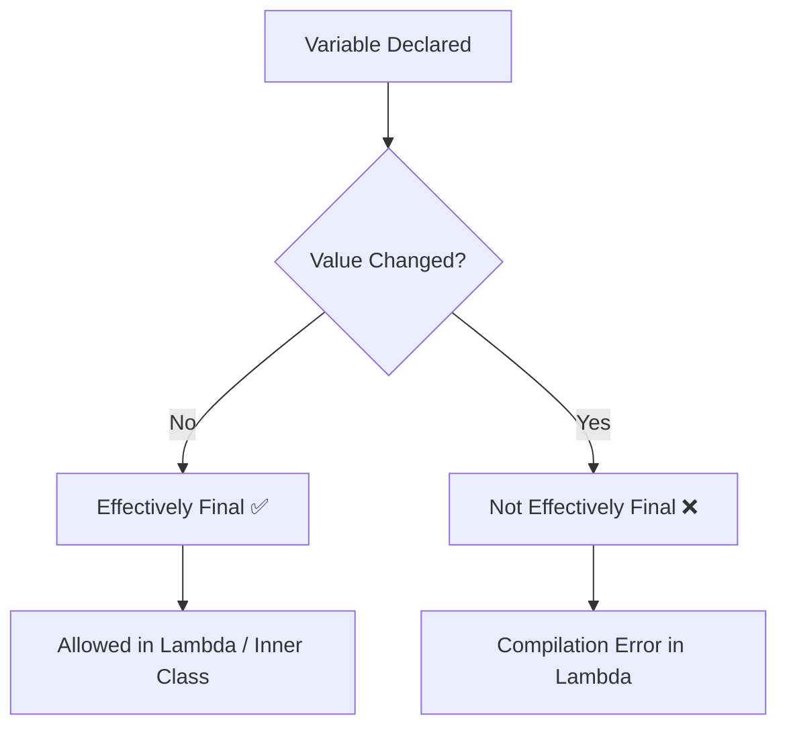

**Example:**

```java
int limit = 10; 
// limit = 20; <--- If uncommented, the line below fails
Runnable r = () -> System.out.println(limit); 
```

------

#### **🏗️ SOLID Principles in Java**

------

##### 📌 **1️⃣ S — Single Responsibility Principle (SRP)**

> **"A class should have only ONE reason to change"**

❌ **Bad Example:**

```java
class Employee {
    public void calculateSalary() { ... }
    public void saveToDatabase() { ... }  // ❌ DB logic here too!
    public void generateReport() { ... }  // ❌ Report logic here too!
}
```

✅ **Good Example:**

```java
class Employee {
    public void calculateSalary() { ... }
}

class EmployeeRepository {
    public void saveToDatabase(Employee e) { ... }
}

class EmployeeReport {
    public void generateReport(Employee e) { ... }
}
```

------

##### 📌 **2️⃣ O — Open/Closed Principle (OCP)**

> **"Open for extension, Closed for modification"**

❌ **Bad Example:**

```java
class Shape {
    String type;
    public double area() {
        if (type.equals("circle")) return Math.PI * 5 * 5;
        if (type.equals("rect")) return 4 * 6;  // ❌ modify every time
        return 0;
    }
}
```

✅ **Good Example:**

```java
abstract class Shape {
    public abstract double area();
}

class Circle extends Shape {
    double radius;
    public double area() { return Math.PI * radius * radius; }
}

class Rectangle extends Shape {
    double width, height;
    public double area() { return width * height; }
}
```

------

##### 📌 **3️⃣ L — Liskov Substitution Principle (LSP)**

> **"Subclass should be replaceable by its parent class"**

❌ **Bad Example:**

```java
class Bird {
    public void fly() { ... }
}

class Penguin extends Bird {
    public void fly() {
        throw new UnsupportedOperationException(); // ❌ Penguin can't fly!
    }
}
```

✅ **Good Example:**

```java
class Bird {
    public void eat() { ... }
}

interface Flyable {
    void fly();
}

class Sparrow extends Bird implements Flyable {
    public void fly() { System.out.println("Sparrow flying!"); }
}

class Penguin extends Bird {
    // No fly() — that's fine! ✅
}
```

------

##### 📌 **4️⃣ I — Interface Segregation Principle (ISP)**

> **"Don't force a class to implement methods it doesn't need"**

❌ **Bad Example:**

```java
interface Animal {
    void eat();
    void fly();   // ❌ Dog can't fly!
    void swim();  // ❌ Eagle can't swim!
}
```

✅ **Good Example:**

```java
interface Eatable {
    void eat();
}

interface Flyable {
    void fly();
}

interface Swimmable {
    void swim();
}

class Dog implements Eatable, Swimmable {
    public void eat() { ... }
    public void swim() { ... }
}

class Eagle implements Eatable, Flyable {
    public void eat() { ... }
    public void fly() { ... }
}
```

------

##### 📌 **5️⃣ D — Dependency Inversion Principle (DIP)**

> **"Depend on abstractions, not on concrete classes"**

❌ **Bad Example:**

```java
class EmailService {
    public void sendEmail() { ... }
}

class Notification {
    EmailService emailService = new EmailService(); // ❌ tightly coupled
    public void send() { emailService.sendEmail(); }
}
```

✅ **Good Example:**

```java
interface MessageService {
    void sendMessage();
}

class EmailService implements MessageService {
    public void sendMessage() { System.out.println("Email sent!"); }
}

class SMSService implements MessageService {
    public void sendMessage() { System.out.println("SMS sent!"); }
}

class Notification {
    private MessageService service;

    // ✅ Injecting dependency
    public Notification(MessageService service) {
        this.service = service;
    }

    public void send() { service.sendMessage(); }
}
```

------

##### 📌 **Summary Table**

| Principle                     | Key Concept                                     | Goal                             |
| ----------------------------- | ----------------------------------------------- | -------------------------------- |
| **S** - Single Responsibility | One class = One job.                            | Easier maintenance.              |
| **O** - Open/Closed           | Open for Extension, Closed for Modification.    | Use Interfaces/Inheritance.      |
| **L** - Liskov Substitution   | Subtypes must be substitutable for base types.  | Avoid breaking parent logic.     |
| **I** - Interface Segregation | Many specific interfaces > One "Fat" interface. | Clients only see what they need. |
| **D** - Dependency Inversion  | Depend on abstractions, not concretions.        | Decouples code via DI.           |

---

##### 📌 LRU Cache Implementation in Java

**LRU (Least Recently Used) Cache** is a caching mechanism that removes the **least recently accessed item** when the cache reaches its capacity.

- Stores data in **memory** for faster access ⚡
- Avoids expensive **database calls**
- Works on **eviction policy → LRU**

------

##### ⚠️ Problem with Cache

- Cache size is **limited**
- Cannot store all data
- Need **replacement strategy**

👉 Solution → **LRU Algorithm**

------

##### 🚀 LRU Cache Concept

- Maintains **access order**
- Most recently used → Top
- Least recently used → Bottom
- When full → remove **least recently used**

------

##### 🧩 Data Structures Used

| Data Structure                  | Purpose               |
| ------------------------------- | --------------------- |
| HashMap                         | Fast lookup (O(1))    |
| LinkedList / Doubly Linked List | Maintain access order |

------

##### ⚙️ Operations

##### 1️⃣ `put(key, value)`

##### Case 1: Cache NOT Full

- Add to HashMap
- Move item to **top (recently used)**

##### Case 2: Cache FULL

- Remove **least recently used (tail)**
- Remove from HashMap
- Insert new item at top

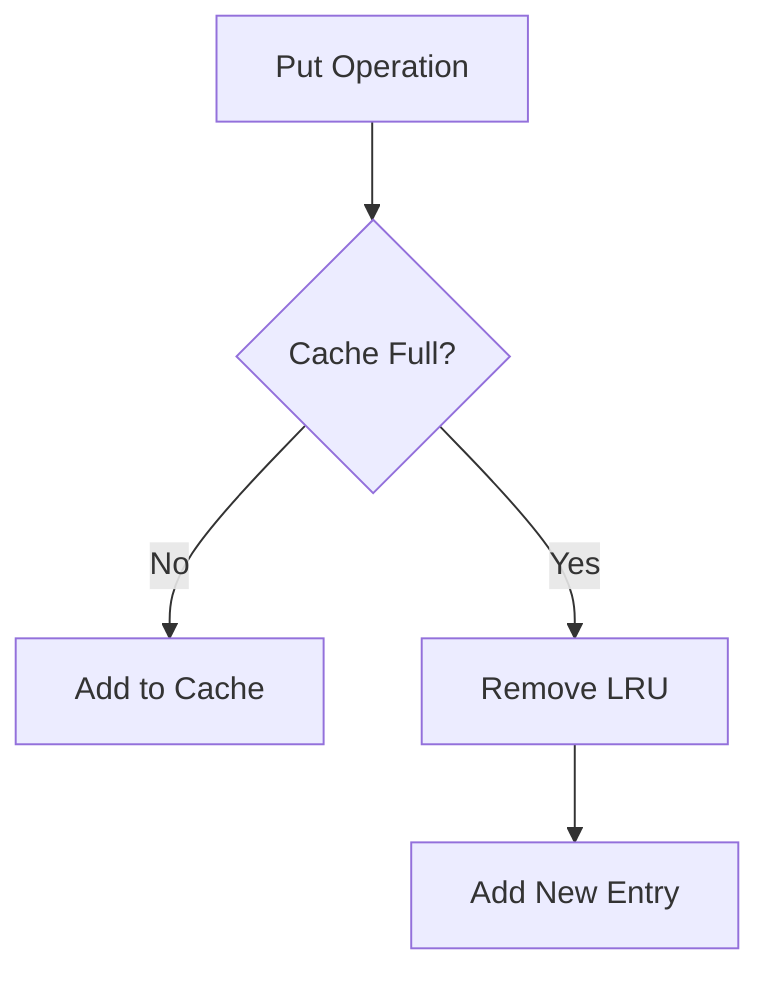

------

##### 2️⃣ `get(key)`

- If key exists:
  - Return value ✅
  - Move item to **top (recently used)**
- Else:
  - Return `null` ❌

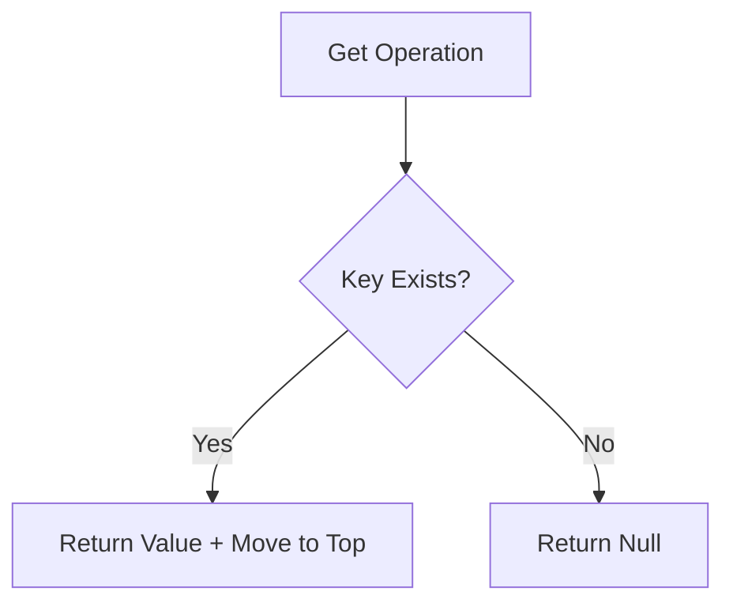

------

##### 💻 Java Implementation (Using LinkedHashMap)

##### 📌 Best & Simplest Approach

```java
import java.util.*;

class LRUCache<K, V> extends LinkedHashMap<K, V> {

    private final int capacity;

    public LRUCache(int capacity) {
        super(capacity, 0.75f, true); // accessOrder = true
        this.capacity = capacity;
    }

    @Override
    protected boolean removeEldestEntry(Map.Entry<K, V> eldest) {
        return size() > capacity;
    }

    public static void main(String[] args) {
        LRUCache<Integer, String> cache = new LRUCache<>(3);

        cache.put(1, "A");
        cache.put(2, "B");
        cache.put(3, "C");

        cache.get(1); // Access 1 → becomes recent

        cache.put(4, "D"); // Removes key 2 (LRU)

        System.out.println(cache);
    }
}
```

------

🔍 How LinkedHashMap Helps

- Maintains **insertion/access order**

- `accessOrder = true` → enables LRU behavior

- Automatically removes oldest entry using:

  ```java
  removeEldestEntry()
  ```

------

🆚 Custom vs LinkedHashMap

| Feature       | Custom (HashMap + DLL) | LinkedHashMap |
| ------------- | ---------------------- | ------------- |
| Complexity    | High                   | Low ✅         |
| Control       | Full                   | Limited       |
| Interview Use | Preferred              | Good shortcut |
| Code Length   | Large                  | Small ✅       |


------

##### 📊 Java Versions vs Features 

| ☕ Java Version         | 📅 Release Year | 🚀 Key Features                                               |
| ---------------------- | -------------- | ------------------------------------------------------------ |
| **Java 5**             | 2004           | Generics, Enhanced for-loop, Autoboxing/Unboxing, Enums, Varargs |
| **Java 6**             | 2006           | Performance improvements, JDBC 4.0, Scripting support        |
| **Java 7**             | 2011           | Try-with-resources, Diamond operator (`<>`), Multi-catch, NIO.2 (File API) |
| **Java 8** ⭐           | 2014           | Lambda Expressions, Functional Interfaces, Streams API, Default & Static methods, Date-Time API |
| **Java 9**             | 2017           | Module System (JPMS), JShell, Private methods in interfaces  |
| **Java 10**            | 2018           | `var` (Local variable type inference)                        |
| **Java 11 (LTS)** ⭐    | 2018           | HTTP Client API, String methods (`isBlank()`, `lines()`), `var` in lambda |
| **Java 12**            | 2019           | Switch expressions (Preview), JVM improvements               |
| **Java 13**            | 2019           | Text Blocks (Preview), Switch improvements                   |
| **Java 14**            | 2020           | Switch expressions (Standard), Records (Preview), Helpful NullPointerExceptions |
| **Java 15**            | 2020           | Text Blocks (Standard), Sealed Classes (Preview)             |
| **Java 16**            | 2021           | Records (Standard), Pattern Matching for `instanceof`        |
| **Java 17 (LTS)** ⭐    | 2021           | Sealed Classes, Pattern Matching improvements, Strong encapsulation |
| **Java 18**            | 2022           | Simple Web Server, UTF-8 by default                          |
| **Java 19**            | 2022           | Virtual Threads (Preview), Structured Concurrency (Incubator) |
| **Java 20**            | 2023           | Virtual Threads (2nd Preview), Pattern Matching enhancements |
| **Java 21 (LTS)** ⭐    | 2023           | Virtual Threads (Stable), Record Patterns, Pattern Matching for switch |
| **Java 22**            | 2024           | Foreign Function & Memory API (Preview), Unnamed variables   |
| **Java 23**            | 2024           | String Templates (Preview), Scoped values                    |
| **Java 24** *(Latest)* | 2025           | Performance improvements, ongoing preview feature stabilization |

**🚀 Java Evolution Timeline **

```mermaid
timeline
    title ☕ Java Version Evolution (Quick Revision)

    2004 : Java 5
         : Generics, Autoboxing, Enums

    2006 : Java 6
         : Performance Improvements, JDBC 4.0

    2011 : Java 7
         : Try-with-resources, Diamond Operator, NIO.2

    2014 : Java 8 ⭐
         : Lambda, Streams API, Functional Programming

    2017 : Java 9
         : Module System (JPMS), JShell

    2018 : Java 10
         : var (Type Inference)

    2018 : Java 11 ⭐ (LTS)
         : HTTP Client, String APIs

    2019 : Java 12–13
         : Switch Expressions, Text Blocks (Preview)

    2020 : Java 14–15
         : Records (Preview), Text Blocks

    2021 : Java 16–17 ⭐ (LTS)
         : Records, Sealed Classes

    2022 : Java 18–19
         : Simple Web Server, Virtual Threads (Preview)

    2023 : Java 20–21 ⭐ (LTS)
         : Virtual Threads (Stable), Pattern Matching

    2024+ : Java 22–24
          : Foreign Memory API, String Templates, Performance
```

----

## Features of Java 11

**Major Features of Java 11**

| **Feature**              | **Category** | **Primary Benefit**                             |
| ------------------------ | ------------ | ----------------------------------------------- |
| **`var` in Lambdas**     | Language     | Allows annotations on lambda parameters.        |
| **`HttpClient`**         | Networking   | Modern, non-blocking API with HTTP/2 support.   |
| **`Files.readString()`** | I/O          | Quick file reading/writing without boilerplate. |
| **`String.isBlank()`**   | API          | Simplified string validation.                   |
| **ZGC**                  | JVM          | Ultra-low latency for large applications.       |
| **No `javac` needed**    | Tooling      | Faster prototyping for single-file scripts.     |

------

#### 1. `var` in Lambda Parameters

Before Java 11:

```java
(a, b) -> a + b
```

Java 11:

```java
(var a, var b) -> a + b
```

Example:

```java
List<String> names = List.of("A", "B");

names.forEach((var name) -> System.out.println(name));
```

**Why introduced?**

To allow annotations in lambda parameters.

```java
(@NotNull var name) -> System.out.println(name)
```

------

#### 2. New String Methods

- **`isBlank()`**
  
  - **Purpose**: Checks if a string is empty or consists only of spaces.
  - **Example**:
    ```java
    String s = "   ";
    System.out.println(s.isBlank());
    ```
  - **Output**: `true`
  
- **`lines()`**
  - **Purpose**: Converts a string into a stream of lines.
  - **Example**:
    ```java
    String text = "Java\nSpring\nKafka";
    text.lines().forEach(System.out::println);
    ```

- **`strip()`**
  - **Purpose**: Removes leading and trailing whitespace (Unicode aware).
  - **Example**:
    ```java
    String s = " Java ";
    System.out.println(s.strip());
    ```

- **`stripLeading()`**
  
  - **Purpose**: Removes leading whitespace from a string.
  - **Example**:
    ```java
    String s = " Java ";
    System.out.println(s.stripLeading());
    ```
  
- **`stripTrailing()`**
  
  - **Purpose**: Removes trailing whitespace from a string.
  - **Example**:
    ```java
    String s = " Java ";
    System.out.println(s.stripTrailing());
    ```
  
- **`repeat(int count)`**
  - **Purpose**: Repeats a string a specified number of times.
  
  - **Example**:
    
    ```java
    System.out.println("Hi ".repeat(3));
    ```
    
  - **Output**: `Hi Hi Hi `

---

#### 3. New File Methods

- **Java 11** introduced improved methods for **file handling**, making it more straightforward.

**`Files.writeString()`**

- **Purpose**: Allows writing a string to a file easily.
- **Syntax**: 
  
  ```java
  Path path = Path.of("test.txt");
  Files.writeString(path, "Hello Java 11");
  ```
- **Key Concept**: Utilizes the **Path** class to define the file location.

**`Files.readString()`**

- **Purpose**: Facilitates reading a string from a file.
- **Syntax**:
  ```java
  String data = Files.readString(path);
  System.out.println(data);
  ```
- **Key Concept**: Simplifies the process of retrieving file content as a string.

##### Benefits of New File Methods

- **Less Boilerplate Code**: 
  - Reduces the amount of code required for file operations, contributing to cleaner and more maintainable code.
  
- **Easier than `BufferedReader`**: 
  - The new methods eliminate the complexity associated with using a **BufferedReader** for reading and writing text files.

These enhancements reflect Java's ongoing commitment to improving developer experience by streamlining common tasks such as file I/O operations.

---

#### 4. **HTTP Client API (Standard)**

- **Before Java 11:**
  - Utilized **`HttpURLConnection`**.
  - Employed **Apache HttpClient** and other third-party libraries.
  
- **Java 11 Introduction:**
  
  - Introduced built-in **`java.net.http.HttpClient`**.
  
- **Example Usage:**
  ```java
  
  public class Main {
      public static void main(String[] args) {
          // 1. Create the client
          HttpClient client = HttpClient.newHttpClient();
  
          // 2. Create the request
          HttpRequest request = HttpRequest.newBuilder()
                  .uri(URI.create("https://dummyjson.com/products"))
                  .GET()
                  .build();
  
          // 3. Send the request asynchronously (or use .send() for synchronous)
          client.sendAsync(request, HttpResponse.BodyHandlers.ofString())
                  .thenApply(HttpResponse::body)
                  .thenAccept(System.out::println)
                  .join(); // Wait for completion
          //4. synchronous
          HttpResponse<String> response = client.send(request,HttpResponse.BodyHandlers.ofString());
          System.out.println(response.body());
      }
  }
  ```
  
- **Flowchart:**
  ```mermaid
  flowchart LR
  A[Create Client]
  --> B[Create Request]
  --> C[Send Request]
  --> D[Get Response]
  ```

#### 5. **Run Java File Without Compilation**
- **Before Java 11:**
  - Required commands: we have to compile the file first  using javac and then run using java
    ```bash
    javac Test.java
    java Test
    ```
  
- **Java 11 Improvement:**
  
  - Direct execution possible: now we can directly run the class without compilation
    ```bash
    java Test.java
    ```
  
- **Use Cases:**
  - Suitable for **scripts** and **quick testing**.

#### 6. **Optional Enhancements**
- **`isEmpty()` Method:**
  
  - Example:
  ```java
  Optional<String> op = Optional.empty();
  
  System.out.println(op.isEmpty());
  ```
  - **Output:** `true`.

#### 7. **Collection to Array Conversion**

- **Example:**
  
  ```java
  List<String> list = List.of("A","B","C");
  
  String[] arr = list.toArray(String[]::new);
  ```
- **Advantage:** Cleaner conversion process.

#### 8. **Nest-Based Access Control**

- **Improvement:**
  
  - Enhanced access between nested classes.
  
- **Before Java 11:**
  - Compiler created synthetic bridge methods.
  
- **Java 11 Change:**
  
  - Allows direct access:
  ```java
  class Outer {
      private int x = 10;
  
      class Inner {
          void show() {
              System.out.println(x);
          }
      }
  }
  ```
- **Benefit:** Performance enhancement.

#### 9. **Removed Modules**
- **Java EE Modules Removed:**
  - **JAXB**
  - **JAX-WS**
  - **CORBA**
  
- **Reason:** Not commonly used; now requires external dependencies.

#### 10. **Flight Recorder**
- **Open Source Status:**
  - Java Flight Recorder is now open-source.
  
- **Usage:**
  - **Monitoring**
  - **Performance tuning**
  - **Production debugging**

----

These notes encapsulate the key features and enhancements introduced in Java 11, emphasizing improvements in APIs, language functionalities, and performance optimizations.

| Java 8                  | Java 11                 |
| ----------------------- | ----------------------- |
| Basic String methods    | Advanced String methods |
| No built-in HTTP client | Built-in HTTP client    |
| Manual compile/run      | Direct execution        |
| Older file handling     | readString/writeString  |
| No `Optional.isEmpty()` | Available               |

---

## Features of Java 17

| Feature                           | Status          |
| --------------------------------- | --------------- |
| Sealed Classes                    | Final           |
| Pattern Matching for `switch`     | Preview (in 17) |
| Pattern Matching for `instanceof` | Final           |
| Records                           | Final           |
| Text Blocks                       | Final           |
| Enhanced Random Generator         | Final           |
| Strong Encapsulation              | Final           |
| Foreign Function API              | Incubator       |

------

#### 1. **Sealed Classes**

A **sealed class** or interface restricts which other classes or interfaces may extend or implement it. It allows a class to explicitly define its allowed subclasses, giving you complete control over your inheritance hierarchy.

- **Before Java 17:** Any class could extend a non-final class, leading to uncontrolled inheritance.
- **With Java 17:** The parent class decides exactly *who* its children can be.

------

##### Core Syntax & Example

You use the `sealed` keyword combined with the `permits` clause to declare the allowed subclasses.

Java

```
// Parent class specifies its only allowed subclasses
public sealed class Vehicle permits Car, Bike, Truck {
    // fields and methods
}
```

------

##### Strict Rules for Subclasses

Every single subclass allowed in the `permits` clause **must** explicitly declare how it handles further inheritance. It must use exactly one of these three modifiers:

##### 1. `final`

Stops the inheritance chain completely. No other class can extend it.

Java

```java
public final class Car extends Vehicle { }
```

##### 2. `sealed`

Continues the restricted inheritance. It must declare its own permitted subclasses.

Java

```java
public sealed class Bike extends Vehicle permits SportsBike { }
```

##### 3. `non-sealed`

Breaks the restriction and opens the class up for normal, unrestricted inheritance by anyone.

Java

```java
public non-sealed class Truck extends Vehicle { } 
// Now any class can extend Truck (e.g., class CyberTruck extends Truck)
```

------

##### Key Constraints

- **Location:** Permitted subclasses must belong to the **same package** (or same module if using named modules).
- **Interfaces:** Interfaces can also be `sealed`. Since interfaces cannot be `final`, their implementations must be either `sealed` or `non-sealed`.

------

##### Why use them? (The Big Benefit)

Beyond security and architectural control, sealed classes shine when combined with **Pattern Matching for `switch`**:

Java

```java
public String getVehicleType(Vehicle v) {
    return switch (v) {
        case Car c -> "It's a car";
        case Bike b -> "It's a bike";
        case Truck t -> "It's a truck";
        // NO 'default' block needed! The compiler knows these are the only possible types.
    };
}
```

> ⚠️ **Note:** If you add a new permitted subclass to `Vehicle` later, the compiler will instantly flag an error in your `switch` expression, forcing you to handle the new type safely.

**Flow Diagram**

```mermaid
graph TD
A[Payment Sealed Class] --> B[CreditCard]
A --> C[UPI]
A --> D[NetBanking]
A --> E[Other Class ❌ Not Allowed]
```

---

#### 2. **Pattern Matching for `instanceof`**

**Before Java 17**

- Manual type checking and casting:
    ```java
    if(obj instanceof String){
        String s = (String)obj;
        System.out.println(s);
    }
    ```

**Java 17 Improvement**

- Simplified syntax:
    ```java
    if(obj instanceof String s){
        System.out.println(s);
    }
    ```

**Benefits**

- **No manual casting**: Reduces boilerplate code.
- **Cleaner code**: Enhances readability.

---

#### 3. **Records**

- **Purpose**: Used for creating **immutable data classes**.

**Before Java 17**

- Extensive boilerplate code required:
    ```java
    class Employee {
        private String name;
        private int age;
    
        // constructors
        // getters
        // setters
        // equals
        // hashCode
        // toString
    }
    ```

**Java 17 Record Implementation**

- Streamlined syntax:
    ```java
    record Employee(String name, int age){}
    ```

**Automatically Generated Features**

- **Constructor**: Automatically created.
- **Getters**: Accessor methods generated.
- **`equals()`**: Method for equality checking.
- **`hashCode()`**: Method for hash code generation.
- **`toString()`**: Method for string representation.

**Example Usage**

```java
Employee e = new Employee("John", 25);
System.out.println(e.name());
```

---

#### 4. **Text Blocks**

- **Definition**: Simplifies the creation of multi-line strings.

**Before Java 17**

- Concatenation required for multi-line strings:
    ```java
    String s = "Hello\n" +
               "Java\n" +
               "World";
    ```

**Java 17 Enhancement**

- New syntax for multi-line strings:
    ```java
    String s = """
            Hello
            Java
            World
            """;
    ```

**Useful Applications**

- **SQL queries**: Simplifies database queries.
- **JSON**: Enhances readability for JSON data.
- **XML**: Facilitates XML string creation.

---

#### 5. **Pattern Matching for Switch (Preview)**

**Before Java 17**

- Traditional switch-case structure:
    ```java
    switch(value){
        case 1:
    }
    ```

**Java 17 Enhancement**

- Improved switch-case with pattern matching:
    ```java
    switch(obj){
        case String s -> System.out.println(s);
        case Integer i -> System.out.println(i);
        default -> {}
    }
    ```

---

#### 6. **Enhanced Random Generator**

- **New Feature**: Introduces new random generator interfaces.
    ```java
    RandomGenerator generator =
            RandomGenerator.getDefault();
    ```

#### Benefits
- **Better randomness support**: Improves the quality of random number generation.

---

#### 7. **Strong Encapsulation of JDK Internals**

- **Objective**: Blocks unauthorized access to internal APIs.

Before Java 17

- Developers could access internal APIs without restrictions.

Java 17 Restriction

- Enforces limitations on internal API usage.

Benefits

- **Better security**: Protects against unauthorized access.
- **Cleaner architecture**: Improves overall system integrity.

---

#### 8. **Foreign Function & Memory API (Incubator)**

- **Purpose**: Allows Java to interact with native code without the complexity of **JNI** (Java Native Interface).

Use Cases

- **Native libraries**: Facilitates the use of libraries written in other languages.
- **Performance-heavy applications**: Improves performance by leveraging native capabilities.

---

## Features of Java 21

| Feature                       | Status  |
| ----------------------------- | ------- |
| Virtual Threads               | Final   |
| Pattern Matching for Switch   | Final   |
| Record Patterns               | Final   |
| Sequenced Collections         | Final   |
| String Templates              | Preview |
| Scoped Values                 | Preview |
| Structured Concurrency        | Preview |
| Unnamed Patterns & Variables  | Preview |
| Foreign Function & Memory API | Final   |

------

#### 1. Virtual Threads (Most Important Feature)

Problem : Traditional threads are expensive.

```java
Thread t = new Thread(() -> {
    System.out.println("Task");
});
t.start();
```

Issues:

- High memory usage
- Limited scalability
- Thread pool management required

------

##### Java 21 Solution → Virtual Threads

Lightweight threads managed by JVM.

```java
Thread.startVirtualThread(() -> {
    System.out.println("Virtual Thread");
});
```

------

**Using Executor**

```java
public class VirtualThreadExample {

    // Virtual threads are managed by the JVM and are lightweight.
    // Traditional threads (platform threads) are expensive to create and consume high memory.
    public static void main(String[] args) {
        
        // =========================================================================
        // APPROACH 1: Using ExecutorService (Structured Concurrency)
        // =========================================================================
        // try-with-resources automatically invokes service.close() at the end, 
        // forcing the main thread to wait until all submitted virtual threads finish.
        try (ExecutorService service = Executors.newVirtualThreadPerTaskExecutor()) {
            Runnable t1 = () -> {
                System.out.println("Virtual thread started via Executor!");
            };
            service.execute(t1);
        } catch (Exception e) {
            System.out.println("Exception occurred: " + e.getMessage());
        }

        try {
            // =========================================================================
            // APPROACH 2: Using Thread.ofVirtual().start() (Immediate Execution)
            // =========================================================================
            Thread start = Thread.ofVirtual().start(() -> {
                System.out.println("Virtual thread created using Thread.ofVirtual() and automatically started.");
            });

            // =========================================================================
            // APPROACH 3: Using Thread.ofVirtual().unstarted() (Lazy Execution)
            // =========================================================================
            Thread unstarted = Thread.ofVirtual().unstarted(() -> {
                System.out.println("Virtual thread created using Thread.ofVirtual() and manually started.");
            });
            unstarted.start(); // Explicitly starting the unstarted thread

            // =========================================================================
            // APPROACH 4: Using ThreadFactory (Reusable Blueprint)
            // =========================================================================
            // Create a factory that customizes the name format and increments the counter starting at 0
            ThreadFactory factory = Thread.ofVirtual().name("vthread-", 0).factory();

            // Use the factory to build a new virtual thread instance
            Thread t = factory.newThread(() -> {
                System.out.println("Thread name: " + Thread.currentThread().getName());
            });
            t.start(); // Start the factory-created thread

            // =========================================================================
            // CRITICAL: Prevent Premature Main Exit
            // =========================================================================
            // Since virtual threads are daemon threads, we must join() them.
            // Without these joins, the main method ends and the JVM shuts down before they print.
            start.join();
            unstarted.join();
            t.join();

        } catch (InterruptedException e) {
            System.out.println("Main thread was interrupted while waiting for virtual threads.");
            Thread.currentThread().interrupt();
        }
    }
}
```

------

**Benefits**

- Handles millions of tasks
- Low memory usage
- Better for I/O tasks
- Simplifies concurrency

------

### Flow

```mermaid
flowchart LR
Task --> VirtualThread --> CarrierThread --> CPU
```

------

#### 2. Pattern Matching for Switch (Final)

Java 17 → Preview
Java 21 → Final

```java
Object obj = "Java";

switch (obj) {
    case String s -> System.out.println("String: " + s);
    case Integer i -> System.out.println("Integer: " + i);
    default -> System.out.println("Unknown");
}
```

------

#### 3. Record Patterns

Extract values from records easily.

```java
record Person(String name, int age) {}

Person p = new Person("John", 25);

if (p instanceof Person(String name, int age)) {
    System.out.println(name);
}
```

------

**Benefit**

Cleaner destructuring.

------

#### 4. Sequenced Collections

New interfaces for ordered collections.

- `SequencedCollection`
- `SequencedSet`
- `SequencedMap`

Example:

```java
LinkedHashSet<String> set = new LinkedHashSet<>();

set.add("A");
set.add("B");

System.out.println(set.getFirst());
System.out.println(set.getLast());
```

------

#### 5. String Templates (Preview)

Easier string formatting.

Before:

```java
String name = "Java";
String s = "Hello " + name;
```

Java 21:

```java
String name = "Java";

String s = STR."Hello \{name}";
```

------

#### 6. Scoped Values (Preview)

Safer alternative to ThreadLocal.

Before:

```java
ThreadLocal<String> user = new ThreadLocal<>();
```

Java 21:

```java
ScopedValue<String> user = ScopedValue.newInstance();
```

------

**Benefits**

- Better readability
- Better performance
- Safer with virtual threads

------

#### 7. Structured Concurrency (Preview)

Manage multiple concurrent tasks as one unit.

```java
try(var scope = new StructuredTaskScope.ShutdownOnFailure()) {
}
```

### Benefit

Improves concurrent task management.

------

### Flow

```mermaid
flowchart TD
ParentTask --> ChildTask1
ParentTask --> ChildTask2
ParentTask --> ChildTask3
```

------

#### 8. Foreign Function & Memory API (Final)

Interact with native code without JNI complexity.

Used for:

- C libraries
- Native memory access

------

#### 9. Unnamed Variables and Patterns (Preview)

Use `_` when variable is not needed.

```java
if(obj instanceof String _) {
    System.out.println("String found");
}
```

------

| Java 17                  | Java 21                |
| ------------------------ | ---------------------- |
| Records                  | Record patterns        |
| Sealed classes           | Virtual threads        |
| Text blocks              | Structured concurrency |
| Pattern matching preview | Finalized              |
| Basic collections        | Sequenced collections  |

### Using `instanceof` before Type Casting

#### Problem without `instanceof`

```java
Object obj = "Java";

Integer num = (Integer) obj;
```

Output:

```java
ClassCastException
```

------

#### Safe way

```java
Object obj = "Java";

if(obj instanceof String){
    String s = (String) obj;
    System.out.println(s);
}
```

### Flow

```mermaid
flowchart LR
A[Object] --> B{instanceof check}
B -->|true| C[Type Casting]
B -->|false| D[Avoid Exception]
```


### Generics

------

#### 1. What are Generics?

Generics allow you to write **type-safe, reusable code** that works with different data types without sacrificing compile-time safety. Instead of writing separate logic for each type, you parameterise the type.

**Without generics** — must write separate methods:

```java
int max(int a, int b) { ... }
double max(double a, double b) { ... }
```

**With generics** — one method, any type:

```java
<T extends Comparable<T>> T max(T a, T b) { ... }
```

**Benefits:**

- Compile-time type checking (catch errors early)
- Eliminates unnecessary casting
- Enables writing reusable algorithms and data structures
- Code is more readable and maintainable

------

#### 2. Generic Classes & Interfaces

**Basic Generic Class**

```java
class Box<T> {
    private T value;

    public Box(T value) { this.value = value; }
    public T get() { return value; }
}

Box<String>  strBox = new Box<>("hello");
Box<Integer> intBox = new Box<>(42);
```

**Multiple Type Parameters**

```java
class Pair<A, B> {
    public A first;
    public B second;
}

Pair<String, Integer> p = new Pair<>();
p.first = "age";
p.second = 30;
```

**Generic Interface**

```java
interface Repository<T, ID> {
    T findById(ID id);
    void save(T entity);
    List<T> findAll();
}

class UserRepository implements Repository<User, Long> {
    public User findById(Long id) { ... }
    public void save(User user) { ... }
    public List<User> findAll() { ... }
}
```

**Naming Conventions**

| Letter | Stands for | Common use                   |
| ------ | ---------- | ---------------------------- |
| `T`    | Type       | General type parameter       |
| `E`    | Element    | Collections (e.g. `List<E>`) |
| `K`    | Key        | Maps (e.g. `Map<K, V>`)      |
| `V`    | Value      | Maps (e.g. `Map<K, V>`)      |
| `N`    | Number     | Numeric types                |
| `R`    | Return     | Function return types        |

------

#### 3. Generic Methods

Type parameters are declared **before the return type**.

```java
// Static generic method
public static <T> List<T> repeat(T item, int times) {
    List<T> list = new ArrayList<>();
    for (int i = 0; i < times; i++) list.add(item);
    return list;
}

List<String> words = repeat("hi", 3);  // ["hi", "hi", "hi"]
List<Integer> nums = repeat(0, 5);     // [0, 0, 0, 0, 0]
// Generic utility method — swap two elements
public static <T> void swap(T[] arr, int i, int j) {
    T temp = arr[i];
    arr[i] = arr[j];
    arr[j] = temp;
}
```

------

#### 4. Bounded Type Parameters

Constraints that restrict what types are valid as type arguments.

##### Upper Bound — `extends`

T must be the specified type **or a subtype** of it.

```java
// T must be Number or a subtype of Number
<T extends Number> double sum(List<T> list) {
    return list.stream().mapToDouble(Number::doubleValue).sum();
}

sum(new ArrayList<Integer>());  // ✓ Integer extends Number
sum(new ArrayList<Double>());   // ✓ Double extends Number
sum(new ArrayList<String>());   // ✗ compile error
```

##### Multiple Bounds

T can extend one class and implement multiple interfaces (class must come first).

```java
// T must extend Comparable AND implement Serializable
<T extends Comparable<T> & Serializable> T min(T a, T b) {
    return a.compareTo(b) <= 0 ? a : b;
}
```

##### Recursive Bound (Self-referential)

```java
// Used for Comparable — T can compare with itself
<T extends Comparable<T>> T findMax(List<T> list) {
    T max = list.get(0);
    for (T item : list) {
        if (item.compareTo(max) > 0) max = item;
    }
    return max;
}
```

------

#### 5. Wildcards (`?`)

A wildcard represents an **unknown type**. Used when flexibility about the type is needed.

| Wildcard      | Syntax              | Accepts          | Read as  | Write?             |
| ------------- | ------------------- | ---------------- | -------- | ------------------ |
| Unbounded     | `List<?>`           | Any type         | `Object` | No (null only)     |
| Upper bounded | `List<? extends T>` | T and subtypes   | `T`      | No                 |
| Lower bounded | `List<? super T>`   | T and supertypes | `Object` | Yes (T or subtype) |

**Unbounded — <?>**

Use when the type does not matter at all.

```java
void printAll(List<?> list) {
    for (Object item : list) {
        System.out.println(item);
    }
}
// Works with List<String>, List<Integer>, List<Dog>, etc.
```

**Upper Bounded — `<? extends T>`**

Use when you want to **read** from a structure (producer).

```java
double sumAll(List<? extends Number> list) {
    double total = 0;
    for (Number n : list) total += n.doubleValue();
    return total;
}
// Accepts List<Integer>, List<Double>, List<Float>
```

**Lower Bounded — `<? super T>`**

Use when you want to **write** into a structure (consumer).

```java
void addNumbers(List<? super Integer> list) {
    list.add(1);
    list.add(2);
}
// Accepts List<Integer>, List<Number>, List<Object>
```

**The PECS Principle**

> **P**roducer → `extends`  | **C**onsumer → `super`

```java
// Copy from src (producer) into dest (consumer)
public static <T> void copy(List<? super T> dest, List<? extends T> src) {
    for (T item : src) {
        dest.add(item);
    }
}
```

------

