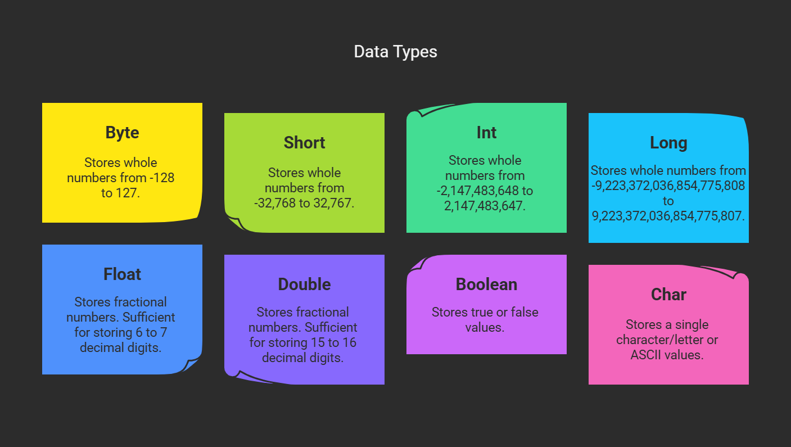
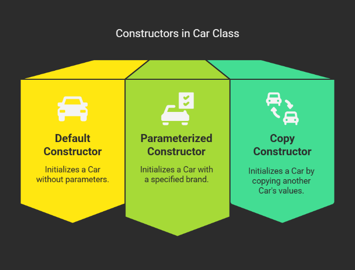
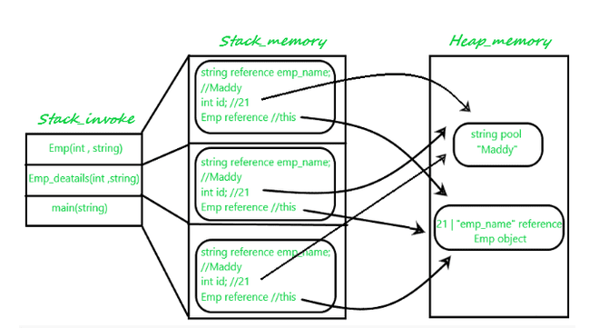
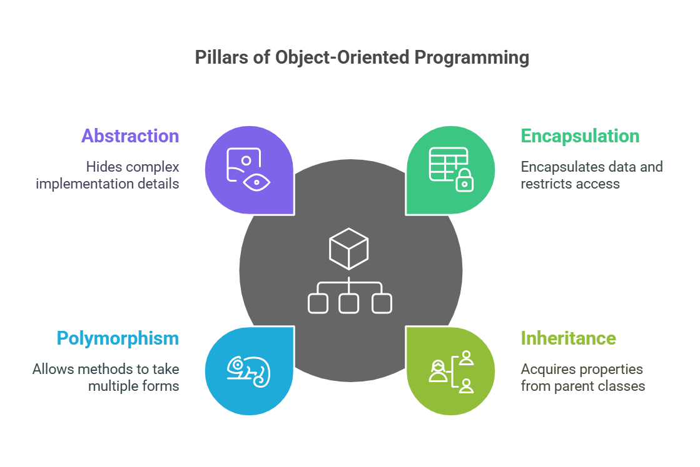

# 🧠 Basics of Class and Object

### 💻 Is Java Platform Independent? If yes, how?

Yes! When we execute Java code, the **compiler** converts it into **bytecode**.  
This bytecode is **platform independent**, meaning it can run on any system that has a **JVM (Java Virtual Machine)** installed.

> 🔹 **Key Point:** Bytecode runs on JVM, not directly on the OS — that’s what makes Java platform independent.

---

### 🌟 Top Java Features

| Feature                  | Description                                                  |
| :----------------------- | :----------------------------------------------------------- |
| **Simple**               | Easy to learn and use                                        |
| **Platform Independent** | Same code can run on any machine having JVM                  |
| **Object-Oriented**      | Supports OOPs concepts like Class, Object, Inheritance, Polymorphism |
| **Secure**               | Provides runtime security and bytecode verification          |
| **Robust**               | Strong memory management and exception handling              |
| **Garbage Collection**   | Automatic memory cleanup                                     |
| **Multithreading**       | Allows concurrent execution of multiple threads              |
| **High Performance**     | Uses JIT (Just-In-Time) compiler for optimized execution     |

---

### ⚙️ What is JVM?

- **JVM** stands for **Java Virtual Machine**.  
- It is responsible for converting **bytecode** into **machine code**.  
- When a Java program is compiled, the **compiler** creates a `.class` file containing bytecode.  
- The **JVM** interprets this bytecode and executes it on the underlying machine.

> 🧩 JVM = Bridge between Java bytecode and your computer hardware.

---

### 🚀 What is JIT?

- **JIT** stands for **Just-In-Time Compiler**.  
- It is a part of **JVM** that improves performance by compiling bytecode into **native machine code** at runtime.  
- This reduces interpretation overhead and makes Java programs run faster.

---


## 📦 What is a Class Loader?

- It is a part of **JRE** which **loads classes and interfaces dynamically** into the **JVM** at runtime.  
- It helps in loading bytecode when required, ensuring memory efficiency.

---

## 🔁 Difference Between JVM, JRE, and JDK

| Component | Description |
|------------|--------------|
| **JDK (Java Development Kit)** | A complete software development kit used to **develop, compile, and run** Java applications. It includes JRE + development tools (compiler, debugger, etc.). |
| **JRE (Java Runtime Environment)** | Provides the **libraries, class files, and JVM** necessary to **run** Java applications. |
| **JVM (Java Virtual Machine)** | Converts **bytecode** into **machine code** and executes it. It is platform dependent but provides platform independence to Java code. |


---

## 🆚 Differences Between Java and C++

| **Basis** | **C++** | **Java** |
|------------|----------|-----------|
| **Platform** | Platform Dependent | Platform Independent |
| **Application Type** | Mainly used for **System Programming** | Mainly used for **Application Programming** |
| **Hardware Interaction** | Closer to hardware | Less interactive with hardware |
| **Global Scope** | Supports **global and namespace scope** | Does **not support** global scope |
| **Feature Support** | Supports **goto, pointers, call by reference** (not in Java) | Supports **threads, documentation comments** (not in C++) |

---

> 🧠 **Summary:**  
> - Java simplifies development by managing memory and platform differences internally.  
> - C++ offers more hardware control but requires manual memory management.

### What will happen if we declare don't declare the main as static?

- We can declare the main method without using static and without
  getting any errors. But, the main method will not be treated as the
  entry point to the application or the program.

### What is the Wrapper class in Java ?

- Wrapper, in general, is referred to a larger entity that encapsulates a smaller entity. Here in Java, the wrapper class is an object class that encapsulates the primitive data types.

- The primitive data types are the ones from which further data types could be created. For example, integers can further lead to the construction of long, byte, short, etc. On the other hand, the string cannot, hence it is not primitive.

- Getting back to the wrapper class, Java contains 8 wrapper classes. They are Boolean, Byte, Short, Integer, Character, Long, Float, and Double. Further, custom wrapper classes can also be created in Java which is similar to the concept of Structure in the C programming language. We create our own wrapper class with the required data types.

### Why do we need wrapper classes?

- The wrapper class is an object class that encapsulates the primitive data types, and we need them for the following reasons:
- Wrapper classes are final and immutable
- Provides methods like valueOf(), parseInt(), etc.
- It provides the feature of autoboxing and unboxing.

### What is a class?

- A class is a blueprint/template for creating objects. It defines
  attributes (fields/variables) and behaviours (methods).

> **Example:**
```java
public class Home{
	public static void main(String args[]){
		System.out.println("hello");
	}
}
```


{width="7.268055555555556in"
height="4.107638888888889in"}

### What is an object?

- An object is an instance of a class. It has state (values of fields)
  and behavior (methods it can perform).

**Example:**

```java
public class Main {
    public static void main (String [] args) {
        my Car = new Car(); //Creating an object
        myCar.brand = "Tesla";
        myCar.speed = 100;
        myCar.display();
    }
}
```


### How do you create an object ?

- [Using **new** keyword] 

> ```java
> Car myCar = new Car();
> ```
>
> 

- Using reflection (Class.forName()):

> ```java
> Car obj = (Car) Class.forName("Car").newInstance();
> ```

- Using clone method (clone()):

> ```java
> Car car2 = (Car) car1.clone();
> ```

- Using deserialization (ObjectInputStream):

> ```java
> ObjectInputStream in = new ObjectInputStream(new
> FileInputStream(\"file.dat\"));Car = (Car) in.readObject();
> ```
>
> 

**What is the difference between a class and an object?**


| Feature    | Class                | Object                |
| ---------- | -------------------- | --------------------- |
| Definition | Blueprint for object | Instance of class     |
| Memory     | No Memory            | Memory is allocated   |
| Example    | Car class            | Car carObj=new Car(); |

--------------------------------------------------


# Constructors

###  What is a constructor?

- A constructor is a special method used to initialize objects.

**Example:**

```java
class Car {

    String brand;

    Car(String b) { // Constructor

        brand = b;

    }

}
```


### What are the types of constructors ?

- **Default Constructor (No parameters)**

> ```java
> class Car {
> 
> Car( { System.out.println("Car created!");
> }
> 
> }
> ```
>
> 

- **Parameterized Constructor (Takes parameters)**

> ```java
> Car(String brand) { this.brand = brand; }
> ```
>
> 

- **Copy Constructor (Copies values from another object)**

```java
Car(Car c) { this.brand = c.brand; }
```

{width="3.208581583552056in"
height="2.438779527559055in"}

### What happens if a class doesn't have a constructor?

- JVM provides a default constructor automatically.

### Can a constructor be private?

- Yes, it is used in the Singleton pattern:

**Example :**

```java
public class Singleton {
    private static Singleton instance;
    private Singleton() {
    }
    public static Singleton getInstance() {
        if (instance == null) {
            instance = new Singleton();
        }
        return instance;
    }
    public static void main(String[] args) {
        Singleton sig=new Singleton();
        getInstance();

    }

}
```

---


### How do you design an immutable class in Java? What rules should you follow?

An **immutable class** is a class whose objects cannot be modified once created.

To design an immutable class in Java, follow these rules :

1.  **Declare the class as final** → So it cannot be subclassed.

2.  **Make all fields private and final** → So fields cannot be changed after initialization.
    
3.  **Don't provide setters** → No method should modify fields.

4.  **Initialize all fields in the constructor** → Assign values only once.
    
5.  **Perform deep copy for mutable objects** → Prevent external modification.
    
6.  **Return copies instead of references** in getter methods if fields are mutable.

##### **Classic Immutable Class**

```java
public final class Immutable {

    private final String name;

    private final int id;

    public Immutable(String name, int id) {

        super();

        this.name = name;

        this.id = id;

    }

    public String getName() {

        return name;

    }

    public int getId() {

        return id;

    }

}
```


✅ No setters,
✅ Fields are private final,
✅ Class is final,
➡️ Hence, **Immutable**

**Modern Approach (Using record in Java 16+)**

```java
public record Immutable (int id,String name) {

}
```

📘 record automatically makes the class:

- final

- Fields are private final

- No setters generated
  ➡️ **Immutable by default**

**✅ Key Benefits**

- Thread-safe by default (no synchronization needed)

- Easy to debug and test

- Ideal for DTOs and response objects in microservices

# Methods & Object Behavior

### What is the difference between a method and a constructor?

| **Feature**     | **Constructor**                                | **Method**                        |
| --------------- | ---------------------------------------------- | --------------------------------- |
| **Purpose**     | Initializes an object                          | Defines the behavior of an object |
| **Name**        | Same as class name                             | Any valid method name             |
| **Return Type** | No return type (not even `void`)               | Can have a return type            |
| **Call**        | Called automatically when an object is created | Called explicitly                 |

​               

## What is this keyword?

- this refers to the current object.

- Used to differentiate instance variables from local variables.

Example : 

```java
class Car {
    String brand;
    Car(String brand) {
        this.brand = brand; // `this` differentiates instance and local variable
    }
}
```


##  What is static keyword ?

- Static members belong to the class, not instances.

- **Example:**

```java
class Car {

static int totalCars = 0; // Shared among all objects

Car() { totalCars++; }

}
```


- Static methods can be called without an object:

```java
Car.totalCars;    // No object needed
```

---


### **What are Access modifiers ?**

Access modifiers in Java control the visibility of classes, methods, and variables. 

There are four types: 

- **Public**: Accessible from any class, anywhere.

- **Protected**: Accessible within the same package and by subclasses in other packages.
  
- **Default (package-private)**: Accessible only within the same package.
  
- **Private**: Accessible only within the same class.


# **String**

### What is a String in Java?

- String is the sequence of the characters.

- It is an object of String class.

### What is Java String Pool?

A Java String Pool is a place in heap memory where all the strings defined in the program are stored. JVM checks for the presence of the object in the String pool, If String is available in the pool, the same object reference is shared with the variable, else a new object is created.

## Java Stack vs Heap Memory Allocation

- Memory allocation divided into two types stack and pool memory

- Stack Memory : stores the variable , methods and reference data during
  execution

- Heap memory : stores the objects and strings are stored

- The below diagram illustrates how method calls and local variables are
  stored in the stack memory, while objects and string literals are
  stored in the heap memory.

{width="5.386582458442694in"
height="2.9434251968503937in"}

## Why is String immutable?

- Strings are immutable for security, performance, and thread safety reasons. It prevents unwanted changes and helps optimize memory usage.
  
- Immutable means we cannot make changes once declared.

- Security : all the credentials and confidential data like username, passwords are stored in String if its is mutable then these parameters can be easily changed by attackers.
  
- JVM reuses the strings that help to save memory.

- Thread safe -- as String is immutable multiple threads can access it at a time.

## StringBuilder vs StringBuffer vs String

- String Buffer and StringBuilder are the classes of java used to create immutable strings.
  
  | Feature      | String | StringBuilder | StringBuffer              |
  | ------------ | ------ | ------------- | ------------------------- |
  | Mutable?     | No     | Yes           | Yes                       |
  | Thread-safe? | Yes    | No            | Yes (Synchronized)        |
  | Performance  | slow   | Fast          | Slower than StringBuilder |

  

## What is String interning?

- String.intern() moves a string to the String Pool if it isn\'t already there.

- **Example:**

```java
String s1 = new String("Java"); // Creates a new String object in the heap memory

String s2 = s1.intern(); // Moves "Java" to the String Pool (orreturns the reference if already present)

String s3 = "Java"; // Already exists in the String Pool

System.out.println(s2 == s3); // true (both refer to the same
object in the String Pool)
```

**What is the String Pool in Java?**

- String pool is a special memory in heap memory where Java stores **string literals** to optimize memory usage.

**String Methods :**

1.  **Length() --** Return length of String

2.  **charAt(index)-** Return char for given index

3.  **substring() --** Extract some part of String

4.  **equals() --** Compare two string content

5.  **equalsIgnoreCase() --** Compare two string with ignoring case of
    String

6.  **contains ()** -- check the string contains given char sequence

7.  **toUpperCase() , toLowerCase()** - convert String case

8.  **replace() , replaceAll() --** replace part of String

9.  **split() --** split string into array

10. **indexOf() , lastIndexOf()** -- return index of char in string

11. **startWith() , endWith()** -- check beginning of ending of string

12. **trim()** -- remove whitespaces from string

13. **isEmpty() , isBlank()** -- check blank or empty string

14. **valueOf()** -- convert other data type into string

15. **matches()** -- check if string matched the given regex

```java
public class StringMethods {

    public static void main(String[] args) {

    String name="Narsing";

    String fname="narsing";

    String sentence=" abc1def2ghi3a ";

    String reg="\\\\d";

    String test=" ";

    System.out.println("Length of String :"+ name.length());

    System.out.println("Get charector at index : "+ name.charAt(0));

    System.out.println("Get part of String from start index:"+name.substring(3));

    System.out.println("Substring of start and end index:"+name.substring(0, 3));

    System.out.println("Compare Two Strings :"+name.equals(fname));

    System.out.println("Compare Two Strings with igonring case:"+ name.equalsIgnoreCase(fname));

    System.out.println("Check char present or not in string : "+name.contains("Nar"));

    System.out.println("Change case of String "+name.toLowerCase());

    System.out.println("Change case of String "+name.toUpperCase());

    System.out.println("Replace string char"+name.replace("N", "P"));

    System.out.println("Replace All in string :"+sentence.replaceAll("1", "#"));

    System.out.println("Start with string:" +name.startsWith("N"));

    System.out.println("Start with string:" +name.endsWith("g"));

    System.out.println("first Index of String:"+sentence.indexOf("a"));

    System.out.println("Last Index of String:"+sentence.lastIndexOf("a"));

    System.out.println("Trim string:"+sentence.trim());

    System.out.println("Check empty String:"+test.isEmpty());

    System.out.println("Check empty String:"+test.isBlank());

    System.out.println("Matches to regex:"+sentence.matches(reg));

    String arr[]=sentence.split(reg);

    for(String s:arr) {

    System.err.println(s);

}}}
```

**Output:**

> //Compare Two Strings with [igonring]  case :true
>
> //Check char present or not in string : true
>
> //Change case of String narsing
>
> //Change case of String NARSING
>
> //Replace string charParsing
>
> //Replace All in string : abc
>
> //Start with string:true
>
> //Start with string:true
>
> //first Index of String:1
>
> //Last Index of String:13
>
> //Trim string:abc1def2ghi3a
>
> //Check empty String:false
>
> //Check empty String:true
>
> //Matches to [regex] :false
>
> //abc
>
> //def
>
> //ghi
>
> //a
>


# Object-Oriented Concepts

## What is encapsulation in Java

- Encapsulation = data hiding + data protection.

- **Example:**

```java
class BankAccount {

private double balance; // Private field

public double getBalance() { 
    return balance; 
} // Controlled access
}
```


## What is the difference between an instance variable and a local variable?

| Feature | Instance Variable             | Local Variable               |
| ------- | ----------------------------- | ---------------------------- |
| Scope   | Exists throughout object life | Exists within a method/block |
| Storage | Stored in heap memory         | Stored in stack memory       |
| Default | Gets default value            | No default value             |
| Value   | null                          | 0                            |


## How are objects stored in memory?

- Heap Memory: Objects are stored here.

- Stack Memory: Stores local variables & references.

## What is garbage collection ?

- Garbage collector automatically find and removes unused objects from heap memory to free up the space.
  
- **System.gc();** requests garbage collection.

- **Serial GC :** single threaded, good for small application

- **Paralle GC :** multi-threaded , good for big application

## What is finalize ()?

- It is a method which is called before object is removed in GC.

## How can you make an object eligible for garbage collection?

- **Set reference to null:**

```java
Car myCar = new Car();

myCar = null; // Eligible for GC
```


- **Reassign reference:**

```java
Car car1 = new Car();

Car car2 = new Car();

car1 = car2; // Old `car1` object is eligible for GC
```


- **Use anonymous objects:**

```java
new Car(); // This object has no reference, so it will be GC
```


###  What is the difference between shallow copy and deep copy?

| **Feature**    | **Shallow Copy**                      | **Deep Copy**                       |
| -------------- | ------------------------------------- | ----------------------------------- |
| **Definition** | Copies reference, not the actual data | Copies the entire object            |
| **Example**    | `clone()` method (default behavior)   | Custom implementation (manual copy) |

**Example:** 

```java
Car car1 = new Car(); // Shallow Copy – both references point to the same object
Car car2 = car1; // Deep Copy – creates a new object with copied data
Car car2 = new Car(car1);
```

### What is the difference between == and .equals() in objects?

- == checks reference equality (same memory address).
- .equals() checks weather both strings have same characters.

```java
String s1 = new String("Narsing");
String s2 = new String("Narsing");

System.out.println(s1 == s2);       // false → compares memory addresses
System.out.println(s1.equals(s2));  // true  → compares con
```

### Can we override a static method?

- ❌ **No**, static methods belong to the class, not instances.  
- When a subclass defines a static method with the same signature, it **hides** the parent method — it does **not override** it.

**🧠 Example**

```java
class Parent {
    static void display() {
        System.out.println("Parent");
    }
}

class Child extends Parent {
    static void display() {
        System.out.println("Child"); // Not overriding, but hiding
    }
}

public class Test {
    public static void main(String[] args) {
        Parent p = new Child();
        p.display(); // Output: Parent
    }
}
```


---

### Usage of this keyword

The `this` keyword refers to the current instance of the class. It is used to differentiate between instance variables and local variables, call constructors, and return the current object.

---

#### 1. Referring to Instance Variables

When local variables and instance variables have the same name, use `this` to distinguish between them.

```java
public class Car {

    public String name = "Maruti";

    public void startEngine(String name) {
        System.out.println("Car engine started - " + this.name); // refer instance variable
    }

    public static void main(String[] args) {
        Car car = new Car();
        car.startEngine("Honda"); // output is "Car engine started - Maruti"
    }
}
```

#### 2. Calling Other Constructors:

The this keyword can be used to call another constructor from within the same class. The this() constructor call is used to invoke another constructor in the same class.

```java
public class Car {

    private String model;

    private int year;

    public Car() {

        this("Unknown", 0); // Calls the parameterized constructor

    }

    public Car(String model, int year) {

        this.model = model;

        this.year = year;

    }}
```


#### 3. Returning the Current Object:

The this keyword can be used to return the current object from a method, often used in method chaining.

```java
public class Builder {
    private String name;
    public Builder setName(String name) {
        this.name = name;
        return this; // Returns the current object
    }
    public Builder build() {
        // Additional build logic
        return this; // Returns the current object
    }
}
```


#### 4. Passing the Current Object as a Parameter:

The this keyword can be used to pass the current object as a parameter
to another method or constructor.

```java
public class Example {

    public void display() {
        show(this); // Passes the current object to the show() method
    }
    public void show(Example obj) {
        System.out.println("Object reference: " + obj);
    }
}
```

STATIC KEYWORD

The static keyword is used to define class-level members (variables,
methods, blocks, and nested classes). Static members belong to the class
rather than individual objects.

**Features of static**

1.  Shared among all objects (No separate copies).

2.  Memory is allocated once in the class (not per object).

3.  Can be accessed without creating an object.

4.  Cannot use this inside a static method.

- **static Variables :** Static variables are shared among all instances
  and can be accessed without referring class object.

- **Static Methods:** They belong to class and can be called without
  creating an instance of the class.

- **Static Blocks:** Static blocks are used for static initialization of
  a class. This block is executed when the class is loaded.

```java
public class Example {
    static {
        System.out.println("Static block executed");
    }
    public static void main(String[] args) {
        System.out.println("Main method executed");
    }
}
```


# Comparison: this vs static

| Feature            | this                         | static                                    |
| ------------------ | ---------------------------- | ----------------------------------------- |
| meaning            | refers to the current object | Belong to class                           |
| usage              | inside instance method       | Variables , methods, blocks ,nested class |
| Object dependency  | requires an object           | Does not required an object               |
| Access to Instance | Yes                          | No                                        |
| Access to Static   | Yes                          | Yes                                       |

**Key Takeaways**

- this is used to reference the current object.

- static is used to define class-level properties that do not depend on object instances.
  
- Static methods cannot access instance variables because they belong to the class, not an object.
  
- this() can be used to call another constructor in the same class.

- Static blocks execute when the class is loaded.

------

#  OOPs (Object-Oriented Programming) 

Object-Oriented Programming (OOP) principles, which include Encapsulation, Inheritance, Polymorphism, and Abstraction.

### What are the four main principles of OOP?

The four pillars of Object-Oriented Programming (OOP) in are:

- **Encapsulation** → Data hiding (using private fields &
  getters/setters).

- **Inheritance** → One class acquires properties of another.

- **Polymorphism** → Many forms (method overloading & overriding).

- **Abstraction** → Hiding implementation details from users.

{width="4.873470034995625in"
height="3.25in"}

## What is the difference between an Object and a Class?

--------------------------------------------------------
  Feature      Class                   Object
------------ ----------------------- -------------------
  Definition   Blueprint for creating  Instance of a class
               objects                 

  Memory       No memory allocated     Memory is allocated

  Example      Car class               Car myCar = new Car();
## What is Encapsulation ?

- Binding or Wrapping data and code into a single unit is called Encapsulation. For example, an **ATM Machine** allows users to perform operations like cash withdrawal and money transfer without knowing the internal workings
- Achieved using private variables + public getter/setter methods.
- **Example:**

```java
class BankAccount {
    private double balance;
    public void setBalance(double balance) {
        this.balance = balance; // Setter method
    }
    public double getBalance() {
        return balance; // Getter method
    }
}

public class Main {
    public static void main(String[] args) {
        BankAccount account = new BankAccount();
        account.setBalance(1000);
        System.out.println("Balance: " + account.getBalance()); //
        Output: Balance: 1000
    }
}
```


- **Benefits:** Data security, easy modification, and better
  maintainability.

### **What is Inheritance in Java**

- Inheritance means creating a child class from parent class where child
  class acquires all the properties of parent class.

- Extends keyword is used to inherit parent class.

- This will help for code reusability.

Example of Single Inheritance:

```java
class Vehicle {

void start() { System.out.println("Vehicle is starting..."); }

}

class Car extends Vehicle {

void honk() { System.out.println("Car is honking..."); }

}

public class Main  {

public static void main(String[] args) {

Car myCar = new Car();

myCar.start(); // Inherited method

myCar.honk();

}

[}] 
```

**Output:**

> //Vehicle  is starting\...
>
> //Car is honking\...

### What are the Types of Inheritance?

Java supports different types of inheritance, except **multiple inheritance** (to avoid ambiguity).  

---

| Type                         | Description                                                  |
| ---------------------------- | ------------------------------------------------------------ |
| **Single**                   | One class inherits another. `class B extends A`              |
| **Multilevel**               | `A → B → C` (A is parent of B, B is parent of C)             |
| **Hierarchical**             | One parent, multiple child classes.`A → B`, `A → C`          |
| **Multiple (Not Supported)** | Java does **not** support multiple inheritance with classes to avoid ambiguity (confusion). Can be achieved using **interfaces**. |

---

## Why Java Does Not Support Multiple Inheritance?

- To **avoid ambiguity** caused by multiple parent classes having methods with the same name.

---

### 💡 Example: Diamond Problem

```java
class A {
    void show() {
        System.out.println("Class A");
    }
}

class B extends A {
    void show() {
        System.out.println("Class B");
    }
}

class C extends A {
    void show() {
        System.out.println("Class C");
    }
}

// Class D cannot extend both B and C to avoid ambiguity
```

## What is Polymorphism?

- **Polymorphism** means "many forms".  
- It allows the **same method, variable, or object** to perform different operations under different conditions.

### 🔹 Types of Polymorphism
- **Compile-time Polymorphism (Method Overloading)**
- **Runtime Polymorphism (Method Overriding)**

---

## What is Method Overloading?

- When multiple methods have the **same name** but **different parameters** (type or number of arguments).  
- It is an example of **compile-time polymorphism**.

### 🧠 Example

```java
class MathOperations {

    int add(int a, int b) {
        return a + b;
    }

    double add(double a, double b) { // Overloaded method
        return a + b;
    }
}

public class Main {
    public static void main(String[] args) {
        MathOperations obj = new MathOperations();

        System.out.println(obj.add(5, 10));      // Calls int version
        System.out.println(obj.add(5.5, 10.5));  // Calls double version
    }
}
```


## What is Method Overriding?

When the same method (same name, parameters, and return type) is present in both parent and child classes,  
and the method in the child class overrides the one in the parent class.

It is an example of **runtime polymorphism**.

---

### 🧠 Example

```java
class Parent {
    void display() {
        System.out.println("Parent class");
    }
}

class Child extends Parent {
    @Override
    void display() {
        System.out.println("Child class");
    }
}

public class Main {
    public static void main(String[] args) {
        Parent obj = new Child();
        obj.display(); // Calls overridden method in Child class
    }
}
```


## What is Abstraction?

Abstraction is the process of **hiding implementation details** and showing only the **essential features** of an object.  
It helps reduce complexity by focusing on what an object does rather than how it does it.

In Java, abstraction is mainly achieved using:
- **Abstract classes**
- **Interfaces**

It allows developers to define a common structure for related objects and enforce a contract that subclasses or implementing classes must follow.

---

## What is an Abstract Class?

An **abstract class** in Java is declared using the `abstract` keyword.  
It is a special kind of class that cannot be instantiated directly — meaning you **cannot create an object** of an abstract class.

An abstract class may contain:
- **Abstract methods:** Methods without implementation (no method body).  
- **Concrete methods:** Regular methods with a complete implementation.

Abstract classes are useful when you want to provide **partial implementation** and let subclasses complete the rest.

---

### 🧠 Example: Abstract Class

```java
abstract class Animal {
    abstract void makeSound(); // Abstract method

    void sleep() { // Concrete method
        System.out.println("Sleeping...");
    }
}

class Dog extends Animal {
    void makeSound() {
        System.out.println("Bark");
    }
}

public class Main {
    public static void main(String[] args) {
        Animal obj = new Dog();
        obj.makeSound(); // Calls Dog's implementation
        obj.sleep();     // Inherited method from Animal
    }
}
```

## What is an Interface in Java?

An **interface** in Java is a special type of class that contains only **abstract methods** (methods without a body).  
It is used to achieve **100% abstraction** and **multiple inheritance** in Java.

Interfaces define a **contract** that implementing classes must follow.  
A class that implements an interface must provide implementations for all of its abstract methods.

---

### 🧠 Key Features of an Interface

- All methods in an interface are **public** and **abstract** by default.  
- All variables are **public**, **static**, and **final** (constants).  
- A class can **implement multiple interfaces** (supports multiple inheritance).  
- Interfaces cannot have constructors because they cannot be instantiated.  
- From **Java 8**, interfaces can have:
  - **Default methods** (with body)
  - **Static methods**
- From **Java 9**, interfaces can also have **private methods**.

---

### 🧩 Example: Interface in Java

```java
interface Animal {
    void makeSound(); // Abstract method (no body)
}

class Dog implements Animal {
    public void makeSound() {
        System.out.println("Bark");
    }
}

public class Main {
    public static void main(String[] args) {
        Animal obj = new Dog();
        obj.makeSound();
    }
}
```

## What is the Difference Between Abstract Class and Interface?

Both **Abstract Classes** and **Interfaces** are used to achieve **abstraction** in Java,  
but they differ in structure, purpose, and how they are implemented.

---

### 🧩 Comparison Table

| **Feature**                   | **Abstract Class**                                           | **Interface**                                                |
| ----------------------------- | ------------------------------------------------------------ | ------------------------------------------------------------ |
| **Definition**                | Can have both abstract and concrete methods.                 | Contains only abstract methods (until Java 8).               |
| **Keyword Used**              | `abstract`                                                   | `interface`                                                  |
| **Object Creation**           | Cannot be instantiated directly.                             | Cannot be instantiated directly.                             |
| **Methods**                   | Can contain abstract and concrete methods.                   | Contains only abstract methods (before Java 8); from Java 8 onward, can have default and static methods. |
| **Variables**                 | Can have instance variables.                                 | Only `public static final` variables (constants).            |
| **Access Modifiers**          | Can have `public`, `protected`, or `private` methods.        | All methods are `public` by default.                         |
| **Constructors**              | Can have constructors.                                       | Cannot have constructors.                                    |
| **Multiple Inheritance**      | Not supported (a class can extend only one abstract class).  | Supported (a class can implement multiple interfaces).       |
| **Implementation Keyword**    | A class extends an abstract class.                           | A class implements an interface.                             |
| **Usage**                     | Used when classes share common behavior but differ in implementation. | Used to define a common contract for unrelated classes.      |
| **Java Version Enhancements** | No major changes.                                            | Since Java 8 – default and static methods added; since Java 9 – private methods allowed. |

---

### 🧠 Key Points

- **Abstract Classes** are best used when you want to provide a **base class** with partial implementation that subclasses can extend.
- **Interfaces** are ideal for defining a **contract** or **capability** that multiple unrelated classes can implement.
- Java supports **multiple interfaces** for a single class, enabling **multiple inheritance** of behavior.

---

### 🧠 Real-World Example

- **Abstract Class Example:**  
  A `Vehicle` abstract class can define shared attributes like `speed` and `fuelType`,  
  and abstract methods like `start()` or `stop()`.  
  Subclasses (`Car`, `Bike`) implement these methods differently.

- **Interface Example:**  
  An interface `Flyable` can be implemented by multiple classes like `Bird`, `Helicopter`, or `Airplane`,  
  regardless of their hierarchy — representing shared ability to fly.

---

### ✅ Summary

- **Abstract Class →** Partial abstraction, shared logic, single inheritance.  
- **Interface →** Full abstraction, behavior contracts, multiple inheritance.  
- Together, they form the backbone of **object-oriented design** in Java.

---


# 🧱 Collection Framework

### 💡 What is the Collection Framework?

The **Collection Framework** in Java is a **unified architecture** that provides **ready-made data structures** and **algorithms** to store, retrieve, and manipulate groups of objects efficiently.

It is part of the **`java.util` package** and helps developers avoid writing custom data structures like arrays, linked lists, or hash tables from scratch.

---

### 🧠 Definition

> The **Collection Framework** is a set of **classes and interfaces** that implement commonly reusable collection data structures such as **List**, **Set**, **Queue**, and **Map**.

---

### ⚙️ Key Features

- Provides **predefined data structures** for storing objects.
- Supports **searching, sorting, insertion, deletion, and iteration**.
- Ensures **type safety** using **Generics**.
- Improves **performance** and **code reusability**.
- Introduces **interfaces** and **concrete classes** for flexible use.

---

### 🧩 Key Interfaces in the Collection Framework

| **Interface** | **Description**                                              |
| ------------- | ------------------------------------------------------------ |
| **List**      | Ordered collection that allows duplicate elements. Example: `ArrayList`, `LinkedList`. |
| **Set**       | Unordered collection that does **not allow duplicates**. Example: `HashSet`, `LinkedHashSet`, `TreeSet`. |
| **Queue**     | Follows **FIFO (First-In-First-Out)** order. Example: `PriorityQueue`, `LinkedList`. |
| **Map**       | Stores elements in **key–value pairs** where keys are unique. Example: `HashMap`, `LinkedHashMap`, `TreeMap`. |

---

### 🧰 Package Location

> All collection classes and interfaces are part of **`java.util`** package.

---

### 🧾 Example

```java
import java.util.*;

public class CollectionExample {
    public static void main(String[] args) {
        List<String> names = new ArrayList<>();
        names.add("Java");
        names.add("Spring");
        names.add("Hibernate");

        System.out.println("List Elements: " + names);
    }
}
```

### What is the difference between Collection and Collections in Java?

- **Collection**: It is the root interface of all collections in Java.  
  It provides methods for adding, removing, and checking the size of a collection.

- **Collections**: It is a utility class that provides static methods to  
  manipulate and process collections.

---

| Feature        | Collection (Interface)                           | Collections (Class)                                          |
| -------------- | ------------------------------------------------ | ------------------------------------------------------------ |
| **Definition** | Root interface of the Collection framework       | Utility class with static methods                            |
| **Usage**      | Represents data structures like List, Set, Queue | Provides methods like `sort()`, `reverse()`, `shuffle()`     |
| **Example**    | `List<String> list = new ArrayList<>();`         | `Collections.sort(list);`                                    |
| **Methods**    | `add()`, `remove()`, `size()`, `contains()`      | `sort()`, `reverse()`, `shuffle()`, `min()`, `max()`, `synchronizedList()` |

### What is the difference between List, Set, and Map?

---

| Feature             | List                      | Set                                                  | Map                                      |
| ------------------- | ------------------------- | ---------------------------------------------------- | ---------------------------------------- |
| **Order**           | Maintains insertion order | No order guaranteed (except some like LinkedHashSet) | Keys are unique, values can be duplicate |
| **Duplicates**      | Allows duplicates         | Does not allow duplicates                            | Keys are unique, values can repeat       |
| **Implementations** | ArrayList, LinkedList     | HashSet, LinkedHashSet, TreeSet                      | HashMap, LinkedHashMap, TreeMap          |

---

✅ **Example of List, Set, and Map:**

```java
import java.util.*;

public class CollectionExample {
    public static void main(String[] args) {
        List<String> list = new ArrayList<>(Arrays.asList("A", "B", "A"));
        Set<String> set = new HashSet<>(Arrays.asList("A", "B", "A"));
        Map<Integer, String> map = new HashMap<>();

        map.put(1, "Java");
        map.put(2, "Python");

        System.out.println(list); // Output: [A, B, A]
        System.out.println(set);  // Output: [A, B]
        System.out.println(map);  // Output: {1=Java, 2=Python}
    }
}
```

### What are the differences between ArrayList and LinkedList

| Feature            | ArrayList                                   | LinkedList                    |
| ------------------ | ------------------------------------------- | ----------------------------- |
| **Data Structure** | Dynamic Array                               | Doubly Linked List            |
| **Access Speed**   | Fast (O(1))                                 | Slow (O(n))                   |
| **Insert/Delete**  | Slow (O(n))                                 | Fast (O(1))                   |
| **Memory Usage**   | Less (stores elements in contiguous memory) | More (extra memory for links) |

---

✅ **When to Use?**

- Use **ArrayList** when **frequent access** is needed.  
- Use **LinkedList** when **frequent insertions/deletions** are needed.

---

### What is the difference between HashSet, LinkedHashSet, and TreeSet?

| Feature         | HashSet         | LinkedHashSet             | TreeSet                  |
| --------------- | --------------- | ------------------------- | ------------------------ |
| **Order**       | Unordered       | Maintains insertion order | Sorted (Ascending order) |
| **Performance** | Fastest (O(1))  | Slightly slower           | Slowest (O(log n))       |
| **Null Values** | Allows one null | Allows one null           | Does not allow null      |

---

### 🧠 Example

```java
import java.util.*;

public class SetExamples {
    public static void main(String[] args) {

        // HashSet: stores unordered and unique elements
        Set<String> hashSet = new HashSet<>(Arrays.asList("P", "A", "C", "D", "E", "E"));
        System.out.println(hashSet); // Output: [P, A, C, D, E] (No order)

        // LinkedHashSet: maintains insertion order and unique elements
        Set<String> linkedHashSet = new LinkedHashSet<>(Arrays.asList("P", "A", "C", "D", "E", "E"));
        System.out.println(linkedHashSet); // Output: [P, A, C, D, E] (Insertion order)

        // TreeSet: stores sorted and unique elements
        Set<String> treeSet = new TreeSet<>(Arrays.asList("P", "A", "C", "D", "E", "E"));
        System.out.println(treeSet); // Output: [A, C, D, E, P] (Sorted)
    }
}
```

### What is the difference between HashMap, LinkedHashMap, and TreeMap?

| Feature         | HashMap             | LinkedHashMap             | TreeMap                  |
| --------------- | ------------------- | ------------------------- | ------------------------ |
| **Order**       | Unordered           | Maintains insertion order | Sorted by keys           |
| **Performance** | Fastest (O(1))      | Slightly slower           | Slowest (O(log n))       |
| **Null Keys**   | Allows one null key | Allows one null key       | Does not allow null keys |

---

### 🧠 Example

```java
import java.util.*;

public class MapExample {
    public static void main(String[] args) {

        // HashMap - Unordered
        Map<Integer, String> hashMap = new HashMap<>();
        hashMap.put(2, "B");
        hashMap.put(1, "A");
        hashMap.put(3, "C");

        // LinkedHashMap - Maintains insertion order
        Map<Integer, String> linkedHashMap = new LinkedHashMap<>(hashMap);

        // TreeMap - Sorted by keys
        Map<Integer, String> treeMap = new TreeMap<>(hashMap);

        System.out.println(hashMap);         // Output: {1=A, 2=B, 3=C} (Unordered)
        System.out.println(linkedHashMap);   // Output: {2=B, 1=A, 3=C} (Insertion order)
        System.out.println(treeMap);         // Output: {1=A, 2=B, 3=C} (Sorted order)
    }
}
```

### What is the difference between Vector and ArrayList?

| Feature             | ArrayList                      | Vector                     |
| ------------------- | ------------------------------ | -------------------------- |
| **Synchronization** | Not synchronized               | Synchronized (Thread-safe) |
| **Performance**     | Faster                         | Slower                     |
| **Legacy?**         | Modern (introduced in JDK 1.2) | Legacy (Before JDK 1.2)    |

---

✅ **Key Point:**  
Use **ArrayList** unless **thread safety** is specifically required.

---

### What is ConcurrentHashMap and how is it different from HashMap?

| Feature           | HashMap                | ConcurrentHashMap                   |
| ----------------- | ---------------------- | ----------------------------------- |
| **Thread Safety** | Not thread-safe        | Thread-safe (better than Hashtable) |
| **Performance**   | Fast (Single-threaded) | Fast (Multi-threaded)               |
| **Allows null?**  | Yes (keys & values)    | No null keys or values              |

---

✅ **Use `ConcurrentHashMap`** for **multi-threaded applications** to avoid synchronization issues that occur with `HashMap`.

---

### What is the difference between Fail-Fast and Fail-Safe Iterators?

| Feature      | Fail-Fast                                                    | Fail-Safe                                                   |
| ------------ | ------------------------------------------------------------ | ----------------------------------------------------------- |
| **Behavior** | Throws `ConcurrentModificationException` if modified while iterating | Does **not** throw exception when modified during iteration |
| **Example**  | `ArrayList`, `HashMap`                                       | `ConcurrentHashMap`, `CopyOnWriteArrayList`                 |

---

✅ **Fail-Fast** iterators work directly on the collection and fail immediately on structural modification.  
✅ **Fail-Safe** iterators operate on a **clone** of the collection, allowing modification without exceptions.

---

### How do you sort a List in Java?

- **Using Collections.sort()**

```java
List<Integer> numbers = Arrays.asList(4, 2, 8, 5);

Collections.sort(numbers);

System.out.println(numbers); // Output: [2, 4, 5, 8]
```


- **Using Comparator for custom sorting**

```java
List<Integer> numbers = Arrays.asList(4, 2, 8, 5);

Collections.sort(numbers, (a, b) -> a - b);

System.out.println(numbers); // Output: [2, 4, 5, 8]

Collections.sort(numbers, (a, b) -> b - a); // Sort in descending order

System.out.println(numbers); // Output: [8, 5, 4, 2]
```

### Difference Between List, Set, Map, and Queue in Java

| Feature                    | List                           | Set                                  | Map                              | Queue                                          |
| -------------------------- | ------------------------------ | ------------------------------------ | -------------------------------- | ---------------------------------------------- |
| **Definition**             | Ordered collection of elements | Unordered collection (No duplicates) | Key-value pair collection        | Follows FIFO (First-In-First-Out) principle    |
| **Duplicates Allowed?**    | ✅ Yes                          | ❌ No                                 | ✅ Keys: No, Values: Yes          | ✅ Yes                                          |
| **Order Maintained?**      | ✅ Yes (insertion order)        | ❌ No (except LinkedHashSet)          | ❌ No (except LinkedHashMap)      | ✅ Depends (PriorityQueue sorts elements)       |
| **Key Methods**            | add(), get(), remove(), set()  | add(), remove(), contains()          | put(), get(), remove(), keySet() | offer() – insert, poll(), peek() – return head |
| **Implementation Classes** | ArrayList, LinkedList          | HashSet, TreeSet, LinkedHashSet      | HashMap, TreeMap, LinkedHashMap  | PriorityQueue, ArrayDeque, LinkedList          |

## List (Ordered, Allows Duplicates)

- Maintains **insertion order**.
- Can contain **duplicate elements**.
- Provides **indexed access**.

**Example using ArrayList:**
```java
List<String> list = new ArrayList<>();

list.add("A");
list.add("B");
list.add("A"); // Duplicate allowed

System.out.println(list); // Output: [A, B, A]
```

## Set (Unique Elements, No Duplicates)

- Does **NOT** allow duplicate elements.
- No guaranteed order (**HashSet**), but **TreeSet** sorts elements.

---

## Map (Key-Value Pairs, Unique Keys)

- Stores **key-value pairs** (`key -> value`).
- **Keys** must be unique, **values** can be duplicate.

---

## Queue (FIFO - First In, First Out)

- Elements are processed in the order they arrive.
- Supports **PriorityQueue** (elements sorted by priority).
- A **Queue** in Java is a **FIFO (First In, First Out)** data structure,  
  where elements are **inserted at the end** and **removed from the front**.

---

| Queue Type        | Behavior                                          |
| ----------------- | ------------------------------------------------- |
| **LinkedList**    | Standard FIFO queue                               |
| **PriorityQueue** | Sorted queue (natural order or custom comparator) |
| **ArrayDeque**    | Double-ended queue (faster than LinkedList)       |

**Example using Queue (FIFO using LinkedList):**

```java
Queue<Integer> numLine = new LinkedList<>(Arrays.asList(1, 5, 7, 3, 10)); // [1, 5, 7, 3, 10]
Queue<Integer> numPriority = new PriorityQueue<>(Arrays.asList(1, 5, 7, 3, 10)); // [1, 3, 7, 5, 10]
Queue<Integer> dequeNum = new ArrayDeque<>(Arrays.asList(1, 5, 7, 3, 10)); // [1, 5, 7, 3, 10]

System.out.println(numLine); // [1, 5, 7, 3, 10]

numLine.add(8);
System.out.println(numLine); // Add at the end [1, 5, 7, 3, 10, 8]

numLine.remove();
System.out.println(numLine); // Remove from first [5, 7, 3, 10, 8]
```

## When to Use What?

| Use Case                           | Best Choice                           |
| ---------------------------------- | ------------------------------------- |
| Ordered collection with duplicates | **List (ArrayList)**                  |
| Unique elements, no duplicates     | **Set (HashSet, TreeSet)**            |
| Key-value mappings                 | **Map (HashMap, TreeMap)**            |
| Processing in FIFO order           | **Queue (LinkedList, PriorityQueue)** |

#  8 Key Features & Concepts

## 1) Lambda Expressions

- Introduced in **Java 8** for functional programming.
- Acts as an **anonymous function** — no method name, return type, or access modifiers.
- Represents a block of code that takes parameters and returns a value.

---

### Syntax

```java
(parameter) -> expression
(parameter) -> { statement(s) }
```

🧠 **Example**

```java
public class LambdaExample {
    public static void main(String[] args) {
        MathOperation addition = (a, b) -> a + b;
        System.out.println(addition.operation(5, 10)); // Output: 15
    }
}

interface MathOperation {
    int operation(int a, int b);
}

List<String> names = Arrays.asList("John", "Paul", "George", "Ringo");
names.forEach(name -> System.out.println(name));

```

## 2) Functional Interfaces

- An interface with only **one abstract method**.
- Annotated with **@FunctionalInterface** to indicate it's a functional interface.
- Can have **default** and **static** methods in addition to the single abstract one.

---

### Common Functional Interfaces

| Interface          | Description                      | Method Signature    |
| ------------------ | -------------------------------- | ------------------- |
| **Predicate<T>**   | Returns a boolean value          | `boolean test(T t)` |
| **Function<T, R>** | Converts input `T` to output `R` | `R apply(T t)`      |
| **Consumer<T>**    | Accepts input, returns nothing   | `void accept(T t)`  |
| **Supplier<T>**    | Returns a result, no input       | `T get()`           |

---

### Example

```java
@FunctionalInterface
interface MathOperation {
    int operation(int a, int b);
}
```

## 3) Streams API

- Introduced in **Java 8** for **functional-style operations** on collections.
- Used to **process collections of objects** efficiently and concisely.
- Supports operations like **filtering**, **mapping**, **sorting**, **reducing**, and **collecting**.

---

### Common Stream Methods

| Method        | Description                             |
| ------------- | --------------------------------------- |
| **filter()**  | Filters elements based on a condition.  |
| **map()**     | Transforms each element.                |
| **forEach()** | Iterates through each element.          |
| **reduce()**  | Combines elements into a single result. |
| **collect()** | Converts stream back to a collection.   |

---

### Example

```java
List<String> names = Arrays.asList("John", "Jane", "Mike", "Alice");

List<String> filteredNames = names.stream()
                                  .filter(n -> n.contains("M"))
                                  .collect(Collectors.toList());

System.out.println(filteredNames); // [Mike]
```

##### Stream Operations

---

##### **Intermediate Operations**
These return a **new stream** and allow chaining of multiple operations.  
They are **lazy**, meaning they don't execute until a **terminal operation** is invoked.

| Method         | Description                                      |
| -------------- | ------------------------------------------------ |
| **filter()**   | Filters elements based on a condition.           |
| **map()**      | Transforms elements.                             |
| **sorted()**   | Sorts elements.                                  |
| **distinct()** | Removes duplicates.                              |
| **limit()**    | Limits the number of elements.                   |
| **peek()**     | Performs an action without modifying the stream. |

---

#### **Terminal Operations**
These produce a **result** (collection, value, or void) and **trigger** stream processing.

| Method                                  | Description                             |
| --------------------------------------- | --------------------------------------- |
| **collect()**                           | Converts stream into a collection.      |
| **forEach()**                           | Iterates over elements.                 |
| **reduce()**                            | Combines elements into a single result. |
| **count()**                             | Counts the number of elements.          |
| **anyMatch(), allMatch(), noneMatch()** | Check matching conditions.              |

---

#### **Parallel Streams (Faster Processing)**
- Use **`.parallelStream()`** to process elements in parallel.  
- Ideal for **large datasets** that benefit from multi-threading.  
- Avoid overuse — may cause **performance overhead** for small collections.

---

✅ **Example:**

```java
List<String> names = Arrays.asList("John", "Jane", "Mike", "Alice", "Mark");

long count = names.parallelStream()
                  .filter(n -> n.startsWith("M"))
                  .count();

System.out.println(count); // Output: 2
```

### **Intermediate Operations with Examples**

- **filter(Predicate<T> predicate)**

> **Definition:** Filters out elements that do not match a given predicate.

 **Example:**

```java
List<String> names = Arrays.asList("John", "Jane", "Mike","Alice");
List<String>filternaes =names.stream().filter(n->n.contains("M")).collect(Collectors.toList());
System.out.println(filternaes); // Mike
```

- **map(Function<T, R> mapper)**

> **Definition:** Transforms each element in the stream, returning a new stream of the transformed elements.

 **Example:**

```java
List<String> words = Arrays.asList( "java ",  "stream ",  "api ");

List <Integer > lengths = words.stream().map(w- >w.length()).collect(Collectors.toList());

System.out.println(lengths); // Output:  [4, 6, 3 ]
```

- **sorted() and sorted(Comparator <? super T > comparator)**

> **Definition:** Returns a stream with the elements sorted in natural
> order or via a provided comparator.
>
> **Example:**

```java
List <Integer > numbers = Arrays.asList(5, 3, 1, 4, 2);

List <Integer > sortedNumbers =
numbers.stream().sorted.collect(Collectors.toList());

System.out.println(sortedNumbers); // Output:  [1, 2, 3, 4, 5 ]
```

- **distinct()**

> **Definition:** Removes duplicate elements from the stream.
>
> **Example:**

```java
List <Integer > numbers = Arrays.asList(5, 4,5,3, 1, 4, 2);

List <Integer > distinctList = numbers.stream().distinct().toList();

System.out.println(distinctList); // Output:  [1, 2, 3, 4, 5 ]
```

- **limit(long maxSize)**

> **Definition:** Returns a stream containing no more than the given
> number of elements. **Example:**

```java
List <String > names = Arrays.asList( "Alice ",  "Bob ",  "Charlie ", "David ");
List <String > limitedNames = names.stream().limit(2).collect(Collectors.toList());
System.out.println(limitedNames); // Output:  [Alice, Bob ]
```

- **skip(long n)**

> **Definition:** Skips the first *n* elements and returns a stream of
> the remaining elements. **Example:**

```java
List <String > [words] = Arrays.asList( "java ",  "stream ","api ");

List <String >skipedList=words.stream().skip(1).collect(Collectors.toList());

System.out.println(skipedList); // output :  [stream,api ]
```

- **flatMap(Function <T, Stream <R > > mapper)**

> **Definition:** Transforms each element into a stream and then
> flattens these streams into a single stream.
>
> **Example:**

```java
List <List <Integer > > listOfLists = Arrays.asList(Arrays.asList(1, 2),Arrays.asList(3, 4),Arrays.asList(5, 6));
List <Integer > flattenedList = listOfLists.stream().flatMap(List::stream).collect(Collectors.toList());
System.out.println(flattenedList); // Output:  [1, 2, 3, 4, 5, 6 ]
```

### **Terminal Operations with Examples**

- **forEach(Consumer <T > action)**

>**Definition:** Performs an action for each element of the stream.

**Example:**

```java
names.stream().forEach(n- >System.out.print(n.toUpperCase()+ "  ")); // output : JOHN JANE MIKE ALICE
```

- **collect(Collector <T, A, R > collector)**

>**Definition:** Collects the stream 's elements into a collection or
another type of result.

**Example:**

```java
List <String > namelist=names.stream().filter(n- >n.contains( "J ")).collect(Collectors.toList());
System.out.println(namelist); //output :  [John, Jane ]
```

- **reduce(BinaryOperator <T > accumulator)**

>**Definition:** Reduces the stream to a single value by repeatedly
applying an accumulator function.

**Example:**

```java
List <Integer > num = Arrays.asList(2,4,5,6,7);

Integer total=num.stream().reduce((a,b)- >a+b).orElse(0);

System.out.println( total);
```

- **count()**

>**Definition:** Returns the number of elements in the stream.

**Example:**

```java
List <Integer > numbers = Arrays.asList(1, 2, 3, 4, 5);

long count = numbers.stream().count();

System.out.println(count); // Output: 5
```

- **findFirst() and findAny()**

>**Definition:** Returns an Optional describing the first or any element
of the stream, respectively.

**Example:**

```java
List <Integer > numbers = Arrays.asList(1, 2, 3, 4, 5);

long first = numbers.stream().findFirst().orElse(0);

long any = numbers.stream().findAny().orElse(0);

System.out.println(first); // Output: 1

System.out.println(any); // Output: 1
```

- **min(Comparator <? super T > comparator) and max(Comparator <? super
  T > comparator)**

>**Definition:** Returns an Optional containing the minimum or maximum
element according to the specified comparator.

**Example:**

```java
List <Integer > numbers = Arrays.asList(1, 2, 3, 4, 5);

long min = numbers.stream().min((a,b)- >a.compareTo(b)).orElse(0);

long max = numbers.stream().max((a,b)- >a.compareTo(b)).orElse(0);

System.out.println(min); // Output: 1

System.out.println(max); // Output: 5
```

- **allMatch(Predicate <? super T > predicate), anyMatch(Predicate <?
  super T > predicate), noneMatch(Predicate <? super T > predicate)**

>**Definition**: Evaluate whether the stream elements satisfy the given
predicate.

**Example:**

```java
List <Integer > num2 = Arrays.asList(2, 4, 6, 8);
boolean allEven = num2.stream().allMatch(n - > n % 2 == 0);
System.out.println(allEven); // Output: true
```


##  Default & Static Methods in Interfaces

- Java 8 allows default method implementations in interfaces.

- static methods can be added as well.

- Default allows interfaces to have method with implementation

Example:

```java
interface Vehicle {
default void start() {
System.out.println("Vehicle is starting");
}}
```

### Optional Class:

**Definition:** Optional class is used to handle null values securely.

**Example:**

```java
Optional<String> optional = Optional.ofNullable("Hello");
optional.ifPresent(System.out::println);
```

**Common Methods:** *of(), ofNullable(), isPresent(), ifPresent(),
get(), orElse()*

## New Date & Time API

- 8 introduced LocalDate, LocalTime, LocalDateTime, and Duration.

- Immutable and thread safe

- Easy to use

- Easy to handle time zone

- Problems before java 8 : mutable , leading unexpected behaviour in multithreaded app and time zone handling complex.

**Example:**

```java
LocalDate date = LocalDate.now();

LocalTime time = LocalTime.now();

LocalDateTime dateTime = LocalDateTime.now();

System.out.println(date); // 2025-03-04

System.out.println(time); //19:49:18.331792800

System.out.println(dateTime); //2025-03-04T19:49:18.331792800
```


# Multithreading

**What is Threads ?**

- Thread in java is a path or direction followed for its execution. Every program has one main thread.

- Thread allows us to perform multiple tasks at a time

- When multiple threads are executed at a time this process is called Multithreading

- Multithreading enables you to perform multiple tasks at a time

**What is Multithreading in Java?**

- Multithreading is the ability to execute multiple **threads** (lightweight subprocesses) **concurrently** in Java to improve performance.

- Thread is a separate path of execution of program

- When various multiple threads are executed at a time this process is called multi-threadeding.

> **Benefits:**

>- Better resource utilization

>- Improved application responsiveness

>- Simplified modelling of asynchronous or parallel tasks

**Example: Basic Thread Creation**

```java
public class Threading extends Thread{

public void run() {

System.out.println("run method used to run thread :"+Thread.currentThread().getName());

}

public static void main(String[] args) {

Threading thd=new Threading();

thd.setName("thread number 1");

thd.start();

}

}
```

#### Thread Life Cycle and States

A thread goes through several states:

1.  **New:** New thread is created but not yet started.

2.  **Runnable:** Thread is ready to run; waiting in the runnable queue.(Note: "Runnable" can mean ready and running because the OS scheduler decides when to run it.)

3.  **Blocked/Waiting/Timed Waiting:** Thread is not eligible to run until a specific condition is met (e.g., waiting for I/O, synchronization, or sleep).

4.  **Terminated:** Thread execution completed or stopped.

#### What are the Different Ways to Create a Thread?

- **Extending Thread class**

- **Implementing Runnable interface** (preferred for better design)

- **Using Callable with Future** T**ask** (returns a result)

**Example:**

```java
public class Threading implements Runnable{

public void run() {

System.out.println("run method used to run thread :"+Thread.currentThread().getName());

}

public static void main(String[] args) {

Threading thd=new Threading();

Thread th=new Thread(thd);

th.start();

}

}
```

##### Why Prefer Runnable Over Thread?

- Java supports **single inheritance**, so Runnable allows flexibility.

- Separation of **task (Runnable) and thread execution (Thread)**.

##### What is the Difference Between start() and run()?

**Answer:**

--------------------------------------------------

| Method      | Description                                         |
| ----------- | --------------------------------------------------- |
| **start()** | Starts a new thread and calls run() internally      |
| **run()**   | Executes in the current thread like a normal method |

--------------------------------------------------

##### What is Thread Synchronization?

Thread synchronization ensures that **only one thread** accesses a critical section (shared resource) at a time.

**Example:**

**Using synchronized Keyword**

```java
public class Counter {

	private int count = 0;

	public int getCount() {
		return count;
	}

	public synchronized void increment() {
		count++;
		System.out.println(Thread.currentThread().getName() + " :" + count);
	}
}


```

```java
public static void main(String[] args) throws InterruptedException {
		Counter counter = new Counter();

		Thread t1 = new Thread(() -> {
			for (int i = 0; i < 10; i++) {
				counter.increment();
			}
		});
		t1.setName("main");
		Thread t2 = new Thread(() -> {
			for (int i = 0; i < 10; i++) {
				counter.increment();
			}
		});
		t2.setName("other");
		t1.start();
		t2.start();

		t1.join();
		t2.join();

		System.out.println("Final Count: " + counter.getCount());
	}
```


> output :  main :1
>
> main :2
>
> main :3
>
> main :4
>
> main :5
>
> other :6
>
> other :7
>
> other :8
>
> other :9
>
> other :10
>
> Final Count: 10
>
> Without Synchronized :
>
> main :2
>
> main :3
>
> other :2
>
> other :5
>
> other :6
>
> other :7
>
> other :8
>
> main :4
>
> main :9
>
> main :10
>
> Final Count: 10

**Key Points:**

 - synchronized **locks the method** so only **one thread** can execute   it at a time.

- Prevents **race conditions** and **inconsistent results**.

Here's a **table of Java thread methods and their uses** for quick reference:

### **Java Thread Methods and Their Uses**

---------------------------------------------------------------------------

| **Method**                  | **Use Case / Purpose**                                       |
| --------------------------- | ------------------------------------------------------------ |
| `  start()  `           `   | Starts a new thread and calls the run() method in a separate execution thread. |
| `run()                `     | Contains the code to be executed when the thread is started. |
| `sleep(milliseconds)  `     | Pauses execution of the current thread for aspecified time (in milliseconds). |
| `join()               `     | Makes the calling thread wait until the specified thread finishes execution. |
| `getName()            `     | Retrieves the name of the thread.                            |
| `setName(String name) `     | Sets the name of the thread. Useful for debugging and logging. |
| `getId()              `     | Returns the unique ID of the thread.                         |
| `getPriority()        `     | Gets the priority of the thread (default: 5, range: 1   to 10). |
| `setPriority(int priority)` | Sets the thread's priority (higher value means higher priority). |
| `isAlive()            `     | Checks whether a thread is currently running.                |
| `isDaemon()           `     | Checks if the thread is a daemon thread (background service thread). |
| `setDaemon(boolean)   `     | Marks a thread as a daemon thread. Daemon threads run  in the background and terminate when all user threads exit. |
| `interrupt()          `     | Interrupts a sleeping or waiting thread, causing it to throw an InterruptedException. |
| `isInterrupted()      `     | Checks if the thread has been interrupted.                   |
| `yield()              `     | Temporarily pauses the execution of the current  thread to allow other threads to execute. |
| `wait()               `     | Causes the current thread to wait until another thread calls notify() or notifyAll(). Used in synchronization. |
| `notify()             `     | Wakes up a single thread that is waiting on an   object's monitor. |
| `notifyAll()          `     | Wakes up all threads waiting on an object's monitor.         |
| `stop() (Deprecated)  `     | Forcefully stops a thread (unsafe and not recommended for use). |

---------------------------------------------------------------------------

**What is Deadlock and How to Avoid It?**

**Answer:**

Deadlock occurs when **two or more threads wait indefinitely** for each other's locked resources.

**✅ Example: Deadlock Situation**

```java
public class Resource {
synchronized void method1(Resource r2) {
System.out.println(Thread.currentThread().getName() + " locked method1");
try { Thread.sleep(100); } catch (InterruptedException e) {}
r2.method2();
}
synchronized void method2() {
System.out.println(Thread.currentThread().getName() + " locked method2");
}
}

public class DeadlockExample {
public static void main(String[] args) {
Resource r1 = new Resource();
Resource r2 = new Resource();
Thread t1 = new Thread(() -> r1.method1(r2), "Thread-1");
t1.start();
t2.start();
}
}

```

> // output : Thread-2 locked method1
> // output : Thread-1 locked method1

**Avoid Deadlock:**

- Always **lock resources in a fixed order**.

- Use **timeouts** with tryLock() from ReentrantLock.

----

##### What is a Thread Pool?

A **thread pool** manages a pool of worker threads and assigns tasks to them.

**Example: Using ExecutorService**

```java
public class ThreadPoolExample {

public static void main(String[] args) {

ExecutorService executor = Executors.newFixedThreadPool(3);

for (int i = 1; i <= 5; i++) {

final int taskNumber = i;

executor.execute(() -> System.out.println("Executing task: " +taskNumber));

}

executor.shutdown();

}

}

```

> **Key Points:**

>- Reduces thread creation overhead.

>- Manages concurrency efficiently.


**Difference Between Callable and Runnable**

| Feature           | Runnable    | Callable   |
| ----------------- | ----------- | ---------- |
| Return value      | ❌ No        | ✅ Yes      |
| Checked exception | ❌ No        | ✅ Yes      |
| Method            | `run()`     | `call()`   |
| Executor support  | `execute()` | `submit()` |
| Result handling   | ❌           | `Future`   |

--------------------------------------------------------------------

--------------------------------------------------------------------

**Example:**

```java
public class CallableExample {

public static void main(String[] args) throws
Exception {

ExecutorService executor = Executors.newFixedThreadPool(2);

Callable<Integer> task = () -> {

Thread.sleep(1000);

return 42;

};

Future<Integer> result = executor.submit(task);

System.out.println("Result: " + result.get()); // Waits for
result

executor.shutdown(); // output : 42

}

}
```

**Annotaion**: **Future.get() blocks until the result is available.**

**✅ Summary**

- Use **Runnable** if you don't need to return a result or handle
  checked exceptions.

- Use **Callable** when you need a return value or want to throw
  exceptions.

▶️ **What is ExecutorService?**

- Part of java.util.concurrent package.

- Provides a high-level API to manage and execute asynchronous tasks.

- Avoids manual thread management.

- Supports submitting Runnable and Callable tasks.

**▶️ Types of ExecutorService**

-------------------------------------------------------------------

| Type                      | Description                                        |
| ------------------------- | -------------------------------------------------- |
| newFixedThreadPool(n)     | Fixed number of threads in the pool.               |
| newCachedThreadPool()     | Dynamically grows as needed, reuses  idle threads. |
| newSingleThreadExecutor() | Exactly 1 thread in the pool.                      |
| newScheduledThreadPool(n) | Allows scheduling tasks to run periodically.       |

-------------------------------------------------------------------

**▶️ Example: Fixed Thread Pool (2 Threads)**

>// Create thread pool with 2 threads at a time two thread will run

```java
ExecutorService executor = Executors.newFixedThreadPool(2);

for (int i = 1; i <= 5; i++) {

int taskId = i;

executor.submit(() -> {

System.out.println("Task " + taskId + " is running in thread:" + Thread.currentThread().getName());
try {
Thread.sleep(2000); // Simulate work
} catch (InterruptedException e) {
e.printStackTrace();
}
System.out.println("Task " + taskId + " completed.");
});
}
executor.shutdown();
```

**3️⃣ Example Behavior**

```java
ExecutorService service = Executors.newFixedThreadPool(1); // Using 2 threads

// Submit Runnable Task 1

service.submit(() -> {

System.out.println("Thread one is running!");

try {

Thread.sleep(2000); // Shortened for demonstration

} catch (InterruptedException e) {

e.printStackTrace();

}

System.out.println("Thread one completed!");

});


// Submit Runnable Task 2

service.submit(() -> {

System.out.println("Thread two is running!");

});

// Shutdown executor service

service.shutdown();
```

- Only **1 thread** is available.

- Task 1 executes first, Task 2 waits until Task 1 finishes, then runs.

**▶️ Why Use ExecutorService?**

✅ Simplifies thread management.
✅ Improves performance via thread reuse.
✅ Handles task queuing automatically.
✅ Supports Callable → Future to get results.
✅ Allows controlled shutdown.

### Future & Completable Future : 

#### 1️⃣ Future (Basic Async Result)

##### Key Points

- Introduced in **Java 5**
- Represents a **result of an async task**
- **Blocking** (`get()` waits)
- No chaining, no callbacks

##### Example (Future)

```java
ExecutorService executor = Executors.newSingleThreadExecutor();

Future<Integer> future = executor.submit(() -> {
    Thread.sleep(1000);
    return 10;
});

System.out.println("Doing other work...");

Integer result = future.get(); // BLOCKS
System.out.println("Result: " + result);

executor.shutdown();
```

📌 Problem:

- Thread blocks
- Cannot combine tasks
- Hard to handle errors

------

#### 2️⃣ CompletableFuture (Modern Async)

##### Key Points

- Introduced in **Java 8**
- **Non-blocking**
- Supports **chaining**, **callbacks**, **combining tasks**
- Better exception handling

------

##### 3️⃣ CompletableFuture Example

##### Non-Blocking Example

```java
CompletableFuture<Integer> future =
        CompletableFuture.supplyAsync(() -> 10);

future.thenAccept(result ->
        System.out.println("Result: " + result));

System.out.println("Main thread is free");
```

📌 Output order is **non-deterministic**

------

##### 4️⃣ Chaining Example (Very Important 🔥)

```java
CompletableFuture<Integer> future =
        CompletableFuture.supplyAsync(() -> 10)
                .thenApply(result -> result * 2)
                .thenApply(result -> result + 5);

System.out.println(future.join()); // 25
```

✔ Clean
 ✔ Readable
 ✔ No blocking till end

------

##### 5️⃣ Exception Handling

##### Future (Bad)

```java
try {
    future.get();
} catch (ExecutionException e) {
    e.getCause();
}
```

##### CompletableFuture (Good)

```java
CompletableFuture<Integer> future =
        CompletableFuture.supplyAsync(() -> {
            throw new RuntimeException("Error");
        }).exceptionally(ex -> {
            System.out.println(ex.getMessage());
            return 0;
        });
```

------

##### 6️⃣ Combining Multiple Tasks (🔥 Interview Favorite)

```java
CompletableFuture<Integer> f1 =
        CompletableFuture.supplyAsync(() -> 10);

CompletableFuture<Integer> f2 =
        CompletableFuture.supplyAsync(() -> 20);

CompletableFuture<Integer> combined =
        f1.thenCombine(f2, Integer::sum);

System.out.println(combined.join()); // 30
```

| Feature            | Future | CompletableFuture |
| ------------------ | ------ | ----------------- |
| Blocking           | Yes    | No                |
| Callbacks          | ❌      | ✅                 |
| Chaining           | ❌      | ✅                 |
| Combine tasks      | ❌      | ✅                 |
| Exception handling | Poor   | Excellent         |
| Java version       | Java 5 | Java 8            |

---


##### What is volatile Keyword?

The volatile keyword ensures that a **variable's value is always read from main memory**, avoiding **caching issues**.

**Example: Using volatile**

```java
class VolatileExample {

private static volatile boolean running = true;

public static void main(String[] args) throws InterruptedException {
Thread t1 = new Thread(() -> {
while (running) {} // Busy wait
System.out.println("Thread Stopped"); });
t1.start();
Thread.sleep(1000);
running = false; // Stops the thread
}
```


# **Serialization**

##### What is Serialization & Deserialization?

- Serialization is the process of converting java object into byte stream.
  
- Deserialization is the process of converting byte stream into object.

- Serialized object can be saved into database , file or can be shared over a network.

Points to remember:

1.  If a parent class has implemented Serializable interface then child class doesn't need to implement it but vice-versa is not true.
    
2.  Only non-static data members are saved via Serialization process.

3.  Static data members and transient data members are not saved via Serialization process.
    
4.  If you mark a field **transient**, it won't be serialized.

`private transient int age; // age won't be saved`

{width="4.756472003499563in"
height="3.153846237970254in"}

Methods for Serializing and Deserializing an Object:

- **ObjectOutputStream** class object is used for serialization of
  object.

- **ObjectInputStream** class object is used for deserialization of
  object.

- **Ob.writeObject() :** methods used to write object stream into file.

- **Ob.readObject() :** method used to read object stream from file.

```java
public class SerializeDemo {

public static void main(String[] args) throws
ClassNotFoundException, IOException {

File file = new File("Student.txt");

serializeObeject(file);

deserializeObject(file).stream().forEach(s ->
System.out.println(s.getName()));

}
```

```java
public static List<Student> deserializeObject(File f)
throws IOException, ClassNotFoundException {

FileInputStream fileInput = new FileInputStream(f);

ObjectInputStream [objectInput] = new
ObjectInputStream(fileInput);

List<Student> savedStudent = [(List<Student>)
objectInput.readObject()];

// System.out.println(savedStudent);

return savedStudent;

}

public static void serializeObeject(File f) {

try {

if (f.exists()) {

System.out.println("File created " + f.getAbsolutePath());

FileOutputStream fout = new FileOutputStream(f);

ObjectOutputStream [objectoutput] = new
ObjectOutputStream(fout);

List<Student> stds = Arrays.asList(new Student("Ram",
"Delhi", LocalDate.of(1077, 15, 34), 18),

new Student("Rupa", "Pune", LocalDate.of(1992, 07, 14), 25),

new Student("Menar", "Jaipur", LocalDate.of(2034, 5, 9), 1));

objectoutput.writeObject(stds);

System.out.println("Student object Serialized !");

}

} catch (IOException e) {

e.printStackTrace();

}

}

}
```


# Servlet & JSP

##### What is a Servlet?

A **Servlet** is a Java class that runs on a server, processes client
requests (typically HTTP), and generates a response (usually HTML).

##### What are the types of Servlets?

- **GenericServlet** (Protocol-independent) only required methods can be
  implemented.

- **HttpServlet** (Specifically for HTTP requests) only required methods
  can be implemented.

##### What are the key methods in a Servlet?

- **init():** Initializes the servlet (called once).

- **service():** Handles requests (GET, POST, etc.).

- **destroy():** Called before the servlet is removed from memory.

  
##### Difference between doGet() and doPost()?

-------------------------------------------------------
  Feature   |   doGet()       |        doPost()
------------ |:-------------------- |--------------------
  Data in URL? |Yes (appended to URL) |No (sent in request  body)
  Secure?   |   Less secure (visible in URL  | More secure  
  Cacheable?   |Yes           |        No
  Data Size?  | Limited (URL length limit|   Unlimited 

-------------------------------------------------------

##### How does Servlet handle multiple requests?

Servlets are **multi-threaded**. The container creates a single instance and multiple threads handle different requests concurrently.

##### What is the lifecycle of a Servlet?

- **Loading & Instantiation** (init())

- **Handling Requests** (service(), doGet(), doPost())

- **Destruction** (destroy())

#### What is RequestDispatcher?

- It is used to forward the resources to another servlet ,JSP , HTML page.
  
- There are two methods forward() and include()

- **Forward()** : URL doesn't change(happen on server)

- **Include()** : include content from another resource and URL
  changes.(happen on client side)

RequestDispatcher
`dispatcher=request.getRequestDispatcher("login.jsp");`

`dispatcher.forward(request, response);`

#### How to redirect a request in Servlet?

- Using `sendRedirect()`: it is used to redirect the response to another
  resource .

- It may be servlet or JSP or HTML

`response.sendRedirect("google.com");`

`response.sendRedirect("welcome.jsp");`

**Difference:**

- **forward():** Works within the same application.

- **sendRedirect():** Works across different domains.

#### What is Session Management in Servlets?

Techniques for managing user data across multiple requests:

- **Cookies**

- **Session Tracking (HttpSession)**

- **URL Rewriting**

- **Hidden Form Fields**

#### What is HttpSession?

HttpSession is used to **store user data** across multiple requests.

HttpSession session=request.getSession();

session.setAttribute(\"username\", \"narsing\");

#### What are Filters in Servlets?

Filters **intercept requests/responses** for processing (e.g., logging, authentication).

```java
 public   class  MyFilter  implements  Filter {

 public   void  doFilter(ServletRequest req, ServletResponse res, FilterChain chain)

 throws  IOException, ServletException {

System. *out *.println(\"Filter executed before servlet\");

chain.doFilter(req, res); // Pass request to next filter or servlet

}

}
```


##  What is a ServletContext and ServletConfig?

----------------------------------------------------------------
  Feature   ServletContext                   ServletConfig
--------- -------------------------------- ---------------------
  Scope     Application-wide (shared across  Specific to a single
            servlets)                        servlet

  Use Case  Global parameters, resource      Servlet-specific
            access                           settings

  Methods   getInitParameter(),              getInitParameter()
            getRealPath()                    
  ----------------------------------------------------------------

## 

## What is the difference between JSP and Servlet?

--------------------------------------------
  Feature       JSP           Servlet
------------- ------------- ----------------
  Type     |     HTML + Java  | Pure Java code

  Performance   Slightly      Faster
                slower        (precompiled)

  Use Case    |  View Layer   (UI)    |    Business Logic              

# JSP (Java Server Pages)

**Definition** : JSP is a technology used to create dynamic web content.
It allows embedding Java code in HTML pages using special JSP tags.

### Life Cycle Methods Life Cycle Methods

- jspInit(): Called when the JSP is first loaded.

- jspService(): Called for each request to the JSP.

- jspDestroy(): Called when the JSP is being removed from service.

## What is JSP Expression Language (EL)?

EL simplifies accessing attributes from request/session.

```java
    ${sessionScope.username} // Equivalent to
    session.getAttribute("username");
```

## What are JSP Directives?

Directives provide global information about the JSP.

- **<%@ page %\>** → Defines page settings.

- **<%@ include %\>** → Includes a file at compile-time.

- **<%@ taglib %\>** → Declares JSTL usage.

**Example :**
```xml

<%@ page language="java" contentType="text/html charset=UTF-8" %>

<%@ taglib uri="http://java.sun.com/jsp/jstl/core" prefix="c" %>
```

##  How do you prevent multiple users from modifying the same session data?

Use **synchronization**:

```java
synchronized(session) {
session.setAttribute("balance",newBalance);
}
```

**How do you invalidate a session in a Servlet?**

session.invalidate();

## 1️8. How do you handle file uploads in JSP/Servlet?

Use Apache Commons FileUpload:

> DiskFileItemFactory **factory** = **new** DiskFileItemFactory();

[ServletFileUpload] **upload** = **new**
[ServletFileUpload](factory);

List\<FileItem\> **items** = upload.parseRequest(request);

##  **JSP Core Tags**

## 1. Directives (\<%@ \... %\>)

**Directives provide global settings for JSP pages.**

**✅ Example:**

```xml
<%@ page language="java" contentType="text/html; charset=UTF-8" %>

<%@ taglib uri="http://java.sun.com/jsp/jstl/core\" prefix="c" %>
```

- **page -- Defines page properties (language, encoding).**

- **taglib -- Imports JSTL tags.**

## 2. Scriptlets (\<% \... %\>)

**Allows writing Java code inside JSP.**

**✅ Example:**

\<% String message = \"Hello, JSP!\";

**int** number = 10;

%\>

\<p\>The message is:\<%= message %\>\</p\>

> \<p\>The number is:\<%= number %\>\</p\>

## 3. Expressions (\<%= \... %\>)

**Prints values directly in JSP.**

**✅ Example:**

\<p\>Current Time: \<%= **new** java.util.Date() %\>\</p\>

\<c:out value=\"\<%= **new** java.util.Date() %\>\" /\>

## 4. Declarations (\<%! \... %\>)

**Declares variables or methods at the class level.**

**✅ Example:**

\<%!

**int** square(**int** x) {

**return** x \* x;

}

%\>

\<p\>Square of 4: \<%= square(4) %\>\</p\>

# 

## (JavaServer Pages Standard Tag Library) JSTL

JSTL makes JSP more readable and maintainable by replacing scriptlets
with clean, XML-like tags.

## 1. Core Tags (c:out, c:set, c:if, c:choose)

\<!\-- Printing Data (c:out) \--\>

\<c:out value=\"Hello, JSTL!\" /\>

Equivalent to \<%= \"Hello, JSTL!\" %\>

Setting and Using Variables (c:set)

\<c:set var=\"name\" value=\"Nirav\" /\>

\<p\>Hello, \<c:out value=\"\${name}\" /\>!\</p\>

Conditional Statements (c:if)

\<c:if test=\"\${10 \> 5}\"\>

\<p\>10 is greater t[han 5\</p\>]

[\</]c:if\>

Equivalent to:

[jsp]

\<% **if** (10 \> 5) [{ %\>]

[\<p]\>10 is greater than 5\</p\>

\<% }

%\>

Switch-Case Alternative (c:choose, c:when, c:otherwise)

\<c:choose\>

\<c:when test=\"\${age \>= 18}\"\>

\<p\>You are an adult.\</p\>

\</c:when\>

\<c:otherwise\>

\<p\>You are under 18.\</p\>

\</c:otherwise\>

\</c:choose\>

## 2. Looping with c:forEach

Iterating Over a List

\<c:set var=\"items\" value=\"\${[\[\']Item 1\', \'Item 2\',
\'Item 3\'\]}\" /\>

\<ul\>

\<[c:forEach] var=\"item\" items=\"\${items}\"\>

\<li\>\${item}\</li\>

\</c:forEach\>

\</ul\>

## 3. URL Handling (c:url)

**Generating Dynamic URLs**

\<a href=\"\<c:url value=\'/home\' /\>\"\>Home\</a\>

**Ensures correct URL paths even when deployed in subdirectories.**

## 4 Error Handling (c:catch)

Catching Exceptions

\<c:catch var=\"error\"\>

\<%= 10 / 0 %\>

\</c:catch\>

\<p\>Error: \<c:out value=\"\${error}\" /\>\</p\>

## 5. Importing Content (c:import)

**Including External Files**

\<[c:import] url=\"header.jsp\" /\>

**Similar to:**

\<jsp:include page=\"header.jsp\" /\>

## Using JSP and JSTL in a Full Page

**Example:** Servlet Passing Data to JSP

*\@WebServlet*(\"/\")

**public** **class** **HelloServlet** **extends** **HttpServlet** {

**private** **static** **final** **long** ***serialVersionUID*** =
**1L**;

**protected** **void** **doGet**(**HttpServletRequest** request,
**HttpServletResponse** response)

**throws** **ServletException**, **IOException** {

request.setAttribute(\"message\", \"Welcome to JSP & JSTL!\");

**List**\<String\> **items** = **Arrays**.*asList*(\"Apple\",
\"Banana\", \"Cherry\");

request.setAttribute(\"items\", items);

request.getRequestDispatcher(\"hello.jsp\").forward(request, response);

}

}

**JSP Page (hello.jsp)**

[\<%]@ page **language**=**\"java\"**
**contentType**=**\"text/html; charset=UTF-8\"**

**pageEncoding**=**\"UTF-8\"**%\>

\<%@ taglib **uri**=**\"http://java.sun.com/jsp/jstl/core\"**
**prefix**=**\"c\"**%\>

**\<!**DOCTYPE **html\>**

\<html\>

\<head\>

\<title\>Hello JSP [&] JSTL\</title\>

\<link rel=**\"stylesheet\"** type=**\"text/css\"**

href=**\"**\<c:url value=**\'/css/style.css\'** /\>**\"**\>

\</head\>

\<body\>

\<h1\>\${message}\</h1\>

\<h2\>Items:\</h2\>

\<ul\>

**\<**[c:forEach] **var**=**\"item\"**
**items**=**\"**\${items}**\"\>**

\<li\>\${item}\</li\>

**\</**c:forEach**\>**

\</ul\>

*\<!\-- // c:out tag is used to print value on page*

*// C:set tag is used to declare variable and use it \--\>*

**\<**c:set **var**=**\"name\"** **value**=**\"Nirav\"** **/\>**

\<p\>

Hello,

**\<**c:out **value**=**\"**\${name}**\"** **/\>**

!

\</p\>

\<p\>\</p\>

**\<**c:out **value**=**\"Narsing\"\>\</**c:out**\>**

*\<!\-- // c:if tag is used for conditional [satements]*

*// c:choose tag is used for switch cases \--\>*

**\<**c:if **test**=**\"**\${ 10\>3 }**\"\>**

\<p\>10 is greater than [3\</p\>]

[**\</**c:]if**\>**

**\<**c:set **var**=**\"m[arks\"]**
[**value**=**\"**]**95\"** **/\>**

**\<**c:choose**\>**

[**\<**c:when **te**]**st**=**\"**\${marks\>90}**\"\>**A
Grade**\</**c:when**\>**

**\<**c:when **test**=**\"**\${marks\>80}**\"\>**B
Grade**\</**c:when**\>**

**\<**c:when **test**=**\"**\${marks\>70}**\"\>**C
Grade**\</**c:when**\>**

**\<**c:when **test**=**\"**\${marks\>60}**\"\>**D
Grade**\</**c:when**\>**

**\<**c:when **test**=**\"**\${marks\>50}**\"\>**E
Grade**\</**c:when**\>**

**\<**c:otherwise**\>**Not
satisfactor[y**\</**c:otherwis]e**\>**

**\</**c:choose**\>**

**\<**c:catch **var**=**\"error\"\>**

\<%= 10 / 0 %\>

**\</**c:catch**\>**

\<p\>

Error:

**\<**c:out **value**=**\"**\${error}**\"** **/\>**

\</p\>

\</body\>

\</html\>

## JSP vs JSTL: When to Use What?

-------------------------------------------------------------------------
  Feature       JSP (Old Way)    JSTL (Best Practice)
------------- ---------------- ------------------------------------------
  Print a       **\<%= name      **\<c:out value=\"\${name}\" /\>**
  Variable      %\>**            

  Conditional   **\<% if (x \>   **\<c:if test=\"\${x \>
                10) { %\>\...\<% 10}\"\>\...\</c:if\>**
                } %\>**          

  Looping       **\<% for (\...) **\<c:forEach var=\"item\"
                { %\> \... \<% } items=\"\${list}\"\>\...\</c:forEach\>**
                %\>**            

  Exception     **try { \... }   **\<c:catch
  Handling      catch { \... }** var=\"error\"\>\...\</c:catch\>**
  -------------------------------------------------------------------------

# 

■Java File Handling ■

File Handling Classes & Their Uses

------------------------------------------------------
  Class              Purpose
------------------ -----------------------------------
  File               Represents file/directory path

  FileReader         Reads character data from a file

  FileWriter         Writes character data to a file

  BufferedReader     Efficiently reads text from a file

  BufferedWriter     Efficiently writes text to a file

  FileInputStream    Reads binary data from a file

  FileOutputStream   Writes binary data to a file

  RandomAccessFile   Reads and writes at specific
                     positions in a file
  ------------------------------------------------------

## Common File Handling Operations

## 

**Create a File**

**public** **void** createFile() **throws** IOException{

**if**(file.exists()) {

System.out.println(\"File already exist !\");

}

**else** {

file.createNewFile();

System.out.println(\"File created at path :\"+file.getAbsolutePath());

}

}

**Write to a File Using FileWriter**

**public** **void** updateFile() **throws** IOException {

FileWriter fw=**new** FileWriter(file);

fw.write(\"This is test file using java !\\n my name is narsing !\");

fw.close();

System.out.println(\"data written !\");

}

**Write to a File Using BufferedWriter (Efficient Way)**

FileWriter fw=**new** FileWriter(file);

BufferedWriter bw=**new** BufferedWriter(fw);

bw.write(\"This is test file using java !\\n my name is narsing !\");

bw.close();

System.out.println(\"data written !\");

**Read from a File Using FileReader**

FileReader [frd]=**new** FileReader(file);

**int** i;

**while**((i=frd.read())!=-1) {

System.err.print((**char**)i);

}

**Read from a File Using BufferedReader (Efficient Way)**

FileReader fileread=**new** FileReader(file);

BufferedReader reader = **new** BufferedReader(fileread);

String line;

**while** ((line = reader.readLine()) != **null**) {

System.err.println(line);

}

reader.close();

**Using Scanner**

**public** **void** readFile() **throws** IOException {

Scanner [fi] = **new** Scanner(file);

**while** (fi.hasNext()) {

System.out.println(fi.nextLine());

}

}

**Delete a File**

**if** (file.exists() && file.delete()) {

System.out.println(\"File deleted successfully!\" + file.list());

}

**File Properties**
```java
if (file.exists()) {

System.out.println(\"Name: \" + file.getName());

System.out.println(\"Path: \" + file.getAbsolutePath());

System.out.println(\"Writable: \" + file.canWrite());

System.out.println(\"Readable: \" + file.canRead());

System.out.println(\"Size: \" + file.length() + \" bytes\");

}```

### **Working with Binary Files:**

**Read Binary Data using FileInputStream**
```java
FileInputStream fis = new FileInputStream(\"image.jpg\");

int i;

while ((i = fis.read()) != -1) {

System.out.print(i + \" \");

}

fis.close();

Write Binary Data using FileOutputStream

FileOutputStream fos = new FileOutputStream(\"output.txt\");

fos.write(\"Binary File Writing\".getBytes());

fos.close();
```

## What is File Handling in Java?

**Anawer :** File handling allows reading, writing, creating, and
deleting files using java.io and java.nio packages.

## Difference between FileReader and FileInputStream?

--------------------------------------------
  FileReader           FileInputStream
-------------------- -----------------------
  Reads character data Reads **binary data**

  Uses buffering       Reads byte-by-byte
  internally           

  Ideal for text files Ideal for images,
                       videos, etc.
  --------------------------------------------

## 

## Difference between FileWriter and BufferedWriter?

-------------------------------------
  FileWriter         BufferedWriter
------------------ ------------------
  Writes directly to Uses an internal
  file               buffer

  Slower for large   Faster due to
  files              buffering
  -------------------------------------

## 

## What is RandomAccessFile?

**A:** RandomAccessFile allows reading and writing at a specific
position within a file.
```java
**RandomAccessFile file = new RandomAccessFile(\"test.txt\", \"rw\");**

**file.seek(10); // Move cursor to byte 10**

**file.writeBytes(\"New Data\");**

**file.close();**
```
## 

## How to Append Data to a File?
```java
FileWriter writer = new FileWriter(\"test.txt\", true);

writer.write(\"Appended text\");

writer.close();
```
## 

## How to List All Files in a Directory?
```java
File folder = new File(\"C:/Users/Documents\");

String\[\] files = folder.list();

for (String file : files) {

System.out.println(file);

}
```
## 

## How to Read a Large File Efficiently?
```java
BufferedReader reader = new BufferedReader(new
FileReader(\"largefile.txt\"));

String line;

while ((line = reader.readLine()) != null) {

System.out.println(line);

}

reader.close();
```

## 

## What Happens If We Don't Close a File Stream?

**A:** It may cause **memory leaks** and file **locking issues**. Always
use **try-with-resources**:

```java
try (FileReader reader = new FileReader(\"test.txt\")) {

// Read file

} catch (IOException e) {

e.printStackTrace();

}
```

##  Best Practices for File Handling

- Always **close file streams** to avoid memory leaks.

- Use **BufferedReader/BufferedWriter** for efficient I/O operations.

- Handle **FileNotFoundException** to avoid crashes.

- Use **try-with-resources** to ensure automatic closing.

- Prefer **absolute paths** for reliable file access.

## List of Methods & Their Return Types

----------------------------------------------------------------
  Method                  Return     Purpose
                          Type       
----------------------- ---------- -----------------------------
  createNewFile()         boolean    Creates a new file

  delete()                boolean    Deletes a file

  exists()                boolean    Checks if a file exists

  getName()               String     Returns the file name

  getAbsolutePath()       String     Returns absolute path

  canRead()               boolean    Checks if file is readable

  canWrite()              boolean    Checks if file is writable

  length()                long       Returns file size in bytes

  read() (FileReader)     int        Reads a character

  readLine()              String     Reads a line of text
  (BufferedReader)                   

  write(String s)         void       Writes string to file

  close()                 void       Closes file stream

  seek(long pos)          void       Moves file pointer to
                                     specific position
  ----------------------------------------------------------------

## What is Design Patterns ?

Desing patterns are the solution for the problems which are occurs every
time during the development of application. Desing patterns are
categorised below

-----------------------------------------------------------------
  Type          Purpose                    Examples
------------- -------------------------- ------------------------
  Creational    Object Creation            Singleton, Factory,
                                           Builder

  Structural    Object Composition         Adapter, Decorator,
                                           Proxy

  Behavioural   Communication Between      Observer, Strategy,
                Objects                    Command
  -----------------------------------------------------------------

### **Singleton Design Pattern:**

- There are multiple scenarios where we want single instance of class
  should be created and used throughout the application.

- In single design pattern single instance of class created and used
  throughout the application

- We can create only single instance of class by using below steps

- **Private Constructor** : making private constructor restrict direct
  object instantiation

- **Private Static Instance** : create private instance

- **Public Static Method**: this method creates and return object if
  object is doesn't exist.

- The Singleton design pattern is used to ensure that a class has only
  one instance and provides a global point of access to that instance.

- It is used when you want to limit the number of instances of a class
  and ensure that all clients use the same instance.

Example :

``` java
public class Singleton {

// private constructor to avoid object instantiation from external
resource

// create private static object variable

// create public static method that return object if object is null

private static Singleton obj;

private Singleton() {

System.out.println(\"Created Object !\");

};

public static Singleton getSingleObject() {

if(obj==null) {

obj=new Singleton();

}

return obj;

}

public static void main(String\[\] args) {

Singleton obj1=Singleton.getSingleObject();

Singleton obj2=Singleton.getSingleObject();

System.out.println(obj1.equals(obj2));

}

}
```

### **Factory Design Pattern:**

- The Factory design pattern is used to create objects without exposing
  the object creation logic to the client.

- It provides a way to encapsulate object creation and allows for
  flexible object creation without changing the code that uses it.

- If we have one super class and multiple subclasses and based on data
  provided we have to create object of one of the subclass then we use
  factory design pattern.

- The Factory design pattern offers valuable advantages in encapsulating
  object creation.

```java
interface Vehical {

public void drive() ;

}

public class [Bike] implements Vehical {

\@Override

public void drive() {

System.out.println(\"Bike is running !\");

}

}

public class [Car] implements Vehical{

\@Override

public void drive() {

System.out.println(\"Car is running !\");

}

}

public class [MainFactory] {

public static void main(String\[\] args) {

getVehicle(\"car\").drive();

}

public static Vehical getVehicle(String type) {

return type.equalsIgnoreCase(\"car\") ? new Car() : new
Bike();

}

}

public class MainFactory {

public static void main(String\[\] args) {

getVehicle(\"sfd\").drive();

}

public static Vehical getVehicle(String type) {

if(type.equalsIgnoreCase(\"car\")) {

return new Car();

}else if(type.equalsIgnoreCase(\"truck\")) {

return new Truck();

}

else{

return new Bike();

}

}

}
```
---


## What is a Regular Expression?

> **Answer:** A regular expression (regex) is a special sequence of characters that helps you **match, find, or manage text**.

- **Pattern Class:** Used to define regular expressions and compile them.  
- **Matcher:** Used to perform match operations on a string.

---

## Basic Syntax

| Pattern | Description                   |
| ------- | ----------------------------- |
| `.`     | Any character                 |
| `\d`    | Digit `[0-9]`                 |
| `\D`    | Non-digit                     |
| `\w`    | Word character `[a-zA-Z_0-9]` |
| `\W`    | Non-word character            |
| `\s`    | Whitespace                    |
| `\S`    | Non-whitespace                |
| `^`     | Beginning of a line           |
| `$`     | End of a line                 |
| `*`     | 0 or more occurrences         |
| `+`     | 1 or more occurrences         |
| `?`     | 0 or 1 occurrence             |
| `` ` `` | Backtick character            |
| `[]`    | Character class               |
| `()`    | Grouping                      |

#### 1. Basic Matchers

| Matcher | Description                      | Example                        | Matches             |
| ------- | -------------------------------- | ------------------------------ | ------------------- |
| `.`     | Any character except newline     | `a.c` with `abc`, `a1c`, `a-c` | `abc`, `a1c`, `a-c` |
| `[]`    | Any one character from the set   | `[aeiou]` with `cat`           | `a`                 |
| `[^]`   | Any character **not** in the set | `[^aeiou]` with `cat`          | `c`, `t`            |
| `` ` `` | Backtick character               | `` `cat ``                     | `` `cat ``          |
| `()`    | Grouping                         | `(ab)+` with `ababab`          | `ababab`            |

#### 2. Quantifiers

| Quantifier | Meaning                      | Example                          | Matches            |
| ---------- | ---------------------------- | -------------------------------- | ------------------ |
| `*`        | 0 or more characters in word | `go*gle` with `gogle`, `gooogle` | `gogle`, `gooogle` |
| `+`        | 1 or more characters in word | `go+gle` with `gogle`, `gooogle` | `gogle`, `gooogle` |
| `?`        | 0 or 1 occurrence            | `colou?r` with `color`, `colour` | `color`, `colour`  |
| `{n}`      | Exactly n occurrences        | `a{3}` with `aaabc`              | `aaa`              |
| `{n,}`     | At least n occurrences       | `a{2,}` with `aaaabc`            | `aaaa`             |
| `{n,m}`    | Between n and m occurrences  | `a{2,4}` with `aaaaa`            | `aaaa`             |

#### 3. Anchors

| Anchor | Description         | Example                        | Matches |
| ------ | ------------------- | ------------------------------ | ------- |
| `^`    | Start of string     | `^Java` with `Java is best`    | `Java`  |
| `$`    | End of string       | `end$` with `This is the end`  | `end`   |
| `\b`   | Word boundary       | `\bJava\b` with `I love Java.` | `Java`  |
| `\B`   | Not a word boundary | `\BJava` with `SuperJava`      | `Java`  |

#### 4. Predefined Character Classes

| Class | Meaning                     | Example                    | Matches           |
| ----- | --------------------------- | -------------------------- | ----------------- |
| `\d`  | Digit [0-9]                 | `\d+` with `abc123`        | `123`             |
| `\D`  | Non-digit                   | `\D+` with `abc123`        | `abc`             |
| `\w`  | Word character [a-zA-Z0-9_] | `\w+` with `var_1 = 10`    | `var_1`, `10`     |
| `\W`  | Non-word character          | `\W+` with `Hello, world!` | `,`, ` `, `!`     |
| `\s`  | Whitespace                  | `\s+` with `Hello World`   | ` ` (space)       |
| `\S`  | Non-whitespace              | `\S+` with `Hello, World`  | `Hello,`, `World` |

---

#### 5. Groups & Capturing

| Concept        | Description         | Example                          | Match/Group                  |
| -------------- | ------------------- | -------------------------------- | ---------------------------- |
| `()`           | Capturing group     | `(abc)+` with `abcabc`           | `abcabc`                     |
| `(?:)`         | Non-capturing group | `(?:abc)+`                       | Matches without capturing    |
| `(?<name>...)` | Named group         | `(?<year>\d{4})-(?<month>\d{2})` | Use `.group("year")` in Java |

---

#### 6. Lookahead & Lookbehind

| Type       | Description         | Example                     | Matches  |
| ---------- | ------------------- | --------------------------- | -------- |
| `(?=...)`  | Positive lookahead  | `\d(?=px)` with `10px 20px` | `0`, `0` |
| `(?!...)`  | Negative lookahead  | `\d(?!px)` with `10px 50em` | `5`, `0` |
| `(?<=...)` | Positive lookbehind | `(?<=\$)\d+` with `$100`    | `100`    |
| `(?<!...)` | Negative lookbehind | `(?<!x)hi` with `xhi ahi`   | `ahi`    |

---

#### 7. Escape Characters

| Escape | Meaning          | Example                | Matches |
| ------ | ---------------- | ---------------------- | ------- |
| `\.`   | Literal dot      | `a\.b` with `a.b`      | `a.b`   |
| `\\`   | Backslash        | `\\n` in `C:\\Users\\` | `\`     |
| `\*`   | Literal asterisk | `a\*b` with `a*b`      | `a*b`   |
| `\+`   | Literal plus     | `c\+d` with `c+d`      | `c+d`   |

---

#### 8. Common Patterns

| Pattern              | Use Case                | Example               | Matches            |
| -------------------- | ----------------------- | --------------------- | ------------------ |
| `[6-9]\d{9}`         | Indian mobile number    | `9876543210`          | Valid mobile       |
| `[A-Z]{5}\d{4}[A-Z]` | PAN card                | `ABCDE1234F`          | Valid PAN          |
| `\b\w+ing\b`         | Words ending with "ing" | `playing, going`      | `playing`, `going` |
| `https?://\S+`       | URL                     | `https://example.com` | URL                |
| `^[A-Z][a-z]+$`      | Proper noun             | `India`               | `India`            |


### Why Use the Comparable Interface in Java?

The **Comparable** interface is used to define the **natural ordering** of objects in a class.  
It provides a way to **compare two objects of the same type** to determine their relative order.

You use the **Comparable** interface when:
- You want to **sort a collection** of custom objects (e.g., using `Collections.sort()` or `Arrays.sort()`).
- You need to store objects in a **sorted data structure** like `TreeSet` or `TreeMap`.

**Implemention** :

```java
class Student implements Comparable<Student> {
    private String name;
    private int marks;

    public Student(String name, int marks) {
        this.name = name;
        this.marks = marks;
    }

    @Override
    public int compareTo(Student other) {
        return Integer.compare(this.marks, other.marks); // Sort by marks (ascending)
    }

    @Override
    public String toString() {
        return name + " - " + marks;
    }
}

public class ComparableExample {
    public static void main(String[] args) {
        List<Student> students = Arrays.asList(
            new Student("John", 85),
            new Student("Alice", 92),
            new Student("Bob", 78)
        );

        Collections.sort(students); // Uses compareTo()
        System.out.println(students);
    }
}

```

## Difference Between Comparable and Comparator in Java

Both `Comparable` and `Comparator` are used to **sort custom objects**, but they differ in **how** and **where** the comparison logic is defined.

---

### 🔹 Comparable

| Feature                         | Description                                                  |
| ------------------------------- | ------------------------------------------------------------ |
| **Package**                     | `java.lang`                                                  |
| **Purpose**                     | Defines **natural ordering** of objects.                     |
| **Method**                      | `int compareTo(T obj)`                                       |
| **Sorting Logic**               | Defined **inside the class** being compared.                 |
| **Affects Class Code**          | Yes — must modify the class to change sorting behavior.      |
| **Used By**                     | `Collections.sort()` and `Arrays.sort()` when no Comparator is provided. |
| **Number of Sorting Sequences** | Only **one** (natural order).                                |

**Example:**

```java
class Student implements Comparable<Student> {
    private String name;
    private int marks;

    public Student(String name, int marks) {
        this.name = name;
        this.marks = marks;
    }

    @Override
    public int compareTo(Student other) {
        return Integer.compare(this.marks, other.marks); // Sort by marks
    }
}
```

## Comparator in Java

The **Comparator** interface is used to define **custom sorting logic** for objects, **outside the class** being compared.  
It allows multiple sorting sequences without modifying the original class.

---

### 🔹 Key Points

- Belongs to the **`java.util`** package.  
- Used when we want to **sort objects differently** (e.g., by name, marks, age).  
- Contains a single method:  

```java
import java.util.*;

public class ComparatorLambdaExample {
    public static void main(String[] args) {
        List<Student> students = Arrays.asList(
            new Student("John", 85),
            new Student("Alice", 92),
            new Student("Bob", 78)
        );

        // Sort by Marks (Ascending)
        students.sort((s1, s2) -> Integer.compare(s1.getMarks(), s2.getMarks()));

        // Sort by Name (Alphabetical)
        students.sort((s1, s2) -> s1.getName().compareTo(s2.getName()));

        students.forEach(System.out::println);
    }
}
```
# Interview Questions :

### In what scenarios would you use Java's synchronized keyword, and why?

In Java, the "synchronized" keyword is used to control access to critical sections of code, i.e., sections that should not be accessed by multiple threads simultaneously. This is because if multiple threads access the same piece of code concurrently, it can lead to race conditions and inconsistent behaviour.

### Why would you use the volatile keyword in your Java application, and what does it do?

The "volatile" keyword in Java is used to indicate that a variable's value may be modified by multiple threads. It ensures that the value of the variable is always read from and written to the main memory instead of a local cache, which may result in stale values.

### Why would you use synchronization in your Java application, and what are the different ways of achieving synchronization?

Synchronization in Java is used to ensure that multiple threads do not access the same critical section of code simultaneously. There are two ways to achieve synchronization in Java: using synchronized methods and using synchronized blocks.

### When would you use the wait and notify methods in your Java application, and how would you implement them?

The "wait" and "notify" methods in Java are used to coordinate the execution of multiple threads. The "wait" method causes the current thread to wait until another thread calls the "notify" method, which signals that the waiting thread can continue its execution.

### What is a deadlock in Java, and how would you avoid it in your multi-threaded application?

In Java, a deadlock occurs when two or more threads are blocked and waiting for each other to release the locks they hold. To avoid deadlock, you should ensure that your code does not acquire multiple locks simultaneously or hold locks for too long.

### What is the Singleton design pattern, and why would you use it in your Java application?

The Singleton design pattern is used to ensure that a class has only one instance and provides a global point of access to that instance. It is used when you want to limit the number of instances of a class and ensure that all clients use the same instance.

### When would you choose to use the Factory design pattern in your Java application, and what are its benefits?

The Factory design pattern is used to create objects without exposing the object creation logic to the client. It provides a way to encapsulate object creation and allows for flexible object creation without changing the code that uses it.

### What is the Builder design pattern, and how does it differ from the Factory pattern?
 The Builder design pattern is used to create complex objects step by step. It differs from the Factory pattern in that it allows for greater control over the creation process and provides a way to create objects with different configurations.

### How does the Observer design pattern work, and when would you use it in your Java code?

The Observer design pattern is used to define a one-to-many relationship between objects so that when one object changes state, all its dependents are notified and updated automatically.

 ### When would you use the Template Method design pattern, and how does it differ from the Strategy pattern?
 The Template Method design pattern is used to define the skeleton of an algorithm in a superclass, with specific steps left to be implemented by subclasses. It differs from the Strategy pattern in that the steps of the algorithm are fixed and cannot be changed by subclasses.

### What is a Hash Table, and how does it work in Java?

A Hash Table is a data structure that maps keys to values. It uses a hash function to compute an index into an array of buckets or slots, where each slot contains a linked list of key-value pairs.

### What is a Linked List, and when would you use it over an Array in Java?

A Linked List is a data structure that consists of a sequence of nodes, where each node contains a value and a reference to the next node in the sequence. It is used when you need to insert or delete elements frequently, as these operations are more efficient than with an array.

### What is a Tree data structure, and how does it differ from other data structures like Lists and Maps in Java?
 A Tree data structure is a hierarchical data structure that consists of nodes connected by edges. It differs from Lists and Maps in that it can represent relationships between elements, and it allows for efficient searching and insertion operations.

### When would you use a Queue data structure in Java, and what are its advantages over other data structures?

A Queue data structure is used to store elements in a FIFO (First In, First Out) order. It is useful when you need to process elements in the order in which they were added, such as in a message queue.

###What is a Stack data structure, and how is it implemented in Java?

A Stack data structure is used to store elements in a LIFO (Last In, First Out) order. It is useful when you need to keep track of the order in which elements were added, such as in a history list.

### What is the difference between Checked and Unchecked Exceptions in Java, and when would you use each one?

In Java, exceptions are used to handle error conditions that occur during program execution. Checked exceptions are exceptions that must be declared in a method's throws clause, and are checked at compile-time. This means that the code will not compile unless the exception is handled or declared to be thrown. Checked exceptions are typically used for error conditions that the application can reasonably be expected to recover from, such as file I/O errors or network connection errors. On the other hand, unchecked exceptions are exceptions that are not checked at compile-time, and do not need to be declared in a method's throws clause. Unchecked exceptions are typically used for errors that are caused by programming mistakes, such as null pointer exceptions or array index out-of-bounds exceptions.

### How do you handle Exceptions in Java using the try-catch-finally block, and what are some best practices for using it?
 In Java, exceptions are handled using the try-catch-finally block. The try block contains the code that may throw an exception, and the catch block contains the code that handles the exception. The finally block contains code that is executed regardless of whether or not an exception is thrown. The finally block is typically used to clean up any resources that were opened in the try block. When using the try-catch-finally block, it's important to catch specific exceptions rather than catching a generic Exception. This helps to ensure that the code is handling only the specific exceptions that it is designed to handle, rather than catching and handling all exceptions indiscriminately. It's also important to avoid catching exceptions that cannot be handled properly, as this can lead to unpredictable behavior.

### What is the purpose of the throws keyword in Java, and how can it be used to propagate Exceptions?

In Java, the throws keyword is used to declare that a method may throw a specific exception. This allows the method to pass the responsibility of handling the exception up the call stack to the method that called it. When a method declares that it throws an exception, any method that calls it must either handle the exception or declare that it too throws the exception. By using the throws keyword to propagate exceptions up the call stack, you can ensure that exceptions are handled by the appropriate code, rather than being caught and handled in the wrong place.

### How do you create Custom Exceptions in Java, and when would you use them in your code?

In Java, you can create custom exceptions by extending the Exception class or one of its subclasses. When creating a custom exception, you should provide a descriptive name and an appropriate constructor that takes a message describing the exception. You can also add additional fields and methods as needed to provide more context about the exception. Custom exceptions are typically used when there is a specific error condition that occurs frequently in your application and that cannot be adequately described by the built-in exception classes. By creating a custom exception, you can provide more detailed information about the error condition and make it easier for developers to understand and handle the exception.

### How does Java handle garbage collection, and what are some strategies for optimizing garbage collection performance?

In Java, garbage collection is the process of automatically freeing memory that is no longer being used by an application. Java uses a mark-and-sweep algorithm for garbage collection, which works by marking all objects that are still being used and then sweeping away any objects that are not marked. To optimize garbage collection performance, you can use strategies such as minimizing object creation, minimizing object retention, and tuning the garbage collector settings. Minimizing object creation involves reusing objects rather than creating new ones, while minimizing object retention involves releasing objects as soon as they are no longer needed

### Why would you use lambda expressions in your Java 8 application, and how do they work?
 Lambda expressions are used in Java 8 to provide a concise way of writing anonymous functions. They work by allowing you to define a function inline, without having to write a separate class that implements an interface. This can make your code more readable and easier to maintain, especially when you need to pass functions as arguments or use them in streams.

### When would you use the Stream API in your Java 8 code, and what are its benefits over traditional iteration?

The Stream API in Java 8 is used to perform operations on a sequence of elements, such as filtering, mapping, and reducing. It provides benefits over traditional iteration by allowing you to write more concise and expressive code, and by enabling parallel processing of the data. Streams also support lazy evaluation, which means that operations are only performed when needed, leading to better performance and memory
usage.

### What are the default methods in Java 8, and why were they introduced to the language?

Default methods in Java 8 are methods that have an implementation in an interface. They were introduced to the language to provide a way to add new methods to existing interfaces without breaking the existing code that implements those interfaces. Default methods can also provide a default implementation for a method, which can be overridden by a class that implements the interface.

### How would you use the Optional class in your Java 8 code, and what are its advantages over null references?

The Optional class in Java 8 is used to represent a value that may or may not be present. It provides advantages over null references by making it clear that a value is optional, and by providing methods to handle the case where the value is absent. To use the Optional class,you can wrap a value in an Optional object using the of() method, or create an empty Optional using the empty() method. You can then use methods like isPresent() and get() to check if the value ispresent and retrieve it, respectively.
