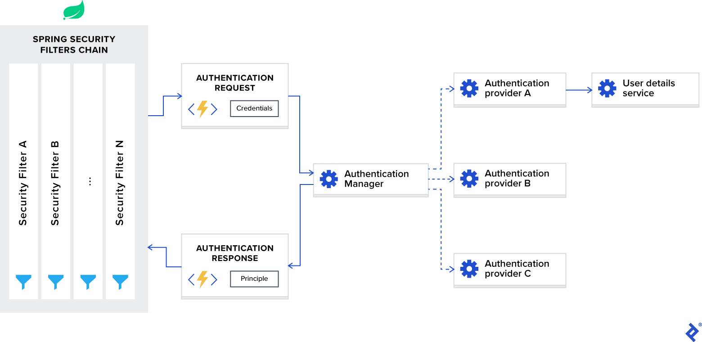

# **Spring Boot Microservices**

> **What is Monolithic Architecture?**

If we develop all the functionalities in single application, then it is
called Monolithic Application.

{width="4.611989282589676in"
height="2.5375in"}

To overcome problems of Monolith Architecture, we will use Micro
services Architecture.

> {width="4.972439851268591in"
> height="2.7625in"}

**What are Microservices?**

- **Definition:\**
  Microservices is an architectural style where an application is
  divided into small, independent services that communicate via APIs
  (usually REST). Each service focuses on a specific business capability
  and can be developed, deployed, and scaled independently.

- **Simplified Definition:\**
  "Microservices are small services that work together."

- **Key Characteristics:**

  - Small, independently deployable units

  - Each service owns its own data and logic

  - Communicate using lightweight protocols (HTTP/REST, messaging)

  - Designed for autonomy and resilience

- **Analogy:\**
  Each microservice is like a specialized shop in a mall --- the mall
  (system) still functions even if one shop closes.

**Key Points:**

- **Microservices is not:**

  - **❌ A technology**

  - **❌ A programming language**

  - **❌ A framework**

  - **❌ An API**

- **It is an architectural design pattern**

  - Used to build distributed and independent services.

  - Each service performs a specific business function.

  - Services communicate through APIs (usually REST or messaging).

## **Challenges with Microservices**

- Bounded Context

- Repeated configurations

- Visibility

<!-- -->

- **Bounded context** means identifying how many micro services we need
  to develop for one application and deciding which functionality we
  need to add in which micro service.

- In Several micro services we **need to write same configurations**
  like data source, smtp, kafka, redis etc.

- In micro service architecture we might not get chance to work with all
  apis in the application.

**Monolith vs Microservices**

  ---------------------------------------------------------------------
  Aspect        Monolithic Architecture    Microservices Architecture
  ------------- -------------------------- ----------------------------
  Structure     Single deployable unit     Multiple independent
                                           services

  Development   Easier to start with       Complex setup, more
                                           coordination

  Scaling       Scales the entire app      Scales specific services

  Deployment    One deployment for all     Independent deployment per
                features                   service

  Change Impact One bug can crash the      Isolated faults per service
                entire app                 
  ---------------------------------------------------------------------

**When to Use Microservices**

- Large and complex applications

- Large or distributed teams

- Need for independent scaling

- Frequent releases and continuous deployment

- Support for different technologies (polyglot architecture)

**Pros and Cons :**

**Pros:**

- Independent development & deployment

- Focused, maintainable codebases

- Targeted scaling of specific services

- Fault isolation improves system resilience

**Cons:**

- Higher operational complexity

- Difficult distributed debugging & tracing

- Eventual consistency (data may not sync instantly)

- Requires robust DevOps and monitoring setup

## **What are the key benefits of microservices?**

- Scalability: Independent services can scale separately.

- Resilience: Failure in one service doesn't bring down the entire
  system.

- Faster Development: Teams can work on separate services.

- Technology Agnostic: Each service can use different tech stacks.

- Deployment Independence: Services can be deployed separately.

## **What are the challenges of microservices?**

- Service Discovery & Communication (Eureka, Consul)

- Data Consistency (Distributed transactions are hard)

- Security (OAuth2, JWT, API Gateway)

- Monitoring & Logging (Distributed tracing with Zipkin, ELK)

- Latency (Inter-service network calls add delays)

> **. Microservices Architecture & Key Components**
>
> **Core Components**

+-----------------+-----------------------------------+--------------------+
| > Component     | > Description                     | > Example / Tools  |
+=================+===================================+====================+
| > API Gateway   | > Acts as a single-entry point    | > 🧩 *Spring Cloud |
|                 | > for all client requests.        | > Gateway*, Zuul   |
|                 | > Handles routing,                |                    |
|                 | > authentication, load balancing, |                    |
|                 | > and rate limiting.              |                    |
+-----------------+-----------------------------------+--------------------+
| > Service       | > Helps microservices find each   | > 🧭 *Eureka*,     |
| > Discovery     | > other dynamically without       | > Consul           |
|                 | > hardcoding URLs. Registers and  |                    |
|                 | > discovers service instances.    |                    |
+-----------------+-----------------------------------+--------------------+
| > Config Server | > Provides centralized            | > ⚙️ *Spring Cloud |
|                 | > configuration management for    | > Config*          |
|                 | > all services. Ensures           |                    |
|                 | > consistency across              |                    |
|                 | > environments.                   |                    |
+-----------------+-----------------------------------+--------------------+
| > Load Balancer | > Distributes requests across     | > 🔁 *Spring Cloud |
|                 | > service instances for high      | > LoadBalancer*    |
|                 | > availability and performance.   | > (modern), Ribbon |
|                 |                                   | > (deprecated)     |
+-----------------+-----------------------------------+--------------------+
| > Messaging     | > Enables asynchronous            | > ✉️ *Kafka*,      |
| > System        | > communication between services  | > RabbitMQ         |
|                 | > to improve resilience and       |                    |
|                 | > decoupling.                     |                    |
+-----------------+-----------------------------------+--------------------+
| > Database per  | > Each microservice owns its      | > 💾 MySQL,        |
| > Service       | > database schema and data,       | > MongoDB,         |
|                 | > enabling data isolation and     | > PostgreSQL       |
|                 | > independent scaling.            |                    |
+-----------------+-----------------------------------+--------------------+
| > Observability | > Helps monitor and troubleshoot  | > 🔍 *ELK Stack*,  |
|                 | > distributed systems using       | > *Prometheus*,    |
|                 | > logging, metrics, and tracing.  | > *Grafana*,       |
|                 |                                   | > *Jaeger*         |
+-----------------+-----------------------------------+--------------------+

> **Communication Patterns**

+-----------------+------------------------------+--------------------+
| > Type          | > Description                | > Examples / Tools |
+=================+==============================+====================+
| > Synchronous   | > Services communicate       | > REST (Spring MVC |
| > Communication | > directly and immediately.  | > / WebFlux), gRPC |
+-----------------+------------------------------+--------------------+
| > Asynchronous  | > Services exchange messages | > Kafka, RabbitMQ, |
| > Communication | > or events, improving       | > Event-driven     |
|                 | > resilience and             | > architecture     |
|                 | > scalability.               |                    |
+-----------------+------------------------------+--------------------+

> **Common Design Patterns in Microservices**

+------------------+------------------------------------+-------------------+
| > Pattern        | > Purpose                          | > Example Tool /  |
|                  |                                    | > Concept         |
+==================+====================================+===================+
| > Circuit        | > Prevents repeated calls to a     | > *Resilience4j*, |
| > Breaker        | > failing service to avoid         | > *Hystrix*       |
|                  | > cascading failures.              |                   |
+------------------+------------------------------------+-------------------+
| > Saga Pattern   | > Manages distributed transactions | > *Order Service  |
|                  | > across multiple services. Can be | > ↔ Payment       |
|                  | > Choreography (event-based) or    | > Service* flow   |
|                  | > Orchestration (central           |                   |
|                  | > coordinator).                    |                   |
+------------------+------------------------------------+-------------------+
| > CQRS (Command  | > Separates read and write         | > *Event          |
| > Query          | > operations for better            | > Sourcing +      |
| > Responsibility | > scalability and performance.     | > Query Services* |
| > Segregation)   |                                    |                   |
+------------------+------------------------------------+-------------------+
| > Bulkhead       | > Isolates failures by             | > *Separate       |
| > Pattern        | > partitioning services/resources  | > thread pools    |
|                  | > into independent pools.          | > per service*    |
+------------------+------------------------------------+-------------------+

> **Microservices Development Approaches**

+-----------------+-----------------------------------------------------+
| > Approach      | > Description                                       |
+=================+=====================================================+
| > Monolithic    | > Single deployable unit; simple to start but hard  |
| > Architecture  | > to scale as app grows.                            |
+-----------------+-----------------------------------------------------+
| > Microservices | > Application is divided into multiple independent  |
| > Architecture  | > services that can be developed, deployed, and     |
|                 | > scaled separately.                                |
+-----------------+-----------------------------------------------------+

# **[Microservices Architecture]{.underline}**

There is no fixed architecture for micro services development. We can
customize micro services architecture according to our project
requirement.

> {width="4.7230391513560805in"
> height="1.9015594925634296in"}

### **Service Discovery & Service Registry:**

**🔹 Service Discovery**

It's the **mechanism to automatically detect network locations (IP &
Port)** of services.

🧠 *Example:*\
When Course-Service wants to call Student-Service, it **asks the
Discovery Server** for the address instead of hardcoding it.

**🔹 Service Registry**

It's the **database (or directory)** where all microservices **register
their IP and port** when they start.\
👉 Discovery Service uses this registry to help other services find each
other.

🧠 *Think of it as a phonebook for microservices.*

**🔹 How It Works**

1.  Each microservice starts → **registers itself** with the Discovery
    Server.

2.  Discovery Server keeps all active service details (name, IP, port).

3.  When one service wants another → it **queries the Discovery
    Server**.

4.  If multiple instances exist → **Load Balancer** chooses one.

**Why We Need Service Discovery**

- In Microservices, each service (Address, Student, Course, etc.) runs
  on **different IPs and ports**.

- Managing and finding these addresses manually is difficult.

- **Solution → Service Discovery & Service Registry** (provided by
  Spring Cloud).

**🔹 Types of Service Discovery**

  -----------------------------------------------------------------------
  Type            Description                        Example
  --------------- ---------------------------------- --------------------
  Client-Side     Client queries the registry and    Netflix **Eureka**,
  Discovery       selects an instance                Zookeeper, Consul

  Server-Side     Client sends request to **Load     **NGINX**, AWS
  Discovery       Balancer**, which queries registry **ELB**
  -----------------------------------------------------------------------

**🔹 Real-Life example**

📞 **Service Registry =** Phonebook\
📲 **Service Discovery =** Calling someone using that phonebook

**🔹 In Spring Boot**

✅ Use **Spring Cloud Netflix Eureka**

- Eureka Server → Discovery Server

- Eureka Client → Microservices registering themselves

### **API Gateway**

**🔹 Definition**

API Gateway is a **single-entry point** for all client requests in a
**microservices architecture**.\
It routes, filters, secures, and manages all incoming requests to the
appropriate microservice.

**🔹 Purpose**

- Acts as a **front door** for all microservices.

- **Receives** client requests → **forwards** to correct microservice →
  **returns** response to the client.

**🔹 Key Functions**

1.  **Routing:** Directs requests to the right microservice.

2.  **Security:** Manages authentication & authorization (e.g., JWT,
    OAuth2).

3.  **Load Balancing:** Distributes traffic evenly between service
    instances.

4.  **Aggregation:** Combines data from multiple services into one
    response.

5.  **Monitoring:** Logs and tracks API calls for analytics and
    debugging.

**🔹 Example (Spring Cloud Gateway)**

spring:

cloud:

gateway:

routes:

\- id: student_service

uri: http://localhost:8081

predicates:

\- Path=/students/\*\*

📘 **Explanation:**\
Any request to /students/\*\* will be routed to the **Student Service**
running on port 8081.

**🔹 Real-Life Example**

API Gateway works like a **reception desk** in a company:

- All visitors (clients) enter through one desk.

- The receptionist (gateway) sends them to the correct department
  (microservice).

{width="6.439581146106737in"
height="2.678261154855643in"}

⚖️ Load Balancing in Spring Boot Microservices

🔹 Definition

Load Balancing is the process of distributing incoming network requests
across multiple instances of the same microservice to ensure high
availability, performance, and reliability.

✅ Load Balancer = Traffic manager for microservices → distributes
requests evenly for better performance and reliability.

🔹 Purpose

- Prevents any single service instance from being overloaded.

- Improves scalability and fault tolerance.

- Ensures even traffic distribution among service instances.

🔹 How It Works

- When multiple instances of a service (e.g., *Student-Service*) are
  running,\
  the Load Balancer decides which instance should handle the request.

- It can use different algorithms like:

  - Round Robin (default)

  - Random

  - Weighted Distribution

🔹 Types of Load Balancing

1.  Client-Side Load Balancing

    - Performed by the client before making a request.

    - Uses Service Discovery (like *Eureka*) to get available instances.

    - 🧠 *Tool:* Spring Cloud LoadBalancer (replacement for Ribbon).

2.  Server-Side Load Balancing

    - Done by an external load balancer (e.g., *NGINX*, *AWS ELB*).

    - Client sends requests to the load balancer, which forwards them to
      service instances.

🔹 Example (Client-Side Load Balancing in Spring Boot)

\@RestController

public class StudentController {

\@Autowired

private RestTemplate restTemplate;

\@GetMapping(\"/get-courses\")

public String getCourses() {

String response =
restTemplate.getForObject(\"http://COURSE-SERVICE/courses\",
String.class);

return response;

}

}

\@Configuration

public class AppConfig {

\@Bean

\@LoadBalanced

public RestTemplate restTemplate() {

return new RestTemplate();

}

}

📘 Explanation:\
\@LoadBalanced makes RestTemplate use Spring Cloud LoadBalancer,\
which automatically picks one instance of COURSE-SERVICE from Eureka
Registry.

Admin Server

- It is used to monitor and manage all the apis at one place.

- It provides beautiful user interface to access all apis actuator
  endpoints at one place.

Zipkin Server

- It is used for distributed tracing of our requests

- It provides beautiful user interface to access apis execution details.

Config Server

- It is used to separate application code and application properties.

- It is used to externalize config props of our application.

- It makes our application loosely coupled with properties file or yml
  file.

Feign Client

- It is used for interservice communication

- If one api communicate with another api with in the same application
  then it is called as Inter service communication.

Kafka Server

- It is used as message broker

- Distributed streaming platform

- It works based on pub-sub model

Redis Server

- Redis is a cache server

- Redis represents data in key-value format

- Redis is used to reduce no.of db calls

{width="2.7744192913385826in"
height="1.3125in"}=\> As part of Micro services architecture we are
going to use below components. (all the below components are not
mandatory

### **🔄 Communication Patterns Microservices**

**🔹 Introduction**

In Microservices, communication happens between multiple independent
services.\
There are two main types of communication patterns:

- **Synchronous (Direct & Real-time) :** Direct API calls (waits for
  response)

- **Asynchronous (Event-driven & Message-based)** : Message-based (does
  not wait, better scalability)

#### 1. Synchronous Communication

➡ Services communicate **directly** using REST APIs --- one waits for
the other's response.

**a) Using RestTemplate**

- Classic client used for years before WebClient

- Synchronous/blocking

- Still widely used in traditional Spring Boot apps

**configuration:**

\@Bean

**[public]{.underline}** [RestTemplate]{.underline} restTemplate() {

**return** **new** [RestTemplate]{.underline}();

}

**How to use Use:**

\@Autowired

**private** [RestTemplate]{.underline} restTemplate;

**public** [AddressDTO]{.underline} getAddressById(**long** id) {

String url = \"http://localhost:8281/api/address/getbyId/\" + id;

**return** [restTemplate]{.underline}.getForObject(url,
[AddressDTO]{.underline}.**class**);

}

**b) Using FeignClient**

- Introduced by Netflix, Supported in Spring Cloud

- Simple interface-based client

- No need to write WebClient/RestTemplate logic

- Supports Load Balancing with Eureka out-of-the-box

**1.Add Dependency in pom.xml**

\<dependency\>

\<groupId\>org.springframework.cloud\</groupId\>

\<artifactId\>spring-cloud-starter-openfeign\</artifactId\>

\</dependency\>

**2.Enable it in main class of application**

\@SpringBootApplication

\@EnableFeignClients

**public** **class** OrderServiceApplication {

**public** **static** **void** main(String\[\] args) {

SpringApplication.run(OrderServiceApplication.**class**, args);

}

}

**3.Create an Interface to call service methods**

\@FeignClient(value = \"userservice\" ,path = \"/user\")

**public** **interface** UserFeignClient {

\@GetMapping

**public** ResponseEntity\<List\<UserDTO\>\> getAllUsers();

\@GetMapping(\"{id}\")

**public** ResponseEntity\<UserDTO\> getUserByID(@PathVariable **long**
id);

}

**4.Autowire interface and call methods**

\@Autowired

**private** UserFeignClient userService;

\@GetMapping(\"/getusers\")

**public** ResponseEntity\<List\<UserDTO\>\> getAllUsers() {

**return** userService.getAllUsers();

}

\@GetMapping(\"/user/{id}\")

**public** ResponseEntity\<UserDTO\> getUserById(@PathVariable **long**
id) {

**return** userService.getUserByID(id);

}

**c) Using WebClient**

- Introduced in Spring 5 (Replaces RestTemplate in Reactive apps)

- Asynchronous, non-blocking (supports reactive programming)

- Can be used in both reactive and traditional apps

**Common Use Case:**

Call another microservice and return the result asynchronously.

**How to Configure ?**

\@Bean

**[public]{.underline}** WebClient getWebclient() {

**return** WebClient

.builder().baseUrl(\"http://localhost:8383/\")

.defaultHeader(HttpHeaders.***CONTENT_TYPE***,
MediaType.***APPLICATION_JSON_VALUE***)

.build();

}

**Example:**

\@Autowired

**private** WebClient webClient;

\@GetMapping(\"/user\")

**public** UserDTO getUser() {

**return**
webClient.get().uri(\"user\").retrieve().bodyToMono(UserDTO.**class**).block();

}

\@GetMapping(\"/user/{id}\")

**public** List\<UserDTO\> getUser(@PathVariable **long** id) {

**return** webClient

.get().uri(\"/user/\" + String.valueOf(id))

.retrieve().

bodyToFlux(UserDTO.**class**)

.collectList()

.block();

}

**When to Use What?**

  ----------------------------------------------------
  **Use Case**           **Recommendation**
  ---------------------- -----------------------------
  **✅ Simple sync       RestTemplate / Feign
  calls**                

  **✅ Async / Reactive  WebClient
  programming**          

  **✅ Declarative,      FeignClient
  minimal code**         

  **✅ Streaming / SSE** WebClient

  **⚠️ Blocking call     WebClient
  avoidance**            

  **❌ Deprecated        RestTemplate (Spring
  (future)**             recommends WebClient)
  ----------------------------------------------------

#### **2. Asynchronous Communication**

➡ Services communicate through **messages** --- sender doesn't wait for
response.\
Used for **event-driven** or **decoupled** systems.

**a) With Apache Kafka**

- Distributed event streaming platform.

- High throughput and reliable message delivery.

kafkaTemplate.send(\"student-topic\", studentData);

**b) With ActiveMQ**

- Traditional **message broker** supporting JMS (Java Message Service).

- Reliable for enterprise-level message queues.

**c) With RabbitMQ**

- Lightweight message broker using **AMQP protocol**.

- Ideal for microservices event communication (publisher--subscriber
  pattern).

**🧠 Summary**

  ----------------------------------------------------------------------------
  Type           Tool                   Communication   Use Case
  -------------- ---------------------- --------------- ----------------------
  Synchronous    RestTemplate,          Direct          Real-time
                 FeignClient, WebClient                 requests/responses

  Asynchronous   Kafka, ActiveMQ,       Message-based   Event-driven systems,
                 RabbitMQ                               decoupling
  ----------------------------------------------------------------------------

**Stateful vs Stateless Microservices :**

**Type Description**

**Stateful Microservice:** A service that remembers client data (state)
between multiple requests or sessions.

**Stateless Microservice:** A service that does not store client data
between requests --- every request is independent.

{width="6.730496500437446in"
height="2.588652668416448in"}

## **What is a circuit breaker in microservices?** A circuit breaker prevents cascading failures by stopping calls to a failing service.

Example: Using Resilience4J

**\@RestController**

**public** **class** **FallbackController** {

**\@GetMapping**(\"/studentFallback\")

**public** **ResponseEntity**\<String\> **studentFallback**() {

**return** **ResponseEntity**

.**status**(**HttpStatus**.***SERVICE_UNAVAILABLE***)

.body(\"Student Service is currently unavailable. Please try again
later.\");

}

**\@GetMapping**(\"/addressFallback\")

**public** **ResponseEntity**\<String\> **addressFallback**() {

**return** **ResponseEntity**

.**status**(**HttpStatus**.***SERVICE_UNAVAILABLE***)

.body(\"Address Service is currently unavailable. Please try again
later.\");

}

}

**How do you handle distributed transactions in microservices?\**
Since microservices follow database-per-service, traditional ACID
transactions won't work. We use:

1.  SAGA Pattern (Compensating transactions)

2.  2PC (Two-Phase Commit) (Not recommended due to performance issues)

3.  Event-Driven Approach (Using Kafka for event sourcing)

## **What is Distributed Tracing?**

- When you have **microservices architecture**, a single client request
  often travels through **multiple services** (e.g., Gateway →
  AuthService → UserService → PaymentService). Tracking **where a
  request spends time** or **where it fails** becomes difficult.

- **Distributed Tracing** helps to trace a request **across multiple
  microservices** --- it gives visibility into the **complete flow** and
  helps find **performance bottlenecks** and **errors**.

What is **Spring Cloud Sleuth**?

**Spring Cloud Sleuth** is a **distributed tracing tool** that
integrates easily with **Spring Boot** microservices.\
It **adds unique trace IDs and span IDs** to logs so that you can trace
a single request across different services.

**➤ Key Concepts:**

  ------------------------------------------------------------------
  Term          Description
  ------------- ----------------------------------------------------
  Trace ID      Unique ID for the entire request (same across all
                services involved).

  Span ID       Unique ID for a single operation or step within that
                trace.

  Parent Span   Links the current span to the previous one, forming
  ID            a hierarchy.
  ------------------------------------------------------------------

**⚙️ Example Flow**

Imagine a request travels like this:

Client → API Gateway → Order Service → Payment Service

Sleuth automatically adds IDs to logs like:

\[traceId=abc123, spanId=def456\] Starting OrderService

\[traceId=abc123, spanId=ghi789, parentId=def456\] Calling
PaymentService

So, you can track the **same traceId** across all logs to understand the
flow.

**🧩 Sleuth + Zipkin**

Sleuth can work with **Zipkin** (a visualization tool) to show request
traces in a dashboard.

**Flow:**

1.  Sleuth adds tracing info in each request.

2.  It sends trace data to **Zipkin server**.

3.  You can visualize timing, latency, and service interactions.

**🧠 Example Configuration**

**pom.xml**

\<dependency\>

\<groupId\>org.springframework.cloud\</groupId\>

\<artifactId\>spring-cloud-starter-sleuth\</artifactId\>

\</dependency\>

\<dependency\>

\<groupId\>org.springframework.cloud\</groupId\>

\<artifactId\>spring-cloud-starter-zipkin\</artifactId\>

\</dependency\>

**application.yml**

spring:

zipkin:

base-url: http://localhost:9411

sleuth:

sampler:

probability: 1.0 \# trace 100% of requests

**💡 Short Summary**

  ----------------------------------------------------------------
  Feature          Description
  ---------------- -----------------------------------------------
  Sleuth           Adds trace and span IDs to logs automatically.

  Distributed      Technique to track a request through multiple
  Tracing          microservices.

  Zipkin           UI and storage for tracing data visualization.
  ----------------------------------------------------------------

## **How do you deploy microservices?**

- Docker (Containerization)

- Kubernetes (Orchestration)

- Helm Charts (Deployment automation)

- CI/CD Pipelines (Jenkins, GitHub Actions)

## **How do you secure microservices?**

- OAuth2 & JWT (Token-Based Authentication)

- Spring Security (For role-based access)

- API Gateway (Central authentication)

## **How do you monitor microservices?**

- Logging: ELK (Elasticsearch, Logstash, Kibana)

- Tracing: Zipkin/Sleuth (Distributed tracing)

- Metrics: Prometheus + Grafana

## **What is service mesh in microservices?** A service mesh (Istio, Linkerd) handles service-to-service communication with:

1.  Traffic Control

2.  Security

3.  Observability

## **What is CQRS in microservices?**

**Answer:**\
**CQRS (Command Query Responsibility Segregation)** separates read
(Query Service) and write (Command Service) operations for performance
optimization.

📌 Example:

- **Writes:** PostgreSQL for transactional data

- **Reads:** Elasticsearch for fast querying

# **Steps to create Microservice application** 

1.  Create spring boot application for student

\@Entity

\@Table(name = \"address\")

**public** **class** Address {

\@Id

\@GeneratedValue(strategy = GenerationType.***IDENTITY***)

\@Column(name = \"id\")

**private** Long id;

\@Column(name = \"street\")

**private** String street;

\@Column(name = \"city\")

**private** String city;

\@Repository

**public** **interface** AddressRepository **extends**
JpaRepository\<Address, Long\> {

Optional\<Address\> findById(**long** id);

}

\@Service

**public** **class** AddressService {

Logger logger=LoggerFactory.getLogger(AddressService.**class**);

\@Autowired AddressRepository addressRepository;

**public** Address saveAddress(Address newaAddress) {

**return** addressRepository.save(newaAddress);

}

**public** Address findAddressById(**long** id) {

logger.info(\"called method \");

**return** addressRepository.findById(id).orElse(**null**);

}

}

\@RestController

\@RequestMapping(\"/api/address\")

**public** **class** AddressController {

\@Autowired AddressService addressService;

\@GetMapping(\"/getbyId/{id}\")

**public** Address getAddress(@PathVariable **long** id) {

**return** addressService.findAddressById(id);

}

\@PostMapping(\"/create\")

**public** Address getAddress(@RequestBody Address address) {

**return** addressService.saveAddress(address);

}

}

spring.application.name=address-service

server.port=8281

spring.datasource.driverClassName=com.mysql.cj.jdbc.Driver

spring.datasource.url=jdbc:mysql://localhost:3306/micro

spring.datasource.username=root

spring.datasource.password=root

spring.jpa.hibernate.ddl-auto=update

spring.jpa.show-sql=true

server.servlet.session.timeout=1800

spring.jpa.properties.hibernate.format_sql=true

spring.cache.type=simple

eureka.client.serviceUrl.defaultZone=http://localhost:8761/eureka/

eureka.instance.instance-id=\${spring.application.name}:\${server.port}

Add dependency to call instance in Eureka server

\<dependency\>

\<groupId\>org.springframework.cloud\</groupId\>

\<artifactId\>spring-cloud-starter-netflix-eureka-client\</artifactId\>

\<version\>4.2.1\</version\>

\</dependency\>

2.  Create spring boot application for Address

\@Entity

\@Table(name = \"student\")

**public** **class** Student {

\@Id

\@GeneratedValue(strategy = GenerationType.***IDENTITY***)

\@Column(name = \"id\")

**private** Long id;

\@Column(name = \"first_name\")

**private** String firstName;

\@Column(name = \"last_name\")

**private** String lastName;

\@Column(name = \"email\")

**private** String email;

\@Column(name = \"address_id\")

**private** **long** addressId;

\@Repository

**public** **interface** StudentRepository **extends**
JpaRepository\<Student, Long\>{

Optional\<Student\> findById(**long** id);

}

\@Service

**public** **class** StudentService {

\@Autowired StudentRepository studentRepository;

\@Autowired WebClient webClient;

**public** Student saveStudent(Student newStudent) {

**return** studentRepository.save(newStudent);

}

**public** Student findAddressById(**long** id) {

**return** studentRepository.findById(id).orElse(**null**);

}

**public** AddressDTO findstudentAddress(**long** id) {

Mono\<AddressDTO\> stdAddress=
webClient.get().uri(\"/getbyId/\"+id).retrieve().bodyToMono(AddressDTO.**class**);

**return** stdAddress.block();

}

}

**public** **class** AddressDTO {

**private** **long** id;

**private** String street;

**private** String city;

**public** **class** StudentDTO {

**private** Long id;

**private** String firstName;

**private** String lastName;

**private** String email;

**private** AddressDTO studentAddress;

\@Configuration

**public** **class** StudentConfig {

\@Value(\"\${address.service.url}\")

**private** String addressServiceURL;

\@Bean

**[public]{.underline}** WebClient webClient() {

**return** WebClient.builder()

.baseUrl(addressServiceURL)

.defaultHeader(HttpHeaders.***CONTENT_TYPE***,
MediaType.***APPLICATION_JSON_VALUE***)

.build();

}

}

\@Component

// below used when we are not using [eureka]{.underline} server

//@FeignClient([url]{.underline}=\"\${address.service.feignclienturl}\"
, path = \"/[api]{.underline}/address\" , value =
\"address-feignclient\")

// use this with [eureka]{.underline} server

\@FeignClient(value = \"ADDRESS-SERVICE\", path = \"/api/address\")

**public** **interface** AddressFeignClient {

\@GetMapping(\"/getbyId/{id}\")

**public**
Optional\<AddressDTO\>getAddressUsingFeignClient(@PathVariable **long**
id);

}

spring.application.name=student-services

server.port=8285

spring.datasource.driverClassName=com.mysql.cj.jdbc.Driver

spring.datasource.url=jdbc:mysql://localhost:3306/micro

spring.datasource.username=root

spring.datasource.password=root

spring.jpa.hibernate.ddl-auto=update

spring.jpa.show-sql=true

server.servlet.session.timeout=1800

spring.jpa.properties.hibernate.format_sql=true

spring.cache.type=simple

[address.service.url]{.underline}=http://localhost:8283/api/address/

[address.service.feignclienturl]{.underline}=http://localhost:8283

#eureka server

eureka.client.serviceUrl.defaultZone=http://localhost:8761/eureka/

eureka.instance.instance-id=\${spring.application.name}:\${server.port}

3.  Call address application url in student application using webclient
    or resttemplate

4.  Also we can user feigncinet

5.  Also use eureka server for automatic url calling

\@SpringBootApplication

\@EnableEurekaServer

**public** **class** EurekaServerApplication {

**public** **static** **void** main(String\[\] args) {

SpringApplication.run(EurekaServerApplication.**class**, args);

}

}

Application.properties

spring.application.name=eureka-server

server.port=8761

eureka.client.register-with-eureka=false

eureka.client.fetch-registry=false

#### Step-by-Step Microservices Creation:

  --------------------------------------------------------------
  Step     Description
  -------- -----------------------------------------------------
  **1️⃣**   **Create Eureka Server** → \@EnableEurekaServer, add
           dependencies, server.port=8761

  **2️⃣**   **Create Address Service** → Register with Eureka
           (spring.application.name=address-service)

  **3️⃣**   **Create Student Service** → Use WebClient or
           FeignClient to call Address Service

  **4️⃣**   **Use DTOs** → StudentDTO + AddressDTO for response
           objects

  **5️⃣**   **Enable Feign Clients** → Annotate
           \@EnableFeignClients in StudentServiceApplication

  **6️⃣**   **Communication Options** → Use WebClient,
           RestTemplate, or Feign

  **7️⃣**   **Test Locally** → Run Eureka, Address, and Student
           service on different ports

  **8️⃣**   (Optional) Add Spring Cloud Gateway for centralized
           routing & load balancing
  --------------------------------------------------------------

**SWAGGER**

## **What is swagger ?**

- Swagger is an open-source framework for designing, building, and
  documenting RESTful APIs.

- It provides a simple, easy-to-use interface for developers to define
  API endpoints, parameters, responses, and other details.

## **Why Swagger in Spring Boot?**

1.  **API Documentation**: Swagger generates API documentation
    automatically, making it easier for developers to understand and use
    the API.

2.  **API Testing**: Swagger provides a UI interface for testing API
    endpoints, eliminating the need for external tools like Postman.

3.  **Contract-First Development**: Swagger allows you to define the API
    contract (endpoints, parameters, responses) before implementing the
    API logic.

4.  **Automatic API documentation generation**.

5.  **Interactive UI for testing APIs**.

6.  **Helps frontend developers understand API contracts**.

7.  **Supports multiple response types and request schemas**.

## **Swagger Dependency** 

\<dependency\>\
\<groupId\>org.springdoc\</groupId\>\
\<artifactId\>springdoc-openapi-starter-webmvc-ui\</artifactId\>\
\<version\>2.8.3\</version\>\
\</dependency\>

## **Explanation of Swagger Annotations**

** @Tag(name = \"User Management\", description = \"APIs for managing
users\")**\
Defines a **category** for API documentation.

**\@Operation(summary = \"\...\", description = \"\...\")**\
Describes the **purpose of each API endpoint**.

 **\@ApiResponses(value = {\...})**\
Lists possible **HTTP responses** with status codes.

** @ApiResponse(responseCode = \"200\", description = \"Success\",
content = \@Content(\...))**\
Specifies a **response type** for successful API calls.

**\@ApiResponse(responseCode = \"404\", description = \"User not
found\")**\
Handles cases where **resources are missing**.

**Example :**

\@RestController

\@RequestMapping(\"/api/admin\")

\@CrossOrigin(\"\*\")

\@Tag(name = \"User Management by ADMIN\", description = \"APIs for
managing users by ADMIN\")

**public** **class** AdminController {

\@Autowired

**private** UserdataService userService;

\@Autowired

**private** BCryptPasswordEncoder passwordEncoder;

\@Autowired

**private** ModelMapper modelMapper;

\@Autowired

**private** EmailService [emailService]{.underline};

\@Operation(

summary = \"Register new user\",

description = \"Creates and returns a new user if the email does not
already exist\"

)

\@ApiResponses({

\@ApiResponse(responseCode = \"201\", description = \"User created
successfully\"),

\@ApiResponse(

responseCode = \"400\",

description = \"Invalid input or duplicate email\",

content = \@Content(

mediaType = \"application/json\",

schema = \@Schema(implementation = String.**class**)

)

)

})

\@PostMapping(\"/register\")

**public** ResponseEntity\<?\> newUser(@RequestBody \@Valid AppUser
newUser)

**throws** MessagingException, IOException, DocumentException {

**if** (newUser.getId() != **null**) {

**return** ResponseEntity.badRequest().body(\"Don\'t send user ID!\");

}

**if** (userService.emailExist(newUser.getEmail())) {

**throw** **new** UserAlreadyExistsException(\"User already registered
with email: \" + newUser.getEmail());

}

newUser.setPassword(passwordEncoder.encode(newUser.getPassword()));

AppUser savedUser = userService.register(newUser);

**return** ResponseEntity

.status(HttpStatus.***CREATED***)

.body(modelMapper.map(savedUser, AppUserResponse.**class**));

}

\@Operation(summary = \"List all users\", description = \"Returns a list
of all registered users\")

\@GetMapping(\"/list\")

**public** List\<AppUserResponse\> getAllUsers() {

**return** userService.getAllUsers()

.stream()

.map(user -\> modelMapper.map(user, AppUserResponse.**class**))

.toList();

}

\@Operation(summary = \"Update user by ID\", description = \"Updates an
existing user based on their ID\")

\@ApiResponses({

\@ApiResponse(responseCode = \"200\", description = \"User updated
successfully\"),

\@ApiResponse(responseCode = \"404\", description = \"User not found\")

})

\@PutMapping(\"/{id}\")

**public** ResponseEntity\<?\> updateUser(@RequestBody \@Valid AppUser
userdata, \@PathVariable Long id) {

userdata.setPassword(passwordEncoder.encode(userdata.getPassword()));

AppUser updated = userService.updateUser(userdata, id);

**return** ResponseEntity.ok(modelMapper.map(updated,
AppUserResponse.**class**));

}

\@Operation(summary = \"Delete user by ID\", description = \"Deletes a
user from the system based on the provided ID\")

\@ApiResponse(responseCode = \"200\", description = \"User deleted
successfully\")

\@DeleteMapping(\"/{id}\")

**public** ResponseEntity\<Map\<String, Object\>\>
deleteUserById(@PathVariable Long id) {

userService.deleteUser(id);

Map\<String, Object\> response = **new** HashMap\<\>();

response.put(\"message\", \"User deleted successfully\");

**return** ResponseEntity.ok(response);

}

\@Operation(summary = \"Get user by ID\", description = \"Fetches a
single user based on their ID\")

\@ApiResponse(responseCode = \"200\", description = \"User retrieved
successfully\")

\@GetMapping(\"/{id}\")

**public** AppUserResponse getUserById(

\@Parameter(description = \"ID of the user to fetch\") \@PathVariable
Long id) {

**return** modelMapper.map(userService.getUserById(id),
AppUserResponse.**class**);

}

}
