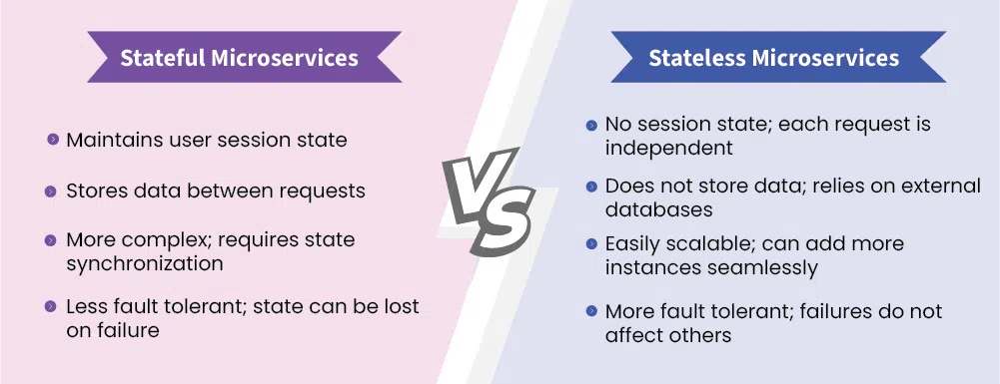
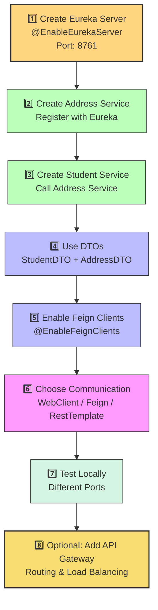
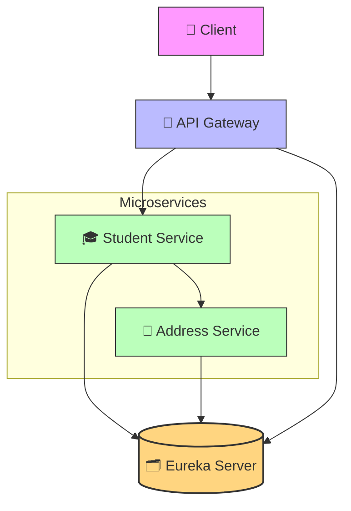

Spring Boot Microservices

### What is Monolithic Architecture?

If we develop all the functionalities in single application, then it is called Monolithic Application.

{width="4.611989282589676in"
height="2.5375in"}

To overcome problems of Monolith Architecture, we will use Microservices Architecture.

> {width="4.972439851268591in"
> height="2.7625in"}

### What are Microservices?

Definition:
Microservices is an architectural style where an application is divided into small, independent services that communicate via APIs (usually REST). Each service focuses on a specific business capability and can be developed, deployed, and scaled independently.

Simplified Definition:
"Microservices are small services that work together."

Key Characteristics:

- Small, independently deployable units
- Each service owns its own data and logic
- Communicate using lightweight protocols (HTTP/REST, messaging)
- Designed for autonomy and resilience

Analogy:
Each microservice is like a specialized shop in a mall the mall (system) still functions even if one shop closes.

Key Points:

Microservices is not:

- ❌ A technology
- ❌ A programming language
- ❌ A framework
- ❌ An API

It is an architectural design pattern

- Used to build distributed and independent services.

- Each service performs a specific business function.

- Services communicate through APIs (usually REST or messaging).

---

### Challenges with Microservices

1. Bounded Context
2. Repeated configurations

3. Visibility

- Bounded context means identifying how many micro services we need to develop for one application and deciding which functionality we need to add in which micro service.
  
- In Several micro services we need to write same configurations like data source, smtp, kafka, redis etc.
  
- In microservice architecture we might not get chance to work with all apis in the application.

------

### Monolith vs Microservices

| Aspect        | Monolithic Architecture          | Microservices Architecture                   |
| ------------- | -------------------------------- | -------------------------------------------- |
| Structure     | Single deployable unit           | Multiple independent services                |
| Development   | Easier to start with             | Complex setup, more coordination             |
| Scaling       | Scales the entire application    | Scales specific services independently       |
| Deployment    | One deployment for all features  | Independent deployment per service           |
| Change Impact | One bug can impact the whole app | Failures are isolated to individual services |

#### When to Use Microservices

- Large and complex applications

- Large or distributed teams

- Need for independent scaling

- Frequent releases and continuous deployment

- Support for different technologies (polyglot architecture)

Pros and Cons :

Pros:

- Independent development & deployment

- Focused, maintainable codebases

- Targeted scaling of specific services

- Fault isolation improves system resilience

Cons:

- Higher operational complexity

- Difficult distributed debugging & tracing

- Eventual consistency (data may not sync instantly)

- Requires robust DevOps and monitoring setup

---

### What are the key benefits of microservices?

- Scalability: Independent services can scale separately.

- Resilience: Failure in one service doesn't bring down the entire
  system.

- Faster Development: Teams can work on separate services.

- Technology Agnostic: Each service can use different tech stacks.

- Deployment Independence: Services can be deployed separately.

---

### What are the challenges of microservices?

- Service Discovery & Communication (Eureka, Consul)

- Data Consistency (Distributed transactions are hard)

- Security (OAuth2, JWT, API Gateway)

- Monitoring & Logging (Distributed tracing with Zipkin, ELK)

- Latency (Inter-service network calls add delays)

---

### Microservices Architecture & Key Components

#### Core Components

| Component            | Description                                                  | Example / Tools                                         |
| -------------------- | ------------------------------------------------------------ | ------------------------------------------------------- |
| API Gateway          | Acts as a single-entry point for all client requests. Handles routing, authentication, load balancing, and rate limiting. | Spring Cloud Gateway, Zuul                              |
| Service Discovery    | Helps microservices find each other dynamically without hardcoding URLs. Registers and discovers service instances. | Eureka, Consul                                          |
| Config Server        | Provides centralized configuration for all services. Ensures consistency across environments. | Spring Cloud Config                                     |
| Load Balancer        | Distributes requests across service instances for high availability and performance. | Spring Cloud LoadBalancer (modern), Ribbon (deprecated) |
| Messaging System     | Enables asynchronous communication between services to improve resilience and decoupling. | Kafka, RabbitMQ                                         |
| Database per Service | Each service owns its database schema and data, allowing isolation and independent scaling. | MySQL, MongoDB, PostgreSQL                              |
| Observability        | Monitoring and troubleshooting distributed systems using logs, metrics, and tracing. | ELK Stack, Prometheus, Grafana, Jaeger                  |

---

### Communication Patterns

| Type         | Description                                                  | Example / Tools                            |
| ------------ | ------------------------------------------------------------ | ------------------------------------------ |
| Synchronous  | Services communicate directly in real time.                  | REST (Spring MVC/WebFlux), gRPC            |
| Asynchronous | Services exchange messages or events, improving resilience and scalability. | Kafka, RabbitMQ, Event-driven architecture |

---

### Common Design Patterns in Microservices

| Pattern                                         | Purpose                                                      | Example Tool / Concept               |
| ----------------------------------------------- | ------------------------------------------------------------ | ------------------------------------ |
| Circuit Breaker                                 | Prevents repeated calls to a failing service to avoid cascading failures. | Resilience4j, Hystrix                |
| Saga Pattern                                    | Manages distributed transactions. Can be Choreography (event-based) or Orchestration (central coordinator). | Order Service ↔ Payment Service flow |
| CQRS (Command Query Responsibility Segregation) | Separates read and write operations for better scalability and performance. | Event Sourcing + Query Services      |
| Bulkhead Pattern                                | Isolates failures by partitioning resources into independent pools. | Separate thread pools per service    |

---

### Microservices Architecture

There is no fixed architecture for micro services development. We can customize micro services architecture according to our project requirement.

> {width="4.7230391513560805in"
> height="1.9015594925634296in"}

### Service Discovery & Service Registry:

#### 🔹 Service Discovery

It's the mechanism to automatically detect network locations (IP &
Port) of services.

🧠 *Example:*
When Course-Service wants to call Student-Service, itasks the Discovery Server for the address instead of hardcoding it.

🔹 Service Registry

It's the database (or directory) where all microservices register their IP and port when they start.
👉 Discovery Service uses this registry to help other services find each other.

🧠 *Think of it as a phonebook for microservices.*

🔹 How It Works

1.  Each microservice starts → registers itself with the Discovery Server.
    
2.  Discovery Server keeps all active service details (name, IP, port).

3.  When one service wants another → it queries the Discovery Server.
    
4.  If multiple instances exist → Load Balancer chooses one.

Why We Need Service Discovery

- In Microservices, each service (Address, Student, Course, etc.) runs on different IPs and ports.
  
- Managing and finding these addresses manually is difficult.

- Solution → Service Discovery & Service Registry (provided by Spring Cloud).

Service Discovery Types

| Type                  | Description                                                  | Example                           |
| --------------------- | ------------------------------------------------------------ | --------------------------------- |
| Client-Side Discovery | Client queries the registry and selects an instance.         | Netflix Eureka, Zookeeper, Consul |
| Server-Side Discovery | Client sends request to a load balancer, which selects the service instance. | NGINX, AWS ELB                    |

🔹 Real-Life example

📞 Service Registry = Phonebook
📲 Service Discovery = Calling someone using that phonebook

🔹 In Spring Boot

✅ Use Spring Cloud Netflix Eureka

- Eureka Server → Discovery Server

- Eureka Client → Microservices registering themselves


---

#### API Gateway

🔹 Definition

API Gateway is a single-entry point for all client requests in a microservices architecture.It routes, filters, secures, and manages all incoming requests to the appropriate microservice.

🔹 Purpose

1. Acts as a front door for all microservices.
2. Receives client requests → forwards to correct microservice →
   returns response to the client.

🔹 Key Functions

1.  Routing: Directs requests to the right microservice.

2.  Security: Manages authentication & authorization (e.g., JWT,
    OAuth2).

3.  Load Balancing: Distributes traffic evenly between service
    instances.

4.  Aggregation: Combines data from multiple services into one
    response.

5.  Monitoring: Logs and tracks API calls for analytics and
    debugging.

🔹 Example (Spring Cloud Gateway)

```yaml
spring:

cloud:

gateway:

routes:

- id: student_service

uri: http://localhost:8081

predicates:

- Path=/students/
```

📘 Explanation:
Any request to /students/ will be routed to the Student Service   running on port 8081.

🔹 Real-Life Example

API Gateway works like a reception desk in a company:

- All visitors (clients) enter through one desk.

- The receptionist (gateway) sends them to the correct department
  (microservice).

---

### ⚖️ Load Balancing in Spring Boot Microservices

🔹 Definition

Load Balancing is the process of distributing incoming network requests across multiple instances of the same microservice to ensure high availability, performance, and reliability.

> [!IMPORTANT]
>
> ✅ Load Balancer = Traffic manager for microservices → distributes requests evenly for better performance and reliability.
>

🔹 Purpose

1. Prevents any single service instance from being overloaded.

2. Improves scalability and fault tolerance.

3. Ensures even traffic distribution among service instances.

🔹 How It Works

1. When multiple instances of a service (e.g., *Student-Service*) are
  running,
  the Load Balancer decides which instance should handle the request.

2. It can use different algorithms like:

  Round Robin (default)

  Random

  Weighted Distribution

#### 🔹 Types of Load Balancing

1.  ##### Client-Side Load Balancing

    - Performed by the client before making a request.

    - Uses Service Discovery (like *Eureka*) to get available instances.

    - 🧠 *Tool:* Spring Cloud LoadBalancer (replacement for Ribbon).

2.  ##### Server-Side Load Balancing

    - Done by an external load balancer (e.g., *NGINX*, *AWS ELB*).

    - Client sends requests to the load balancer, which forwards them to
      service instances.

🔹 Example (Client-Side Load Balancing in Spring Boot)

```java
@RestController

public class StudentController {

    @Autowired

    private RestTemplate restTemplate;

    @GetMapping("/get-courses")

    public String getCourses() {

        String response =
            restTemplate.getForObject("http://COURSE-SERVICE/courses",
                                      String.class);

        return response;

    }

}

@Configuration

public class AppConfig {

    @Bean

    @LoadBalanced

    public RestTemplate restTemplate() {

        return new RestTemplate();

    }

}
```

📘 Explanation:
@LoadBalanced makes RestTemplate use Spring Cloud LoadBalancer, which automatically picks one instance of COURSE-SERVICE from Eureka Registry.

### Admin Server

- It is used to monitor and manage all the apis at one place.

- It provides beautiful user interface to access all apis actuator
  endpoints at one place.

### Zipkin Server

- It is used for distributed tracing of our requests

- It provides beautiful user interface to access apis execution details.

### Config Server

- It is used to separate application code and application properties.

- It is used to externalize config props of our application.

- It makes our application loosely coupled with properties file or yml
  file.

### Feign Client

- It is used for interservice communication

- If one api communicate with another api with in the same application
  then it is called as Inter service communication.

### Kafka Server

- It is used as message broker

- Distributed streaming platform

- It works based on pub-sub model

### Redis Server

- Redis is a cache server

- Redis represents data in key-value format

- Redis is used to reduce no.of db calls

{width="2.7744192913385826in"
height="1.3125in"}

----

### 🔄 Communication Patterns Microservices

🔹 Introduction

In Microservices, communication happens between multiple independent services. There are two main types of communication patterns:

- Synchronous (Direct & Real-time) : Direct API calls (waits for
  response)

- Asynchronous (Event-driven & Message-based) : Message-based (does
  not wait, better scalability)

#### 1. Synchronous Communication in Spring Boot

➡ Services communicate directly using REST APIs — one service waits for the other's response.

Used mainly in:
- Microservices architecture
- Service-to-service communication
- Traditional blocking applications

---

#### a) Using RestTemplate

##### Introduction

- Classic REST client used before WebClient
- Synchronous and blocking
- Still used in traditional Spring Boot applications
- Now in maintenance mode (not recommended for new projects)

---

------

##### Configuration

```java
@Bean
public RestTemplate restTemplate() {
    return new RestTemplate();
}
```

##### Usage Example

```java
@Autowired
private RestTemplate restTemplate;

public AddressDTO getAddressById(long id) {
    String url = "http://localhost:8281/api/address/getbyId/" + id;
    return restTemplate.getForObject(url, AddressDTO.class);
}
```

------

##### Interview Points

- Blocking call (thread waits for response)
- Simple and easy to use
- Not suitable for high-concurrency reactive systems
- Being replaced by WebClient in modern applications

------

#### b) Using FeignClient

##### Introduction

- Developed by Netflix
- Supported via Spring Cloud OpenFeign
- Declarative REST client (interface-based)
- Reduces boilerplate code
- Supports load balancing with Eureka

------

##### 1. Add Dependency

```xml
<dependency>
    <groupId>org.springframework.cloud</groupId>
    <artifactId>spring-cloud-starter-openfeign</artifactId>
</dependency>
```

------

##### 2. Enable Feign

```java
@SpringBootApplication
@EnableFeignClients
public class OrderServiceApplication {

    public static void main(String[] args) {
        SpringApplication.run(OrderServiceApplication.class, args);
    }
}
```

------

##### 3. Create Feign Interface

```java
@FeignClient(value = "userservice", path = "/user")
public interface UserFeignClient {

    @GetMapping
    ResponseEntity<List<UserDTO>> getAllUsers();

    @GetMapping("/{id}")
    ResponseEntity<UserDTO> getUserByID(@PathVariable long id);
}
```

------

##### 4. Use Feign Client

```java
@Autowired
private UserFeignClient userService;

@GetMapping("/getusers")
public ResponseEntity<List<UserDTO>> getAllUsers() {
    return userService.getAllUsers();
}

@GetMapping("/user/{id}")
public ResponseEntity<UserDTO> getUserById(@PathVariable long id) {
    return userService.getUserByID(id);
}
```

------

##### Interview Points

- Declarative and clean approach
- Best suited for microservices
- Works well with service discovery (Eureka)
- Still blocking (unless used with reactive stack)

------

#### c) Using WebClient

##### Introduction

- Introduced in Spring 5
- Replaces RestTemplate for modern applications
- Asynchronous and non-blocking
- Built on Project Reactor
- Can be used in both reactive and traditional apps

------

##### Configuration

```java
@Bean
public WebClient webClient() {
    return WebClient.builder()
            .baseUrl("http://localhost:8383/")
            .defaultHeader(HttpHeaders.CONTENT_TYPE,
                           MediaType.APPLICATION_JSON_VALUE)
            .build();
}
```

------

##### Example – Single Object

```java
@Autowired
private WebClient webClient;

@GetMapping("/user")
public UserDTO getUser() {
    return webClient.get()
            .uri("user")
            .retrieve()
            .bodyToMono(UserDTO.class)
            .block();   // Blocking here (not recommended in reactive apps)
}
```

------

##### Example – List of Objects

```java
@GetMapping("/user/{id}")
public List<UserDTO> getUser(@PathVariable long id) {
    return webClient.get()
            .uri("/user/" + id)
            .retrieve()
            .bodyToFlux(UserDTO.class)
            .collectList()
            .block();   // Converts Flux to List
}
```

------

##### Interview Points

- Non-blocking by default
- Uses Mono (single value) and Flux (multiple values)
- Avoid using .block() in reactive applications
- Best choice for high scalability systems
- Supports streaming and SSE

| Client       | Blocking        | Best For                            |
| ------------ | --------------- | ----------------------------------- |
| RestTemplate | Yes             | Legacy applications                 |
| FeignClient  | Yes             | Microservices with clean code       |
| WebClient    | No (by default) | Reactive & high-performance systems |

---

##### When to Use What? – Spring REST Clients 

| Use Case                                | Recommendation                 | Reason / Interview Explanation                               |
| --------------------------------------- | ------------------------------ | ------------------------------------------------------------ |
| ✅ Simple synchronous REST calls         | `RestTemplate` / `FeignClient` | Good for traditional blocking applications. Easy to implement in simple microservices. |
| ✅ Async / Reactive programming          | `WebClient`                    | Non-blocking, built on Project Reactor. Best for reactive systems. |
| ✅ Declarative & minimal code            | `FeignClient`                  | Interface-based HTTP client. Reduces boilerplate. Best for microservices communication. |
| ✅ Streaming / Server-Sent Events (SSE)  | `WebClient`                    | Supports streaming and reactive backpressure handling.       |
| ⚠️ Avoid blocking calls in reactive apps | `WebClient`                    | Prevents thread blocking. Ideal for high-concurrency systems. |
| ❌ Deprecated (future direction)         | `RestTemplate`                 | Maintenance mode. Spring recommends `WebClient` for new development. |

---

##### Quick Interview Summary

- `RestTemplate` → Blocking, traditional, simple use cases.
- `WebClient` → Non-blocking, reactive, scalable.
- `FeignClient` → Declarative REST client for microservices.
- In modern Spring Boot applications → Prefer `WebClient`.
- In microservices with service-to-service calls → Feign is commonly used.
- In high-load banking systems → WebClient improves scalability.

#### 2. Asynchronous Communication in Spring Boot

➡ Services communicate through messages — the sender does NOT wait for an immediate response.

Used in:
- Event-driven architecture
- High scalability systems
- Decoupled microservices
- Background processing
- Notification systems

---

#### a) Using Apache Kafka

##### Introduction

- Distributed event streaming platform
- Designed for high throughput and fault tolerance
- Suitable for real-time data pipelines
- Works on publish-subscribe model

---

##### Basic Example (Producer)

```java
@Autowired
private KafkaTemplate<String, Object> kafkaTemplate;

public void sendStudentEvent(Student studentData) {
    kafkaTemplate.send("student-topic", studentData);
}
```

------

##### Interview Points

- Kafka stores messages using partitions and offsets
- Supports high scalability
- Durable and fault-tolerant
- Best for streaming and real-time processing
- Frequently used in banking and financial systems

------

#### b) Using ActiveMQ

##### Introduction

- Traditional message broker
- Supports JMS (Java Message Service)
- Queue-based communication
- Reliable for enterprise systems

------

##### Key Features

- Point-to-Point (Queue)
- Publish-Subscribe (Topic)
- Persistent messaging
- Transaction support

------

##### Interview Points

- Uses JMS standard
- Suitable for legacy enterprise systems
- More traditional compared to Kafka

------

#### c) Using RabbitMQ

##### Introduction

- Lightweight message broker
- Uses AMQP protocol
- Supports publisher-subscriber model
- Common in microservices

------

##### Key Features

- Message queues
- Exchange types (Direct, Topic, Fanout, Headers)
- Reliable delivery
- Easy to integrate with Spring Boot

------

##### Interview Points

- Ideal for event-driven microservices
- Supports routing logic via exchanges
- Less heavy compared to Kafka

------

##### Synchronous vs Asynchronous 

| Type         | Tools                                | Communication Style     | Use Case                         |
| ------------ | ------------------------------------ | ----------------------- | -------------------------------- |
| Synchronous  | RestTemplate, FeignClient, WebClient | Direct request-response | Real-time API calls              |
| Asynchronous | Kafka, ActiveMQ, RabbitMQ            | Message-based           | Event-driven systems, decoupling |

------

##### Experienced-Level Interview Notes

- Async improves scalability and fault tolerance
- Sender and receiver are loosely coupled
- Retry mechanisms and DLQ (Dead Letter Queue) are important concepts
- Kafka → Streaming platform
- RabbitMQ → Messaging broker
- ActiveMQ → JMS-based traditional broker

---

### Stateful vs Stateless Microservices :

Type Description

Stateful Microservice: A service that remembers client data (state) between multiple requests or sessions.

Stateless Microservice: A service that does not store client data between requests --- every request is independent.

{width="6.730496500437446in"
height="2.588652668416448in"}

### What is a circuit breaker in microservices? 

A circuit breaker prevents cascading failures by stopping calls to a failing service.

Example: Using Resilience4J

```java
@RestController

public class FallbackController {

    @GetMapping("/studentFallback")
    public ResponseEntity<String> studentFallback() {
    return ResponseEntity.status(HttpStatus.SERVICE_UNAVAILABLE)
    .body("Student Service is currently unavailable. Please try again later.");

  }

  @GetMapping("/addressFallback")
  public ResponseEntity<String> addressFallback() {
      return ResponseEntity.status(HttpStatus.SERVICE_UNAVAILABLE).body("Address Service is currently unavailable. Please try again later.");
 }

 }
```

---

## Distributed Transactions in Microservices

### 1. Definition / Introduction

In microservices architecture, each service has its own database (Database-per-Service pattern).

Because of this:
- Traditional ACID transactions across multiple services are NOT possible.
- We need alternative patterns to maintain data consistency.

---

### 2. Common Approaches

#### 1️⃣ SAGA Pattern (Recommended)

- Uses compensating transactions
- Each service performs a local transaction
- If one step fails → previous steps are rolled back using compensating actions

graph TD;

```mermaid
%% Step 1
Step1[1️⃣ Order Service<br/>Create Order]

%% Step 2
Step2[2️⃣ Publish Order Created Event]

%% Step 3
Step3[3️⃣ Payment Service<br/>Process Payment]

%% Step 4
Step4[4️⃣ Publish Payment Success Event]

%% Step 5
Step5[5️⃣ Inventory Service<br/>Reserve Product]

%% Step 6
Step6[6️⃣ Publish Inventory Success Event]

%% Step 7
Step7[7️⃣ Complete Order]

%% Step 8 (Compensation)
Step8[❌ If Failure → Trigger Compensation<br/>Refund / Cancel Order]

%% Flow
Step1 --> Step2
Step2 --> Step3
Step3 -->|Success| Step4
Step4 --> Step5
Step5 -->|Success| Step6
Step6 --> Step7

%% Failure Flow
Step3 -->|Failure| Step8
Step5 -->|Failure| Step8

%% Styling
style Step1 fill:#aed6f1,stroke:#333
style Step2 fill:#d5f5e3,stroke:#333
style Step3 fill:#aed6f1,stroke:#333
style Step4 fill:#d5f5e3,stroke:#333
style Step5 fill:#aed6f1,stroke:#333
style Step6 fill:#d5f5e3,stroke:#333
style Step7 fill:#f7dc6f,stroke:#333,stroke-width:2px
style Step8 fill:#f5b7b1,stroke:#333,stroke-width:2px
```

##### Types of Saga

| Type | Description |
|------|------------|
| Choreography | Services communicate via events (no central coordinator) |
| Orchestration | Central orchestrator controls the workflow |

##### Interview Points

- Most recommended pattern
- Works well with Kafka / RabbitMQ
- Eventually consistent
- Suitable for order-payment-inventory workflows

---

#### 2️⃣ Two-Phase Commit (2PC)

- Coordinator asks all services to prepare
- If all agree → commit
- If one fails → rollback

##### Why Not Recommended?

- Performance bottleneck
- Single point of failure
- Not scalable in microservices

##### Interview Point

- Suitable for monolith or tightly coupled systems
- Avoid in cloud-native architectures

---

#### 3️⃣ Event-Driven Approach

- Services publish events (e.g., OrderCreated)
- Other services react asynchronously
- Uses Kafka, RabbitMQ, etc.

##### Interview Points

- Highly scalable
- Loose coupling
- Supports eventual consistency
- Common in modern banking systems

---

## Distributed Tracing

##### 1. Definition / Introduction

In microservices, a single client request travels through multiple services:

Gateway → AuthService → UserService → PaymentService

Tracking:
- Where request failed
- Where time was spent
- Performance bottlenecks

becomes difficult.

Distributed Tracing solves this by tracking the complete request flow across services.

---

### Spring Cloud Sleuth

Spring Cloud Sleuth is a distributed tracing tool for Spring Boot microservices.

It:
- Automatically adds Trace ID and Span ID
- Propagates tracing headers between services
- Integrates with logging frameworks

---

#### Key Concepts

| Term | Description |
|------|------------|
| Trace ID | Unique ID for entire request (same across all services) |
| Span ID | Unique ID for a single operation |
| Parent Span ID | Links spans to form hierarchy |

---

##### Example Flow

Client → API Gateway → Order Service → Payment Service

Logs look like:

```powershell
[traceId=abc123, spanId=def456] Starting OrderService
[traceId=abc123, spanId=ghi789, parentId=def456] Calling PaymentService
```

You track the same `traceId` across all services.

---

### Sleuth + Zipkin Integration

Sleuth works with Zipkin for visualization.

Flow:
1. Sleuth adds tracing data
2. Sends data to Zipkin server
3. Zipkin UI shows latency and service interactions

---

##### Dependencies

```xml
<dependency>
    <groupId>org.springframework.cloud</groupId>
    <artifactId>spring-cloud-starter-sleuth</artifactId>
</dependency>

<dependency>
    <groupId>org.springframework.cloud</groupId>
    <artifactId>spring-cloud-starter-zipkin</artifactId>
</dependency>
```

------

##### application.yml Configuration

```yaml
spring:
  zipkin:
    base-url: http://localhost:9411
  sleuth:
    sampler:
      probability: 1.0   # Trace 100% of requests
```

------

##### Interview Important Points

- Sleuth works using interceptors and filters
- Trace ID propagates via HTTP headers
- Very important in production microservices
- Helps debug latency issues
- Used with monitoring tools

------

##### 

### Advanced Interview Note (Very Important)

Spring Cloud Sleuth is now replaced by:

👉 Micrometer Tracing (in newer Spring Boot versions)

Modern stack:

- Micrometer Tracing
- Zipkin / Jaeger
- OpenTelemetry

This is a high-value interview discussion point.

---


### How do you deploy microservices?

- Docker (Containerization)

- Kubernetes (Orchestration)

- Helm Charts (Deployment automation)

- CI/CD Pipelines (Jenkins, GitHub Actions)

### How do you secure microservices?

- OAuth2 & JWT (Token-Based Authentication)

- Spring Security (For role-based access)

- API Gateway (Central authentication)

### How do you monitor microservices?

- Logging: ELK (Elasticsearch, Logstash, Kibana)

- Tracing: Zipkin/Sleuth (Distributed tracing)

- Metrics: Prometheus + Grafana

### What is service mesh in microservices? A service mesh (Istio, Linkerd) handles service-to-service communication with:

1.  Traffic Control

2.  Security

3.  Observability

### What is CQRS in microservices?

Answer:
CQRS (Command Query Responsibility Segregation) separates read (Query Service) and write (Command Service) operations for performance
optimization.

📌 Example:

- Writes: PostgreSQL for transactional data

- Reads: Elasticsearch for fast querying

### Steps to create Microservice application 

1.  ##### Create spring boot application for student

```java
@Entity

@Table(name = "address")

public class Address {

@Id

@GeneratedValue(strategy = GenerationType.*IDENTITY*)

@Column(name = "id")

private Long id;

@Column(name = "street")

private String street;

@Column(name = "city")

private String city;}
```

```java
@Repository

public interface AddressRepository extends
JpaRepository<Address, Long> {

Optional<Address> findById(long id);

}
```

```java
@Service

public class AddressService {

Logger logger=LoggerFactory.getLogger(AddressService.class);

@Autowired AddressRepository addressRepository;

public Address saveAddress(Address newaAddress) {

return addressRepository.save(newaAddress);

}

public Address findAddressById(long id) {

logger.info("called method ");

return addressRepository.findById(id).orElse(null);

}

}
```

```java
@RestController

@RequestMapping("/api/address")

public class AddressController {

@Autowired AddressService addressService;

@GetMapping("/getbyId/{id}")

public Address getAddress(@PathVariable long id) {

return addressService.findAddressById(id);

}

@PostMapping("/create")

public Address getAddress(@RequestBody Address address) {

return addressService.saveAddress(address);

}

}
```

```properties
spring.application.name=address-service

server.port=8281

spring.datasource.driverClassName=com.mysql.cj.jdbc.Driver

spring.datasource.url=jdbc:mysql://localhost:3306/micro

spring.datasource.username=root

spring.datasource.password=root

spring.jpa.hibernate.ddl-auto=update

spring.jpa.show-sql=true

server.servlet.session.timeout=1800

spring.jpa.properties.hibernate.format_sql=true

spring.cache.type=simple

eureka.client.serviceUrl.defaultZone=http://localhost:8761/eureka/

eureka.instance.instance-id=${spring.application.name}:${server.port}
```

**Add dependency to call instance in Eureka server**

```xml
<dependency>

<groupId>org.springframework.cloud</groupId>

<artifactId>spring-cloud-starter-netflix-eureka-client</artifactId>

<version>4.2.1</version>

</dependency>
```


2.  ##### Create spring boot application for Address

```java
@Entity

@Table(name = "student")

public class Student {

@Id

@GeneratedValue(strategy = GenerationType.*IDENTITY*)

@Column(name = "id")

private Long id;

@Column(name = "first_name")

private String firstName;

@Column(name = "last_name")

private String lastName;

@Column(name = "email")

private String email;

@Column(name = "address_id")

private long addressId;}
```

```java
@Repository

public interface StudentRepository extends
JpaRepository<Student, Long>{

Optional<Student> findById(long id);

}
```

```java
@Service

public class StudentService {

@Autowired StudentRepository studentRepository;

@Autowired WebClient webClient;

public Student saveStudent(Student newStudent) {

return studentRepository.save(newStudent);

}

public Student findAddressById(long id) {

return studentRepository.findById(id).orElse(null);

}

public AddressDTO findstudentAddress(long id) {

Mono<AddressDTO> stdAddress=
webClient.get().uri("/getbyId/"+id).retrieve().bodyToMono(AddressDTO.class);

return stdAddress.block();

}

}
```

```java
public class AddressDTO {

private long id;

private String street;

private String city;

public class StudentDTO {

private Long id;

private String firstName;

private String lastName;

private String email;
private AddressDTO studentAddress;}
```


```java
@Configuration

public class StudentConfig {

@Value("${address.service.url}")

private String addressServiceURL;

@Bean

public WebClient webClient() {

return WebClient.builder()

.baseUrl(addressServiceURL)

.defaultHeader(HttpHeaders.*CONTENT_TYPE*,
MediaType.*APPLICATION_JSON_VALUE*)

.build();

}

}
```

```java
@Component

// below used when we are not using [eureka] server

//@FeignClient([url]="${address.service.feignclienturl}", path = "/[api]/address" , value ="address-feignclient")

// use this with [eureka] server

@FeignClient(value = "ADDRESS-SERVICE", path = "/api/address")

public interface AddressFeignClient {

    @GetMapping("/getbyId/{id}")

    public Optional<AddressDTO>getAddressUsingFeignClient(@PathVariable long id);

}
```

```properties
spring.application.name=student-services

server.port=8285

spring.datasource.driverClassName=com.mysql.cj.jdbc.Driver

spring.datasource.url=jdbc:mysql://localhost:3306/micro

spring.datasource.username=root

spring.datasource.password=root

spring.jpa.hibernate.ddl-auto=update

spring.jpa.show-sql=true

server.servlet.session.timeout=1800

spring.jpa.properties.hibernate.format_sql=true

spring.cache.type=simple

address.service.url=http://localhost:8283/api/address/

address.service.feignclienturl=http://localhost:8283
#eureka server

eureka.client.serviceUrl.defaultZone=http://localhost:8761/eureka/

eureka.instance.instance-id=${spring.application.name}:${server.port}
```

#### 3. Call address application url in student application using webclient or resttemplate

#### 4. Also we can user feigncinet

#### 5. Also use eureka server for automatic url calling

```java
@SpringBootApplication

@EnableEurekaServer

public class EurekaServerApplication {

public static void main(String[] args) {

SpringApplication.run(EurekaServerApplication.class, args);

}

}
```

```properties
#Application.properties

spring.application.name=eureka-server

server.port=8761

eureka.client.register-with-eureka=false

eureka.client.fetch-registry=false
```


# Step-by-Step Microservices Creation (Spring Boot + Eureka)

This is a typical flow for building microservices using:
- Spring Boot
- Eureka (Service Discovery)
- Feign/WebClient (Service Communication)



---

| Step | Description                                                  | Interview Important Points                                   |
| ---- | ------------------------------------------------------------ | ------------------------------------------------------------ |
| 1️⃣    | **Create Eureka Server** → Add dependency, use `@EnableEurekaServer`, set `server.port=8761` | Central registry where services register themselves          |
| 2️⃣    | **Create Address Service** → Register with Eureka using `spring.application.name=address-service` | Must add `@EnableDiscoveryClient` (if required) and Eureka client dependency |
| 3️⃣    | **Create Student Service** → Call Address Service using WebClient or FeignClient | Demonstrates service-to-service communication                |
| 4️⃣    | **Use DTOs** → `StudentDTO` + `AddressDTO` for response objects | Avoid exposing entity classes directly                       |
| 5️⃣    | **Enable Feign Clients** → Add `@EnableFeignClients` in main class | Required to activate Feign interface scanning                |
| 6️⃣    | **Communication Options** → WebClient, RestTemplate, or Feign | Prefer Feign (clean code) or WebClient (reactive)            |
| 7️⃣    | **Test Locally** → Run Eureka, Address, Student services on different ports | Example: 8761 (Eureka), 8081 (Address), 8082 (Student)       |
| 8️⃣    | **(Optional) Add Spring Cloud Gateway** → Centralized routing and load balancing | Acts as API Gateway for security, routing, rate limiting     |

---

# Basic Flow Architecture




## Description

- **Client** sends request.
- **Gateway (Optional)** handles routing, security, and load balancing.
- **Student Service** processes request and calls Address Service.
- **Address Service** returns address data.
- All services **register with Eureka Server** for service discovery.

----


# SWAGGER

## What is swagger ?

- Swagger is an open-source framework for designing, building, and
  documenting RESTful APIs.

- It provides a simple, easy-to-use interface for developers to define
  API endpoints, parameters, responses, and other details.

## Why Swagger in Spring Boot?

1.  API Documentation: Swagger generates API documentation
    automatically, making it easier for developers to understand and use
    the API.

2.  API Testing: Swagger provides a UI interface for testing API
    endpoints, eliminating the need for external tools like Postman.

3.  Contract-First Development: Swagger allows you to define the API
    contract (endpoints, parameters, responses) before implementing the
    API logic.

4.  Automatic API documentation generation.

5.  Interactive UI for testing APIs.

6.  Helps frontend developers understand API contracts.

7.  Supports multiple response types and request schemas.

## Swagger Dependency 

<dependency>
<groupId>org.springdoc</groupId>
<artifactId>springdoc-openapi-starter-webmvc-ui</artifactId>
<version>2.8.3</version>
</dependency>

## Explanation of Swagger Annotations

 @Tag(name = "User Management", description = "APIs for managing
users")
Defines a category for API documentation.

@Operation(summary = "...", description = "...")
Describes the purpose of each API endpoint.

 @ApiResponses(value = {...})
Lists possible HTTP responses with status codes.

 @ApiResponse(responseCode = "200", description = "Success",
content = @Content(...))
Specifies a response type for successful API calls.

@ApiResponse(responseCode = "404", description = "User not
found")
Handles cases where resources are missing.

Example :

@RestController

@RequestMapping("/api/admin")

@CrossOrigin("*")

@Tag(name = "User Management by ADMIN", description = "APIs for
managing users by ADMIN")

public class AdminController {

@Autowired

private UserdataService userService;

@Autowired

private BCryptPasswordEncoder passwordEncoder;

@Autowired

private ModelMapper modelMapper;

@Autowired

private EmailService [emailService];

@Operation(

summary = "Register new user",

description = "Creates and returns a new user if the email does not
already exist"

)

@ApiResponses({

@ApiResponse(responseCode = "201", description = "User created
successfully"),

@ApiResponse(

responseCode = "400",

description = "Invalid input or duplicate email",

content = @Content(

mediaType = "application/json",

schema = @Schema(implementation = String.class)

)

)

})

@PostMapping("/register")

public ResponseEntity<?> newUser(@RequestBody @Valid AppUser
newUser)

throws MessagingException, IOException, DocumentException {

if (newUser.getId() != null) {

return ResponseEntity.badRequest().body("Don't send user ID!");

}

if (userService.emailExist(newUser.getEmail())) {

throw new UserAlreadyExistsException("User already registered
with email: " + newUser.getEmail());

}

newUser.setPassword(passwordEncoder.encode(newUser.getPassword()));

AppUser savedUser = userService.register(newUser);

return ResponseEntity

.status(HttpStatus.*CREATED*)

.body(modelMapper.map(savedUser, AppUserResponse.class));

}

@Operation(summary = "List all users", description = "Returns a list
of all registered users")

@GetMapping("/list")

public List<AppUserResponse> getAllUsers() {

return userService.getAllUsers()

.stream()

.map(user -> modelMapper.map(user, AppUserResponse.class))

.toList();

}

@Operation(summary = "Update user by ID", description = "Updates an
existing user based on their ID")

@ApiResponses({

@ApiResponse(responseCode = "200", description = "User updated
successfully"),

@ApiResponse(responseCode = "404", description = "User not found")

})

@PutMapping("/{id}")

public ResponseEntity<?> updateUser(@RequestBody @Valid AppUser
userdata, @PathVariable Long id) {

userdata.setPassword(passwordEncoder.encode(userdata.getPassword()));

AppUser updated = userService.updateUser(userdata, id);

return ResponseEntity.ok(modelMapper.map(updated,
AppUserResponse.class));

}

@Operation(summary = "Delete user by ID", description = "Deletes a
user from the system based on the provided ID")

@ApiResponse(responseCode = "200", description = "User deleted
successfully")

@DeleteMapping("/{id}")

public ResponseEntity<Map<String, Object>>
deleteUserById(@PathVariable Long id) {

userService.deleteUser(id);

Map<String, Object> response = new HashMap<>();

response.put("message", "User deleted successfully");

return ResponseEntity.ok(response);

}

@Operation(summary = "Get user by ID", description = "Fetches a
single user based on their ID")

@ApiResponse(responseCode = "200", description = "User retrieved
successfully")

@GetMapping("/{id}")

public AppUserResponse getUserById(

@Parameter(description = "ID of the user to fetch") @PathVariable
Long id) {

return modelMapper.map(userService.getUserById(id),
AppUserResponse.class);

}

}
