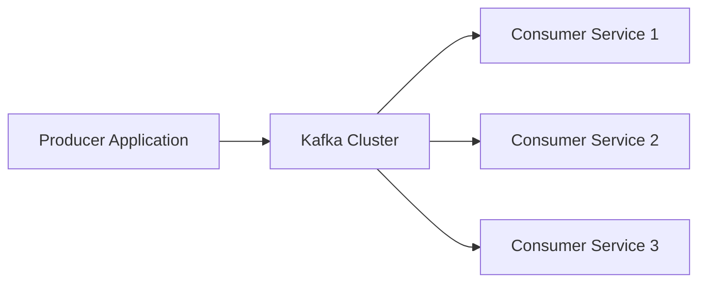
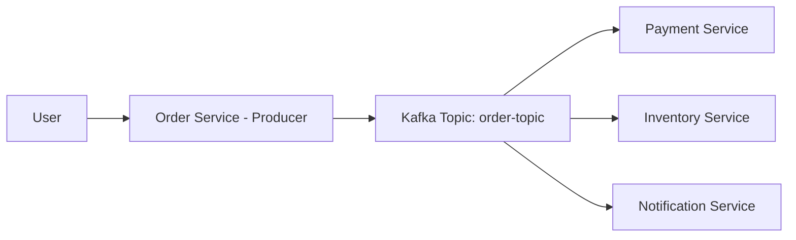
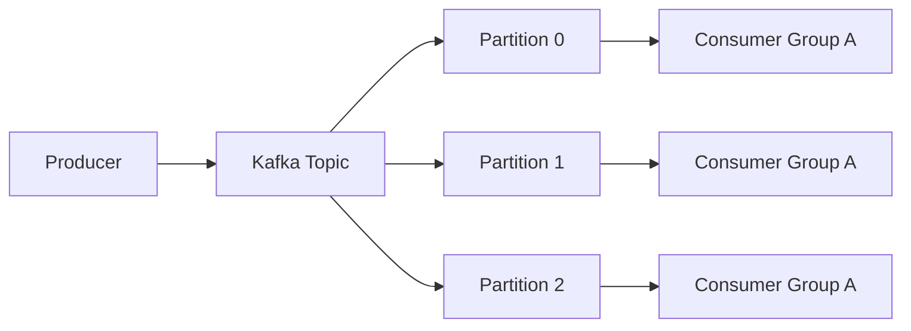

# What is Apache Kafka?

### Introduction

Apache Kafka is a **distributed event-streaming platform** designed to handle very large amounts of data in real time. Kafka can process millions of messages per second, store them safely, and allow multiple consumers to read the same data independently.

Apache Kafka is like a big, fast room where lots of information comes in from many places. It makes sure all the information is kept and processed in the right order. This allows us to look at and understand what is happening right now. Kafka is great for dealing with huge amounts of information that keep coming all the time.

For example, imagine a big river where thousands of different colored balls are thrown in regularly. Kafka is like a special machine that catches each ball, sorts them by color, and puts them in separate containers. We can then find and look at the balls based on their colors.

In simple words, Kafka allows applications to:

- **Send data** (publish)
- **Store data safely**
- **Process data**
- **Read data** (consume)

It works efficiently even when millions of messages are coming every second.

Kafka is not just a messaging system. It works like:

- A **message broker** (sends data between services)
- A **distributed commit log** (stores data in order)
- A **streaming backbone** for microservices (connects everything)

------

### Why Kafka is Used

Kafka is widely used when:

- Data must **never be lost**
- Data must be processed **very fast**
- The system must **scale horizontally** (add more servers easily)

**Common examples:**

- Order processing
- Payment systems
- Notifications
- Log collection
- Real-time analytics

------

#### How Kafka Works (Simple Architecture)



##### Explanation:

- **Producer** → Sends data to Kafka
- **Kafka Cluster** → Stores data safely
- **Consumers** → Read and process data

Multiple services can read the same data independently.

------

##### Real-Life Example

Imagine an online shopping app:




1. User places an order.
2. Order service sends an event to Kafka.
3. Payment service reads the event.
4. Inventory service reads the same event.
5. Notification service reads it too.

One event. Multiple services. No direct dependency between them.

------

##### Simple Practical Example (Java Producer)

```java
Properties props = new Properties();
props.put("bootstrap.servers", "localhost:9092");
props.put("key.serializer", "org.apache.kafka.common.serialization.StringSerializer");
props.put("value.serializer", "org.apache.kafka.common.serialization.StringSerializer");

KafkaProducer<String, String> producer = new KafkaProducer<>(props);
producer.send(new ProducerRecord<>("orders", "Order Created"));
producer.close();
```

This sends a message `"Order Created"` to the `orders` topic.

---

### Main Components of Apache Kafka

Kafka has several core components that work together:
1. **Producer** – Sends messages to Kafka

2. **Broker** – Kafka server that stores data

3. **Topic** – Logical category of messages

4. **Partition** – Physical split of a topic

5. **Consumer** – Reads messages

6. **Consumer Group** – Multiple consumers working together

7. **Offset** – Position of a message inside a partition

  Each component plays a specific role in making Kafka scalable and fault-tolerant.



------

## Real-Life Example (E-commerce)

User places an order.

Producer:

- Order Service publishes `OrderCreated` event.

Kafka Topic:

- `order-topic`

Consumers:

- Payment Service
- Inventory Service
- Notification Service
- Analytics Service

All consume the **same event independently**.

---
### What is a Kafka Broker?

A Kafka broker is like a helper that lets information go between those who send information (producers) and those who receive information (consumers). The broker handles all requests to write new information and read existing information. The Kafka cluster is the group of one or more Kafka brokers working together. Each broker in the cluster has its own unique number ID. For example lets say we have the cluster of the 3 Kafka brokers. Each of these 3 brokers has its own special number ID that is different from the others.

flowchart TB
    subgraph Cluster
        B1[Broker1]
        B2[Broker2]
        B3[Broker3]
    end
    P[Producer] --> B1
    C[Consumer] --> B2


#### Kafka Broker
A Kafka broker is like a single worker or machine in the Kafka system. Its main jobs are to receive new messages coming in safely store those messages and provide the stored messages to any consumers that need them. The broker acts as the middle person between producers sending messages and consumers receiving messages.

#### Cluster
A Kafka cluster is a group of multiple Kafka brokers all working together. Having a cluster allows Kafka to handle very large amounts of data. If more data needs to be processed new brokers can easily be added to make the cluster bigger. If less data needs processing, brokers can be removed to make the cluster smaller.

#### Topic
A topic is like a labelled box or category that related messages go into in Kafka. Producers publish their messages into a specific topic box. Consumers subscribe to one or more topic boxes to receive all the messages placed into those boxes. Using topics helps organize messages and allows parallel processing of different message categories.

#### Partitions
Each topic is further divided into partitions. A partition is like a sub-box inside the main topic box. Having partitions allows a topics messages to be spread across multiple brokers enabling parallel processing. Each partition is stored on a separate Kafka broker in the cluster. This prevents any single broker from getting overloaded with data.

#### Working of Kafka Broker

Producers send messages
Producers are programs or applications that create and send data messages to Kafka brokers. These messages can contain any type of data like logs, events, records or other information from the producer. Producers are responsible for pushing their data into the Kafka system.

#### Message storage
When producers send messages, the Kafka brokers receive and safely store those messages. The brokers act like secure storage spaces that hold onto the messages until they are needed. The messages are kept in an organized way that allows fast reading and writing, so they can be easily accessed later.

#### Topics and partitions
Inside Kafka, related messages are grouped together into categories called topics. A topic is like a big labeled box that holds all messages of the same type or category. However, each topic is further divided into smaller partitions, which are like sub boxes inside the main topic box. Having these partitions allows different parts of the big topic to be processed in parallel by multiple brokers at the same time. Partitions also make it easy to increase processing power by simply adding more partitions as the amount of data grows.

#### Replication for reliability
To ensure no data is lost if a broker fails, Kafka makes multiple copies or replicas of each partition across different brokers in the cluster. So if one broker goes down the replicas on other brokers can still serve the messages, providing reliability and preventing data loss.

#### Leaders and followers
For the each partition one broker acts as the leader and is responsible for the handling all read and write requests for that partitions messages. The other brokers that have the replicas of that partition are called the followers. The followers constantly copy over any new data from the leader to stay update. If the leader broker fails one of the follower brokers is automatically elected as the new leader to take over.

#### Consumer consumption
Consumers are the applications that subscribe to one or more topics in order to receive and process the messages from those topics. As the new messages are published to the topic by the producers the Kafka brokers deliver those messages to all the subscribed consumers for that topic. Importantly consumers receive the messages in the exact same order they were originally sent by the producers allowing for the proper sequential and real time processing.

### How Kafka Brokers Connect with Producers and Consumers
Apache Kafka brokers are the intermediary between producers (who write data) and consumers (who read data). This is how they interact on both sides:

Producers Interaction
Producers send a message to a broker's leader partition of a specific Kafka topic.

The broker writes the message and sends an acknowledgment (ACK) back to the producer after successfully writing the message.
Producers can be configured for high reliability with features like acks=all and idempotent producers to avoid duplications.
#### Consumers Interaction
Consumers pull messages directly from the topic partitions of the broker.

Kafka uses the consumer groups to manage the message delivery across multiple consumers.
Each consumer gets one partition out of the partitioned group such that there's parallel processing, load balancing, and efficient consumption of real-time data.