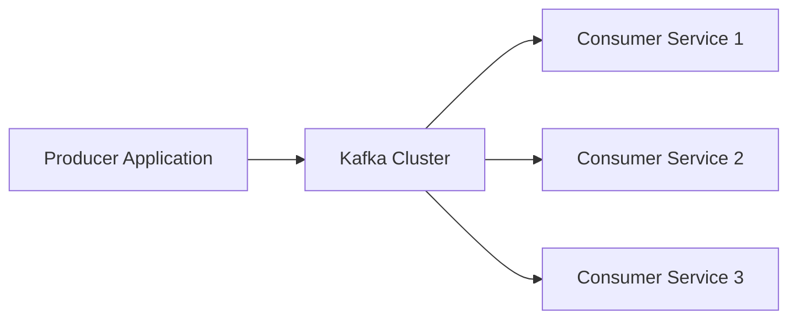
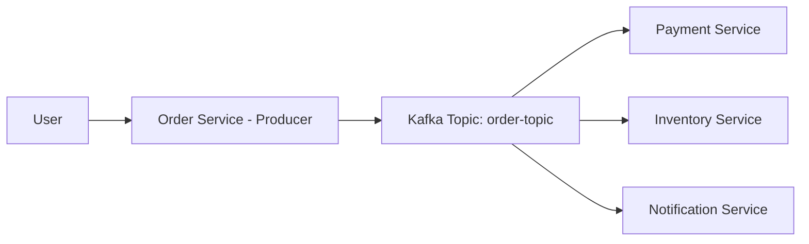
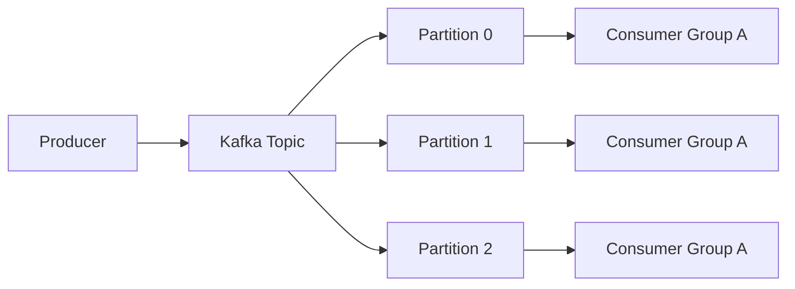

# What is Apache Kafka?

### Introduction

Apache Kafka is a **distributed event-streaming platform** designed to handle very large amounts of data in real time. Kafka can process millions of messages per second, store them safely, and allow multiple consumers to read the same data independently.

In simple words, Kafka allows applications to:

- **Send data** (publish)
- **Store data safely**
- **Process data**
- **Read data** (consume)

It works efficiently even when millions of messages are coming every second.

Kafka is not just a messaging system. It works like:

- A **message broker** (sends data between services)
- A **distributed commit log** (stores data in order)
- A **streaming backbone** for microservices (connects everything)

------

### Why Kafka is Used

Kafka is widely used when:

- Data must **never be lost**
- Data must be processed **very fast**
- The system must **scale horizontally** (add more servers easily)

**Common examples:**

- Order processing
- Payment systems
- Notifications
- Log collection
- Real-time analytics

------

#### How Kafka Works (Simple Architecture)



##### Explanation:

- **Producer** → Sends data to Kafka
- **Kafka Cluster** → Stores data safely
- **Consumers** → Read and process data

Multiple services can read the same data independently.

------

##### Real-Life Example

Imagine an online shopping app:




1. User places an order.
2. Order service sends an event to Kafka.
3. Payment service reads the event.
4. Inventory service reads the same event.
5. Notification service reads it too.

One event. Multiple services. No direct dependency between them.

------

##### Simple Practical Example (Java Producer)

```java
Properties props = new Properties();
props.put("bootstrap.servers", "localhost:9092");
props.put("key.serializer", "org.apache.kafka.common.serialization.StringSerializer");
props.put("value.serializer", "org.apache.kafka.common.serialization.StringSerializer");

KafkaProducer<String, String> producer = new KafkaProducer<>(props);
producer.send(new ProducerRecord<>("orders", "Order Created"));
producer.close();
```

This sends a message `"Order Created"` to the `orders` topic.

---

### Main Components of Apache Kafka

Kafka has several core components that work together:
1. **Producer** – Sends messages to Kafka

2. **Broker** – Kafka server that stores data

3. **Topic** – Logical category of messages

4. **Partition** – Physical split of a topic

5. **Consumer** – Reads messages

6. **Consumer Group** – Multiple consumers working together

7. **Offset** – Position of a message inside a partition

  Each component plays a specific role in making Kafka scalable and fault-tolerant.



------

## Real-Life Example (E-commerce)

User places an order.

Producer:

- Order Service publishes `OrderCreated` event.

Kafka Topic:

- `order-topic`

Consumers:

- Payment Service
- Inventory Service
- Notification Service
- Analytics Service

All consume the **same event independently**.

---

