# Kafka

### What is Event Streaming?

#### Definition

**Event streaming** is the process of **capturing, storing, processing, and delivering data events in real time**.

An **event** means something that happened in a system.

Examples of events:

- Order Created
- Payment Completed
- User Logged In
- Sensor Temperature Updated

Event streaming ensures **data flows continuously from source → processing → destination**.

------

##### Simple Idea

Instead of saving data and processing it later, **systems process data instantly when it happens**.

------

##### Real-Life Analogy

Event streaming is like the **human nervous system**.

- Sensors → detect changes
- Nerves → carry signals
- Brain → processes signals
- Body → reacts immediately

Similarly:

```text
Event Source → Event Stream → Processing System → Action
```

Explanation

- Systems generate events
- Events flow through streams
- Systems process them in real time
- Data is delivered to other systems

------

### What is an Event?

An **event** represents **a change or action in a system**.

Example event structure:

```json
{
  "event": "OrderCreated",
  "orderId": 12345,
  "user": "John",
  "time": "2026-03-05T10:30:00"
}
```

Important parts of an event:

| Field      | Meaning                      |
| ---------- | ---------------------------- |
| Event Type | What happened                |
| Data       | Information related to event |
| Timestamp  | When event occurred          |

------

### Event Streaming Flow

Typical event streaming process:

1. **Event is generated**
2. **Event is captured**
3. **Event is stored**
4. **Event is processed**
5. **Event is delivered to other systems**

------

##### Visual Flow

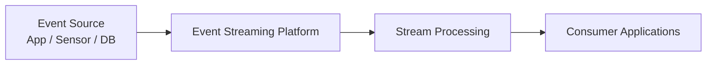

------

#### Common Use Cases of Event Streaming

##### 1. Financial Transactions

Banks process payments instantly.

Example:

1. ATM Withdrawal
2. Credit Card Payment
3. UPI Transfer

------

##### 2. Logistics Tracking

Track vehicles and shipments in real time.

Example:

1. Truck Location Updated
2. Shipment Delivered
3. Fuel Level Updated

------

##### 3. IoT Sensor Monitoring

Factories continuously monitor machines.

Example:

1. Temperature Sensor
2. Pressure Sensor
3. Machine Status

------

##### 4. Customer Activity Tracking

Retail and apps track user actions.

Example:

1. Product Viewed
2. Order Placed
3. Payment Completed

---

### What is Apache Kafka?

#### Introduction

Apache Kafka is a **distributed event-streaming platform** designed to handle very large amounts of data in real time. Kafka can process millions of messages per second, store them safely, and allow multiple consumers to read the same data independently.

In simple words, Kafka allows applications to:

- **Send data** (publish)
- **Store data safely**
- **Process data**
- **Read data** (consume)

It works efficiently even when millions of messages are coming every second.

Kafka is not just a messaging system. It works like:

- A **message broker** (sends data between services)
- A **distributed commit log** (stores data in order)
- A **streaming backbone** for microservices (connects everything)

------

### Why Kafka is Used

Kafka is widely used when:

- Data must **never be lost**
- Data must be processed **very fast**
- The system must **scale horizontally** (add more servers easily)

**Common examples:**

- Order processing
- Payment systems
- Notifications
- Log collection
- Real-time analytics

------

##### How Kafka Works (Simple Architecture)

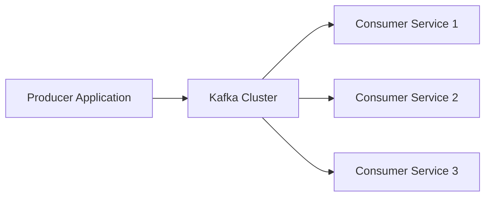

##### Explanation:

- **Producer** → Sends data to Kafka
- **Kafka Cluster** → Stores data safely
- **Consumers** → Read and process data

Multiple services can read the same data independently.

------

##### Real-Life Example

Imagine an online shopping app:


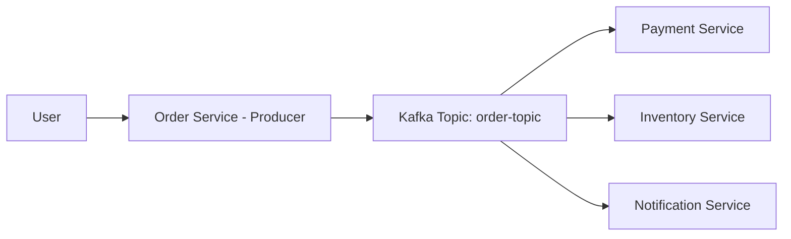

1. User places an order.
2. Order service sends an event to Kafka.
3. Payment service reads the event.
4. Inventory service reads the same event.
5. Notification service reads it too.

One event. Multiple services. No direct dependency between them.

------

##### Simple Practical Example (Java Producer)

```java
Properties props = new Properties();
props.put("bootstrap.servers", "localhost:9092");
props.put("key.serializer", "org.apache.kafka.common.serialization.StringSerializer");
props.put("value.serializer", "org.apache.kafka.common.serialization.StringSerializer");

KafkaProducer<String, String> producer = new KafkaProducer<>(props);
producer.send(new ProducerRecord<>("orders", "Order Created"));
producer.close();
```

This sends a message `"Order Created"` to the `orders` topic.

---

### Main Components of Apache Kafka

Kafka has several core components that work together:
1. **Producer** – Sends messages to Kafka

2. **Broker** – Kafka server that stores data

3. **Topic** – Logical category of messages

4. **Partition** – Physical split of a topic

5. **Consumer** – Reads messages

6. **Consumer Group** – Multiple consumers working together

7. **Offset** – Position of a message inside a partition

  Each component plays a specific role in making Kafka scalable and fault-tolerant.

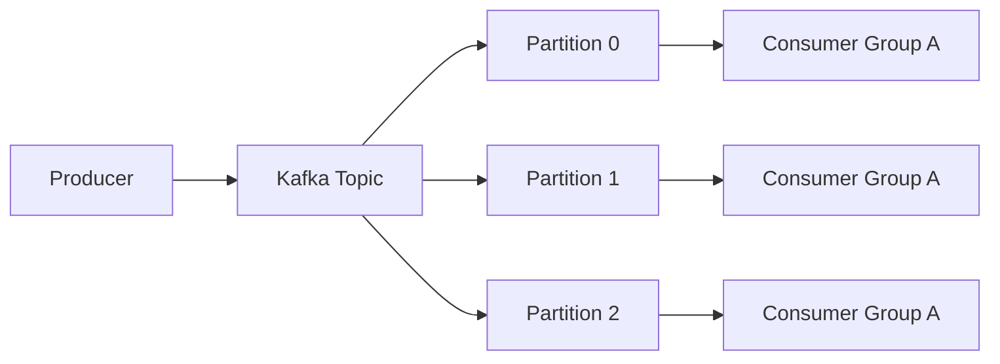

------

##### Real-Life Example (E-commerce)

User places an order.

Producer:

- Order Service publishes `OrderCreated` event.

Kafka Topic:

- `order-topic`

Consumers:

- Payment Service
- Inventory Service
- Notification Service
- Analytics Service

All consume the **same event independently**.

---

## Apache Kafka Core Components 

------

### Kafka Cluster

#### Definition

A **Kafka Cluster** is a **group of multiple Kafka brokers working together** to store and manage data streams.
It provides **high availability, scalability, and fault tolerance**.

If one broker fails, another broker in the cluster can continue serving the data.

------

##### Example

Imagine an **e-commerce system**.

- Order service sends events
- Payment service sends events
- Inventory service sends events

These events are stored across **multiple brokers inside a Kafka cluster** so the system can handle millions of messages.

Example Event:

1. Order Created
2. Payment Completed
3. Inventory Updated

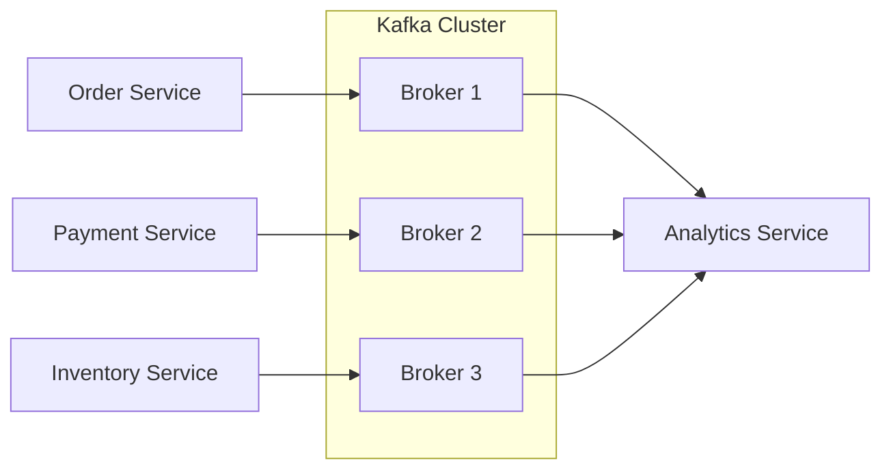

Explanation:

- Multiple brokers together form a **Kafka Cluster**
- Producers send data to the cluster
- Consumers read data from the cluster

------

### Kafka Broker

#### Definition

A **Kafka Broker** is a **Kafka server responsible for receiving, storing, and serving messages**.

Each broker stores **topics and partitions** and handles requests from **producers and consumers**.

Every broker has a **unique broker ID**.

------

##### Example

A banking system publishes transactions:

1. Account Debited
2. Account Credited
3. Transaction Completed

The **Kafka Broker stores these messages inside topic partitions** and provides them to consumers.


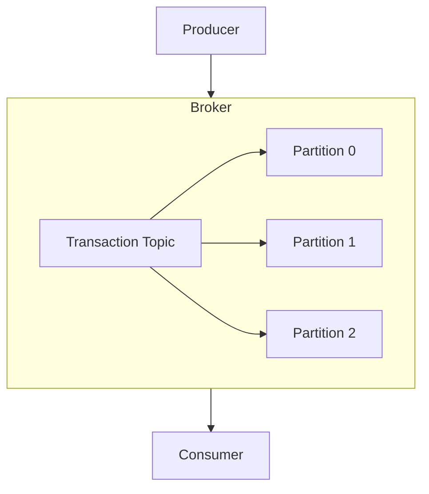

Explanation:

- Broker receives messages
- Stores them in **topics**
- Topics contain **partitions**
- Consumers read messages

------

### Kafka Connect

#### Definition

**Kafka Connect** is a tool used to **integrate Kafka with external systems** like databases, file systems, and cloud storage.

It helps **import data into Kafka or export data from Kafka** without writing custom code.

There are two types:

- **Source Connector** → moves data **into Kafka**
- **Sink Connector** → moves data **from Kafka to another system**

------

##### Example

Banking transaction data stored in **MySQL database** needs to be streamed to Kafka.

Kafka Connect reads data from MySQL and pushes it into Kafka topics.

Example flow:

```
MySQL Database → Kafka Topic → Analytics System
```


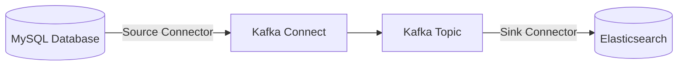

Explanation:

- Source connector imports data from DB
- Sink connector exports data to another system

------

### Kafka Streams

#### Definition

**Kafka Streams** is a **Java library used to process and transform Kafka data in real time**.

It allows developers to perform operations like:

- Filtering
- Aggregation
- Transformation
- Windowing

directly on streaming data.

------

##### Example

An e-commerce system processes order events.

Incoming events:

```cmd
Order Created

Order Cancelled

Order Completed
```

Kafka Streams processes these events to calculate **real-time sales statistics**.

Example result:

```cmd
Total Orders Today: 1500
Total Revenue: $50,000
```


------

##### example 

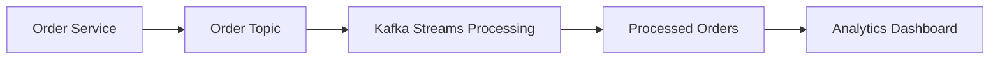

**Explanation:**

- Producer sends events
- Kafka Streams processes events
- Output is stored in another topic
- Consumers read processed data

------

##### Quick Summary Table

| Component     | Purpose                                              |
| ------------- | ---------------------------------------------------- |
| Kafka Cluster | Group of brokers working together                    |
| Kafka Broker  | Server that stores and manages messages              |
| Kafka Connect | Tool to move data between Kafka and external systems |
| Kafka Streams | Library to process Kafka data in real time           |

---

## Kafka Topics and Partitions

------

### Kafka Topic

#### Definition

A **Kafka Topic** is a **logical category or channel where messages (events) are stored**.

Producers **send messages to a topic**, and consumers **read messages from that topic**.

A topic works like a **message category**.

------

##### Example

In an **e-commerce system**, different topics can exist.

1. order-topic
2. payment-topic
3. shipment-topic

Example events in `order-topic`:

- Order Created
- Order Cancelled
- Order Delivered

##### 

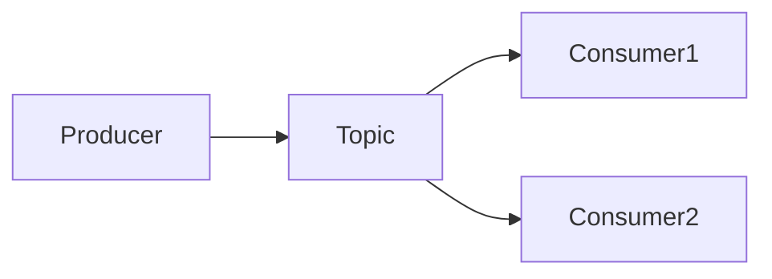

Explanation

- Producer sends messages to **topic**
- Multiple consumers can read messages from the same topic

------

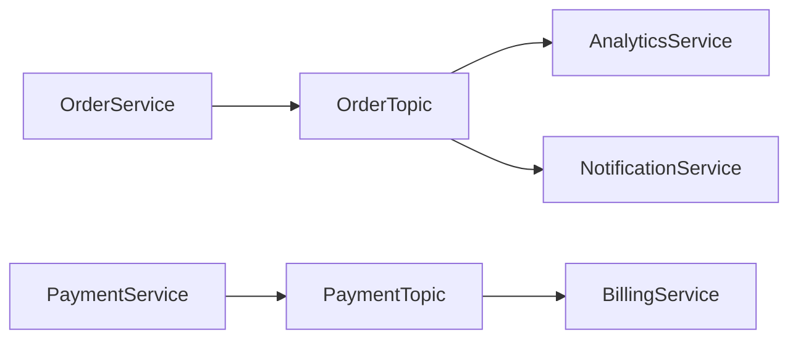

Explanation

- Multiple services produce data
- Data is stored in different topics
- Consumers read topics based on their needs

------

### Kafka Partition

#### Definition

A **Partition** is a **physical division of a Kafka topic used to store data and enable parallel processing**.

Topics are split into **multiple partitions** to improve:

- **Scalability**
- **Performance**
- **Parallel consumption**

Messages inside a partition are stored in **ordered sequence**.

------

##### Example

Topic: `order-topic`

1. Partition 0
2. Partition 1
3. Partition 2

Events stored like:

```text
Partition 0 → Order1, Order4, Order7
Partition 1 → Order2, Order5, Order8
Partition 2 → Order3, Order6, Order9
```

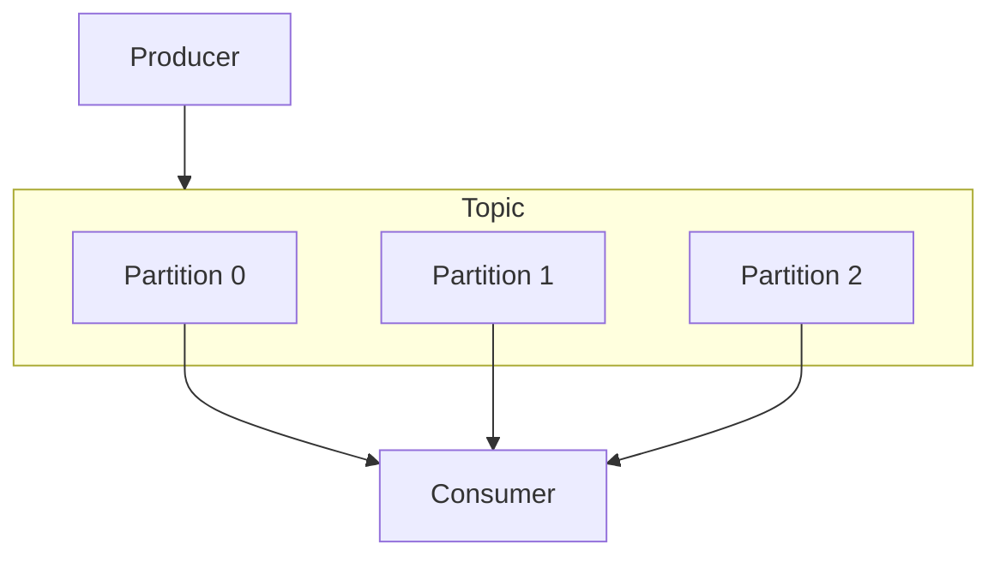

Explanation

- Topic is divided into partitions
- Producers send messages
- Consumers read from partitions

------

#### How Messages Are Stored in Partition

Each message gets an **offset** (unique sequence number).

Example:

```text
Partition 0

Offset 0 → Order Created
Offset 1 → Payment Done
Offset 2 → Order Shipped
```

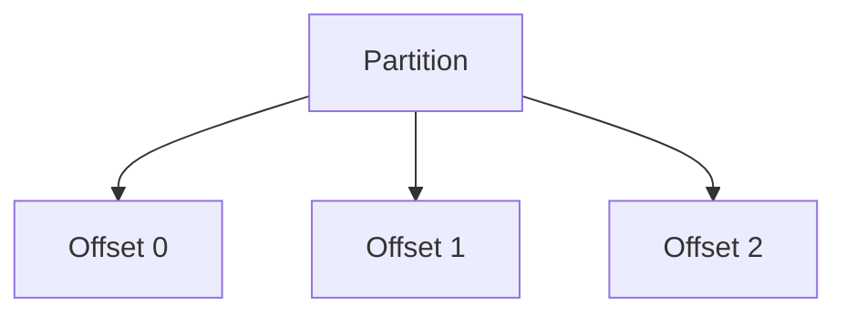

Explanation

- Messages are stored sequentially
- Offset helps consumers track reading position

------

### Why Partitions Are Important

Partitions allow Kafka to **process large volumes of data efficiently**.

Benefits:

| Benefit             | Explanation                                       |
| ------------------- | ------------------------------------------------- |
| Scalability         | Topics can grow with more partitions              |
| Parallel Processing | Multiple consumers read partitions simultaneously |
| High Throughput     | Large number of messages handled                  |
| Fault Tolerance     | Partitions can be replicated across brokers       |

------

##### Example: Parallel Processing

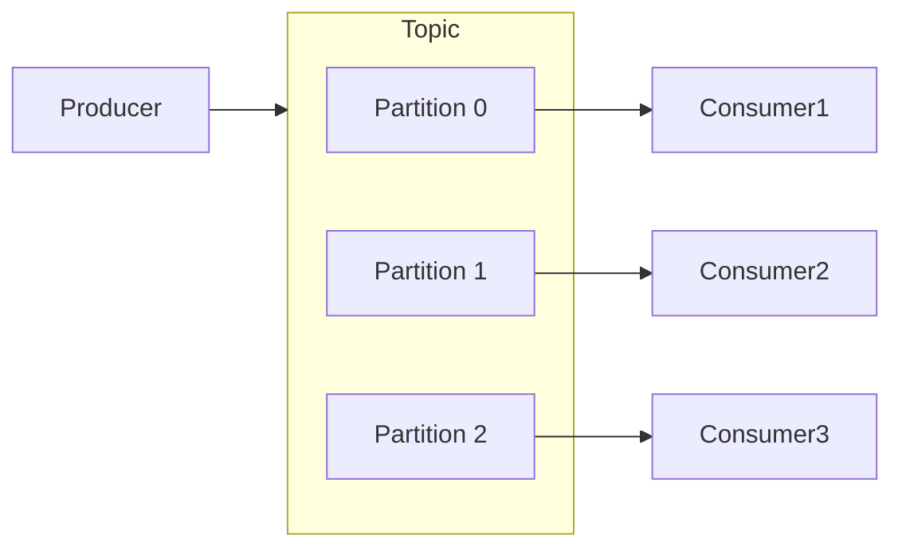

Explanation

- Each consumer reads a **different partition**
- Messages processed **in parallel**
- Improves performance

------

##### Quick Comparison

| Concept   | Meaning                              |
| --------- | ------------------------------------ |
| Topic     | Logical category of messages         |
| Partition | Physical storage unit inside topic   |
| Offset    | Position of message inside partition |

