Virtual threads
LRU cache
Microservice logging
HashMap in depth
Bean lifecycle
Circuit breaker in depth
Memory leak concepts

code 
Longest non repeating char substring


# Virtual Threads

Virtual Threads are **lightweight threads** introduced in Java as part of **Project Loom**.

They allow Java applications to handle **millions of concurrent tasks** efficiently without creating millions of OS threads.

📌 Introduced as:

* Preview → Java 19
* Preview → Java 20
* Stable Feature → Java 21

---

#### Why Virtual Threads?

Traditional Java threads are:

* Heavyweight
* Expensive to create
* High memory usage
* Limited by OS resources

#### Problem with Platform Threads

```text
1 Java Thread = 1 OS Thread
```

Creating thousands of threads leads to:

* Context switching overhead
* High memory consumption
* CPU scheduling issues

---

#### Traditional Thread Model

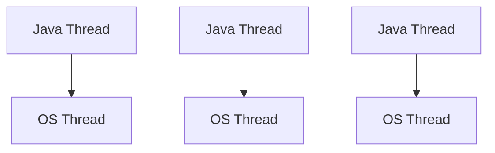

⚠️ Every Java thread directly maps to an OS thread.

---

#### Virtual Thread Model

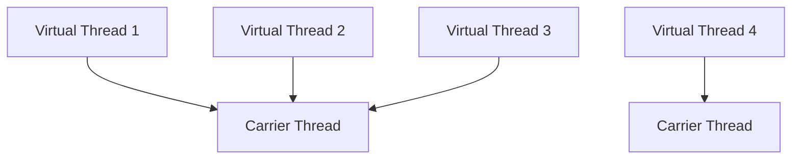

📌 Many virtual threads share a small number of platform threads.

---

##### Key Concepts

| Concept        | Description                                        |
| -------------- | -------------------------------------------------- |
| Virtual Thread | Lightweight JVM-managed thread                     |
| Carrier Thread | Actual OS/platform thread executing virtual thread |
| Mounting       | Virtual thread attached to carrier thread          |
| Unmounting     | Virtual thread detached during blocking operations |
| Scheduler      | JVM schedules virtual threads                      |

---

#### Platform Thread vs Virtual Thread

| Feature        | Platform Thread     | Virtual Thread      |
| -------------- | ------------------- | ------------------- |
| Managed By     | OS                  | JVM                 |
| Cost           | Expensive           | Cheap               |
| Memory         | High                | Low                 |
| Creation Time  | Slow                | Fast                |
| Scalability    | Limited             | Massive             |
| Blocking Calls | Block OS thread     | Thread unmounts     |
| Use Case       | CPU-intensive tasks | I/O-intensive tasks |

---

### Creating Virtual Threads

##### 1️⃣ Using `Thread.ofVirtual()`

```java
public class VirtualDemo {

    public static void main(String[] args) {

        Thread thread = Thread.ofVirtual()
                .start(() -> {
                    System.out.println("Hello Virtual Thread");
                });

    }
}
```

---

##### 2️⃣ Using Executor Service

```java
import java.util.concurrent.ExecutorService;
import java.util.concurrent.Executors;

public class VirtualExecutor {

    public static void main(String[] args) {

        try (ExecutorService executor = Executors.newVirtualThreadPerTaskExecutor()) {

            for (int i = 0; i < 10; i++) {

                int num = i;

                executor.submit(() -> {
                    System.out.println(num + " : " + Thread.currentThread());
                });
            }
        }
    }
}
```

📌 Best approach for production applications.

---

Output Example

```text
VirtualThread[#21]/runnable@ForkJoinPool-1-worker-1
```

---

## How Virtual Threads Work

##### Traditional Thread

```text
Task → OS Thread → CPU
```

##### Virtual Thread

```text
Task → Virtual Thread → Carrier Thread → CPU
```

---

### Blocking in Virtual Threads

##### Traditional Threads

When blocking occurs:

```java
Thread.sleep(1000);
```

OS thread gets blocked.

---

##### Virtual Threads

During blocking:

```text
Virtual Thread unmounts
Carrier Thread becomes free
Another Virtual Thread uses carrier
```

📌 This is the biggest advantage.

---

# Mounting & Unmounting

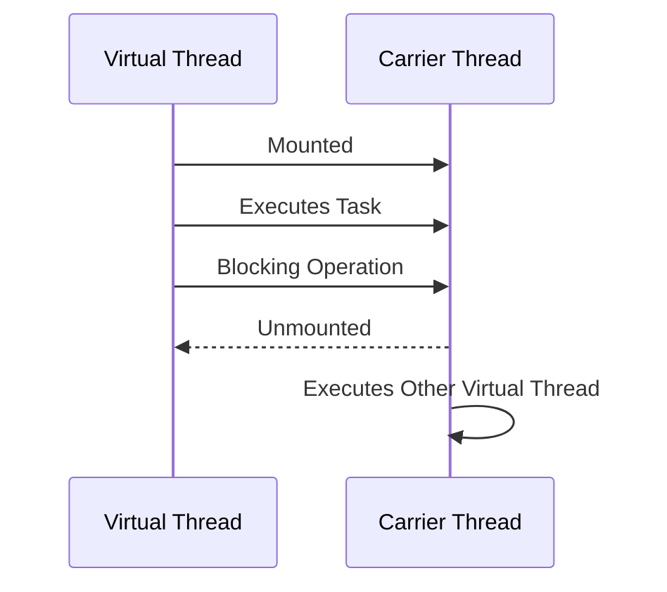

---

# Memory Usage

## Platform Thread

Approx memory:

```text
~1 MB per thread stack
```

10,000 threads:

```text
10 GB+
```

---

## Virtual Thread

Very small stack.

Can create:

```text
Millions of virtual threads
```

---

# Scheduler in Virtual Threads

JVM uses:

```text
ForkJoinPool Scheduler
```

Carrier threads are managed internally.

Default scheduler size:

```text
Number of CPU cores
```

---

# Example: Massive Concurrency

```java
import java.util.concurrent.Executors;

public class MillionThreads {

    public static void main(String[] args) {

        try (var executor =
                     Executors.newVirtualThreadPerTaskExecutor()) {

            for (int i = 0; i < 100000; i++) {

                executor.submit(() -> {
                    Thread.sleep(1000);
                    return null;
                });
            }
        }
    }
}
```

📌 Impossible with platform threads practically.

---

# When to Use Virtual Threads

## ✅ Best For

| Use Case            | Suitable |
| ------------------- | -------- |
| REST APIs           | ✅        |
| Database calls      | ✅        |
| Network calls       | ✅        |
| Microservices       | ✅        |
| File I/O            | ✅        |
| Blocking operations | ✅        |

---

# When NOT to Use

## ❌ Avoid For

| Scenario                    | Reason                  |
| --------------------------- | ----------------------- |
| CPU-intensive tasks         | No benefit              |
| Long synchronized blocks    | Carrier thread blocking |
| Heavy parallel computations | Use ForkJoinPool        |

---

# Pinning Problem ⚠️

## What is Pinning?

When virtual thread cannot unmount from carrier thread.

Carrier thread gets blocked.

---

# Causes of Pinning

## 1️⃣ `synchronized`

```java
synchronized (obj) {
    Thread.sleep(1000);
}
```

⚠️ Virtual thread stays mounted.

---

## 2️⃣ Native Calls

JNI operations may pin carrier thread.

---

# Better Alternative

Use:

```java
ReentrantLock
```

instead of synchronized.

---

# Example

## Bad

```java
synchronized void process() {
    Thread.sleep(1000);
}
```

---

## Better

```java
Lock lock = new ReentrantLock();

lock.lock();
try {
    Thread.sleep(1000);
} finally {
    lock.unlock();
}
```

---

# ThreadLocal with Virtual Threads

Works normally.

But excessive use may increase memory usage.

---

# Structured Concurrency

Introduced with Project Loom.

Helps manage multiple related tasks.

---

# Example

```java
try (var scope = new StructuredTaskScope.ShutdownOnFailure()) {

    Future<String> user =
            scope.fork(() -> getUser());

    Future<String> order =
            scope.fork(() -> getOrders());

    scope.join();

    System.out.println(user.resultNow());
}
```

📌 Cleaner concurrent programming.

---

# Virtual Thread States

Same as normal thread:

| State      |
| ---------- |
| NEW        |
| RUNNABLE   |
| BLOCKED    |
| WAITING    |
| TERMINATED |

---

# Daemon Threads

Virtual threads are always daemon-like.

JVM exits if only virtual threads remain.

---

# Debugging Virtual Threads

## JVM Option

```text
-Djdk.tracePinnedThreads=full
```

Detects pinned threads.

---

# Performance Comparison

| Metric            | Platform Thread | Virtual Thread |
| ----------------- | --------------- | -------------- |
| 10K Threads       | Heavy           | Efficient      |
| Memory            | High            | Low            |
| Startup Time      | Slow            | Fast           |
| Context Switching | Expensive       | Minimal        |

---

# Important APIs

| API                                           | Description            |
| --------------------------------------------- | ---------------------- |
| `Thread.ofVirtual()`                          | Creates virtual thread |
| `Thread.startVirtualThread()`                 | Shortcut creation      |
| `Executors.newVirtualThreadPerTaskExecutor()` | Executor service       |
| `Thread.isVirtual()`                          | Checks virtual thread  |

---

# Useful Methods

## Check Thread Type

```java
System.out.println(Thread.currentThread().isVirtual());
```

---

# Shortcut API

```java
Thread.startVirtualThread(() -> {
    System.out.println("Running");
});
```

---

# Interview Questions & Answers

---

## 1️⃣ What are Virtual Threads?

Virtual threads are lightweight JVM-managed threads that enable massive concurrency with low memory usage.

---

## 2️⃣ Difference Between Platform and Virtual Threads?

| Platform            | Virtual             |
| ------------------- | ------------------- |
| OS-managed          | JVM-managed         |
| Heavyweight         | Lightweight         |
| Limited scalability | Massive scalability |

---

## 3️⃣ Why are Virtual Threads Fast?

Because blocking operations do not block carrier threads.

Virtual threads unmount during blocking.

---

## 4️⃣ What is Carrier Thread?

Platform thread executing virtual threads.

---

## 5️⃣ What is Pinning?

When virtual thread cannot unmount and blocks carrier thread.

---

## 6️⃣ Is Synchronization Bad with Virtual Threads?

Heavy synchronized blocks can reduce scalability.

Prefer `ReentrantLock`.

---

## 7️⃣ Can We Create Millions of Virtual Threads?

Yes.

That is their main advantage.

---

## 8️⃣ Are Virtual Threads Faster for CPU Tasks?

No.

Use traditional thread pools/ForkJoinPool.

---

## 9️⃣ Are Virtual Threads Reactive Programming Replacement?

Partially yes.

They simplify async programming.

---

## 🔟 Are Virtual Threads Green Threads?

Not exactly.

But conceptually similar because JVM manages them.

---

# Virtual Threads vs Reactive Programming

| Feature      | Virtual Threads | Reactive         |
| ------------ | --------------- | ---------------- |
| Coding Style | Sequential      | Async/Functional |
| Complexity   | Simple          | Complex          |
| Debugging    | Easier          | Harder           |
| Scalability  | High            | Very High        |

---

# Best Practices

## ✅ Recommended

* Use for I/O-bound tasks
* Use ExecutorService
* Keep tasks independent
* Prefer `ReentrantLock`

---

## ❌ Avoid

* Excessive synchronization
* CPU-heavy workloads
* ThreadLocal overuse

---

# Real-World Example

## REST API Request Handling

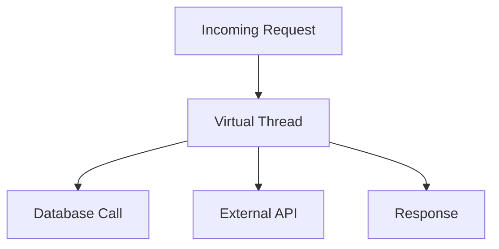

Thousands of requests can be handled efficiently.

---

# Migration Strategy

## Existing Code

Minimal changes needed.

Replace:

```java
Executors.newFixedThreadPool()
```

with:

```java
Executors.newVirtualThreadPerTaskExecutor()
```

---

# Internal Architecture

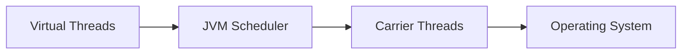

---

# Advantages 🚀

| Benefit                 |
| ----------------------- |
| Massive scalability     |
| Simpler concurrent code |
| Low memory              |
| Better resource usage   |
| Easier debugging        |

---

# Limitations ⚠️

| Limitation                       |
| -------------------------------- |
| Pinning issues                   |
| CPU-bound tasks no gain          |
| Some libraries may not cooperate |
| Native calls can block carriers  |

---

# Summary 🚀

## Virtual Threads

* Lightweight JVM-managed threads
* Designed for high concurrency
* Best for blocking I/O operations
* Introduced fully in Java 21
* Simplify concurrent programming
* Can create millions of threads efficiently

---

# Final Interview Summary

📌 One-Line Definition:

> Virtual Threads are lightweight JVM-managed threads that provide high concurrency with minimal memory overhead.

📌 Best Use Case:

> I/O-bound applications like APIs, DB calls, microservices.

📌 Avoid For:

> CPU-intensive parallel computations.

📌 Biggest Advantage:

> Blocking does not block OS thread.

📌 Biggest Risk:

> Pinning due to synchronized/native calls.

---

----

# LRU Cache (Least Recently Used) in Java

## 📌 Definition

An **LRU Cache** is a data structure that stores a fixed number of items and removes the **least recently used** item when the cache becomes full.

- Recently accessed items stay in cache
- Old unused items are removed first
- Used heavily in:
  - Databases
  - Browsers
  - Operating Systems
  - Redis
  - Microservices
  - JVM caching frameworks

------

# 🧠 Why LRU Cache?

## Problem Without Cache

Every request hits:

- Database
- API
- Disk
- Network

This increases:

- Latency
- CPU usage
- DB load

------

## Solution Using Cache

Store frequently used data in memory.

```text
Request → Cache → Database
```

If data exists in cache → return immediately.

------

# 🚀 Real World Examples

| System    | Usage                  |
| --------- | ---------------------- |
| Browser   | Recently visited pages |
| YouTube   | Video metadata caching |
| Redis     | Session cache          |
| JVM       | Object caching         |
| OS        | Page replacement       |
| Hibernate | First-level cache      |

------

# 📌 Key Characteristics

| Feature         | Description                      |
| --------------- | -------------------------------- |
| Fixed Capacity  | Cache size limited               |
| Fast Access     | O(1) lookup                      |
| Eviction Policy | Removes least recently used item |
| Ordered Access  | Recent items move to front       |

------

# 🧠 Core Idea

Whenever data is used:

- Move it to the front (most recent)

When cache is full:

- Remove last item (least recent)

------

# 📌 Operations

| Operation      | Description         |
| -------------- | ------------------- |
| get(key)       | Retrieve value      |
| put(key,value) | Insert/update value |
| remove(key)    | Remove entry        |
| evict()        | Remove LRU item     |

------

# 📌 Time Complexity Goal

| Operation | Expected |
| --------- | -------- |
| get       | O(1)     |
| put       | O(1)     |
| delete    | O(1)     |

------

# 🧠 Data Structures Used

To achieve O(1):

| Data Structure     | Purpose              |
| ------------------ | -------------------- |
| HashMap            | Fast lookup          |
| Doubly Linked List | Maintain usage order |

------

# 📌 Why Doubly Linked List?

Because we need:

- Fast deletion
- Fast movement

Singly linked list cannot delete node in O(1).

------

# 🧠 Architecture

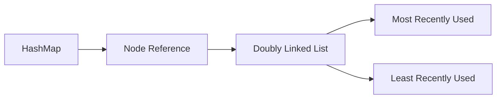

------

# 📌 Node Structure

Each node stores:

```java
class Node {
    int key;
    int value;

    Node prev;
    Node next;
}
```

------

# 🧠 Internal Working

## Example

Capacity = 3

```text
put(1,10)
put(2,20)
put(3,30)

Cache:
3 -> 2 -> 1
```

Now:

```text
get(1)
```

Move 1 to front:

```text
1 -> 3 -> 2
```

Now:

```text
put(4,40)
```

Remove least recently used = 2

```text
4 -> 1 -> 3
```

------

# 🚀 Full LRU Cache Implementation (Optimal)

## 📌 Using HashMap + Doubly Linked List

```java
import java.util.HashMap;
import java.util.Map;

public class LRUCache {

    class Node {
        int key;
        int value;

        Node prev;
        Node next;

        Node(int key, int value) {
            this.key = key;
            this.value = value;
        }
    }

    private final int capacity;

    private final Map<Integer, Node> map;

    private final Node head;
    private final Node tail;

    public LRUCache(int capacity) {
        this.capacity = capacity;
        this.map = new HashMap<>();

        head = new Node(0, 0);
        tail = new Node(0, 0);

        head.next = tail;
        tail.prev = head;
    }

    public int get(int key) {

        if (!map.containsKey(key)) {
            return -1;
        }

        Node node = map.get(key);

        remove(node);
        insert(node);

        return node.value;
    }

    public void put(int key, int value) {

        if (map.containsKey(key)) {
            remove(map.get(key));
        }

        if (map.size() == capacity) {

            Node lru = tail.prev;

            remove(lru);
        }

        Node newNode = new Node(key, value);

        insert(newNode);
    }

    private void remove(Node node) {

        map.remove(node.key);

        node.prev.next = node.next;
        node.next.prev = node.prev;
    }

    private void insert(Node node) {

        map.put(node.key, node);

        Node nextNode = head.next;

        head.next = node;
        node.prev = head;

        node.next = nextNode;
        nextNode.prev = node;
    }

    public void printCache() {

        Node current = head.next;

        while (current != tail) {
            System.out.print(
                "[" + current.key + "=" + current.value + "] "
            );

            current = current.next;
        }

        System.out.println();
    }

    public static void main(String[] args) {

        LRUCache cache = new LRUCache(3);

        cache.put(1, 10);
        cache.put(2, 20);
        cache.put(3, 30);

        cache.printCache();

        cache.get(1);

        cache.printCache();

        cache.put(4, 40);

        cache.printCache();
    }
}
```

------

# 📌 Output

```text
[3=30] [2=20] [1=10]

[1=10] [3=30] [2=20]

[4=40] [1=10] [3=30]
```

------

# 🧠 Step-by-Step Dry Run

## Initial

```text
EMPTY
```

------

## put(1,10)

```text
1
```

------

## put(2,20)

```text
2 -> 1
```

------

## get(1)

Move 1 to front

```text
1 -> 2
```

------

## put(3,30)

```text
3 -> 1 -> 2
```

------

## put(4,40)

Evict 2

```text
4 -> 3 -> 1
```

------

# 📌 Why Dummy Head & Tail?

Dummy nodes simplify:

- Insertions
- Deletions
- Edge cases

Without checking:

- null
- first node
- last node

------

# ⚠️ Common Mistakes

## ❌ Forgetting to Move Node

```java
get()
```

must move node to front.

------

## ❌ Using Singly Linked List

Deletion becomes O(n).

------

## ❌ Not Updating Existing Key

```java
put(existingKey)
```

must:

- update value
- move to front

------

## ❌ Forgetting Eviction

Must remove:

- from map
- from linked list

------

# 📌 Complexity Analysis

| Operation | Complexity |
| --------- | ---------- |
| get       | O(1)       |
| put       | O(1)       |
| remove    | O(1)       |
| insert    | O(1)       |

------

# 🧠 Why HashMap Gives O(1)?

HashMap stores:

```text
key -> Node Reference
```

No traversal needed.

------

# 📌 Java Built-in LRU Cache

Java provides:

```java
LinkedHashMap
```

with access order.

------

# 🚀 Simplified LRU Using LinkedHashMap

```java
import java.util.LinkedHashMap;
import java.util.Map;

public class LRUCache<K, V>
        extends LinkedHashMap<K, V> {

    private final int capacity;

    public LRUCache(int capacity) {

        super(capacity, 0.75f, true);

        this.capacity = capacity;
    }

    @Override
    protected boolean removeEldestEntry(
            Map.Entry<K, V> eldest) {

        return size() > capacity;
    }

    public static void main(String[] args) {

        LRUCache<Integer, String> cache =
                new LRUCache<>(3);

        cache.put(1, "A");
        cache.put(2, "B");
        cache.put(3, "C");

        cache.get(1);

        cache.put(4, "D");

        System.out.println(cache);
    }
}
```

------

# 📌 Output

```text
{3=C, 1=A, 4=D}
```

------

# 🧠 accessOrder = true

```java
super(capacity, 0.75f, true);
```

## Meaning

```text
true → access order
false → insertion order
```

------

# 📌 LinkedHashMap Internals

Internally uses:

- HashMap
- Doubly Linked List

Exactly same concept.

------

# ⚠️ Interview Follow-Up

## Why Not Use Only HashMap?

HashMap cannot maintain usage order.

------

## Why Not Use Only Linked List?

Search becomes O(n).

------

## Why Doubly Linked List?

Need:

- bidirectional movement
- O(1) deletion

------

# 📌 Thread Safety

Normal LRU Cache is NOT thread-safe.

------

# 🚀 Thread-Safe Approaches

| Approach          | Description       |
| ----------------- | ----------------- |
| synchronized      | Simple locking    |
| ReentrantLock     | Better control    |
| ConcurrentHashMap | Concurrent access |
| Caffeine Cache    | Production-grade  |

------

# 🧠 Thread-Safe Example

```java
public synchronized int get(int key) {
    return cache.get(key);
}
```

------

# 📌 Production Cache Libraries

| Library   | Features           |
| --------- | ------------------ |
| Caffeine  | High performance   |
| Ehcache   | Enterprise caching |
| Redis     | Distributed cache  |
| Hazelcast | In-memory grid     |

------

# 🚀 Caffeine Example

```java
Cache<Integer, String> cache =
    Caffeine.newBuilder()
        .maximumSize(100)
        .expireAfterWrite(10, TimeUnit.MINUTES)
        .build();
```

------

# 📌 LRU vs LFU

| Feature     | LRU                 | LFU                   |
| ----------- | ------------------- | --------------------- |
| Removes     | Least recently used | Least frequently used |
| Simpler     | Yes                 | No                    |
| Performance | Faster              | Slightly slower       |
| Best For    | Temporal locality   | Frequency locality    |

------

# 🧠 LRU vs FIFO

| LRU                         | FIFO                    |
| --------------------------- | ----------------------- |
| Removes least recently used | Removes oldest inserted |
| Usage based                 | Time based              |
| Better hit ratio            | Simpler                 |

------

# 📌 Cache Eviction Policies

| Policy | Meaning               |
| ------ | --------------------- |
| LRU    | Least Recently Used   |
| LFU    | Least Frequently Used |
| FIFO   | First In First Out    |
| Random | Random removal        |
| TTL    | Time-based expiry     |

------

# 🚀 Advanced Interview Topics

## Soft References

Used in JVM caches.

```java
SoftReference<User>
```

Garbage collector removes when memory low.

------

## Weak References

```java
WeakReference<User>
```

GC removes aggressively.

------

# 📌 Distributed LRU Cache

In distributed systems:

- Redis cluster
- Hazelcast
- Memcached

Challenges:

- synchronization
- replication
- consistency

------

# 🧠 System Design Perspective

## Where Cache Exists

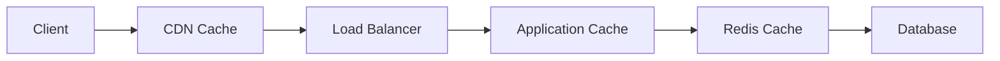

------

# 📌 Interview Questions

## Basic

1. What is LRU Cache?
2. Why use Doubly Linked List?
3. Why HashMap?
4. Complexity of operations?
5. Difference between FIFO and LRU?

------

## Intermediate

1. How does LinkedHashMap implement LRU?
2. Why dummy nodes?
3. How to make thread-safe?
4. Why not TreeMap?
5. What happens during eviction?

------

## Advanced

1. How does Redis eviction work?
2. Difference between local and distributed cache?
3. How does Caffeine improve performance?
4. Explain cache stampede
5. Explain cache invalidation

------

# ⚠️ Cache Problems

| Problem           | Meaning                             |
| ----------------- | ----------------------------------- |
| Cache Miss        | Data absent                         |
| Cache Hit         | Data found                          |
| Cache Stampede    | Many requests hit DB simultaneously |
| Cache Penetration | Invalid requests bypass cache       |
| Cache Avalanche   | Multiple cache expiry together      |

------

# 🚀 Best Practices

## 📌 Keep Cache Small

Large cache:

- increases memory
- GC pressure

------

## 📌 Use Expiry

```text
TTL (Time To Live)
```

Avoid stale data.

------

## 📌 Avoid Over-Caching

Cache only:

- frequently used
- expensive operations

------

# 🧠 Summary

| Topic         | Key Point                        |
| ------------- | -------------------------------- |
| LRU           | Removes least recently used item |
| Core DS       | HashMap + Doubly Linked List     |
| Complexity    | O(1)                             |
| Java Built-in | LinkedHashMap                    |
| Production    | Caffeine / Redis                 |
| Thread Safety | Requires synchronization         |

------

# 🚀 Final Interview Summary

## Must Remember

✅ HashMap + DLL

✅ O(1) get/put

✅ Move accessed node to front

✅ Remove least recent from tail

✅ LinkedHashMap internally uses same idea

✅ Doubly linked list required for O(1) deletion

✅ Very common system design interview topic

---


# **Memory Leak in Java**

##### **📌 Definition**

A **memory leak** in Java happens when:

- Objects are no longer needed
- But references to those objects still exist
- Therefore Garbage Collector (GC) cannot reclaim memory

Result:

- Heap memory keeps increasing
- Frequent GC pauses
- Performance degradation
- `OutOfMemoryError`

------

##### **🧠 Important Understanding**

Java has Garbage Collection.

But GC only removes:

- **Unreachable objects**

If object is still reachable:

- GC cannot remove it
- Even if application no longer uses it

------

##### **📌 Simple Visualization**

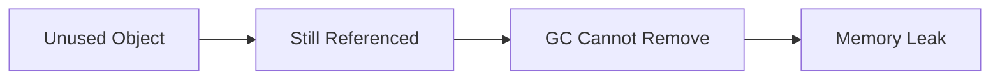

------

##### **📌 Real Meaning of Memory Leak**

Memory leak does NOT mean:

```text
memory is never freed
```

It means:

```text
unused objects remain reachable
```

------

##### **🧠 Why Memory Leaks Happen**

Main reason:

```text
Objects retained unintentionally
```

------

##### **📌 Common Causes of Memory Leaks**

| Cause                        | Problem                    |
| ---------------------------- | -------------------------- |
| Static collections           | Objects live forever       |
| Unclosed resources           | File/socket/DB leak        |
| ThreadLocal misuse           | Threads retain data        |
| Listeners not removed        | Object references retained |
| Infinite cache growth        | Heap fills continuously    |
| Non-static inner classes     | Outer object retained      |
| Long-lived collections       | Objects accumulate         |
| ExecutorService not shutdown | Threads remain alive       |

------

##### **📌 JVM Memory Structure**

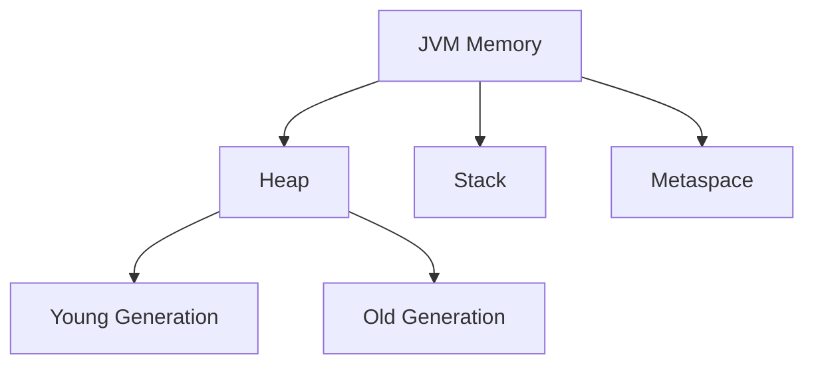

Memory leaks mostly occur in:

```text
Heap Memory
```

------

##### **📌 Heap Memory Generations**

| Generation | Purpose            |
| ---------- | ------------------ |
| Young Gen  | New objects        |
| Old Gen    | Long-lived objects |
| Metaspace  | Class metadata     |

Leak usually affects:

```text
Old Generation
```

------

##### **🧠 Memory Leak Lifecycle**

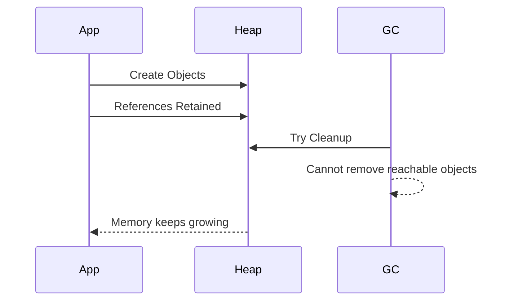

------

##### **📌 Example 1 — Static Collection Leak**

##### **❌ Bad Example**

```java
import java.util.ArrayList;
import java.util.List;

public class MemoryLeakDemo {

    private static final List<String> list =
            new ArrayList<>();

    public void addData() {

        for (int i = 0; i < 100000; i++) {
            list.add("Data-" + i);
        }
    }
}
```

------

##### **🧠 Why This Causes Leak**

Static variables:

- Live entire application lifecycle
- Never garbage collected

Objects remain in memory forever.

------

##### **✅ Solution**

```java
list.clear();
```

OR use:

- bounded cache
- eviction policy

------

##### **📌 Example 2 — Unclosed Resource Leak**

##### **❌ Problem**

```java
FileInputStream fis =
        new FileInputStream("test.txt");
```

Stream never closed.

------

##### **🧠 Resources That Leak**

| Resource       | Problem               |
| -------------- | --------------------- |
| File Streams   | File handles          |
| DB Connections | Pool exhaustion       |
| Sockets        | Network resource leak |
| Threads        | Memory + CPU usage    |

------

##### **✅ Correct Approach**

```java
try (FileInputStream fis =
         new FileInputStream("test.txt")) {

}
```

------

##### **📌 try-with-resources**

Automatically closes:

- streams
- sockets
- connections

------

##### **📌 Example 3 — ThreadLocal Memory Leak**

##### **❌ Problem**

```java
private static final ThreadLocal<User>
        userHolder = new ThreadLocal<>();

userHolder.set(new User());
```

No cleanup.

------

##### **🧠 Why Dangerous**

In thread pools:

- Threads reused
- Old ThreadLocal data remains attached

Memory accumulates slowly.

------

##### **✅ Correct**

```java
try {

    userHolder.set(user);

} finally {

    userHolder.remove();
}
```

------

##### **📌 ThreadLocal Leak Visualization**

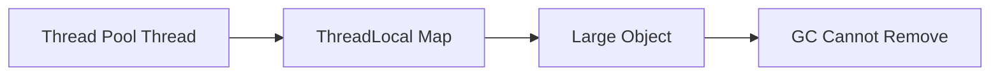

------

##### **📌 Example 4 — Cache Memory Leak**

##### **❌ Unlimited Cache**

```java
Map<Integer, User> cache =
        new HashMap<>();
```

Cache grows infinitely.

------

##### **🧠 Why Problem Happens**

Objects continuously added:

- never removed
- heap usage grows

------

##### **✅ Better Solution**

Use:

- LRU cache
- TTL expiration
- Caffeine cache

------

##### **🚀 Caffeine Example**

```java
Cache<Integer, User> cache =
    Caffeine.newBuilder()
        .maximumSize(1000)
        .expireAfterWrite(
            10, TimeUnit.MINUTES)
        .build();
```

------

##### **📌 Example 5 — Listener Leak**

##### **❌ Problem**

```java
button.addActionListener(listener);
```

Listener never removed.

------

##### **🧠 Issue**

UI/Event system still references object.

GC cannot remove it.

------

##### **✅ Correct**

```java
button.removeActionListener(listener);
```

------

##### **📌 Example 6 — Inner Class Leak**

##### **❌ Non-static Inner Class**

```java
class Outer {

    class Inner {

    }
}
```

------

##### **🧠 Why Leak Happens**

Inner class holds implicit reference to:

```text
Outer class instance
```

Outer object survives unexpectedly.

------

##### **✅ Solution**

```java
static class Inner {

}
```

------

##### **📌 Strong Reference**

##### **Definition**

Default Java reference.

```java
User user = new User();
```

GC cannot remove object.

------

##### **📌 Weak Reference**

```java
WeakReference<User> ref =
        new WeakReference<>(new User());
```

GC can remove object.

------

##### **📌 Soft Reference**

Used for:

- memory-sensitive caches

```java
SoftReference<Image> ref;
```

Removed only when memory low.

------

##### **📌 Phantom Reference**

Advanced cleanup mechanism.

Used with:

```java
ReferenceQueue
```

------

##### **📌 Reference Comparison**

| Reference Type | GC Behavior                    |
| -------------- | ------------------------------ |
| Strong         | Never removed while referenced |
| Weak           | Removed aggressively           |
| Soft           | Removed under memory pressure  |
| Phantom        | Cleanup tracking               |

------

##### **📌 WeakHashMap**

##### **Definition**

Automatically removes entries when key no longer referenced.

------

##### **🚀 Example**

```java
Map<User, String> map =
        new WeakHashMap<>();
```

Useful for:

- metadata cache
- temporary mappings

------

##### **📌 Circular References**

##### **Question**

Can circular references cause memory leak?

##### **Answer**

❌ No

Java GC handles circular references.

------

##### **Example**

```java
A → B
B → A
```

If unreachable from GC roots:

- both objects removed

------

##### **📌 GC Roots**

GC starts traversal from:

- static variables
- active threads
- JNI references
- stack references

Objects reachable from GC roots survive.

------

##### **📌 Memory Leak Detection**

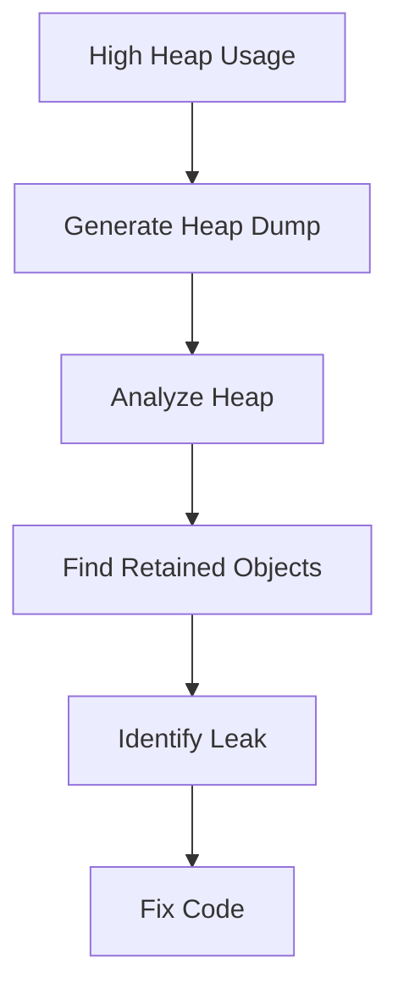

------

##### **📌 Heap Dump**

##### **Definition**

Snapshot of JVM memory.

Contains:

- objects
- references
- memory usage

------

##### **🚀 Generate Heap Dump**

```bash
jmap -dump:live,format=b,file=heap.hprof <pid>
```

------

##### **📌 Heap Dump Analysis Tools**

| Tool                 | Purpose         |
| -------------------- | --------------- |
| Eclipse MAT          | Leak analysis   |
| VisualVM             | Heap monitoring |
| JProfiler            | Profiling       |
| YourKit              | JVM diagnostics |
| Java Mission Control | JVM monitoring  |

------

##### **📌 Eclipse MAT Important Concepts**

| Term           | Meaning                        |
| -------------- | ------------------------------ |
| Dominator Tree | Largest memory retainers       |
| Retained Heap  | Memory freed if object removed |
| Leak Suspects  | Potential leak paths           |
| GC Roots       | Root references                |

------

##### **📌 Retained Heap**

##### **Definition**

Memory that becomes free if object removed.

Large retained heap:

```text
Potential memory leak
```

------

##### **📌 Dominator Tree**

Shows:

- which object retains maximum memory

Very important for interviews.

------

##### **📌 OutOfMemoryError Types**

| Error                      | Meaning                  |
| -------------------------- | ------------------------ |
| Java heap space            | Heap exhausted           |
| GC overhead limit exceeded | GC ineffective           |
| Metaspace                  | Class metadata exhausted |
| Direct buffer memory       | Native memory leak       |

------

##### **📌 Heap Leak vs Metaspace Leak**

| Heap Leak             | Metaspace Leak                  |
| --------------------- | ------------------------------- |
| Object retention      | Class metadata retention        |
| Heap grows            | Metaspace grows                 |
| Common in collections | Common in dynamic class loading |

------

##### **📌 Metaspace Leak**

Usually caused by:

- repeated class loading
- custom class loaders
- application redeployment

------

##### **📌 ExecutorService Leak**

##### **❌ Problem**

```java
ExecutorService service =
        Executors.newFixedThreadPool(10);
```

Never shutdown.

------

##### **🧠 Problem**

Threads remain alive:

- memory retained
- resources retained

------

##### **✅ Correct**

```java
service.shutdown();
```

------

##### **📌 Database Connection Leak**

##### **Problem**

Connections not returned to pool.

Eventually:

```text
Pool exhausted
```

------

##### **✅ Correct**

```java
try (
    Connection con =
        dataSource.getConnection()
) {

}
```

------

##### **📌 Hibernate/JPA Memory Leak**

##### **Common Cause**

Persistence context grows continuously.

------

##### **🚀 Example**

```java
entityManager.persist(entity);
```

Repeated in loop without cleanup.

------

##### **✅ Solution**

```java
entityManager.clear();
```

during batch processing.

------

##### **📌 Spring Boot Memory Leaks**

##### **Common Causes**

| Cause           | Problem               |
| --------------- | --------------------- |
| Static beans    | Long-lived references |
| ThreadLocal     | Retained request data |
| Huge sessions   | Heap growth           |
| Unbounded cache | Memory exhaustion     |

------

##### **📌 Symptoms of Memory Leak**

| Symptom          | Description         |
| ---------------- | ------------------- |
| Increasing heap  | Memory not released |
| Frequent Full GC | JVM struggling      |
| Slow performance | GC pauses           |
| High CPU         | Excessive GC        |
| OOM error        | Heap exhausted      |

------

##### **📌 Memory Leak vs High Memory Usage**

| Memory Leak           | High Usage            |
| --------------------- | --------------------- |
| Unnecessary retention | Legitimate memory use |
| Memory never freed    | Memory reused         |
| Dangerous             | Sometimes normal      |

------

##### **📌 JVM Options for Debugging**

##### **Heap Dump on OOM**

```bash
-XX:+HeapDumpOnOutOfMemoryError
```

------

##### **Heap Dump Path**

```bash
-XX:HeapDumpPath=/logs/heapdump.hprof
```

------

##### **📌 Monitoring Tools**

| Tool       | Usage          |
| ---------- | -------------- |
| Prometheus | Metrics        |
| Grafana    | Dashboard      |
| JMX        | JVM monitoring |
| Micrometer | Spring metrics |

------

##### **📌 Best Practices**

##### **✅ Avoid Static Collections**

Do not store unnecessary objects globally.

------

##### **✅ Use try-with-resources**

Always close:

- files
- sockets
- DB connections

------

##### **✅ Remove ThreadLocal Values**

Always:

```java
remove()
```

------

##### **✅ Use Bounded Cache**

Never unlimited cache.

------

##### **✅ Monitor Heap Usage**

Track:

- heap growth
- GC activity
- object count

------

##### **✅ Shutdown Thread Pools**

Prevent thread retention.

------

##### **📌 Production Memory Leak Debugging**

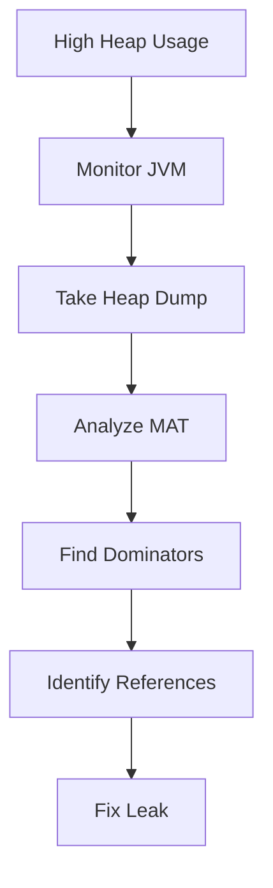

------

##### **📌 Important Interview Points**

| Topic               | Key Point                         |
| ------------------- | --------------------------------- |
| Java leaks possible | Because reachable objects survive |
| Static variables    | Common leak source                |
| ThreadLocal         | Dangerous with thread pools       |
| WeakReference       | Allows GC                         |
| Heap dump           | Snapshot of heap                  |
| MAT                 | Most popular analyzer             |
| Circular references | NOT leak alone                    |
| try-with-resources  | Prevents resource leak            |

------

##### **🚀 Final Summary**

##### **Must Remember**

✅ Java CAN have memory leaks

✅ GC removes only unreachable objects

✅ Static collections are dangerous

✅ ThreadLocal requires `remove()`

✅ Use bounded cache

✅ Heap dump + MAT are key tools

✅ Circular references alone are NOT leaks

✅ Monitor heap and GC in production

✅ Use try-with-resources for cleanup


---


In microservices architecture, a **Circuit Breaker** is a design pattern used to prevent a failure in one service from cascading down to other services. Think of it exactly like an electrical circuit breaker in your house: when a fault occurs (like a short circuit), the breaker trips to stop the flow of electricity, protecting the rest of your home.

In Spring Boot, the modern standard for implementing this pattern is **Resilience4j** (which replaced the deprecated Netflix Hystrix).

---

## 1. The Three Core States

A circuit breaker operates as a finite state machine with three main states:

* **CLOSED:** Everything is working normally. Requests flow directly to the downstream service. The circuit breaker monitors the success/failure rate of these calls.
* **OPEN:** The downstream service is failing, and the error threshold has been breached. The circuit breaker **trips**, meaning it immediately rejects incoming requests and diverts them to a fallback method without hitting the broken service. This gives the service time to recover.
* **HALF-OPEN:** After a configured wait duration, the circuit breaker enters this state to test if the underlying service has recovered. It permits a limited, configurable number of requests to pass through.
* If they **succeed**, the circuit closes, and normal operation resumes.
* If they **fail**, the circuit trips back to **OPEN**.


---

## 2. Sliding Windows: How Failure is Calculated

Resilience4j doesn't just look at the *last* request; it uses a **Sliding Window** to evaluate metrics. You can configure this in two ways:

1. **Count-Based Sliding Window:** Evaluates the last `N` requests (e.g., the last 100 calls). If 50% of those 100 calls fail, the circuit opens.
2. **Time-Based Sliding Window:** Evaluates requests made in the last `N` seconds (e.g., the last 30 seconds).

---

## 3. Implementing Resilience4j in Spring Boot

### Step 1: Add Dependencies

To get started, add the Resilience4j starter along with Spring Boot AOP (required for annotations) to your `pom.xml`:

```xml
<dependency>
    <groupId>io.github.resilience4j</groupId>
    <groupId>resilience4j-spring-boot3</groupId>
    <version>2.2.0</version> </dependency>
<dependency>
    <groupId>org.springframework.boot</groupId>
    <artifactId>spring-boot-starter-aop</artifactId>
</dependency>

```

### Step 2: Configure via `application.yml`

This is where the "in-depth" control happens. You fine-tune how and when the circuit trips:

```yaml
resilience4j:
  circuitbreaker:
    instances:
      inventoryService:
        slidingWindowType: COUNT_BASED
        slidingWindowSize: 10              # Tracks the last 10 requests
        failureRateThreshold: 50           # Trips if 50% (5 out of 10) fail
        slowCallRateThreshold: 70          # Trips if 70% of calls take too long
        slowCallDurationThreshold: 2000ms  # A call taking > 2s is considered "slow"
        waitDurationInOpenState: 10000ms   # Waits 10s in OPEN before moving to HALF-OPEN
        permittedNumberOfCallsInHalfOpenState: 3 # Sends 3 trial requests in HALF-OPEN
        automaticTransitionFromOpenToHalfOpenEnabled: true

```

### Step 3: Coding the Circuit Breaker & Fallback

Apply the `@CircuitBreaker` annotation to your service method. You should always supply a `fallbackMethod` to handle the failure gracefully.

```java
import io.github.resilience4j.circuitbreaker.annotation.CircuitBreaker;
import org.springframework.stereotype.Service;
import org.springframework.web.client.RestTemplate;

@Service
public class OrderService {

    private final RestTemplate restTemplate;

    public OrderService(RestTemplate restTemplate) {
        this.restTemplate = restTemplate;
    }

    // "inventoryService" matches the key used in application.yml
    @CircuitBreaker(name = "inventoryService", fallbackMethod = "getInventoryFallback")
    public String checkInventory(Long productId) {
        return restTemplate.getForObject("http://inventory-service/api/products/" + productId, String.class);
    }

    // The fallback method MUST have the same signature as the core method, 
    // plus an extra parameter for the Exception caught.
    public String getInventoryFallback(Long productId, Throwable throwable) {
        // Log the error and return cached or default data
        System.out.println("Circuit is OPEN or Service failed. Error: " + throwable.getMessage());
        return "Inventory status temporarily unavailable (Fallback Data)";
    }
}

```

---

## 4. Advanced Production Concepts

When architecting production-grade microservices, keep these core behaviors in mind:

* **Thread Safety:** Resilience4j is built on Top of `Vavr`, utilizing atomic operations and functional data structures. It is completely thread-safe with very low memory overhead.
* **Exception Handling (Ignore vs. Record):** By default, all exceptions count as failures. However, you don't want a `404 Not Found` (client error) to trip a circuit meant to catch server crashes. You can configure this explicitly:
```yaml
resilience4j.circuitbreaker.instances.inventoryService:
  recordExceptions:
    - org.springframework.web.client.HttpServerErrorException # Count 5xx
  ignoreExceptions:
    - org.springframework.web.client.HttpClientErrorException # Ignore 4xx

```


* **Monitoring with Actuator:** You can expose the state of your circuit breakers to monitoring tools like Prometheus and Grafana. By adding `spring-boot-starter-actuator`, you gain access to the `/actuator/circuitbreakers` endpoint to view real-time failure rates and states.