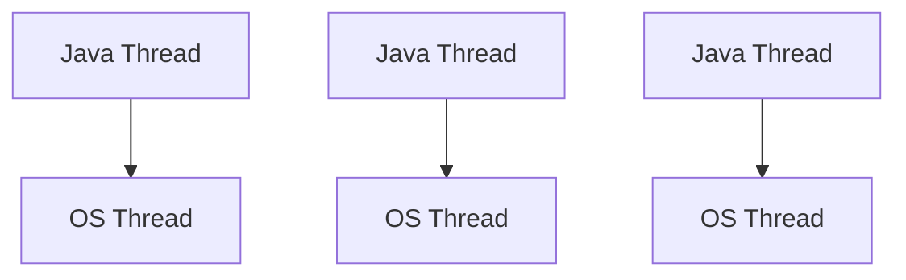
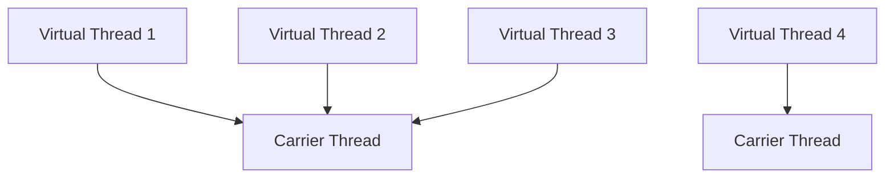
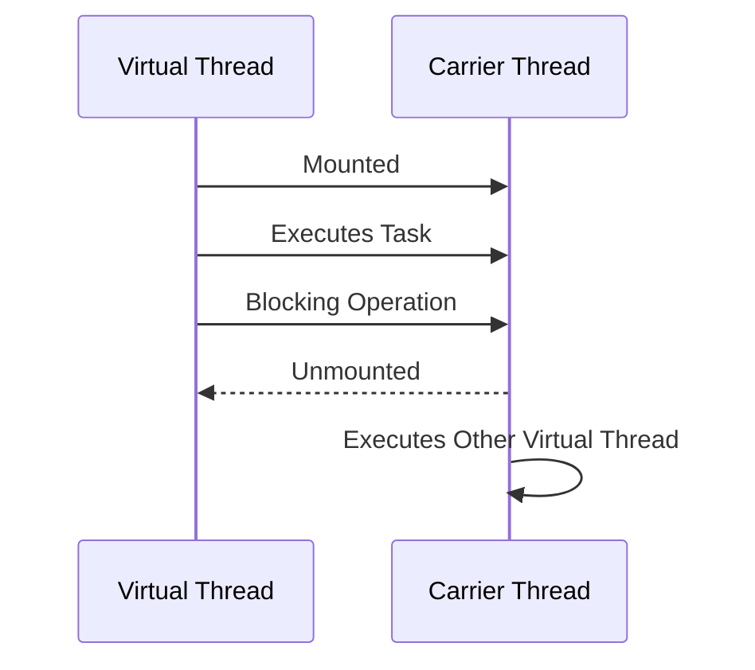
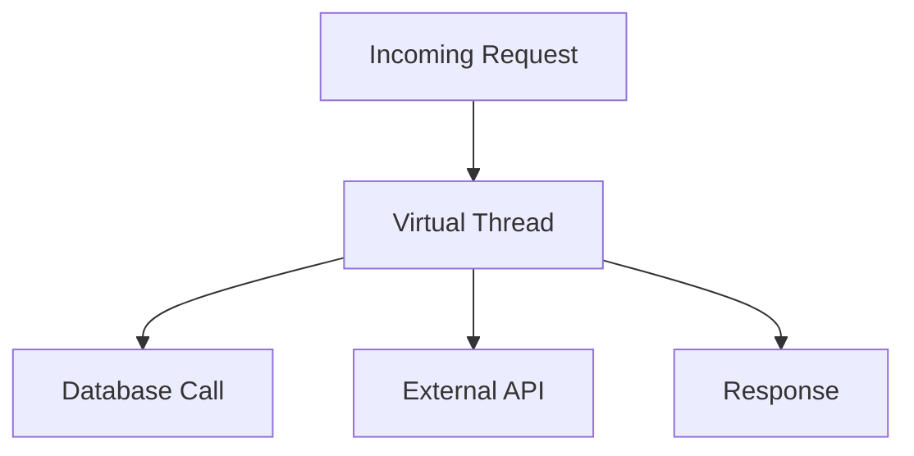

Virtual threads
LRU cache
Microservice logging
HashMap in depth
Bean lifecycle
Circuit breaker in depth
Memory leak concepts

code 
Longest non repeating char substring


# Virtual Threads

Virtual Threads are **lightweight threads** introduced in Java as part of **Project Loom**.

They allow Java applications to handle **millions of concurrent tasks** efficiently without creating millions of OS threads.

📌 Introduced as:

* Preview → Java 19
* Preview → Java 20
* Stable Feature → Java 21

---

#### Why Virtual Threads?

Traditional Java threads are:

* Heavyweight
* Expensive to create
* High memory usage
* Limited by OS resources

#### Problem with Platform Threads

```text
1 Java Thread = 1 OS Thread
```

Creating thousands of threads leads to:

* Context switching overhead
* High memory consumption
* CPU scheduling issues

---

#### Traditional Thread Model



⚠️ Every Java thread directly maps to an OS thread.

---

#### Virtual Thread Model



📌 Many virtual threads share a small number of platform threads.

---

##### Key Concepts

| Concept        | Description                                        |
| -------------- | -------------------------------------------------- |
| Virtual Thread | Lightweight JVM-managed thread                     |
| Carrier Thread | Actual OS/platform thread executing virtual thread |
| Mounting       | Virtual thread attached to carrier thread          |
| Unmounting     | Virtual thread detached during blocking operations |
| Scheduler      | JVM schedules virtual threads                      |

---

#### Platform Thread vs Virtual Thread

| Feature        | Platform Thread     | Virtual Thread      |
| -------------- | ------------------- | ------------------- |
| Managed By     | OS                  | JVM                 |
| Cost           | Expensive           | Cheap               |
| Memory         | High                | Low                 |
| Creation Time  | Slow                | Fast                |
| Scalability    | Limited             | Massive             |
| Blocking Calls | Block OS thread     | Thread unmounts     |
| Use Case       | CPU-intensive tasks | I/O-intensive tasks |

---

### Creating Virtual Threads

##### 1️⃣ Using `Thread.ofVirtual()`

```java
public class VirtualDemo {

    public static void main(String[] args) {

        Thread thread = Thread.ofVirtual()
                .start(() -> {
                    System.out.println("Hello Virtual Thread");
                });

    }
}
```

---

##### 2️⃣ Using Executor Service

```java
import java.util.concurrent.ExecutorService;
import java.util.concurrent.Executors;

public class VirtualExecutor {

    public static void main(String[] args) {

        try (ExecutorService executor = Executors.newVirtualThreadPerTaskExecutor()) {

            for (int i = 0; i < 10; i++) {

                int num = i;

                executor.submit(() -> {
                    System.out.println(num + " : " + Thread.currentThread());
                });
            }
        }
    }
}
```

📌 Best approach for production applications.

---

Output Example

```text
VirtualThread[#21]/runnable@ForkJoinPool-1-worker-1
```

---

## How Virtual Threads Work

##### Traditional Thread

```text
Task → OS Thread → CPU
```

##### Virtual Thread

```text
Task → Virtual Thread → Carrier Thread → CPU
```

---

### Blocking in Virtual Threads

##### Traditional Threads

When blocking occurs:

```java
Thread.sleep(1000);
```

OS thread gets blocked.

---

##### Virtual Threads

During blocking:

```text
Virtual Thread unmounts
Carrier Thread becomes free
Another Virtual Thread uses carrier
```

📌 This is the biggest advantage.

---

# Mounting & Unmounting



---

# Memory Usage

## Platform Thread

Approx memory:

```text
~1 MB per thread stack
```

10,000 threads:

```text
10 GB+
```

---

## Virtual Thread

Very small stack.

Can create:

```text
Millions of virtual threads
```

---

# Scheduler in Virtual Threads

JVM uses:

```text
ForkJoinPool Scheduler
```

Carrier threads are managed internally.

Default scheduler size:

```text
Number of CPU cores
```

---

# Example: Massive Concurrency

```java
import java.util.concurrent.Executors;

public class MillionThreads {

    public static void main(String[] args) {

        try (var executor =
                     Executors.newVirtualThreadPerTaskExecutor()) {

            for (int i = 0; i < 100000; i++) {

                executor.submit(() -> {
                    Thread.sleep(1000);
                    return null;
                });
            }
        }
    }
}
```

📌 Impossible with platform threads practically.

---

# When to Use Virtual Threads

## ✅ Best For

| Use Case            | Suitable |
| ------------------- | -------- |
| REST APIs           | ✅        |
| Database calls      | ✅        |
| Network calls       | ✅        |
| Microservices       | ✅        |
| File I/O            | ✅        |
| Blocking operations | ✅        |

---

# When NOT to Use

## ❌ Avoid For

| Scenario                    | Reason                  |
| --------------------------- | ----------------------- |
| CPU-intensive tasks         | No benefit              |
| Long synchronized blocks    | Carrier thread blocking |
| Heavy parallel computations | Use ForkJoinPool        |

---

# Pinning Problem ⚠️

## What is Pinning?

When virtual thread cannot unmount from carrier thread.

Carrier thread gets blocked.

---

# Causes of Pinning

## 1️⃣ `synchronized`

```java
synchronized (obj) {
    Thread.sleep(1000);
}
```

⚠️ Virtual thread stays mounted.

---

## 2️⃣ Native Calls

JNI operations may pin carrier thread.

---

# Better Alternative

Use:

```java
ReentrantLock
```

instead of synchronized.

---

# Example

## Bad

```java
synchronized void process() {
    Thread.sleep(1000);
}
```

---

## Better

```java
Lock lock = new ReentrantLock();

lock.lock();
try {
    Thread.sleep(1000);
} finally {
    lock.unlock();
}
```

---

# ThreadLocal with Virtual Threads

Works normally.

But excessive use may increase memory usage.

---

# Structured Concurrency

Introduced with Project Loom.

Helps manage multiple related tasks.

---

# Example

```java
try (var scope = new StructuredTaskScope.ShutdownOnFailure()) {

    Future<String> user =
            scope.fork(() -> getUser());

    Future<String> order =
            scope.fork(() -> getOrders());

    scope.join();

    System.out.println(user.resultNow());
}
```

📌 Cleaner concurrent programming.

---

# Virtual Thread States

Same as normal thread:

| State      |
| ---------- |
| NEW        |
| RUNNABLE   |
| BLOCKED    |
| WAITING    |
| TERMINATED |

---

# Daemon Threads

Virtual threads are always daemon-like.

JVM exits if only virtual threads remain.

---

# Debugging Virtual Threads

## JVM Option

```text
-Djdk.tracePinnedThreads=full
```

Detects pinned threads.

---

# Performance Comparison

| Metric            | Platform Thread | Virtual Thread |
| ----------------- | --------------- | -------------- |
| 10K Threads       | Heavy           | Efficient      |
| Memory            | High            | Low            |
| Startup Time      | Slow            | Fast           |
| Context Switching | Expensive       | Minimal        |

---

# Important APIs

| API                                           | Description            |
| --------------------------------------------- | ---------------------- |
| `Thread.ofVirtual()`                          | Creates virtual thread |
| `Thread.startVirtualThread()`                 | Shortcut creation      |
| `Executors.newVirtualThreadPerTaskExecutor()` | Executor service       |
| `Thread.isVirtual()`                          | Checks virtual thread  |

---

# Useful Methods

## Check Thread Type

```java
System.out.println(Thread.currentThread().isVirtual());
```

---

# Shortcut API

```java
Thread.startVirtualThread(() -> {
    System.out.println("Running");
});
```

---

# Interview Questions & Answers

---

## 1️⃣ What are Virtual Threads?

Virtual threads are lightweight JVM-managed threads that enable massive concurrency with low memory usage.

---

## 2️⃣ Difference Between Platform and Virtual Threads?

| Platform            | Virtual             |
| ------------------- | ------------------- |
| OS-managed          | JVM-managed         |
| Heavyweight         | Lightweight         |
| Limited scalability | Massive scalability |

---

## 3️⃣ Why are Virtual Threads Fast?

Because blocking operations do not block carrier threads.

Virtual threads unmount during blocking.

---

## 4️⃣ What is Carrier Thread?

Platform thread executing virtual threads.

---

## 5️⃣ What is Pinning?

When virtual thread cannot unmount and blocks carrier thread.

---

## 6️⃣ Is Synchronization Bad with Virtual Threads?

Heavy synchronized blocks can reduce scalability.

Prefer `ReentrantLock`.

---

## 7️⃣ Can We Create Millions of Virtual Threads?

Yes.

That is their main advantage.

---

## 8️⃣ Are Virtual Threads Faster for CPU Tasks?

No.

Use traditional thread pools/ForkJoinPool.

---

## 9️⃣ Are Virtual Threads Reactive Programming Replacement?

Partially yes.

They simplify async programming.

---

## 🔟 Are Virtual Threads Green Threads?

Not exactly.

But conceptually similar because JVM manages them.

---

# Virtual Threads vs Reactive Programming

| Feature      | Virtual Threads | Reactive         |
| ------------ | --------------- | ---------------- |
| Coding Style | Sequential      | Async/Functional |
| Complexity   | Simple          | Complex          |
| Debugging    | Easier          | Harder           |
| Scalability  | High            | Very High        |

---

# Best Practices

## ✅ Recommended

* Use for I/O-bound tasks
* Use ExecutorService
* Keep tasks independent
* Prefer `ReentrantLock`

---

## ❌ Avoid

* Excessive synchronization
* CPU-heavy workloads
* ThreadLocal overuse

---

# Real-World Example

## REST API Request Handling



Thousands of requests can be handled efficiently.

---

# Migration Strategy

## Existing Code

Minimal changes needed.

Replace:

```java
Executors.newFixedThreadPool()
```

with:

```java
Executors.newVirtualThreadPerTaskExecutor()
```

---

# Internal Architecture


---

# Advantages 🚀

| Benefit                 |
| ----------------------- |
| Massive scalability     |
| Simpler concurrent code |
| Low memory              |
| Better resource usage   |
| Easier debugging        |

---

# Limitations ⚠️

| Limitation                       |
| -------------------------------- |
| Pinning issues                   |
| CPU-bound tasks no gain          |
| Some libraries may not cooperate |
| Native calls can block carriers  |

---

# Summary 🚀

## Virtual Threads

* Lightweight JVM-managed threads
* Designed for high concurrency
* Best for blocking I/O operations
* Introduced fully in Java 21
* Simplify concurrent programming
* Can create millions of threads efficiently

---

# Final Interview Summary

📌 One-Line Definition:

> Virtual Threads are lightweight JVM-managed threads that provide high concurrency with minimal memory overhead.

📌 Best Use Case:

> I/O-bound applications like APIs, DB calls, microservices.

📌 Avoid For:

> CPU-intensive parallel computations.

📌 Biggest Advantage:

> Blocking does not block OS thread.

📌 Biggest Risk:

> Pinning due to synchronized/native calls.

---


In microservices architecture, a **Circuit Breaker** is a design pattern used to prevent a failure in one service from cascading down to other services. Think of it exactly like an electrical circuit breaker in your house: when a fault occurs (like a short circuit), the breaker trips to stop the flow of electricity, protecting the rest of your home.

In Spring Boot, the modern standard for implementing this pattern is **Resilience4j** (which replaced the deprecated Netflix Hystrix).

---

## 1. The Three Core States

A circuit breaker operates as a finite state machine with three main states:

* **CLOSED:** Everything is working normally. Requests flow directly to the downstream service. The circuit breaker monitors the success/failure rate of these calls.
* **OPEN:** The downstream service is failing, and the error threshold has been breached. The circuit breaker **trips**, meaning it immediately rejects incoming requests and diverts them to a fallback method without hitting the broken service. This gives the service time to recover.
* **HALF-OPEN:** After a configured wait duration, the circuit breaker enters this state to test if the underlying service has recovered. It permits a limited, configurable number of requests to pass through.
* If they **succeed**, the circuit closes, and normal operation resumes.
* If they **fail**, the circuit trips back to **OPEN**.


---

## 2. Sliding Windows: How Failure is Calculated

Resilience4j doesn't just look at the *last* request; it uses a **Sliding Window** to evaluate metrics. You can configure this in two ways:

1. **Count-Based Sliding Window:** Evaluates the last `N` requests (e.g., the last 100 calls). If 50% of those 100 calls fail, the circuit opens.
2. **Time-Based Sliding Window:** Evaluates requests made in the last `N` seconds (e.g., the last 30 seconds).

---

## 3. Implementing Resilience4j in Spring Boot

### Step 1: Add Dependencies

To get started, add the Resilience4j starter along with Spring Boot AOP (required for annotations) to your `pom.xml`:

```xml
<dependency>
    <groupId>io.github.resilience4j</groupId>
    <groupId>resilience4j-spring-boot3</groupId>
    <version>2.2.0</version> </dependency>
<dependency>
    <groupId>org.springframework.boot</groupId>
    <artifactId>spring-boot-starter-aop</artifactId>
</dependency>

```

### Step 2: Configure via `application.yml`

This is where the "in-depth" control happens. You fine-tune how and when the circuit trips:

```yaml
resilience4j:
  circuitbreaker:
    instances:
      inventoryService:
        slidingWindowType: COUNT_BASED
        slidingWindowSize: 10              # Tracks the last 10 requests
        failureRateThreshold: 50           # Trips if 50% (5 out of 10) fail
        slowCallRateThreshold: 70          # Trips if 70% of calls take too long
        slowCallDurationThreshold: 2000ms  # A call taking > 2s is considered "slow"
        waitDurationInOpenState: 10000ms   # Waits 10s in OPEN before moving to HALF-OPEN
        permittedNumberOfCallsInHalfOpenState: 3 # Sends 3 trial requests in HALF-OPEN
        automaticTransitionFromOpenToHalfOpenEnabled: true

```

### Step 3: Coding the Circuit Breaker & Fallback

Apply the `@CircuitBreaker` annotation to your service method. You should always supply a `fallbackMethod` to handle the failure gracefully.

```java
import io.github.resilience4j.circuitbreaker.annotation.CircuitBreaker;
import org.springframework.stereotype.Service;
import org.springframework.web.client.RestTemplate;

@Service
public class OrderService {

    private final RestTemplate restTemplate;

    public OrderService(RestTemplate restTemplate) {
        this.restTemplate = restTemplate;
    }

    // "inventoryService" matches the key used in application.yml
    @CircuitBreaker(name = "inventoryService", fallbackMethod = "getInventoryFallback")
    public String checkInventory(Long productId) {
        return restTemplate.getForObject("http://inventory-service/api/products/" + productId, String.class);
    }

    // The fallback method MUST have the same signature as the core method, 
    // plus an extra parameter for the Exception caught.
    public String getInventoryFallback(Long productId, Throwable throwable) {
        // Log the error and return cached or default data
        System.out.println("Circuit is OPEN or Service failed. Error: " + throwable.getMessage());
        return "Inventory status temporarily unavailable (Fallback Data)";
    }
}

```

---

## 4. Advanced Production Concepts

When architecting production-grade microservices, keep these core behaviors in mind:

* **Thread Safety:** Resilience4j is built on Top of `Vavr`, utilizing atomic operations and functional data structures. It is completely thread-safe with very low memory overhead.
* **Exception Handling (Ignore vs. Record):** By default, all exceptions count as failures. However, you don't want a `404 Not Found` (client error) to trip a circuit meant to catch server crashes. You can configure this explicitly:
```yaml
resilience4j.circuitbreaker.instances.inventoryService:
  recordExceptions:
    - org.springframework.web.client.HttpServerErrorException # Count 5xx
  ignoreExceptions:
    - org.springframework.web.client.HttpClientErrorException # Ignore 4xx

```


* **Monitoring with Actuator:** You can expose the state of your circuit breakers to monitoring tools like Prometheus and Grafana. By adding `spring-boot-starter-actuator`, you gain access to the `/actuator/circuitbreakers` endpoint to view real-time failure rates and states.