Good approach 👍 For experienced Java interviews, organizing questions by **concept area** helps revise faster. I grouped and cleaned all your questions into **logical Java topics**.

---

# ☕ Java Interview Questions (Concept-wise)

---

# 1️⃣ Java Basics

## 1. What is the difference between JDK, JRE, and JVM?

| Component                          | Purpose                                           |
| ---------------------------------- | ------------------------------------------------- |
| **JDK (Java Development Kit)**     | Used to develop Java applications                 |
| **JRE (Java Runtime Environment)** | Provides runtime environment to run Java programs |
| **JVM (Java Virtual Machine)**     | Executes Java bytecode                            |

````mermaid

flowchart LR
    A[JDK] --> B[JRE]
    B --> C[JVM]

````

### Key Points

* **JDK = JRE + Development Tools (javac, javadoc, jar)**
* **JRE = JVM + Libraries**
* JVM is platform dependent but **Java code is platform independent**

---

## 2. What are the main features of Java (OOP principles)?

Java follows **Object-Oriented Programming (OOP)**.

### Four Main Principles

| Principle         | Meaning                            |
| ----------------- | ---------------------------------- |
| **Encapsulation** | Wrapping data and methods together |
| **Inheritance**   | Reusing code from parent class     |
| **Polymorphism**  | Same method behaves differently    |
| **Abstraction**   | Hiding implementation details      |

### Example

```java
class Animal {
    void sound() {
        System.out.println("Animal sound");
    }
}

class Dog extends Animal {
    void sound() {
        System.out.println("Dog barks");
    }
}
```

---

## 3. What are primitive data types in Java?

Java has **8 primitive data types**.

| Type    | Size    | Example             |
| ------- | ------- | ------------------- |
| byte    | 1 byte  | byte a = 10         |
| short   | 2 bytes | short s = 100       |
| int     | 4 bytes | int x = 1000        |
| long    | 8 bytes | long l = 10000L     |
| float   | 4 bytes | float f = 10.5f     |
| double  | 8 bytes | double d = 20.5     |
| char    | 2 bytes | char c = 'A'        |
| boolean | 1 bit   | boolean flag = true |

##### Interview Tip

Primitive types **store actual values**, not object references.

---

## 4. What are access modifiers in Java?

Access modifiers control **visibility of classes, variables, and methods**.

| Modifier  | Same Class | Same Package | Subclass | Other Package |
| --------- | ---------- | ------------ | -------- | ------------- |
| private   | ✅          | ❌            | ❌        | ❌             |
| default   | ✅          | ✅            | ❌        | ❌             |
| protected | ✅          | ✅            | ✅        | ❌             |
| public    | ✅          | ✅            | ✅        | ✅             |

### Example

```java
public class Employee {
    private int id;
    protected String name;
    public double salary;
}
```

---

## 5. What is a package in Java?

A **package** is a namespace used to organize classes and interfaces.

### Benefits

* Avoid class name conflicts
* Better code organization
* Access control

### Example

```java
package com.bank.service;

public class AccountService {
}
```

### Types

* **Built-in packages** → `java.util`, `java.lang`
* **User-defined packages**

---

## 6. What is the `static` keyword? Static variables and methods?

`static` means **belongs to class, not object**.

### Static Variable

* Shared across all objects
* Single copy in memory

```java
class Counter {
    static int count = 0;

    Counter() {
        count++;
    }
}
```

### Static Method

* Called using class name
* Cannot access non-static members directly

```java
class MathUtil {
    static int add(int a, int b) {
        return a + b;
    }
}
```

Usage

```java
MathUtil.add(10,20);
```

---

## 7. What is a Constructor in Java? Types of constructors?

A **constructor** initializes an object when it is created.

### Rules

* Same name as class
* No return type
* Called automatically during object creation

### Types

| Type                      | Description                          |
| ------------------------- | ------------------------------------ |
| Default Constructor       | Provided by compiler if none defined |
| Parameterized Constructor | Accepts parameters                   |
| Copy Constructor          | Copies another object                |

### Example

```java
class Student {

    int id;
    String name;

    Student(int id, String name) {
        this.id = id;
        this.name = name;
    }
}
```

---

## 8. Can we use static methods in a Constructor?

Yes.

Constructors **can call static methods**, because static methods belong to the class.

### Example

```java
class Test {

    Test() {
        display();
    }

    static void display() {
        System.out.println("Static method called");
    }
}
```

### Important

Static methods **do not require object creation**.

---

## 9. What is the difference between `==` and `.equals()`?

| Feature          | `==`                      | `.equals()`       |
| ---------------- | ------------------------- | ----------------- |
| Purpose          | Compare references        | Compare values    |
| Works on         | Primitive & Objects       | Objects           |
| Default behavior | Memory address comparison | Can be overridden |

### Example

```java
String a = new String("Java");
String b = new String("Java");

System.out.println(a == b);       // false
System.out.println(a.equals(b));  // true
```

### Interview Tip

* `==` → reference comparison
* `.equals()` → logical value comparison

---

## 10. Explain the difference between `break` and `continue`

| Keyword  | Purpose                     |
| -------- | --------------------------- |
| break    | Terminates loop immediately |
| continue | Skips current iteration     |

### Example

```java
for(int i=1;i<=5;i++){

    if(i==3)
        continue;

    System.out.println(i);
}
```

Output

```
1
2
4
5
```

### break Example

```java
for(int i=1;i<=5;i++){

    if(i==3)
        break;

    System.out.println(i);
}
```

Output

```
1
2
```

### Key Difference

* **break → exit loop**
* **continue → skip iteration**

---

```
```

# 2️⃣ OOP Concepts

Object-Oriented Programming helps in **code reusability, maintainability, and scalability**.  Java mainly uses **4 pillars of OOP**: Encapsulation, Inheritance, Polymorphism, Abstraction.

---

# 1. What is Inheritance? Types of inheritance in Java?

### Definition
**Inheritance** allows a class (child) to acquire properties and behavior of another class (parent).

👉 Achieved using `extends` keyword.

### Benefits
- Code reusability
- Method overriding
- Hierarchical class design

```java
class Animal {
    void eat() {
        System.out.println("Animal eats");
    }
}

class Dog extends Animal {
    void bark() {
        System.out.println("Dog barks");
    }
}
```

Usage

```java
Dog d = new Dog();
d.eat();
d.bark();
```

------

### Types of Inheritance in Java

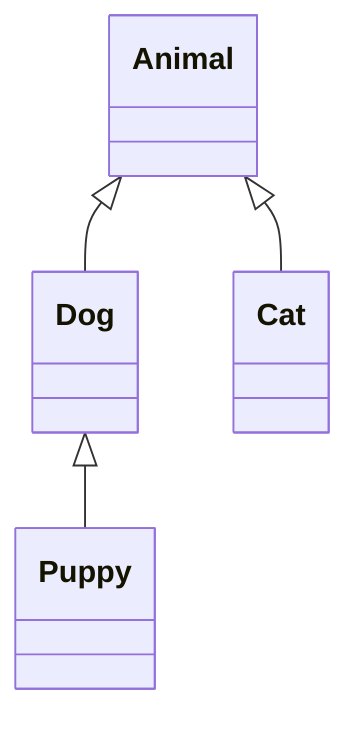

| Type         | Supported in Java |
| ------------ | ----------------- |
| Single       | ✅                 |
| Multilevel   | ✅                 |
| Hierarchical | ✅                 |
| Multiple     | ❌ (Using classes) |
| Hybrid       | ❌ (Using classes) |

⚠ Multiple inheritance is supported **using Interfaces only**.

------

# 2. What is Polymorphism? Give examples.

### Definition

**Polymorphism means "many forms".** A single method behaves differently based on context.

### Types

| Type         | When resolved      |
| ------------ | ------------------ |
| Compile-time | Method Overloading |
| Runtime      | Method Overriding  |

------

### Compile-Time Polymorphism (Overloading)

```java
class Calculator {

    int add(int a, int b){
        return a+b;
    }

    int add(int a, int b, int c){
        return a+b+c;
    }
}
```

------

### Runtime Polymorphism (Overriding)

```java
class Animal {
    void sound(){
        System.out.println("Animal sound");
    }
}

class Dog extends Animal{
    void sound(){
        System.out.println("Dog barks");
    }
}
```

------

### Example

```java
Animal a = new Dog();
a.sound();
```

Output

```
Dog barks
```

------

# 3. What is Encapsulation and Abstraction?

## Encapsulation

### Definition

Wrapping **data + methods together** and restricting direct access.

👉 Achieved using **private variables + getters/setters**

### Example

```java
class Employee {

    private int salary;

    public int getSalary(){
        return salary;
    }

    public void setSalary(int salary){
        this.salary = salary;
    }
}
```

### Benefits

- Data hiding
- Better security
- Controlled access

------

## Abstraction

### Definition

Hiding **implementation details** and showing only functionality.

👉 Achieved using

- **Abstract classes**
- **Interfaces**

### Example

```java
abstract class Vehicle {

    abstract void start();
}

class Car extends Vehicle {

    void start(){
        System.out.println("Car starts with key");
    }
}
```

------

### Real Life Example

```
ATM Machine

User sees → withdraw(), deposit()
Hidden → internal banking logic
```

------

# 4. What is Method Overloading vs Method Overriding?

| Feature              | Method Overloading                         | Method Overriding        |
| -------------------- | ------------------------------------------ | ------------------------ |
| Definition           | Same method name with different parameters | Redefining parent method |
| Polymorphism Type    | Compile-time                               | Runtime                  |
| Inheritance Required | ❌                                          | ✅                        |
| Method Signature     | Must differ                                | Must be same             |

------

### Overloading Example

```java
void print(int a)
void print(String s)
```

------

### Overriding Example

```java
class Parent{
    void display(){
        System.out.println("Parent");
    }
}

class Child extends Parent{
    void display(){
        System.out.println("Child");
    }
}
```

------

# 5. When to use Interface vs Abstract Class?

| Feature              | Interface           | Abstract Class               |
| -------------------- | ------------------- | ---------------------------- |
| Methods              | Abstract by default | Can have abstract + concrete |
| Multiple inheritance | ✅ Supported         | ❌ Not supported              |
| Variables            | public static final | Any type                     |
| Constructor          | ❌ Not allowed       | ✅ Allowed                    |

------

### Interface Example

```java
interface Payment {

    void pay();
}

class CreditCard implements Payment {

    public void pay(){
        System.out.println("Paid using card");
    }
}
```

------

### Abstract Class Example

```java
abstract class Vehicle {

    void fuel(){
        System.out.println("Fuel needed");
    }

    abstract void start();
}
```

------

### Interview Tip

Use **Interface when behavior is common across unrelated classes**.

Example

```
Payment → UPI, Card, NetBanking
```

Use **Abstract class when classes share common base functionality**.

Example

```
Vehicle → Car, Bike
```

------

# 6. What is a Marker Interface? Why use it?

### Definition

A **Marker Interface is an empty interface** used to "mark" a class. It provides **metadata information to JVM or frameworks**.

------

### Example Marker Interfaces in Java

| Interface    | Purpose                      |
| ------------ | ---------------------------- |
| Serializable | Allows object serialization  |
| Cloneable    | Allows object cloning        |
| RandomAccess | Indicates fast random access |

------

### Example

```java
class Employee implements Serializable {
    int id;
    String name;
}
```

------

### How it works internally

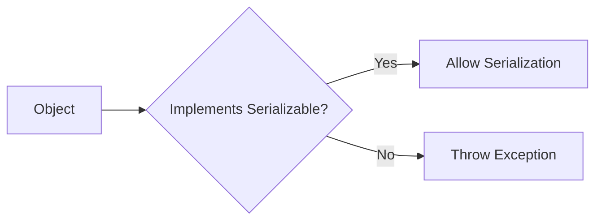

------

### Interview Tip

Marker interfaces are often replaced today with **Annotations**, but still used internally in Java.

Example

```
Serializable
Cloneable
RandomAccess
```


---

# 3️⃣ String Handling

Strings are one of the **most frequently asked topics in Java interviews** because they involve **memory management, performance, and JVM internals**.

---

## 1. What is the difference between `String`, `StringBuilder`, and `StringBuffer`?

| Feature         | String                 | StringBuilder     | StringBuffer        |
| --------------- | ---------------------- | ----------------- | ------------------- |
| Mutability      | Immutable              | Mutable           | Mutable             |
| Thread Safety   | ❌ Not thread-safe      | ❌ Not thread-safe | ✅ Thread-safe       |
| Performance     | Slow for modifications | Fast              | Slower than Builder |
| Synchronization | ❌                      | ❌                 | ✅                   |

### Key Idea
- **String → immutable**
- **StringBuilder → mutable (single thread)**
- **StringBuffer → mutable (multi-thread)**

---

### Example

```java
String s = "Java";
s.concat(" Programming");

System.out.println(s);
```

Output

```
Java
```

Reason: **String is immutable**

------

### StringBuilder Example

```java
StringBuilder sb = new StringBuilder("Java");
sb.append(" Programming");

System.out.println(sb);
```

Output

```
Java Programming
```

------

### Performance Tip

Use **StringBuilder** when modifying strings frequently.

Example

```
Loop concatenation
Dynamic SQL queries
JSON building
```

------

## 2. Difference between creating String with literal and `new` operator

### String Literal

```java
String s1 = "Java";
String s2 = "Java";
```

- Stored in **String Pool**
- Both references point to **same object**

------

### String using `new`

```java
String s1 = new String("Java");
String s2 = new String("Java");
```

- Stored in **Heap memory**
- Creates **two separate objects**

------

### Memory Diagram

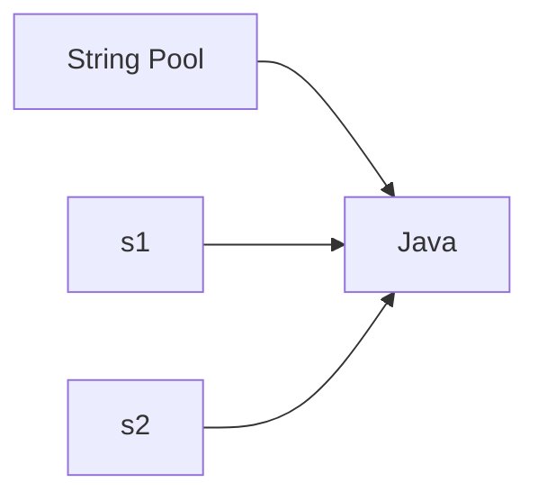

Using `new`

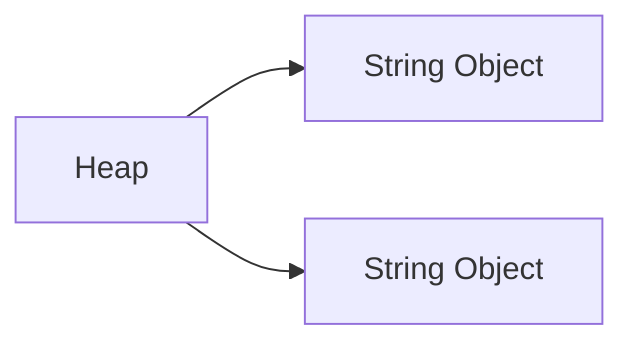

------

### Interview Tip

Literal creation is **memory efficient** because of **string pooling**.

------

## 3. What is String Pool and how does it work?

### Definition

The **String Pool** is a special memory area inside the **Heap** where JVM stores **unique String literals**. If a string already exists, JVM returns the **existing reference instead of creating a new object**.

------

### Example

```java
String a = "Java";
String b = "Java";
```

Both refer to the **same memory location**.

------

### Diagram

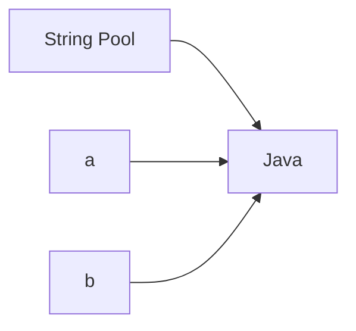

------

### Example with `new`

```java
String a = new String("Java");
String b = new String("Java");
```

Now JVM creates **separate objects in heap**.

------

## 4. What are the advantages of String Pool?

### 1️⃣ Memory Optimization

Only **one copy of identical string** stored.

Example

```
1000 "Java" strings → only 1 object
```

------

### 2️⃣ Performance Improvement

Less object creation → **faster memory access**

------

### 3️⃣ Faster Comparisons

Since references can be reused.

```
s1 == s2 may return true
```

------

### 4️⃣ JVM Optimization

Used heavily in

- class names
- method names
- configuration strings

------

## 5. Why is String immutable?

### Definition

Once a String object is created, **its value cannot be changed**.

------

### Example

```java
String s = "Java";
s.concat("8");
```

Output

```
Java
```

Reason: JVM creates **new object instead of modifying existing one**.

------

### Internal Working

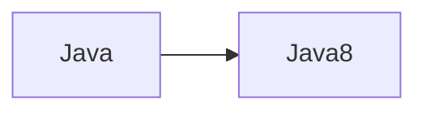

Original object remains unchanged.

------

### Reasons for Immutability

#### 1️⃣ String Pool Security

If mutable, changing one reference could affect many variables.

Example

```
String a = "admin"
String b = "admin"
```

Changing `a` would affect `b`.

------

#### 2️⃣ Security

Used in

```
URL
Database credentials
File paths
Class loaders
```

Immutable prevents malicious modification.

------

#### 3️⃣ Thread Safety

Strings can be shared safely across threads.

------

#### 4️⃣ HashMap Performance

Strings are commonly used as **HashMap keys**.

If mutable → hashCode would change → data corruption.

------

### Interview Tip

The **main reasons** String is immutable:

```
Security
String Pool optimization
Thread safety
HashMap key stability
```

---

# 4️⃣ Java Collections (Basic)

The **Java Collection Framework (JCF)** provides classes and interfaces to store and manipulate groups of objects dynamically.

---

## 1. What is a Collection in Java?

### Definition
A **Collection** is a framework that provides **architecture to store and manipulate groups of objects dynamically**.

It includes:

- Interfaces
- Implementations
- Algorithms

---

### Core Interfaces

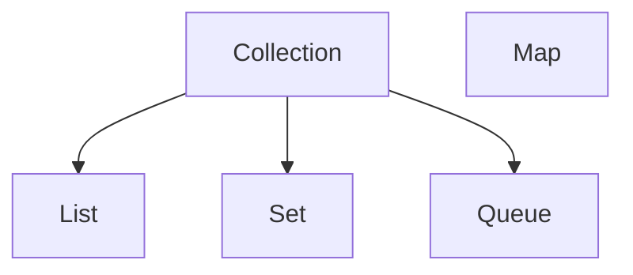

⚠ **Map is part of the collection framework but does not extend `Collection` interface.**

------

### Common Implementations

| Interface | Classes                         |
| --------- | ------------------------------- |
| List      | ArrayList, LinkedList, Vector   |
| Set       | HashSet, LinkedHashSet, TreeSet |
| Queue     | PriorityQueue, ArrayDeque       |
| Map       | HashMap, LinkedHashMap, TreeMap |

------

## 2. Difference between Array and ArrayList

| Feature     | Array               | ArrayList            |
| ----------- | ------------------- | -------------------- |
| Size        | Fixed               | Dynamic              |
| Type        | Primitive & Objects | Objects only         |
| Part of     | Java Language       | Collection Framework |
| Performance | Faster              | Slightly slower      |
| Methods     | Limited             | Rich API             |

------

### Example

#### Array

```java
int arr[] = new int[3];
arr[0] = 10;
```

------

#### ArrayList

```java
List<Integer> list = new ArrayList<>();
list.add(10);
list.add(20);
```

------

### Interview Tip

Use **ArrayList when size is dynamic**.

------

## 3. What is the difference between ArrayList and LinkedList?

Both implement the **List interface**.

------

### Internal Structure

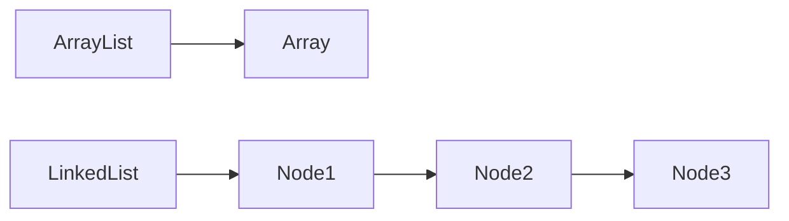

------

### Comparison

| Feature       | ArrayList     | LinkedList            |
| ------------- | ------------- | --------------------- |
| Structure     | Dynamic array | Doubly linked list    |
| Access Time   | Fast O(1)     | Slow O(n)             |
| Insert/Delete | Slow          | Fast                  |
| Memory        | Less          | More (extra pointers) |

------

### Example

```java
List<Integer> list = new ArrayList<>();
list.add(10);
list.add(20);
```

------

### Interview Tip

Use:

- **ArrayList → frequent reads**
- **LinkedList → frequent inserts/deletes**

------

## 4. What is a HashMap? Basic operations?

### Definition

`HashMap` is a **key-value data structure** that stores data using **hashing**.

------

### Characteristics

- Stores **key-value pairs**
- **No duplicate keys**
- Allows **one null key**
- Not thread-safe 
- Unordered

------

### Basic Operations

```java
Map<Integer,String> map = new HashMap<>();

map.put(1,"Java");
map.put(2,"Spring");

map.get(1);
map.remove(2);
```

------

### Internal Structure

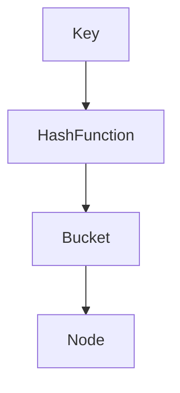

Steps:

1. Key hashCode calculated
2. Bucket index determined
3. Entry stored in bucket

------

## 5. What is the difference between HashSet and TreeSet?

Both implement **Set interface**.

------

### Comparison

| Feature        | HashSet    | TreeSet        |
| -------------- | ---------- | -------------- |
| Ordering       | Unordered  | Sorted         |
| Data Structure | Hash table | Red-Black Tree |
| Performance    | O(1)       | O(log n)       |
| Null allowed   | One null   | Not allowed    |

------

### Example

```java
Set<Integer> set = new HashSet<>();
set.add(10);
set.add(20);
```

TreeSet

```java
Set<Integer> set = new TreeSet<>();
set.add(30);
set.add(10);
set.add(20);
```

Output

```
10 20 30
```

------

## 6. What is an Iterator?

### Definition

`Iterator` is used to **traverse elements of a collection sequentially**.

------

### Important Methods

| Method    | Purpose              |
| --------- | -------------------- |
| hasNext() | Checks next element  |
| next()    | Returns next element |
| remove()  | Removes element      |

------

### Example

```java
List<String> list = new ArrayList<>();
list.add("Java");
list.add("Spring");

Iterator<String> it = list.iterator();

while(it.hasNext()){
    System.out.println(it.next());
}
```

------

### Interview Tip

Iterator prevents **ConcurrentModificationException when removing elements during iteration**.

------

## 7. What is the difference between List and Set?

| Feature    | List       | Set            |
| ---------- | ---------- | -------------- |
| Duplicates | Allowed    | Not allowed    |
| Order      | Maintained | Not guaranteed |
| Index      | Available  | Not available  |

------

### Example

```java
List<Integer> list = new ArrayList<>();
list.add(10);
list.add(10);
```

Output

```
10 10
```

------

### Set Example

```java
Set<Integer> set = new HashSet<>();
set.add(10);
set.add(10);
```

Output

```
10
```

------

## 8. Array vs List

| Feature     | Array             | List                 |
| ----------- | ----------------- | -------------------- |
| Size        | Fixed             | Dynamic              |
| Type Safety | Primitive allowed | Objects only         |
| Framework   | Core Java         | Collection Framework |
| Flexibility | Low               | High                 |

------

### Example

Array

```java
int arr[] = {1,2,3};
```

List

```java
List<Integer> list = new ArrayList<>();
```

------

------

# 5️⃣ Java Collections (Advanced)


## 1. Contract between `hashCode()` and `equals()` methods

### Rule (Very Important for Interviews)

1️⃣ If **two objects are equal using `equals()`**, then **their `hashCode()` must be equal**.

2️⃣ If **two objects have same hashCode**, they **may or may not be equal**.

3️⃣ If **equals() is overridden**, you **must override hashCode()**.

---

### Example

```java
class Employee {

    int id;

    public boolean equals(Object o){
        Employee e = (Employee)o;
        return this.id == e.id;
    }

    public int hashCode(){
        return id;
    }
}
```

### Why Important?

Used internally in:

```
HashMap
HashSet
Hashtable
```

------

## 2. Explain the internal working of HashMap in Java

HashMap stores data in **key-value pairs**.

### Internal Structure

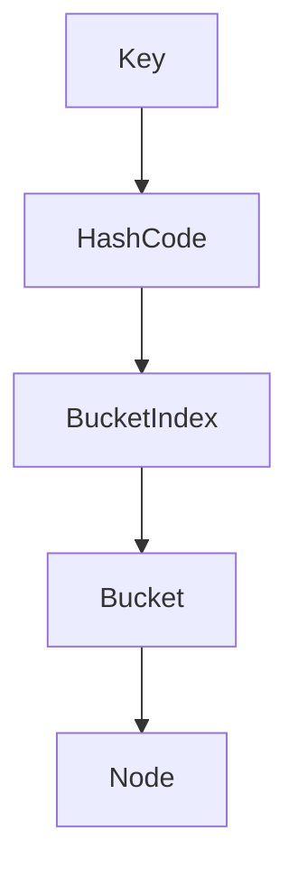

------

### Steps

1️⃣ Key object's **hashCode()** is calculated.

2️⃣ Hash is converted to **bucket index**.

```
index = hash & (capacity - 1)
```

3️⃣ Entry stored in **bucket**.

4️⃣ If bucket already contains elements → **collision handling**.

------

### Java 8 Optimization

If **bucket size > 8**

```
LinkedList → Red Black Tree
```

------

## 3. What happens on a HashMap collision?

### Collision

When **two keys produce the same bucket index**.

------

### Handling Mechanism

Java uses **Separate Chaining**.

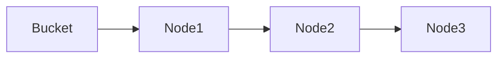

Elements stored in:

```
LinkedList (before Java 8)
Red-Black Tree (after threshold)
```

------

### Why Tree?

To improve performance.

```
LinkedList → O(n)
Tree → O(log n)
```

------

## 4. What is the load factor in HashMap?

### Definition

Load Factor determines **when HashMap should resize**.

```
LoadFactor = number_of_entries / capacity
```

------

### Default Value

```
0.75
```

Meaning:

If **75% capacity filled → HashMap resizes**

------

### Example

```
Capacity = 16
Threshold = 16 × 0.75 = 12
```

When entries > 12 → **rehashing occurs**.

------

## 5. Difference between HashMap, LinkedHashMap, and TreeMap

| Feature        | HashMap    | LinkedHashMap            | TreeMap        |
| -------------- | ---------- | ------------------------ | -------------- |
| Order          | No order   | Insertion order          | Sorted         |
| Data structure | Hash table | Hash table + Linked list | Red-Black Tree |
| Performance    | O(1)       | O(1)                     | O(log n)       |
| Null key       | 1 allowed  | 1 allowed                | Not allowed    |

------

### LinkedHashMap Structure

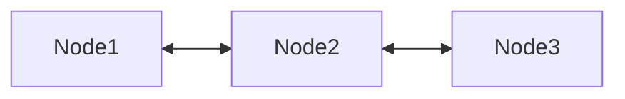

Maintains **insertion order**.

------

## 6. Difference between HashMap, LinkedHashMap, and ConcurrentHashMap

| Feature     | HashMap | LinkedHashMap | ConcurrentHashMap |
| ----------- | ------- | ------------- | ----------------- |
| Thread Safe | ❌       | ❌             | ✅                 |
| Order       | No      | Yes           | No                |
| Locking     | None    | None          | Segment based     |
| Null Keys   | Allowed | Allowed       | Not allowed       |

------

### Interview Tip

```
ConcurrentHashMap used in multi-threading environments
```

------

## 7. How can you convert a HashMap into an ArrayList?

### Convert keys

```java
Map<Integer,String> map = new HashMap<>();

List<Integer> keys = new ArrayList<>(map.keySet());
```

------

### Convert values

```java
List<String> values = new ArrayList<>(map.values());
```

------

### Convert entries

```java
List<Map.Entry<Integer,String>> entries =
        new ArrayList<>(map.entrySet());
```

------

## 8. What are the differences between Comparable and Comparator?

| Feature      | Comparable        | Comparator     |
| ------------ | ----------------- | -------------- |
| Package      | java.lang         | java.util      |
| Method       | compareTo()       | compare()      |
| Sorting      | Natural order     | Custom order   |
| Modification | Class must change | Separate class |

------

### Comparable Example

```java
class Employee implements Comparable<Employee>{

    int salary;

    public int compareTo(Employee e){
        return this.salary - e.salary;
    }
}
```

------

### Comparator Example

```java
class SalaryComparator implements Comparator<Employee>{

    public int compare(Employee e1, Employee e2){
        return e1.salary - e2.salary;
    }
}
```

------

## 9. What is a ConcurrentHashMap? How does it work?

### Definition

Thread-safe version of HashMap used in **multi-threaded environments**.

------

### Key Features

- High concurrency
- No global lock
- Better performance than Hashtable

------

### Internal Mechanism

Java 7

```
Segment based locking
```

Java 8

```
CAS + synchronized blocks
```

------

### Structure

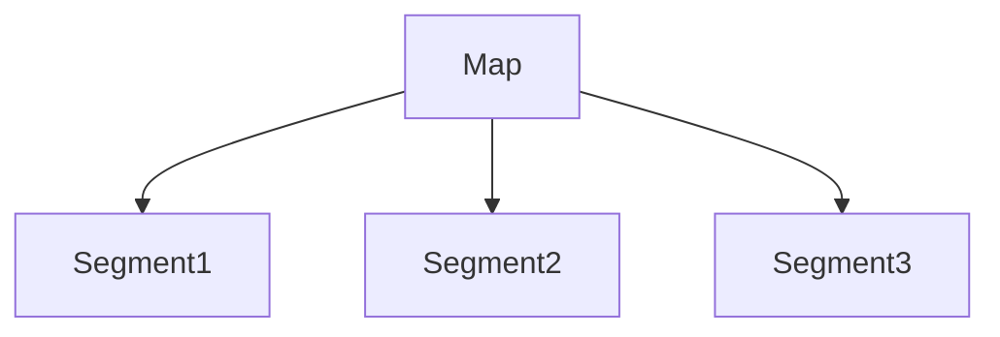

Each segment can be **locked independently**.

------

## 10. Difference between Hashtable and ConcurrentHashMap

| Feature       | Hashtable         | ConcurrentHashMap |
| ------------- | ----------------- | ----------------- |
| Thread Safety | Yes               | Yes               |
| Locking       | Entire map locked | Partial locking   |
| Performance   | Slow              | Faster            |
| Null keys     | Not allowed       | Not allowed       |

------

### Interview Tip

```
ConcurrentHashMap preferred in modern Java
```

------

## 11. Difference between Vector and ArrayList

| Feature     | Vector | ArrayList |
| ----------- | ------ | --------- |
| Thread Safe | Yes    | No        |
| Performance | Slow   | Faster    |
| Legacy      | Yes    | Modern    |

------

### Interview Tip

Vector is rarely used today.

------

## 12. HashMap vs Hashtable

| Feature     | HashMap  | Hashtable   |
| ----------- | -------- | ----------- |
| Thread Safe | No       | Yes         |
| Performance | Faster   | Slower      |
| Null Keys   | Allowed  | Not allowed |
| Introduced  | Java 1.2 | Java 1.0    |

------

## 13. ArrayList vs LinkedList

| Feature       | ArrayList     | LinkedList         |
| ------------- | ------------- | ------------------ |
| Structure     | Dynamic array | Doubly linked list |
| Access        | Fast          | Slow               |
| Insert/Delete | Slow          | Fast               |

------

### Complexity

| Operation | ArrayList | LinkedList |
| --------- | --------- | ---------- |
| Get       | O(1)      | O(n)       |
| Insert    | O(n)      | O(1)       |

------

## 14. What is Fail-Fast iteration?

Fail-Fast iterators **throw exception if collection modified during iteration**.

**Example collections:**

- ArrayList
- HashMap
- HashSet

------

### Example

```java
List<Integer> list = new ArrayList<>();

for(Integer i : list){
    list.remove(i);
}
```

This causes:

```
ConcurrentModificationException
```

------

## 15. What is ConcurrentModificationException?

Exception thrown when **collection is modified while iterating**.

------

### Example

```java
Iterator<Integer> it = list.iterator();

while(it.hasNext()){
    list.remove(1);
}
```

------

### Solution

Use **Iterator remove()**

```java
it.remove();
```

------

## 16. Fail-Fast vs Fail-Safe Iterators

| Feature           | Fail-Fast           | Fail-Safe         |
| ----------------- | ------------------- | ----------------- |
| Exception         | Yes                 | No                |
| Iterator works on | Original collection | Copy              |
| Examples          | ArrayList, HashMap  | ConcurrentHashMap |

------

### Fail-Safe Example

```java
ConcurrentHashMap<Integer,String> map = new ConcurrentHashMap<>();
```

Iteration does **not throw exception**.


---

# 6️⃣ Exception Handling

1. What is an Exception? Types of exceptions?
2. What is the difference between checked and unchecked exceptions?
3. What is try-catch-finally block?
4. Can we use try without catch?
5. What is `throw` vs `throws`?
6. What are the use cases of creating user-defined exceptions?
7. How to handle user-defined exception?
8. What is a NullPointerException & how to prevent it?
9. What is a ClassCastException?
10. What is Error vs Exception?

---

# 7️⃣ Java 8 Features

1. What is a Functional Interface?
2. Explain Java 8 features (Lambdas, Streams, Optional).
3. Difference between `map()` vs `flatMap()` in Java 8?
4. What is Stream API and its advantages?
5. What is a Stream pipeline?
6. Difference between intermediate and terminal operators in Stream API.
7. Using Stream API, find the 2nd highest salary from employee objects list.
8. Use of Stream API in projects.
9. Lambda expressions vs Anonymous classes.

---

# 8️⃣ Advanced Java Concepts

1. What is a Functional Interface?
2. What are Sealed Classes (Java 17)?
3. What is Fail-Fast Iteration & how to handle it?
4. Final, finally and finalize()?
5. Autoboxing vs Unboxing.
6. What is Cloneable? Deep clone vs shallow clone.
7. Shallow Copy vs Deep Copy memory management.

---

# 9️⃣ Memory Management & Garbage Collection

1. Explain Java memory management.
2. What is garbage collection in Java? Types of GC?
3. What is the `finalize()` method?
4. Stack vs Heap memory allocation.
5. How to handle OutOfMemoryException?

---

# 🔟 Multithreading Basics

1. What is multithreading in Java? Thread lifecycle?
2. What is synchronization in Java? `synchronized` keyword?
3. What is the difference between `wait()` and `sleep()`?
4. What is the `volatile` keyword?
5. What is ThreadLocal?
6. What is a deadlock in Java? How can it be avoided?
7. Thread vs Runnable
8. What is the difference between Runnable and Callable?
9. Synchronized methods vs Synchronized blocks

---

# 1️⃣1️⃣ Advanced Concurrency

1. What is the Executor framework in Java?
2. What is a Future in Java?
3. What is a ThreadPool and why should you use it?
4. What are the real differences between ReentrantLock and synchronized?
5. How does volatile differ from synchronized?
6. What's the difference between thread safety and atomicity?
7. When would you use CountDownLatch vs CyclicBarrier?
8. What is the difference between busy-waiting vs blocking vs non-blocking calls?
9. How does CompletableFuture work internally?
10. How do you avoid thread starvation?
11. How would you write a thread-safe singleton?
12. What is the Producer-Consumer pattern? Implement with BlockingQueue?
13. What is ForkJoinPool and how it differs from regular thread pools?
14. How do Java Stream operations work internally (parallel vs sequential)?
15. What is a live-lock and how is it different from deadlock?
16. What is the Java Memory Model (JMM)?
17. How does a Semaphore work? Real-life examples?
18. What is a BlockingQueue? Types and use cases?

---

# 1️⃣2️⃣ JVM Internals & Performance

1. How does the JVM work internally? (Class loader, memory areas, GC)
2. What are the different types of class loaders in Java?
3. What are strong, weak, soft, and phantom references in Java?
4. How does Java handle memory leaks despite having garbage collector?
5. What are different GC algorithms? When to use which?
6. How do you tune JVM performance?
7. What is JIT compilation?
8. What are JVM memory areas (Heap, Stack, Method Area, PC Register)?
9. What is metaspace in Java 8+?
10. How do you analyze heap dumps and thread dumps?

---
--------------------------------------------------------------------------------------------------


Good 👍 I grouped your **Spring Boot interview questions** into **clear concept-based sections**. This structure helps during revision for **3–5 years experienced Java/Spring Boot interviews**.

---

# 🌱 Spring Boot Interview Questions (Concept-wise)

---

# 1️⃣ Spring Core Fundamentals

42. What is Spring Boot?
43. What are the advantages of Spring Boot?
44. What is `@SpringBootApplication` annotation?
45. What is the difference between `@Component`, `@Service`, and `@Repository`?
46. What is Dependency Injection?
47. What is `@Autowired`?
48. What are Spring Boot starters?
49. What is `application.properties` file?
50. Difference between Spring Framework and Spring Boot?
51. What is IOC container in Spring?

---

# 2️⃣ Spring Boot Configuration & Auto Configuration

102. How does Spring Boot auto-configuration work?
103. What is the role of `@Configuration` and `@Bean`?
104. How do profiles work in Spring Boot (`@Profile` use case)?
105. What is `@Transactional`, and what's the benefit?
106. How do you write a global exception handler in Spring Boot?
107. Difference between `application.properties` and `application.yml`?
108. What is the use of `CommandLineRunner` and `ApplicationRunner`?
109. How does the embedded server (Tomcat) work in Spring Boot?
110. How do you override default auto-configurations?
111. How do you handle circular dependencies in Spring Boot?

---

# 3️⃣ Dependency Injection (Advanced)

---

## 112. Constructor Injection vs Field Injection vs Setter Injection

### 1️⃣ Constructor Injection

Dependencies are provided via **constructor parameters**.

```java
@Service
public class OrderService {

    private final PaymentService paymentService;

    public OrderService(PaymentService paymentService) {
        this.paymentService = paymentService;
    }
}
```

### ✅ Advantages

- Recommended by **Spring**
- Ensures **mandatory dependencies**
- Supports **immutability**
- Easier **unit testing**

### ❌ Disadvantages

- Constructor becomes large if too many dependencies

------

### 2️⃣ Field Injection

Dependency injected **directly into field**.

```java
@Service
public class OrderService {

    @Autowired
    private PaymentService paymentService;
}
```

### ❌ Problems

- Hard to **unit test**
- Breaks **encapsulation**
- Cannot create **immutable objects**
- Hidden dependencies

### ⚠️ Recommendation

**Avoid field injection in production code**

------

### 3️⃣ Setter Injection

Dependency injected via **setter method**.

```java
@Service
public class OrderService {

    private PaymentService paymentService;

    @Autowired
    public void setPaymentService(PaymentService paymentService) {
        this.paymentService = paymentService;
    }
}
```

### Use Cases

- **Optional dependencies**
- **Reconfigurable dependencies**

------

### Quick Comparison

| Type                  | Best For              | Recommended |
| --------------------- | --------------------- | ----------- |
| Constructor Injection | Required dependencies | ✅ Yes       |
| Setter Injection      | Optional dependencies | ⚠️ Sometimes |
| Field Injection       | Quick prototypes      | ❌ No        |

------

## 113. What is `@Qualifier` and `@Primary` annotation?

### Problem

When **multiple beans of same type exist**, Spring doesn't know which one to inject.

Example:

```java
@Service
public class PaypalPaymentService implements PaymentService {}
@Service
public class StripePaymentService implements PaymentService {}
```

------

### `@Primary`

Marks **default bean** when multiple beans exist.

```java
@Service
@Primary
public class PaypalPaymentService implements PaymentService {}
```

Spring will inject **PaypalPaymentService by default**.

------

### `@Qualifier`

Used to **specify exact bean name**.

```java
@Autowired
@Qualifier("stripePaymentService")
private PaymentService paymentService;
```

------

### Summary

| Annotation   | Purpose                 |
| ------------ | ----------------------- |
| `@Primary`   | Default bean            |
| `@Qualifier` | Explicit bean selection |

------

## 114. If both `@Qualifier` and `@Primary` are used, which one takes precedence?

### Rule

```
@Qualifier > @Primary
```

### Example

```java
@Service
@Primary
class PaypalService implements PaymentService {}
@Service
class StripeService implements PaymentService {}
```

Injection:

```java
@Autowired
@Qualifier("stripeService")
private PaymentService paymentService;
```

### Result

Spring injects:

```
StripeService
```

Even though `PaypalService` is `@Primary`.

------

## 115. How to avoid bean creation failures in dependency injection?

### Common Causes

- Multiple beans without qualifier
- Circular dependency
- Missing bean definition
- Wrong package scanning

------

### Solutions

#### 1️⃣ Use `@Qualifier`

```java
@Autowired
@Qualifier("paypalService")
PaymentService paymentService;
```

------

#### 2️⃣ Use `@Primary`

```java
@Primary
@Service
class PaypalService {}
```

------

#### 3️⃣ Enable Component Scan

```java
@ComponentScan("com.example")
```

------

#### 4️⃣ Avoid Circular Dependency

Bad example:

```
ServiceA → ServiceB
ServiceB → ServiceA
```

Fix using:

- Constructor redesign
- `@Lazy`

```java
@Autowired
@Lazy
ServiceA serviceA;
```

------

## 116. `@Autowired` vs `@Qualifier`

### `@Autowired`

Used for **automatic dependency injection by type**.

```java
@Autowired
PaymentService paymentService;
```

Spring looks for **single bean of that type**.

------

### `@Qualifier`

Used when **multiple beans of same type exist**.

```java
@Autowired
@Qualifier("paypalService")
PaymentService paymentService;
```

### Key Difference

| Annotation   | Role                 |
| ------------ | -------------------- |
| `@Autowired` | Performs injection   |
| `@Qualifier` | Specifies which bean |

------

## 117. `@Primary` vs `@Qualifier`

| Feature    | `@Primary`                 | `@Qualifier`             |
| ---------- | -------------------------- | ------------------------ |
| Purpose    | Default bean               | Exact bean selection     |
| Applied On | Bean class                 | Injection point          |
| Priority   | Lower                      | Higher                   |
| Use Case   | Most common implementation | Multiple implementations |

------

### Example

```java
@Service
@Primary
class PaypalService implements PaymentService {}
@Service
class StripeService implements PaymentService {}
```

Injection:

```java
@Autowired
PaymentService paymentService;
```

Result:

```
PaypalService
```

------

But if qualifier used:

```java
@Autowired
@Qualifier("stripeService")
PaymentService paymentService;
```

Result:

```
StripeService
```

---

# 4️⃣ REST API Basics

---

## 52. What is HTTP? Common HTTP methods?

### HTTP (HyperText Transfer Protocol)

Protocol used for **communication between client and server** over the web.

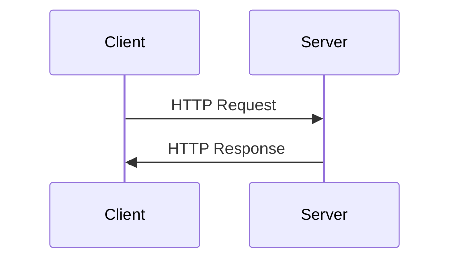

### Common HTTP Methods

| Method | Purpose                | Example        |
| ------ | ---------------------- | -------------- |
| GET    | Retrieve data          | Get user       |
| POST   | Create new resource    | Create order   |
| PUT    | Update entire resource | Update user    |
| PATCH  | Partial update         | Update email   |
| DELETE | Remove resource        | Delete product |

Example:

```http
GET /users/1
POST /orders
PUT /users/1
DELETE /products/5
```

------

## 53. What are HTTP status codes (200, 404, 500)?

Status codes indicate **result of request**.

### Categories

| Range | Meaning       |
| ----- | ------------- |
| 1xx   | Informational |
| 2xx   | Success       |
| 3xx   | Redirection   |
| 4xx   | Client error  |
| 5xx   | Server error  |

### Common Codes

| Code | Meaning               |
| ---- | --------------------- |
| 200  | OK                    |
| 201  | Created               |
| 400  | Bad Request           |
| 401  | Unauthorized          |
| 403  | Forbidden             |
| 404  | Not Found             |
| 500  | Internal Server Error |
| 503  | Service Unavailable   |

Example response:

```http
HTTP/1.1 200 OK
Content-Type: application/json
```

------

## 54. What is REST API?

**REST (Representational State Transfer)** is an architectural style for designing APIs.

### REST Principles

- Client-Server architecture
- Stateless requests
- Resource-based URLs
- Use HTTP methods
- Representation using JSON/XML

Example:

```http
GET /users/1
```

Response:

```json
{
  "id": 1,
  "name": "John"
}
```

### REST Architecture

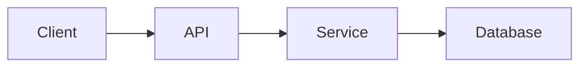

------

## 55. What is JSON?

**JSON (JavaScript Object Notation)** is a lightweight data format used for **API communication**.

Example:

```json
{
  "id": 101,
  "name": "Laptop",
  "price": 75000
}
```

### Advantages

- Lightweight
- Human readable
- Language independent
- Faster than XML

------

## 56. `@RestController` vs `@Controller`

### `@Controller`

Used for **Spring MVC web applications** returning **views (HTML)**.

```java
@Controller
public class HomeController {

    @GetMapping("/")
    public String home() {
        return "index";
    }
}
```

### `@RestController`

Used for **REST APIs** returning **JSON responses**.

```java
@RestController
public class UserController {

    @GetMapping("/users")
    public List<User> getUsers() {
        return userService.getUsers();
    }
}
```

### Key Difference

| Feature     | Controller    | RestController                |
| ----------- | ------------- | ----------------------------- |
| Return type | View (HTML)   | JSON                          |
| Annotation  | `@Controller` | `@Controller + @ResponseBody` |

------

## 57. Process of Creating a REST API (Spring Boot Example)

### Step 1: Create Entity

```java
@Entity
public class User {
    @Id
    private Long id;
    private String name;
}
```

### Step 2: Create Repository

```java
@Repository
public interface UserRepository extends JpaRepository<User, Long> {
}
```

### Step 3: Create Service

```java
@Service
public class UserService {

    @Autowired
    private UserRepository repository;

    public List<User> getUsers(){
        return repository.findAll();
    }
}
```

### Step 4: Create Controller

```java
@RestController
@RequestMapping("/users")
public class UserController {

    @Autowired
    private UserService service;

    @GetMapping
    public List<User> getUsers(){
        return service.getUsers();
    }
}
```

### REST API Flow

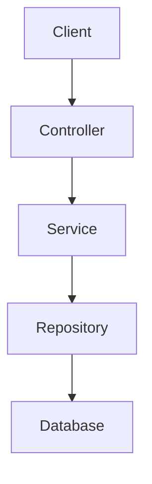

------

# 5️⃣ REST API Advanced

------

## 118. `@RequestMapping` vs `@GetMapping`

### `@RequestMapping`

Generic mapping for **all HTTP methods**.

```java
@RequestMapping(value="/users", method=RequestMethod.GET)
public List<User> getUsers() {}
```

### `@GetMapping`

Shortcut for **GET requests only**.

```java
@GetMapping("/users")
public List<User> getUsers() {}
```

### Summary

| Annotation        | Usage           |
| ----------------- | --------------- |
| `@RequestMapping` | Any HTTP method |
| `@GetMapping`     | GET only        |

------

## 119. `@PathVariable` vs `@RequestParam`

### `@PathVariable`

Extract value from **URL path**.

Example:

```java
@GetMapping("/users/{id}")
public User getUser(@PathVariable Long id) {
    return service.getUser(id);
}
```

Request:

```
GET /users/10
```

------

### `@RequestParam`

Extract value from **query parameters**.

```java
@GetMapping("/users")
public List<User> getUsers(@RequestParam String city) {
    return service.findByCity(city);
}
```

Request:

```
GET /users?city=Pune
```

------

### Comparison

| Feature | PathVariable | RequestParam    |
| ------- | ------------ | --------------- |
| Source  | URL path     | Query parameter |
| Example | /users/10    | /users?id=10    |

------

## 120. `@PostMapping` vs `@PutMapping`

### `@PostMapping`

Used to **create new resource**.

```java
@PostMapping("/users")
public User createUser(@RequestBody User user) {
    return service.save(user);
}
```

------

### `@PutMapping`

Used to **update existing resource**.

```java
@PutMapping("/users/{id}")
public User updateUser(@PathVariable Long id, @RequestBody User user) {
    return service.update(id,user);
}
```

### Summary

| Method | Purpose |
| ------ | ------- |
| POST   | Create  |
| PUT    | Update  |

------

## 121. PUT vs PATCH

### PUT

Updates **entire resource**.

Example request:

```json
{
  "id": 1,
  "name": "John",
  "email": "john@gmail.com"
}
```

If field missing → may be overwritten.

------

### PATCH

Updates **partial resource**.

Example:

```json
{
  "email": "newmail@gmail.com"
}
```

------

### Comparison

| Feature     | PUT         | PATCH          |
| ----------- | ----------- | -------------- |
| Update type | Full update | Partial update |
| Idempotent  | Yes         | Usually yes    |

------

## 122. `@ExceptionHandler` vs `@ControllerAdvice`

### `@ExceptionHandler`

Handles exceptions **inside a single controller**.

```java
@ExceptionHandler(UserNotFoundException.class)
public ResponseEntity<String> handleException() {
    return ResponseEntity.status(404).body("User not found");
}
```

------

### `@ControllerAdvice`

Global exception handler for **all controllers**.

```java
@ControllerAdvice
public class GlobalExceptionHandler {

    @ExceptionHandler(Exception.class)
    public ResponseEntity<String> handleException() {
        return ResponseEntity.status(500).body("Internal error");
    }
}
```

------

### Comparison

| Feature     | ExceptionHandler  | ControllerAdvice |
| ----------- | ----------------- | ---------------- |
| Scope       | Single controller | Global           |
| Reusability | Low               | High             |


---

# 6️⃣ Spring Boot Important Annotations

---

## 123. `@ComponentScan` vs `@EnableAutoConfiguration`

### `@ComponentScan`
Tells Spring **where to scan for components** (classes annotated with `@Component`, `@Service`, `@Repository`, `@Controller`).

```java
@SpringBootApplication
@ComponentScan("com.example.service")
public class Application {}
```

### `@EnableAutoConfiguration`

Automatically **configures beans based on dependencies in classpath**.

Example:

- If `spring-boot-starter-web` present → Spring configures **Tomcat + DispatcherServlet**

### Relationship

`@SpringBootApplication` includes both.

```java
@SpringBootApplication =
@Configuration
+ @EnableAutoConfiguration
+ @ComponentScan
```

### Summary

| Annotation                 | Purpose                                 |
| -------------------------- | --------------------------------------- |
| `@ComponentScan`           | Scan project classes                    |
| `@EnableAutoConfiguration` | Configure framework beans automatically |

------

## 124. `@Configuration` vs `@Bean`

### `@Configuration`

Marks a class as **Spring configuration class**.

```java
@Configuration
public class AppConfig {}
```

### `@Bean`

Defines a **bean manually** inside configuration class.

```java
@Configuration
public class AppConfig {

    @Bean
    public PaymentService paymentService() {
        return new PaypalService();
    }
}
```

### Difference

| Annotation       | Used On | Purpose               |
| ---------------- | ------- | --------------------- |
| `@Configuration` | Class   | Defines configuration |
| `@Bean`          | Method  | Creates bean          |

------

## 125. `@Async` vs `@Scheduled`

### `@Async`

Runs method **asynchronously in separate thread**.

```java
@Async
public void sendEmail() {
    // runs in background
}
```

Used for:

- Email sending
- Notifications
- Background tasks

Enable async:

```java
@EnableAsync
```

------

### `@Scheduled`

Runs method **at fixed time interval**.

```java
@Scheduled(fixedRate = 5000)
public void cleanupLogs() {
    // runs every 5 seconds
}
```

Enable scheduling:

```java
@EnableScheduling
```

------

### Comparison

| Feature   | `@Async`           | `@Scheduled` |
| --------- | ------------------ | ------------ |
| Execution | Background thread  | Time-based   |
| Trigger   | Method call        | Scheduler    |
| Use case  | Non-blocking tasks | Cron jobs    |

------

## 126. `@Cacheable` vs `@CacheEvict`

### `@Cacheable`

Stores **method result in cache**.

```java
@Cacheable("products")
public Product getProduct(Long id) {
    return repository.findById(id);
}
```

First call → DB
Next calls → Cache

------

### `@CacheEvict`

Removes data from cache.

```java
@CacheEvict(value="products", key="#id")
public void deleteProduct(Long id) {
    repository.deleteById(id);
}
```

Used when data changes.

------

### Comparison

| Annotation    | Purpose               |
| ------------- | --------------------- |
| `@Cacheable`  | Store result in cache |
| `@CacheEvict` | Remove cache entry    |

------

# 7️⃣ Database & JPA Basics

------

## 127. What is ORM?

**ORM (Object Relational Mapping)** maps **Java objects to database tables**.

Example:

| Java Class | Database Table |
| ---------- | -------------- |
| User       | users          |

```java
class User {
   Long id;
   String name;
}
```

ORM converts it into SQL operations.

### Benefits

- Less SQL code
- Object-oriented programming
- DB abstraction

Popular ORMs:

- Hibernate
- EclipseLink
- TopLink

------

## 128. What is JPA? Difference between JPA and Hibernate?

### JPA (Java Persistence API)

Specification for **ORM in Java**.

Provides interfaces and annotations for persistence.

Examples:

```java
@Entity
@Id
@OneToMany
```

------

### Hibernate

Implementation of JPA.

```
JPA → Specification
Hibernate → Implementation
```

------

### Comparison

| Feature        | JPA               | Hibernate               |
| -------------- | ----------------- | ----------------------- |
| Type           | Specification     | Framework               |
| Developed by   | Oracle            | Hibernate team          |
| Implementation | Requires provider | Provides implementation |

------

## 129. What is an Entity in JPA?

An **Entity is a Java class mapped to a database table**.

Example:

```java
@Entity
public class User {

    @Id
    private Long id;

    private String name;
}
```

Mapping:

```
User class → users table
```

Rules:

- Must have `@Entity`
- Must have `@Id`
- Must have default constructor

------

## 130. JPA annotations (`@Entity`, `@Id`, `@GeneratedValue`)

### `@Entity`

Marks class as database entity.

```java
@Entity
public class Product {}
```

------

### `@Id`

Defines **primary key**.

```java
@Id
private Long id;
```

------

### `@GeneratedValue`

Auto-generates primary key.

```java
@Id
@GeneratedValue(strategy = GenerationType.IDENTITY)
private Long id;
```

### Strategies

| Strategy | Description       |
| -------- | ----------------- |
| IDENTITY | Auto increment    |
| SEQUENCE | Database sequence |
| AUTO     | Provider decides  |

------

## 131. Difference between `persist()` and `merge()`

### `persist()`

Used to **insert new entity**.

```java
entityManager.persist(user);
```

- Works only for **new entities**
- Managed by persistence context

------

### `merge()`

Used to **update detached entity**.

```java
entityManager.merge(user);
```

- Works for existing entities
- Returns managed entity

------

### Comparison

| Feature      | persist()  | merge()         |
| ------------ | ---------- | --------------- |
| Operation    | Insert     | Update          |
| Entity state | New entity | Detached entity |

------

## 132. JPA Relationships

Used to map **table relationships**.

### Types

| Annotation    | Relationship                 |
| ------------- | ---------------------------- |
| `@OneToOne`   | One user → one profile       |
| `@OneToMany`  | One user → many orders       |
| `@ManyToOne`  | Many orders → one user       |
| `@ManyToMany` | Many students ↔ many courses |

------

### Example

```java
@Entity
class Order {

    @ManyToOne
    private User user;
}
```

------

### Relationship Diagram

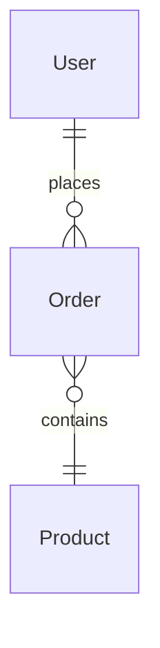

------

## 133. What is JPQL?

**JPQL (Java Persistence Query Language)** queries **entities instead of tables**.

Example SQL:

```sql
SELECT * FROM users
```

Example JPQL:

```java
SELECT u FROM User u WHERE u.name='John'
```

### Advantages

- Database independent
- Object oriented queries

------

## 134. Lazy Loading vs Eager Loading

### Lazy Loading

Data loaded **only when accessed**.

```java
@OneToMany(fetch = FetchType.LAZY)
```

Example:

User → orders loaded **only when accessed**

------

### Eager Loading

Data loaded **immediately with entity**.

```java
@OneToMany(fetch = FetchType.EAGER)
```

Example:

User → orders loaded automatically

------

### Comparison

| Feature      | Lazy                       | Eager                   |
| ------------ | -------------------------- | ----------------------- |
| Loading time | On demand                  | Immediately             |
| Performance  | Better for large relations | Can cause heavy queries |

------

## 135. `save()` vs `saveAndFlush()`

### `save()`

Saves entity but **flush happens later**.

```java
repository.save(user);
```

Data may not be written to DB immediately.

------

### `saveAndFlush()`

Saves and **immediately flushes changes to DB**.

```java
repository.saveAndFlush(user);
```

------

### Difference

| Method         | DB Write  |
| -------------- | --------- |
| save()         | Deferred  |
| saveAndFlush() | Immediate |

------

## 136. Hibernate `get()` vs `load()`

### `get()`

Immediately fetches object from DB.

```java
User user = session.get(User.class,1);
```

If not found → returns **null**

------

### `load()`

Returns **proxy object** (lazy loading).

```java
User user = session.load(User.class,1);
```

If accessed and not found → throws exception.

------

### Comparison

| Feature           | get()           | load()         |
| ----------------- | --------------- | -------------- |
| Fetching          | Immediate       | Lazy           |
| Return if missing | null            | Exception      |
| Performance       | Slightly slower | Faster (proxy) |

---

# 8️⃣ Testing (Spring Boot)

137. What is JUnit? Basic annotations?
138. What is Mockito? When to use `@Mock`?
139. What is the difference between `@Mock`, `@MockBean`, and `@Spy`?
140. How do you test REST controllers using MockMvc?
141. What is `@SpringBootTest` vs `@WebMvcTest`?

---

# 9️⃣ Spring Security Basics

---

## 142. Authentication vs Authorization

### Authentication
Verifies **who the user is**.

Example:
- Login with **username/password**
- Login with **Google OAuth**

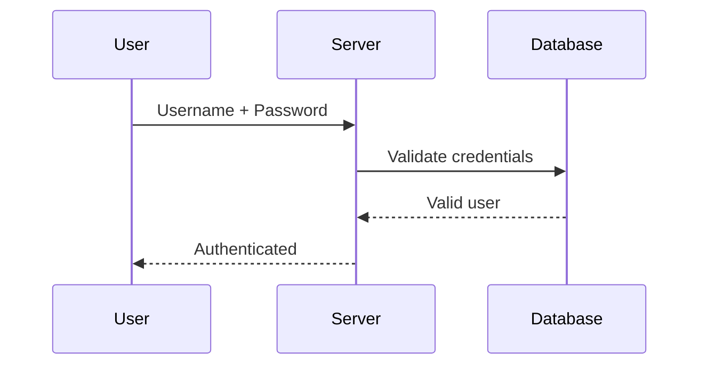

Examples:

- Login form
- JWT token verification
- OAuth login

------

### Authorization

Determines **what the user is allowed to do**.

Example:

| User Role | Permission          |
| --------- | ------------------- |
| Admin     | Create/Delete users |
| User      | View profile        |

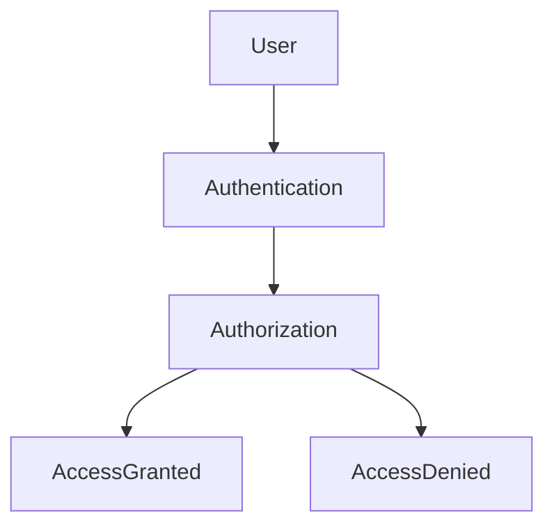

------

### Key Difference

| Feature | Authentication  | Authorization        |
| ------- | --------------- | -------------------- |
| Purpose | Verify identity | Verify permissions   |
| Happens | First           | After authentication |
| Example | Login           | Role-based access    |

------

## 143. What is Spring Security?

Spring Security is a **framework that provides authentication and authorization for Java applications**.

### Features

- Authentication
- Authorization
- Password encryption
- CSRF protection
- JWT support
- OAuth2 support
- Session management

------

### Security Flow

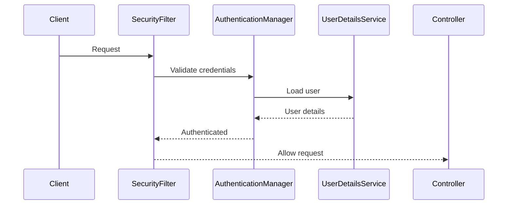

------

### Example Configuration

```java
@Configuration
@EnableWebSecurity
public class SecurityConfig {

    @Bean
    SecurityFilterChain filterChain(HttpSecurity http) throws Exception {

        http
            .csrf().disable()
            .authorizeHttpRequests(auth -> auth
                .requestMatchers("/admin/**").hasRole("ADMIN")
                .anyRequest().authenticated()
            )
            .httpBasic();

        return http.build();
    }
}
```

------

## 144. How do you secure REST APIs using Spring Security?

### Typical Steps

1️⃣ Add dependency

```xml
<dependency>
 <groupId>org.springframework.boot</groupId>
 <artifactId>spring-boot-starter-security</artifactId>
</dependency>
```

------

2️⃣ Configure security

```java
@Bean
SecurityFilterChain securityFilterChain(HttpSecurity http) throws Exception {

    http
      .csrf().disable()
      .authorizeHttpRequests(auth -> auth
          .requestMatchers("/public/**").permitAll()
          .requestMatchers("/admin/**").hasRole("ADMIN")
          .anyRequest().authenticated()
      )
      .sessionManagement()
      .sessionCreationPolicy(SessionCreationPolicy.STATELESS);

    return http.build();
}
```

------

3️⃣ Use JWT authentication

```mermaid
sequenceDiagram
User->>Auth Server: Login
Auth Server-->>User: JWT Token
User->>API: Request + JWT
API->>JWT Filter: Validate Token
JWT Filter-->>Controller: Authorized
```

------

### Best Practices

- Use **JWT tokens**
- Disable **sessions (stateless APIs)**
- Enable **HTTPS**
- Use **role-based access control**

------

## 145. OAuth2 vs JWT

### OAuth2

Authorization framework for **third-party access**.

Example:

- Login with Google
- Login with Facebook

Flow:

```mermaid
sequenceDiagram
User->>Client App: Login
Client App->>OAuth Server: Authorization request
OAuth Server-->>User: Login page
User-->>OAuth Server: Credentials
OAuth Server-->>Client App: Access Token
```

------

### JWT (JSON Web Token)

Compact token used for **stateless authentication**.

Example JWT:

```json
{
 "sub": "user123",
 "role": "ADMIN",
 "exp": 1700000000
}
```

JWT Structure:

```
Header.Payload.Signature
```

Example:

```
eyJhbGciOiJIUzI1NiIsInR5cCI6IkpXVCJ9...
```

------

### Comparison

| Feature  | OAuth2                  | JWT                |
| -------- | ----------------------- | ------------------ |
| Type     | Authorization framework | Token format       |
| Use case | Third-party login       | API authentication |
| Example  | Google login            | Microservice auth  |

------

## 146. Important HTTP Status Codes

### 401 — Unauthorized

User **not authenticated**.

Example:

- Missing token
- Invalid credentials

```
HTTP 401 Unauthorized
```

------

### 403 — Forbidden

User **authenticated but not allowed**.

Example:

- User accessing admin API.

```
HTTP 403 Forbidden
```

------

### 404 — Not Found

Requested resource **does not exist**.

Example:

```
GET /users/999
```

User not found.

------

### 500 — Internal Server Error

Server-side failure.

Examples:

- NullPointerException
- Database crash

------

### 502 — Bad Gateway

Server received **invalid response from upstream service**.

Example:

```
Client → API Gateway → Downstream Service
```

Downstream service sends bad response.

------

### 503 — Service Unavailable

Server temporarily **unable to handle request**.

Common causes:

- Server overload
- Maintenance
- Dependency service down

------

### Status Code Summary

| Code | Meaning               | Typical Cause          |
| ---- | --------------------- | ---------------------- |
| 401  | Unauthorized          | Not logged in          |
| 403  | Forbidden             | No permission          |
| 404  | Not Found             | Resource missing       |
| 500  | Internal Server Error | Server crash           |
| 502  | Bad Gateway           | Upstream service error |
| 503  | Service Unavailable   | Server overloaded      |

---

# 🔟 Spring Bean Lifecycle & Scopes

---

## 175. How does Spring manage bean lifecycle? What are the hooks?

### Bean Lifecycle Steps

```mermaid
flowchart LR
A[Bean Instantiation] --> B[Dependency Injection]
B --> C[BeanPostProcessor before init]
C --> D[Initialization Methods]
D --> E[Bean Ready for Use]
E --> F[BeanPostProcessor after init]
F --> G[Destroy Method]
```

### Lifecycle Hooks

| Hook                                    | Purpose                         |
| --------------------------------------- | ------------------------------- |
| `@PostConstruct`                        | Runs after dependency injection |
| `InitializingBean.afterPropertiesSet()` | Custom initialization           |
| `@PreDestroy`                           | Runs before bean destruction    |
| `DisposableBean.destroy()`              | Custom destroy logic            |
| `BeanPostProcessor`                     | Intercept bean creation         |

Example:

```java
@Component
public class MyBean {

    @PostConstruct
    public void init() {
        System.out.println("Bean initialized");
    }

    @PreDestroy
    public void cleanup() {
        System.out.println("Bean destroyed");
    }
}
```

------

## 176. What is a Proxy in Spring? JDK vs CGLIB proxies?

### Proxy

Spring creates **proxy objects** to apply features like:

- AOP
- Transactions
- Security

Instead of calling actual bean → request goes through proxy.


------

### JDK Dynamic Proxy

- Uses **Java interfaces**
- Proxy implements the interface

```java
interface PaymentService {}
```

Limitation:

```text
Works only if bean implements interface
```

------

### CGLIB Proxy

- Creates subclass at runtime
- Works **without interface**

```text
class OrderService
   ↑
CGLIB Proxy
```

------

### Comparison

| Feature            | JDK Proxy       | CGLIB           |
| ------------------ | --------------- | --------------- |
| Requires interface | Yes             | No              |
| Proxy type         | Interface       | Subclass        |
| Performance        | Slightly faster | Slightly slower |

------

## 177. `@Autowired` vs `@Inject` vs `@Resource`

### `@Autowired`

Spring-specific annotation.

Injection by **type**.

```java
@Autowired
PaymentService service;
```

------

### `@Inject`

Standard **JSR-330** annotation.

```java
@Inject
PaymentService service;
```

Works similar to `@Autowired`.

------

### `@Resource`

Java **JSR-250** annotation.

Injection by **name first**, then type.

```java
@Resource(name="paymentService")
PaymentService service;
```

------

### Comparison

| Annotation   | Source  | Injection |
| ------------ | ------- | --------- |
| `@Autowired` | Spring  | Type      |
| `@Inject`    | JSR-330 | Type      |
| `@Resource`  | JSR-250 | Name      |

------

## 178. Can you inject a prototype bean into a singleton? How?

### Problem

Singleton created once, prototype created **every request**.

If injected normally:

```java
@Autowired
PrototypeBean bean;
```

Singleton will hold **same instance**.

------

### Solutions

#### 1️⃣ `ObjectProvider`

```java
@Autowired
ObjectProvider<PrototypeBean> provider;

public void process(){
    PrototypeBean bean = provider.getObject();
}
```

------

#### 2️⃣ `@Lookup`

```java
@Lookup
public PrototypeBean getPrototypeBean(){
    return null;
}
```

------

#### 3️⃣ ApplicationContext

```java
context.getBean(PrototypeBean.class);
```

------

## 179. Default scope of bean in Spring

Default scope:

```text
Singleton
```

Meaning:

```text
Only ONE instance per Spring container
```

Example:

```java
@Service
public class UserService {}
```

------

## 180. Bean scopes in Spring

| Scope       | Description                |
| ----------- | -------------------------- |
| Singleton   | One instance per container |
| Prototype   | New instance every request |
| Request     | One per HTTP request       |
| Session     | One per HTTP session       |
| Application | One per ServletContext     |
| WebSocket   | One per WebSocket          |

Example:

```java
@Scope("prototype")
@Component
class OrderBean {}
```

------

## 181. Prototype vs Request Scope

| Feature           | Prototype         | Request            |
| ----------------- | ----------------- | ------------------ |
| Instance creation | Every injection   | Every HTTP request |
| Scope             | Spring container  | Web request        |
| Use case          | Temporary objects | Request data       |

Example:

```java
@Scope(value = WebApplicationContext.SCOPE_REQUEST)
```

------

# 1️⃣1️⃣ Spring Boot Observability & Monitoring

------

## 181. What is Spring Boot Actuator?

Spring Boot Actuator provides **production monitoring endpoints**.

Dependency:

```xml
<dependency>
 <groupId>org.springframework.boot</groupId>
 <artifactId>spring-boot-starter-actuator</artifactId>
</dependency>
```

------

### Important Endpoints

| Endpoint            | Purpose                |
| ------------------- | ---------------------- |
| `/actuator/health`  | Application health     |
| `/actuator/metrics` | JVM metrics            |
| `/actuator/info`    | App info               |
| `/actuator/env`     | Environment properties |
| `/actuator/loggers` | Logging levels         |
| `/actuator/beans`   | All beans              |

Example:

```http
GET /actuator/health
```

Response:

```json
{
 "status":"UP"
}
```

------

## 182. How do you implement custom health checks?

Create **HealthIndicator**.

```java
@Component
public class DatabaseHealthIndicator implements HealthIndicator {

    @Override
    public Health health() {
        boolean dbUp = checkDatabase();

        if(dbUp){
            return Health.up().build();
        }else{
            return Health.down().build();
        }
    }
}
```

Access:

```
/actuator/health
```

------

## 183. Custom metrics and monitoring

Use **Micrometer**.

Example:

```java
@Autowired
MeterRegistry registry;

Counter counter = registry.counter("orders.created");
counter.increment();
```

Example metric:

```
orders.created=10
```

Tools used:

- Prometheus
- Grafana
- Datadog
- New Relic

------

# 1️⃣2️⃣ Custom Auto Configuration

------

## 180. How do you create custom auto-configuration?

Steps:

1️⃣ Create configuration class

```java
@Configuration
public class MyAutoConfig {

    @Bean
    public PaymentService paymentService(){
        return new PaymentService();
    }
}
```

------

2️⃣ Register auto configuration

```
META-INF/spring/org.springframework.boot.autoconfigure.AutoConfiguration.imports
```

Add:

```
com.example.MyAutoConfig
```

------

3️⃣ Spring loads automatically when dependency added.

------

## 181. `@ConditionalOnProperty`, `@ConditionalOnClass`

Used for **conditional bean creation**.

------

### `@ConditionalOnProperty`

Bean created only if property exists.

```java
@ConditionalOnProperty(name="feature.payment.enabled", havingValue="true")
```

Example:

```properties
feature.payment.enabled=true
```

------

### `@ConditionalOnClass`

Bean created only if class exists in classpath.

```java
@ConditionalOnClass(DataSource.class)
```

Used in Spring Boot auto-config.

------

# 1️⃣3️⃣ Spring AOP (Aspect Oriented Programming)

------

## 187. What is AOP?

AOP separates **cross-cutting concerns** from business logic.

Examples:

- Logging
- Security
- Transactions
- Auditing

```mermaid
flowchart LR
Controller --> Service
Service --> Repository
LoggingAspect --> Service
SecurityAspect --> Controller
```

------

## 188. AOP Advices

| Advice            | When executed              |
| ----------------- | -------------------------- |
| `@Before`         | Before method execution    |
| `@After`          | After method execution     |
| `@Around`         | Before + After             |
| `@AfterReturning` | After successful execution |
| `@AfterThrowing`  | After exception            |

Example:

```java
@Before("execution(* com.app.service.*.*(..))")
public void logBefore(){
    System.out.println("Method called");
}
```

------

## 189. What is a Pointcut?

Pointcut defines **which methods AOP applies to**.

Example:

```java
@Pointcut("execution(* com.app.service.*.*(..))")
public void serviceMethods(){}
```

Meaning:

```
All methods inside service package
```

------

## 190. What is JoinPoint?

JoinPoint represents **method execution point**.

It provides data like:

- Method name
- Arguments
- Target object

Example:

```java
@Before("serviceMethods()")
public void log(JoinPoint joinPoint){
    System.out.println(joinPoint.getSignature().getName());
}
```

------

## 191. Custom annotations + AOP

### Step 1: Create annotation

```java
@Target(ElementType.METHOD)
@Retention(RetentionPolicy.RUNTIME)
public @interface LogExecution {}
```

------

### Step 2: Intercept with AOP

```java
@Aspect
@Component
public class LoggingAspect {

    @Before("@annotation(LogExecution)")
    public void log(){
        System.out.println("Method executed");
    }
}
```

------

### Step 3: Use annotation

```java
@LogExecution
public void processOrder(){}
```

------

## 192. Real-world use cases of AOP

| Use Case     | Example            |
| ------------ | ------------------ |
| Logging      | Log API requests   |
| Auditing     | Track user actions |
| Security     | Check permissions  |
| Transactions | `@Transactional`   |
| Caching      | `@Cacheable`       |

Example logging aspect:

```java
@Around("execution(* com.app.service.*.*(..))")
public Object logExecution(ProceedingJoinPoint joinPoint) throws Throwable {

    long start = System.currentTimeMillis();

    Object result = joinPoint.proceed();

    long time = System.currentTimeMillis() - start;

    System.out.println("Execution time: " + time);

    return result;
}
```

---

# 1️⃣4️⃣ Advanced JPA & Database

---

## 193. What is the N+1 Select Problem in JPA? How to fix it?

### Problem

Occurs when JPA executes:

- **1 query to fetch parent entities**
- **N queries to fetch child entities**

Example:

```java
List<User> users = userRepository.findAll();
```

Then accessing:

```java
user.getOrders();
```

Queries executed:

```sql
1 query → users
N queries → orders
```

Total = **N+1 queries**

------

### Example Flow

```mermaid
sequenceDiagram
App->>DB: SELECT * FROM users
loop for each user
App->>DB: SELECT * FROM orders WHERE user_id=?
end
```

------

### Fixes

1️⃣ **Fetch Join**

```java
@Query("SELECT u FROM User u JOIN FETCH u.orders")
List<User> findAllUsersWithOrders();
```

2️⃣ **EntityGraph**

```java
@EntityGraph(attributePaths = {"orders"})
List<User> findAll();
```

3️⃣ **Batch fetching**

```properties
spring.jpa.properties.hibernate.default_batch_fetch_size=50
```

------

## 194. What are Entity Graphs?

Entity Graphs control **which relationships should be loaded eagerly**.

Avoids **N+1 problem without modifying query**.

Example:

```java
@EntityGraph(attributePaths = {"orders"})
List<User> findAll();
```

------

### Diagram

```mermaid
graph LR
User --> Orders
User --> Address
```

With EntityGraph:

```text
Fetch only required relationships
```

------

## 195. `@Query` vs Derived Queries vs Criteria API

### Derived Query

Spring automatically generates query from method name.

```java
List<User> findByEmail(String email);
```

Good for **simple queries**.

------

### `@Query`

Write **custom JPQL/SQL query**.

```java
@Query("SELECT u FROM User u WHERE u.age > :age")
List<User> findUsersOlderThan(int age);
```

Good for **complex queries**.

------

### Criteria API

Build **dynamic queries programmatically**.

```java
CriteriaBuilder cb = entityManager.getCriteriaBuilder();
```

Used when:

```text
Dynamic filters required
```

------

### Comparison

| Feature         | Derived | @Query  | Criteria  |
| --------------- | ------- | ------- | --------- |
| Simplicity      | High    | Medium  | Low       |
| Flexibility     | Low     | High    | Very High |
| Dynamic queries | No      | Limited | Yes       |

------

## 196. Optimistic Locking (`@Version`)

Prevents **lost updates** when multiple users update same record.

Example:

```java
@Version
private Long version;
```

------

### Flow

```mermaid
sequenceDiagram
User1->>DB: Read product (v1)
User2->>DB: Read product (v1)
User1->>DB: Update (v2)
User2->>DB: Update fails (version mismatch)
```

------

### Advantages

- No database lock
- Better performance
- Ideal for **low contention systems**

------

## 197. Pessimistic Locking

Locks row **immediately when reading**.

SQL example:

```sql
SELECT * FROM product WHERE id=1 FOR UPDATE
```

------

### Types

| Lock                        | Description        |
| --------------------------- | ------------------ |
| PESSIMISTIC_READ            | Prevent writes     |
| PESSIMISTIC_WRITE           | Prevent read/write |
| PESSIMISTIC_FORCE_INCREMENT | Increment version  |

Example:

```java
@Lock(LockModeType.PESSIMISTIC_WRITE)
Product findById(Long id);
```

------

### When to Use

- High contention
- Banking systems
- Inventory systems

------

## 198. Pagination and Sorting in Spring Data JPA

Use **Pageable interface**.

Example:

```java
Page<User> users = userRepository.findAll(PageRequest.of(0,10));
```

------

### Sorting

```java
PageRequest.of(0,10, Sort.by("name").ascending());
```

------

### API Example

```http
GET /users?page=0&size=10&sort=name
```

------

### Flow

```mermaid
graph LR
Client --> Controller
Controller --> Repository
Repository --> Database
```

------

## 199. Database Transactions & ACID

Transaction = **group of operations executed as single unit**

Example:

```text
Transfer money
Debit A
Credit B
```

------

### ACID Properties

| Property    | Meaning                  |
| ----------- | ------------------------ |
| Atomicity   | All or nothing           |
| Consistency | Data remains valid       |
| Isolation   | Transactions independent |
| Durability  | Changes persist          |

------

### Example

```java
@Transactional
public void transferMoney(){}
```

------

## 200. Connection Pooling & HikariCP

Connection pooling **reuses database connections**.

Without pool:

```text
Every request creates new connection
```

With pool:

```text
Reuse existing connections
```

------

### Flow

```mermaid
graph LR
App --> ConnectionPool
ConnectionPool --> Database
```

------

### HikariCP Config

```properties
spring.datasource.hikari.maximum-pool-size=10
spring.datasource.hikari.minimum-idle=5
spring.datasource.hikari.connection-timeout=30000
```

------

## 201. Database Migrations (Flyway / Liquibase)

Used to **version-control database schema**.

------

### Flyway Example

Create migration file:

```
V1__create_user_table.sql
```

Example SQL:

```sql
CREATE TABLE users (
 id BIGINT PRIMARY KEY,
 name VARCHAR(100)
);
```

Spring Boot automatically runs migrations on startup.

------

### Benefits

- Versioned schema
- Automated migrations
- CI/CD friendly

------

## 202. Database Indexing & Query Optimization

Index improves **query performance**.

Example:

```sql
CREATE INDEX idx_user_email ON users(email);
```

------

### Without Index

```text
Full table scan
```

### With Index

```text
Fast lookup
```

------

### Optimization Strategies

1️⃣ Use indexes on:

- Foreign keys
- Search columns

2️⃣ Avoid:

```sql
SELECT *
```

3️⃣ Use:

```sql
EXPLAIN ANALYZE
```

4️⃣ Use pagination.

------

# 1️⃣5️⃣ Advanced Spring Security

------

## 203. OAuth2 + JWT in Spring Boot

Typical architecture:

```mermaid
sequenceDiagram
User->>AuthServer: Login
AuthServer-->>User: JWT Token
User->>API: Request + JWT
API->>JWT Filter: Validate token
JWT Filter-->>Controller: Authorized
```

Steps:

1️⃣ Add dependency

```
spring-boot-starter-oauth2-resource-server
```

2️⃣ Configure JWT decoder

3️⃣ Protect endpoints.

------

## 204. Stateless Session & JWT

Stateless session:

```text
Server does NOT store session
```

Authentication info stored inside **JWT token**.

------

### Flow

```mermaid
sequenceDiagram
Client->>Server: Login
Server-->>Client: JWT
Client->>Server: Request + JWT
Server->>JWT: Validate
Server-->>Client: Response
```

------

### Benefits

- Scalable
- No server session storage
- Works well with microservices

------

## 205. Two-Factor Authentication (2FA)

Adds **second verification layer**.

Example:

1️⃣ Password login
2️⃣ OTP verification

------

### Flow

```mermaid
sequenceDiagram
User->>Server: Login
Server-->>User: Send OTP
User->>Server: Submit OTP
Server-->>User: Authenticated
```

Methods:

- SMS OTP
- Email OTP
- Google Authenticator (TOTP)

------

## 206. CSRF Protection

CSRF = **Cross-Site Request Forgery**

Attack:

```text
Malicious site sends request using logged-in user session
```

------

### Protection

Spring generates **CSRF token**.

Example:

```html
<input type="hidden" name="_csrf">
```

For REST APIs:

```java
http.csrf().disable();
```

------

## 207. Pre-auth vs Post-auth Filters

### Pre-auth Filters

Executed **before authentication**.

Examples:

- JWT filter
- CORS filter

------

### Post-auth Filters

Executed **after authentication**.

Examples:

- Authorization checks
- Role verification

------

## 208. `SecurityFilterChain` (Spring Boot 3)

Replaces **WebSecurityConfigurerAdapter**.

Example:

```java
@Bean
SecurityFilterChain securityFilterChain(HttpSecurity http) throws Exception {

    http
      .csrf().disable()
      .authorizeHttpRequests(auth -> auth
        .requestMatchers("/public/**").permitAll()
        .anyRequest().authenticated()
      );

    return http.build();
}
```

------

## 209. `UserDetailsService`

Interface used to **load user data for authentication**.

Example:

```java
@Service
public class CustomUserDetailsService implements UserDetailsService {

    public UserDetails loadUserByUsername(String username){
        return userRepository.findByUsername(username);
    }
}
```

------

## 210. Role-Based Access Control (RBAC)

Access based on **user roles**.

Example roles:

```text
ROLE_USER
ROLE_ADMIN
```

Example:

```java
.requestMatchers("/admin/**").hasRole("ADMIN")
```

------

## 211. Method-Level Security

Enable:

```java
@EnableMethodSecurity
```

Example:

```java
@PreAuthorize("hasRole('ADMIN')")
public void deleteUser(){}
```

------

## 212. Securing Microservices Communication

Methods:

1️⃣ **JWT tokens**
2️⃣ **API Gateway authentication**
3️⃣ **mTLS (Mutual TLS)**
4️⃣ **OAuth2 resource server**

Architecture:

```mermaid
graph LR
Client --> API_Gateway
API_Gateway --> ServiceA
ServiceA --> ServiceB
ServiceB --> Database
```

------

## 213. OAuth Authentication in Spring Boot

Steps:

1️⃣ Configure OAuth provider (Google, GitHub)

```properties
spring.security.oauth2.client.registration.google.client-id=xxx
spring.security.oauth2.client.registration.google.client-secret=xxx
```

------

2️⃣ Add dependency

```
spring-boot-starter-oauth2-client
```

------

3️⃣ Login flow

```mermaid
sequenceDiagram
User->>App: Login with Google
App->>Google OAuth: Redirect
Google->>User: Authenticate
Google-->>App: Access Token
App-->>User: Logged in
```

------

---

# 🚀 Microservices, Cloud & Architecture Interview Questions

Below are **short interview-style answers with explanation and examples** useful for **3–5 years experienced Java / Spring Boot developers working with Microservices**.

------

# 1️⃣ Microservices Architecture Fundamentals

## 214. What is the difference between Monolithic and Microservices architecture?

**Monolithic**

- Entire application is built as **one single unit**.
- One codebase, one deployment.

**Microservices**

- Application is divided into **small independent services**.
- Each service has **its own database and deployment**.

**Example**

Monolithic Banking App

```
User + Account + Payment + Notification → One Application
```

Microservices

```
User Service
Account Service
Payment Service
Notification Service
```

------

## 215. How do microservices communicate with each other?

Two main ways:

### 1️⃣ Synchronous Communication

Uses **HTTP REST APIs**

Example

```
Order Service → HTTP Call → Payment Service
```

Spring Example

```java
RestTemplate restTemplate = new RestTemplate();
Payment payment = restTemplate.getForObject(
    "http://payment-service/pay/1",
    Payment.class
);
```

### 2️⃣ Asynchronous Communication

Uses **Message Brokers**

Tools

- Kafka
- RabbitMQ
- ActiveMQ

Example

```
Order Service → Kafka Topic → Payment Service
```

------

## 216. What is an API Gateway? Why is it used?

An **API Gateway** is the **single entry point for all client requests**.

Responsibilities

- Routing
- Authentication
- Rate limiting
- Load balancing
- Logging

Example tools

- Spring Cloud Gateway
- Netflix Zuul
- Kong

Architecture

```
Client
   ↓
API Gateway
   ↓
User Service
Order Service
Payment Service
```

------

## 217. What is Service Discovery?

In microservices, services run on **dynamic ports or containers**, so their location changes.

**Service Discovery** helps services **find each other automatically**.

Common tools

- Eureka
- Consul
- Zookeeper

Example

```
User Service registers in Eureka
Order Service asks Eureka → where is User Service?
```

Spring Example

```
@EnableEurekaClient
```

------

## 218. What happens when one microservice becomes slow? Isolation strategies?

If one service becomes slow, it may cause **cascading failures**.

Isolation strategies

1. **Circuit Breaker**
2. **Timeouts**
3. **Bulkhead Pattern**
4. **Retries**
5. **Fallback methods**

Example using Resilience4j

```java
@CircuitBreaker(name="paymentService", fallbackMethod="fallback")
public Payment getPayment(){
    return paymentClient.getPayment();
}
```

------

## 219. How do you handle versioning of REST APIs?

Versioning ensures **backward compatibility**.

Common methods

### 1️⃣ URI Versioning (Most common)

```
/api/v1/users
/api/v2/users
```

### 2️⃣ Header Versioning

```
Accept: application/vnd.company.v1+json
```

### 3️⃣ Request Parameter

```
/users?version=1
```

------

## 220. Difference between Sync and Async communication?

| Feature    | Sync      | Async     |
| ---------- | --------- | --------- |
| Response   | Immediate | Delayed   |
| Protocol   | REST HTTP | Messaging |
| Dependency | Tight     | Loose     |
| Example    | REST API  | Kafka     |

Example

```
Sync:
Order → Payment → Response

Async:
Order → Kafka → Payment → Event
```

------

## 221. What is Eventual Consistency? CAP Theorem?

### Eventual Consistency

In microservices, data may not be **immediately consistent** but will become consistent **after some time**.

Example

```
Order Created
↓
Payment Service updates later
```

------

### CAP Theorem

Distributed systems can guarantee only **two of three**:

| Property | Meaning             |
| -------- | ------------------- |
| C        | Consistency         |
| A        | Availability        |
| P        | Partition Tolerance |

Example

Most microservices choose

```
Availability + Partition Tolerance
```

------

## 222. How do you handle data consistency across microservices?

Common strategies

1️⃣ **Saga Pattern**

2️⃣ **Event Driven Architecture**

3️⃣ **Distributed Transactions**

Example (Saga)

```
Order Service → Create Order
↓
Payment Service → Deduct Payment
↓
Inventory Service → Reduce Stock
```

If failure occurs → **compensation transaction**

------

## 223. Microservices vs Monolithic Architecture

| Feature         | Monolithic | Microservices    |
| --------------- | ---------- | ---------------- |
| Deployment      | Single     | Independent      |
| Scalability     | Difficult  | Easy             |
| Technology      | Same stack | Different stacks |
| Fault Isolation | Low        | High             |
| Development     | Slower     | Faster teams     |

------

## 224. What is Producer and Consumer application?

Used in **Event Driven Architecture**.

### Producer

Application that **sends messages/events**.

Example

```
Order Service → publishes OrderCreated event
```

### Consumer

Application that **reads messages**.

Example

```
Payment Service → consumes OrderCreated event
```

Kafka Example

```
Producer → Kafka Topic → Consumer
```

------

# 2️⃣ Microservices Communication & Resilience

## 216. What is RestTemplate? How to use it?

`RestTemplate` is a **Spring class used to call REST APIs synchronously**.

Example

```java
RestTemplate restTemplate = new RestTemplate();

User user = restTemplate.getForObject(
   "http://user-service/users/1",
   User.class
);
```

Common methods

```
getForObject()
postForObject()
exchange()
delete()
```

Note: **WebClient is preferred in modern Spring Boot.**

------

## 217. How do you implement resilience patterns?

Common patterns

1️⃣ Retry
2️⃣ Circuit Breaker
3️⃣ Bulkhead
4️⃣ Timeout
5️⃣ Fallback

Using **Resilience4j**

Dependency

```
spring-boot-starter-aop
resilience4j-spring-boot2
```

Example

```java
@Retry(name="paymentService")
public Payment getPayment(){
   return paymentClient.getPayment();
}
```

------

## 218. What is Circuit Breaker pattern?

Circuit breaker **stops repeated calls to a failing service**.

States

```
Closed → Normal
Open → Requests blocked
Half Open → Test requests
```

Example

```
Order Service → Payment Service (Failure)
Circuit Breaker Opens → Prevents further calls
```

Libraries

- Resilience4j
- Hystrix (deprecated)

------

## 219. How do you implement API Rate Limiting?

Rate limiting restricts **number of requests per user/IP**.

Methods

- Token bucket
- Fixed window
- Sliding window

Tools

- Spring Cloud Gateway
- Redis rate limiter
- Kong / Nginx

Example

```
100 requests per minute per user
```

------

## 220. How do you implement distributed logging and tracing?

Used to track requests across microservices.

Tools

### Logging

```
ELK Stack
Elasticsearch
Logstash
Kibana
```

### Distributed Tracing

```
Zipkin
Jaeger
Spring Cloud Sleuth
```

Example Flow

```
Client Request
   ↓
API Gateway
   ↓
Order Service
   ↓
Payment Service
```

Trace ID helps track request across services.

------

## 221. How do you implement Saga Pattern for distributed transactions?

Saga handles **transactions across multiple microservices**.

Two approaches

### 1️⃣ Choreography

Services communicate using **events**

```
Order Created
↓
Payment Service listens
↓
Inventory Service listens
```

------

### 2️⃣ Orchestration

One **Saga Orchestrator** controls flow.

```
Saga Manager
   ↓
Order Service
   ↓
Payment Service
   ↓
Inventory Service
```

Example compensation

```
Payment fails
→ Cancel Order
```


---

# 3️⃣ Apache Kafka & Event Streaming

231. What are the core components of Kafka?
232. What is a Partition in Kafka? How does partitioning work?
233. What is a Kafka Topic, Producer, Consumer?
234. What are Consumer Groups? How does rebalancing work?
235. What if a Kafka consumer keeps retrying endlessly? Dead letter queue?
236. How do you ensure message ordering in Kafka?
237. What is Kafka Connect? Use cases?
238. How do you handle exactly-once delivery semantics?
239. What is Kafka Streams? When to use it?
240. How do you monitor Kafka performance?
241. Explain Kafka and how it handles real-time message processing.

---

# 4️⃣ Advanced Testing (Java / Spring Boot)

242. What's the difference between unit, integration, and E2E testing?
243. How do you mock external REST APIs in tests?
244. What are TestContainers? How to use with Spring Boot?
245. How do you write parameterized tests in JUnit 5?
246. `@WebMvcTest` vs `@SpringBootTest`?
247. What are test builders and object mothers in testing frameworks?

---

# 5️⃣ System Design & Architecture

251. How do you design a scalable e-commerce system?
252. How do you implement distributed caching (Redis, Hazelcast)?
253. What is CQRS pattern? When to use it?
254. How do you implement event sourcing?
255. What is database sharding? Strategies?
256. How do you design for high availability?
257. What is load balancing? Different strategies?
258. How do you implement API Gateway patterns?
259. What is strangler fig pattern for legacy system migration?
260. How do you design monitoring and alerting systems?
261. How does Redis caching work, and when should it be used?

---

# 6️⃣ DevOps & Cloud Fundamentals

262. How do you containerize a Spring Boot app with Docker?
263. What is Docker Compose? Multi-stage Docker builds?
264. How do you create a Jenkins pipeline for Java apps?
265. What is the difference between blue-green and rolling deployments?
266. How do you implement zero-downtime deployment?
267. What is Infrastructure as Code? Terraform basics?
268. How do you handle secrets management (Vault, Kubernetes secrets)?
269. What is monitoring and observability? Prometheus, Grafana setup?
270. JAR vs WAR files
271. Maven vs Gradle
272. Continuous Integration vs Continuous Deployment

---

# 7️⃣ Kubernetes & Cloud Native

273. What is Kubernetes? Pods, Services, Deployments?
274. How do you deploy Spring Boot apps on Kubernetes?
275. What is a sidecar container? Use cases?
276. How do you handle configuration in Kubernetes (ConfigMaps, Secrets)?
277. What is service mesh? Istio basics?
278. How do you implement autoscaling in Kubernetes?
279. What is an ingress controller?
280. How do you implement health checks in Kubernetes?
281. What is Helm? Chart management?
282. Cloud-native patterns for Java applications?

---

# 8️⃣ Performance & Troubleshooting

283. How do you profile Java applications?
284. How to debug memory leaks?
285. How to analyze thread dumps?
286. Gateway Timeout vs Service Unavailable — troubleshooting?
287. How do you optimize database queries?
288. How to handle high CPU usage in production?
289. What tools do you use for application monitoring?
290. How do you implement distributed tracing?
291. Service Not Found — how to troubleshoot?
292. How to debug locally & remotely?

---

# 9️⃣ Modern Java Features (Java 21+)

293. What are Virtual Threads vs Platform Threads?
294. How do Virtual Threads improve performance in I/O-heavy applications?
295. When should you NOT use Virtual Threads?
296. How to create Virtual Threads using `Executors.newVirtualThreadPerTaskExecutor()`?
297. How do Record Patterns simplify switch expressions?
298. What are the benefits of pattern matching for `instanceof`?
299. What are `getFirst()` and `getLast()` methods in collections?
300. How do String Templates improve string building over concatenation?

---

# 🔟 Reactive Programming

301. What is reactive programming?
302. Difference between Mono and Flux?
303. How to handle backpressure in reactive streams?
304. When to use reactive vs traditional Spring MVC?
305. How to chain multiple asynchronous operations with CompletableFuture?
306. Reactive programming vs Imperative programming

---

Below are **concise interview-ready notes in Markdown**. I’ve kept them **short, structured, and practical** so they are easy to revise quickly before interviews.

------

# 1️⃣1️⃣ Scenario-Based Production Issues

------

## Performance Issues

## 307. Spring Boot app starts in 45s in production but 5s locally — Investigation

### Possible Causes

- Database connection delay
- External service calls during startup
- Heavy bean initialization
- Slow container / VM resources
- Large classpath scanning
- Docker / Kubernetes resource limits

### Debugging Approach

1. Enable **Spring Boot startup logs**

```properties
spring.main.log-startup-info=true
```

1. Use **Application Startup Actuator**

```properties
management.endpoint.startup.enabled=true
```

1. Check:

- DB connection latency
- DNS resolution
- Bean initialization time
- Classpath scanning
- External API calls
- Container CPU / memory

### Useful Tools

- Spring Boot Actuator
- JVM profiler
- Docker resource monitoring

------

## 308. REST APIs respond in 5+ seconds in production

### Debugging Strategy

#### 1️⃣ Identify bottleneck layer

```
Client
  ↓
API Gateway
  ↓
Controller
  ↓
Service
  ↓
Database
```

### Steps

1. Check **API logs**
2. Measure **response time per layer**
3. Check **DB queries**

```sql
EXPLAIN ANALYZE
```

1. Inspect:

- Slow queries
- Missing indexes
- Thread pool exhaustion
- Network latency
- External API calls

### Tools

- APM (New Relic, Datadog)
- Prometheus + Grafana
- Spring Actuator metrics

------

## 309. Application crashes with `OutOfMemoryError` with 1000 users

### Possible Causes

- Memory leaks
- Large object creation
- Improper caching
- Large collections
- Thread leaks

### Debugging Steps

1. Capture **heap dump**

```bash
jmap -dump:format=b,file=heap.hprof <pid>
```

1. Analyze using

- Eclipse MAT
- VisualVM

1. Check for:

- Large objects
- Growing collections
- Unclosed resources

### Solutions

- Increase JVM memory

```
-Xms2G -Xmx4G
```

- Fix memory leaks
- Optimize caching
- Use streaming for large data

------

## 310. Microservice returns `503 Service Unavailable` during peak traffic

### Possible Causes

- Thread pool exhaustion
- Database connection pool exhaustion
- Service dependency failure
- Circuit breaker triggered
- Load balancer limits

### Architecture Example

```mermaid
graph TD

Client --> API_Gateway
API_Gateway --> Service_A
Service_A --> Service_B
Service_B --> Database
```

### Fixes

- Increase **connection pool**
- Implement **rate limiting**
- Add **circuit breaker**
- Enable **autoscaling**

Tools:

- Resilience4j
- Kubernetes HPA

------

# Security Scenarios

------

## 311. Users logged out every 30 minutes despite JWT validity of 24 hours

### Possible Reasons

- **Session timeout**
- **Token stored in server session**
- **Refresh token misconfiguration**
- **Reverse proxy timeout**

### Fix

Ensure **stateless authentication**

```java
.sessionManagement()
.sessionCreationPolicy(SessionCreationPolicy.STATELESS);
```

### Check

- Load balancer session timeout
- Cookie expiration
- JWT expiration vs refresh token logic

------

## 312. API receives 10,000 requests/sec from same IP — Rate limiting

### Solution Approaches

1️⃣ **API Gateway Rate Limiting**

- Nginx
- Kong
- Spring Cloud Gateway

2️⃣ **Token Bucket Algorithm**

```mermaid
graph LR
Request --> RateLimiter
RateLimiter --> Allow
RateLimiter --> Reject
```

3️⃣ **Redis-based distributed limiter**

Example:

```
100 requests per minute per IP
```

### Libraries

- Bucket4j
- Resilience4j
- Redis rate limiter

------

## 313. Implement SSO for 20 applications

### Architecture

Use **Central Identity Provider**

Examples

- OAuth2
- OpenID Connect
- SAML

```mermaid
graph TD

User --> IdentityProvider
IdentityProvider --> App1
IdentityProvider --> App2
IdentityProvider --> App3
IdentityProvider --> App20
```

### Flow

1. User logs into **Identity Provider**
2. IdP issues **Access Token**
3. Apps validate token

### Tools

- Keycloak
- Okta
- Auth0

------

# Database Issues

------

## 314. E-commerce catalog (10k products) loads in 30 seconds

### Problems

- Large queries
- No indexing
- N+1 query problem
- Large payload

### Optimization

1️⃣ **Add DB indexes**

```sql
CREATE INDEX idx_product_category ON product(category_id);
```

2️⃣ **Pagination**

```sql
LIMIT 50 OFFSET 0
```

3️⃣ **Caching**

- Redis
- CDN

4️⃣ **Avoid N+1 queries**

Use **JOIN fetch**

```java
@Query("SELECT p FROM Product p JOIN FETCH p.category")
```

------

## 315. `LazyInitializationException` in production but not tests

### Cause

Lazy-loaded entity accessed **outside transaction**

```java
entity.getOrders();
```

but session is already closed.

### Fixes

1️⃣ Use **Fetch Join**

```java
SELECT u FROM User u JOIN FETCH u.orders
```

2️⃣ Use **DTO projection**

3️⃣ Use `@Transactional`

------

## 316. Two users update the same product simultaneously

### Solution

Use **Optimistic Locking**

```java
@Version
private Long version;
```

### Flow

```mermaid
sequenceDiagram

User1->>DB: Read Product v1
User2->>DB: Read Product v1
User1->>DB: Update v2
User2->>DB: Update fails (version mismatch)
```

Alternative

- **Pessimistic locking**

```sql
SELECT ... FOR UPDATE
```

------

# Microservices Challenges

------

## 317. Migrating Monolith (2M users) → Microservices

### Strategy

1️⃣ Identify **bounded contexts**

Examples

- User service
- Order service
- Payment service

```mermaid
graph TD

Monolith --> UserService
Monolith --> OrderService
Monolith --> PaymentService
```

2️⃣ **Strangler Pattern**

Gradually replace monolith modules.

3️⃣ Introduce

- API Gateway
- Service discovery
- Central logging

Tools

- Spring Cloud
- Kubernetes
- Kafka

------

## 318. Service A → B → C dependency chain and C is down

### Problem

Cascade failure

```mermaid
graph LR

A --> B --> C
C -.DOWN.-> B
B -.FAIL.-> A
```

### Solution

1️⃣ Circuit Breaker

```
Resilience4j
Hystrix
```

2️⃣ Fallback methods

3️⃣ Retry with backoff

Example

```java
@CircuitBreaker(name="serviceC", fallbackMethod="fallback")
```

------

## 319. Order touches 5 microservices; one fails after others succeed

### Problem

Distributed transaction

### Solution

Use **Saga Pattern**

Two approaches

### 1️⃣ Choreography

Services emit events

```mermaid
graph LR

Order --> Payment --> Inventory --> Shipping
```

### 2️⃣ Orchestration

Central saga controller

```mermaid
graph TD

Saga --> OrderService
Saga --> PaymentService
Saga --> InventoryService
Saga --> ShippingService
```

### If failure occurs

Compensation actions run:

- Refund payment
- Restock inventory

Tools

- Kafka
- Camunda
- Temporal


---

# 1️⃣2️⃣ Behavioral & Leadership (Senior Developer)

### Technical Leadership

320. How do you evaluate new technologies for adoption?
321. Describe your approach to technical debt management.
322. How do you handle disagreements in technical design?
323. What's your strategy for mentoring junior developers?

### Problem Solving

324. Describe a complex technical problem you solved.
325. How did your technical decisions impact business metrics?
326. Describe a time you prevented a major production issue.
327. How do you prioritize technical improvements vs new features?

### Communication & Collaboration

328. How do you explain technical concepts to non-technical stakeholders?
329. Describe a time you worked with a difficult team member.
330. How do you handle pressure and tight deadlines?

---