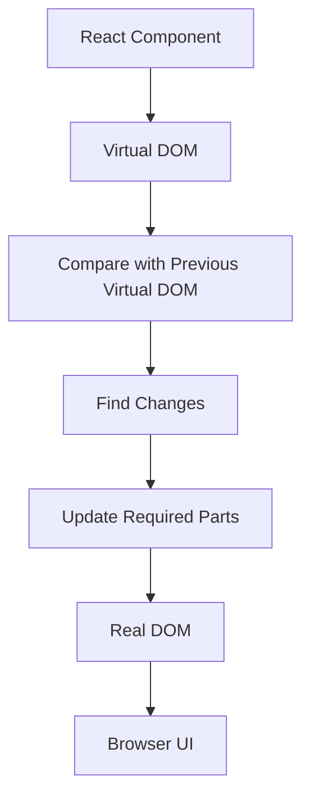
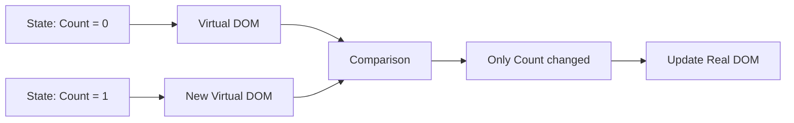

# React


---

### What is React

**React** is a JavaScript library for building user interfaces, developed and maintained by **Meta (Facebook)**. It was first released in 2013 and has since become one of the most widely used tools for building modern, interactive web applications.

Unlike a full framework, React focuses primarily on the **view layer** of an application — it helps developers build reusable **UI components** that manage their own state and render efficiently when data changes.

##### Key characteristics:

- **Component-Based Architecture** — UIs are broken down into small, reusable, independent pieces called **components**.
- **Declarative** — You describe *what* the UI should look like for a given state, and React handles updating the DOM to match.
- **Virtual DOM** — React maintains a lightweight in-memory representation of the real DOM, allowing it to calculate the minimal set of changes needed and update the actual DOM efficiently.
- **Unidirectional Data Flow** — Data flows in one direction, from parent components to child components via **props**, making applications easier to debug and reason about.
- **JSX** — React uses **JSX (JavaScript XML)**, a syntax extension that lets you write HTML-like code directly within JavaScript.

----

### Why React

- **Reusable Components** — Build once, use across the application, reducing duplicate code.
- **Fast Rendering** — The **Virtual DOM** minimizes direct DOM manipulation, improving performance.
- **Strong Ecosystem** — Backed by a huge community, with libraries like **React Router**, **Redux**, and **React Query** for routing, state management, and data fetching.
- **Flexibility** — React is **unopinionated**; you can choose your own tools for routing, state management, and styling.
- **Easy Learning Curve** — Since React is a library (not a full framework), it's generally quicker to pick up, especially with JavaScript fundamentals already in place.
- **Backed by Meta** — Strong industry adoption and long-term support.
- **React Native** — Skills transfer directly to mobile app development.

---

### Difference between Angular and React

| Point                  | **React**                                    | **Angular**                            |
| ---------------------- | -------------------------------------------- | -------------------------------------- |
| **What it is**         | A **library** (only UI part)                 | A complete **framework**               |
| **Made by**            | **Facebook (Meta)**                          | **Google**                             |
| **Language**           | **JavaScript** (JSX), TypeScript optional    | **TypeScript** (always)                |
| **UI writing style**   | **JSX** — HTML mixed inside JS               | **HTML templates** with Angular syntax |
| **Data binding**       | **One-way** binding                          | **Two-way** binding                    |
| **Learning curve**     | **Easier**, small core                       | **Harder**, more concepts upfront      |
| **Flexibility**        | **Flexible** — pick your own tools           | **Structured** — fixed pattern         |
| **DOM used**           | **Virtual DOM** (faster updates)             | **Real DOM** with change detection     |
| **State management**   | Needs extra library (**Redux**, Context API) | Built-in via **services**              |
| **Routing**            | External library (**React Router**)          | Built-in **Angular Router**            |
| **Mobile development** | **React Native**                             | **Ionic**                              |
| **Best for**           | Fast, flexible, custom apps                  | Large, structured enterprise apps      |
| **In short**           | **Freedom + Simplicity**                     | **Structure + Built-in tools**         |

---

### Features of React JS

**1. JSX (JavaScript XML)**

- A syntax extension that allows writing HTML-like code within JavaScript.
- Makes component structure easier to read and write.
- Gets compiled (via **Babel**) into regular `React.createElement()` calls.

**2. Component-Based Architecture**

- UI is broken into independent, reusable **components**.
- Two types: **Functional Components** (modern, use Hooks) and **Class Components** (older, use lifecycle methods).
- Encourages modularity and code reuse.

**3. Virtual DOM**

- React maintains a lightweight copy of the actual DOM in memory.
- When state changes, React creates a new Virtual DOM tree, **diffs** it against the previous one, and updates only the changed parts in the real DOM.
- This process is called **Reconciliation**, making updates fast and efficient.

**4. One-Way (Unidirectional) Data Binding**

- Data flows from **parent to child** via **props**.
- Makes the application more predictable and easier to debug, since data has a single source of truth.

**5. Hooks**

- Introduced in **React 16.8**, allowing functional components to use state and lifecycle features.
- Common hooks: `useState`, `useEffect`, `useContext`, `useRef`, `useMemo`, `useCallback`, `useReducer`.
- Removed the need for class components in most cases.

**6. State and Props**

- **State** — internal, mutable data managed within a component.
- **Props** — read-only data passed from parent to child components.
- Changes to state or props trigger **re-rendering**.

**7. Declarative UI**

- Developers describe *what* the UI should look like for each state.
- React handles the *how*, updating the DOM automatically to match the desired state.

**8. React Fiber**

- The **reconciliation engine** (rewritten in React 16) that enables incremental rendering.
- Allows React to pause, prioritize, and resume rendering work, improving responsiveness.

**9. Component Lifecycle**

- Class components have lifecycle methods: `componentDidMount`, `componentDidUpdate`, `componentWillUnmount`.
- Functional components replicate this behavior using `useEffect`.

**10. Conditional Rendering**

- UI can be rendered conditionally using JavaScript expressions (`if`, ternary operators, `&&`).

**11. Rich Ecosystem**

- **React Router** — client-side routing.
- **Redux / Context API / Zustand** — state management.
- **React Query / SWR** — data fetching and caching.
- **Next.js** — server-side rendering (SSR) and static site generation (SSG) framework built on React.

**12. React Native Support**

- Same core concepts and component model extend to **mobile app development** via React Native.

**13. Server-Side Rendering (SSR) Support**

- React can render components on the server (commonly via **Next.js**), improving SEO and initial load performance.

**14. Testing Support**

- Strong tooling ecosystem: **Jest**, **React Testing Library**, **Enzyme** for unit and component testing.

**15. Backward Compatibility**

- Meta maintains strong backward compatibility, making upgrades between versions relatively smooth.

---

### What is Virtual DOM & Real DOM

**DOM (Document Object Model)** is a tree-like structure that represents your webpage in the browser's memory. Every HTML tag becomes a "node" in this tree, and JavaScript can read or change these nodes to update what you see on screen.

#### Real DOM

Imagine the **Real DOM** like a **whiteboard** in a classroom.

- Every time you want to change **one word** on the whiteboard, the teacher **erases the entire board** and **rewrites everything** from scratch.
- This is slow because even a tiny change causes the whole board to be redrawn.
- The **Real DOM** works the same way — even a small update (like changing one line of text) can cause the browser to **recalculate layout, styles, and repaint** the whole page.

**Brief Notes:**

- It's the **actual structure** of the webpage the browser uses to display content.
- Updating it is **slow and expensive** because the browser re-renders large portions of the page.
- Every update triggers **reflow** and **repaint**.

#### Virtual DOM

Now imagine the **Virtual DOM** like a **notebook copy** of that whiteboard.

- Instead of erasing the whole whiteboard, you first write your change in your **notebook** (a lightweight copy).
- You then **compare** your notebook with the whiteboard to see **exactly what changed**.
- You only erase and rewrite **that one word** on the real whiteboard — not the whole thing.
- This process of comparing is called **"diffing"**, and applying only the necessary changes is called **"reconciliation."**

**Brief Notes:**

- It's a **lightweight, in-memory copy** of the Real DOM.
- React creates a **new Virtual DOM tree** whenever state/props change.
- React **compares (diffs)** the new tree with the old tree.
- Only the **actual differences** are updated in the Real DOM — making it **fast and efficient**.

---

### Why Virtual DOM is Faster

- Avoids unnecessary **reflows and repaints**.
- Batches multiple changes together before updating the Real DOM.
- Updates only the **minimal required parts**, not the entire page.



------

### How Virtual DOM Works

Suppose the UI initially displays:

```text
Count: 0
```

After clicking a button:

```text
Count: 1
```

React doesn't need to recreate the entire page.

It can identify that only the `0` changed to `1`.



------

### Real DOM vs Virtual DOM

| Real DOM                        | Virtual DOM                        |
| ------------------------------- | ---------------------------------- |
| Browser's actual DOM            | In-memory representation           |
| Managed by browser              | Managed by React                   |
| Directly updates UI             | Helps determine required updates   |
| DOM operations can be expensive | Reduces unnecessary DOM operations |
| Represents the actual page      | Represents desired UI state        |

------

**Example :**

```jsx
function App() {
    const [count, setCount] = useState(0);

    return (
        <>
            <h1>Count: {count}</h1>
            <button onClick={() => setCount(count + 1)}>
                Increment
            </button>
        </>
    );
}
```

When the button is clicked:

```text
Click Button
     ↓
State changes
     ↓
React creates new UI representation
     ↓
React compares old and new representation
     ↓
Determines required DOM changes
     ↓
Browser DOM is updated
```

------

### How React Works ?

Think of React like a **smart artist** repainting a picture.

1. **You describe what you want** — Using JSX, you tell React "this is what the screen should look like right now."
2. **React builds a Virtual DOM** — Instead of painting directly on the real canvas (the browser), it first sketches the picture on **scratch paper** (Virtual DOM).
3. **Something changes** — Say you click a button and a number updates.
4. **React draws a new sketch** — It makes a **new scratch paper** with the updated picture.
5. **React compares old vs new sketch** — This is called **diffing** — spotting exactly what's different.
6. **React updates only the changed part** — Instead of repainting the whole canvas, it only touches the **exact spot** that changed on the real DOM.

**In short:** React always keeps a draft copy, compares it to the last draft, and only updates what's actually different — making it fast and efficient.

---

#### Example — Simple Counter UI Page

Let's take a simple **Counter App** as an example to see React in action.

**The UI:**

A page with a **number**, an **Increment button**, and a **Decrement button**.

**Code Example:**

```jsx
import { useState } from 'react';

function Counter() {
  const [count, setCount] = useState(0);

  return (
    <div>
      <h2>Counter: {count}</h2>
      <button onClick={() => setCount(count + 1)}>Increment</button>
      <button onClick={() => setCount(count - 1)}>Decrement</button>
    </div>
  );
}

export default Counter;
```

##### How This Works Step by Step

**1. Initial Render**

- `useState(0)` sets the initial **state** — `count = 0`.
- React builds the **Virtual DOM** for this JSX and shows: `Counter: 0`

**2. User clicks "Increment"**

- `setCount(count + 1)` is called — this updates the **state** to `1`.
- This triggers a **re-render**.

**3. New Virtual DOM created**

- React creates a **new Virtual DOM tree** with `count = 1`.

**4. Diffing**

- React **compares** the new tree with the old tree.
- It finds that only the text `Counter: 0` changed to `Counter: 1` — everything else (buttons, div) is the same.

**5. Real DOM update**

- React updates **only that one text node** in the Real DOM — not the whole page.

**In short:** Every click updates the **state**, React re-renders the component in the **Virtual DOM**, diffs it, and updates only the changed part in the **Real DOM**.

---

### How to Create a React Application

**1. Install Node.js** (includes npm)

- Download from [nodejs.org](https://nodejs.org/) and verify installation:

```bash
node -v
npm -v
```

**2. Create a React App using Vite** (recommended, faster than CRA)

```bash
npm create vite@latest my-app
```

- Select **React** as the framework.
- Select **JavaScript** or **TypeScript** as the variant.

**3. Navigate into the project folder**

```bash
cd my-app
```

**4. Install dependencies**

```bash
npm install
```

**5. Run the development server**

```bash
npm run dev
```

- App runs at **http://localhost:5173** by default.

##### Alternative — Using Create React App (older method)

```bash
npx create-react-app my-app
cd my-app
npm start
```

- App runs at **http://localhost:3000** by default.

- **Vite** is preferred over CRA today for **faster builds** and **better performance**.

---

### Run React Locally (No Build Tools)

- React can be tried directly inside a **plain HTML file** — no installation, no npm, no build tools required.
- This is the **easiest and quickest** way to get started and understand how React works under the hood.
- You simply include React via **CDN links** (`<script>` tags) and write your component code inline.
- Great for **learning**, **quick demos**, or adding a **small dynamic widget** to an otherwise static website.
- You can later **gradually expand** this into a full build-tooled setup (Vite/CRA) as your app grows.

##### Standalone HTML File Example

```html
<!DOCTYPE html>
<html>

<head>
  <script src="https://unpkg.com/react@18/umd/react.development.js" crossorigin></script>
  <script src="https://unpkg.com/react-dom@18/umd/react-dom.development.js" crossorigin></script>
  <script src="https://unpkg.com/@babel/standalone/babel.min.js"></script>

  <title>React useState Example</title>
</head>

<body>

  <!-- React will render the application here -->
  <div id="root"></div>

  <script type="text/babel">

    // Get useState from React
        const { useState } = React;


        // Header Component
        function Header() {
            return (
                <h1>SKILLZAM</h1>
            );
        }


        // Counter Component
        function Counter() {

            // State
            const [count, setCount] = useState(0);

            return (
                <div>

                    <h2>Count: {count}</h2>

                    <button onClick={() => setCount(count + 1)}>
                        Increment
                    </button>

                    <button onClick={() => setCount(count - 1)}>
                        Decrement
                    </button>

                </div>
            );
        }


        // Footer Component
        function Footer() {
            return (
                <footer>
                    Copyright 2026
                </footer>
            );
        }


        // Main Component
        function MyApp() {
            return (
                <>
                    <Header />

                    <Counter />

                    <Footer />
                </>
            );
        }


        // Find root element
        const container = document.getElementById('root');

        // Create React root
        const root = ReactDOM.createRoot(container);

        // Render MyApp
        root.render(<MyApp />);

    </script>

</body>

</html>
```

##### Key Points About This Setup

- **`react.development.js`** — the core React library (handles components, state, hooks).
- **`react-dom.development.js`** — connects React to the actual browser DOM.
- **`@babel/standalone`** — converts **JSX** into plain JavaScript **in the browser**, since browsers can't understand JSX directly.
- **`type="text/babel"`** — tells the browser this script block needs to be processed by Babel before running.
- **`ReactDOM.createRoot()`** — creates a **root** where React will render your component.
- **`root.render(<Counter />)`** — renders the component into the `#root` div.

##### Why This Isn't Used for Production

- **Babel runs in the browser** — this means JSX is compiled **on every page load**, which is **slow**.
- No **bundling, optimization, minification**, or **code splitting**.
- No **module system** — hard to organize code as the app grows.
- Best suited for **learning, prototyping, or tiny embedded widgets** — not for real-world applications.

##### When to Use This Approach

- Quickly **testing a React concept** without setting up a project.
- Adding a **small interactive widget** to an existing static HTML website.
- **Teaching/demo purposes** where simplicity matters more than performance.

**In short:** This method proves React can run with **just a browser and 3 script tags** — no Node.js, no npm, no bundler — perfect for learning the core idea before moving to a proper build setup like **Vite**.

---

### React Application — Folder Structure & File Usage

| File / Folder                    | Simple Meaning                                               |
| -------------------------------- | ------------------------------------------------------------ |
| **node_modules/**                | Stores all **installed packages** (React, libraries) — auto-generated, never edit manually |
| **public/**                      | Holds **static files** (images, icons, favicon) that don't need processing by React |
| **public/index.html**            | The **single HTML page** of the app — React injects everything into this file |
| **src/**                         | Main folder where **all your React code** lives              |
| **src/main.jsx** (or `index.js`) | The **entry point** — this file renders the `App` component into the HTML page |
| **src/App.jsx**                  | The **root component** — the starting point of your UI, other components go inside this |
| **src/App.css**                  | **Styling** file for the `App` component                     |
| **src/index.css**                | **Global styles** applied to the whole application           |
| **src/components/**              | Folder to keep **reusable components** (Header, Footer, Button, etc.) |
| **src/assets/**                  | Stores **images, fonts, icons** used inside components       |
| **src/pages/**                   | Holds different **page-level components** (Home, About, Contact) — common in multi-page apps |
| **.gitignore**                   | Tells Git which files/folders to **ignore** (e.g., `node_modules`) while pushing to GitHub |
| **package.json**                 | Contains **project info**, dependencies, and scripts (`npm run dev`, `npm run build`) |
| **package-lock.json**            | Locks the **exact versions** of installed packages for consistency across systems |
| **vite.config.js**               | Configuration file for **Vite** — build tool settings        |
| **.eslintrc.cjs**                | Configuration for **ESLint** — helps catch code errors and enforce coding rules |
| **README.md**                    | **Documentation** file explaining the project (usually auto-created) |

##### Quick Notes

- Everything you **build and write** lives inside **`src/`**.
- **`public/`** is for files that should be served **as-is**, without any processing.
- **`package.json`** is the **heart of the project** — it defines dependencies and run scripts.
- **`node_modules/`** should **never be edited manually** — it's managed by npm/yarn.

---

### Introduction to JSX

**JSX (JavaScript XML)** is a **syntax extension** for JavaScript that lets you write **HTML-like code inside JavaScript**.

- It is **not HTML** and **not a string** — it's a special syntax that gets **converted into JavaScript** behind the scenes.
- JSX makes it easy to describe **what the UI should look like**, right alongside the logic that controls it.
- Browsers **cannot understand JSX directly** — tools like **Babel** convert it into regular JavaScript (`React.createElement()` calls) before running.

##### Simple Example

```jsx
const element = <h1>Hello, World!</h1>;
```

This JSX line is converted by Babel into:

```javascript
const element = React.createElement('h1', null, 'Hello, World!');
```

Both do the **same thing** — JSX is just a **shortcut** so we don't have to write `React.createElement()` manually every time.

---

### Why JSX is Used

- **Easier to read and write** — UI structure looks like HTML, familiar to most developers.
- **Combines logic and markup** — you can use JavaScript expressions directly inside the UI code.
- **Catches errors early** — mistakes in JSX show up at compile time, not at runtime.
- **More expressive** — makes complex UI structures easier to visualize compared to plain JS function calls.

---

### Features of JSX

**1. Write HTML on multiple lines**

- Wrap the HTML inside **parentheses** `()` when writing across multiple lines in a return statement.

```jsx
const Menu = () => {
  return (
    <div>
      <p>Services</p>
      <p>Industry</p>
    </div>
  );
}
```

**2. Must have one top-level element**

- All JSX code must be wrapped in a **single parent element**, otherwise JSX throws an error.
- In the example above, `<div>` acts as that single top-level wrapper.

**3. Use Fragments to avoid extra wrapper elements**

- A **Fragment** (`<> </>`) lets you group multiple elements **without adding an extra DOM node**.

```jsx
function App() {
  return (
    <>
      <ul>Shopping List:
        <li>Tea</li>
        <li>Coffee</li>
      </ul>
    </>
  );
}
```

**4. Curly braces `{}` for JavaScript expressions**

- Used to embed dynamic values inside JSX. Valid inside `{}`:
  - A **string** (e.g. `"skillzam"`)
  - A **number** (e.g. `99`)
  - An **array**
  - An **object property**
  - A **function call** returning a value
  - The **`map()`** method
  - **JSX itself**

```jsx
let radius = 12;
const circleArea = <h1>Area = {3.142 * radius * radius} sq units</h1>;
```

**5. Elements must be properly closed**

- JSX throws an error if HTML tags aren't closed properly.
- Use either `<App>...</App>` or the self-closing `<App/>`.

**6. Use `className` instead of `class`**

- Since **`class`** is a reserved keyword in JavaScript, JSX uses **`className`**.

```jsx
function App() {
  return (
    <div className="App">
      <h1>Hello World!</h1>
    </div>
  );
}
```

**7. No `if` statements directly inside JSX**

- React supports conditionals, but **not `if` statements inside JSX**.
- Options:
  - Write the `if` logic **outside** JSX.
  - Use a **ternary expression** inside JSX.

*Outside JSX:*

```jsx
let age = 24, message;
if (age < 19) {
  message = "NOT eligible to vote!";
} else {
  message = "Eligible to vote!";
}
const heading = <h1>{message}</h1>;
```

*Ternary inside JSX:*

```jsx
let age = 24;
const heading = (
  <h1>{age < 19 ? "NOT eligible to vote!" : "Eligible to vote!"}</h1>
);
```

**8. JSX prevents injection attacks**

- React DOM **escapes** any values embedded in JSX **before rendering**.
- Everything is converted to a **string** before rendering, preventing **XSS (cross-site scripting)** attacks.

```jsx
const title = response.potentiallyMaliciousInput;
const element = <h1>{title}</h1>; // Safe
```

**9. JSX represents Objects**

- **Babel** compiles JSX into `React.createElement()` calls.
- **Babel** is a JavaScript compiler/transpiler that converts modern or non-standard syntax (like JSX) into browser-compatible plain JavaScript.
- **Transpiling** = converting source code from one language/syntax into another with similar abstraction level.

*JSX:*

```jsx
const element = (
  <h1 className="greeting">Hello, world!</h1>
);
```

*Compiles to:*

```javascript
const element = React.createElement(
  'h1',
  { className: 'greeting' },
  'Hello, world!'
);
```

*Which internally creates a React element object:*

```javascript
const element = {
  type: 'h1',
  props: {
    className: 'greeting',
    children: 'Hello, world!'
  }
};
```

##### Key Takeaways

- **React elements** are simplified **descriptions** of what should appear on screen.
- React reads these element objects to **construct and update the DOM**.
- JSX is a **developer convenience** — the browser only ever sees plain JavaScript after Babel compiles it.

---