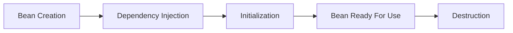
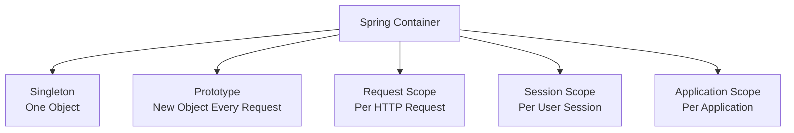
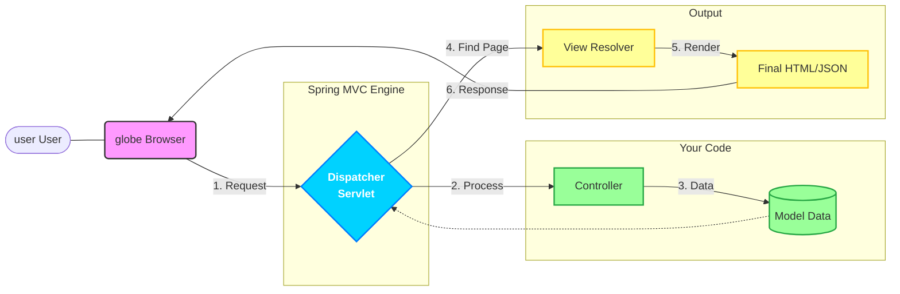
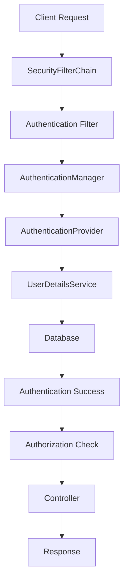

<div align="center">
  <h1><strong>🚀 SPRING FRAMEWORK 🚀</strong></h1>
</div>

# Spring

### **What are the key features of the Spring Framework?**

**Defination:** Spring framework is a light weight, loosely coupled, integrated, open-source framework for development of enterprise application in java.

* **Lightweight:** doesn't force developer to implement any interface.
* **Loose coupling:** we can develop loosely coupled applications using DI . loosely coupled means classes and methods are completely independent to each other . means we can make code changes easily.
* **Ready-made Templates:** it provides readymade templates of hibernate like jdbctemplate: jpa where no need to write lots of code for connections, exception handling and committing the transections all are done automatically.
* **Fast development**
* **Powerful abstraction**

---

### **What is IOC container?** 

* Inversion of Control (IOC) is the design principle where the control of object creation, configuration and management is transferred from programmer to spring framework.
* IOC container is a core part of spring framework which is used to manage the application beans
* It is responsible for Dependency Injection and managing the life cycle of beans.
* Task of IOC container, Instantiating, Assembling, Configuration of beans.

---

### **How IoC Works in Spring**

1. The developer defines application components (beans) using annotations or configuration.

2. Spring's IoC container:

   - Scans the class path.

   - Detects annotated components.

   - Creates and wires dependencies automatically.

3. The container manages the entire lifecycle of those objects.

---

### Types of IOC container

1.  **Bean Factory**: is a basic container. Its depreciated now.

```java
    Resource resource=new ClassPathResource("bean.xml");
    BeanFactory beanFactory=new XmlBeanFactory(resource);
```

2. **Application Context:** advance container which provide more functionalities than bean Factory. 

```java
ApplicationContext context=new ClassPathXmlApplicationContext("bean.xml");
```

> [!CAUTION]
>
> Note : bean file should be in resource folder

---

### **Explain Dependency Injection (DI) in Spring.**

Dependency Injection is a design pattern where the dependencies of a class are injected by the Spring container rather than being instantiated manually.

**Example : **

**Without DI :**

> [!NOTE]
>
> without DI Here is dependency between employee and address because employee forced to use same add object

```java
public  class  Employee {
    Address address;
    Employee(){
        Address  add = new  Address(); // creating instance
    }
}
```

**With DI :**

> [!NOTE]
>
> there is no dependency between employee and address because employee is not forced to use same address
>

```java
public class Employee {

    Address address;

    Employee( Address address){

        this.address=address; // not creating instance

    }

}
```

---

### **Ways of DI:**

1. **DI by using Constructor:** we can inject value by constructor <constructor-args> sub element of bean.
2. **DI by using Setter Method :** we can use setter method for DI by using <property> sub element of bean.
3. **Field Injection** : @Autowired annotation is used for field injection

**Example :**

```xml
<!-- setter based injection -->

<bean id="studentbean" class="com.springtutorial.Student">

    <property name="name" value="Nirav"></property>

</bean>

<!-- constructor based injection -->

<bean id="stdbean" class="com.springtutorial.Student">

    <constructor-arg name="name" value="Nikita"></constructor-arg>

</bean>
```

##### 1️⃣ Constructor Injection (Recommended ✅) using constructor

**Example**

```java
@Service
public class OrderService {
    private final OrderRepository orderRepository;
    public OrderService(OrderRepository orderRepository) {
        this.orderRepository = orderRepository;
    }
}
```

> [!IMPORTANT]
>
> **Why Preferred?**
>
> ✔ Makes dependency mandatory
>  ✔ Immutable (final field)
>  ✔ Easy for unit testing
>  ✔ Prevents NullPointerException
>  ✔ Recommended for production

------

##### 2️⃣ Setter Injection using setter method

**Example**

```java
@Service
public class OrderService {

    private OrderRepository orderRepository;

    @Autowired
    public void setOrderRepository(OrderRepository orderRepository) {
        this.orderRepository = orderRepository;
    }
}
```

> [!IMPORTANT]
>
> **✅ When to Use?**
>
> ✔ Optional dependencies
>  ✔ When dependency may change

> [!WARNING]
>
> **❌ Problem**
>
> Dependency is not mandatory.
>  Object can exist in invalid state.

------

##### 3️⃣ Field Injection (Not Recommended ❌) using  @Autowired annotation

**Example**

```java
@Service
public class OrderService {
    @Autowired
    private OrderRepository orderRepository;
}
```

> [!CAUTION]
>
> **❌ Why Not Recommended?**
>
> - Hard to unit test
> - Cannot make field final
> - Violates clean code principles
> - Hidden dependency
> - Reflection based injection

---

#### What is @Autowired?

`@Autowired` is used to inject dependency automatically by Spring IoC container.

------

#### Which is better and why?

**Constructor Injection** is better.

**✅ Advantages:**

1. Makes dependency mandatory
2. Makes class immutable (`final`)
3. Easy for unit testing
4. No null issues
5. Clean code
6. Recommended by Spring team

---

#### Spring DI Annotations 

| Annotation   | Definition / Introduction                                    | Injection Type      | When to Use                                                  | Example Usage                                      | Interview Important Points                                   |
| ------------ | ------------------------------------------------------------ | ------------------- | ------------------------------------------------------------ | -------------------------------------------------- | ------------------------------------------------------------ |
| `@Autowired` | Spring annotation used to inject dependency automatically from IoC container | By Type             | Default choice for injecting beans                           | `public OrderService(PaymentService ps){}`         | Prefer constructor injection; optional if single constructor (Spring 4.3+); fails if multiple beans without qualifier |
| `@Qualifier` | Used with `@Autowired` to resolve ambiguity when multiple beans of same type exist | By Name (with Type) | When more than one implementation of same interface exists   | `@Qualifier("upiPayment")`                         | Used to avoid `NoUniqueBeanDefinitionException`; more specific than `@Primary` |
| `@Inject`    | Java standard (JSR-330) annotation for dependency injection  | By Type             | When writing framework-independent code                      | `@Inject public OrderService(PaymentService ps){}` | Similar to `@Autowired` but lacks `required=false`; comes from `jakarta.inject` |
| `@Value`     | Injects values from properties, environment variables, or SpEL expressions | Property-based      | For configuration values from `application.properties` or `application.yml` | `@Value("${app.name}")`                            | Use for small configs; prefer `@ConfigurationProperties` for large config structures |

---

## 📌 **Spring Bean **

A **Spring Bean** is an object created, managed, and destroyed by the Spring Container (IoC Container).

##### **Bean Life Cycle**

1. Bean is created
2. Dependency is injected
3. Bean Initialized
4. Bean used
5. Bean destroyed

##### Main Phases of Bean Life Cycle



---

#### 1️⃣ Bean Creation

Spring creates the bean object using the constructor.

```java
@Component
public class Student {

    public Student() {
        System.out.println("Bean Created");
    }
}
```

📌 Object is created but not ready yet.

---

#### 2️⃣ Dependency Injection

Spring injects required dependencies.

```java
@Service
public class StudentService {

    private final StudentRepository repository;

    public StudentService(StudentRepository repository) {
        this.repository = repository;
    }
}
```

📌 Bean gets all required objects.

---

#### 3️⃣ Initialization

Spring performs initialization tasks.

```java
@PostConstruct
public void init() {
    System.out.println("Bean Initialized");
}
```

📌 Bean becomes fully ready.

---

#### 4️⃣ Bean Ready For Use

Application starts using the bean.

```java
studentService.saveStudent();
```

📌 Business logic executes here.

---

#### 5️⃣ Bean Destruction

When application shuts down, Spring destroys the bean.

```java
@PreDestroy
public void destroy() {
    System.out.println("Bean Destroyed");
}
```

📌 Resources are cleaned up.

---

 **Example**

```java
@Component
public class Student {

    public Student() {
        System.out.println("Bean Created");
    }

    @PostConstruct
    public void init() {
        System.out.println("Bean Initialized");
    }

    @PreDestroy
    public void destroy() {
        System.out.println("Bean Destroyed");
    }
}
```

---

### 📌 Spring - Bean Scopes🌱

**Bean Scope** defines how many bean objects Spring creates and how long they live.

---

##### Bean Scopes Overview

| Scope       | Objects Created               | Lifecycle              |
| ----------- | ----------------------------- | ---------------------- |
| Singleton   | One object                    | Entire application     |
| Prototype   | New object every request      | Until handed to client |
| Request     | One object per HTTP request   | Single request         |
| Session     | One object per HTTP session   | User session           |
| Application | One object per ServletContext | Application lifecycle  |

---

#### 1️⃣ Singleton Scope (Default)

Only **one bean object** is created.

```java
@Component
@Scope("singleton")
public class StudentService {
}
```

**Example**

```java
StudentService s1 = context.getBean(StudentService.class);
StudentService s2 = context.getBean(StudentService.class);

System.out.println(s1 == s2);
```

**Output**

```text
true
```

📌 Most commonly used scope.

---

#### 2️⃣ Prototype Scope

Spring creates a **new object every time** the bean is requested.

```java
@Component
@Scope("prototype")
public class StudentService {
}
```

**Example**

```java
StudentService s1 = context.getBean(StudentService.class);
StudentService s2 = context.getBean(StudentService.class);

System.out.println(s1 == s2);
```

**Output**

```text
false
```

📌 New object every request.

---

#### 3️⃣ Request Scope

One bean instance per HTTP request.

```java
@Component
@RequestScope
public class UserRequestBean {
}
```

**OR**

```java
@Component
@Scope("request")
public class UserRequestBean {
}
```

📌 Used in web applications.

---

#### 4️⃣ Session Scope

One bean instance per user session.

```java
@Component
@SessionScope
public class UserSessionBean {
}
```

📌 Data remains available until user logs out or session expires.

---

#### 5️⃣ Application Scope

One bean shared across the entire web application.

```java
@Component
@ApplicationScope
public class AppConfigBean {
}
```

📌 Similar to ServletContext attributes.

---

##### Visual Representation



### 📌 Which Bean Scope is Default?

By default @Scope("singleton") is applied automatically.

---

### 📌 **What are different ways to configure a Spring Bean?**

1. **XML Configuration (beans.xml)**

**Example :**

XML configuration was a common way to define beans. You specify the beans and their dependencies in an XML file, typically named `applicationContext.xml`.

```xml
<?xml version = "1.0" encoding = "UTF-8"?>

<beans xmlns = "http,//www.springframework.org/schema/beans"

       xmlns,xsi = "http,//www.w3.org/2001/XMLSchema-instance"

       xsi,schemaLocation = "http,//www.springframework.org/schema/beans

                             http,//www.springframework.org/schema/beans/spring-beans-3.0.xsd">

    <!-- DI inection using constructor -->

    <bean id="constructorbased" class="com.DependencyInjectionTutorial.Person">

        <constructor-arg name="name" value="narsing"></constructor-arg>

        <constructor-arg name="age" value="45"></constructor-arg>

        <constructor-arg name="surname" value="pendharkar"></constructor-arg>

    </bean>

    <!-- DI injection using setter method -->

    <bean id="setterbased" class="com.DependencyInjectionTutorial.Person">

        <property name="age" value="28"></property>

        <property name="name" value="narsing"></property>

        <property name="surname" value="pendharkar"></property>

    </bean>

</beans>
```

---

2. **Java-Based Configuration (@Configuration)**

* Java-based configuration allows you to configure beans using Java classes. You can use the **@Configuration** and **@Bean** annotations.
* Annotating a class with the **@Configuration** indicates that the class can be used by the Spring IoC container as a source of bean definitions.
* The **@Bean** annotation tells Spring that a method annotated with **@Bean** will return an object that should be registered as a bean in the Spring application context.

**Example ,**

```java
@Configuration

@ComponentScan("com.DependencyInjectionTutorial")

public class PersonJavaBasedConfig {

    @Bean("constructorBasedPerson")

    public Person constructorBasedPerson() {

        Person person1 = new Person("JavaBased", 1, "Configuration Using constructor");

        return person1;

    }

    @Bean("setterBasedPerson")

    public Person setterBasedPerson() {

        Person person2 = new Person();

        person2.setAge(1);

        person2.setName("JavaBased");

        person2.setSurname("Configuration Using Setter Mathod");

        return person2;

    }

}
```
---

3. **Annotation-Based Configuration** (`@Component, @Service, @Repository`)

* Once **<context:annotation-config/>** is configured, you can start annotating your code to indicate that Spring should automatically wire values into properties, methods, and constructors

**Example :**

```java
@Component("personbean")

public class PersonAnnotationBasedConfig {

    private String name;

    private int age;

    private String surname;

    PersonAnnotationBasedConfig() {

        this.age = 2;

        this.name = "Annotation based";

        this.surname = "Configuration";

    }

    public PersonAnnotationBasedConfig(String name, int age, String surname) {

        super();

        this.name = name;

        this.age = age;

        this.surname = surname;

    }

    @Override

    public String toString() {

        return "Person [name="  name  ", age="  age  ", surname="  surname  "]";

    }

}

```

---

### **Steps to Create a Spring Core Application**

1. Create a Maven Application

* Use the Quickstart archetype to generate a basic Maven project.

1. Add Dependencies

* Add **Spring Core** and **Spring Context dependencies** in pom.xml.

1. Create an Entity Class (POJO)

* Define a simple class with private fields, getters/setters, and constructors.

1. Configure Beans (Based on Configuration Type)

* **XML-Based**: Create beans.xml inside the resources folder and define beans.
* **Java-Based:** Create a @Configuration class and define beans using @Bean.
* **Annotation-Based:** Use @Component on a class to let Spring manage it.

1. Initialize Application Context in Main Class

* Use **ClassPathXmlApplicationContext** for XML-based configuration.
* Use **AnnotationConfigApplicationContext** for Java-based and annotation-based configuration.

1. Retrieve and Use Beans

* Call **getBean()** from **ApplicationContext** to retrieve and use the beans in the application.

1. Run the Application

* Execute the main class to verify that Spring loads and manages beans correctly.

**Example**

```java
public class MainApplicationToRun

{

    public static void main(String[] args) {

        // 1️ Create IOC container using XML-based configuration

        ApplicationContext context = new ClassPathXmlApplicationContext("beans.xml");

        // Retrieve beans from XML configuration (setter-based and constructor-based)

        Person p = (Person) context.getBean("setterbased");

        System.err.println("XML Configuration (Setter-based Bean), "  p);

        Person p2 = (Person) context.getBean("constructorbased");

        System.err.println("XML Configuration (Constructor-based Bean), "  p2);

        // 2️ Annotation-based configuration


        ApplicationContext annotationContext = new AnnotationConfigApplicationContext(PersonAnnotationBasedConfig.class);

        // Retrieve bean from @Component-based configuration

        PersonAnnotationBasedConfig annotatedBean = (PersonAnnotationBasedConfig) annotationContext.getBean("personbean");

        System.out.println("Annotation-based Configuration, "  annotatedBean);


        // 3️⃣ Java-based configuration


        ApplicationContext javaContext = new AnnotationConfigApplicationContext(PersonJavaBasedConfig.class);

        // Retrieve beans from Java-based configuration

        Person javaPerson1 = (Person) javaContext.getBean("constructorBasedPerson");

        System.out.println("Java-based Configuration (Constructor-based Bean), "  javaPerson1);

        Person javaPerson2 = (Person) javaContext.getBean("setterBasedPerson");

        System.out.println("Java-based Configuration (Setter-based Bean), "  javaPerson2);

    }

}
```

### 📌 **What is the difference between @Component, @Service, and @Repository?**

| **Annotation** | **Purpose** |
| --- | --- |
| @Component     | Generic bean for any class                                 |
| @Service       | Specifically for business logic/service layer              |
| @Repository    | Used in the DAO layer and integrates exception translation |

###  📌**What is the difference between `@Bean` and `@Component`?**

|  |  |  |
| --- | --- | --- |
| **Feature** | `@Bean` | `@Component` |
| Usage | Method-Level | Class-Level |
| Configuration Required | Yes (`@Configuration`) | No |
| Auto-Scanning | No | Yes |

**Example : **

```java
@Configuration

class AppConfig {

    @Bean

    public Engine engine() {

        return new Engine();

    }
}

```
# **Spring MVC**


### 📌**What is Spring MVC and its features.**

* Spring MVC is the sub framework of spring which is used for the development of web applications.
* Spring MVC follows the MVC pattern which separates the application in three parts i.e Model , View and Controller
* **Easy Development:** MVC pattern makes easy development
* **Rapid Development**: it helps for faster development.
* Powerful configuration.
* It uses all features of spring core.
* It is flexible, easy to test and much features.

---



### 📌**Explain the flow of a Spring MVC application.**

1. **Client Request** → client Sent request to the Dispatcher Servlet
2. **DispatcherServlet** → receive request from client and request to the appropriate Controller
3. **Controller** → Processes request and returns Model(data) and View (name of view)
4. **ViewResolver** → Selects the appropriate view (JSP, Thymeleaf, etc.)
5. **View (JSP/Thymeleaf)** → Data and view merged as sent as response


---

### 📌**Explain Dispatcher Servlet in Spring MVC.**

* Dispatcher servlet serve as Front Controller who manage all the request and sent it to respective controller.
* Dispatcher Servlet is a class which receive all incoming request from client and maps it to appropriate controller, model, and view.
* Configuration of Dispatcher servlet done in `web.xml` file as below

```xml
<servlet>

    <servlet-name>HelloWeb</servlet-name>

    <servlet-class>

        org.springframework.web.servlet.DispatcherServlet

    </servlet-class>

    <load-on-startup>1</load-on-startup>

</servlet>

<servlet-mapping>

    <servlet-name>HelloWeb</servlet-name>

    <url-pattern> */</url-pattern>

</servlet-mapping>
```

---

### 📌**Explain InternalViewResolver in Spring MVC.**

* It is a class which is used to resolve the internal view in Spring MVC.
* We can define the properties like prefix and suffix where prefix contains location of view and suffix contains extension of view page.
* Example :

```xml
*<!-- used to map vies according to controller -->*

<bean name="viewResolver"

      class="org.springframework.web.servlet.view.InternalResourceViewResolver">

    <property name="prefix" value="/WEB-INF/views/" />

    <property name="suffix" value=".jsp" />

</bean>
```

### 📌Explain Model, ModelMap and ModelAndView in Spring MVC.

1. **Model** : it is used to pass information from controller to view using model object.

```java
Model model = new Model();

model.addAttribute("msg", “hello “));
```

1. **ModelMap** : it is similar to model only difference is that it provides map functionalities. Methods , addAttribute(), get(),put()
2. **ModelAndView** : If you want to return model and view in same object then we can use **ModelAndView** class object.

```java
public ModelAndView showWelcomePage() {

    ModelAndView mav = new ModelAndView();

    mav.setViewName("welcome");

    mav.addObject("message", "Hello, Spring MVC!");

    return mav;

}
```

---

| Feature         | Model                         | ModelMap                             | ModelAndView                      |
| :-------------- | :---------------------------- | :----------------------------------- | :-------------------------------- |
| **Type**        | Interface                     | Class                                | Class                             |
| **Data Holder** | Map-like structure            | Implementation of `Map`              | Holder for model + view           |
| **View Name**   | Returned as a separate String | Returned as a separate String        | Included within the object        |
| **Primary Use** | Modern, lightweight standard  | When you need `Map` specific methods | When returning both in one object |

---

### 📌What are @RequestMapping and its variants?

* `@RequestMapping("/path")` → General mapping
* `@GetMapping("/path")` → Maps HTTP GET request
* `@PostMapping("/path")` → Maps HTTP POST request
* `@PutMapping("/path")` → Maps HTTP PUT request
* `@DeleteMapping("/path")` → Maps HTTP DELETE request

---

### 📌What is @ModelAttribute in Spring MVC?

It binds form data to a model object.

```java
@PostMapping("saveTask")

public String saveTask(@ModelAttribute Tasks tasks, BindingResult bindingResult,

                       @RequestParam("assignee") int userid, Model model) throws SQLException {

    if (bindingResult.hasErrors()) {

        model.addAttribute("message", "Plese enter proper detials");

        return "redirect,/createtask";

    } else {

        User assigenedUser = userService.userbyid(userid);

        tasks.setAssignedUser(assigenedUser);

        taskserviceImpl.saveTask(tasks);

        System.out.println("saved");

        model.addAttribute("message", "Task added !");

        return "redirect,/tasks-list";

    }

}
```

---

## 📌Core Spring Annotations

These annotations are primarily used for dependency injection (DI) and component scanning in Spring.

### **@Component** 

**Definition** : is a generic stereotype annotation that marks a class as a Spring-managed component.
**Example**:


```java
@Component
public class MyComponent {
    public void sayHello() {
        System.out.println("Hello from MyComponent");
    }
}
```

> [!TIP]
>
> Use Case : Used when the class doesn't clearly fall into service, repository, or controller layers.

---

### **@Service**

**Definition** :  Specialized version of **@Component**, used to mark a service layer class which contains business.

**Example :** 

```java
@Service
public class UserService {
    public String getUser() {
        return "Nirav";

    }
```

---

### **@Repository**

Used to indicate that a class is responsible for data access logic (DAO layer) and interaction with database.

**Use Case**

1.  Used for data persistence
2. Automatically translates exceptions to Spring’s DataAccessException

**Example :** 

```java
@Repository

public class UserRepository {

    public void saveUser() {

        System.out.println("User saved!");

    }
}
```

---

### **@Autowired**

**Defination :**  Automatically injects dependencies where required.

Example : 

```java
@Autowired

private TaskRepository taskRepository;
```

---

### **@Qualifier**

**Definition:** Used along with **@Autowired** to resolve ambiguity when multiple beans of the same type exist. It tells Spring exactly which bean to inject.

Example : 
```java
@Component("bean1")

public class MyBean1 {}

@Component("bean2")

public class MyBean2 {}

@Service
public class MyService {

    @Autowired

    @Qualifier("bean1")

    private MyBean1 myBean;

}

```
---

### **@Value**

**Defination** :  Injects values from properties files into Spring beans or assign default value to methods.

Example : 
```java
@Value("${app.name}")

private String appName;
```

---

### **@Scope**

**Defination** :  Defines the scope of a Spring bean (singleton, prototype, request, etc.).

```java
@Component
@Scope("prototype")
public class PrototypeBean {}
```

---

###  **@Lazy**

By default, Spring creates all singleton beans at startup (Eager initialization means loaded when application starts) .

> [!WARNING]
>
> `@Lazy` tells Spring  Don’t create this bean at startup. Create it only when it is first used.

---

#### 🔹 Example 1 – Lazy Bean

```java
@Component
@Lazy
public class HeavyService {

    public HeavyService() {
        System.out.println("HeavyService Created");
    }
}
```

Now this bean will be created only when required.

------

#### 🔹 Example 2 – Lazy Injection

```java
@Service
public class OrderService {

    private final PaymentService paymentService;

    public OrderService(@Lazy PaymentService paymentService) {
        this.paymentService = paymentService;
    }
}
```

Here, `PaymentService` will be created only when used.

------

#### ✅ Why Use `@Lazy`?

1. Improves startup time
2. Avoids unnecessary bean creation
3. Helps resolve circular dependency

---

#### 🎯 Difference Between `@Primary` and `@Qualifier`

| Feature     | @Primary       | @Qualifier              |
| ----------- | -------------- | ----------------------- |
| Purpose     | Default bean   | Specific bean selection |
| Usage       | On bean class  | On injection point      |
| Control     | Global default | Local selection         |
| Flexibility | Less           | More                    |

---

### **@Controller**

* **Defination :**  Marks a class as a Spring MVC controller to handle HTTP requests.

Example : 

```java
@Controller

public class TaskController {}
```

### **@RestController**

* **Defination :**  A combination of **@Controller** and **@ResponseBody**, used for RESTful APIs.

Example : 

```java
@RestController

public class ApiController {

    @GetMapping("/data")

    public String getData() {

        return "Hello API!";

    }

}
```

### **@RequestMapping**

* **Defination** :  Maps HTTP requests to controller methods.

Example : 
```java
@Controller

@RequestMapping("/user")

public class UserController {

    @GetMapping("/profile")

    public String showProfile() {

        return "profile";

    }

}
```

### **@GetMapping, @PostMapping, @PutMapping, @DeleteMapping**

* **Defination :**  Shortcut annotations for specific HTTP methods.

Example : 
```java
@GetMapping("dashboard" )

public String dashboardPage(Model model) {

return "Dashboard";

}
```

### **@PathVariable**

* **Defination** :  Extracts values from the URL path.
* `URL : localhost,8080/deleteTask/2`

Example : 
```java
@GetMapping("deleteTask/{id}")

public String deleteTask(@PathVariable("id") int taskId, Model model) throws SQLException {

    taskserviceImpl.deleteTask(taskId);

    model.addAttribute("message", "Task deleted!");

    return "redirect,/tasks-list";

}
```

---

### **@RequestParam**

* Defination :  Extracts query parameters from the URL*.*
* *URL* : `localhost,8080/search?keyword=”google”`

Example : 

```java
@GetMapping("/search")

public String search(*@RequestParam* String keyword) {

return "Searching for, "  keyword;

}

```

### **@ModelAttribute**

* **Defination** :  Binds from data into java object.

Example : 

```java
@PostMapping("/register")

public String registerUser(@ModelAttribute User user) {

userService.save(user);

return "success";

}
```

### **@ExceptionHandler : @ControllerAdvice**

* **Defination :**  This annotation used to handle the specific exceptions and sending custom message and controller advice annotation is used to handle exceptions globally

Example : 
```java
@ControllerAdvice

public class GlobalExceptionHandler {

// Exception handler method to catch InvalidUserException

@ExceptionHandler(InvalidUserException.class)

public String handleInvalidUserException(InvalidUserException ex, Model model) {

model.addAttribute("message", ex.getMessage());

return "Login";

}
```

---

### **@PostConstruct **

- Used in **Spring Boot** for method execution after dependency injection.
- Method annotated with **@PostConstruct** runs once the bean properties have been set.
- Ensures that the bean is fully initialized and ready for use.
- Common use cases include:
  - Initialization tasks (e.g., loading data).
  - Setting up necessary resources (e.g., opening connections).
- Can only be applied to methods, not to fields.
- Method must have no parameters and must not throw checked exceptions.
- Can be used on **singleton** and **prototype** scoped beans.

```java
@Component
public class DbInit {

    @Autowired
    private UserRepository userRepository;

    @PostConstruct
    private void postConstruct() {
        User admin = new User("admin", "admin password");
        User normalUser = new User("user", "user password");
        userRepository.save(admin, normalUser);
    }
}
//The above example will first initialize UserRepository and then run the @PostConstruct method.
```

----

### **@*PreDestroy* **

- Used to define cleanup operations before a bean is removed from the context.
- Method annotated with **@PreDestroy** is called just before the bean is destroyed.
- Useful for releasing resources or performing any necessary cleanup tasks.
- Common use cases include:
  - Closing connections (e.g., database or network).
  - Releasing any held resources (e.g., file handles).
- Similar restrictions to **@PostConstruct**:
  - Must be applied to methods.
  - Method must have no parameters and must not throw checked exceptions.
- **Lifecycle of a Spring Bean**
  - **Creation**: Bean is instantiated.
  - **Dependency Injection**: Dependencies are injected into the bean.
  - **Post-Initialization**: Method annotated with **@PostConstruct** is invoked.
  - **Destruction**: Before the bean is destroyed, the method annotated with **@PreDestroy** is executed.

```java
@Component
public class UserRepository {

    private DbConnection dbConnection;
    @PreDestroy
    public void preDestroy() {
        dbConnection.close();
    }
}Copy
```

The purpose of this method should be to release resources or perform other cleanup tasks, such as closing a database connection, before the bean gets destroyed.

---

### 🧠 What is Circular Dependency?

A circular dependency occurs when two beans depend on each other.

```java
@Service
public class AService {

    @Autowired
    private BService bService;
}

@Service
public class BService {

    @Autowired
    private AService aService;
}
```

##### Problem

```text
AService → BService → AService
```

Spring cannot decide which bean to create first.

---

##### ⚠️ Error

```text
BeanCurrentlyInCreationException
```

---

#### ✅ How to Solve?

##### 1. Use Constructor Injection + Redesign (Recommended)

Move common logic to another service.

```text
AService → CommonService
BService → CommonService
```

📌 Best solution for interviews.

---

##### 2. Use `@Lazy`

```java
@Service
public class AService {

    @Autowired
    @Lazy
    private BService bService;
}
```

📌 Bean is created only when needed.

---

##### 3. Use Setter Injection

```java
@Autowired
public void setBService(BService bService) {
    this.bService = bService;
}
```

📌 Spring injects dependency after bean creation.

---

### Spring Framework vs Spring Boot 

| Feature / Aspect              | Spring Framework                                             | Spring Boot                                                  |
| ----------------------------- | ------------------------------------------------------------ | ------------------------------------------------------------ |
| **Setup & Configuration**     | Manual XML or Java-based configuration required              | Auto-configuration with minimal setup                        |
| **Application Startup**       | Requires external servlet container (e.g., Tomcat deployment) | Comes with embedded servers (Tomcat, Jetty, Undertow)        |
| **Dependency Management**     | Developer manually manages dependencies                      | Pre-configured starter dependencies (`spring-boot-starter-*`) |
| **Boilerplate Code**          | More configuration and setup code                            | Minimal configuration and boilerplate                        |
| **Project Structure**         | No fixed structure; developer decides                        | Follows convention over configuration                        |
| **Production Readiness**      | Monitoring and metrics require manual setup                  | Built-in Actuator for health checks, metrics, etc.           |
| **Build Output**              | Typically WAR file                                           | Executable JAR by default                                    |
| **Learning Curve**            | Steeper due to configuration complexity                      | Easier and faster to get started                             |
| **CLI Support**               | Not available                                                | Available via Spring Boot CLI                                |
| **Microservices Development** | Requires manual setup                                        | Designed for microservices architecture                      |

### 📌What is the difference between Spring MVC and Spring Boot?

| Feature         | Spring MVC        | Spring Boot         |
| --------------- | ----------------- | ------------------- |
| Configuration   | Manual            | Auto-configured     |
| Embedded Server | No                | Yes (Tomcat, Jetty) |
| Dependencies    | More setup needed | Minimal setup       |

---

###  📌What is Spring Boot and why is it used?

**Answer:**

Spring Boot is a framework built on top of Spring that helps to create **standalone, production-ready applications** with minimal configuration.

It eliminates:

- XML configuration
- Manual dependency setup
- Server deployment complexity

##### 📌Why we use it?

- Faster development
- Embedded server (Tomcat/Jetty)
- Auto configuration
- Microservices friendly

**Example:**

```java
@SpringBootApplication
public class MyApplication {
    public static void main(String[] args) {
        SpringApplication.run(MyApplication.class, args);
    }
}

```

---

### 📌 What are the main features of Spring Boot?

**Answer:**

1. **Auto Configuration** Automatically configures beans based on classpath dependencies.
2. **Starter Dependencies** Provides ready-to-use dependency bundles.
3. **Embedded Server **No need to install external server (Tomcat included).
4. **Production Ready Features **Monitoring using Actuator.
5. **Minimal Configuration **Mostly annotation-based configuration.

### 📌 What are Spring Boot Starters?

Starters are **predefined dependency packages** that simplify build configuration. Instead of adding multiple dependencies manually, we add one starter.

##### Common Starters:

- `spring-boot-starter-web`
- `spring-boot-starter-data-jpa`
- `spring-boot-starter-security`
- `spring-boot-starter-test`

##### Example (Maven):

```xml
<dependency>
    <groupId>org.springframework.boot</groupId>
    <artifactId>spring-boot-starter-web</artifactId>
</dependency>
```

👉 This includes:

- Spring MVC
- Jackson
- Validation
- Embedded Tomcat

------

#### 4️⃣ Explain @SpringBootApplication

**Answer:**

The **@SpringBootApplication** annotation is the primary entry point of any Spring Boot application. It is a convenience annotation that combines three commonly used annotations in Spring:

**@SpringBootApplication = @Configuration + @EnableAutoConfiguration + @ComponentScan**

1. `@Configuration` : Marks class as configuration class.
2. `@EnableAutoConfiguration` : Enables Spring Boot auto configuration.
3. `@ComponentScan`: Scans components in current package and sub-packages.

##### Equivalent Code:

```java
@Configuration
@EnableAutoConfiguration
@ComponentScan
public class MyApplication {
    public static void main(String[] args) {
        SpringApplication.run(MyApplication.class, args);
    }
}
```

---

### Spring Boot Configuration

---

#### 1️⃣ How to configure Spring Boot using application.properties?

**Answer:**

`application.properties` is used to configure:

- Server settings
- Database connection
- Logging
- Custom properties

It is located inside: `src/main/resources/application.properties`

##### Example:

~~~properties

# Server Configuration
server.port=9090

# Database Configuration
spring.datasource.url=jdbc:mysql://localhost:3306/bankdb
spring.datasource.username=root
spring.datasource.password=root
spring.jpa.hibernate.ddl-auto=update

# Logging
logging.level.org.springframework=INFO

# Custom Property
app.name=Banking Application
~~~

##### Access custom property:

```java
@Value("${app.name}")
private String appName;
```

------

#### 2️⃣ Difference between application.properties and application.yml

| application.properties | application.yml            |
| ---------------------- | -------------------------- |
| Key-value format       | YAML format (hierarchical) |
| Flat structure         | Nested structure           |
| More repetitive        | Cleaner & readable         |
| Uses `=`               | Uses indentation           |

------

##### Example (Properties)

```properties
server.port=8081
spring.datasource.url=jdbc:mysql://localhost:3306/test
```

### Example (YAML)

```yaml
server:
  port: 8081

spring:
  datasource:
    url: jdbc:mysql://localhost:3306/test
```

> [!TIP]
>
> **YAML** is preferred in microservices because it's cleaner for complex configuration.

------

#### 3️⃣ How to externalize configuration in Spring Boot?

Externalizing configuration means keeping configuration **outside the application code**, especially for different environments.

##### Methods:

##### 1️⃣ Using application-{profile}.properties

```
application-dev.properties
application-prod.properties
```

------

##### 2️⃣ Using Environment Variables

```bash
export SERVER_PORT=9090
```

Spring Boot automatically maps it.

------

##### 3️⃣ Using Command Line Arguments

```bash
java -jar app.jar --server.port=8085
```

------

##### 4️⃣ Using External File

```bash
java -jar app.jar --spring.config.location=/path/application.properties
```

------

##### Priority Order (High to Low)

1. Command line arguments
2. Environment variables
3. External config file
4. application.properties inside jar

------

##### 4️⃣ What is @Value used for?

**Answer:**

`@Value` is used to inject property values into variables.

##### Example:

```properties
app.version=1.0
```

```java
@Value("${app.version}")
private String version;
```

It can also inject:

- System properties
- Environment variables
- Default values

```java
@Value("${app.name:DefaultApp}")
private String appName;
```

👉 If property not found, "DefaultApp" will be used.

------

#### 5️⃣ What are Spring Profiles and how do they work?

**Answer:**

Profiles are used to define **environment-specific configuration**.

Example environments:

- dev
- test
- prod

------

##### Step 1: Create profile-specific file

```
application-dev.properties
application-prod.properties
```

------

##### Step 2: Activate Profile

In properties:

```properties
spring.profiles.active=dev
```

OR

Command line:

```bash
java -jar app.jar --spring.profiles.active=prod
```

------

##### Step 3: Use @Profile Annotation

```java
@Bean
@Profile("dev")
public DataSource devDataSource() {
    return new H2DataSource();
}

@Bean
@Profile("prod")
public DataSource prodDataSource() {
    return new MySQLDataSource();
}
```

Only active profile bean will load.

---

### ResponseEntity and Status Codes

ResponseEntity allows customizing the response body, headers, and HTTP status.

**Example**

```java
@GetMapping("/{id}")

public ResponseEntity<User> getUser(@PathVariable Long id) 
{ 
    User user = userService.findById(id);
    if (user == null) {
        return ResponseEntity.status(HttpStatus.NOT_FOUND).build();
    }
    return ResponseEntity.ok(user);
}
```


#### 1️⃣ What is @RestController in Spring Boot?

**Answer:**

`@RestController` is a combination of:

- `@Controller`
- `@ResponseBody`

It is used to create REST APIs that return **JSON or XML response directly**, not JSP pages.

##### Example:

```java
@RestController
public class HelloController {

    @GetMapping("/hello")
    public String hello() {
        return "Hello REST API";
    }
}
```


### 2️⃣ How to create a simple RESTful API using Spring Boot?

##### Step 1: Add Dependency

```xml
<dependency>
    <groupId>org.springframework.boot</groupId>
    <artifactId>spring-boot-starter-web</artifactId>
</dependency>
```

------

##### Step 2: Create Model

```java
public class User {
    private Long id;
    private String name;

    // getters and setters
}
```

------

##### Step 3: Create Controller

```java
@RestController
@RequestMapping("/users")
public class UserController {

    @GetMapping
    public List<User> getUsers() {
        return List.of(new User(1L, "Narsing"));
    }
}
```

### Access:

```url
http://localhost:8080/users
```

------

### 3️⃣ How to handle HTTP methods (GET, POST, PUT, DELETE)?

Spring Boot provides specific annotations:

| HTTP Method | Annotation     |
| ----------- | -------------- |
| GET         | @GetMapping    |
| POST        | @PostMapping   |
| PUT         | @PutMapping    |
| DELETE      | @DeleteMapping |

------

##### Example:

```java
@RestController
@RequestMapping("/users")
public class UserController {

    @GetMapping("/{id}")
    public User getUser(@PathVariable Long id) {
        return new User(id, "Narsing");
    }

    @PostMapping
    public User createUser(@RequestBody User user) {
        return user;
    }

    @PutMapping("/{id}")
    public User updateUser(@PathVariable Long id, @RequestBody User user) {
        user.setId(id);
        return user;
    }

    @DeleteMapping("/{id}")
    public String deleteUser(@PathVariable Long id) {
        return "User deleted with id: " + id;
    }
}
```

------

#### 4️⃣ What is @RequestBody and @ResponseBody?

##### @RequestBody

Used to convert JSON request body into Java object.

```java
{
  "id": 1,
  "name": "Narsing"
}
@PostMapping
public User save(@RequestBody User user) {
    return user;
}
```

👉 JSON → Java Object

------

##### @ResponseBody

Converts Java object into JSON response.

```java
@ResponseBody
@GetMapping("/user")
public User getUser() {
    return new User(1L, "Narsing");
}
```

👉 Java Object → JSON

⚡ Note: `@RestController` already includes `@ResponseBody`.

------

#### 5️⃣ How to handle query parameters in Spring Boot?

We use `@RequestParam`.

##### Example:

URL:

```url
http://localhost:8080/search?name=Narsing
```

Controller:

```java
@GetMapping("/search")
public String search(@RequestParam String name) {
    return "Searching for: " + name;
}
```

------

##### Optional Query Parameter:

```java
@GetMapping("/search")
public String search(@RequestParam(required = false) String name) {
    return name != null ? name : "No name provided";
}
```

------

##### With Default Value:

```java
@GetMapping("/search")
public String search(@RequestParam(defaultValue = "Guest") String name) {
    return "Hello " + name;
}
```

------

#### Difference between @PathVariable and @RequestParam?

- `@PathVariable` → Value from URL path
   Example: `/users/10`
- `@RequestParam` → Value from query string
   Example: `/users?id=10`


---

#### How do you Package a Spring Boot Application as a WAR?

**Answer:**

By default, Spring Boot creates a **JAR** file.

To create a WAR file (for deployment in external Tomcat):

------

##### Step 1: Change Packaging

In `pom.xml`:

```xml
<packaging>war</packaging>
```

------

##### Step 2: Exclude Embedded Tomcat

```xml
<dependency>
    <groupId>org.springframework.boot</groupId>
    <artifactId>spring-boot-starter-tomcat</artifactId>
    <scope>provided</scope>
</dependency>
```

------

##### Step 3: Extend SpringBootServletInitializer

```java
@SpringBootApplication
public class MyApplication extends SpringBootServletInitializer {

    @Override
    protected SpringApplicationBuilder configure(SpringApplicationBuilder application) {
        return application.sources(MyApplication.class);
    }
}
```

------

##### Build WAR

```cmd
mvn clean package
```

Deploy generated WAR file to external Tomcat.

> [!TIP]
>
> - JAR → Embedded Tomcat (recommended for microservices)
> - WAR → External server deployment
> - Modern architecture prefers JAR with containerization (Docker)

---

### @JsonIgoner & @JsonIgnoreProperties

**Defination** :  used to filter out the fields data form response. These fields are not sent in response.

Example : 
```java
@Entity

@JsonIgnoreProperties({"password", "username"})

public class User {

    @Id

    @GeneratedValue(strategy = GenerationType.SEQUENCE,generator = "userseq")

    @SequenceGenerator(name="userseq",sequenceName = "userseq", initialValue = 1000, allocationSize = 1)

    private Long id;

    @Column(unique = true, nullable = false)

    private String username;

    @Column(nullable = false)

    @JsonIgnore

    private String password;
```

### @**Configuration**

* **Defination** :  Marks a class as a Spring configuration class and it is a source of beans.

Example : 
 ```java
@Configuration

public class AppConfig {

    @Bean

    public MyService myService() {

        return new MyService();

    }

}
 ```

### @**EnableScheduling**

* **Defination** :  Enables scheduling tasks. When @**EnableScheduling** Annotation added in Configuration class then spring looks for @Scheduled annotated method and runs that method automatically in fixed period of time.

Example : 
```java
 @EnableScheduling

public class SchedulerConfig {}

@Scheduled(fixedRate = 5000)

public void scheduleTask() {

System.out.println("Running every 5 seconds");

}
```

# Spring Data JPA Annotations

Used for database interaction.

### **@Entity**

**Defination** :  Marks a class as a JPA entity (database table representation).

**Example :**

```java

@Entity
public class Tasks {

    @Id

    @GeneratedValue(strategy = GenerationType.IDENTITY)

    private Long task _id;

    @NotNull

    private String title;

    @NotNull

    private String description;

    @Temporal(TemporalType.DATE)

    private Date deadline;

    @Enumerated(EnumType.STRING)

    private Priority priority;

    @Enumerated(EnumType.STRING)

    private TaskStatus status;

    @ManyToOne

    @JoinColumn(name = "user _id")

    private User assignedUser;
```


## **🚀 Caching in Spring Boot**

#### 1️⃣ What is Caching?

Caching is a technique of storing frequently accessed data in memory to improve application performance.

**Why We Use Caching?**

- Reduce database load

- Improve response time

- Reduce latency

- Improve scalability


---

#### 2️⃣ Spring Boot Caching Overview

Spring Boot provides caching abstraction using:

@**EnableCaching** : Spring uses AOP (Proxy-based mechanism) internally.


---

#### 3️⃣ Cache Annotations (Very Important)

##### ✅ 1. @Cacheable

Stores method result in cache

Skips method execution if data exists in cache

```java
@Cacheable(value = "users", key = "#id")
public User getUserById(Long id) {
    return userRepository.findById(id).orElse(null);
}
```

👉 First call → DB hit
👉 Next calls → From cache


---

##### ✅ 2. @CacheEvict

Removes data from cache

```java
@CacheEvict(value = "users", key = "#id")
public void deleteUser(Long id) {
    userRepository.deleteById(id);
}
```


---

##### ✅ 3. @CachePut

Always executes method

Updates cache with new value

```java
@CachePut(value = "users", key = "#user.id")
public User updateUser(User user) {
    return userRepository.save(user);
}
```


---

#### 4️⃣ Cache Providers (Interview Important)

Spring provides abstraction only. We configure provider.

| Provider          | Type             | Usage         |
| ----------------- | ---------------- | ------------- |
| ConcurrentHashMap | in-memory        | Default       |
| EhCache           | In-memory        | Enterprise    |
| Caffeine          | High performance | Local cache   |
| Redis             | Distributed      | Microservices |


---

#### 5️⃣ Redis Caching (Most Asked)

##### Why Redis?

- Distributed cache

- Shared across multiple instances

- Supports TTL

- High performance


Redis Configuration

```properties
spring.cache.type=redis
spring.redis.host=localhost
spring.redis.port=6379
```


---

#### 6️⃣ TTL (Time To Live)

Automatically expires cache after some time.

```properties
spring.cache.redis.time-to-live=60000
```

👉 Cache expires after 60 seconds.


---

#### 7️⃣ Internal Working 

When method with @Cacheable is called:

1. Spring checks cache.


2. If present → returns cached value.


3. If not → executes method.


4. Stores result in cache.


5. Returns response.

Uses proxy-based AOP mechanism.

---

### 📌Difference between @Cacheable and @CachePut?

| @Cacheable                      | @CachePut       |
| ------------------------------- | --------------- |
| Skips execution if cache exists | Always executes |
| Used for read                   | Used for update |

---

### 📌What is stale data problem?

When DB is updated but cache still has old data.

**Solution:**

- Use @CacheEvict

- Use TTL

- Use event-based invalidation


---

### 📌Why Redis preferred in Microservices?

- Local cache works per instance.

- Redis works as centralized shared cache across services.


---

### 📌What is self-invocation problem?

If a method inside same class calls @Cacheable method → caching will NOT work.

Reason: Spring uses proxy mechanism

 **Example (Banking App)**

```java
@Cacheable(value = "accounts", key = "#accountNumber")
public Account getAccountDetails(String accountNumber) {
    return accountRepository.findByAccountNumber(accountNumber);
}
```

Improves performance for repeated account lookup.


---


## Spring Data JPA & Transactions

### 📌How to Connect Spring Boot with a Database?

Spring Boot connects to a database using:

- JDBC Driver
- `application.properties` configuration
- Spring Data JPA / Hibernate
- Auto-configuration

It automatically configures `DataSource`, `EntityManager`, and `TransactionManager`.

##### Example:

**Step 1: Add Dependencies**

```xml
<dependency>
    <groupId>org.springframework.boot</groupId>
    <artifactId>spring-boot-starter-data-jpa</artifactId>
</dependency>

<dependency>
    <groupId>com.mysql</groupId>
    <artifactId>mysql-connector-j</artifactId>
</dependency>
```

**Step 2: Configure Database**

```properties
spring.datasource.url=jdbc:mysql://localhost:3306/bankdb
spring.datasource.username=root
spring.datasource.password=root
spring.jpa.hibernate.ddl-auto=update
spring.jpa.show-sql=true
```

------

###  📌What is Spring Data JPA?

**Answer:**

Spring Data JPA is part of the larger Spring Data family, providing a repository abstraction layer for handling CRUD (Create, Read, Update, Delete) operations with ease. It allows developers to interact with a relational database using domain objects (entities), eliminating the need for manually writing SQL queries or boilerplate code.

Spring Data JPA internally uses JPA, the Java standard for Object-Relational Mapping (ORM). With ORM, Java objects are automatically mapped to database tables, making it easier to interact with the database in an object-oriented way.

##### Example:

```java
public interface UserRepository extends JpaRepository<User, Long> {

    List<User> findByName(String name);
}
```

---

#### Benefits of Using Spring Data JPA

Here are some of the key benefits of using Spring Data JPA:

- **Simplified Data Access Layer**: Spring Data JPA abstracts the complex database interaction layer, allowing you to focus on your business logic.
- **Less Boilerplate Code**: You can perform CRUD operations without writing any SQL or JDBC code.
- **Custom Queries**: Easily create custom queries with method names or the `@Query` annotation for more complex queries.
- **Pagination and Sorting**: It provides built-in support for pagination and sorting, which is essential for managing large datasets.
- **Integration with Spring Boot**: Spring Boot makes configuring Spring Data JPA even easier, offering features like automatic configuration and the ability to connect to a database with minimal setup.

------

## 📘 JPA Annotations 

##### 1️⃣ Entity & Table Level Annotations

| Annotation            | Used On | Purpose                          | Example                                               |
| --------------------- | ------- | -------------------------------- | ----------------------------------------------------- |
| `@Entity`             | Class   | Marks class as JPA entity        | `@Entity public class User {}`                        |
| `@Table`              | Class   | Defines table name & constraints | `@Table(name="users")`                                |
| `@Id`                 | Field   | Marks primary key                | `@Id private Long id;`                                |
| `@GeneratedValue`     | Field   | PK generation strategy           | `@GeneratedValue(strategy = GenerationType.IDENTITY)` |
| `@Column`             | Field   | Maps column properties           | `@Column(nullable=false, unique=true)`                |
| `@Transient`          | Field   | Not persisted in DB              | `@Transient private String tempData;`                 |
| `@Enumerated`         | Field   | Maps Enum type                   | `@Enumerated(EnumType.STRING)`                        |
| `@Temporal` (Old JPA) | Field   | Date mapping (for Date)          | `@Temporal(TemporalType.DATE)`                        |
| `@Lob`                | Field   | Large object (CLOB/BLOB)         | `@Lob private String description;`                    |

------

##### 2️⃣ Primary Key Strategies

| Strategy   | Meaning                | Example                                             |
| ---------- | ---------------------- | --------------------------------------------------- |
| `IDENTITY` | Auto-increment (MySQL) | `@GeneratedValue(strategy=GenerationType.IDENTITY)` |
| `SEQUENCE` | Uses DB sequence       | `@GeneratedValue(strategy=GenerationType.SEQUENCE)` |
| `TABLE`    | Uses separate table    | Rarely used                                         |
| `AUTO`     | Provider decides       | Default option                                      |

------

##### 3️⃣ Relationship Annotations

##### 🔹 One-to-One

| Annotation    | Example                              |
| ------------- | ------------------------------------ |
| `@OneToOne`   | `@OneToOne private Profile profile;` |
| `@JoinColumn` | `@JoinColumn(name="user_id")`        |

------

##### 🔹 One-to-Many

| Annotation   | Example                       |
| ------------ | ----------------------------- |
| `@OneToMany` | `@OneToMany(mappedBy="user")` |
| `mappedBy`   | `mappedBy="customer"`         |

------

##### 🔹 Many-to-One

| Annotation    | Example                              |
| ------------- | ------------------------------------ |
| `@ManyToOne`  | `@ManyToOne(fetch = FetchType.LAZY)` |
| `@JoinColumn` | `@JoinColumn(name="customer_id")`    |

👉 Foreign key usually lives in Many side.

------

##### 🔹 Many-to-Many

| Annotation           | Example                        |
| -------------------- | ------------------------------ |
| `@ManyToMany`        | `@ManyToMany`                  |
| `@JoinTable`         | `@JoinTable(name="user_role")` |
| `joinColumns`        | `@JoinColumn(name="user_id")`  |
| `inverseJoinColumns` | `@JoinColumn(name="role_id")`  |

------

##### 4️⃣ Fetch & Cascade Options

##### Fetch Types

| Fetch Type | Meaning            |
| ---------- | ------------------ |
| `EAGER`    | Load immediately   |
| `LAZY`     | Load when accessed |

Best Practice: Use LAZY.

------

##### Cascade Types

| Cascade   | Meaning                  |
| --------- | ------------------------ |
| `PERSIST` | Save child automatically |
| `MERGE`   | Update child             |
| `REMOVE`  | Delete child             |
| `REFRESH` | Reload entity            |
| `DETACH`  | Detach from context      |
| `ALL`     | All operations           |

------

##### 5️⃣ Inheritance Mapping

| Annotation             | Purpose                | Example                                           |
| ---------------------- | ---------------------- | ------------------------------------------------- |
| `@Inheritance`         | Strategy definition    | `@Inheritance(strategy = InheritanceType.JOINED)` |
| `SINGLE_TABLE`         | One table for all      | Default                                           |
| `JOINED`               | Separate tables joined | Enterprise preferred                              |
| `TABLE_PER_CLASS`      | Separate tables        | Rare                                              |
| `@DiscriminatorColumn` | Distinguish types      | `@DiscriminatorColumn(name="type")`               |

------

##### 6️⃣ Embedded Objects

| Annotation           | Purpose                  | Example                                                      |
| -------------------- | ------------------------ | ------------------------------------------------------------ |
| `@Embeddable`        | Defines embeddable class | `@Embeddable class Address {}`                               |
| `@Embedded`          | Uses embedded class      | `@Embedded private Address address;`                         |
| `@AttributeOverride` | Override column          | `@AttributeOverride(name="city", column=@Column(name="user_city"))` |

------

##### 7️⃣ Lifecycle Callbacks

| Annotation     | Trigger Time      |
| -------------- | ----------------- |
| `@PrePersist`  | Before insert     |
| `@PostPersist` | After insert      |
| `@PreUpdate`   | Before update     |
| `@PostUpdate`  | After update      |
| `@PreRemove`   | Before delete     |
| `@PostLoad`    | After entity load |

Example:

```java
@PrePersist
public void beforeInsert() {
    this.createdAt = LocalDateTime.now();
}
```

------

##### 8️⃣ Locking & Versioning

| Annotation | Purpose                           |
| ---------- | --------------------------------- |
| `@Version` | Optimistic locking                |
| `@Lock`    | Pessimistic locking in repository |

Example:

```java
@Version
private Long version;
```

Prevents lost updates.

------

##### 9️⃣ Index & Constraints

| Annotation                                                   | Example                                                      |
| ------------------------------------------------------------ | ------------------------------------------------------------ |
| `@Table(indexes = @Index(name="idx_email", columnList="email"))` | Create index                                                 |
| `@UniqueConstraint`                                          | `@Table(uniqueConstraints = @UniqueConstraint(columnNames="email"))` |

---


### 📌What is `@Entity` Annotation?

**Answer:**

`@Entity` marks a class as a JPA entity and maps it to a database table.

### Example:

```java
import jakarta.persistence.*;

@Entity
@Table(name = "users")
public class User {

    @Id
    @GeneratedValue(strategy = GenerationType.IDENTITY)
    private Long id;

    private String name;
}
```

🔥 **Important Points:**

- Must have `@Id`
- Must have default constructor
- Managed by Hibernate
- If `@Table` is not used → table name defaults to class name

------

###  📌What is `@Repository` Annotation?

**Answer:**

`@Repository` is used in the DAO layer.

It:

- Marks class as Spring Bean
- Handles persistence exceptions
- Converts SQL exceptions into `DataAccessException`

**Example:**

```java
@Repository
public class UserDAO {

    @PersistenceContext
    private EntityManager entityManager;

    public void save(User user) {
        entityManager.persist(user);
    }
}
```

🔥 **Interview Note:**
 If you extend `JpaRepository`, no need to add `@Repository` manually.

------

###  📌Explain `@Transactional` Annotation in Spring Boot

@**Transactional**

* **Defination** :  it is used with methods or classes that are communicating with database and performing some operation. If some reason method is failed or error occurred to complete the operation then this annotation automatically rollback the transactions.
* @**EnableTransactionManagements** : To use above annotation we need to add this annotation to your main application class.
* Example :

```java
@SpringBootApplication

@EnableTransactionManagement

public class DemoAppMssqlApplication {

public static void main(String[] args) {

		SpringApplication.run(DemoAppMssqlApplication.class, args);

}
```

```java
@Transactional

public void updateUser(User user) {

userRepository.save(user);

}
```

`@Transactional` manages database transactions and ensures:

- Atomicity
- Consistency
- Commit on success
- Rollback on failure

If any runtime exception occurs → transaction rolls back.

🔥 **Default Behavior:**

- Rolls back only for RuntimeException
- Does NOT rollback for Checked Exception

---

### 👉 What is Propagation?

It defines **how a method behaves when it is called inside another transaction**.

------

### ✅ Common Propagation Types (Interview Focus)

##### 1. REQUIRED (Default)

👉 If transaction exists → Join it
👉 If not → Create new transaction

```java
@Transactional(propagation = Propagation.REQUIRED)
public void placeOrder() { }
```

##### 🔎 Use Case

Service A calls Service B → both run in **same transaction**

If B fails → entire transaction rolls back.

✔ Most commonly used.

------

#### 2. REQUIRES_NEW

👉 Always create new transaction
👉 Suspend existing transaction (if any)

```java
@Transactional(propagation = Propagation.REQUIRES_NEW)
public void saveAuditLog() { }
```

##### 🔎 Use Case

Order service fails but you still want to save audit logs.

✔ Even if outer transaction fails → inner one commits.

------

#### 3. SUPPORTS

👉 If transaction exists → join
👉 If not → execute without transaction

Used for read operations.

------

#### 4. NOT_SUPPORTED

👉 Suspend current transaction
👉 Run without transaction

Used when you don’t want transaction overhead.

------

#### 5. MANDATORY

👉 Must have existing transaction
👉 If not → Exception

------

#### 6. NEVER

👉 Should NOT have transaction
👉 If exists → Exception

If payment fails:

- Order → Rollback
- Audit → Still committed

------

### 🔹 2️⃣ Transaction Isolation Levels

#### 👉 What is Isolation?

It defines **how one transaction sees data of another transaction**.

Prevents concurrency problems.

------

#### 🔥 Common Concurrency Problems

| Problem             | Meaning                              |
| ------------------- | ------------------------------------ |
| Dirty Read          | Reading uncommitted data             |
| Non-Repeatable Read | Same query returns different results |
| Phantom Read        | New rows appear in second read       |

------

#### ✅ Isolation Levels (Low → High)

------

#### 1️⃣ READ_UNCOMMITTED

- Dirty read possible
- Lowest isolation
- Rarely used

------

#### 2️⃣ READ_COMMITTED (Most Common)

- Cannot read uncommitted data
- Prevents dirty read
- Non-repeatable read possible

```java
@Transactional(isolation = Isolation.READ_COMMITTED)
```

✔ Default in many databases like MySQL

------

#### 3️⃣ REPEATABLE_READ(Default)

- Prevents dirty read
- Prevents non-repeatable read
- Phantom read possible

✔ Default in MySQL InnoDB

------

#### 4️⃣ SERIALIZABLE (Highest)

- Fully isolated
- No dirty, non-repeatable, phantom
- Slow (locks entire range)

```java
@Transactional(isolation = Isolation.SERIALIZABLE)
```

| Isolation        | Dirty Read | Non-Repeatable | Phantom |
| ---------------- | ---------- | -------------- | ------- |
| READ_UNCOMMITTED | ✅          | ✅              | ✅       |
| READ_COMMITTED   | ❌          | ✅              | ✅       |
| REPEATABLE_READ  | ❌          | ❌              | ✅       |
| SERIALIZABLE     | ❌          | ❌              | ❌       |

Imagine your banking system:

#### Scenario: Checking Account Balance

If isolation is too low:
Two users may see inconsistent balance.

Best choice:
✔ `REPEATABLE_READ` or `SERIALIZABLE` for critical transfers.

---

#### Q1: What is default propagation in Spring?

👉 REQUIRED

#### Q2: Default isolation in MySQL?

👉 REPEATABLE_READ

#### Q3: When to use REQUIRES_NEW?

👉 Logging, audit, notifications

#### Q4: Can isolation be changed at method level?

👉 Yes using `@Transactional(isolation = Isolation.X)`

#### Q5:  If outer method is NOT transactional and inner is REQUIRED, what happens?

👉 Inner method creates new transaction.

| Propagation                          | Isolation                            |
| ------------------------------------ | ------------------------------------ |
| Transaction behavior between methods | Data visibility between transactions |
| Spring concept                       | Database concept                     |


---

#### 🔥 Transaction Propagation Types

| Propagation Type   | Meaning (Short)                                  | When to Use                      | Example                                                   |
| ------------------ | ------------------------------------------------ | -------------------------------- | --------------------------------------------------------- |
| REQUIRED (Default) | Uses existing transaction, else creates new      | Normal service methods           | `@Transactional(propagation = Propagation.REQUIRED)`      |
| REQUIRES_NEW       | Always creates new transaction, suspends current | Audit logging, notifications     | `@Transactional(propagation = Propagation.REQUIRES_NEW)`  |
| SUPPORTS           | Uses existing transaction, else runs without     | Read-only operations             | `@Transactional(propagation = Propagation.SUPPORTS)`      |
| NOT_SUPPORTED      | Runs without transaction, suspends existing      | Report generation                | `@Transactional(propagation = Propagation.NOT_SUPPORTED)` |
| MANDATORY          | Must have existing transaction, else exception   | Internal service call validation | `@Transactional(propagation = Propagation.MANDATORY)`     |
| NEVER              | Must NOT have transaction, else exception        | Strict non-transactional logic   | `@Transactional(propagation = Propagation.NEVER)`         |
| NESTED             | Runs inside parent transaction using savepoint   | Partial rollback scenario        | `@Transactional(propagation = Propagation.NESTED)`        |

------

#### 🔥 Transaction Isolation Levels

| Isolation Level  | Prevents                         | Problem Still Possible         | Example                                                  |
| ---------------- | -------------------------------- | ------------------------------ | -------------------------------------------------------- |
| READ_UNCOMMITTED | Nothing                          | Dirty, Non-repeatable, Phantom | `@Transactional(isolation = Isolation.READ_UNCOMMITTED)` |
| READ_COMMITTED   | Dirty Reads                      | Non-repeatable, Phantom        | `@Transactional(isolation = Isolation.READ_COMMITTED)`   |
| REPEATABLE_READ  | Dirty + Non-repeatable Reads     | Phantom Reads                  | `@Transactional(isolation = Isolation.REPEATABLE_READ)`  |
| SERIALIZABLE     | Dirty + Non-repeatable + Phantom | None (Fully Safe)              | `@Transactional(isolation = Isolation.SERIALIZABLE)`     |

> [!TIP]
>
> - Default propagation → **REQUIRED**
> - MySQL default isolation → **REPEATABLE_READ**
> - `REQUIRES_NEW` is common in banking audit logs
> - Higher isolation = More consistency but lower performance


---

### Connection Pooling (HikariCP)

- **Connection pooling** means reusing database connections to save time.
- Spring Boot uses libraries like **HikariCP** for default connection pool for better performance.
- Pools keep a set number of **open connections** ready.
- Benefits: faster app, less resource use.
- Configure in `application.properties` with pool size and timeout.

**Default Settings (optional to override)** 

```properties
spring.datasource.hikari.maximum-pool-size=10 

spring.datasource.hikari.minimum-idle=5

spring.datasource.hikari.idle-timeout=30000 

spring.datasource.hikari.pool-name=SpringBootHikariCP
```

---

## 📌Spring Security in Spring Boot

### What is Spring Security?

* Spring Security is a powerful authentication and authorization framework for Java applications, primarily used in Spring-based projects.
* It provides built-in security features like,

1. Authentication (Who are you?)
2. Authorization (What can you do?)
3. Protection against security threats like CSRF, XSS, session fixation, clickjacking, etc.
4. Integration with OAuth2, JWT, LDAP, and custom authentication mechanisms

**Example :** 
If a user tries to access /admin, Spring Security will check whether they have the ADMIN role before granting access.

---

### Spring Security architecture

#### Security filter chain :

* Acts as the entry point for all incoming HTTP requests in Spring Security
* This is used to filter the requests and it also authenticate and authorize the user
* Handles authentication, authorization, CSRF protection, and session management
* Filter run the first in processing order
* We can add custom filters in applications

#### Authentication :

* Core component responsible for handling user authentication
* When user submit login form
* AuthenticationManager receive the request
* It used DaoAuthenticationProvider object to fetch user details by using userservicedetails
* And also, user password encoder to compare password
* If authentication is successful, it returns authentication manager object

#### Authorisation :

* Once authentication is successful , system will check the roles of user and according to that resource access is granted
* If not, then system give exception.




---

# 🔐 Spring Security Annotations

### 📌 What are Spring Security Annotations?

Spring Security annotations are used to **restrict access** to classes or methods based on:
- User Roles
- Permissions (Authorities)
- Authentication Status
- Custom Conditions

Instead of writing security rules in configuration, you can secure individual methods directly.

---

##### 🏗 Enable Method Security

Before using method-level security annotations, enable it.

```java
@Configuration
@EnableMethodSecurity
public class SecurityConfig {
}
```

📌 Without `@EnableMethodSecurity`, annotations like `@PreAuthorize` won't work.

---

##### 1️⃣ @EnableWebSecurity

##### 

Enables Spring Security configuration.

```java
@Configuration
@EnableWebSecurity
public class SecurityConfig {
}
```

💡 Note

- In modern Spring Boot (3.x), adding `spring-boot-starter-security` is often enough.
- `@EnableWebSecurity` is optional unless you need advanced customization.

---

##### 2️⃣ @EnableMethodSecurity

Enables security annotations on methods.

```java
@Configuration
@EnableMethodSecurity
public class SecurityConfig {
}
```

Enables:

- `@PreAuthorize`
- `@PostAuthorize`
- `@Secured`
- `@RolesAllowed`
- `@PreFilter`
- `@PostFilter`

---

# 3️⃣ @PreAuthorize ⭐ (Most Asked)

## 

Checks permission **before** executing the method.

```java
@PreAuthorize("hasRole('ADMIN')")
public void deleteUser() {

}
```

Flow:

```
Method Call

↓

Check Role

↓

Allowed?

↓

Execute Method
```

---

## Multiple Roles

```java
@PreAuthorize("hasAnyRole('ADMIN','MANAGER')")
public void updateEmployee() {

}
```

---

## Authority Example

```java
@PreAuthorize("hasAuthority('READ')")
public List<User> getUsers() {

}
```

---

## Authenticated User

```java
@PreAuthorize("isAuthenticated()")
```

Only logged-in users can access.

---

## Permit Everyone

```java
@PreAuthorize("permitAll()")
```

---

## Deny Everyone

```java
@PreAuthorize("denyAll()")
```

---

# 4️⃣ @PostAuthorize

## 

Checks authorization **after** method execution.

```java
@PostAuthorize("returnObject.username == authentication.name")
public User getProfile() {

}
```

Flow:

```
Execute Method

↓

Return Object

↓

Security Check

↓

Return Response
```

📌 Used when the decision depends on the returned object.

---

# 5️⃣ @Secured

## 

Restricts access using roles only.

```java
@Secured("ROLE_ADMIN")
public void deleteProduct() {

}
```

### Multiple Roles

```java
@Secured({
    "ROLE_ADMIN",
    "ROLE_MANAGER"
})
```

⚠️ `@Secured` does **not** support SpEL (Spring Expression Language).

---

# 6️⃣ @RolesAllowed

## 

Java standard annotation (JSR-250).

```java
@RolesAllowed("ADMIN")
public void addStudent() {

}
```

Multiple roles:

```java
@RolesAllowed({
    "ADMIN",
    "MANAGER"
})
```

---

# 7️⃣ @PreFilter

## 

Filters method input **before** execution.

```java
@PreFilter("filterObject.owner == authentication.name")
public void saveDocuments(List<Document> docs) {

}
```

Example:

Input

```
Doc1 → Rahul

Doc2 → Amit

Logged User → Rahul
```

After filter

```
Doc1
```

Only Rahul's document remains.

---

# 8️⃣ @PostFilter

## 

Filters collection **after** method execution.

```java
@PostFilter("filterObject.owner == authentication.name")
public List<Document> getDocuments() {

}
```

Flow:

```
Method Executes

↓

Returns List

↓

Security Filters List

↓

User Receives Filtered Data
```

---

# 9️⃣ @AuthenticationPrincipal

## 

Gets the currently logged-in user.

```java
@GetMapping("/profile")
public String profile(
    @AuthenticationPrincipal UserDetails user
) {

    return user.getUsername();
}
```

---

# 🔟 @CurrentSecurityContext

## 

Access the complete `SecurityContext`.

```java
@GetMapping("/user")
public String user(
    @CurrentSecurityContext(expression = "authentication")
    Authentication auth
) {

    return auth.getName();
}
```

---

##### Difference Between Annotations

| Annotation       | Checks            | When?  | Supports SpEL? |
| ---------------- | ----------------- | ------ | -------------- |
| `@PreAuthorize`  | Before method     | Before | ✅ Yes          |
| `@PostAuthorize` | After method      | After  | ✅ Yes          |
| `@Secured`       | Role              | Before | ❌ No           |
| `@RolesAllowed`  | Role              | Before | ❌ No           |
| `@PreFilter`     | Method arguments  | Before | ✅ Yes          |
| `@PostFilter`    | Return collection | After  | ✅ Yes          |

---

Real Project Example

```java
@RestController
@RequestMapping("/users")
public class UserController {

    @GetMapping
    @PreAuthorize("hasRole('ADMIN')")
    public List<User> getUsers() {
        return service.getUsers();
    }

    @PostMapping
    @PreAuthorize("hasAuthority('WRITE')")
    public User save(User user) {
        return service.save(user);
    }

    @DeleteMapping("/{id}")
    @Secured("ROLE_ADMIN")
    public void delete(@PathVariable Long id) {
        service.delete(id);
    }
}
```

---

### Q8. Difference between `@Secured` and `@PreAuthorize`?

| `@Secured` | `@PreAuthorize`                                              |
| ---------- | ------------------------------------------------------------ |
| Only roles | Roles, authorities, authentication status, and custom SpEL expressions |
| Simple     | More flexible and powerful                                   |
| No SpEL    | Supports SpEL                                                |

---

- 🔐 `@EnableMethodSecurity` enables method-level security.
- ⭐ `@PreAuthorize` is the **most commonly used** annotation.
- 📤 `@PostAuthorize` checks access **after** the method returns.
- 👥 `@Secured` secures methods using roles only.
- 📜 `@RolesAllowed` is the Java standard equivalent for role-based access.
- 🗂 `@PreFilter` filters method arguments.
- 📦 `@PostFilter` filters returned collections.
- 👤 `@AuthenticationPrincipal` injects the currently logged-in user.
- 🛡️ Use **`@PreAuthorize`** in modern Spring Boot projects because it is the most flexible and interview-favored annotation.

---

#### What is Spring AOP?

Aspect-Oriented Programming (AOP) is used to separate cross-cutting concerns (logging, security, transactions).

Example : 

```java
@Aspect
 
@Component

public class LoggingAspect {

    @Before("execution( * com.example.service. *. *(..))")

    public void logBefore(JoinPoint joinPoint) {

        System.out.println("Method Called, "  joinPoint.getSignature().getName());

    }

}
```

---

### What is the difference JDBC, JDBC template, JPA, Spring Data JPA?

|  |  |  |  |
| --- | --- | --- | --- |
| JDBC | JDBC Template | JPA | Spring Data JPA |
| Write java code | Small java code | Just provide Mapping | Use JPARepository Interface it will take care of everything. |
| Write Sql Queries | Write SQL Queries | No need to write Query | No need to write Query |

---

### Why use Spring Security?

*  Provides authentication and authorization
*  Prevents common security threats (CSRF, XSS, SQL Injection, etc.)
*  Supports integration with OAuth2, JWT, LDAP, etc.
*  Highly customizable

##### Adding Spring Security to a Spring Boot Project

1. Dependencies (Maven) for spring boot,

```xml
<dependency>

    <groupId>org.springframework.boot</groupId>

    <artifactId>spring-boot-starter-security</artifactId>

</dependency>
```


1. For Spring MVC

```xml
<!--spring-webmvc -->

<dependency>

    <groupId>org.springframework</groupId>

    <artifactId>spring-webmvc</artifactId>

    <version>7.0.0-M2</version>

</dependency>

<!--spring-context -->

<dependency>

    <groupId>org.springframework</groupId>

    <artifactId>spring-context</artifactId>

    <version>7.0.0-M2</version>

</dependency>

<!-- spring-security-web -->

<dependency>

    <groupId>org.springframework.security</groupId>

    <artifactId>spring-security-web</artifactId>

    <version>6.4.3</version>

</dependency>

<!-- spring-security-core -->

<dependency>

    <groupId>org.springframework.security</groupId>

    <artifactId>spring-security-core</artifactId>

    <version>6.4.3</version>

</dependency>

<!-- spring-security-config -->

<dependency>

    <groupId>org.springframework.security</groupId>

    <artifactId>spring-security-config</artifactId>

    <version>6.4.3</version>

</dependency>
```


* By default, Spring Security provides a login form with a generated username (user) and password (logged in the console).

---


### Configuring Spring Security (Basic Authentication)

**Custom Security Configuration (IN Memory Authentication)**

```java
@Configuration

@EnableWebSecurity

public class SecurityConfig {

    @Bean

    public BCryptPasswordEncoder passwordEncoder() {

        return new BCryptPasswordEncoder();

    }

    // In-memory authentication setup

    @Bean

    public UserDetailsService userservice() {

        UserDetails user1 = User.withUsername("user")

            .password(passwordEncoder().encode("u123"))

            .authorities("USER")

            .build();

        UserDetails admin = User.withUsername("admin")

            .password(passwordEncoder().encode("a123"))

            .authorities("ADMIN")

            .build();

        return new InMemoryUserDetailsManager(user1, admin);

    }

    @Bean

    public SecurityFilterChain filter(HttpSecurity http) throws Exception {

        http.csrf(csrf -> csrf.disable())

            .authorizeHttpRequests(auth -> auth

                                   .requestMatchers("/admin/ * *").hasAuthority("ADMIN")

                                   .requestMatchers("/user/ * *").hasAuthority("USER")

                                   .anyRequest().authenticated()

                                  )

            .formLogin(form -> form

                       .defaultSuccessUrl("/home", true)

                       .permitAll()

                      )

            .logout(logout -> logout

                    .permitAll()

                   )

            .exceptionHandling(exception -> exception

                               .accessDeniedHandler((request, response, accessDeniedException) -> {

                                   response.setStatus(403); // Forbidden

                                   response.getWriter().write("You are not authorized to access this resource!");

                               })

                              );

        return http.build();

    }

    @Bean

    public AuthenticationManager authManager(UserDetailsService userDetailsService) {

        DaoAuthenticationProvider provider = new DaoAuthenticationProvider();

        provider.setUserDetailsService(userDetailsService);

        provider.setPasswordEncoder(passwordEncoder());

        return new ProviderManager(provider);

    }

}
```

#### **User Authentication (Database)**

Replace in-memory authentication with database authentication using UserDetailsService.

**Step 1: Create User Entity**

```java
@Entity

@Table(name = "users")

public class Users {

    @Id

    @GeneratedValue(strategy = GenerationType.IDENTITY)

    private Long id;

    private String username;

    private String password;

    private String role;
```

Step 2: Create UserRepository

```java
@Repository

public interface Userrepository extends JpaRepository<Users, Integer> {

Optional<Users> findByUsername(String username);

}
```

Step 3: Implement UserDetailsService

```java
@Service

public class Usersservice implements UserDetailsService {

    @Autowired

    private Userrepository userrepository;

    @Override

    public UserDetails loadUserByUsername(String username) throws UsernameNotFoundException {

        Users foundUser=userrepository.findByUsername(username).orElseThrow(()->new UsernameNotFoundException("User not found"));

        return new User(foundUser.getUsername(),

                        foundUser.getPassword(),

                        Collections.singletonList(new SimpleGrantedAuthority(foundUser.getRole())));

    }

    Step 4, Update Security Configuration

        @Autowired

        private Usersservice usersservice;

    @Bean

    public BCryptPasswordEncoder passwordEncoder() {

        return new BCryptPasswordEncoder();

    }

    @Bean

    public AuthenticationManager authManager() { DaoAuthenticationProvider

        authenticationProvider=new DaoAuthenticationProvider();

                                                authenticationProvider.setUserDetailsService(usersservice);

                                                authenticationProvider.setPasswordEncoder(passwordEncoder()); return new

                                                    ProviderManager(authenticationProvider);

                                               }
```

> [!TIP]
>
> if we don’t define AuthenticationManager bean in our application and we implemented UserServiceDetails and service bean is injected in config class then spring automatically create authenticationmanager bean .

---

# 📘 JWT Authentication & Authorization (Spring Boot 3)

#### 1.What is JWT?

JWT (JSON Web Token) is a compact, URL-safe token used for authentication and authorization. It consists of three parts,

🔹 Header – Contains token type (JWT) and signing algorithm (e.g., HS256).

🔹 Payload – Contains claims (user details, roles, expiration).

🔹 Signature – Ensures integrity and authenticity of the token.

##### How JWT Works in Spring Security

1. User logs in → Sends username & password to the authentication endpoint.
2. Spring Security validates credentials using AuthenticationManager.
3. JWT is generated and returned to the client.
4. Client stores JWT (localStorage/sessionStorage) and includes it in the Authorization header for further requests.
5. Spring Security filters validate the JWT on every request.

##### Flow to Implement JWT Authentication in Spring Boot

Here is a step-by-step guide to creating your JWT Authentication project based on the code you've provided.

------

#### 🚀 2. Why JWT?

- Stateless (no session)
- Scalable
- Secure (signed)
- Fast

------

#### 🏗️ 3. Project Architecture

| Layer      | Class                |
| ---------- | -------------------- |
| Security   | `SecurityConfig`     |
| Filter     | `JwtFilter`          |
| Service    | `JwtService`         |
| Service    | `CustomerService`    |
| Controller | `CustomerController` |

------

#### ⚙️ 4. Security Configuration

```java
@Configuration
@EnableWebSecurity
@RequiredArgsConstructor
public class SecurityConfig {

    private final JwtFilter jwtFilter;
    private final CustomerService userDetailsService;

    @Bean
    public SecurityFilterChain filterChain(HttpSecurity http) throws Exception {
        return http

                // Disable CSRF (REST API)
                .csrf(csrf -> csrf.disable())

                // Allow H2 console
                .headers(headers -> headers.frameOptions(frame -> frame.disable()))

                // Authorization rules
                .authorizeHttpRequests(auth -> auth
                        .requestMatchers("/auth/**", "/api/register", "/api/login", "/h2-console/**").permitAll()
                        .requestMatchers("/admin/**").hasRole("ADMIN")
                        .requestMatchers("/user/**").hasAnyRole("USER", "ADMIN")
                        .anyRequest().authenticated()
                )

                // Stateless session
                .sessionManagement(sess -> sess.sessionCreationPolicy(SessionCreationPolicy.STATELESS))

                // Add JWT filter
                .addFilterBefore(jwtFilter, UsernamePasswordAuthenticationFilter.class)

                .build();
    }

    // Password encoder (hashing)
    @Bean
    public PasswordEncoder passwordEncoder() {
        return new BCryptPasswordEncoder();
    }

    // Authentication manager (used in login)
    @Bean
    public AuthenticationManager authenticationManager(AuthenticationConfiguration config) throws Exception {
        return config.getAuthenticationManager();
    }
}
```

------

#### 🔁 5. JWT Filter (Core Logic)

```java
@Component
@RequiredArgsConstructor
public class JwtFilter extends OncePerRequestFilter {

    private final JwtService jwtService;
    private final CustomerService userDetailsService;

    @Override
    protected void doFilterInternal(HttpServletRequest request,
                                    HttpServletResponse response,
                                    FilterChain chain)
            throws ServletException, IOException {

        // Get Authorization header
        final String header = request.getHeader("Authorization");

        // Skip if no token
        if (header == null || !header.startsWith("Bearer ")) {
            chain.doFilter(request, response);
            return;
        }

        // Extract token
        String token = header.substring(7);

        // Extract username
        String username = jwtService.extractUsername(token);

        // Authenticate if not already authenticated
        if (username != null && SecurityContextHolder.getContext().getAuthentication() == null) {

            UserDetails userDetails = userDetailsService.loadUserByUsername(username);

            // Validate token
            if (jwtService.isValid(token, userDetails)) {

                UsernamePasswordAuthenticationToken authToken =
                        new UsernamePasswordAuthenticationToken(
                                userDetails,
                                null,
                                userDetails.getAuthorities()
                        );

                authToken.setDetails(new WebAuthenticationDetailsSource().buildDetails(request));

                // Set authentication
                SecurityContextHolder.getContext().setAuthentication(authToken);
            }
        }

        chain.doFilter(request, response);
    }
}
```

------

#### 🎟 6. JWT Service

```java
@Service
public class JwtService {

    private final String SECRET = "mysecretkeymysecretkeymysecretkey";

    // Generate token
    public String generateToken(UserDetails userDetails) {
        return Jwts.builder()
                .setSubject(userDetails.getUsername())
                .setIssuedAt(new Date())
                .setExpiration(new Date(System.currentTimeMillis() + 1000 * 60 * 60))
                .signWith(Keys.hmacShaKeyFor(SECRET.getBytes()))
                .compact();
    }

    // Extract username
    public String extractUsername(String token) {
        return Jwts.parserBuilder()
                .setSigningKey(SECRET.getBytes())
                .build()
                .parseClaimsJws(token)
                .getBody()
                .getSubject();
    }

    // Validate token
    public boolean isValid(String token, UserDetails userDetails) {
        return extractUsername(token).equals(userDetails.getUsername());
    }
}
```

------

#### 👤 7. UserDetailsService

```java
@Service
@RequiredArgsConstructor
public class CustomerService implements UserDetailsService {

    private final CustomerRepo customerRepo;

    @Override
    public UserDetails loadUserByUsername(String username) throws UsernameNotFoundException {

        Customer customer = customerRepo.findByEmail(username)
                .orElseThrow(() -> new UsernameNotFoundException("User not found"));

        return new User(
                customer.getEmail(),
                customer.getPassword(),
                List.of(new SimpleGrantedAuthority("ROLE_" + customer.getRole().name()))
        );
    }
}
```

------

#### 🎮 8. Controller (Login + Register)

```java
@RestController
@RequestMapping("/api")
@RequiredArgsConstructor
public class CustomerController {

    private final CustomerRepo customerRepo;
    private final PasswordEncoder passwordEncoder;
    private final AuthenticationManager authManager;
    private final JwtService jwtService;
    private final CustomerService userDetailsService;

    // Register
    @PostMapping("/register")
    public ResponseEntity<?> register(@RequestBody Customer customer) {
        customer.setPassword(passwordEncoder.encode(customer.getPassword()));
        return ResponseEntity.ok(customerRepo.save(customer));
    }

    // Login
    @PostMapping("/login")
    public ResponseEntity<?> login(@RequestBody AuthRequest request) {

        try {
            authManager.authenticate(
                    new UsernamePasswordAuthenticationToken(
                            request.getUsername(),
                            request.getPassword()
                    )
            );
        } catch (BadCredentialsException e) {
            return ResponseEntity.status(401).body("Invalid username or password");
        }

        UserDetails user = userDetailsService.loadUserByUsername(request.getUsername());

        String token = jwtService.generateToken(user);

        HttpHeaders headers = new HttpHeaders();
        headers.set("Authorization", "Bearer " + token);

        return ResponseEntity.ok()
                .headers(headers)
                .body(Map.of(
                        "token", token,
                        "username", user.getUsername()
                ));
    }
}
```

------

#### 🔁 9. Complete Flow

------

## 🔐 Login Flow

1. User sends username & password
2. `AuthenticationManager` validates
3. `CustomerService` loads user
4. `JwtService` generates token
5. Token sent to client

------

## 🔁 Request Flow

1. Client sends token in header
2. `JwtFilter` intercepts request
3. Extract token
4. Validate token
5. Set authentication
6. Request proceeds


---

#### Common Spring Security Annotations

| Annotation | Purpose |
| --- | --- |
| @EnableWebSecurity | Enables Spring Security |
| @PreAuthorize("hasRole('ROLE _ADMIN')") | Method-level security |
| @Secured("ROLE _USER") | Restrict method access |
| @RolesAllowed({"ROLE _USER", "ROLE _ADMIN"}) | Allows multiple roles |

Example :  Securing Methods

```java
@Service

public class UserService {

    @PreAuthorize("hasRole('ADMIN')")

    public String adminOnlyMethod() {

        return "Admin Access";

    }

    @Secured({"ROLE _USER"})

    public String userAccessMethod() {

        return "User Access";

    }

}
```

---

### How does authentication and authorization work in Spring Security?

**Answer:**
Spring Security uses filters and interceptors to handle authentication and authorization.

***Authentication Flow (Who are you?)***

1. A user sends login credentials (username & password).
2. AuthenticationManager checks credentials using UserDetailsService and PasswordEncoder.
3. If valid, Spring Security stores the user details in the SecurityContextHolder.

***Authorization Flow (What can you do?)***

1. After authentication, the system checks roles and permissions.
2. If the user has access rights, the request proceeds.
3. If not, Spring Security denies access (403 Forbidden error).

**Example :  Restricting Access**

```java
@Bean

public SecurityFilterChain securityFilterChain(HttpSecurity http) throws Exception {

    http

        .csrf(csrf -> csrf.disable())

        .authorizeHttpRequests(auth -> auth

                               .requestMatchers("/admin/ * *").hasAuthority("ROLE _ADMIN")

                               .requestMatchers("/user/ * *").hasAuthority("ROLE _USER")

                               .requestMatchers("/doctor/ * *").hasAuthority("ROLE _DOCTOR")

                               .requestMatchers("/", "/login", "/register").permitAll()

                               .anyRequest().authenticated()

                              )

        .formLogin(login -> login

                   .loginPage("/medcare/login")

                   .loginProcessingUrl("/login")

                   .defaultSuccessUrl("/dashboard", true)

                   .permitAll()

                  )

        .logout(logout -> logout

                .logoutUrl("/medcare/logout")

                .logoutSuccessUrl("/medcare/login")

                .permitAll()

               )

        .exceptionHandling(exception -> exception

                           .authenticationEntryPoint((request, response, authException) -> {

                               response.sendRedirect("/medcare/login"); // Redirect to login page instead of /error

                           })

                          );

    return http.build();

}
```

#### What is the difference between @PreAuthorize, @Secured, and @RolesAllowed?

**Answer:**
These annotations are used for method-level security in Spring Security.

| Annotation | Description | Example |
| --- | --- | --- |
| @PreAuthorize | Checks before the method executes | @PreAuthorize("hasRole('ADMIN')") |
| @Secured | Restricts access to a method based on roles | @Secured("ROLE _USER") |
| @RolesAllowed | Similar to @Secured, but uses Java EE standard | @RolesAllowed({"ROLE _USER", "ROLE _ADMIN"}) |

* Example :  Using @PreAuthorize

```java
@Service

public class UserService {

    @PreAuthorize("hasRole('ADMIN')")

    public String getAdminData() {

        return "Admin Data";

    }
```

**@PreAuthorize** is preferred over **@Secured** because it supports SpEL (Spring Expression Language) for complex conditions.

---

### How to disable CSRF in Spring Security?

**Answer:**
**CSRF (Cross-Site Request Forgery)** protection is enabled by default in Spring Security. However, for REST APIs, CSRF can be disabled as they don’t use cookies for authentication.

**Example :**  Disabling CSRF in Spring Security

```java
@Bean

public SecurityFilterChain securityFilterChain(HttpSecurity http) throws Exception {

    http

        .csrf(csrf -> csrf.disable())

        .authorizeHttpRequests(auth -> auth

                               .requestMatchers("/admin/ * *").hasAuthority("ROLE _ADMIN")

                               .requestMatchers("/user/ * *").hasAuthority("ROLE _USER")

                               .requestMatchers("/", "/home", "/login", "/register").permitAll()

                               .anyRequest().authenticated()

                              )

        .formLogin(login -> login

                   .loginPage("/login") // Redirects to this page when login is required

                   .defaultSuccessUrl("/dashboard", true)

                   .permitAll()

                  )

        .logout(logout -> logout

                .logoutUrl("/logout")

                .logoutSuccessUrl("/login")

                .permitAll()

               )

        .exceptionHandling(exception -> exception

                           .authenticationEntryPoint((request, response, authException) -> {

                               response.sendRedirect("/login"); // Redirect to login page instead of /error

                           })

                          );

    return http.build();

}
```


| **Scenario** | **CSRF Enabled **✅ | **CSRF Disabled** ❌ |
| --- | --- | --- |
| Session-based apps (e.g., banking, admin panels) | ✅ Yes | ❌ No |
| REST APIs / Microservices | ❌ No | ✅ Yes |
| JWT authentication | ❌ No | ✅ Yes |
| Mobile Apps | ❌ No | ✅ Yes |

> [!IMPORTANT]
>
> Rule of Thumb, Enable CSRF for form-based login apps and disable it for APIs, JWT, and stateless services.

---

### Spring Security Flow for the Given Configuration

1. **User Requests a Page**

* If it's a public page (**/home, /login, /register**), it loads normally.
* If it's a secured page (**/admin/ * ***,** /user/ * ***), authentication is checked.

1. **Authentication Flow (Login)**

* User submits credentials at /login.
* AuthenticationManager uses DaoAuthenticationProvider.
* DaoAuthenticationProvider calls UserService (which implements UserDetailsService) to fetch user details.
* Password is verified using BCryptPasswordEncoder.
* If valid, user details are stored in SecurityContextHolder.
* On success → Redirects to /dashboard, else → Redirects back to /login?error.

1. **Authorization Flow**

* If a user accesses /admin/ * *, Spring Security checks for "ROLE _ADMIN".
* If a user accesses /user/ * *, it checks for "ROLE _USER".
* If unauthorized, redirects to /login.

1. **Logout Flow**

* User clicks logout (/logout).
* Spring Security clears the session and redirects to /login.

1. **Exception Handling**

* If an unauthenticated user tries accessing a restricted page, they are redirected to /login.

---

## File Handling in Java Spring Framework

**Introduction**

* File handling in Spring allows us to upload, store, retrieve, and download files using Spring Boot, MultipartFile, and FileSystem or Database.
* Spring provides the MultipartFile interface to handle file uploads.

##### File Handling Approaches in Spring:

There are two common ways to handle files in a Spring application,

1. Store files on the local file system and store metadata (path, name, type) in a database.specially when we are working with large size files use this.
2. Store files directly in a database as binary data (BLOB).

---

### File Upload in Spring Boot

Spring Boot provides a simple way to upload files using MultipartFile.

**✅ Step 1: Enable Multipart Support**

Add this configuration in application.properties,

```properties
spring.servlet.multipart.enabled=true

spring.servlet.multipart.max-file-size=5MB

spring.servlet.multipart.max-request-size=10MB

spring.servlet.multipart.file-size-threshold=5KB
```

**✅ Step 2: Create Entity Class**

If storing only the file path,

```java
@Entity

@Table(name="filedetails")

@Data

@NoArgsConstructor

@AllArgsConstructor

public class Filedetails {

    @Id

    @GeneratedValue(strategy = GenerationType.IDENTITY)

    private long id;

    private String filename;

    private String filepath;

    private String filetype;

    private Long fileSize;}
```

**If storing the file as binary data**

```java
@Entity

@Data

@AllArgsConstructor

@NoArgsConstructor

@Table(name = "filedata")

public class Filedata {

    @Id

    @GeneratedValue(strategy = GenerationType.IDENTITY)

    private long id;

    private String fileName;

    private String type;

    @Lob

    @Column(columnDefinition = "VARBINARY(MAX)")
    private byte[] fileData;
}
```

​    **✅ Step 3: File Upload Service**

​        If storing the file as binary data,

​    

```java
public String uploadFile(MultipartFile file) throws IOException {

      Filedata filedata = new Filedata();

      filedata.setFileName(file.getOriginalFilename());

      filedata.setType(file.getContentType());

      filedata.setFileData(file.getBytes());

      fileRepository.save(filedata);

      return filedata.getFileName();

  }

  public Filedata getFileByName(String fileName) {

      return fileRepository.findByFileName(fileName).orElse(null);

  }

  If storing only the file path,

  private FileRepository fileRepository;

  private static final String UPLOAD _DIR = "D,  Test uploads";

  static {

      if (!new File(UPLOAD _DIR).exists()) {

          new File(UPLOAD _DIR).mkdir();

      }

  }

  // Upload File and Store Path in Database

  public String uploadFile(MultipartFile multipartFile) {

      try {

          if (multipartFile.isEmpty()) {

              return "File is empty. Please select a valid file.";

          }

          String filePath = Paths.get(UPLOAD _DIR, multipartFile.getOriginalFilename()).toString();

          // automatically detect path

          Files.copy(multipartFile.getInputStream(), Paths.get(filePath), StandardCopyOption.REPLACE _EXISTING);

          // Save file details in the database

          Filedetails details = new Filedetails();

          details.setFilename(multipartFile.getOriginalFilename());

          details.setFilepath(filePath);

          details.setFiletype(multipartFile.getContentType());

          details.setFileSize((multipartFile.getSize()) % 1024);

          // Assuming you have a JPA repository

          fileRepository.save(details);

          return "File uploaded successfully, "  filePath;

      } catch (IOException e) {

          return "Error storing file, "  e.getMessage();

      }

  }
```

**// Retrieve File Path from Database**

```java
public byte[] downloadFile(String filename) {

    Optional<Filedetails> foundFile = fileRepository.findByFilename(filename);

    if (foundFile.isPresent()) {

        String filePath = foundFile.get().getFilepath();

        try {

            return Files.readAllBytes(Paths.get(filePath));

        } catch (Exception e) {

            throw new RuntimeException("Error reading file, "  e.getMessage());

        }

    } else {

        throw new RuntimeException("File not found!");

    }

}
```

**✅ Step 4: File Upload download Controller**

If storing the file as binary data,

```java
@PostMapping("/upload")

public ResponseEntity<String> uploadFile(@RequestParam("file") MultipartFile file) {

    try {

        return ResponseEntity.ok(fileService.uploadFile(file));

    } catch (Exception e) {

        return ResponseEntity.status(HttpStatus.INTERNAL _SERVER _ERROR).body("error occured ");

    }

}

@GetMapping("/download/{fileName}")

public ResponseEntity<byte[]> downloadFile(@PathVariable String fileName) {

    Filedata fileData = fileService.getFileByName(fileName);

    if (fileData == null) {

        return ResponseEntity.status(HttpStatus.NOT _FOUND).body(null);

    }

    HttpHeaders headers = new HttpHeaders();

    headers.setContentType(MediaType.parseMediaType(fileData.getType())); // Set correct content type

    headers.setContentDisposition(ContentDisposition.attachment()

                                  .filename(fileData.getFileName(), StandardCharsets.UTF _8)

                                  .build());

    return new ResponseEntity<>(fileData.getFileData(), headers, HttpStatus.OK);

}

```
**If storing only the file path**

```java
// Upload File Endpoint
@PostMapping("/upload")

public String uploadFile(@RequestParam("file") MultipartFile file, RedirectAttributes redirectAttributes) {

    try {

        String msg = fileService.uploadFile(file);

        redirectAttributes.addFlashAttribute("msg", msg); // Add flash attribute for success message

        return "redirect,/home"; // Redirect to index page

    } catch (Exception e) {

        redirectAttributes.addFlashAttribute("msg", "Error, "  e.getMessage());

        return "redirect,/home"; // Redirect back to index even in case of error

    }

}
// Download File Endpoint
@GetMapping("/download/{fileName}")

public ResponseEntity<byte[]> downloadFile(@PathVariable String fileName) {

    try {

        byte[] fileData = fileService.downloadFile(fileName);

        HttpHeaders headers = new HttpHeaders();

        headers.setContentType(MediaType.APPLICATION _OCTET _STREAM);

        headers.setContentDisposition(ContentDisposition.attachment().filename(fileName).build());

        return new ResponseEntity<>(fileData, headers, HttpStatus.OK);

    } catch (RuntimeException e) {

        return ResponseEntity.status(HttpStatus.NOT _FOUND).body(null);

    }

}
```

---

**How It Works?**

1. Retrieves the file path from the database.
2. Reads the file from the system.
3. Returns the file as a Resource with a Content-Disposition header.

---


### File View in Browser

To allow files (like images, PDFs) to open in a browser instead of downloading,

```java
@GetMapping("/view/{id}")

public ResponseEntity<Resource> viewFile(@PathVariable Long id) {

    FileDetails fileDetails = fileService.getFileById(id);

    if (fileDetails == null) {

        return ResponseEntity.notFound().build();

    }

    try {

        Path path = Paths.get(fileDetails.getFilepath());

        Resource resource = new UrlResource(path.toUri());

        if (resource.exists() && resource.isReadable()) {

            return ResponseEntity.ok()

                .contentType(MediaType.parseMediaType(fileDetails.getFiletype()))

                .body(resource);

        } else {

            return ResponseEntity.status(HttpStatus.INTERNAL _SERVER _ERROR).build();

        }

    } catch (Exception e) {

        return ResponseEntity.status(HttpStatus.INTERNAL _SERVER _ERROR).build();

    }

}
```

📌 This method will open PDFs, images, and other supported file types directly in the browser.

**Delete File from System and Database**

```java
@GetMapping("/delete/{id}")

public String deleteFile(@PathVariable long id, RedirectAttributes redirectAttributes) {

    if (fileService.deleteFile(id)) {

        redirectAttributes.addFlashAttribute("msg", "File deleted with ID, "  id);

    } else {

        redirectAttributes.addFlashAttribute("msg", "Failed to delete file with ID, "  id);

    }

    return "redirect,/home";

}
```

**Delete Logic in Service**

```java
// delete file from database and direcotry

public boolean deleteFile(Long id) {

    Filedetails filetodelete=fileRepository.findById(id).orElse(null);

    if(filetodelete==null) {

        return false;

    }

    Path path=Paths.get(filetodelete.getFilepath());

    try {

        Files.deleteIfExists(path);

        fileRepository.delete(filetodelete);

        return true;

    } catch (Exception e) {

        return false;

    }

}
```

---

## Two Database Configuration in Spring Boot

### **1. Why Multiple Databases in Spring Boot?**

In real-world applications (banking, audit, reporting): One database for core business data Another database for audit / logs / reports Sometimes read & write databases are separated Spring Boot supports multiple DataSources, but we must configure them manually.

------------

### **2. Application Properties Configuration**

Define connection details for each database Each database is identified using a custom prefix

Key Point :
👉 When using multiple databases, do NOT use spring.datasource
👉 Use custom prefixes like datasource.primary, datasource.secondary

Example (`application.properties`)


```properties
spring.application.name=twodb
server.port=8181

datasource.primary.jdbc-url=jdbc:h2:mem:dbone
datasource.primary.username=one
datasource.primary.password=one
datasource.primary.driverClassName=org.h2.Driver

datasource.secondary.jdbc-url=jdbc:h2:mem:dbtwo
datasource.secondary.username=two
datasource.secondary.password=two
datasource.secondary.driverClassName=org.h2.Driver

spring.h2.console.enabled=true
spring.h2.console.path=/h2-console
spring.jpa.hibernate.ddl-auto=update
spring.jpa.show-sql=true
```

> [!NOTE]
>
> jdbc-url is mandatory when DataSourceBuilder is used @ConfigurationProperties binds these values automatically
>

------------

### **3. DataSource Configuration**

**What is DataSource?**
Represents database connection pool Holds URL, username, password, driver Why `@ConfigurationProperties`? Automatically maps properties using prefix Avoids hardcoding credentials Primary DataSource

```java
@Primary
@Bean
@ConfigurationProperties(prefix = "datasource.primary")
public DataSource primaryDataSource() {
    return DataSourceBuilder.create().build();
}
```

Important Annotations Annotation

- `@Bean` Creates Spring-managed bean 
- `@ConfigurationProperties` Loads DB properties 
- `@Primary` Default DataSource if no qualifier is used

------------

### **4. EntityManagerFactory Configuration**

**What is EntityManagerFactory?**

1. Responsible for:
2. Managing entities
3. Creating EntityManager
4. Handling persistence context

**Why Separate EntityManagerFactory?**
Each database:

- Has different entities
- Has different persistence unit
- Configuration

```java
@Primary
@Bean
public LocalContainerEntityManagerFactoryBean primaryEntityManagerFactory(
        EntityManagerFactoryBuilder builder) {

    return builder
            .dataSource(primaryDataSource())
            .packages("com.example.twodb.primary.entity")
            .persistenceUnit("primaryPU")
            .build();
}
```


packages() → tells where entity classes are persistenceUnit() → logical name for DB One DB = One EntityManagerFactory

------------

### **5. TransactionManager Configuration**

**Why TransactionManager?**
Handles:

- Commit
- Rollback
- Transaction boundaries

Each database must have:  Its own TransactionManager

```java
@Primary
@Bean
public PlatformTransactionManager primaryTransactionManager(
        @Qualifier("primaryEntityManagerFactory") EntityManagerFactory emf) {

    return new JpaTransactionManager(emf);
}
```

**Why @Qualifier?**
Multiple EntityManagerFactory beans exist Spring needs to know which one to inject

------------

### **6. @EnableJpaRepositories Configuration Why Required?**

When multiple databases exist: Spring cannot auto-detect repositories We must explicitly define: Repository package EntityManagerFactory TransactionManager Configuration


```java
@EnableJpaRepositories(
    basePackages = "com.example.twodb.primary.repo",
    entityManagerFactoryRef = "primaryEntityManagerFactory",
    transactionManagerRef = "primaryTransactionManager"
)
```


Interview Question
What happens if this is not configured? 👉 Spring throws No qualifying bean or wrong DB mapping errors

------------

### **7. Complete Primary DB Configuration Class**


```java
@Configuration
@EnableTransactionManagement
@EnableJpaRepositories(
    basePackages = "com.example.twodb.primary.repo",
    entityManagerFactoryRef = "primaryEntityManagerFactory",
    transactionManagerRef = "primaryTransactionManager"
)
public class UserDbConfig {

    @Primary
    @Bean
    @ConfigurationProperties(prefix = "datasource.primary")
    public DataSource primaryDataSource() {
        return DataSourceBuilder.create().build();
    }

    @Primary
    @Bean
    public LocalContainerEntityManagerFactoryBean primaryEntityManagerFactory(
            EntityManagerFactoryBuilder builder) {

        return builder
                .dataSource(primaryDataSource())
                .packages("com.example.twodb.primary.entity")
                .persistenceUnit("primaryPU")
                .build();
    }

    @Primary
    @Bean
    public PlatformTransactionManager primaryTransactionManager(
            @Qualifier("primaryEntityManagerFactory") EntityManagerFactory emf) {

        return new JpaTransactionManager(emf);
    }
}
```


------------

### **8. Secondary Database Configuration**

Key Differences No @Primary Different: Property prefix Entity package Repository package Persistence unit


```java
@Configuration
@EnableTransactionManagement
@EnableJpaRepositories(
    basePackages = "com.example.twodb.secondary.repo",
    entityManagerFactoryRef = "secondaryEntityManagerFactory",
    transactionManagerRef = "secondaryTransactionManager"
)
public class AddressDbConfig {

    @Bean
    @ConfigurationProperties(prefix = "datasource.secondary")
    public DataSource secondaryDataSource() {
        return DataSourceBuilder.create().build();
    }

    @Bean
    public LocalContainerEntityManagerFactoryBean secondaryEntityManagerFactory(
            EntityManagerFactoryBuilder builder) {

        return builder
                .dataSource(secondaryDataSource())
                .packages("com.example.twodb.secondary.entity")
                .persistenceUnit("secondaryPU")
                .build();
    }

    @Bean
    public PlatformTransactionManager secondaryTransactionManager(
            @Qualifier("secondaryEntityManagerFactory") EntityManagerFactory emf) {

        return new JpaTransactionManager(emf);
    }
}
```

------------

### **9. Package Structure (Best Practice)**

com.example.twodb
 ├── primary
 │   ├── entity
 │   ├── repo
 │   └── config
 ├── secondary
 │   ├── entity
 │   ├── repo
 │   └── config


---

# ⚡ Reactive Programming with Spring Boot 

------

### 🔁 a. What is Reactive Programming in Spring Boot?

Reactive Programming is an **asynchronous, non-blocking** programming model used to build scalable applications.

👉 Instead of:

- One request → One thread (Blocking)

👉 It uses:

- Event-driven model
- Fewer threads
- Better resource utilization

It is supported in Spring Boot using WebFlux.

------

#### 🏦 Real-Life Example:

In a **banking system**,
10,000 users checking balance simultaneously:

- Traditional MVC → 10,000 threads ❌ (Heavy)
- Reactive → Few threads handle all requests ✅ (High scalability)

------

### 🌊 b. What is Spring WebFlux?

**Spring WebFlux** is the reactive web framework introduced in Spring 5.

It supports:

- Non-blocking APIs
- Asynchronous processing
- Reactive streams

Works on:

- Netty (Non-blocking server)
- Servlet 3.1+ containers

Dependency:

```xml
<dependency>
   <groupId>org.springframework.boot</groupId>
   <artifactId>spring-boot-starter-webflux</artifactId>
</dependency>
```

------

### 🎯 When to Use WebFlux?

✅ Microservices
✅ Streaming data
✅ High-concurrency systems
❌ Simple CRUD apps (Spring MVC is enough)

------

### 🔄 c. What are Mono and Flux in Spring WebFlux?

They are reactive types from Project Reactor.

### 🧩 Mono

- Returns 0 or 1 result
- Similar to Optional / Single object

```java
Mono<User> userMono = Mono.just(new User("Narsing"));
```

📌 Example:
Get account details → One response

------

### 🌊 Flux

- Returns 0 to N results
- Like List / Stream

```java
Flux<String> names = Flux.just("A", "B", "C");
```

📌 Example:
Get transaction history → Multiple records

------

**🔥 Quick Difference**

| Type | Returns | Use Case            |
| ---- | ------- | ------------------- |
| Mono | 0 or 1  | Single object       |
| Flux | 0 to N  | Collection / Stream |

------

### 🌐 d. How to use @GetMapping in Spring WebFlux?

Same annotation as MVC, but return type is Mono or Flux.

```java
@RestController
@RequestMapping("/accounts")
public class AccountController {

    @GetMapping("/{id}")
    public Mono<Account> getAccount(@PathVariable String id) {
        return accountService.findById(id);
    }

    @GetMapping
    public Flux<Account> getAllAccounts() {
        return accountService.findAll();
    }
}
```

### 🏦 Real-Life:

- `/accounts/101` → returns Mono
- `/accounts` → returns Flux

------

### 🚨 e. How do you handle exceptions in WebFlux?

#### ✅ 1️⃣ Using @ExceptionHandler

```java
@RestControllerAdvice
public class GlobalExceptionHandler {

    @ExceptionHandler(AccountNotFoundException.class)
    public Mono<ResponseEntity<String>> handleException(AccountNotFoundException ex) {
        return Mono.just(ResponseEntity
                .badRequest()
                .body(ex.getMessage()));
    }
}
```

------

#### ✅ 2️⃣ Using onErrorResume()

```java
public Mono<Account> getAccount(String id) {
    return repository.findById(id)
            .switchIfEmpty(Mono.error(new AccountNotFoundException("Not Found")))
            .onErrorResume(e -> Mono.just(new Account("Default")));
}
```

------

### 🏦 Real-Life:

If account not found:

- Return custom error JSON
- Avoid application crash

------

#### 🎯 MVC vs WebFlux 

| Feature           | Spring MVC             | WebFlux              |
| ----------------- | ---------------------- | -------------------- |
| Programming Model | Blocking               | Non-blocking         |
| Thread Model      | One thread per request | Event-loop           |
| Scalability       | Moderate               | High                 |
| Best For          | CRUD apps              | High traffic systems |

### ⚡ Reactive (WebFlux) vs CompletableFuture

This is a **very common 3–5 year experience interview question**.

------

#### 🔹 1️⃣ What is CompletableFuture?

`CompletableFuture` is a class introduced in Java 8 (from Oracle Corporation Java platform) to perform **asynchronous, non-blocking tasks**.

It runs tasks in a separate thread (usually ForkJoinPool).

#### ✅ Example

```java
CompletableFuture<String> future =
    CompletableFuture.supplyAsync(() -> {
        return "Account Details";
    });

future.thenAccept(result -> System.out.println(result));
```

👉 Good for simple async operations.

------

#### 🔹 2️⃣ What is Reactive (WebFlux)?

Reactive uses **Mono and Flux** from Project Reactor inside Spring WebFlux.

It follows:

- Event-driven
- Non-blocking
- Backpressure support
- Stream processing

#### ✅ Example

```java
Mono<String> mono = Mono.just("Account Details");
mono.subscribe(System.out::println);
```


| Feature      | CompletableFuture  | Reactive (WebFlux)               |
| ------------ | ------------------ | -------------------------------- |
| Model        | Future-based async | Stream-based async               |
| Data Type    | Single result      | Single (Mono) or Multiple (Flux) |
| Backpressure | ❌ No               | ✅ Yes                            |
| Thread Model | Uses thread pool   | Event-loop model                 |
| Scalability  | Medium             | High                             |
| Best For     | Simple async tasks | High-concurrency apps            |

### 🧾 Scenario:

User dashboard loads:

- Account details
- Loan details
- Transaction history

------

### 🔹 Using CompletableFuture

```
CompletableFuture<Account> account = getAccount();
CompletableFuture<List<Transaction>> txns = getTransactions();

CompletableFuture.allOf(account, txns).join();
```

⚠️ Issues:

- No streaming
- No backpressure
- More thread usage

------

### 🔹 Using Reactive (WebFlux)

```
Mono<Account> account = accountService.getAccount();
Flux<Transaction> txns = transactionService.getTransactions();

return Mono.zip(account, txns.collectList());
```

✅ Efficient
 ✅ Handles thousands of users
 ✅ Better for microservices

---

#### What is Backpressure?

It controls data flow when:
 Producer → Faster
 Consumer → Slower

Reactive supports this.
 CompletableFuture does NOT.

Example:
 Transaction stream generating 10,000 records
 UI can only process 100 per second

Reactive manages this automatically.

------

### 🎯 When to Use What?

#### ✅ Use CompletableFuture When:

- Calling 2–3 external APIs
- Simple parallel execution
- Not building reactive system

#### ✅ Use Reactive When:

- High traffic system
- Streaming data
- Microservices architecture
- Real-time updates

------

### What is Idempotency?

In computer science and web development, **idempotency** means that an operation can be performed multiple times, but the resulting state of the system will be exactly the same as if it had been performed only once.

Mathematically, it is expressed as $f(f(x)) = f(x)$. Applying the function multiple times doesn't change the end result.

**A simple real-world analogy:**

Think of a crosswalk button or an elevator button. You can press the button to call the elevator once, or you can mash it 50 times in a row out of impatience. The end result is the exact same: the system registers that you want the elevator. Pressing it multiple times doesn't make 50 elevators show up. That button is **idempotent**.

------

### Which HTTP Methods are NOT Idempotent?

In REST APIs, methods that are not idempotent will change the server's state every single time you execute them.

- **`POST` (Not Idempotent):** This is the classic non-idempotent method. If you send a `POST` request to `/orders` to buy a pair of shoes, the server creates a new order. If your phone loses network connection, automatically retries, and sends that exact same `POST` request 5 more times, you will accidentally buy 6 pairs of shoes. The state changes with every request.
- **`PATCH` (Often Not Idempotent):** `PATCH` is used for partial updates. While it *can* be implemented idempotently, it is not guaranteed to be. For example, if your `PATCH` request tells the server to "increase the user's score by 10", sending that request 5 times will increase the score by 50.

------

### Which HTTP Methods ARE Idempotent?

If a client sends these requests 1 time or 1,000 times, the final state of the database remains exactly the same.

- **`GET`:** Safe and idempotent. Fetching a user's profile 100 times does not change the profile.
- **`PUT`:** Used to completely replace a resource. If you send a `PUT` request with a payload saying `{"name": "Alice", "age": 30}`, the first request updates the record. The next 99 identical requests just overwrite the record with the exact same data. The final state is still just Alice, age 30.
- **`DELETE`:** If you send a request to `DELETE /users/123`, the first request deletes the user. If you send it again, the user is already gone. The system's state (User 123 does not exist) remains identical, even if the server replies with a `404 Not Found` instead of a `200 OK` on subsequent attempts.

### Why does this matter?

Networks are unreliable. Mobile phones drop signals, routers restart, and browsers time out. Because of this, clients (like web browsers or mobile apps) will often automatically retry requests that fail to get a response. If you use a non-idempotent method (like `POST`) for something that should be idempotent, those automatic retries will cause duplicate data, double-charged credit cards, and buggy applications.

### 2. HTTP Methods & Idempotency

When building REST APIs in Java (Spring Boot, Micronaut, Jakarta EE), you must respect the idempotency of standard HTTP methods.

| **Method**  | **Idempotent** | **Safe?** | **Description**                                              |
| ----------- | -------------- | --------- | ------------------------------------------------------------ |
| **GET**     | **Yes**        | Yes       | Only retr ieves data; shouldn't change server state.         |
| **OPTIONS** | **Yes**        | Yes       | Retrieves communication options.                             |
| **PUT**     | **Yes**        | No        | Replaces the resource. Sending the same "Update" twice results in the same state. |
| **DELETE**  | **Yes**        | No        | Deleting a resource twice results in the resource being gone both times. |
| **POST**    | **No**         | No        | Usually used for creation. Repeating this creates duplicate records. |
| **PATCH**   | **No***        | No        | Partial updates can be non-idempotent (e.g., `{"increment": 1}`). |

> **Note:** While `DELETE` is idempotent, the HTTP response code might change (e.g., **204 No Content** for the first call, **404 Not Found** for subsequent calls). The *server state*, however, remains the same.

------

### Handling Idempotency

### 1. Idempotency Keys (The API Shield)

This is the best approach for sensitive `POST` requests, like payments. The client and server agree to track a unique ID to prevent double-processing.

- **Client:** Generates a unique ID (UUID) and sends it in the header.
- **Server:** Checks a fast cache (like Redis) for that ID.
- **If found:** The server immediately returns the saved response.
- **If new:** The server processes the request, saves the result in the cache, and replies.

> **Code Summary:** You typically intercept the request. If `redis.get(headerKey)` exists, stop and return it. Otherwise, let the request through.

------

### 2. Database Constraints (The Ultimate Safety Net)

Your database is the final source of truth. You can force it to reject duplicates at the foundational level.

- **Unique Constraints:** Set specific columns (like `transaction_id`) to be strictly unique.
- **Upserting:** Tell the database to ignore duplicates rather than crashing.

SQL

```
-- Example Upsert
INSERT INTO payments (order_id, amount) VALUES (123, 50.00) 
ON CONFLICT (order_id) DO NOTHING;
```

------

### 3. Optimistic Locking (The Traffic Cop)

This prevents data corruption when two users try to update the exact same record at the exact same time.

- Add a `@Version` annotation to your JPA/Hibernate entity.
- Hibernate automatically tracks this number.
- If two updates hit the database simultaneously, the first one succeeds (and bumps the version). The second one fails with an `OptimisticLockException` because its version is now outdated.

------

### 4. The Idempotent Consumer (The Message Filter)

Message brokers like Kafka or RabbitMQ often accidentally deliver the same message twice ("at-least-once" delivery). You handle this using the **Inbox Pattern**.

- **Step 1:** Create a database table just to store the IDs of messages you have already processed.
- **Step 2:** When a new message arrives, check this table first.
- **Step 3:** If the ID is already there, ignore the message. If it's new, process it and save the ID.
