# Kafka

### What is Event Streaming?

#### Definition

**Event streaming** is the process of **capturing, storing, processing, and delivering data events in real time**.

An **event** means something that happened in a system.

Examples of events:

- Order Created
- Payment Completed
- User Logged In
- Sensor Temperature Updated

Event streaming ensures **data flows continuously from source → processing → destination**.

------

##### Simple Idea

Instead of saving data and processing it later, **systems process data instantly when it happens**.

------

##### Real-Life Analogy

Event streaming is like the **human nervous system**.

- Sensors → detect changes
- Nerves → carry signals
- Brain → processes signals
- Body → reacts immediately

Similarly:

```text
Event Source → Event Stream → Processing System → Action
```

Explanation

- Systems generate events
- Events flow through streams
- Systems process them in real time
- Data is delivered to other systems

------

### What is an Event?

An **event** represents **a change or action in a system**.

Example event structure:

```json
{
  "event": "OrderCreated",
  "orderId": 12345,
  "user": "John",
  "time": "2026-03-05T10:30:00"
}
```

Important parts of an event:

| Field      | Meaning                      |
| ---------- | ---------------------------- |
| Event Type | What happened                |
| Data       | Information related to event |
| Timestamp  | When event occurred          |

------

### Event Streaming Flow

Typical event streaming process:

1. **Event is generated**
2. **Event is captured**
3. **Event is stored**
4. **Event is processed**
5. **Event is delivered to other systems**

------

##### Visual Flow

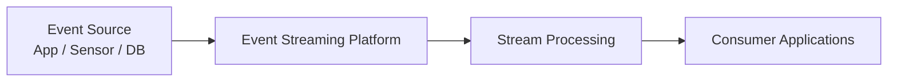

------

#### Common Use Cases of Event Streaming

##### 1. Financial Transactions

Banks process payments instantly.

Example:

1. ATM Withdrawal
2. Credit Card Payment
3. UPI Transfer

------

##### 2. Logistics Tracking

Track vehicles and shipments in real time.

Example:

1. Truck Location Updated
2. Shipment Delivered
3. Fuel Level Updated

------

##### 3. IoT Sensor Monitoring

Factories continuously monitor machines.

Example:

1. Temperature Sensor
2. Pressure Sensor
3. Machine Status

------

##### 4. Customer Activity Tracking

Retail and apps track user actions.

Example:

1. Product Viewed
2. Order Placed
3. Payment Completed

---

### What is Apache Kafka?

#### Introduction

Apache Kafka is a **distributed event-streaming platform** designed to handle very large amounts of data in real time. Kafka can process millions of messages per second, store them safely, and allow multiple consumers to read the same data independently.

In simple words, Kafka allows applications to:

- **Send data** (publish)
- **Store data safely**
- **Process data**
- **Read data** (consume)

It works efficiently even when millions of messages are coming every second.

Kafka is not just a messaging system. It works like:

- A **message broker** (sends data between services)
- A **distributed commit log** (stores data in order)
- A **streaming backbone** for microservices (connects everything)

------

### Why Kafka is Used

Kafka is widely used when:

- Data must **never be lost**
- Data must be processed **very fast**
- The system must **scale horizontally** (add more servers easily)

**Common examples:**

- Order processing
- Payment systems
- Notifications
- Log collection
- Real-time analytics

------

##### How Kafka Works (Simple Architecture)

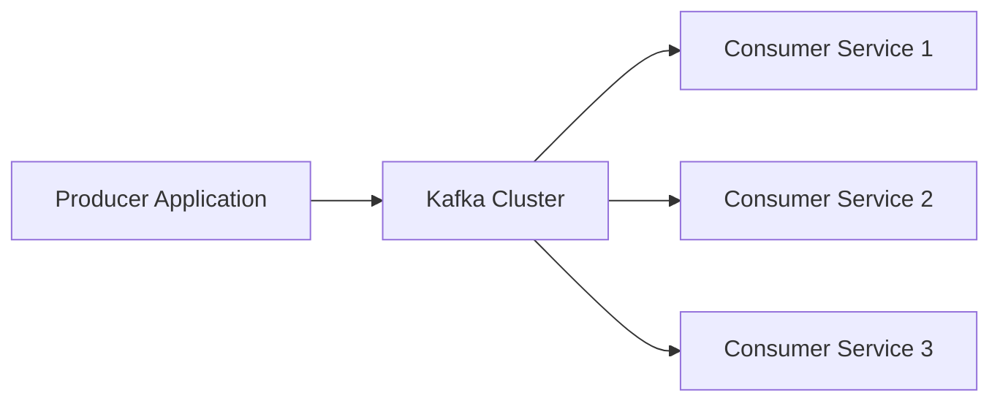

##### Explanation:

- **Producer** → Sends data to Kafka
- **Kafka Cluster** → Stores data safely
- **Consumers** → Read and process data

Multiple services can read the same data independently.

------

##### Real-Life Example

Imagine an online shopping app:


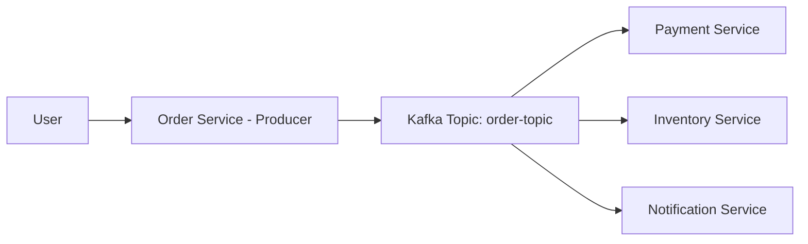

1. User places an order.
2. Order service sends an event to Kafka.
3. Payment service reads the event.
4. Inventory service reads the same event.
5. Notification service reads it too.

One event. Multiple services. No direct dependency between them.

------

##### Simple Practical Example (Java Producer)

```java
Properties props = new Properties();
props.put("bootstrap.servers", "localhost:9092");
props.put("key.serializer", "org.apache.kafka.common.serialization.StringSerializer");
props.put("value.serializer", "org.apache.kafka.common.serialization.StringSerializer");

KafkaProducer<String, String> producer = new KafkaProducer<>(props);
producer.send(new ProducerRecord<>("orders", "Order Created"));
producer.close();
```

This sends a message `"Order Created"` to the `orders` topic.

---

### Main Components of Apache Kafka

Kafka has several core components that work together:
1. **Producer** – Sends messages to Kafka

2. **Broker** – Kafka server that stores data

3. **Topic** – Logical category of messages

4. **Partition** – Physical split of a topic

5. **Consumer** – Reads messages

6. **Consumer Group** – Multiple consumers working together

7. **Offset** – Position of a message inside a partition

  Each component plays a specific role in making Kafka scalable and fault-tolerant.

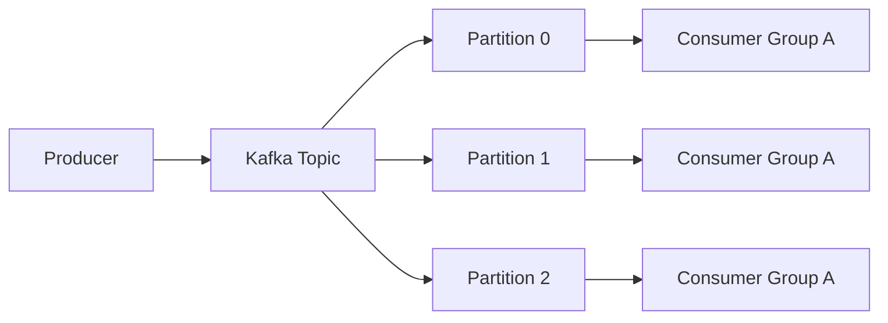

------

##### Real-Life Example (E-commerce)

User places an order.

Producer:

- Order Service publishes `OrderCreated` event.

Kafka Topic:

- `order-topic`

Consumers:

- Payment Service
- Inventory Service
- Notification Service
- Analytics Service

All consume the **same event independently**.

---

## Apache Kafka Core Components 

------

### Kafka Cluster

#### Definition

A **Kafka Cluster** is a **group of multiple Kafka brokers working together** to store and manage data streams. It provides **high availability, scalability, and fault tolerance**.

If one broker fails, another broker in the cluster can continue serving the data.

------

##### Example

Imagine an **e-commerce system**.

- Order service sends events
- Payment service sends events
- Inventory service sends events

These events are stored across **multiple brokers inside a Kafka cluster** so the system can handle millions of messages.

Example Event:

1. Order Created
2. Payment Completed
3. Inventory Updated

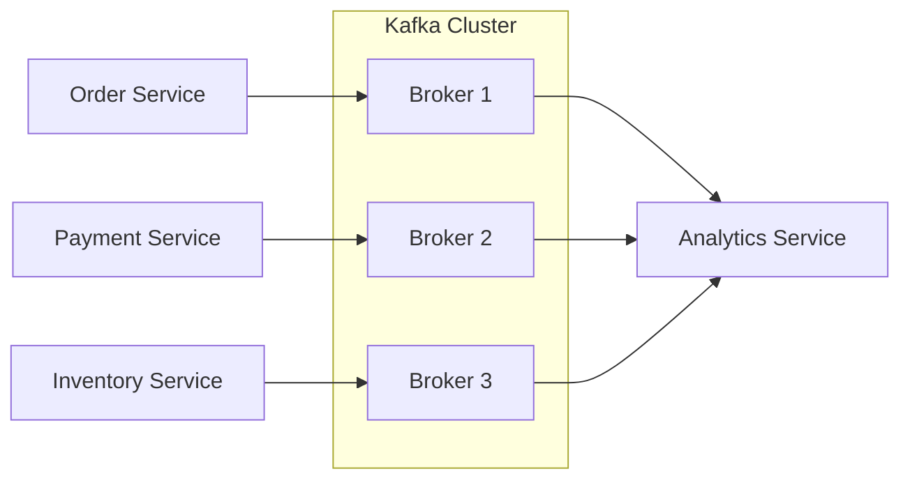

Explanation:

- Multiple brokers together form a **Kafka Cluster**
- Producers send data to the cluster
- Consumers read data from the cluster

------

### Kafka Broker

#### Definition

A **Kafka Broker** is a **Kafka server responsible for receiving, storing, and serving messages**.

Each broker stores **topics and partitions** and handles requests from **producers and consumers**.

Every broker has a **unique broker ID**.

------

##### Example

A banking system publishes transactions:

1. Account Debited
2. Account Credited
3. Transaction Completed

The **Kafka Broker stores these messages inside topic partitions** and provides them to consumers.


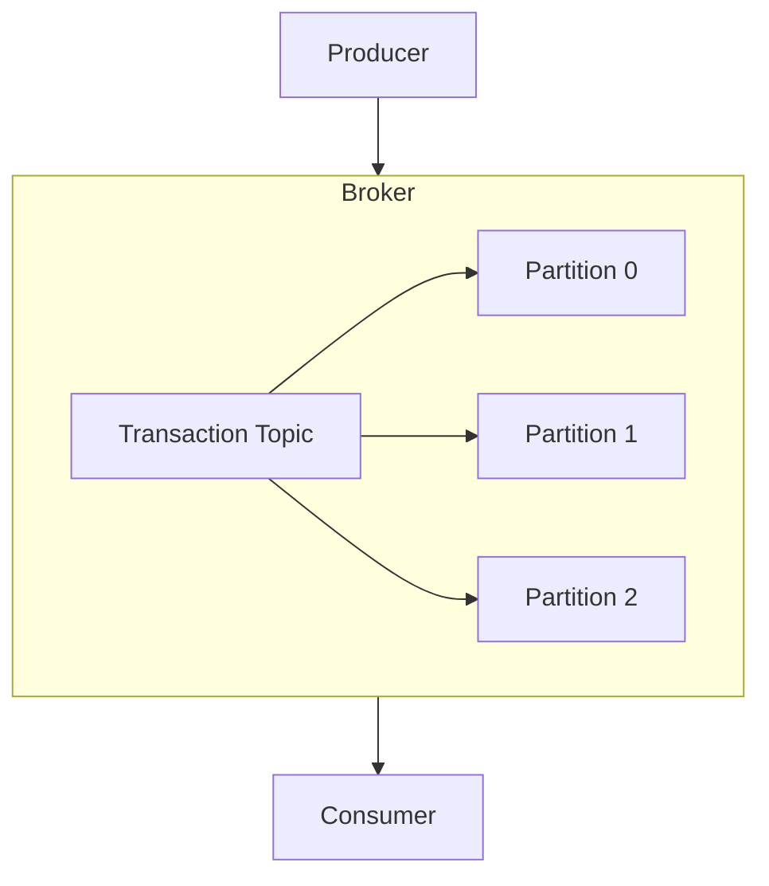

Explanation:

- Broker receives messages
- Stores them in **topics**
- Topics contain **partitions**
- Consumers read messages

------

### Kafka Connect

#### Definition

**Kafka Connect** is a tool used to **integrate Kafka with external systems** like databases, file systems, and cloud storage.

It helps **import data into Kafka or export data from Kafka** without writing custom code.

There are two types:

- **Source Connector** → moves data **into Kafka**
- **Sink Connector** → moves data **from Kafka to another system**

------

##### Example

Banking transaction data stored in **MySQL database** needs to be streamed to Kafka.

Kafka Connect reads data from MySQL and pushes it into Kafka topics.

Example flow:

```
MySQL Database → Kafka Topic → Analytics System
```


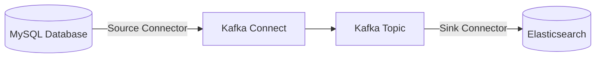

Explanation:

- Source connector imports data from DB
- Sink connector exports data to another system

------

### Kafka Streams

#### Definition

**Kafka Streams** is a **Java library used to process and transform Kafka data in real time**.

It allows developers to perform operations like:

- Filtering
- Aggregation
- Transformation
- Windowing

directly on streaming data.

------

##### Example

An e-commerce system processes order events.

Incoming events:

```cmd
Order Created

Order Cancelled

Order Completed
```

Kafka Streams processes these events to calculate **real-time sales statistics**.

Example result:

```cmd
Total Orders Today: 1500
Total Revenue: $50,000
```


------

##### example 

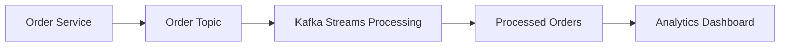

**Explanation:**

- Producer sends events
- Kafka Streams processes events
- Output is stored in another topic
- Consumers read processed data

------

##### Quick Summary Table

| Component     | Purpose                                              |
| ------------- | ---------------------------------------------------- |
| Kafka Cluster | Group of brokers working together                    |
| Kafka Broker  | Server that stores and manages messages              |
| Kafka Connect | Tool to move data between Kafka and external systems |
| Kafka Streams | Library to process Kafka data in real time           |

---

## Kafka Topics and Partitions

------

### Kafka Topic

#### Definition

A **Kafka Topic** is a **logical category or channel where messages (events) are stored**.

Producers **send messages to a topic**, and consumers **read messages from that topic**.

A topic works like a **message category**.

------

##### Example

In an **e-commerce system**, different topics can exist.

1. order-topic
2. payment-topic
3. shipment-topic

Example events in `order-topic`:

- Order Created
- Order Cancelled
- Order Delivered

##### 

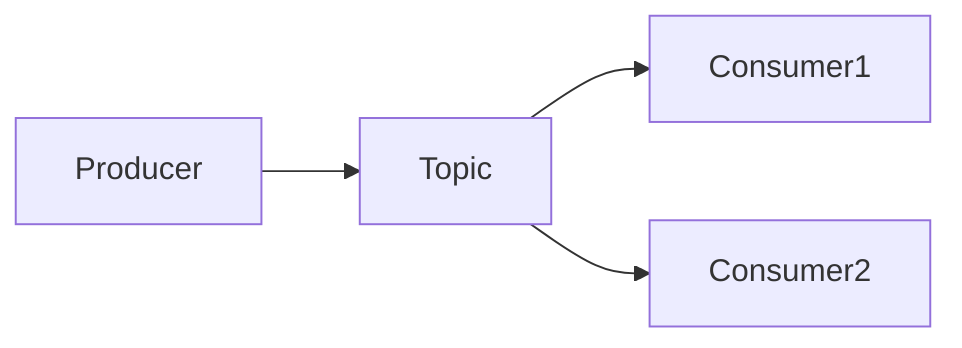

Explanation

- Producer sends messages to **topic**
- Multiple consumers can read messages from the same topic

------

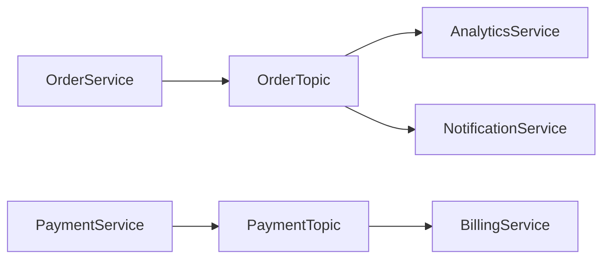

Explanation

- Multiple services produce data
- Data is stored in different topics
- Consumers read topics based on their needs

------

### Kafka Partition

#### Definition

A **Partition** is a **physical division of a Kafka topic used to store data and enable parallel processing**.

Topics are split into **multiple partitions** to improve:

- **Scalability**
- **Performance**
- **Parallel consumption**

Messages inside a partition are stored in **ordered sequence**.

------

##### Example

Topic: `order-topic`

1. Partition 0
2. Partition 1
3. Partition 2

Events stored like:

```text
Partition 0 → Order1, Order4, Order7
Partition 1 → Order2, Order5, Order8
Partition 2 → Order3, Order6, Order9
```

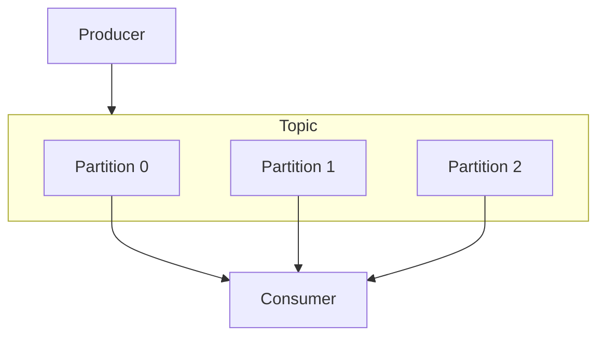

Explanation

- Topic is divided into partitions
- Producers send messages
- Consumers read from partitions

------

#### How Messages Are Stored in Partition

Each message gets an **offset** (unique sequence number).

Example:

```text
Partition 0

Offset 0 → Order Created
Offset 1 → Payment Done
Offset 2 → Order Shipped
```

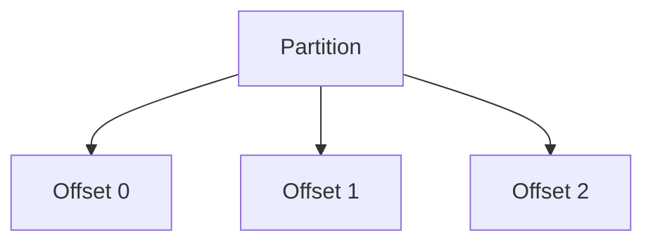

Explanation

- Messages are stored sequentially
- Offset helps consumers track reading position

------

#### Why Partitions Are Important

Partitions allow Kafka to **process large volumes of data efficiently**.

Benefits:

| Benefit             | Explanation                                       |
| ------------------- | ------------------------------------------------- |
| Scalability         | Topics can grow with more partitions              |
| Parallel Processing | Multiple consumers read partitions simultaneously |
| High Throughput     | Large number of messages handled                  |
| Fault Tolerance     | Partitions can be replicated across brokers       |

------

##### Example: Parallel Processing

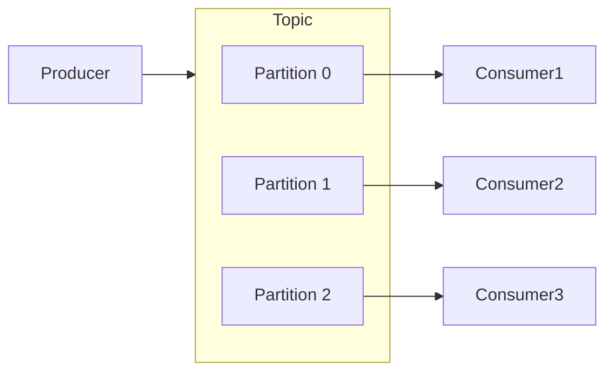

Explanation

- Each consumer reads a **different partition**
- Messages processed **in parallel**
- Improves performance

------

##### Quick Comparison

| Concept   | Meaning                              |
| --------- | ------------------------------------ |
| Topic     | Logical category of messages         |
| Partition | Physical storage unit inside topic   |
| Offset    | Position of message inside partition |

---

***

## Kafka Producer and Consumer

------

### Kafka Producer

#### Definition

A **Kafka Producer** is an application that **sends (publishes) messages/events to Kafka topics**.

Producers generate events and push them to the Kafka cluster.

------

##### Example

In an **e-commerce system**:

- Order Service creates an order
- It sends an event to Kafka

Example event:

```json
{
  "event": "OrderCreated",
  "orderId": 1001,
  "user": "John"
}
```

Producer sends this event to:

```text
order-topic
```

------

##### Producer Data Flow

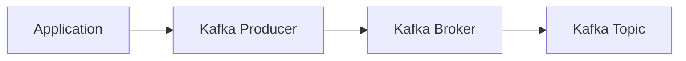

Explanation

- Application generates event
- Producer sends event
- Broker receives event
- Event stored in topic

------

##### Producer Sending to Partitions

Kafka producer can send messages to **different partitions**.

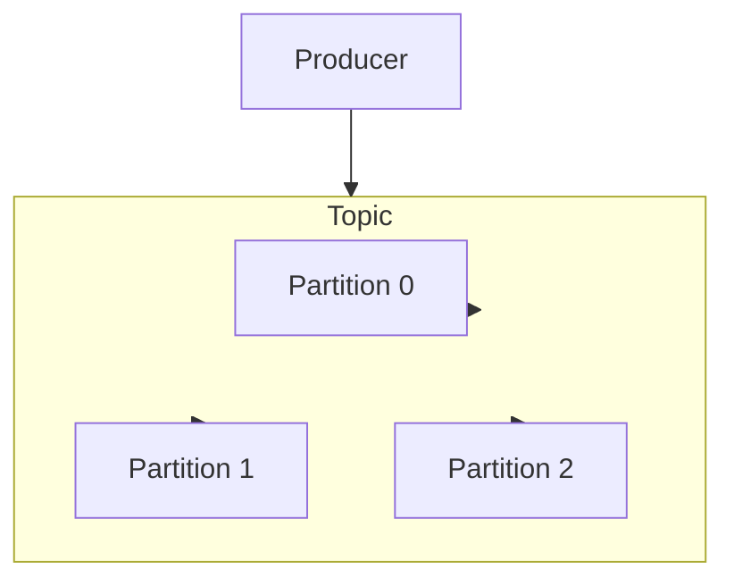

------

##### How Producer Decides Partition

Producer selects partition based on:

| Method              | Explanation                     |
| ------------------- | ------------------------------- |
| Round Robin         | Messages distributed evenly     |
| Key-based           | Same key goes to same partition |
| Custom Partitioning | Developer logic                 |

Example:

```text
Key = CustomerId
```

All events of same customer go to **same partition**.

------

##### Producer Configuration (Important for Interview)

Common producer configurations:

| Property          | Purpose                    |
| ----------------- | -------------------------- |
| bootstrap.servers | Kafka broker address       |
| key.serializer    | Serialize message key      |
| value.serializer  | Serialize message value    |
| acks              | Message delivery guarantee |
| retries           | Retry failed messages      |

------

##### Producer Example (Spring Boot)

```java
@Autowired
private KafkaTemplate<String, String> kafkaTemplate;

public void sendOrderEvent() {
    kafkaTemplate.send("order-topic", "Order Created");
}
```


------

### Kafka Consumer

#### Definition

A **Kafka Consumer** is an application that **reads (subscribes to) messages from Kafka topics**.

Consumers process the events generated by producers.

------

##### Example

In a **banking system**:

Producer sends event:

```text
Transaction Completed
```

Consumer services may be:

- Fraud Detection
- Notification Service
- Analytics System

------

##### Consumer Data Flow

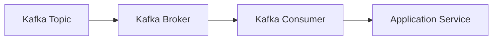

------

#### Consumer Reading from Partitions

Consumers read messages from **topic partitions**.

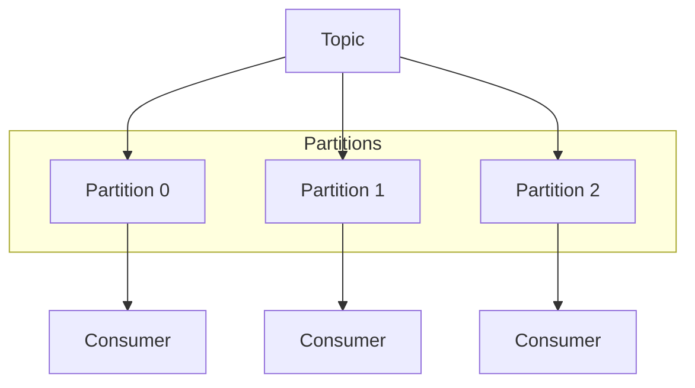

Explanation

- Each consumer reads **different partition**
- Enables **parallel processing**

------

### Consumer Offset

Each message in a partition has an **offset**.

Offset helps the consumer track **which messages are already processed**.

Example:

```bash
Partition 0

Offset 0 → Order Created
Offset 1 → Payment Done
Offset 2 → Order Shipped
```

Consumer stores the last processed offset.

------

### Consumer Group

A **Consumer Group** is a group of consumers working together to read a topic.

Rules:

1. Each partition is read by **only one consumer in a group**
2. Multiple consumers allow **parallel processing**

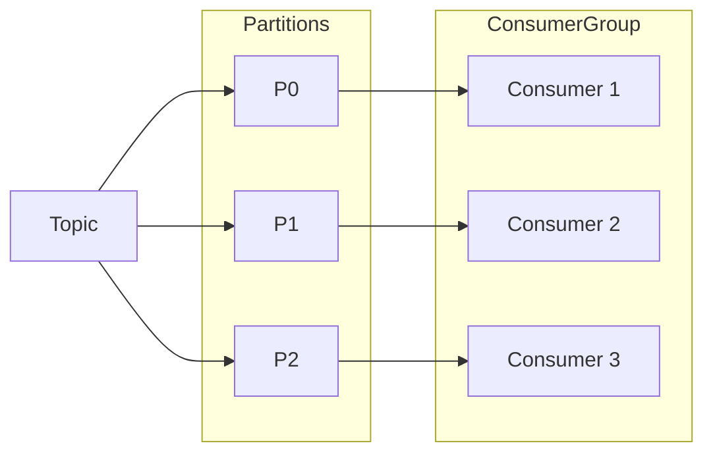

------

##### Consumer Example (Spring Boot)

```java
@KafkaListener(topics = "order-topic", groupId = "order-group")
public void consume(String message) {
    System.out.println("Received: " + message);
}
```

Explanation:

- Consumer listens to **order-topic**
- Part of **order-group**
- Processes incoming messages

------

#### Producer vs Consumer

| Feature         | Producer          | Consumer                 |
| --------------- | ----------------- | ------------------------ |
| Role            | Sends messages    | Reads messages           |
| Writes/Reads    | Writes to topic   | Reads from topic         |
| Partition Logic | Decides partition | Reads assigned partition |
| Offset          | Not used          | Tracks message position  |

------

##### End-to-End Kafka Flow

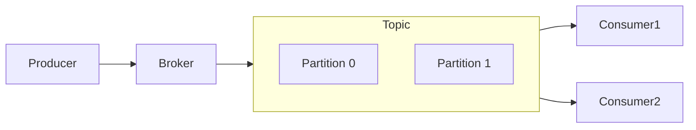

------

### Complete Kafka Flow (Born → Process → Stored → Consumed)

This explains the **complete lifecycle of data in Kafka**, from **event creation to consumption and processing**.

------

#### 1. Event Creation (Birth of Data)

Everything in Kafka starts with an **event**.

An **event** represents something that happened in a system.

Examples:

```text
Order Created
Payment Completed
User Logged In
Temperature Updated
```

Example Event:

```json
{
  "event": "OrderCreated",
  "orderId": 1001,
  "user": "John",
  "time": "2026-03-05T10:30:00"
}
```

These events are generated by **applications, databases, sensors, or services**.

## 

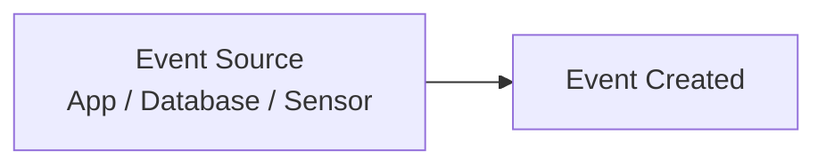

------

#### 2. Producer Sends Event to Kafka

A **Producer** is responsible for **sending events to Kafka**.

Producer responsibilities:

- Serialize data
- Choose topic
- Choose partition
- Send event to broker

Example:

```java
kafkaTemplate.send("order-topic", "Order Created");
```

```mermaid
flowchart LR
    App[Application] --> Producer
    Producer --> KafkaBroker[Kafka Broker]
```

------

#### 3. Kafka Broker Receives Message

A **Kafka Broker** is a **Kafka server responsible for storing and managing messages**.

Responsibilities:

- Receive events from producers
- Store them in topics
- Serve consumers
- Replicate data

A Kafka system normally contains **multiple brokers forming a cluster**.

## 

```mermaid
flowchart LR
    Producer --> Broker1
    Producer --> Broker2
    Producer --> Broker3

    subgraph KafkaCluster
        Broker1
        Broker2
        Broker3
    end
```

------

#### 4. Message Stored in Topic

A **Topic** is a **logical category where events are stored**.

Example topics:

```text
order-topic
payment-topic
shipment-topic
```

Each topic contains **multiple partitions**.

------

## Visual

```mermaid
flowchart LR
    Producer --> Topic[Order Topic]

    Topic --> Consumer1
    Topic --> Consumer2
```

------

#### 5. Topic Split into Partitions

Kafka divides topics into **partitions for scalability**.

Benefits:

- Parallel processing
- High throughput
- Distributed storage

Example:

```text
order-topic
    Partition 0
    Partition 1
    Partition 2
```

Messages are stored sequentially inside partitions.

## 

```mermaid
flowchart TB
    Producer --> Topic

    subgraph Topic
        P0[Partition 0]
        P1[Partition 1]
        P2[Partition 2]
    end
```

------

#### 6. Offset Assignment

Every message stored in a partition gets a **unique offset**.

Offset = **position of message inside partition**

Example:

```text
Partition 0

Offset 0 → Order Created
Offset 1 → Payment Done
Offset 2 → Order Shipped
```

Offsets help consumers **track progress**.

## 

```mermaid
flowchart TB
    Partition --> O0[Offset 0]
    Partition --> O1[Offset 1]
    Partition --> O2[Offset 2]
```

------

#### 7. Data Replication (Fault Tolerance)

Kafka replicates partitions across brokers.

Each partition has:

- **Leader**
- **Follower replicas**

Producer and consumer communicate **only with leader**.

If leader fails → follower becomes leader.

## 

```mermaid
flowchart LR
    Leader[Leader Partition] --> Follower1
    Leader --> Follower2
```

Explanation:

- Leader handles reads/writes
- Followers keep replicated copy

------

#### 8. Consumer Reads Messages

A **Kafka Consumer** reads messages from topics.

Consumers subscribe to topics and process incoming events.

Example:

```java
@KafkaListener(topics = "order-topic")
public void consume(String message) {
    System.out.println(message);
}
```

------

## Visual

```mermaid
flowchart LR
    Topic --> Consumer
    Consumer --> Application
```

------

#### 9. Consumer Group Processing

Consumers work in **consumer groups**.

Rules:

- One partition → one consumer
- Enables parallel processing

Example:

```text
Topic Partitions = 3
Consumers = 3
```

Each consumer processes one partition.

```mermaid
flowchart LR
    Topic

    subgraph Partitions
        P0
        P1
        P2
    end

    subgraph ConsumerGroup
        C1
        C2
        C3
    end

    P0 --> C1
    P1 --> C2
    P2 --> C3
```

------

#### 10. Stream Processing (Optional)

Kafka allows **real-time processing of data streams**.

Tools used:

- Kafka Streams
- Stream processing applications

Example:

Input event:

```text
Order Created
```

Processing:

```text
Calculate daily sales
```

Output:

```text
Total Sales Today
```

------

## Visual

```mermaid
flowchart LR
    Producer --> Topic1
    Topic1 --> StreamProcessing
    StreamProcessing --> Topic2
    Topic2 --> Consumer
```

------

#### 11. Data Storage and Retention

Kafka stores messages for a **configured retention period**.

Example configurations:

```text
7 days
30 days
Unlimited
```

Consumers can read:

- Real-time data
- Historical data

------

#### 12. Data Deletion (End of Lifecycle)

After the retention period expires:

Kafka **automatically deletes old messages**.

Lifecycle:

```text
Event Created
→ Sent to Kafka
→ Stored in Topic
→ Processed by Consumers
→ Retained for configured time
→ Deleted automatically
```

------

##### Complete Kafka End-to-End Architecture

```mermaid
flowchart LR
    Source[Event Source] --> Producer
    Producer --> Broker

    subgraph KafkaCluster
        Broker --> Topic
    end

    subgraph Topic
        P0[Partition 0]
        P1[Partition 1]
        P2[Partition 2]
    end

    Topic --> ConsumerGroup

    subgraph ConsumerGroup
        C1[Consumer 1]
        C2[Consumer 2]
        C3[Consumer 3]
    end

    ConsumerGroup --> Processing[Application Processing]
```

------

##### Complete Kafka Flow (Quick Revision)

```text
1 Event Generated
2 Producer Sends Event
3 Broker Receives Event
4 Event Stored in Topic
5 Topic Split into Partitions
6 Offset Assigned
7 Replication for Fault Tolerance
8 Consumer Reads Messages
9 Consumer Groups Process in Parallel
10 Stream Processing (Optional)
11 Data Stored for Retention Time
12 Old Data Deleted
```

---

### Spring Boot + Kafka Complete Application (Producer + Consumer)

This example shows a **simple Spring Boot Kafka application** where:

- Producer sends **Order events**
- Kafka stores them in **topic**
- Consumer reads and processes them

------

##### 1. Architecture Overview

```mermaid
flowchart LR
    Client[REST API Request]
    Producer[Kafka Producer Service]
    Topic[Kafka Topic : order-topic]
    Consumer[Kafka Consumer Service]
    DB[(Processing / Database)]

    Client --> Producer
    Producer --> Topic
    Topic --> Consumer
    Consumer --> DB
```

Flow:

1. Client sends request
2. Spring Boot producer publishes message
3. Kafka stores message in topic
4. Consumer reads message
5. Consumer processes message

------

##### 2. Project Structure

```text
src/main/java/com/example/kafka
│
├── config
│     KafkaConfig.java
│
├── producer
│     OrderProducer.java
│
├── consumer
│     OrderConsumer.java
│
├── controller
│     OrderController.java
│
├── model
│     OrderEvent.java
│
└── KafkaApplication.java
```

------

##### 3. Maven Dependency

```xml
<dependency>
 <groupId>org.springframework.kafka</groupId>
 <artifactId>spring-kafka</artifactId>
</dependency>
```

------

##### 4. application.yml Configuration

```yaml
spring:
  kafka:
    bootstrap-servers: localhost:9092

    consumer:
      group-id: order-group
      auto-offset-reset: earliest
      key-deserializer: org.apache.kafka.common.serialization.StringDeserializer
      value-deserializer: org.springframework.kafka.support.serializer.JsonDeserializer

    producer:
      key-serializer: org.apache.kafka.common.serialization.StringSerializer
      value-serializer: org.springframework.kafka.support.serializer.JsonSerializer
```

Important configs:

| Property          | Purpose                  |
| ----------------- | ------------------------ |
| bootstrap-servers | Kafka broker address     |
| group-id          | Consumer group           |
| serializer        | Convert object → message |
| deserializer      | Convert message → object |

------

##### 5. Event Model

Order event object.

```java
package com.example.kafka.model;

public class OrderEvent {

    private String orderId;
    private String product;
    private int quantity;

    public OrderEvent() {}

    public OrderEvent(String orderId, String product, int quantity) {
        this.orderId = orderId;
        this.product = product;
        this.quantity = quantity;
    }

    public String getOrderId() { return orderId; }
    public void setOrderId(String orderId) { this.orderId = orderId; }

    public String getProduct() { return product; }
    public void setProduct(String product) { this.product = product; }

    public int getQuantity() { return quantity; }
    public void setQuantity(int quantity) { this.quantity = quantity; }
}
```

Example event JSON:

```json
{
  "orderId": "1001",
  "product": "Laptop",
  "quantity": 1
}
```

------

##### 6. Kafka Producer

Service responsible for **sending messages to Kafka topic**.

```java
package com.example.kafka.producer;

import org.springframework.kafka.core.KafkaTemplate;
import org.springframework.stereotype.Service;
import com.example.kafka.model.OrderEvent;

@Service
public class OrderProducer {

    private final KafkaTemplate<String, OrderEvent> kafkaTemplate;

    public OrderProducer(KafkaTemplate<String, OrderEvent> kafkaTemplate) {
        this.kafkaTemplate = kafkaTemplate;
    }

    public void sendOrder(OrderEvent order) {
        kafkaTemplate.send("order-topic", order);
    }
}
```

------

##### Producer Flow

```mermaid
flowchart LR
    Controller --> ProducerService
    ProducerService --> KafkaTemplate
    KafkaTemplate --> Topic
```

------

##### 7. Kafka Consumer

Consumer reads events from topic.

```java
package com.example.kafka.consumer;

import org.springframework.kafka.annotation.KafkaListener;
import org.springframework.stereotype.Service;
import com.example.kafka.model.OrderEvent;

@Service
public class OrderConsumer {

    @KafkaListener(topics = "order-topic", groupId = "order-group")
    public void consume(OrderEvent event) {

        System.out.println("Order Received:");
        System.out.println("OrderId: " + event.getOrderId());
        System.out.println("Product: " + event.getProduct());
        System.out.println("Quantity: " + event.getQuantity());
    }
}
```

------

##### Consumer Flow

```mermaid
flowchart LR
    Topic --> KafkaListener
    KafkaListener --> ConsumerService
    ConsumerService --> Processing
```

------

##### 8. REST Controller (Trigger Producer)

This API will **send event to Kafka**.

```java
package com.example.kafka.controller;

import org.springframework.web.bind.annotation.*;
import com.example.kafka.model.OrderEvent;
import com.example.kafka.producer.OrderProducer;

@RestController
@RequestMapping("/orders")
public class OrderController {

    private final OrderProducer producer;

    public OrderController(OrderProducer producer) {
        this.producer = producer;
    }

    @PostMapping
    public String createOrder(@RequestBody OrderEvent order) {

        producer.sendOrder(order);

        return "Order sent to Kafka";
    }
}
```

------

##### API Request Example

POST request:

```text
POST /orders
```

Body:

```json
{
  "orderId": "1001",
  "product": "Laptop",
  "quantity": 1
}
```

------

##### 9. End-to-End Flow

```mermaid
flowchart LR
    Client[Postman / Client] --> API[Spring Boot REST API]
    API --> Producer
    Producer --> KafkaBroker
    KafkaBroker --> Topic

    Topic --> Consumer
    Consumer --> Processing
```

Steps:

1. Client sends request
2. Controller receives request
3. Producer sends event
4. Kafka stores event
5. Consumer reads event
6. Consumer processes event

------

##### 10. Running Kafka Locally

Start **Zookeeper**

```bash
bin/zookeeper-server-start.sh config/zookeeper.properties
```

Start **Kafka Broker**

```bash
bin/kafka-server-start.sh config/server.properties
```

Create topic

```bash
bin/kafka-topics.sh --create \
--topic order-topic \
--bootstrap-server localhost:9092 \
--partitions 3 \
--replication-factor 1
```

------

##### 11. Interview Points (Very Important)

##### Producer

- Uses **KafkaTemplate**
- Sends messages to **topic**
- Supports async messaging

##### Consumer

- Uses **@KafkaListener**
- Reads messages from topic
- Part of **consumer group**

##### Serialization

| Type         | Purpose                |
| ------------ | ---------------------- |
| Serializer   | Object → Kafka message |
| Deserializer | Kafka message → Object |

##### Fault Tolerance

- Offset management
- Consumer group rebalance
- Partition replication

------

##### Quick Revision Flow

```text
Client Request
      ↓
Spring Boot REST Controller
      ↓
Kafka Producer (KafkaTemplate)
      ↓
Kafka Broker
      ↓
Kafka Topic + Partitions
      ↓
Kafka Consumer (@KafkaListener)
      ↓
Application Processing
```

