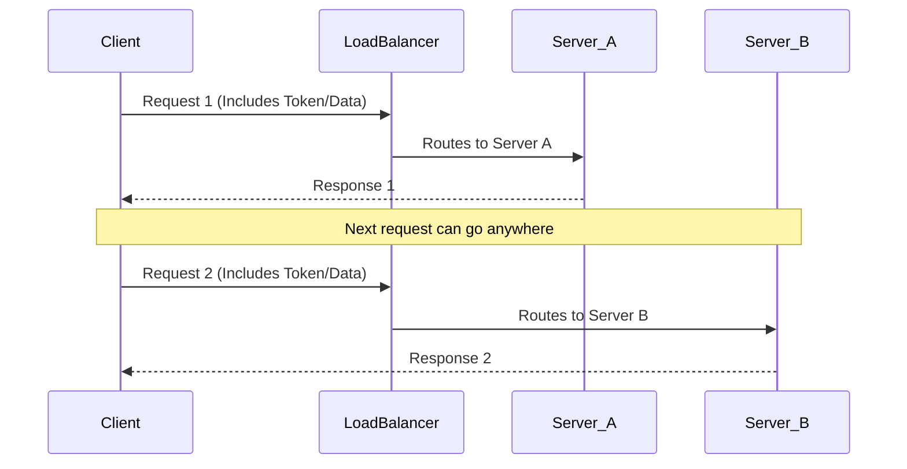
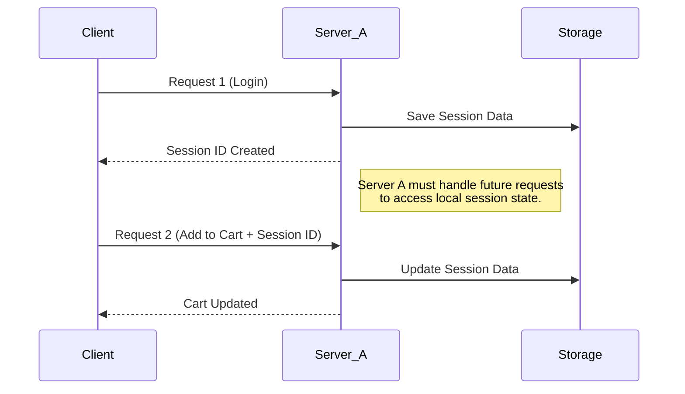

## System Design Notes

System Design is the process of designing the architecture, components, and interfaces for a system so that it meets the end-user requirements.

- **Key Concepts**:
  - **Architecture**: The overall structure of the system, including how different parts interact.
  - **Components**: Individual parts of a system that work together to perform specific functions.
  - **Modules**: Smaller sections of a system that can be developed independently but work together as a whole.
  - **Interfaces**: Points of interaction between components or systems, allowing them to communicate.
- **Importance of System Design**:
  - Ensures that systems are efficient, scalable, and maintainable.
  - Helps in understanding user requirements and translating them into technical specifications.
- **Steps in System Design**:
  1. **Requirements Gathering**: Collecting information about what users need from the system.
  2. **System Specification**: Documenting the requirements in detail.
  3. **Design**: Creating models and diagrams to represent the system structure and behavior.
  4. **Implementation**: Actual building of the system based on the design.
  5. **Testing**: Checking the system for errors and ensuring it meets requirements.
  6. **Deployment**: Releasing the system for use.
  7. **Maintenance**: Ongoing support and updates to keep the system functioning well.
- **Types of System Design**:
  - **High-Level Design (HLD)**: Focuses on the system architecture and how components interact.
  - **Low-Level Design (LLD)**: Details how each component will be implemented, including algorithms and data structures.
- **Challenges in System Design**:
  - Balancing functionality with performance and cost.
  - Adapting to changing user needs and technology advancements.
  - Ensuring security and data protection.

---

### 🗺️ High-Level Design (HLD)

**HLD** focuses on the "Big Picture." It describes the overall architecture and how major services interact.

- **Goal:** Define the system structure, data flow, and major components.
- **Target Audience:** Architects, stakeholders, and senior developers.
- **Key Components:**
  - **Architecture:** Microservices vs. Monoliths.
  - **Databases:** Choosing between SQL and NoSQL.
  - **Communication:** Protocols (HTTP, WebSockets) and Message Queues (Kafka, RabbitMQ).
  - **Scalability:** Load balancers, Caching (Redis/CDN), and Rate Limiting.
- **Artifacts:** Architecture diagrams, data flow diagrams, and deployment diagrams.

------

### 🔍 Low-Level Design (LLD)

**LLD** focuses on the "Internal Logic." It provides a detailed blueprint for developers to start coding.

- **Goal:** Convert the HLD into a detailed implementation plan for individual modules.
- **Target Audience:** Senior developers and programmers.
- **Key Components:**
  - **OOP Concepts:** Encapsulation, Inheritance, and Polymorphism.
  - **Design Patterns:** Implementation of SOLID principles and specific patterns (e.g., Singleton, Strategy).
  - **Data Structures:** Selecting appropriate structures for logic.
  - **API Specs:** Precise request/response formats and error handling.
  - **Database Schema:** Detailed table structures, indexes, and relationships.
- **Artifacts:** UML Class diagrams, sequence diagrams, and pseudocode.

------

#### 🚀 Steps to Approach a Design Problem

1. **Clarify Requirements:** Understand functional (what it does) and non-functional (performance, latency) requirements.
2. **Define Architecture:** Sketch the high-level flow (HLD).
3. **Choose Tech Stack:** Select languages, frameworks, and databases based on needs.
4. **Design Modules:** Break the system into smaller, manageable components (LLD).
5. **Plan for Scalability:** Identify bottlenecks and add load balancing or sharding.
6. **Ensure Security:** Implement authentication, encryption, and privacy measures.

---

### **Stateless** and **Stateful** systems

------

#### 1. Stateless Systems

In a [stateless system](https://www.geeksforgeeks.org/system-design/stateless-and-stateful-systems-in-system-design/), the server does not store any information about the client session. Every request is treated as a completely new interaction.

- **Key Logic:** The request must contain all the information necessary for the server to process it (e.g., a **JWT token** for authentication).
- **Pros:** Highly scalable (any server can handle any request) and easy to recover from crashes.
- **Cons:** Every request carries extra data (overhead), and the server may need to fetch data from a database repeatedly.

**Example:** A **REST API** for a weather service. You send a zip code; the server gives you the temperature. It doesn't need to remember who you are to give that specific answer.

##### Stateless Architecture Diagram

Code snippet

------

#### 2. Stateful Systems

A [stateful system](https://www.geeksforgeeks.org/system-design/stateless-and-stateful-systems-in-system-design/) remembers client data (the "state") from previous interactions.

- **Key Logic:** The server maintains a "session" in its memory or a dedicated local store.
- **Pros:** Better user experience for complex workflows and reduced data transfer per request (since the server already knows the context).
- **Cons:** Harder to scale horizontally. If a specific server holds your "cart," you must stay connected to that server (**Sticky Sessions**), or the state must be synchronized across all servers.

**Example:** An **Online Banking System** or a **Shopping Cart**. The server needs to remember that you logged in and what items you added to your cart three clicks ago.

### Stateful Architecture Diagram

Code snippet

## 

### Stateful vs Stateless Architecture

- **Definition**:
  - **Stateful Architecture**: Maintains the state of the application's data across multiple requests. The server remembers previous interactions with the user.
  - **Stateless Architecture**: Does not retain any information about user sessions or past interactions. Each request from the client is treated independently.
- **Key Characteristics**:
  - **Stateful**:
    - Requires **session management** to track user states.
    - More resource-intensive due to storage of session information.
    - Examples include applications with login sessions, shopping carts, and multiplayer games.
  - **Stateless**:
    - Each request contains all information needed to process it.
    - Scalability is easier since servers do not need to remember user sessions.
    - Examples include RESTful APIs and web services.
- **Advantages**:
  - **Stateful**:
    - Provides a more personalized user experience as it keeps track of user actions.
    - Useful in applications that require continuous interaction and data retention.
  - **Stateless**:
    - Simplifies server design as no session information needs to be managed.
    - Easier to scale horizontally since any server can respond to any request.
- **Disadvantages**:
  - **Stateful**:
    - Increased complexity in managing sessions and potential for resource exhaustion.
    - More prone to issues when scaling, as state information must be synchronized.
  - **Stateless**:
    - May require more data to be sent with each request, potentially leading to increased bandwidth usage.
    - Less capable of maintaining user-specific data without additional mechanisms.
- **Use Cases**:
  - **Stateful**: Online banking, social media sites, and applications with user-specific data.
  - **Stateless**: Public APIs, microservices, and systems where quick response times are critical.

----

**Summary Note:** Modern high-scale systems often use **Stateless Application Servers** combined with a **Stateful Database/Cache** (like Redis) to get the best of both worlds: easy scaling with persistent memory.

##### **SCALABILITY**

Scalability is the ability of a system to handle increasing load by adding resources.

##### **AVAILABILITY**
Availability = Uptime / (Uptime + Downtime)

##### **LATENCY VS THROUGHPUT**
Latency: Time per request  
Throughput: Requests per second

##### **CAP THEOREM**
Consistency, Availability, Partition Tolerance (choose 2)

##### **LOAD BALANCERS**
Round Robin, Least Connections, IP Hash

##### **DATABASES**
Relational, NoSQL, In-Memory, Graph

##### **CDN**
Delivers content from nearest server

##### **MESSAGE QUEUES**
Async communication between services

##### **RATE LIMITING**
Token Bucket, Leaky Bucket

##### **DATABASE INDEXES**
Improve query performance

##### **CACHING**
Read-Through, Write-Through, LRU, TTL

##### **CONSISTENT HASHING**
Efficient distribution across nodes

##### **DATABASE SHARDING**
Horizontal partitioning

##### **CONSENSUS ALGORITHMS**
Paxos, Raft

##### **PROXY SERVERS**
Forward, Reverse proxy

##### **HEARTBEATS**
Health check signals

##### **CHECKSUMS**
Data integrity verification

##### **SERVICE DISCOVERY**
Dynamic service communication

##### **BLOOM FILTERS**
Probabilistic existence check

##### **GOSSIP PROTOCOL**
Decentralized data sharing

##### **SCALING**
Vertical vs Horizontal

##### **CONSISTENCY**
Strong vs Eventual

##### **STATE**
Stateful vs Stateless

##### **CACHE TYPES**
Read-Through vs Write-Through

##### **SQL VS NOSQL**
Structured vs Flexible

##### **REST VS RPC**
Resource vs Action based

##### **SYNC VS ASYNC**
Sequential vs Concurrent

##### **BATCH VS STREAM**
Bulk vs Real-time

##### **LONG POLLING VS WEBSOCKETS**
Polling vs Persistent connection

##### **NORMALIZATION VS DENORMALIZATION**
Integrity vs Performance

##### **TCP VS UDP**
Reliable vs Fast

##### **ARCHITECTURES**
Client-Server, Microservices, Serverless, Event-Driven, P2P

##### **SYSTEM DESIGN STEPS**
Requirements → Capacity → Design → DB → API → Deep Dive → Scale

##### **TIPS**
Design scalable, fault-tolerant systems

##### **COMMON QUESTIONS**
URL Shortener, Chat App, E-commerce, Streaming, Logging System
