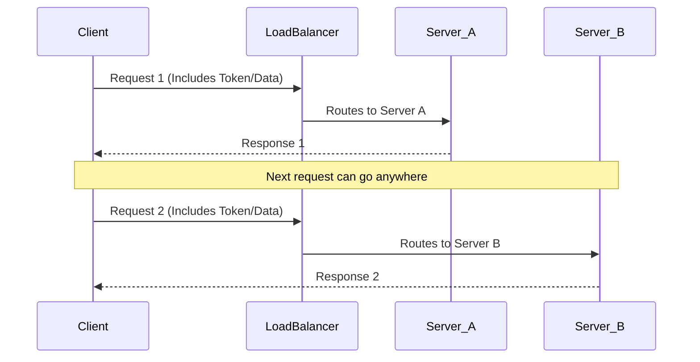
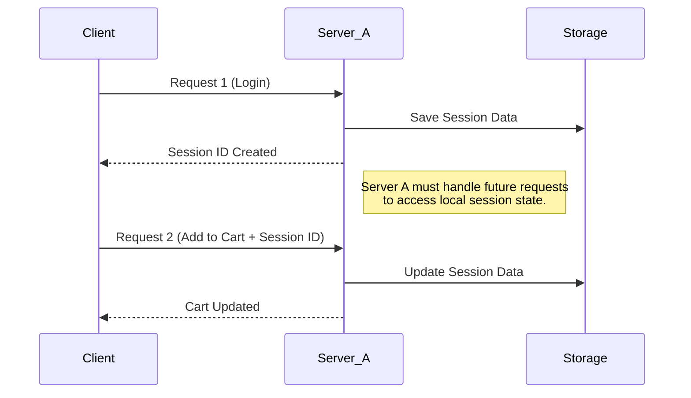
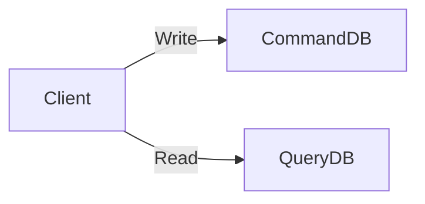

## System Design Notes

System Design is the process of designing the architecture, components, and interfaces for a system so that it meets the end-user requirements.

- **Key Concepts**:
  - **Architecture**: The overall structure of the system, including how different parts interact.
  - **Components**: Individual parts of a system that work together to perform specific functions.
  - **Modules**: Smaller sections of a system that can be developed independently but work together as a whole.
  - **Interfaces**: Points of interaction between components or systems, allowing them to communicate.
- **Importance of System Design**:
  - Ensures that systems are efficient, scalable, and maintainable.
  - Helps in understanding user requirements and translating them into technical specifications.
- **Steps in System Design**:
  1. **Requirements Gathering**: Collecting information about what users need from the system.
  2. **System Specification**: Documenting the requirements in detail.
  3. **Design**: Creating models and diagrams to represent the system structure and behavior.
  4. **Implementation**: Actual building of the system based on the design.
  5. **Testing**: Checking the system for errors and ensuring it meets requirements.
  6. **Deployment**: Releasing the system for use.
  7. **Maintenance**: Ongoing support and updates to keep the system functioning well.
- **Types of System Design**:
  - **High-Level Design (HLD)**: Focuses on the system architecture and how components interact.
  - **Low-Level Design (LLD)**: Details how each component will be implemented, including algorithms and data structures.
- **Challenges in System Design**:
  - Balancing functionality with performance and cost.
  - Adapting to changing user needs and technology advancements.
  - Ensuring security and data protection.

---

### 🗺️ High-Level Design (HLD)

**HLD** focuses on the "Big Picture." It describes the overall architecture and how major services interact.

- **Goal:** Define the system structure, data flow, and major components.
- **Target Audience:** Architects, stakeholders, and senior developers.
- **Key Components:**
  - **Architecture:** Microservices vs. Monoliths.
  - **Databases:** Choosing between SQL and NoSQL.
  - **Communication:** Protocols (HTTP, WebSockets) and Message Queues (Kafka, RabbitMQ).
  - **Scalability:** Load balancers, Caching (Redis/CDN), and Rate Limiting.
- **Artifacts:** Architecture diagrams, data flow diagrams, and deployment diagrams.

------

### 🔍 Low-Level Design (LLD)

**LLD** focuses on the "Internal Logic." It provides a detailed blueprint for developers to start coding.

- **Goal:** Convert the HLD into a detailed implementation plan for individual modules.
- **Target Audience:** Senior developers and programmers.
- **Key Components:**
  - **OOP Concepts:** Encapsulation, Inheritance, and Polymorphism.
  - **Design Patterns:** Implementation of SOLID principles and specific patterns (e.g., Singleton, Strategy).
  - **Data Structures:** Selecting appropriate structures for logic.
  - **API Specs:** Precise request/response formats and error handling.
  - **Database Schema:** Detailed table structures, indexes, and relationships.
- **Artifacts:** UML Class diagrams, sequence diagrams, and pseudocode.

------

#### 🚀 Steps to Approach a Design Problem

1. **Clarify Requirements:** Understand functional (what it does) and non-functional (performance, latency) requirements.
2. **Define Architecture:** Sketch the high-level flow (HLD).
3. **Choose Tech Stack:** Select languages, frameworks, and databases based on needs.
4. **Design Modules:** Break the system into smaller, manageable components (LLD).
5. **Plan for Scalability:** Identify bottlenecks and add load balancing or sharding.
6. **Ensure Security:** Implement authentication, encryption, and privacy measures.

---

### **Stateless** and **Stateful** systems

------

#### 1. Stateless Systems

In a [stateless system](https://www.geeksforgeeks.org/system-design/stateless-and-stateful-systems-in-system-design/), the server does not store any information about the client session. Every request is treated as a completely new interaction.

- **Key Logic:** The request must contain all the information necessary for the server to process it (e.g., a **JWT token** for authentication).
- **Pros:** Highly scalable (any server can handle any request) and easy to recover from crashes.
- **Cons:** Every request carries extra data (overhead), and the server may need to fetch data from a database repeatedly.

**Example:** A **REST API** for a weather service. You send a zip code; the server gives you the temperature. It doesn't need to remember who you are to give that specific answer.

##### Stateless Architecture Diagram

Code snippet



------

#### 2. Stateful Systems

A [stateful system](https://www.geeksforgeeks.org/system-design/stateless-and-stateful-systems-in-system-design/) remembers client data (the "state") from previous interactions.

- **Key Logic:** The server maintains a "session" in its memory or a dedicated local store.
- **Pros:** Better user experience for complex workflows and reduced data transfer per request (since the server already knows the context).
- **Cons:** Harder to scale horizontally. If a specific server holds your "cart," you must stay connected to that server (**Sticky Sessions**), or the state must be synchronized across all servers.

**Example:** An **Online Banking System** or a **Shopping Cart**. The server needs to remember that you logged in and what items you added to your cart three clicks ago.

### Stateful Architecture Diagram

Code snippet



## 


### Stateful vs Stateless Architecture

- **Definition**:
  - **Stateful Architecture**: Maintains the state of the application's data across multiple requests. The server remembers previous interactions with the user.
  - **Stateless Architecture**: Does not retain any information about user sessions or past interactions. Each request from the client is treated independently.
- **Key Characteristics**:
  - **Stateful**:
    - Requires **session management** to track user states.
    - More resource-intensive due to storage of session information.
    - Examples include applications with login sessions, shopping carts, and multiplayer games.
  - **Stateless**:
    - Each request contains all information needed to process it.
    - Scalability is easier since servers do not need to remember user sessions.
    - Examples include RESTful APIs and web services.
- **Advantages**:
  - **Stateful**:
    - Provides a more personalized user experience as it keeps track of user actions.
    - Useful in applications that require continuous interaction and data retention.
  - **Stateless**:
    - Simplifies server design as no session information needs to be managed.
    - Easier to scale horizontally since any server can respond to any request.
- **Disadvantages**:
  - **Stateful**:
    - Increased complexity in managing sessions and potential for resource exhaustion.
    - More prone to issues when scaling, as state information must be synchronized.
  - **Stateless**:
    - May require more data to be sent with each request, potentially leading to increased bandwidth usage.
    - Less capable of maintaining user-specific data without additional mechanisms.
- **Use Cases**:
  - **Stateful**: Online banking, social media sites, and applications with user-specific data.
  - **Stateless**: Public APIs, microservices, and systems where quick response times are critical.

----

## 🚀 Scalability

**Scalability** is a system’s ability to handle increasing workloads (users, data, or traffic) without a decline in performance. A scalable system expands resources rather than failing under pressure.

- **Goal:** Maintain reliability, efficiency, and dependability during traffic spikes.
- **Real-World Examples:** [Google](https://www.geeksforgeeks.org/system-design/what-is-scalability/) (search billions of queries), [Netflix](https://www.geeksforgeeks.org/system-design/what-is-scalability/) (streaming to millions via microservices), and [AWS](https://www.geeksforgeeks.org/system-design/what-is-scalability/) (on-demand cloud resources).

#### Types of Scaling

1. **Vertical Scaling (Scaling Up)**:
   - **Definition:** Increasing the capacity of a single server.
   - **Example:** Upgrading a server's CPU, RAM, or storage to improve performance.
   - **Benefits:**
     - Simplicity: Easy to implement as it involves upgrading existing hardware.
     - No need for complex architecture changes.
   - **Limitations:**
     - Downtime: Often requires downtime during upgrades.
     - Cost: Can become expensive as high-performance hardware is costly.
     - Limits: There is a physical limit to how much a single server can be upgraded.

2. **Horizontal Scaling (Scaling Out)**:
   - Definition: Adding more servers to a system to handle increased load.
   - Example: Deploying additional web servers behind a load balancer to distribute traffic.
   - Benefits:
     - Flexibility: Can easily add or remove servers as needed.
     - Redundancy: Improved fault tolerance since the system can continue to operate if one server fails.
     - Cost-Effectiveness: Often cheaper to add multiple lower-performance servers than to upgrade a single high-performance server.
   - Limitations:
     - Complexity: Requires more complex architecture and management.
     - Consistency: Ensuring data consistency across multiple servers can be challenging.

##### Key Concepts
- **Load Balancer**: A device or software that distributes incoming network traffic across multiple servers.
- **Fault Tolerance**: The ability of a system to continue functioning even when a component fails.
- **Redundancy**: The inclusion of extra components that are not strictly necessary to functioning, to provide reliability.


---

## 📌 Database Design in System Design

---

### 🧠 Definition
Database design is the process of organizing data to ensure:
- Efficient storage 📦
- Fast retrieval ⚡
- Consistency 🔒
- Scalability 📈

---

### 🧠 Types of Databases

#### 🔹 Relational (SQL)
- Tables (rows + columns)
- Fixed schema
- Supports relationships

💡 Example: MySQL, PostgreSQL

##### ✅ Use Case
- Banking, Inventory

---

#### 🔹 Non-Relational (NoSQL)
- Flexible schema
- Document / Key-Value / Graph

💡 Example: MongoDB, Cassandra

##### ✅ Use Case
- Social media, Big data

---

### ⚖️ SQL vs NoSQL

| Feature | SQL | NoSQL |
|--------|-----|------|
| Structure | Tables | Flexible |
| Schema | Fixed | Dynamic |
| Scaling | Vertical | Horizontal |
| Use Case | Transactions | Large-scale |

---

### 📌 Importance

#### 🔹 Performance
Fast queries

#### 🔹 Scalability
Handles growth

#### 🔹 Data Integrity
No duplicate/inconsistent data

#### 🔹 Maintainability
Easy updates

---

### 🧠 CAP Theorem

> Cannot achieve all 3 together:
- Consistency (C)
- Availability (A)
- Partition Tolerance (P)

---

#### 🔹 CP (Consistency + Partition)
- Accurate data
- Less availability

💡 Banking systems

---

#### 🔹 AP (Availability + Partition)
- Always responsive
- Eventual consistency

💡 Cassandra

---

#### 🔹 CA (Consistency + Availability)
- No partition tolerance
- Used in small systems

---

### 🧠 Choosing Database

#### 🔹 Data Structure
- SQL → Structured
- NoSQL → Unstructured

#### 🔹 Scalability
- SQL → Vertical
- NoSQL → Horizontal

#### 🔹 Consistency vs Availability
- SQL → Consistency
- NoSQL → Availability

#### 🔹 Transactions
- SQL → ACID
- NoSQL → BASE

----

### Sharding and Partitioning in System Design

##### **Introduction**
- **Sharding** and **Partitioning** are techniques used in database design to improve performance and manage large datasets.
- Both methods help in distributing data across multiple servers or locations.
- Database sharding is a technique for horizontal scaling of databases, where the data is split across multiple database instances, or shards, to improve performance and reduce the impact of large amounts of data on a single database.

### **Sharding**

- **Definition**: Sharding is the process of breaking a database into smaller, more manageable pieces called **shards**.
- Each shard contains a subset of the data.
- **Purpose**: To horizontally scale databases, which means adding more servers to handle increased load.
- **How it Works**:
  - Data is divided based on a specific criterion (e.g., user ID, geographical location).
  - Each shard operates independently, allowing for faster read and write operations.
  
  ```mermaid
  flowchart LR
      Client --> Router
      Router --> Shard1
      Router --> Shard2
      Router --> Shard3
  ```
  
  
##### **Benefits of Sharding**
- **Improved Performance**: Reduces the load on a single database server, allowing for quicker response times.
- **Scalability**: New shards can be added as data grows, making it easier to manage large amounts of information.
- **Fault Isolation**: If one shard fails, the others remain operational, enhancing overall system reliability.

##### **Challenges of Sharding**
- **Complexity**: Managing multiple shards can be complicated, requiring careful planning and execution.
- **Data Distribution**: Uneven distribution of data across shards can lead to performance issues.
- **Cross-Shard Queries**: Queries that need data from multiple shards can be slower and more complex to handle.

### **Partitioning**
- **Definition**: Partitioning is the process of dividing a database into smaller, more manageable pieces called **partitions**.
- Unlike sharding, partitions are typically stored on the same server.
- **Types of Partitioning**:
  - **Horizontal Partitioning**: Rows of a table are divided into different partitions.
  - **Vertical Partitioning**: Columns of a table are divided into different partitions.
  
  ```mermaid
  flowchart TB
      Table --> P1["Rows 1-1000"]
      Table --> P2["Rows 1001-2000"]
      Table --> P3["Rows 2001-3000"]
  ```
  
  
#### **Benefits of Partitioning**
- **Efficient Data Management**: Makes it easier to manage large tables by breaking them into smaller sections.
- **Improved Query Performance**: Queries can be faster since they may only need to access a specific partition instead of the entire table.
- **Simplified Maintenance**: Backups and data migrations can be performed on partitions rather than the whole database.

#### **Challenges of Partitioning**
- **Complexity in Design**: Deciding how to partition data requires careful consideration of access patterns and data distribution.
- **Potential for Inefficiency**: If partitions are not well-designed, it can lead to performance bottlenecks.

#### **Key Concepts**
- **Load Balancing**: Distributing workloads across multiple resources (servers, databases) to avoid overload on any single resource.
- **Replication**: Creating copies of data across different servers to enhance availability and reliability.
- **Consistency**: Ensuring that all copies of data are the same, which can be challenging in sharded and partitioned systems.
- **Data Locality**: Keeping related data together to improve access speed and efficiency.

#### **When to Use Sharding vs. Partitioning**
- Use **Sharding** when:
  - The database is too large for a single server.
  - You need to improve performance for high-traffic applications.
  - You want to isolate failures to specific shards.
  
- Use **Partitioning** when:
  - You have large tables that need better management.
  - You want to improve query performance without needing multiple servers.
  - You need to simplify maintenance tasks like backups.

------

#### 🔹 CQRS



##### ✅ Benefit

- Separate read/write

------

#### Database Normalization

##### 💡 Example

```sql
User(id, name)
Product(id, name)
Order(user_id, product_id)
```

------

### ⚠️ Challenges

#### 🔹 Data Redundancy

💡 Solution: Normalization

#### 🔹 Scalability

💡 Solution: Sharding

#### 🔹 Performance

💡 Solution: Indexing

#### 🔹 Security

💡 Solution: Encryption

------

### 📌 Best Practices

#### 🔹 Plan Design

Identify entities

#### 🔹 Use Normalization

Avoid duplicates

#### 🔹 Indexing

```sql
CREATE INDEX idx_email ON users(email);
```

#### 🔹 Use Keys

- Primary
- Foreign

#### 🔹 Optimize Queries

```sql
SELECT * FROM orders WHERE user_id = 101;
```

#### 🔹 Plan Scalability

- Sharding
- Replication

---

##### **AVAILABILITY**

Availability = Uptime / (Uptime + Downtime)

##### **LATENCY VS THROUGHPUT**
Latency: Time per request  
Throughput: Requests per second

##### **CAP THEOREM**
Consistency, Availability, Partition Tolerance (choose 2)

##### **LOAD BALANCERS**
Round Robin, Least Connections, IP Hash

##### **DATABASES**
Relational, NoSQL, In-Memory, Graph

##### **CDN**
Delivers content from nearest server

##### **MESSAGE QUEUES**
Async communication between services

##### **RATE LIMITING**
Token Bucket, Leaky Bucket

##### **DATABASE INDEXES**
Improve query performance

##### **CACHING**
Read-Through, Write-Through, LRU, TTL

##### **CONSISTENT HASHING**
Efficient distribution across nodes

##### **DATABASE SHARDING**
Horizontal partitioning

##### **CONSENSUS ALGORITHMS**
Paxos, Raft

##### **PROXY SERVERS**
Forward, Reverse proxy

##### **HEARTBEATS**
Health check signals

##### **CHECKSUMS**
Data integrity verification

##### **SERVICE DISCOVERY**
Dynamic service communication

##### **BLOOM FILTERS**
Probabilistic existence check

##### **GOSSIP PROTOCOL**
Decentralized data sharing

##### **SCALING**
Vertical vs Horizontal

##### **CONSISTENCY**
Strong vs Eventual

##### **STATE**
Stateful vs Stateless

##### **CACHE TYPES**
Read-Through vs Write-Through

##### **SQL VS NOSQL**
Structured vs Flexible

##### **REST VS RPC**
Resource vs Action based

##### **SYNC VS ASYNC**
Sequential vs Concurrent

##### **BATCH VS STREAM**
Bulk vs Real-time

##### **LONG POLLING VS WEBSOCKETS**
Polling vs Persistent connection

##### **NORMALIZATION VS DENORMALIZATION**
Integrity vs Performance

##### **TCP VS UDP**
Reliable vs Fast

##### **ARCHITECTURES**
Client-Server, Microservices, Serverless, Event-Driven, P2P

##### **SYSTEM DESIGN STEPS**
Requirements → Capacity → Design → DB → API → Deep Dive → Scale

##### **TIPS**
Design scalable, fault-tolerant systems

##### **COMMON QUESTIONS**
URL Shortener, Chat App, E-commerce, Streaming, Logging System
